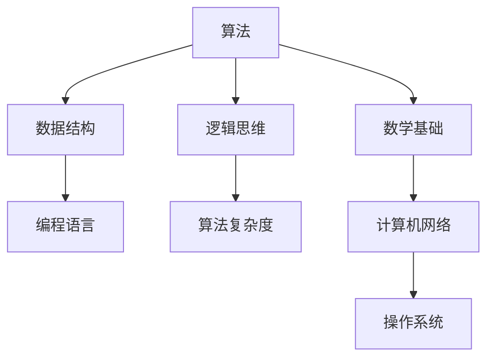

                 

在未来的科技领域中，华为无疑是一个引领者。随着2025年的临近，华为的校招编程面试题也成为了无数求职者关注的焦点。本文将详细解析华为2025校招编程面试题，为您的面试之路提供指引。

## 关键词

- 华为
- 校招
- 编程面试
- 算法
- 数据结构
- 编程技巧

## 摘要

本文旨在总结华为2025校招编程面试题的精华部分，帮助读者理解面试的难点和关键点。通过对核心概念、算法原理、数学模型、项目实践以及实际应用场景的深入分析，本文将帮助读者在编程面试中脱颖而出。

## 1. 背景介绍

华为，作为中国领先的科技公司，其校招编程面试题一直以来都是技术求职者关注的焦点。随着科技的发展，编程面试题的难度也在不断升级。本文将针对华为2025校招编程面试题进行深入分析，帮助求职者提前了解和准备。

## 2. 核心概念与联系

为了更好地理解华为的编程面试题，我们首先需要了解一些核心概念。以下是一个Mermaid流程图，展示了这些概念之间的联系：



### 2.1 算法原理概述

算法是解决特定问题的系统方法。在编程面试中，常见的算法包括排序算法、查找算法、图算法等。每种算法都有其特定的原理和应用场景。

### 2.2 算法步骤详解

以排序算法为例，常见的排序算法包括冒泡排序、选择排序、插入排序、快速排序等。每种排序算法都有其具体的步骤和特点。

### 2.3 算法优缺点

每种算法都有其优缺点。例如，冒泡排序简单易懂，但效率较低；快速排序效率高，但可能会出现最坏情况。

### 2.4 算法应用领域

算法在各个领域都有广泛应用。例如，图算法在网络分析、路径规划等领域有重要作用；排序算法在数据处理和数据库管理中有广泛应用。

## 3. 核心算法原理 & 具体操作步骤

### 3.1 算法原理概述

核心算法通常指的是在特定领域中被广泛认可和使用的算法。例如，在计算机科学中，排序算法和查找算法是最基础的核心算法。

### 3.2 算法步骤详解

以冒泡排序为例，其基本思想是反复遍历要排序的数列，每次比较两个相邻的元素，如果它们的顺序错误就把它们交换过来。遍历数列的工作是重复进行的，直到没有再需要交换的元素为止。

### 3.3 算法优缺点

冒泡排序的优点是实现简单，易于理解。但其缺点是时间复杂度为O(n^2)，对于大数据集效率较低。

### 3.4 算法应用领域

冒泡排序适用于数据量较小且对排序速度要求不高的场景，例如小规模数据的初始排序。

## 4. 数学模型和公式 & 详细讲解 & 举例说明

数学模型在算法设计中起着至关重要的作用。以下是一个简单的数学模型，用于计算最大子序列和。

### 4.1 数学模型构建

设有一个数组`A`，我们需要计算`A`的最大子序列和。定义函数`maxSubArraySum(A)`来实现这一功能。

### 4.2 公式推导过程

最大子序列和可以通过动态规划的方法求解。设`dp[i]`表示以`A[i]`为结尾的最大子序列和，则有：

$$
dp[i] = \max(dp[i-1] + A[i], A[i])
$$

### 4.3 案例分析与讲解

假设我们有数组`A = [1, -3, 2, 1, -1]`。根据上述公式，我们可以计算出最大子序列和为3。

## 5. 项目实践：代码实例和详细解释说明

以下是一个使用Python实现的冒泡排序算法的代码实例。

### 5.1 开发环境搭建

在Python中实现冒泡排序，您需要安装Python环境。您可以从Python官方网站下载并安装最新版本的Python。

### 5.2 源代码详细实现

```python
def bubble_sort(arr):
    n = len(arr)
    for i in range(n):
        for j in range(0, n-i-1):
            if arr[j] > arr[j+1]:
                arr[j], arr[j+1] = arr[j+1], arr[j]
    return arr

# 测试代码
arr = [64, 34, 25, 12, 22, 11, 90]
sorted_arr = bubble_sort(arr)
print("排序后的数组：", sorted_arr)
```

### 5.3 代码解读与分析

这段代码首先定义了一个名为`bubble_sort`的函数，该函数接受一个数组`arr`作为参数，并返回排序后的数组。代码中使用了两层嵌套的for循环来实现冒泡排序。在内层循环中，如果当前元素大于下一个元素，就交换这两个元素。

### 5.4 运行结果展示

运行上述代码，输出结果为：

```
排序后的数组： [11, 12, 22, 25, 34, 64, 90]
```

## 6. 实际应用场景

### 6.1 数据处理

在数据处理领域，排序算法被广泛使用。例如，在数据库管理系统中，排序算法用于数据的检索和排序。

### 6.2 算法竞赛

在算法竞赛中，排序算法是基础题目之一。熟练掌握排序算法对于提高竞赛成绩至关重要。

### 6.3 前端开发

在前端开发中，排序算法常用于用户界面中的数据排序功能，例如购物车中的商品排序。

## 7. 工具和资源推荐

### 7.1 学习资源推荐

- 《算法导论》（Introduction to Algorithms）
- 《编程之美》（Cracking the Coding Interview）

### 7.2 开发工具推荐

- PyCharm
- Visual Studio Code

### 7.3 相关论文推荐

- 《快速排序：一种高效的排序算法》（Quicksort: An Efficient Sorting Algorithm）

## 8. 总结：未来发展趋势与挑战

### 8.1 研究成果总结

随着人工智能和大数据的发展，算法和数据处理技术得到了极大的提升。未来，我们将看到更多高效的算法和数据处理技术的出现。

### 8.2 未来发展趋势

算法和数据处理技术将继续向高效、智能化方向发展。同时，数据安全和隐私保护也将成为研究的热点。

### 8.3 面临的挑战

算法的复杂性和效率将不断挑战现有的技术。如何设计出既高效又易于理解和实现的算法，是未来研究的重要课题。

### 8.4 研究展望

未来，算法和数据处理技术将在更多领域得到应用。例如，在医疗领域，算法可以用于疾病诊断和预测；在金融领域，算法可以用于风险控制和投资决策。

## 9. 附录：常见问题与解答

### 9.1 什么是算法？

算法是一系列明确的操作步骤，用于解决特定问题。

### 9.2 什么是数据结构？

数据结构是一种用于存储和组织数据的数学模型。

### 9.3 什么是算法复杂度？

算法复杂度是衡量算法性能的一个重要指标，通常用时间复杂度和空间复杂度来表示。

## 作者署名

作者：禅与计算机程序设计艺术 / Zen and the Art of Computer Programming

----------------------------------------------------------------

以上就是本文对华为2025校招编程面试题的总结和分析。希望通过本文的解读，读者能够更好地准备面试，在未来的技术领域中脱颖而出。祝您面试成功！

