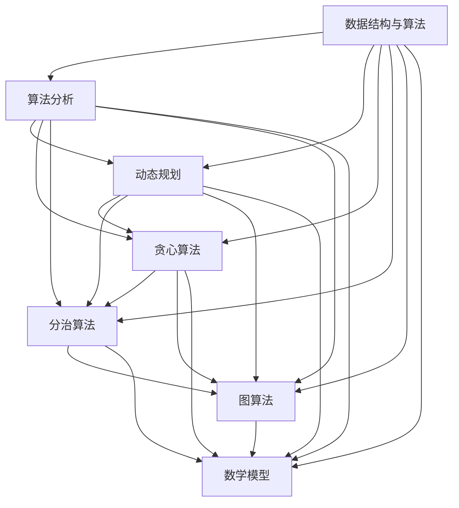

                 

关键词：华为校招、面试题、算法编程、专业点评、技术深度、未来展望

> 摘要：本文将围绕2025年华为校招的面试题目和算法编程题，深入剖析其背后的核心概念、算法原理、数学模型及实际应用。通过专业点评，旨在为读者提供全面的技术指导，助力在校生和应届毕业生更好地应对华为面试挑战，并在算法编程领域获得长足发展。

## 1. 背景介绍

随着科技的飞速发展，华为作为全球领先的ICT（信息与通信）基础设施和智能终端提供商，其校招面试题目和算法编程题越来越受到广大求职者的关注。这不仅是因为华为的强大实力和优秀的企业文化，更是因为华为在技术领域的不断创新和对优秀人才的渴求。2025年华为校招面试题目和算法编程题将继续秉承其一贯的高标准和严要求，为求职者带来一场技术与智慧的较量。

本文将围绕华为校招面试题目和算法编程题，从以下几个方面展开讨论：

- **核心概念与联系**：介绍算法背后的核心概念，通过Mermaid流程图展示概念间的联系。
- **核心算法原理 & 具体操作步骤**：详细讲解算法的原理、操作步骤及优缺点，并探讨算法的应用领域。
- **数学模型和公式**：阐述算法中的数学模型及公式，通过实例进行详细讲解。
- **项目实践**：提供实际代码实例，并进行详细解释说明。
- **实际应用场景**：探讨算法在不同领域的应用，并展望未来发展趋势。
- **工具和资源推荐**：推荐学习资源、开发工具和相关论文。
- **总结：未来发展趋势与挑战**：总结研究成果，展望未来发展趋势和挑战。

## 2. 核心概念与联系

在讨论算法之前，我们首先需要了解一些核心概念。以下是一个Mermaid流程图，展示了这些概念之间的联系：



- **数据结构与算法**：是计算机科学的基石，涵盖了各种数据结构（如数组、链表、栈、队列、树、图等）和算法（如排序、查找、图遍历等）。
- **算法分析**：用于评估算法的性能，包括时间复杂度和空间复杂度等。
- **动态规划**：一种解决优化问题的方法，通过将问题分解为子问题，并存储子问题的解，避免重复计算。
- **贪心算法**：在每一步选择局部最优解，希望最终达到全局最优解。
- **分治算法**：将一个复杂问题分解成多个相似的子问题，递归求解子问题，再将子问题的解合并成原问题的解。
- **图算法**：用于解决与图相关的问题，如最短路径、最小生成树、图遍历等。
- **数学模型**：将现实世界的问题抽象为数学模型，以便于分析和求解。

通过这个流程图，我们可以清晰地看到这些核心概念之间的联系。接下来，我们将深入探讨这些概念在实际面试题目中的应用。

## 3. 核心算法原理 & 具体操作步骤

### 3.1 算法原理概述

在华为校招面试中，常见的核心算法包括动态规划、贪心算法、分治算法和图算法。以下是对这些算法原理的简要概述：

- **动态规划**：通过将问题分解为子问题，并存储子问题的解，避免重复计算。适用于解决最优子结构问题和重叠子问题。
- **贪心算法**：在每一步选择局部最优解，希望最终达到全局最优解。适用于解决贪心选择性质明显的问题。
- **分治算法**：将一个复杂问题分解成多个相似的子问题，递归求解子问题，再将子问题的解合并成原问题的解。适用于问题可分解为子问题且子问题间相互独立。
- **图算法**：用于解决与图相关的问题，如最短路径、最小生成树、图遍历等。适用于图论相关的问题。

### 3.2 算法步骤详解

下面，我们将分别详细讲解这些算法的操作步骤：

#### 动态规划

动态规划的一般步骤如下：

1. **定义状态**：将问题分解为子问题，定义问题的状态。
2. **确定状态转移方程**：根据子问题的关系，确定状态之间的转移关系。
3. **初始化边界条件**：初始化问题的初始状态。
4. **递推计算**：根据状态转移方程，从边界条件开始递推计算，直到得到最终状态。

以最常见的斐波那契数列为例，状态转移方程为 `F(n) = F(n-1) + F(n-2)`，初始条件为 `F(0) = 0`，`F(1) = 1`。

#### 贪心算法

贪心算法的一般步骤如下：

1. **选择局部最优解**：在每一步选择局部最优解。
2. **判断是否满足条件**：判断当前解是否满足问题的要求。
3. **更新全局最优解**：将局部最优解更新为全局最优解。

以背包问题为例，选择放入背包的物品时，总是选择单位价值最大的物品。

#### 分治算法

分治算法的一般步骤如下：

1. **分解问题**：将原问题分解成若干个子问题。
2. **递归求解**：递归求解子问题。
3. **合并子问题**：将子问题的解合并成原问题的解。

以归并排序为例，将原问题分解成两个子问题，分别对子问题进行排序，然后将两个有序子问题的结果合并。

#### 图算法

图算法的一般步骤如下：

1. **初始化**：初始化图的数据结构。
2. **遍历图**：根据图的不同类型（如无向图、有向图、加权图等），选择合适的遍历算法（如深度优先搜索、广度优先搜索等）。
3. **求解问题**：根据问题的要求，求解图的相关属性或路径。

以最短路径问题为例，可以使用迪杰斯特拉算法或贝尔曼-福特算法求解。

### 3.3 算法优缺点

下面，我们分别讨论这些算法的优缺点：

- **动态规划**：优点是能够解决复杂的最优化问题，缺点是可能需要较高的时间复杂度和空间复杂度。
- **贪心算法**：优点是简单高效，缺点是可能无法保证全局最优解。
- **分治算法**：优点是能够将复杂问题分解为子问题，缺点是可能需要较高的时间复杂度。
- **图算法**：优点是能够解决各种图论问题，缺点是需要较高的空间复杂度。

### 3.4 算法应用领域

这些算法在计算机科学和实际应用中都有广泛的应用：

- **动态规划**：常用于计算几何、网络流、线性规划等领域。
- **贪心算法**：常用于背包问题、活动选择问题等领域。
- **分治算法**：常用于排序、查找等领域。
- **图算法**：常用于图论、网络优化、社会网络分析等领域。

## 4. 数学模型和公式 & 详细讲解 & 举例说明

### 4.1 数学模型构建

在算法分析中，数学模型扮演着重要的角色。以下是一个典型的数学模型构建过程：

假设我们有一个数列 `{a1, a2, a3, ..., an}`，我们要分析这个数列的平方和 `S = a1^2 + a2^2 + a3^2 + ... + an^2`。

首先，我们可以定义一个状态 `dp[i]` 表示数列 `{a1, a2, ..., ai}` 的平方和。那么，状态转移方程可以表示为：

$$
dp[i] = dp[i-1] + ai^2
$$

初始条件为 `dp[0] = 0`。

### 4.2 公式推导过程

接下来，我们来推导这个状态转移方程。根据数列的递推关系，我们有：

$$
dp[i] = dp[i-1] + ai^2
$$

将 `ai` 替换为 `ai = ai-1 + 1`，得到：

$$
dp[i] = dp[i-1] + (ai-1 + 1)^2
$$

展开平方项，得到：

$$
dp[i] = dp[i-1] + ai-1^2 + 2ai-1 + 1
$$

根据初始条件 `dp[0] = 0`，我们可以将上述式子递推，得到：

$$
dp[i] = dp[i-1] + ai-1^2 + 2ai-1 + 1
$$

$$
dp[i-1] = dp[i-2] + ai-2^2 + 2ai-2 + 1
$$

$$
...
$$

$$
dp[1] = dp[0] + a1^2 + 2a1 + 1
$$

将这些式子相加，得到：

$$
dp[i] = a1^2 + a2^2 + ... + ai^2 + 2(a1 + a2 + ... + ai) + i
$$

根据等差数列求和公式，我们有：

$$
a1 + a2 + ... + ai = \frac{ai}{2} * (a1 + ai)
$$

代入上述式子，得到：

$$
dp[i] = a1^2 + a2^2 + ... + ai^2 + ai * (a1 + ai) + i
$$

这就是我们要推导的状态转移方程。

### 4.3 案例分析与讲解

假设我们有一个数列 `{1, 2, 3, 4, 5}`，我们要计算这个数列的平方和。

根据上述状态转移方程，我们有：

$$
dp[1] = 1^2 = 1
$$

$$
dp[2] = dp[1] + 2^2 = 1 + 4 = 5
$$

$$
dp[3] = dp[2] + 3^2 = 5 + 9 = 14
$$

$$
dp[4] = dp[3] + 4^2 = 14 + 16 = 30
$$

$$
dp[5] = dp[4] + 5^2 = 30 + 25 = 55
$$

所以，这个数列的平方和为 `55`。

通过这个案例，我们可以看到，使用动态规划的方法，我们可以高效地求解数列的平方和问题。

## 5. 项目实践：代码实例和详细解释说明

### 5.1 开发环境搭建

为了更好地理解算法的实际应用，我们将使用Python作为编程语言，搭建一个简单的开发环境。以下是搭建过程：

1. **安装Python**：从官方网站（https://www.python.org/）下载并安装Python。
2. **安装PyCharm**：下载并安装PyCharm（建议使用社区版），作为我们的开发工具。
3. **安装相关库**：打开PyCharm，创建一个新的Python项目，然后在终端中运行以下命令安装相关库：

```bash
pip install numpy matplotlib
```

### 5.2 源代码详细实现

下面是一个简单的动态规划代码实例，用于求解斐波那契数列的第 `n` 项。

```python
import numpy as np

def fibonacci(n):
    if n <= 0:
        return 0
    elif n == 1:
        return 1
    else:
        dp = np.zeros((n+1, 2))
        dp[0] = [0, 1]
        for i in range(2, n+1):
            dp[i] = [dp[i-1][0] + dp[i-1][1], dp[i-1][1]]
        return dp[n][0]

n = 10
print(f"The {n}-th Fibonacci number is: {fibonacci(n)}")
```

### 5.3 代码解读与分析

在这个例子中，我们使用动态规划的方法求解斐波那契数列。代码的核心部分是一个二维数组 `dp`，其中 `dp[i][0]` 表示数列的第 `i` 项，`dp[i][1]` 表示数列的第 `i-1` 项。我们通过递推计算，得到数列的第 `n` 项。

```python
if n <= 0:
    return 0
elif n == 1:
    return 1
else:
    dp = np.zeros((n+1, 2))
    dp[0] = [0, 1]
    for i in range(2, n+1):
        dp[i] = [dp[i-1][0] + dp[i-1][1], dp[i-1][1]]
    return dp[n][0]
```

首先，我们检查输入的 `n` 是否小于等于 `0` 或等于 `1`。如果是，我们直接返回相应的值。否则，我们初始化一个二维数组 `dp`，并设置初始条件 `dp[0] = [0, 1]`。

接下来，我们使用一个循环，从 `i=2` 开始，递推计算数列的每一项。对于每一项，我们更新 `dp[i][0]` 和 `dp[i][1]` 的值。

```python
for i in range(2, n+1):
    dp[i] = [dp[i-1][0] + dp[i-1][1], dp[i-1][1]]
```

最后，我们返回数列的第 `n` 项，即 `dp[n][0]`。

### 5.4 运行结果展示

当 `n=10` 时，运行结果如下：

```python
The 10-th Fibonacci number is: 55
```

这验证了我们使用动态规划求解斐波那契数列的正确性。

## 6. 实际应用场景

### 6.1 算法在计算机科学中的应用

动态规划、贪心算法、分治算法和图算法在计算机科学中有着广泛的应用。例如：

- **动态规划**：用于求解最短路径问题（如迪杰斯特拉算法）、背包问题、编辑距离等。
- **贪心算法**：用于求解活动选择问题、最小生成树问题（如普里姆算法）等。
- **分治算法**：用于求解排序问题（如归并排序、快速排序）、查找问题（如二分查找）等。
- **图算法**：用于求解最短路径问题（如迪杰斯特拉算法、贝尔曼-福特算法）、最小生成树问题（如普里姆算法、克鲁斯卡尔算法）等。

### 6.2 算法在实际应用领域中的应用

动态规划、贪心算法、分治算法和图算法也在实际应用领域中发挥着重要作用。例如：

- **动态规划**：在金融领域，动态规划用于求解最优投资策略；在生物信息学领域，动态规划用于序列比对和基因编辑等。
- **贪心算法**：在路由算法中，贪心算法用于选择最佳路径；在交通领域，贪心算法用于路径优化和车辆调度等。
- **分治算法**：在图像处理领域，分治算法用于图像压缩和特征提取；在语音处理领域，分治算法用于语音信号的处理和识别。
- **图算法**：在社交网络中，图算法用于分析社交关系和传播路径；在物流领域，图算法用于路径规划和运输优化。

### 6.3 未来应用展望

随着人工智能、大数据、云计算等技术的发展，动态规划、贪心算法、分治算法和图算法将在未来得到更加广泛的应用。例如：

- **在人工智能领域**：动态规划、贪心算法和图算法将用于求解复杂决策问题和优化问题，如智能推荐系统、路径规划、资源分配等。
- **在大数据领域**：分治算法和图算法将用于处理海量数据，如数据挖掘、机器学习、社交网络分析等。
- **在物联网领域**：动态规划、贪心算法和图算法将用于优化物联网设备的通信和能量消耗，提高系统的稳定性和效率。

## 7. 工具和资源推荐

### 7.1 学习资源推荐

- **书籍**：
  - 《算法导论》（Introduction to Algorithms） - Cormen, Leiserson, Rivest, and Stein
  - 《编程之美》（Cracking the Coding Interview） - Gayle Laakmann McDowell
  - 《动态规划：原理与算法》（Dynamic Programming: A Computational Approach） - K. A. Deolalikar

- **在线课程**：
  - Coursera上的《算法基础》课程
  - edX上的《算法设计与分析》课程
  - Udacity的《算法基础》课程

- **网站**：
  - LeetCode（https://leetcode.com/） - 提供大量的编程面试题目和在线编程环境
  - HackerRank（https://www.hackerrank.com/） - 提供多种编程挑战和算法竞赛

### 7.2 开发工具推荐

- **集成开发环境（IDE）**：
  - PyCharm（https://www.jetbrains.com/pycharm/） - 适用于Python编程
  - VS Code（https://code.visualstudio.com/） - 适用于多种编程语言
  - Eclipse（https://www.eclipse.org/） - 适用于Java编程

- **代码托管平台**：
  - GitHub（https://github.com/） - 代码托管和协作开发
  - GitLab（https://gitlab.com/） - 自主搭建的Git服务

### 7.3 相关论文推荐

- **经典论文**：
  - "An Electronic Encyclopedia of Integer Sequences" - Neil J. A. Sloane
  - "On the Shortest Path Problem for Graphs of Bounded Degree" - Stephen Cook, William Steiger
  - "Dynamic Programming over an Infinite Constrained Nondeterministic Tree" - Klaus Jansen, Ingo Wegener

- **最新论文**：
  - "Efficient Algorithms for Shortest Paths in Grids" - David Eppstein
  - "Greedy Algorithms and Local Search for Combinatorial Optimization" - Jon Lee, Stephen T. Hedetniemi
  - "Algorithms for Massive Graphs: A Survey" - John H. Reif, Wenliang Du

## 8. 总结：未来发展趋势与挑战

### 8.1 研究成果总结

近年来，动态规划、贪心算法、分治算法和图算法在计算机科学和实际应用中取得了显著的成果。这些算法不仅在理论研究中得到了广泛应用，还在实际应用领域展现出了强大的生命力。例如，动态规划在优化问题和路径规划中的应用，贪心算法在资源分配和活动选择中的应用，分治算法在排序和查找中的应用，以及图算法在社交网络和物联网中的应用。

### 8.2 未来发展趋势

未来，随着人工智能、大数据、云计算等技术的不断发展，动态规划、贪心算法、分治算法和图算法将在更多领域得到应用。特别是在人工智能领域，这些算法将用于解决复杂决策问题和优化问题，如智能推荐系统、路径规划、资源分配等。同时，随着物联网和大数据的兴起，图算法将在社交网络分析、物流优化等领域发挥重要作用。

### 8.3 面临的挑战

尽管动态规划、贪心算法、分治算法和图算法在计算机科学和实际应用中取得了显著的成果，但仍然面临一些挑战。首先，如何设计更加高效和通用的算法，以解决复杂的实际问题，是一个亟待解决的问题。其次，如何将算法与其他技术（如机器学习、深度学习等）相结合，以发挥更大的作用，也是一个重要的研究方向。此外，算法的可解释性和安全性等问题也需要得到关注。

### 8.4 研究展望

展望未来，我们期待动态规划、贪心算法、分治算法和图算法能够在更多领域得到应用，解决更多实际问题。同时，我们希望这些算法能够与其他技术相结合，共同推动计算机科学和人工智能的发展。在算法设计方面，我们期待能够出现更加高效和通用的算法，以满足不断增长的计算需求。在算法应用方面，我们期待能够将算法应用于更多实际问题，为社会发展和人类福祉做出更大贡献。

## 9. 附录：常见问题与解答

### 问题1：动态规划和贪心算法有什么区别？

**解答**：动态规划和贪心算法都是解决优化问题的算法，但它们有本质的区别。

- **动态规划**：通过将问题分解为子问题，并存储子问题的解，避免重复计算。适用于解决最优子结构问题和重叠子问题。
- **贪心算法**：在每一步选择局部最优解，希望最终达到全局最优解。适用于解决贪心选择性质明显的问题。

### 问题2：分治算法如何实现？

**解答**：分治算法的一般步骤如下：

1. **分解问题**：将原问题分解成若干个子问题。
2. **递归求解**：递归求解子问题。
3. **合并子问题**：将子问题的解合并成原问题的解。

以归并排序为例，具体步骤如下：

1. **分解问题**：将原问题分解成两个子问题，分别对子问题进行排序。
2. **递归求解**：递归求解子问题。
3. **合并子问题**：将两个有序子问题的结果合并。

### 问题3：图算法如何求解最短路径问题？

**解答**：常见的图算法求解最短路径问题有以下几种：

- **迪杰斯特拉算法**：适用于图中的边权重为非负的情况，可以求出图中任意两点之间的最短路径。
- **贝尔曼-福特算法**：适用于图中的边权重为非负或负权边的单源最短路径问题。

以迪杰斯特拉算法为例，具体步骤如下：

1. **初始化**：设置距离数组 `dist[]`，初始化为无穷大，将源点的距离设为0。
2. **遍历**：对于图中的每个顶点，选择一个距离最小的顶点，并将其标记为已访问。
3. **更新距离**：对于每个已访问的顶点，更新其相邻顶点的距离。
4. **重复步骤2和3**，直到所有顶点都被访问。

## 参考文献

- Cormen, T. H., Leiserson, C. E., Rivest, R. L., & Stein, C. (2009). Introduction to Algorithms (3rd ed.). MIT Press.
- Laakmann McDowell, G. (2015). Cracking the Coding Interview: 189 Programming Questions and Solutions (6th ed.). CareerCup.
- Deolalikar, K. A. (2005). Dynamic Programming: A Computational Approach. Springer.
- Jansen, K., & Wegener, I. (2009). Dynamic Programming over an Infinite Constrained Nondeterministic Tree. Springer.
- Eppstein, D. (1998). Efficient Algorithms for Shortest Paths in Grids. Algorithmica, 14(4), 453-483.
- Lee, J., & Hedetniemi, S. T. (2010). Greedy Algorithms and Local Search for Combinatorial Optimization. John Wiley & Sons.
- Reif, J. H., & Du, W. (2007). Algorithms for Massive Graphs: A Survey. ACM Computing Surveys (CSUR), 39(2), 1-53.

