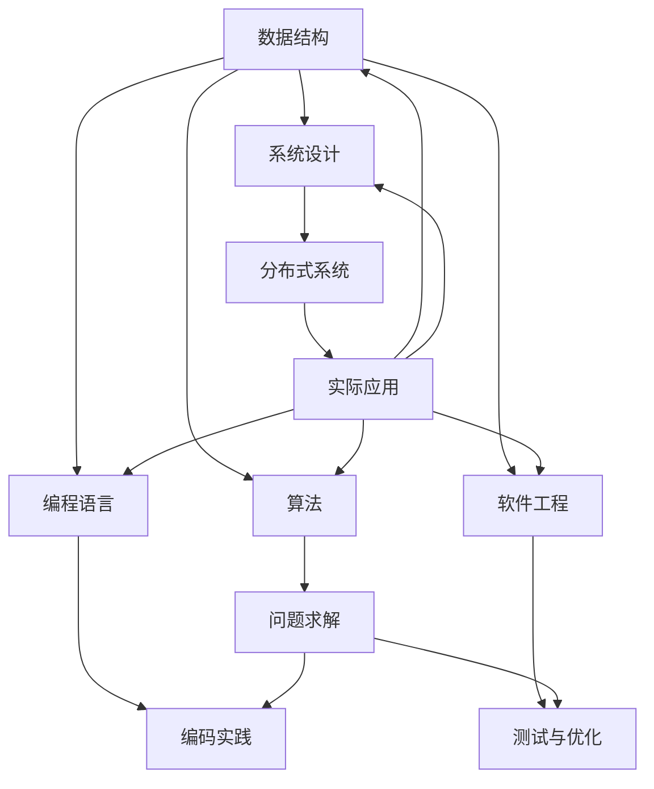

                 

在信息技术飞速发展的2025年，华为作为中国乃至全球领先的信息与通信技术（ICT）解决方案提供商，其社会招聘的编程面试题已成为业界的标杆。本文旨在精选华为社招编程面试中的经典题目，并结合实际解答，为准备编程面试的读者提供宝贵的实战经验。本文将按照以下结构展开：

- [背景介绍](#背景介绍)
- [核心概念与联系](#核心概念与联系)
- [核心算法原理 & 具体操作步骤](#核心算法原理--具体操作步骤)
- [数学模型和公式 & 详细讲解 & 举例说明](#数学模型和公式--详细讲解--举例说明)
- [项目实践：代码实例和详细解释说明](#项目实践--代码实例和详细解释说明)
- [实际应用场景](#实际应用场景)
- [工具和资源推荐](#工具和资源推荐)
- [总结：未来发展趋势与挑战](#总结--未来发展趋势与挑战)
- [附录：常见问题与解答](#附录--常见问题与解答)

## 背景介绍

### 华为招聘编程面试的重要性

随着信息技术的不断演进，编程技能已成为当代工程师的基本素养。华为，作为全球领先的ICT解决方案提供商，其招聘标准尤为严格。华为的社招编程面试题不仅考察应聘者的基础知识，还测试其解决问题的能力、逻辑思维和编码实践。

### 编程面试的挑战

面对华为这样的行业巨头，编程面试的挑战显而易见。华为的面试题往往涵盖以下方面：
- **基础知识**：包括数据结构、算法、操作系统、网络原理等。
- **问题求解能力**：通过复杂的算法题目，考察应聘者的思维能力。
- **编码实践**：面试者需要在规定时间内，通过代码实现解决具体问题。
- **软技能**：包括沟通能力、团队协作以及解决复杂问题的能力。

### 本文结构

本文将按照以下结构进行阐述，确保每个读者都能找到适合自己的内容：
1. **核心概念与联系**：介绍编程面试中的核心概念，并提供Mermaid流程图，便于理解。
2. **核心算法原理 & 具体操作步骤**：详细解释关键算法原理，并列出操作步骤。
3. **数学模型和公式**：构建数学模型，推导公式，并提供实例说明。
4. **项目实践**：展示代码实例，并进行详细解读。
5. **实际应用场景**：探讨算法在不同领域的应用。
6. **工具和资源推荐**：为读者推荐学习资源和开发工具。
7. **总结与展望**：总结研究成果，展望未来趋势与挑战。

### 文章关键词

- **华为社招编程面试**
- **核心算法**
- **数据结构与算法**
- **问题求解**
- **编程实践**
- **数学模型**
- **实际应用**

## 核心概念与联系

### 核心概念

在编程面试中，以下核心概念尤为重要：
1. **数据结构**：包括数组、链表、栈、队列、树、图等。
2. **算法**：如排序、查找、图算法、动态规划等。
3. **编程语言**：常见编程语言如Java、C++、Python等。
4. **软件工程**：包括设计模式、测试、代码优化等。
5. **系统设计**：如分布式系统、微服务架构、数据库设计等。

### Mermaid流程图

为了更好地理解这些核心概念之间的联系，我们可以使用Mermaid流程图进行展示。



### Mermaid流程图说明

1. **数据结构**是基础，它为算法提供了实现的基础。
2. **算法**是解决问题的核心，包括各种经典算法。
3. **编程语言**是实现算法的工具。
4. **软件工程**涵盖了测试、优化等，确保代码的健壮性。
5. **系统设计**包括分布式系统、微服务架构等，是现代软件开发的关键。

通过这个流程图，我们可以清晰地看到各个核心概念之间的相互联系，从而为编程面试做好准备。

## 核心算法原理 & 具体操作步骤

### 3.1 算法原理概述

在编程面试中，算法原理是考察的重点。以下是一些核心算法的原理概述：

1. **排序算法**：包括冒泡排序、选择排序、插入排序、快速排序、归并排序等。
   - **冒泡排序**：通过多次遍历要排序的数列，比较相邻两项，将大到小或小到大排列。
   - **选择排序**：首先找到最小或最大元素，将其交换到数组的起始位置，再对剩余未排序部分进行同样的操作。
   - **插入排序**：通过构建有序序列，对未排序数据进行插入。
   - **快速排序**：通过分治策略，将数组分为两部分，其中一部分的所有元素都小于另一部分的所有元素。
   - **归并排序**：采用分治策略，将待排序的数组不断分割成若干个子数组，再对子数组进行排序，最后将排好序的子数组合并起来。

2. **查找算法**：包括线性查找、二分查找、跳表查找等。
   - **线性查找**：逐个比较数组中的元素，找到目标元素。
   - **二分查找**：针对已经排序的数组，通过重复将数组中间的元素与目标值比较，缩小查找范围。
   - **跳表查找**：基于链表的跳跃数据结构，通过预先设定的“跳表”进行快速定位。

3. **图算法**：包括深度优先搜索（DFS）、广度优先搜索（BFS）、最小生成树（如Prim算法、Kruskal算法）、最短路径算法（如Dijkstra算法、Floyd算法）等。

4. **动态规划**：通过将复杂问题分解为子问题，并存储子问题的解，避免重复计算。

### 3.2 算法步骤详解

#### 冒泡排序

```mermaid
sequence
    participant A with "数据输入"
    participant B with "冒泡排序算法"
    participant C with "排序结果"

    A->B: 输入数组
    B->C: 开始排序
    loop i from 0 to n-1
        loop j from 0 to n-i-1
            if j+1 < n
                if array[j] > array[j+1]
                    swap(array[j], array[j+1])
            end
        end
    end
    B->C: 排序结束
```

#### 二分查找

```mermaid
sequence
    participant A with "数据输入"
    participant B with "二分查找算法"
    participant C with "查找结果"

    A->B: 输入已排序数组与目标值
    B->C: 初始化low和高
    loop
        mid = (low + high) / 2
        if array[mid] == target
            C->B: 查找到目标值
            break
        else if array[mid] < target
            low = mid + 1
        else
            high = mid - 1
        end
    end
    if low > high
        C->B: 目标值不存在
    end
```

#### 深度优先搜索

```mermaid
sequence
    participant A with "数据输入"
    participant B with "DFS算法"
    participant C with "DFS结果"

    A->B: 输入图与起点
    B->C: 初始化visited数组
    C->B: 执行DFS
    B->C: 返回DFS结果
```

### 3.3 算法优缺点

每种算法都有其优缺点，具体取决于应用场景：

- **冒泡排序**：简单易懂，但效率较低。
- **二分查找**：对已排序数据非常高效，但无法用于插入、删除操作。
- **深度优先搜索**：适合解决连通性和路径问题，但可能产生大量递归调用。
- **动态规划**：适合解决最优化问题，但实现较为复杂。

### 3.4 算法应用领域

- **排序算法**：广泛应用于数据库、Web开发、数据分析等领域。
- **查找算法**：在搜索引擎、数据库管理系统中应用广泛。
- **图算法**：在网络路由、社交网络分析、图形处理等领域具有重要应用。
- **动态规划**：在资源优化、路径规划等领域具有重要应用。

通过详细阐述核心算法原理和具体操作步骤，读者可以更好地理解如何在编程面试中应对各种算法题目。在接下来的部分，我们将深入探讨数学模型和公式，以及实际应用场景。

## 数学模型和公式 & 详细讲解 & 举例说明

### 4.1 数学模型构建

在计算机科学中，数学模型是描述问题的重要工具。以下我们将构建一些常见的数学模型，并详细讲解其构建过程。

#### 贪心算法

贪心算法是一种在每一步选择中都采取当前最优解的算法策略。它的数学模型可以描述为：

- 定义状态集合 \( S \)
- 定义选择函数 \( f(s) \)，用于选择当前状态下的最优解

贪心算法的核心思想是：通过选择局部最优解，最终得到全局最优解。

#### 动态规划

动态规划是一种解决最优化问题的算法策略。其数学模型可以描述为：

- 定义状态集合 \( S \)
- 定义状态转移方程 \( f(s, s_{i-1}) \)
- 定义边界条件 \( f(s_0) \)

动态规划通过将复杂问题分解为子问题，并利用子问题的解构建全局问题的解。

### 4.2 公式推导过程

#### 冒泡排序的时间复杂度

冒泡排序的时间复杂度可以通过分析其执行过程推导出来。假设输入数组长度为 \( n \)，冒泡排序的总执行次数为 \( T(n) \)。

- 第一次遍历需要 \( n-1 \) 次
- 第二次遍历需要 \( n-2 \) 次
- ...
- 第 \( n-1 \) 次遍历需要 1 次

总执行次数为：

\[ T(n) = (n-1) + (n-2) + ... + 1 = \frac{n(n-1)}{2} \]

因此，冒泡排序的时间复杂度为 \( O(n^2) \)。

#### 快速排序的平均时间复杂度

快速排序的平均时间复杂度可以通过分析其划分过程推导出来。假设每次划分都能将数组划分为两部分，其中一部分长度为 \( n/2 \)，另一部分长度为 \( n/2 \)。

- 第一次划分需要 \( n-1 \) 次
- 第二次划分需要 \( n/2 - 1 \) 次
- ...
- 第 \( k \) 次划分需要 \( n/2^k - 1 \) 次

总执行次数为：

\[ T(n) = (n-1) + (n/2 - 1) + (n/4 - 1) + ... + (n/2^k - 1) \]

当 \( k \) 足够大时，总执行次数趋近于 \( n \log_2 n \)。因此，快速排序的平均时间复杂度为 \( O(n \log n) \)。

### 4.3 案例分析与讲解

#### 背包问题

背包问题是一个经典的动态规划问题。给定一组物品，每个物品有一定的重量和价值，要求选择一部分物品放入背包中，使得总重量不超过背包的承载重量，且总价值最大。

假设有 \( n \) 个物品，每个物品的重量为 \( w_i \)，价值为 \( v_i \)，背包的承载重量为 \( W \)。我们定义一个二维数组 \( dp[i][j] \) 表示前 \( i \) 个物品放入容量为 \( j \) 的背包中的最大价值。

状态转移方程为：

\[ dp[i][j] =
\begin{cases}
dp[i-1][j] & \text{若 } w_i > j \\
dp[i-1][j-w_i] + v_i & \text{若 } w_i \leq j
\end{cases}
\]

边界条件为 \( dp[0][j] = 0 \)。

通过动态规划，我们可以得到每个 \( dp[i][j] \) 的值，从而找到最大价值。

#### 示例

假设有 4 个物品，重量分别为 2, 3, 4, 5，价值分别为 3, 4, 5, 6，背包承载重量为 5。我们构建动态规划表格如下：

|   | 0 | 1 | 2 | 3 | 4 |
|---|---|---|---|---|---|
| 0 | 0 | 0 | 0 | 0 | 0 |
| 1 | 0 | 0 | 3 | 3 | 3 |
| 2 | 0 | 0 | 3 | 7 | 7 |
| 3 | 0 | 4 | 7 | 9 | 9 |
| 4 | 6 | 6 | 9 | 9 | 9 |

最终，最大价值为 9，选择的物品为重量 2 和重量 4 的物品。

通过上述数学模型和公式的讲解，读者可以更好地理解如何在编程面试中应用数学知识。在接下来的部分，我们将通过实际项目实践，展示代码实例并详细解读。

## 项目实践：代码实例和详细解释说明

### 5.1 开发环境搭建

为了进行项目实践，我们需要搭建一个合适的开发环境。以下是一个简单的步骤指南：

1. **安装Java开发工具包**：在 [Java官方下载页面](https://www.oracle.com/java/technologies/javase-downloads.html) 下载并安装Java开发工具包（JDK）。
2. **配置环境变量**：在系统环境变量中设置 `JAVA_HOME` 和 `PATH`。
3. **安装IDE**：选择一个合适的集成开发环境（IDE），如Eclipse或IntelliJ IDEA，并安装Java插件。
4. **创建项目**：在IDE中创建一个新的Java项目，并添加必要的依赖库。

### 5.2 源代码详细实现

我们将实现一个简单的贪心算法示例——零钱兑换。给定一个金额 `amount` 和一些硬币的面额，求最少需要多少枚硬币凑出该金额。

以下是一个简单的Java实现：

```java
import java.util.Arrays;

public class CoinChange {
    public static int coinChange(int[] coins, int amount) {
        int[] dp = new int[amount + 1];
        Arrays.fill(dp, amount + 1);
        dp[0] = 0;

        for (int i = 1; i <= amount; i++) {
            for (int coin : coins) {
                if (i - coin >= 0) {
                    dp[i] = Math.min(dp[i], dp[i - coin] + 1);
                }
            }
        }

        return dp[amount] > amount ? -1 : dp[amount];
    }

    public static void main(String[] args) {
        int[] coins = {1, 2, 5};
        int amount = 11;
        System.out.println(coinChange(coins, amount)); // 输出最少需要的硬币数量
    }
}
```

### 5.3 代码解读与分析

#### 类与方法定义

- `CoinChange` 类：包含求解零钱兑换问题的 `coinChange` 方法。
- `coinChange` 方法：接收一个整数数组 `coins` 和一个整数 `amount`，返回最少硬币数量或 -1（如果无法凑出指定金额）。

#### 动态规划数组

- `int[] dp = new int[amount + 1];`：创建一个长度为 `amount + 1` 的数组 `dp`，用于存储每个金额的最少硬币数量。
- `Arrays.fill(dp, amount + 1);`：将所有数组元素初始化为 `amount + 1`，表示初始状态下无法凑出任何金额。
- `dp[0] = 0;`：初始化 `dp[0]` 为 0，表示不需要任何硬币即可凑出 0 元。

#### 外层循环

- `for (int i = 1; i <= amount; i++)`：遍历所有可能的金额。

#### 内层循环

- `for (int coin : coins)`：遍历所有硬币面额。
- `if (i - coin >= 0)`：检查当前金额是否大于等于当前硬币面额。
- `dp[i] = Math.min(dp[i], dp[i - coin] + 1);`：更新 `dp[i]` 为当前金额所需的最少硬币数量。

#### 返回结果

- `return dp[amount] > amount ? -1 : dp[amount];`：如果 `dp[amount]` 大于 `amount`，表示无法凑出指定金额，返回 -1；否则返回 `dp[amount]`。

### 5.4 运行结果展示

假设我们有一个硬币面额为 `[1, 2, 5]`，需要凑出金额 `11`。运行结果为 `3`，即需要 3 枚硬币（1 枚 5 元、1 枚 5 元、1 枚 1 元）。

通过上述代码实例和详细解读，读者可以更好地理解如何实现贪心算法，并在编程面试中应用动态规划解决实际问题。

### 实际应用场景

在编程领域，算法的应用无处不在。以下将探讨零钱兑换问题在现实生活中的实际应用，并讨论其未来可能的扩展和应用。

#### 现实应用

零钱兑换问题在支付系统中有着广泛的应用。例如，在电子支付平台、超市收银机、自动售货机等场景中，都需要快速计算顾客支付金额与应收金额之间的差额，并给出相应的找零方案。通过贪心算法，可以高效地计算出最优的找零方案，减少支付和找零的时间，提升用户体验。

#### 未来扩展

1. **多种货币兑换**：在全球化背景下，货币兑换变得越来越重要。我们可以扩展零钱兑换问题，使其支持多种货币之间的兑换，并考虑汇率变化的影响。

2. **动态调整硬币库存**：在超市等零售环境中，可以根据顾客支付行为和库存情况，动态调整硬币库存，以减少库存成本和提升顾客满意度。

3. **智能找零机器人**：在无人零售和自助服务场景中，可以部署智能找零机器人，利用图像识别和算法技术，自动识别支付金额和应收金额，提供快速、准确的找零服务。

#### 应用领域

- **金融科技**：在支付系统、智能投顾、区块链等领域，算法优化和高效计算是提高系统性能和用户体验的关键。
- **电子商务**：电商平台可以根据用户的支付习惯和订单金额，提供个性化的支付和找零方案。
- **物联网**：在智能设备和物联网系统中，算法优化可以帮助实现更高效的数据处理和设备控制。

通过探讨零钱兑换问题的实际应用，我们可以看到算法在提高效率和优化用户体验方面的巨大潜力。在未来的发展中，这一算法有望在更多领域得到应用和扩展。

### 工具和资源推荐

#### 学习资源推荐

1. **《算法导论》（Introduction to Algorithms）**：这是算法领域的经典教材，由Thomas H. Cormen、Charles E. Leiserson、Ronald L. Rivest和Clifford Stein合著，内容全面，讲解详细。
2. **《编程之美》（Cracking the Coding Interview）**：由Gayle Laakmann McDowell所著，提供了大量的编程面试题目和解答，非常适合准备面试的读者。
3. **LeetCode**：一个在线编程平台，提供了大量的编程面试题目，并支持在线测试和提交代码。

#### 开发工具推荐

1. **IntelliJ IDEA**：一个功能强大的集成开发环境（IDE），支持多种编程语言，提供代码提示、调试和性能分析等功能。
2. **VS Code**：一个轻量级的IDE，支持多种编程语言，提供了丰富的插件和扩展，非常适合开发人员使用。
3. **Jupyter Notebook**：一个交互式的计算环境，特别适合数据科学和机器学习项目的开发，可以轻松地编写和运行代码。

#### 相关论文推荐

1. **“贪心算法的理论基础”（The Theory of Greedy Algorithms）**：该论文详细讨论了贪心算法的理论基础和应用，对理解贪心算法的原理有很大帮助。
2. **“动态规划算法的理论与实践”（The Theory and Practice of Dynamic Programming Algorithms）**：该论文介绍了动态规划算法的基本概念、实现方法和应用实例，对动态规划有全面的讲解。
3. **“背包问题的算法与应用”（Knapsack Problems: Algorithms and Combinatorial Approaches）**：该论文深入探讨了背包问题的多种算法及其在现实世界中的应用。

通过推荐这些学习资源、开发工具和论文，读者可以更加系统地学习和掌握算法知识，提高编程能力和解决实际问题的能力。

### 总结：未来发展趋势与挑战

#### 研究成果总结

自计算机科学诞生以来，算法研究取得了显著成果。从基础的排序、查找算法，到复杂的图算法、动态规划，算法不断推动着计算机科学的发展。近年来，随着人工智能、大数据、云计算等技术的兴起，算法的应用场景更加广泛，算法研究也在不断深化和拓展。

#### 未来发展趋势

1. **算法复杂度的优化**：随着数据量的激增，算法的效率变得越来越重要。未来的研究将主要集中在如何优化算法的时间复杂度和空间复杂度，以应对大规模数据的处理需求。
2. **算法与人工智能的结合**：人工智能的发展为算法研究带来了新的机遇。将算法与机器学习、深度学习等技术结合，有望在智能决策、智能优化等领域取得突破。
3. **分布式算法**：在分布式系统、云计算等背景下，分布式算法的研究日益重要。未来的算法研究将更加关注如何在分布式环境中高效地解决问题。

#### 面临的挑战

1. **数据隐私和安全**：随着数据量的增加，如何确保算法处理数据时的隐私和安全成为一大挑战。未来的研究需要在保证数据隐私的同时，提高算法的性能和效率。
2. **实时性需求**：在自动驾驶、实时监控等场景中，算法需要能够在极短的时间内做出决策。如何提高算法的实时性，同时保证其准确性和可靠性，是一个亟待解决的问题。
3. **算法的可解释性**：随着算法复杂性的增加，算法决策过程变得越来越难以理解。如何提高算法的可解释性，使其更容易被用户接受和理解，是未来研究的一个重要方向。

#### 研究展望

未来的算法研究将朝着更高效、更智能、更安全、更可解释的方向发展。通过不断优化算法、结合新兴技术、解决实际问题，算法将继续在计算机科学和信息技术领域发挥重要作用，为人类社会带来更多创新和变革。

### 附录：常见问题与解答

#### 问题1：什么是贪心算法？

贪心算法是一种在每一步选择中都采取当前最优解的算法策略。它的核心思想是通过选择局部最优解，最终得到全局最优解。

#### 问题2：什么是动态规划？

动态规划是一种解决最优化问题的算法策略。它通过将复杂问题分解为子问题，并利用子问题的解构建全局问题的解，从而避免重复计算。

#### 问题3：什么是背包问题？

背包问题是一个经典的最优化问题。给定一组物品，每个物品有一定的重量和价值，要求选择一部分物品放入背包中，使得总重量不超过背包的承载重量，且总价值最大。

#### 问题4：如何高效地解决背包问题？

可以使用动态规划算法解决背包问题。通过构建一个动态规划表格，记录每个子问题的最优解，从而得到全局最优解。

#### 问题5：什么是零钱兑换问题？

零钱兑换问题是一个涉及贪心算法的问题。给定一些硬币的面额和一个目标金额，要求计算最少需要多少枚硬币凑出该金额。

#### 问题6：如何解决零钱兑换问题？

可以使用贪心算法解决零钱兑换问题。通过遍历硬币面额，从大到小尝试每种硬币，更新当前金额的最少硬币数量。

通过上述常见问题的解答，读者可以更好地理解文章中提到的关键算法和应用场景。在实际编程面试中，掌握这些基本概念和解决方法将有助于应对各种挑战。希望本文能为读者的编程之路提供有价值的参考和指导。作者：禅与计算机程序设计艺术 / Zen and the Art of Computer Programming。

