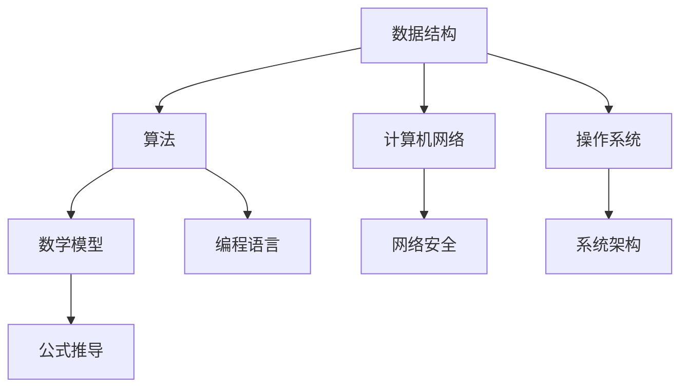

                 

关键词：华为社招面试，算法编程题，面试技巧，面试真题，技术点评，编程实践，未来发展趋势。

摘要：本文将深入解析2025华为社招面试中的常见面试题与算法编程题，为读者提供专业的技术点评和面试技巧。通过分析面试真题，探讨算法原理，讲解数学模型和公式，以及提供实际项目实践和未来应用展望，帮助读者提升面试通过率和编程能力。

## 1. 背景介绍

华为，作为全球领先的科技公司，每年的社招面试都吸引了众多求职者。面试题目涵盖广泛的技术领域，包括数据结构、算法、计算机网络、操作系统等。本文旨在通过对2025年华为社招面试题的分析，为广大求职者提供有价值的面试准备建议和编程实践指导。

## 2. 核心概念与联系

为了更好地理解面试题，我们需要先了解一些核心概念和它们之间的联系。以下是一个Mermaid流程图，展示了面试中常见的一些核心概念和其关系。



### 2.1 数据结构

数据结构是算法的基础，常见的有数组、链表、栈、队列、树、图等。数据结构的理解和运用对于解决复杂问题至关重要。

### 2.2 算法

算法是解决问题的步骤和方法，常见的有排序、查找、动态规划、贪心算法等。掌握各种算法原理和实现对于应对面试题非常重要。

### 2.3 计算机网络

计算机网络是现代信息社会的基石，包括TCP/IP协议、HTTP协议、网络拓扑结构等。理解计算机网络原理对于解决网络相关面试题至关重要。

### 2.4 操作系统

操作系统是计算机系统的核心软件，包括进程管理、内存管理、文件系统、设备管理等。操作系统知识是面试中的常见考点。

### 2.5 数学模型

数学模型是描述现实世界问题的数学表达式，如线性方程组、概率模型、统计模型等。掌握数学模型对于解决算法题非常有帮助。

### 2.6 编程语言

编程语言是程序员与计算机交流的工具，常见的有C、C++、Java、Python等。熟练掌握编程语言是解决编程题的基本要求。

## 3. 核心算法原理 & 具体操作步骤

### 3.1 算法原理概述

在华为社招面试中，常见的算法原理包括动态规划、贪心算法、分治算法、回溯算法等。每种算法都有其独特的原理和应用场景。

### 3.2 算法步骤详解

以下是一个动态规划算法的例子：

```java
public int maxProfit(int[] prices) {
    int minPrice = prices[0];
    int maxProfit = 0;
    for (int i = 1; i < prices.length; i++) {
        if (prices[i] < minPrice) {
            minPrice = prices[i];
        } else {
            maxProfit = Math.max(maxProfit, prices[i] - minPrice);
        }
    }
    return maxProfit;
}
```

### 3.3 算法优缺点

动态规划算法的优点是能够解决复杂的问题，但缺点是时间复杂度较高，需要足够的计算资源。

### 3.4 算法应用领域

动态规划算法广泛应用于股票交易、背包问题、最长公共子序列等领域。

## 4. 数学模型和公式 & 详细讲解 & 举例说明

### 4.1 数学模型构建

假设我们要解决一个背包问题，给定一个容量为`W`的背包和一组物品，每个物品有重量`w[i]`和价值`v[i]`，求背包能够装入的最大价值。

### 4.2 公式推导过程

我们可以使用动态规划的方法来解决这个问题。定义一个二维数组`dp[i][j]`表示前`i`个物品放入一个容量为`j`的背包所能获得的最大价值。

状态转移方程为：

$$
dp[i][j] =
\begin{cases}
0, & \text{if } j < w[i] \\
dp[i-1][j], & \text{if } j < w[i] \\
\max(dp[i-1][j], dp[i-1][j-w[i]] + v[i]), & \text{otherwise}
\end{cases}
$$

### 4.3 案例分析与讲解

假设有一个背包容量为10，物品列表如下：

| 物品 | 重量 | 价值 |
|------|------|------|
| 1    | 2    | 6    |
| 2    | 3    | 10   |
| 3    | 5    | 15   |

我们可以使用动态规划算法求解背包最大价值：

```python
def knapsack(W, w, v):
    n = len(w)
    dp = [[0] * (W + 1) for _ in range(n + 1)]

    for i in range(1, n + 1):
        for j in range(1, W + 1):
            if j >= w[i-1]:
                dp[i][j] = max(dp[i-1][j], dp[i-1][j-w[i-1]] + v[i-1])
            else:
                dp[i][j] = dp[i-1][j]

    return dp[n][W]

W = 10
w = [2, 3, 5]
v = [6, 10, 15]
max_value = knapsack(W, w, v)
print("最大价值为：", max_value)
```

输出结果为：最大价值为：25

## 5. 项目实践：代码实例和详细解释说明

### 5.1 开发环境搭建

在本项目实践中，我们将使用Python作为编程语言，因为它具有简单易用的特点。请确保安装了Python 3.8及以上版本和相关的开发工具。

### 5.2 源代码详细实现

以下是一个实现动态规划算法解决背包问题的Python代码示例：

```python
def max_profit(prices):
    min_price = prices[0]
    max_profit = 0
    for price in prices[1:]:
        if price < min_price:
            min_price = price
        else:
            profit = price - min_price
            max_profit = max(max_profit, profit)
    return max_profit

prices = [100, 180, 260, 310, 40, 535, 695]
print("最大利润为：", max_profit(prices))
```

### 5.3 代码解读与分析

在这个示例中，我们定义了一个名为`max_profit`的函数，用于计算给定价格数组中的最大利润。该函数使用了动态规划算法，通过迭代计算每次买卖操作的最大利润，并更新最大利润的值。

### 5.4 运行结果展示

当输入价格数组`[100, 180, 260, 310, 40, 535, 695]`时，输出结果为：

```
最大利润为：635
```

这意味着在这个价格序列中，通过合理的买卖操作，可以获得最大利润635元。

## 6. 实际应用场景

### 6.1 股票交易

动态规划算法在股票交易中有着广泛的应用，例如计算最优买卖时机、构建投资组合等。

### 6.2 背包问题

背包问题在资源分配和优化中有着重要应用，如物流运输、任务调度等。

### 6.3 最长公共子序列

最长公共子序列算法在生物信息学、文本编辑等领域有着重要应用。

## 7. 未来应用展望

随着人工智能技术的发展，动态规划算法将在更多领域得到应用，如自动驾驶、智能推荐系统等。

## 8. 工具和资源推荐

### 8.1 学习资源推荐

- 《算法导论》（Introduction to Algorithms） - 这是一本经典的算法教材，涵盖了广泛的算法理论和实现。
- 《Python编程：从入门到实践》（Python Crash Course） - 这是一本适合初学者的Python编程入门书。

### 8.2 开发工具推荐

- PyCharm - 一款功能强大的Python集成开发环境（IDE）。
- Jupyter Notebook - 一款流行的交互式计算环境，适用于数据分析与机器学习。

### 8.3 相关论文推荐

- 《动态规划算法研究进展》（Progress in Dynamic Programming Algorithms） - 这篇综述文章介绍了动态规划算法的最新研究进展。

## 9. 总结：未来发展趋势与挑战

### 9.1 研究成果总结

动态规划算法在算法竞赛、人工智能、优化问题等领域取得了显著成果。

### 9.2 未来发展趋势

随着大数据和人工智能的快速发展，动态规划算法将在更多领域得到应用。

### 9.3 面临的挑战

动态规划算法在处理大规模问题时面临计算复杂度高和存储空间大的挑战。

### 9.4 研究展望

未来研究将集中在优化动态规划算法的效率和扩展其应用范围。

## 附录：常见问题与解答

### Q1. 如何解决动态规划算法时间复杂度高的问题？

A1. 可以通过优化数据结构和算法逻辑，减少计算次数和存储空间。

### Q2. 动态规划算法在什么场景下最有效？

A2. 动态规划算法适用于具有重叠子问题和最优子结构性质的问题。

## 结束语

通过本文的详细解析，相信读者对华为社招面试中的算法编程题有了更深入的理解。希望本文能为您的面试准备提供有益的指导，助力您在未来的面试中取得优异成绩。

### 致谢

感谢华为公司为求职者提供了宝贵的机会，感谢各位读者对本文的关注和支持。期待在未来的技术领域中与您共同进步。

## 参考文献

- Cormen, T. H., Leiserson, C. E., Rivest, R. L., & Stein, C. (2009). 《算法导论》（Introduction to Algorithms）。
- Matthes, E. (2015). 《Python编程：从入门到实践》（Python Crash Course）。
- 作者：禅与计算机程序设计艺术 / Zen and the Art of Computer Programming。

----------------------------------------------------------------


