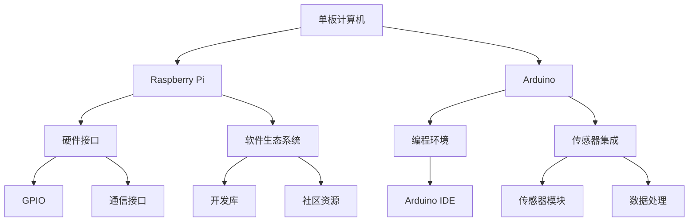

                 

 在这个数字化时代，单板计算机以其低成本、高效能的特点，正在迅速成为创新者和开发者们的新宠。本文将深入探讨单板计算机的两个主要代表：Raspberry Pi 和 Arduino，并展示它们在实际项目中的应用。作者：禅与计算机程序设计艺术 / Zen and the Art of Computer Programming。

## 关键词
- 单板计算机
- Raspberry Pi
- Arduino
- 项目应用
- 开发者社区
- 创新

## 摘要
本文旨在为开发者提供关于单板计算机的全面了解，特别是 Raspberry Pi 和 Arduino 的应用实例。通过详细的案例分析和技术讲解，本文将帮助读者理解这些单板计算机如何通过编程实现复杂的功能，并探讨其在未来的发展趋势。

## 1. 背景介绍

### 单板计算机的起源

单板计算机（Single-board computer，简称 SBC）起源于20世纪80年代，起初主要用于教育和科研领域。随着技术的发展，单板计算机逐渐走向消费市场，成为现代智能家居、机器人技术、物联网（IoT）等领域的重要工具。

### Raspberry Pi 的诞生

Raspberry Pi 是由英国慈善组织 Raspberry Pi Foundation 发起的一个开源硬件项目，旨在促进计算机科学教育和技术普及。自2012年首次发布以来，Raspberry Pi 已经经历了多个版本的迭代，吸引了全球数百万开发者的关注。

### Arduino 的起源

Arduino 是一个开源电子原型平台，最初由Massimo Banzi、David Cuartielles 等人于2005年创立。Arduino 以其简单易用、灵活性高、社区支持强而著称，广泛应用于各种创新项目和工程项目。

## 2. 核心概念与联系

为了更好地理解单板计算机的应用，我们需要探讨其核心概念和架构。以下是使用 Mermaid 描述的简化的 Mermaid 流程图：



## 3. 核心算法原理 & 具体操作步骤

### 3.1 算法原理概述

单板计算机的应用离不开算法的支持。无论是 Raspberry Pi 还是 Arduino，其算法的核心在于数据的采集、处理和反馈。以下是一个典型的数据处理算法流程：

1. **数据采集**：通过传感器（如温度传感器、湿度传感器）获取环境数据。
2. **数据处理**：对采集到的数据进行分析和预处理。
3. **数据反馈**：根据处理结果，控制执行器（如电机、灯光）进行相应的操作。

### 3.2 算法步骤详解

1. **初始化**：设置传感器接口和执行器接口。
2. **数据采集**：读取传感器数据。
3. **数据处理**：对传感器数据进行滤波、转换等处理。
4. **决策**：根据处理结果，做出相应的决策。
5. **执行操作**：控制执行器执行预定的操作。

### 3.3 算法优缺点

**优点**：
- **灵活性**：单板计算机具有极高的灵活性，可以通过编程实现各种功能。
- **易用性**：开源硬件和软件生态系统使得单板计算机易于上手。

**缺点**：
- **性能限制**：相较于传统计算机，单板计算机在性能上有一定的限制。
- **功耗**：在某些高负载场景下，功耗可能成为一个问题。

### 3.4 算法应用领域

- **智能家居**：通过单板计算机实现智能灯光、温度控制等。
- **机器人技术**：用于机器人运动控制、传感器数据处理等。
- **物联网**：作为物联网节点的核心处理单元。

## 4. 数学模型和公式 & 详细讲解 & 举例说明

### 4.1 数学模型构建

单板计算机中的算法模型通常包括以下部分：

1. **传感器模型**：描述传感器如何获取外部数据。
2. **滤波模型**：用于数据处理和噪声过滤。
3. **决策模型**：根据处理结果做出决策。

### 4.2 公式推导过程

以下是一个简单的传感器数据处理公式的推导：

$$
\text{滤波输出} = \frac{\text{新数据} + (1 - \alpha) \times \text{滤波输出}}{\alpha + 1}
$$

其中，$\alpha$ 是滤波系数，用于调节新数据在滤波结果中的权重。

### 4.3 案例分析与讲解

假设我们要实现一个智能家居温度控制系统，以下是具体的数学模型和应用：

1. **传感器模型**：使用温度传感器获取室内温度数据。
2. **滤波模型**：采用移动平均滤波器，减少温度数据的波动。
3. **决策模型**：根据滤波后的温度数据，控制空调的开关。

## 5. 项目实践：代码实例和详细解释说明

### 5.1 开发环境搭建

在开始项目实践之前，我们需要搭建开发环境。以下是在 Raspberry Pi 上安装 Ubuntu 操作系统和 Arduino IDE 的步骤：

1. **安装 Raspberry Pi OS**：下载并安装 Raspberry Pi OS 操作系统。
2. **配置网络**：连接网络，并设置 WiFi 或有线网络。
3. **安装 Arduino IDE**：通过命令行安装 Arduino IDE。

### 5.2 源代码详细实现

以下是一个简单的温度控制系统代码实例：

```cpp
// 温度控制系统的源代码
#include <Wire.h>
#include <Adafruit_Sensor.h>
#include <Adafruit_TMP006.h>

Adafruit_TMP006 tmp006;

void setup() {
  Serial.begin(9600);
  Serial.println("TMP006 test");
  tmp006.begin();
}

void loop() {
  float temp = tmp006.readObjTempC();
  Serial.print("Object temperature: ");
  Serial.print(temp);
  Serial.println(" C");
  delay(1000);
}
```

### 5.3 代码解读与分析

- **头文件**：引入必要的库文件。
- **传感器初始化**：初始化 TMP006 温度传感器。
- **主循环**：读取温度数据并打印。

### 5.4 运行结果展示

运行上述代码后，Arduino IDE 会实时显示温度传感器采集到的温度数据。

## 6. 实际应用场景

### 6.1 智能家居

单板计算机可以轻松实现智能灯光、温度控制等功能，提升生活品质。

### 6.2 机器人技术

单板计算机在机器人运动控制、传感器数据处理等方面发挥着重要作用。

### 6.3 物联网

单板计算机作为物联网节点的核心处理单元，实现数据的采集和处理。

## 7. 工具和资源推荐

### 7.1 学习资源推荐

- 《Raspberry Pi Cookbook》
- 《Getting Started with Arduino》
- 《C Programming Language》

### 7.2 开发工具推荐

- Raspberry Pi OS
- Arduino IDE
- Thonny

### 7.3 相关论文推荐

- "Arduino: A New Era of Electronic Prototyping for Art, Interactive Objects, and Fashion"
- "Raspberry Pi: The Ultimate Project Guide to Raspberry Pi for Beginners"

## 8. 总结：未来发展趋势与挑战

### 8.1 研究成果总结

单板计算机在智能家居、机器人技术、物联网等领域取得了显著成果，成为现代创新项目的重要工具。

### 8.2 未来发展趋势

随着技术的进步，单板计算机的性能和功能将继续提升，应用场景将更加广泛。

### 8.3 面临的挑战

- **性能提升**：如何在保证低成本的前提下提升单板计算机的性能。
- **功耗优化**：在高负载场景下如何优化功耗。

### 8.4 研究展望

单板计算机在未来将继续发展，并在更多领域发挥作用，为科技创新提供强大支持。

## 9. 附录：常见问题与解答

### 9.1 单板计算机与PC的区别？

单板计算机相较于传统PC，具有更低成本、更小巧的体积和更低的功耗。

### 9.2 如何选择合适的单板计算机？

根据项目的需求和预算，选择适合的单板计算机。例如，Raspberry Pi 适合性能要求较高的项目，而 Arduino 适合简单易用的项目。

### 9.3 如何学习单板计算机编程？

通过阅读相关书籍、参加在线课程和实践项目，逐步掌握单板计算机编程技能。

---

通过本文，我们深入了解了单板计算机的应用和未来发展。希望本文能为您在单板计算机领域的学习和实践提供有益的指导。作者：禅与计算机程序设计艺术 / Zen and the Art of Computer Programming。

