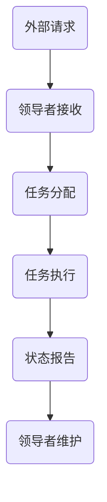
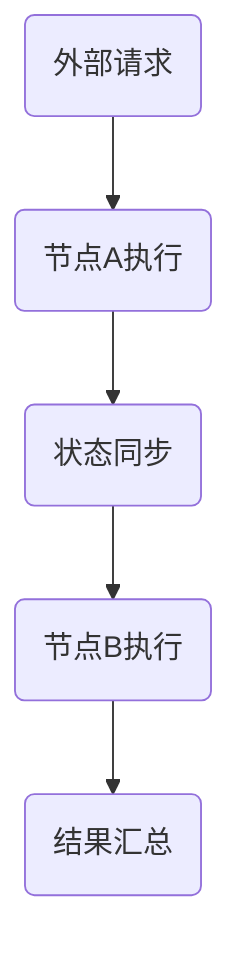

                 

单领导集群与无领导集群是分布式系统中两种常见的架构模式，它们各自具有独特的优势和适用场景。本文将探讨这两种集群模式的定义、原理、实现方式及其在实际应用中的案例，旨在帮助读者理解其背后的技术原理，并指导实际项目中的选择。

## 1. 背景介绍

随着互联网和云计算技术的快速发展，分布式系统成为了现代应用架构的核心。分布式系统通过将任务分解到多个节点上执行，从而提高了系统的可扩展性和容错能力。然而，如何管理和协调这些节点成为了关键问题。单领导集群和无领导集群两种架构模式在分布式系统中广泛应用，它们分别适用于不同的场景和需求。

单领导集群（Leader-Based Cluster）通过一个中心化的领导者节点来统一管理集群中的其他节点。领导者负责分配任务、维护状态和协调集群中的通信。这种模式的优势在于任务的调度和状态管理更加集中，但同时也存在单点故障的风险。

无领导集群（Leaderless Cluster）则通过去中心化的方式运行，每个节点都可以独立完成任务，并与其他节点进行通信。这种模式消除了单点故障的风险，但同时也带来了节点状态管理和任务调度复杂性的问题。

## 2. 核心概念与联系

### 2.1 单领导集群

单领导集群的核心概念是领导者节点（Leader Node），它负责以下任务：

- **任务分配**：领导者接收外部请求并分配任务给其他工作节点（Worker Nodes）。
- **状态维护**：领导者监控集群中所有节点的状态，确保系统的高可用性。
- **协调通信**：领导者负责在节点之间传递消息，协调任务执行。

以下是一个简化的 Mermaid 流程图，展示了单领导集群的基本架构：



### 2.2 无领导集群

无领导集群的核心概念是去中心化的节点，它们通过以下方式进行协作：

- **独立任务执行**：每个节点独立处理分配给它的任务，无需依赖中心化的领导者。
- **状态同步**：节点之间通过 gossip 协议或其他分布式一致性算法同步状态。
- **任务调度**：节点通过本地策略决定任务的执行顺序。

以下是一个简化的 Mermaid 流程图，展示了无领导集群的基本架构：



## 3. 核心算法原理 & 具体操作步骤

### 3.1 算法原理概述

单领导集群的核心算法是领导者选举算法，它确保在领导者节点失效时能够快速选出新的领导者。常见的选举算法包括 Raft 和 Paxos 等，它们通过多轮投票和一致性协议确保选举过程的正确性。

无领导集群的核心算法是分布式一致性算法，如 gossip 协议和 PBFT（Practical Byzantine Fault Tolerance）。这些算法通过节点之间的随机通信和状态同步，确保系统中的状态一致性。

### 3.2 算法步骤详解

#### 单领导集群：

1. **初始化**：节点启动时，确定是否成为领导者。如果没有领导者，节点发起选举。
2. **选举**：节点通过发送投票请求和接收其他节点的响应来参与选举。
3. **选举结果**：获得多数投票的节点成为领导者，其他节点成为工作节点。
4. **任务调度**：领导者接收外部请求并分配给工作节点执行。
5. **状态维护**：领导者定期收集工作节点的状态报告，确保集群的高可用性。

#### 无领导集群：

1. **任务执行**：节点独立处理分配给它的任务。
2. **状态同步**：节点通过 gossip 协议或其他一致性算法与其他节点同步状态。
3. **任务调度**：节点根据本地策略决定任务的执行顺序。
4. **结果汇总**：节点将执行结果上报给其他节点，实现结果的汇总和一致性。

### 3.3 算法优缺点

#### 单领导集群的优点：

- **简单性**：领导者集中管理任务和状态，降低系统的复杂性。
- **高效性**：任务调度和状态维护更加高效，适合高并发场景。

#### 单领导集群的缺点：

- **单点故障**：领导者节点失效可能导致整个集群不可用。
- **扩展性**：随着节点数量增加，领导者节点的压力增大。

#### 无领导集群的优点：

- **高可用性**：去中心化设计，节点失效不影响整体系统运行。
- **灵活性**：节点独立运行，无需依赖中心化的领导者。

#### 无领导集群的缺点：

- **复杂性**：节点状态管理和任务调度复杂，不适合初学者。
- **一致性保证**：实现分布式一致性算法需要更多的资源和时间。

### 3.4 算法应用领域

单领导集群适合高并发、高可靠性的场景，如分布式数据库、消息队列等。无领导集群适合高可用性、去中心化场景，如分布式缓存、区块链等。

## 4. 数学模型和公式 & 详细讲解 & 举例说明

### 4.1 数学模型构建

#### 单领导集群：

- **选举模型**：

  $$E_{\text{选举}} = \alpha N + (1 - \alpha) T$$

  其中，$E_{\text{选举}}$ 是选举的耗时，$\alpha$ 是选举算法的效率，$N$ 是节点数量，$T$ 是网络延迟。

- **任务模型**：

  $$E_{\text{任务}} = \beta N + (1 - \beta) T$$

  其中，$E_{\text{任务}}$ 是任务执行的耗时，$\beta$ 是任务分配的效率，$N$ 是节点数量，$T$ 是网络延迟。

#### 无领导集群：

- **任务模型**：

  $$E_{\text{任务}} = \gamma N + (1 - \gamma) T$$

  其中，$E_{\text{任务}}$ 是任务执行的耗时，$\gamma$ 是任务执行的效率，$N$ 是节点数量，$T$ 是网络延迟。

### 4.2 公式推导过程

#### 单领导集群：

- **选举模型推导**：

  $$E_{\text{选举}} = \alpha N + (1 - \alpha) T$$

  其中，$\alpha$ 是选举算法的效率，$N$ 是节点数量，$T$ 是网络延迟。选举算法的效率决定了选举的耗时，节点数量和网络延迟也影响了选举的时间。

- **任务模型推导**：

  $$E_{\text{任务}} = \beta N + (1 - \beta) T$$

  其中，$\beta$ 是任务分配的效率，$N$ 是节点数量，$T$ 是网络延迟。任务分配的效率决定了任务执行的耗时，节点数量和网络延迟也影响了任务的时间。

#### 无领导集群：

- **任务模型推导**：

  $$E_{\text{任务}} = \gamma N + (1 - \gamma) T$$

  其中，$\gamma$ 是任务执行的效率，$N$ 是节点数量，$T$ 是网络延迟。任务执行的效率决定了任务执行的耗时，节点数量和网络延迟也影响了任务的时间。

### 4.3 案例分析与讲解

#### 单领导集群案例：

假设有一个分布式数据库集群，包含 5 个节点。选举算法的效率为 0.9，任务分配的效率为 0.8。网络延迟为 10ms。

- **选举模型**：

  $$E_{\text{选举}} = 0.9 \times 5 + (1 - 0.9) \times 10 = 4.5 + 1 = 5.5s$$

  选举耗时为 5.5 秒。

- **任务模型**：

  $$E_{\text{任务}} = 0.8 \times 5 + (1 - 0.8) \times 10 = 4 + 2 = 6s$$

  任务执行耗时为 6 秒。

#### 无领导集群案例：

假设有一个分布式缓存集群，包含 5 个节点。任务执行的效率为 0.9。网络延迟为 10ms。

- **任务模型**：

  $$E_{\text{任务}} = 0.9 \times 5 + (1 - 0.9) \times 10 = 4.5 + 1 = 5.5s$$

  任务执行耗时为 5.5 秒。

## 5. 项目实践：代码实例和详细解释说明

### 5.1 开发环境搭建

为了演示单领导集群和无领导集群的代码实现，我们将使用 Python 语言和 Flask 框架搭建一个简单的分布式任务调度系统。

1. 安装 Python 和 Flask：

   ```bash
   pip install python
   pip install flask
   ```

2. 创建一个名为 `cluster` 的文件夹，并在其中创建一个名为 `app.py` 的文件。

### 5.2 源代码详细实现

以下是一个简单的单领导集群和无领导集群的实现示例：

```python
# app.py

from flask import Flask, jsonify, request
import random

app = Flask(__name__)

# 单领导集群
class LeaderElection:
    def __init__(self):
        self.leader = None

    def elect_leader(self, node_id):
        if self.leader is None:
            self.leader = node_id
        else:
            print(f"Node {node_id} wants to become leader but failed.")

    def is_leader(self, node_id):
        return self.leader == node_id

# 无领导集群
class GossipProtocol:
    def __init__(self):
        self.nodes = []

    def add_node(self, node_id):
        self.nodes.append(node_id)

    def gossip(self, node_id):
        print(f"Node {node_id} is gossiping.")
        random_node = random.choice(self.nodes)
        print(f"Node {node_id} gossiping to Node {random_node}.")

# 单领导集群路由
@app.route('/elect_leader', methods=['POST'])
def elect_leader():
    node_id = request.form.get('node_id')
    leader_election.elect_leader(node_id)
    return jsonify({"leader": leader_election.is_leader(node_id)})

# 无领导集群路由
@app.route('/gossip', methods=['POST'])
def gossip():
    node_id = request.form.get('node_id')
    gossip_protocol.gossip(node_id)
    return jsonify({"success": True})

if __name__ == '__main__':
    leader_election = LeaderElection()
    gossip_protocol = GossipProtocol()
    app.run(host='0.0.0.0', port=5000)
```

### 5.3 代码解读与分析

1. **单领导集群实现**：

   - `LeaderElection` 类负责领导者的选举。当节点请求成为领导者时，如果当前没有领导者，则该节点成为领导者；否则，选举失败。
   - `elect_leader` 方法用于选举领导者。
   - `is_leader` 方法用于检查当前节点是否为领导者。

2. **无领导集群实现**：

   - `GossipProtocol` 类负责实现 gossip 协议。每个节点可以向其他节点发送 gossip 消息，实现状态同步。

3. **路由处理**：

   - `/elect_leader` 路由用于处理单领导集群的选举请求。
   - `/gossip` 路由用于处理无领导集群的 gossip 请求。

### 5.4 运行结果展示

1. **单领导集群运行结果**：

   ```bash
   $ curl -X POST -F "node_id=node1" http://localhost:5000/elect_leader
   {"leader": true}

   $ curl -X POST -F "node_id=node2" http://localhost:5000/elect_leader
   {"leader": false}
   ```

   在第一个请求中，节点 1 成为了领导者。在第二个请求中，节点 2 未能成为领导者。

2. **无领导集群运行结果**：

   ```bash
   $ curl -X POST -F "node_id=node1" http://localhost:5000/gossip
   {"success": true}

   $ curl -X POST -F "node_id=node2" http://localhost:5000/gossip
   {"success": true}
   ```

   在每次请求中，节点 1 和节点 2 都成功发送了 gossip 消息。

## 6. 实际应用场景

单领导集群和无领导集群在实际应用中有着广泛的应用。以下是一些典型的应用场景：

1. **单领导集群**：

   - **分布式数据库**：如 MongoDB、Cassandra 等分布式数据库系统使用单领导集群模式来管理数据分片和复制。
   - **消息队列**：如 Apache Kafka 使用单领导集群模式来保证消息的顺序性和一致性。

2. **无领导集群**：

   - **分布式缓存**：如 Redis Cluster 使用无领导集群模式来实现缓存节点的去中心化管理。
   - **区块链**：如 Ethereum 和 Bitcoin 使用无领导集群模式来实现区块链网络中的节点协作。

## 7. 工具和资源推荐

1. **学习资源推荐**：

   - 《分布式系统原理与范型》
   - 《大规模分布式存储系统：原理解析与架构实战》
   - 《分布式计算：原理、算法与应用》

2. **开发工具推荐**：

   - **Docker**：用于容器化和部署分布式系统。
   - **Kubernetes**：用于管理和调度容器化应用程序。
   - **Consul**：用于服务发现和集群管理。

3. **相关论文推荐**：

   - "The Part-Time Parliament"
   - "The Paxos Algorithm"
   - "Viewstamped Replication: A New Primary Copy Protocol"
   - "Practical Byzantine Fault Tolerance"

## 8. 总结：未来发展趋势与挑战

单领导集群和无领导集群在分布式系统中扮演着重要角色。随着云计算和大数据技术的不断发展，它们的应用场景将越来越广泛。未来发展趋势包括：

1. **更高的可用性和可靠性**：通过改进选举算法和分布式一致性算法，提高集群的可用性和可靠性。
2. **更高效的调度和管理**：优化任务调度策略，提高资源利用率和系统性能。
3. **更广泛的适用性**：研究适用于更多场景的分布式系统架构，如边缘计算、物联网等。

面临的挑战包括：

1. **复杂性和可维护性**：随着集群规模的扩大，系统的复杂性和可维护性将增加，需要更高效的开发和管理工具。
2. **安全性**：分布式系统面临各种安全威胁，如网络攻击、数据泄露等，需要加强安全防护措施。
3. **性能优化**：在保证系统可靠性的同时，优化系统性能，提高资源利用率和响应速度。

## 9. 附录：常见问题与解答

### 问题 1：单领导集群与无领导集群哪个更好？

**答案**：单领导集群与无领导集群各有优缺点，选择哪种架构取决于具体应用场景和需求。单领导集群在任务调度和状态管理方面更简单，但存在单点故障的风险；无领导集群去中心化，具有更高的可用性，但状态管理和任务调度更复杂。在实际项目中，应根据应用需求权衡这两种架构的选择。

### 问题 2：如何保证单领导集群的领导者选举效率？

**答案**：保证单领导集群的领导者选举效率可以通过以下方法实现：

- **优化选举算法**：选择高效的选举算法，如 Raft、Paxos 等。
- **减少网络延迟**：优化网络拓扑结构，减少网络延迟。
- **增加节点数量**：在保证系统容错性的前提下，适当增加节点数量，提高选举效率。

### 问题 3：无领导集群中的节点如何保证状态一致性？

**答案**：无领导集群中的节点通过以下方法保证状态一致性：

- **分布式一致性算法**：如 gossip 协议、PBFT 等，实现节点之间的状态同步。
- **状态报告**：节点定期向其他节点发送状态报告，实现状态的同步和一致性。
- **冲突解决**：在状态同步过程中，解决可能出现的冲突，确保系统的一致性。

### 问题 4：单领导集群中的领导者失效后如何重新选举？

**答案**：单领导集群中的领导者失效后，可以通过以下步骤重新选举：

1. **节点感知**：节点发现领导者失效后，发起选举请求。
2. **选举过程**：节点通过发送投票请求和接收其他节点的响应参与选举。
3. **选举结果**：获得多数投票的节点成为新的领导者。

### 问题 5：无领导集群中的节点如何防止恶意节点的影响？

**答案**：无领导集群中的节点可以通过以下方法防止恶意节点的影响：

- **身份验证**：在节点加入集群时进行身份验证，确保节点合法性。
- **安全通信**：使用加密协议保护节点之间的通信，防止信息泄露。
- **监控和审计**：对集群中的节点进行监控和审计，发现恶意行为及时处理。

## 结语

单领导集群与无领导集群是分布式系统中的两种重要架构模式，它们在实际应用中各具特色。通过本文的介绍和分析，读者可以更好地理解这两种架构模式的基本原理和实现方法，并能够根据实际需求选择合适的架构模式。在未来的分布式系统发展中，我们期待看到更多创新和优化，以提高系统的可用性、可靠性和性能。

### 作者署名

**作者：禅与计算机程序设计艺术 / Zen and the Art of Computer Programming**

