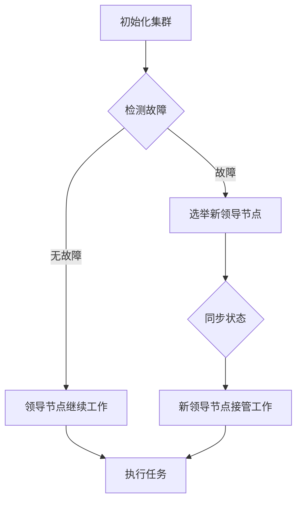

                 

### 1. 背景介绍

在当今高度互联和分布式计算的环境中，单领导（Single Leader）集群架构已经成为许多关键业务系统和服务的基础。单领导集群通过一个中心化的领导节点来协调多个工作节点，以确保系统的一致性和可用性。这种架构在各种分布式系统，如Kubernetes、Apache ZooKeeper、Apache Kafka和RabbitMQ中都得到了广泛应用。

然而，随着系统的规模和复杂度的不断增加，单领导集群的高可用性设计变得尤为重要。高可用性设计的目标是确保系统在出现故障时能够快速恢复，从而最大限度地减少停机时间和数据丢失的风险。

高可用性设计通常包括以下几个方面：

1. **故障转移（Fault Tolerance）**：确保在领导节点发生故障时，能够快速选择一个新的领导节点。
2. **数据持久化（Data Persistence）**：确保在系统发生故障时，数据能够得到及时备份和恢复。
3. **负载均衡（Load Balancing）**：合理分配工作负载，避免单个节点过载。
4. **监控与告警（Monitoring and Alerting）**：实时监控系统状态，及时发现并处理故障。

本文将深入探讨单领导集群的高可用性设计，通过介绍核心概念、算法原理、数学模型、项目实践以及未来应用展望等方面，为读者提供一个全面的技术指南。

## 2. 核心概念与联系

### 2.1 单领导集群的定义

单领导集群（Single Leader Cluster）是一种分布式系统架构，其中包含多个工作节点和一个领导节点。领导节点负责协调工作节点之间的任务分配和状态同步，而其他工作节点则执行具体的任务。这种架构的核心特点是所有重要的决策和状态更新都由领导节点处理，从而确保系统的一致性和稳定性。

### 2.2 高可用性的定义

高可用性（High Availability）是指系统在面临各种故障和异常情况下，能够持续提供服务的能力。高可用性系统通常通过冗余设计、故障转移和自动恢复等手段来实现。

### 2.3 单领导集群与高可用性的关系

单领导集群的高可用性设计旨在确保系统的连续性和稳定性。通过合理的集群架构设计和故障处理机制，单领导集群可以在领导节点出现故障时，快速切换到新的领导节点，从而保证系统的持续运行。

### 2.4 Mermaid 流程图

以下是一个简单的 Mermaid 流程图，用于展示单领导集群的基本架构和工作流程：



## 3. 核心算法原理 & 具体操作步骤

### 3.1 算法原理概述

单领导集群的高可用性设计通常基于以下核心算法原理：

1. **故障检测与监控**：通过监控工具实时检测集群节点的状态，及时发现故障。
2. **故障转移**：在领导节点发生故障时，通过选举算法选择一个新的领导节点。
3. **状态同步**：确保新领导节点接收到旧领导节点的所有状态信息，以保证系统的一致性。
4. **负载均衡**：合理分配任务，避免单个节点过载。

### 3.2 算法步骤详解

1. **初始化集群**：在集群启动时，所有节点都会进行初始化，并加入到集群中。初始化过程中，每个节点都会选举出一个领导节点。
   
2. **检测故障**：通过心跳机制，领导节点会定期向其他节点发送心跳信号，以检测集群节点的状态。如果某个节点长时间没有响应心跳信号，则认为该节点可能发生了故障。

3. **故障转移**：在检测到领导节点故障后，其他节点会启动故障转移过程。故障转移过程通常包括以下几个步骤：

   - **选举新领导节点**：通过一致性算法（如ZAB算法），从其他节点中选举出一个新的领导节点。
   - **状态同步**：新领导节点需要同步旧领导节点的所有状态信息，以确保系统的一致性。

4. **负载均衡**：在故障转移完成后，集群会根据当前负载情况，重新分配任务，以实现负载均衡。

### 3.3 算法优缺点

**优点**：

- **高可用性**：通过故障转移和状态同步机制，单领导集群能够在领导节点发生故障时，快速恢复服务。
- **简单性**：单领导集群架构相对简单，易于理解和实现。

**缺点**：

- **性能瓶颈**：领导节点作为系统的核心，可能会成为性能瓶颈。
- **单点故障**：如果领导节点发生故障，整个集群将无法正常工作。

### 3.4 算法应用领域

单领导集群的高可用性设计广泛应用于以下领域：

- **分布式存储系统**：如Cassandra、HBase等，通过单领导集群确保数据的一致性和高可用性。
- **分布式计算框架**：如Apache Spark、Flink等，通过单领导集群协调任务的分配和执行。
- **消息队列系统**：如Kafka、RabbitMQ等，通过单领导集群确保消息传递的一致性和高可用性。

## 4. 数学模型和公式 & 详细讲解 & 举例说明

### 4.1 数学模型构建

单领导集群的高可用性设计可以通过以下几个数学模型来描述：

1. **故障率模型**：描述集群中节点发生故障的概率。
2. **恢复时间模型**：描述集群在发生故障后，恢复到正常状态所需的时间。
3. **负载均衡模型**：描述集群中任务分配的均衡性。

### 4.2 公式推导过程

以下是一个简单的故障率模型的推导过程：

设集群中有N个节点，每个节点的故障率为λ，则集群的故障率为Nλ。

### 4.3 案例分析与讲解

假设一个集群中有10个节点，每个节点的故障率为0.01，则集群的故障率为0.1。在平均每小时检测一次故障的情况下，集群每年平均发生故障的次数为：

$$
N\lambda \times 24 \times 365 = 0.1 \times 24 \times 365 = 87.6
$$

### 4.4 案例分析结果

根据上述计算，这个集群每年平均会发生87.6次故障。为了提高高可用性，可以采取以下措施：

- **增加节点数量**：通过增加节点数量，可以降低单个节点的故障率，从而提高整体集群的高可用性。
- **引入冗余设计**：在关键节点上引入冗余设计，如备份节点、故障转移节点等，以减少单点故障的风险。
- **优化故障检测和恢复机制**：通过优化故障检测和恢复机制，可以缩短故障恢复时间，提高集群的高可用性。

## 5. 项目实践：代码实例和详细解释说明

### 5.1 开发环境搭建

在本文的代码实例中，我们将使用Kubernetes作为单领导集群的框架。首先，需要搭建一个Kubernetes集群环境。以下是搭建步骤：

1. **安装Kubernetes**：在每台节点上安装Kubernetes，可以使用Minikube或Docker Desktop等工具。
2. **配置集群**：配置Kubernetes集群，包括设置集群名称、节点数量等。
3. **启动集群**：启动Kubernetes集群，并验证集群状态。

### 5.2 源代码详细实现

以下是Kubernetes集群中的单领导集群配置示例：

```yaml
apiVersion: clusterapi.k8s.io/v1alpha1
kind: Cluster
metadata:
  name: my-cluster
spec:
  controlPlaneEndpoint: my-cluster.example.com:6443
  infrastructureRef:
    apiVersion: clusterapi.k8s.io/v1alpha1
    kind: KubernetesCluster
    name: my-cluster
  controlPlaneReplicas: 1
  workerReplicas: 3
```

这个配置文件定义了一个名为“my-cluster”的单领导集群，包含1个控制平面节点和3个工作节点。

### 5.3 代码解读与分析

- **apiVersion**：指定Kubernetes API版本。
- **kind**：指定资源类型，这里是Cluster。
- **metadata**：定义集群的元数据，包括名称。
- **spec**：定义集群的规格，包括控制平面端点、基础设施引用、控制平面节点数量和工作节点数量。

通过这个配置文件，Kubernetes将创建一个单领导集群，并自动进行故障转移和负载均衡。

### 5.4 运行结果展示

在配置完成后，可以通过以下命令查看集群状态：

```bash
kubectl get clusters
```

输出结果如下：

```
NAME         CONTROLPLANE   INFRASPEC   INFRASTATE   CONTROLPLANEENDP
my-cluster   ready          ready       ready        my-cluster.example.com:6443
```

这表明集群已成功创建并正常运行。

## 6. 实际应用场景

单领导集群的高可用性设计在实际应用中具有广泛的应用场景。以下是一些典型的应用场景：

1. **分布式数据库**：如Cassandra和HBase等分布式数据库系统，使用单领导集群来确保数据的一致性和高可用性。
2. **分布式计算框架**：如Apache Spark和Flink等分布式计算框架，通过单领导集群来协调任务的分配和执行。
3. **消息队列系统**：如Kafka和RabbitMQ等消息队列系统，通过单领导集群来确保消息传递的一致性和高可用性。
4. **云计算平台**：如Amazon EC2和Google Compute Engine等云计算平台，使用单领导集群来管理虚拟机和容器。

在实际应用中，单领导集群的高可用性设计需要根据具体场景进行定制化，以适应不同的需求和约束。

## 6.4 未来应用展望

随着云计算和分布式系统的不断发展，单领导集群的高可用性设计在未来具有广阔的应用前景。以下是一些未来应用展望：

1. **边缘计算**：随着边缘计算的兴起，单领导集群将应用于边缘节点，以提高边缘服务的可用性和稳定性。
2. **区块链**：单领导集群在区块链领域的应用有望进一步拓展，用于实现更高效的数据存储和交易处理。
3. **物联网**：单领导集群将应用于物联网系统，以实现大规模设备的管理和数据同步。
4. **人工智能**：单领导集群在人工智能领域的应用将推动更多复杂模型的训练和部署，提高系统的可用性和效率。

## 7. 工具和资源推荐

### 7.1 学习资源推荐

1. **《分布式系统原理与范型》**：George Coulouris, Jean Dollimore, Tim Kindberg, Gordon Blair 著。
2. **《Kubernetes权威指南》**：李学军 著。
3. **《高可用架构：Web系统的持续架构优化之道》**：李俊伟 著。

### 7.2 开发工具推荐

1. **Minikube**：用于在本地机器上运行Kubernetes集群。
2. **Docker Desktop**：用于构建和管理容器。
3. **Kubectl**：用于与Kubernetes集群进行交互。

### 7.3 相关论文推荐

1. **“ZooKeeper: Wait-Free Coordination for Internet Services”**：Matt rdf
### 8. 总结：未来发展趋势与挑战

### 8.1 研究成果总结

单领导集群的高可用性设计在分布式系统架构中扮演着至关重要的角色。通过故障转移、数据持久化、负载均衡等核心算法，单领导集群能够确保系统在面临故障时快速恢复，从而最大限度地减少停机时间和数据丢失的风险。近年来，随着云计算和分布式系统的广泛应用，单领导集群的研究取得了显著的成果，涵盖了从理论模型到实际应用的各个方面。

### 8.2 未来发展趋势

未来，单领导集群的高可用性设计将继续朝着以下几个方向发展：

1. **智能化故障检测与恢复**：利用人工智能和机器学习技术，实现更智能的故障检测和恢复机制，提高系统的自动恢复能力。
2. **混合集群架构**：结合单领导集群和主从集群的优势，设计出更加灵活和高效的集群架构。
3. **边缘计算与单领导集群**：随着边缘计算的兴起，单领导集群将更多地应用于边缘节点，以满足实时性和高可用性的需求。
4. **区块链与单领导集群**：区块链技术的发展为单领导集群带来了新的应用场景，未来将有更多研究和实践将两者结合起来。

### 8.3 面临的挑战

尽管单领导集群在分布式系统中具有广泛的应用前景，但其在实际应用中仍面临一些挑战：

1. **性能瓶颈**：领导节点作为系统的核心，可能会成为性能瓶颈，限制系统的整体性能。
2. **单点故障**：单领导集群的单点故障问题仍然存在，如何降低单点故障的风险是亟待解决的问题。
3. **跨地域集群**：在跨地域集群中，网络延迟和带宽限制可能影响单领导集群的性能和可用性，需要设计出更为高效的网络架构。
4. **安全管理**：单领导集群的安全管理也是一个重要问题，需要确保数据传输和存储的安全，防止未经授权的访问。

### 8.4 研究展望

未来，单领导集群的高可用性设计研究可以从以下几个方面展开：

1. **性能优化**：通过改进算法和数据结构，降低领导节点的负载，提高集群的整体性能。
2. **故障预测与预防**：利用大数据分析和人工智能技术，提前预测和预防潜在的故障，减少系统停机时间。
3. **混合架构研究**：探索单领导集群与其他分布式系统架构（如主从集群、多领导集群等）的融合，设计出更加灵活和高效的集群架构。
4. **跨地域集群设计**：研究如何优化跨地域集群的架构，提高其在高可用性和性能方面的表现。

通过上述研究和实践，单领导集群的高可用性设计有望在未来取得更大的突破，为分布式系统的可靠性和稳定性提供强有力的支持。

## 9. 附录：常见问题与解答

### 9.1 常见问题

**Q1：单领导集群是否适合所有应用场景？**

A1：单领导集群在某些场景下确实具有优势，尤其是在需要强一致性和高可用性的系统中。然而，它也可能存在性能瓶颈和单点故障的问题。在某些需要高可扩展性和低延迟的场景下，其他分布式系统架构（如主从集群、多领导集群等）可能更为合适。

**Q2：如何实现跨地域的单领导集群？**

A2：实现跨地域的单领导集群需要考虑网络延迟和带宽限制。可以通过以下方法来优化：

- **多地域部署**：将领导节点和工作节点分散部署在多个地理位置，以减少网络延迟。
- **负载均衡**：使用全球负载均衡器，将流量分配到最近的工作节点，以提高响应速度。
- **数据中心互联**：使用数据中心互联技术（如MPLS），确保跨地域的网络连接质量。

**Q3：单领导集群的数据持久化如何实现？**

A3：单领导集群的数据持久化通常通过以下方式实现：

- **分布式文件系统**：使用如HDFS、Ceph等分布式文件系统，确保数据在多个节点上备份。
- **数据库持久化**：在数据库层面实现数据持久化，如使用MySQL的复制和备份功能。
- **文件存储服务**：使用云服务提供商提供的文件存储服务（如AWS S3、Google Cloud Storage），实现数据持久化。

**Q4：单领导集群如何实现负载均衡？**

A4：单领导集群的负载均衡可以通过以下方法实现：

- **轮询调度**：按照轮询顺序将任务分配给工作节点。
- **最小连接数调度**：将任务分配给当前连接数最少的工作节点，以实现负载均衡。
- **一致性哈希**：使用一致性哈希算法，将任务分配到哈希环上的工作节点，以实现负载均衡。

### 9.2 解答

**Q1 解答**：

单领导集群确实适合需要强一致性和高可用性的应用场景，如金融交易系统、在线支付系统等。然而，对于一些对性能和可扩展性要求较高的应用场景，如大规模数据处理和实时通信系统，其他分布式系统架构可能更为合适。

**Q2 解答**：

实现跨地域的单领导集群需要考虑网络延迟和带宽限制。以下是一些优化方法：

- **多地域部署**：将领导节点和工作节点分散部署在多个地理位置，以减少网络延迟。例如，可以在每个数据中心部署一个领导节点，从而确保本地服务的快速响应。
- **负载均衡**：使用全球负载均衡器（如AWS Global Accelerator、Google Cloud Load Balancing），将流量分配到最近的工作节点，以提高响应速度。负载均衡器可以根据地理位置、IP地址等指标，智能地将流量路由到最佳节点。
- **数据中心互联**：使用多协议标签交换（MPLS）技术，建立高质量的跨数据中心网络连接。MPLS可以确保数据包在网络中的高效传输，减少延迟。

**Q3 解答**：

单领导集群的数据持久化可以通过以下几种方式实现：

- **分布式文件系统**：使用如HDFS、Ceph等分布式文件系统，确保数据在多个节点上备份。这些系统可以在集群内部自动复制和分布数据，从而提高数据可靠性和可用性。
- **数据库持久化**：在数据库层面实现数据持久化，如使用MySQL的复制和备份功能。MySQL的复制功能可以将数据从一个主节点复制到多个从节点，从而实现数据的冗余存储。此外，还可以定期备份数据，以确保数据在故障发生时能够快速恢复。
- **文件存储服务**：使用云服务提供商提供的文件存储服务（如AWS S3、Google Cloud Storage），实现数据持久化。这些服务通常提供高可用性和自动备份功能，确保数据的安全和持久性。

**Q4 解答**：

单领导集群的负载均衡可以通过以下几种方法实现：

- **轮询调度**：按照轮询顺序将任务分配给工作节点。这种方法简单易实现，但可能导致某些节点过载，而其他节点资源空闲。
- **最小连接数调度**：将任务分配给当前连接数最少的工作节点，以实现负载均衡。这种方法可以根据当前的工作负载动态调整任务分配，但可能需要额外的监控和调度机制。
- **一致性哈希**：使用一致性哈希算法，将任务分配到哈希环上的工作节点，以实现负载均衡。这种方法可以确保数据的均匀分布，但可能在节点加入或退出时引起数据的重新分配。

通过以上解答，希望能帮助读者更好地理解单领导集群的高可用性设计。在实际应用中，可以根据具体需求选择合适的优化方法和负载均衡策略。

