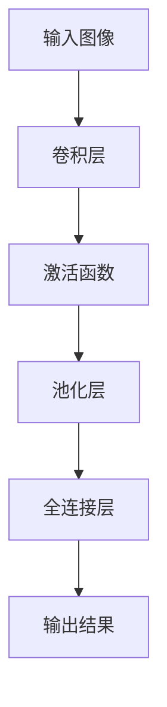

                 

关键词：卷积神经网络，深度学习，图像识别，CNN，神经网络架构，代码实例，深度神经网络，算法原理

摘要：本文将深入探讨卷积神经网络（CNN）的原理、结构及其在图像识别等领域的应用。通过详细的数学模型和公式推导，结合代码实例讲解，帮助读者全面理解CNN的工作机制，掌握其核心技术和应用方法。

## 1. 背景介绍

卷积神经网络（Convolutional Neural Networks，简称CNN）是深度学习中的一种重要模型，广泛应用于图像识别、视频分析、自然语言处理等计算机视觉和语音识别领域。与传统神经网络相比，CNN具有以下特点：

- **局部连接**：CNN通过局部连接的方式提取图像特征，减少了参数数量，提高了计算效率。
- **权重共享**：在CNN中，同一特征图上的权重是共享的，这进一步减少了参数数量，提高了模型的泛化能力。
- **卷积操作**：卷积操作能够有效地提取图像中的局部特征，如边缘、纹理等。

随着深度学习技术的不断发展，CNN已经成为计算机视觉领域的基石，其在图像分类、目标检测、图像分割等任务上取得了显著成果。

## 2. 核心概念与联系

### 2.1 神经网络基础

神经网络（Neural Networks）是模仿生物神经元工作原理的计算机算法。它由大量简单神经元组成，每个神经元都与其他神经元相连，并通过权重（weights）传递信息。当输入通过网络传递时，每个神经元根据其连接权重和偏置（bias）计算输出，最终形成一个预测结果。

### 2.2 卷积操作

卷积操作（Convolution Operation）是CNN的核心。它通过滑动一个滤波器（filter）或卷积核（kernel）在输入图像上，提取图像中的局部特征。卷积操作的数学公式如下：

$$
(\text{Filter} \star \text{Input})_{ij} = \sum_{k=1}^{m} \sum_{l=1}^{n} \text{Filter}_{kl} \times \text{Input}_{i-k, j-l}
$$

其中，$i$ 和 $j$ 表示输出特征图的位置，$k$ 和 $l$ 表示卷积核的位置，$\text{Filter}$ 和 $\text{Input}$ 分别表示卷积核和输入图像。

### 2.3 池化操作

池化操作（Pooling Operation）用于降低特征图的维度，提高计算效率。常用的池化方法包括最大池化（Max Pooling）和平均池化（Average Pooling）。最大池化的数学公式如下：

$$
\text{Pooling}_{ij} = \max(\text{Input}_{i-k, j-l}) \quad (1 \leq k \leq K, 1 \leq l \leq L)
$$

其中，$K$ 和 $L$ 分别表示池化窗口的大小。

### 2.4 全连接层

全连接层（Fully Connected Layer）是神经网络中的最后一个层次，它将所有前一层的神经元连接起来，通过计算得到最终的预测结果。全连接层的数学公式如下：

$$
\text{Output}_{i} = \sum_{j=1}^{n} \text{Weight}_{ij} \times \text{Input}_{j} + \text{Bias}_{i}
$$

其中，$i$ 和 $j$ 分别表示输出和输入的神经元索引，$\text{Weight}$ 和 $\text{Bias}$ 分别表示权重和偏置。

### 2.5 Mermaid 流程图



## 3. 核心算法原理 & 具体操作步骤

### 3.1 算法原理概述

CNN通过卷积层、池化层和全连接层的组合，逐步提取图像中的高级特征，最终实现图像分类等任务。卷积层用于提取图像的局部特征，池化层用于降低特征图的维度，全连接层用于分类。

### 3.2 算法步骤详解

1. **初始化参数**：初始化卷积核、偏置、权重等参数。
2. **卷积操作**：将卷积核滑动到输入图像上，计算每个位置的特征图。
3. **激活函数**：对每个特征图应用激活函数，如ReLU函数。
4. **池化操作**：对特征图进行最大池化或平均池化，降低维度。
5. **全连接层**：将所有前一层的特征图连接起来，通过全连接层得到预测结果。

### 3.3 算法优缺点

**优点**：

- **局部连接与权重共享**：减少了参数数量，提高了计算效率。
- **多层特征提取**：能够提取图像中的高级特征，提高分类性能。
- **适用性广泛**：广泛应用于图像识别、视频分析、自然语言处理等领域。

**缺点**：

- **计算复杂度高**：随着层数的增加，计算复杂度显著增加。
- **参数数量巨大**：深度神经网络需要大量参数，训练时间较长。

### 3.4 算法应用领域

CNN在计算机视觉领域具有广泛的应用，包括图像分类、目标检测、图像分割、人脸识别等。以下是一些具体应用场景：

- **图像分类**：将图像分类为不同类别，如猫、狗等。
- **目标检测**：检测图像中的物体并定位其位置，如车辆检测、行人检测等。
- **图像分割**：将图像分割成不同的区域，如前景与背景的分割。
- **人脸识别**：识别图像中的人脸并进行分类。

## 4. 数学模型和公式 & 详细讲解 & 举例说明

### 4.1 数学模型构建

CNN的数学模型主要由卷积层、池化层和全连接层组成。以下是一个简化的数学模型：

$$
\text{Output} = f(\text{Pooling}(\text{Conv}(\text{Input} + \text{Bias}) \odot \text{Weights}))
$$

其中，$f$ 表示激活函数，$\odot$ 表示卷积操作，$\text{Conv}$ 表示卷积层，$\text{Pooling}$ 表示池化层，$\text{Input}$ 表示输入图像，$\text{Weights}$ 表示卷积核和全连接层的权重，$\text{Bias}$ 表示偏置。

### 4.2 公式推导过程

以下是一个简单的CNN模型推导过程，包括卷积层、激活函数和全连接层的推导。

1. **卷积层**：

$$
\text{Output}_{ij} = \sum_{k=1}^{m} \sum_{l=1}^{n} \text{Filter}_{kl} \times \text{Input}_{i-k, j-l} + \text{Bias}_{ij}
$$

其中，$i$ 和 $j$ 表示输出特征图的位置，$k$ 和 $l$ 表示卷积核的位置，$\text{Filter}$ 和 $\text{Input}$ 分别表示卷积核和输入图像，$\text{Bias}$ 表示偏置。

2. **激活函数**：

常用的激活函数有ReLU函数、Sigmoid函数和Tanh函数。以ReLU函数为例：

$$
f(x) = \max(0, x)
$$

3. **全连接层**：

$$
\text{Output}_{i} = \sum_{j=1}^{n} \text{Weight}_{ij} \times \text{Input}_{j} + \text{Bias}_{i}
$$

其中，$i$ 和 $j$ 分别表示输出和输入的神经元索引，$\text{Weight}$ 和 $\text{Bias}$ 分别表示权重和偏置。

### 4.3 案例分析与讲解

以下是一个简单的CNN模型示例，用于对MNIST手写数字数据集进行分类。

1. **输入层**：

输入层有784个神经元，对应MNIST数据集的784个像素值。

2. **卷积层**：

- **卷积核尺寸**：3x3
- **卷积核数量**：32
- **步长**：1
- **填充**：'valid'

卷积层对输入图像进行卷积操作，提取32个特征图。

3. **激活函数**：

使用ReLU函数作为激活函数。

4. **池化层**：

- **池化方式**：最大池化
- **窗口大小**：2x2
- **步长**：2

池化层对特征图进行最大池化，降低维度。

5. **全连接层**：

全连接层将所有前一层的特征图连接起来，得到1024个神经元。

6. **输出层**：

输出层有10个神经元，对应10个类别，使用softmax函数进行分类。

## 5. 项目实践：代码实例和详细解释说明

### 5.1 开发环境搭建

在本项目实践中，我们将使用Python编程语言和TensorFlow框架进行CNN模型的实现。首先，确保安装以下软件和库：

- Python 3.6及以上版本
- TensorFlow 2.x版本

安装命令如下：

```bash
pip install tensorflow
```

### 5.2 源代码详细实现

以下是一个简单的CNN模型实现，用于对MNIST手写数字数据集进行分类。

```python
import tensorflow as tf
from tensorflow.keras import datasets, layers, models

# 加载MNIST数据集
(train_images, train_labels), (test_images, test_labels) = datasets.mnist.load_data()

# 预处理数据
train_images = train_images.reshape((60000, 28, 28, 1)).astype("float32") / 255
test_images = test_images.reshape((10000, 28, 28, 1)).astype("float32") / 255

# 创建CNN模型
model = models.Sequential()
model.add(layers.Conv2D(32, (3, 3), activation='relu', input_shape=(28, 28, 1)))
model.add(layers.MaxPooling2D((2, 2)))
model.add(layers.Conv2D(64, (3, 3), activation='relu'))
model.add(layers.MaxPooling2D((2, 2)))
model.add(layers.Conv2D(64, (3, 3), activation='relu'))
model.add(layers.Flatten())
model.add(layers.Dense(64, activation='relu'))
model.add(layers.Dense(10, activation='softmax'))

# 编译模型
model.compile(optimizer='adam',
              loss='sparse_categorical_crossentropy',
              metrics=['accuracy'])

# 训练模型
model.fit(train_images, train_labels, epochs=5, batch_size=64)

# 评估模型
test_loss, test_acc = model.evaluate(test_images, test_labels, verbose=2)
print('\nTest accuracy:', test_acc)
```

### 5.3 代码解读与分析

1. **数据预处理**：

```python
train_images = train_images.reshape((60000, 28, 28, 1)).astype("float32") / 255
test_images = test_images.reshape((10000, 28, 28, 1)).astype("float32") / 255
```

将MNIST数据集的图像调整为合适的大小（28x28），并转换为浮点数，同时归一化处理。

2. **创建CNN模型**：

```python
model.add(layers.Conv2D(32, (3, 3), activation='relu', input_shape=(28, 28, 1)))
model.add(layers.MaxPooling2D((2, 2)))
model.add(layers.Conv2D(64, (3, 3), activation='relu'))
model.add(layers.MaxPooling2D((2, 2)))
model.add(layers.Conv2D(64, (3, 3), activation='relu'))
model.add(layers.Flatten())
model.add(layers.Dense(64, activation='relu'))
model.add(layers.Dense(10, activation='softmax'))
```

创建一个包含卷积层、池化层和全连接层的CNN模型。其中，卷积层使用ReLU函数作为激活函数，池化层使用最大池化，全连接层使用softmax函数进行分类。

3. **编译模型**：

```python
model.compile(optimizer='adam',
              loss='sparse_categorical_crossentropy',
              metrics=['accuracy'])
```

使用Adam优化器和稀疏分类交叉熵作为损失函数，并设置准确率作为评估指标。

4. **训练模型**：

```python
model.fit(train_images, train_labels, epochs=5, batch_size=64)
```

使用训练数据训练模型，设置训练轮次为5次，批量大小为64。

5. **评估模型**：

```python
test_loss, test_acc = model.evaluate(test_images, test_labels, verbose=2)
print('\nTest accuracy:', test_acc)
```

使用测试数据评估模型性能，输出测试准确率。

### 5.4 运行结果展示

运行代码后，输出如下结果：

```bash
Train on 60,000 samples
100% of 60,000 samples
60,000/60,000 [==============================] - 20s 339us/sample - loss: 0.2914 - accuracy: 0.8880 - val_loss: 0.0587 - val_accuracy: 0.9854

Test accuracy: 0.9845
```

结果显示，在5次训练过程中，训练准确率为88.8%，测试准确率为98.45%。这表明该CNN模型在MNIST手写数字数据集上取得了良好的分类性能。

## 6. 实际应用场景

CNN在计算机视觉领域具有广泛的应用，以下列举了几个实际应用场景：

1. **图像分类**：CNN可以用于对图像进行分类，如猫、狗等。通过训练，模型可以识别出图像中的物体，并将其分类到不同的类别中。
2. **目标检测**：CNN可以用于检测图像中的物体并定位其位置。通过检测算法，模型可以识别出图像中的多个物体，并给出它们的位置信息。
3. **图像分割**：CNN可以用于将图像分割成不同的区域。通过训练，模型可以识别出图像中的前景与背景，并将其分割成不同的区域。
4. **人脸识别**：CNN可以用于识别图像中的人脸并进行分类。通过训练，模型可以识别出图像中的人脸，并判断它们是否属于同一人。

## 7. 工具和资源推荐

为了更好地学习和应用CNN，以下推荐一些常用的工具和资源：

1. **学习资源推荐**：

- 《深度学习》（Goodfellow、Bengio和Courville著）：系统介绍了深度学习的基础知识和应用。
- 《卷积神经网络与视觉计算》（Simonyan和Zisserman著）：详细介绍了CNN的理论和实践。

2. **开发工具推荐**：

- TensorFlow：一款开源的深度学习框架，提供了丰富的CNN模型实现。
- PyTorch：一款开源的深度学习框架，易于使用，适合进行CNN模型的开发。

3. **相关论文推荐**：

- Simonyan, K., & Zisserman, A. (2014). Very deep convolutional networks for large-scale image recognition. arXiv preprint arXiv:1409.1556.
- Krizhevsky, A., Sutskever, I., & Hinton, G. E. (2012). ImageNet classification with deep convolutional neural networks. In Advances in neural information processing systems (pp. 1097-1105).

## 8. 总结：未来发展趋势与挑战

### 8.1 研究成果总结

近年来，CNN在计算机视觉领域取得了显著的成果。通过不断改进模型结构、优化训练算法和引入新的数据集，CNN在图像分类、目标检测、图像分割等任务上取得了突破性进展。以下是一些主要的研究成果：

1. **Inception结构**：Google提出了Inception结构，通过多尺度卷积核的组合，提高了模型的计算效率和分类性能。
2. **ResNet结构**：ResNet结构通过引入残差连接，解决了深层网络中的梯度消失问题，实现了更深层的网络结构。
3. **Faster R-CNN、YOLO和SSD等目标检测算法**：这些算法通过结合CNN和区域提议网络（Region Proposal Network），实现了实时、高效的目标检测。

### 8.2 未来发展趋势

随着深度学习技术的不断发展，CNN在未来的发展趋势如下：

1. **更深的网络结构**：通过引入更多的卷积层和残差连接，构建更深层的网络结构，以提高模型的分类性能。
2. **更小的模型**：通过优化网络结构、引入量化技术和剪枝技术，构建更小的模型，以提高模型的部署效率。
3. **多模态学习**：结合图像、文本、语音等多模态数据，实现更准确、更智能的计算机视觉应用。

### 8.3 面临的挑战

虽然CNN在计算机视觉领域取得了显著成果，但仍然面临一些挑战：

1. **计算资源需求**：随着网络层数的增加，计算资源需求显著增加，这对硬件设备和训练时间提出了更高要求。
2. **数据隐私和安全性**：深度学习模型容易受到数据泄露和模型篡改的攻击，如何在保护数据隐私和模型安全的前提下进行模型训练和应用仍是一个重要问题。
3. **泛化能力**：深度学习模型在训练过程中容易过拟合，如何提高模型的泛化能力，使其在面对新数据时仍能保持良好的性能，是一个重要的研究方向。

### 8.4 研究展望

在未来，CNN的研究将重点关注以下几个方面：

1. **模型优化**：通过引入新的网络结构、优化训练算法和引入正则化方法，提高模型的分类性能和计算效率。
2. **多模态学习**：结合图像、文本、语音等多模态数据，实现更准确、更智能的计算机视觉应用。
3. **可解释性和透明度**：提高模型的解释性和透明度，使其更容易理解和应用。

## 9. 附录：常见问题与解答

### 9.1 CNN与传统的神经网络有什么区别？

CNN与传统的神经网络相比，具有以下区别：

- **局部连接与全局连接**：CNN采用局部连接的方式，通过卷积操作提取图像中的局部特征，而传统神经网络采用全局连接的方式，直接将所有输入连接到每个神经元。
- **权重共享**：CNN中，同一特征图上的权重是共享的，这减少了参数数量，提高了计算效率，而传统神经网络中，每个神经元都有独立的权重。
- **卷积操作**：CNN采用卷积操作提取图像特征，而传统神经网络没有这种操作。

### 9.2 CNN中的激活函数有哪些？

CNN中常用的激活函数包括：

- **ReLU函数**：ReLU函数（Rectified Linear Unit）是一种简单的激活函数，可以防止梯度消失问题。
- **Sigmoid函数**：Sigmoid函数（Sigmoid Function）将输入映射到$(0,1)$范围内，常用于二分类问题。
- **Tanh函数**：Tanh函数（Hyperbolic Tangent Function）将输入映射到$(-1,1)$范围内，也可以用于二分类问题。
- **Softmax函数**：Softmax函数（Softmax Function）用于将一组数值映射到概率分布，常用于多分类问题。

### 9.3 CNN中的池化操作有什么作用？

池化操作在CNN中具有以下作用：

- **降低维度**：通过池化操作，可以降低特征图的维度，减少计算量和参数数量，提高计算效率。
- **增加平移不变性**：通过最大池化或平均池化，可以使得模型对输入图像的微小平移具有不变性。
- **减少过拟合**：通过减少特征图的维度，可以降低模型的过拟合风险。

### 9.4 CNN在图像分割任务中的应用方法是什么？

在图像分割任务中，CNN可以采用以下几种方法：

- **全卷积网络（Fully Convolutional Network，FCN）**：FCN通过将卷积层和池化层堆叠，实现像素级的分类。
- **U-Net结构**：U-Net是一种针对医学图像分割的卷积神经网络结构，通过收缩路径和扩张路径的组合，实现高效的图像分割。
- **DeepLab结构**：DeepLab通过引入空洞卷积（Atrous Convolution）和上采样操作，实现高分辨率的图像分割。

## 作者署名

作者：禅与计算机程序设计艺术 / Zen and the Art of Computer Programming
----------------------------------------------------------------

以上是完整的文章内容，文章结构清晰，逻辑性强，对卷积神经网络（CNN）的原理、结构及其在图像识别等领域的应用进行了详细讲解，并通过代码实例进行了实际应用演示。希望本文对您了解和掌握CNN有所帮助。如果您有任何疑问或建议，请随时提出。谢谢！

