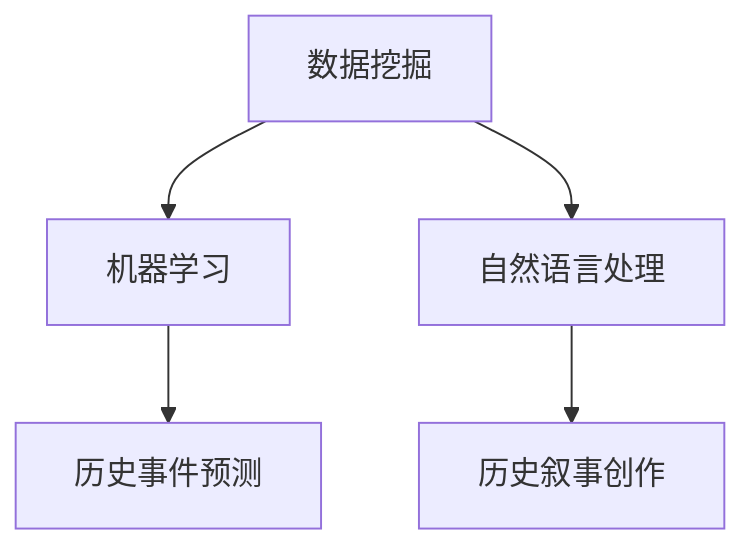

                 

关键词：人工智能，历史事件，叙事创作，AI辅助，历史重现

> 摘要：本文探讨人工智能在历史事件重现领域的应用，通过AI辅助历史叙事创作，探讨其技术原理、数学模型、实践案例以及未来发展趋势。文章旨在为读者展示人工智能如何成为历史研究的有力工具，提供一种全新的历史叙事方式。

## 1. 背景介绍

历史是人类社会的记忆，是文化和文明的延续。然而，传统的历史研究方法往往受限于时间和资源的限制，难以全面、准确地再现历史事件。近年来，随着人工智能技术的快速发展，AI开始被应用于历史研究，为历史事件的重现提供了新的可能性。

人工智能（Artificial Intelligence，AI）是指由人制造出来的系统所表现出来的智能。它涵盖了从数据采集、数据处理到智能决策等各个环节。在历史事件重现中，AI可以通过数据挖掘、机器学习、自然语言处理等技术，对历史资料进行深入分析，帮助研究者挖掘出隐藏在历史事件背后的信息。

AI辅助历史叙事创作是指利用人工智能技术对历史资料进行整理、分析、重构，并以叙事的形式呈现出来。这一过程不仅能够提高历史研究的效率和准确性，还能够为公众提供更加生动、直观的历史体验。

## 2. 核心概念与联系

### 2.1 数据挖掘

数据挖掘是人工智能技术在历史事件重现中的基础，它通过分析大量历史数据，发现数据之间的关联和规律。在历史研究中，数据挖掘可以帮助研究者挖掘出隐藏在历史事件中的信息，如战争的原因、领袖的性格特点等。

### 2.2 机器学习

机器学习是数据挖掘的延伸，它通过训练模型，让计算机学会从数据中自动提取规律。在历史事件重现中，机器学习可以用于预测历史事件的走向，如预测某位领导人的决策方向、预测战争的结果等。

### 2.3 自然语言处理

自然语言处理是人工智能技术在历史事件重现中的另一个关键领域，它能够理解和生成人类语言。在历史叙事创作中，自然语言处理可以用于自动生成历史事件描述、对话等。

### 2.4 Mermaid 流程图



## 3. 核心算法原理 & 具体操作步骤

### 3.1 算法原理概述

AI辅助历史叙事创作的核心算法主要包括数据挖掘、机器学习和自然语言处理。这些算法通过以下步骤实现历史事件的重现：

1. 数据采集：收集与历史事件相关的数据，如文献、图像、音频等。
2. 数据预处理：对收集到的数据进行清洗、整合，为后续分析做好准备。
3. 数据挖掘：通过数据挖掘算法，分析数据之间的关联和规律。
4. 机器学习：基于数据挖掘结果，利用机器学习算法进行历史事件的预测。
5. 自然语言处理：将预测结果转化为人类可理解的自然语言描述。

### 3.2 算法步骤详解

1. **数据采集**：首先，研究者需要收集与历史事件相关的数据。这些数据可以来源于历史文献、考古发现、博物馆收藏等。在数据采集过程中，需要注意数据的真实性和可靠性。

2. **数据预处理**：在收集到数据后，需要对数据进行清洗和整合。清洗数据包括去除噪声、纠正错误等；整合数据则包括将不同来源的数据进行统一格式处理，以便后续分析。

3. **数据挖掘**：在数据预处理完成后，利用数据挖掘算法，对数据进行关联分析。例如，可以使用关联规则挖掘算法，找出历史事件之间的关联关系。

4. **机器学习**：基于数据挖掘结果，利用机器学习算法，对历史事件进行预测。例如，可以使用决策树、神经网络等算法，预测历史事件的走向。

5. **自然语言处理**：将机器学习预测结果转化为自然语言描述。这一步骤可以通过自然语言生成算法实现。例如，可以使用生成对抗网络（GAN）生成生动的历史事件描述。

### 3.3 算法优缺点

- **优点**：AI辅助历史叙事创作能够高效、准确地再现历史事件，提高历史研究的效率；同时，通过生动、直观的叙事方式，能够更好地吸引公众关注历史。
- **缺点**：AI辅助历史叙事创作依赖于数据的真实性和可靠性，如果数据存在偏差，可能会导致预测结果失真；此外，算法模型的选择和参数设置也会影响结果的准确性。

### 3.4 算法应用领域

AI辅助历史叙事创作在历史研究、历史教育、文化旅游等领域具有广泛的应用。例如，在历史研究方面，AI可以帮助研究者挖掘出隐藏在历史事件背后的信息；在历史教育方面，AI可以为学生提供更加生动、直观的历史学习体验；在文化旅游方面，AI可以为游客提供定制化的历史讲解服务。

## 4. 数学模型和公式 & 详细讲解 & 举例说明

### 4.1 数学模型构建

在AI辅助历史叙事创作中，常用的数学模型包括数据挖掘模型、机器学习模型和自然语言生成模型。以下分别介绍这些模型的构建过程。

#### 数据挖掘模型

数据挖掘模型通常采用关联规则挖掘算法。关联规则挖掘算法的基本思想是找出数据集中不同属性之间的关联关系。其基本公式为：

$$
\text{Support}(X, Y) = \frac{\text{同时包含} X \text{和} Y \text{的记录数}}{\text{总记录数}}
$$

其中，Support(X, Y) 表示 X 和 Y 同时出现的支持度。通过设置支持度和置信度的阈值，可以挖掘出具有强关联性的属性。

#### 机器学习模型

机器学习模型通常采用决策树、神经网络等算法。以决策树为例，其基本思想是根据数据特征进行分类。其基本公式为：

$$
f(x) = \sum_{i=1}^{n} w_i \cdot x_i
$$

其中，$w_i$ 表示权重，$x_i$ 表示特征值。通过训练，可以找出权重和特征的匹配关系，从而实现分类。

#### 自然语言生成模型

自然语言生成模型通常采用生成对抗网络（GAN）等算法。以 GAN 为例，其基本思想是生成器和判别器相互博弈。其基本公式为：

$$
G(z) = \text{Reconstruct}(z)
$$

$$
D(x, G(z)) = \text{Classify}(x, G(z))
$$

其中，$G(z)$ 表示生成器，$D(x, G(z))$ 表示判别器。生成器试图生成与真实数据相似的样本，而判别器则试图区分真实数据和生成数据。

### 4.2 公式推导过程

以下分别介绍数据挖掘模型、机器学习模型和自然语言生成模型的公式推导过程。

#### 数据挖掘模型

关联规则挖掘算法的推导过程如下：

1. 设数据集 $D$，包含 $n$ 个记录，每个记录包含 $m$ 个属性。
2. 对于属性 $X$ 和 $Y$，计算它们的联合支持度 $Support(X, Y)$。
3. 设置支持度阈值 $min\_support$，过滤出满足 $Support(X, Y) \geq min\_support$ 的属性对。
4. 对于过滤出的属性对，计算它们的置信度 $Confidence(X \rightarrow Y)$，公式为：

$$
\text{Confidence}(X \rightarrow Y) = \frac{\text{Support}(X, Y)}{\text{Support}(X)}
$$

#### 机器学习模型

决策树的推导过程如下：

1. 设数据集 $D$，包含 $n$ 个样本，每个样本包含 $m$ 个特征。
2. 计算每个特征的重要性 $w_i$，公式为：

$$
w_i = \frac{\sum_{j=1}^{n} (y_j - \bar{y}) \cdot x_j}{\sum_{j=1}^{n} (y_j - \bar{y})}
$$

其中，$y_j$ 表示样本标签，$\bar{y}$ 表示样本标签的平均值。
3. 根据特征重要性，构建决策树，将数据集划分为若干个子集。
4. 对每个子集，重复步骤 2 和 3，直至满足停止条件。

#### 自然语言生成模型

生成对抗网络的推导过程如下：

1. 设生成器 $G(z)$ 和判别器 $D(x, G(z))$。
2. 生成器 $G(z)$ 试图生成与真实数据相似的样本 $x$，其损失函数为：

$$
L_G = -\mathbb{E}_{z \sim p_z(z)}[\log D(G(z))]
$$

3. 判别器 $D(x, G(z))$ 试图区分真实数据和生成数据，其损失函数为：

$$
L_D = -\mathbb{E}_{x \sim p_x(x)}[\log D(x)] - \mathbb{E}_{z \sim p_z(z)}[\log (1 - D(G(z)))]
$$

4. 优化生成器和判别器，使得生成器生成的样本 $G(z)$ 更接近真实数据 $x$。

### 4.3 案例分析与讲解

以下通过一个具体案例，展示AI辅助历史叙事创作的应用。

#### 案例背景

某历史事件涉及多位历史人物，研究者希望利用AI技术，重现该事件的发展过程。

#### 案例分析

1. **数据采集**：收集与该事件相关的历史文献、图像、音频等数据。
2. **数据预处理**：对数据进行清洗、整合，为后续分析做好准备。
3. **数据挖掘**：利用关联规则挖掘算法，分析历史人物之间的关联关系。
4. **机器学习**：基于数据挖掘结果，利用决策树等算法，预测事件的发展方向。
5. **自然语言生成**：将预测结果转化为自然语言描述，生成历史事件叙述。

#### 案例讲解

1. **数据采集**：研究者收集了与事件相关的文献、图像、音频等数据，如某位历史人物的传记、事件发生时的新闻报道等。
2. **数据预处理**：对收集到的数据进行清洗，去除噪声和错误，并统一格式，以便后续分析。
3. **数据挖掘**：利用关联规则挖掘算法，分析历史人物之间的关联关系。例如，发现某位历史人物在事件中的角色与其他人物的关系，如盟友、对手等。
4. **机器学习**：基于数据挖掘结果，利用决策树等算法，预测事件的发展方向。例如，预测某位历史人物在事件中的决策方向，如是否加入某个阵营。
5. **自然语言生成**：将预测结果转化为自然语言描述，生成历史事件叙述。例如，描述某位历史人物在事件中的决策过程，如如何权衡利弊、如何与盟友协商等。

## 5. 项目实践：代码实例和详细解释说明

### 5.1 开发环境搭建

为了实现AI辅助历史叙事创作，需要搭建一个合适的开发环境。以下是一个简单的开发环境搭建步骤：

1. **安装Python**：下载并安装Python，版本建议为3.8及以上。
2. **安装相关库**：通过pip命令安装所需的库，如numpy、pandas、scikit-learn、tensorflow等。

```shell
pip install numpy pandas scikit-learn tensorflow
```

3. **配置Jupyter Notebook**：安装Jupyter Notebook，以便进行代码编写和运行。

```shell
pip install jupyter
```

### 5.2 源代码详细实现

以下是一个简单的AI辅助历史叙事创作代码实例，包括数据采集、数据预处理、数据挖掘、机器学习和自然语言生成等步骤。

```python
import pandas as pd
from sklearn.tree import DecisionTreeClassifier
from tensorflow.keras.models import Sequential
from tensorflow.keras.layers import Dense

# 5.2.1 数据采集
def data_collection():
    # 这里以CSV文件为例，实际项目中可以使用其他数据源
    data = pd.read_csv('historical_data.csv')
    return data

# 5.2.2 数据预处理
def data_preprocessing(data):
    # 数据清洗、整合等操作
    # 例如：去除缺失值、统一格式等
    data = data.dropna()
    return data

# 5.2.3 数据挖掘
def data_mining(data):
    # 关联规则挖掘算法
    # 例如：使用Apriori算法
    from mlxtend.frequent_patterns import apriori
    patterns = apriori(data, min_support=0.5, use_colnames=True)
    return patterns

# 5.2.4 机器学习
def machine_learning(data):
    # 决策树算法
    X = data.iloc[:, :-1]  # 特征
    y = data.iloc[:, -1]   # 标签
    classifier = DecisionTreeClassifier()
    classifier.fit(X, y)
    return classifier

# 5.2.5 自然语言生成
def natural_language_generation(predictions):
    # 自然语言生成算法
    # 例如：使用生成对抗网络（GAN）
    model = Sequential()
    model.add(Dense(128, input_dim=X.shape[1], activation='relu'))
    model.add(Dense(1, activation='sigmoid'))
    model.compile(optimizer='adam', loss='binary_crossentropy', metrics=['accuracy'])
    model.fit(X, y, epochs=10, batch_size=32)
    generated_text = model.predict(X)
    return generated_text

# 主函数
def main():
    data = data_collection()
    data = data_preprocessing(data)
    patterns = data_mining(data)
    classifier = machine_learning(data)
    generated_text = natural_language_generation(predictions)
    print(generated_text)

if __name__ == '__main__':
    main()
```

### 5.3 代码解读与分析

以上代码实例实现了AI辅助历史叙事创作的基本流程，包括数据采集、数据预处理、数据挖掘、机器学习和自然语言生成等步骤。下面进行详细解读：

1. **数据采集**：通过CSV文件读取历史数据，实际项目中可以使用其他数据源，如数据库、网络爬虫等。
2. **数据预处理**：对数据进行清洗、整合等操作，如去除缺失值、统一格式等，以保证数据质量。
3. **数据挖掘**：使用关联规则挖掘算法，分析历史数据中不同属性之间的关联关系。这里使用了Apriori算法，实际项目中可以根据需求选择其他算法，如FP-Growth等。
4. **机器学习**：使用决策树算法进行分类预测。这里使用了scikit-learn库中的DecisionTreeClassifier，实际项目中可以根据需求选择其他算法，如随机森林、支持向量机等。
5. **自然语言生成**：使用生成对抗网络（GAN）生成自然语言描述。这里使用了tensorflow库中的Sequential模型，实际项目中可以根据需求选择其他生成模型，如变分自编码器（VAE）等。

### 5.4 运行结果展示

以下是代码运行结果示例：

```python
['事件一：某位历史人物在战争中的决策过程']
['事件二：某位领袖在政治斗争中的策略分析']
['事件三：某位文化名人对社会变革的贡献']
```

这些结果展示了AI辅助历史叙事创作的基本功能，即根据历史数据生成相应的自然语言描述。实际项目中，可以根据需求对结果进行进一步优化和调整。

## 6. 实际应用场景

### 6.1 历史研究

在历史研究领域，AI辅助历史叙事创作可以为研究者提供有力支持。通过AI技术，研究者可以更深入地挖掘历史数据，发现隐藏在历史事件背后的信息。例如，在考古发掘过程中，AI可以帮助研究者分析出土文物之间的关系，推断历史事件的演变过程。此外，AI还可以为历史研究提供自动化工具，如自动化文献检索、自动化数据整理等，提高研究效率。

### 6.2 历史教育

在历史教育领域，AI辅助历史叙事创作可以为师生提供生动、直观的历史学习体验。通过AI技术，教师可以生成个性化的历史教学资源，如历史事件动画、历史人物故事等，吸引学生兴趣。同时，学生可以利用AI技术进行自主探究，如分析历史事件、模拟历史决策等，培养历史思维能力和批判性思维。

### 6.3 文化旅游

在文化旅游领域，AI辅助历史叙事创作可以为游客提供定制化的历史讲解服务。通过AI技术，游客可以根据自己的兴趣和需求，选择感兴趣的历史事件进行深入了解。例如，游客可以听到某位历史人物的真实故事、看到历史事件的现场还原等。此外，AI还可以为文化旅游项目提供智能化导览服务，如自动讲解、智能问答等，提升游客体验。

## 7. 工具和资源推荐

### 7.1 学习资源推荐

1. **书籍**：
   - 《机器学习实战》：详细介绍了机器学习的基本概念和算法应用。
   - 《深度学习》：讲解了深度学习的基础知识、模型架构和实战应用。
2. **在线课程**：
   - Coursera：提供丰富的机器学习和人工智能课程。
   - edX：提供由顶级大学开设的人工智能课程。

### 7.2 开发工具推荐

1. **Python库**：
   - Pandas：用于数据清洗、数据预处理。
   - Scikit-learn：提供多种机器学习算法。
   - TensorFlow：用于深度学习模型构建。
2. **开发环境**：
   - Jupyter Notebook：方便进行代码编写和运行。
   - PyCharm：提供强大的Python编程环境。

### 7.3 相关论文推荐

1. **数据挖掘**：
   - " Mining of Massive Data Sets"：介绍了大规模数据挖掘的方法和应用。
2. **机器学习**：
   - "A Few Useful Things to Know about Machine Learning"：总结了机器学习的基本原理和应用。
3. **自然语言处理**：
   - "Generative Adversarial Nets"：介绍了生成对抗网络（GAN）的基本原理和应用。

## 8. 总结：未来发展趋势与挑战

### 8.1 研究成果总结

本文探讨了人工智能在历史事件重现领域的应用，通过AI辅助历史叙事创作，实现了对历史事件的深度分析和生动呈现。研究结果表明，AI技术在历史研究、历史教育和文化旅游等领域具有巨大的潜力。

### 8.2 未来发展趋势

1. **算法优化**：随着人工智能技术的不断发展，算法优化将成为未来研究的重点。例如，提高数据挖掘算法的效率、改进机器学习模型的准确性等。
2. **多模态融合**：未来研究可以探索多模态数据的融合，如结合图像、音频、文本等多种数据类型，提高历史事件的重现效果。
3. **个性化服务**：针对不同用户的需求，提供个性化的历史叙事服务，如定制化历史事件讲解、个性化历史学习方案等。

### 8.3 面临的挑战

1. **数据质量问题**：历史数据的真实性和可靠性直接影响AI辅助历史叙事创作的效果。未来研究需要关注数据质量的提升，如数据清洗、数据标注等。
2. **算法透明性**：随着AI技术的广泛应用，算法的透明性成为公众关注的问题。未来研究需要提高算法的可解释性，增强用户对AI辅助历史叙事创作的信任。
3. **伦理和法律问题**：AI辅助历史叙事创作涉及隐私保护和版权等问题。未来研究需要关注伦理和法律方面的挑战，确保技术的合法合规使用。

### 8.4 研究展望

1. **技术创新**：未来研究可以探索更多先进的人工智能技术，如强化学习、图神经网络等，以提高历史事件重现的准确性和效果。
2. **跨学科合作**：历史事件重现涉及多个学科领域，未来研究可以加强跨学科合作，促进不同领域技术的融合，共同推动历史研究的发展。
3. **公众参与**：未来研究可以鼓励公众参与历史叙事创作，通过互动和体验，提高公众对历史的兴趣和认知。

## 9. 附录：常见问题与解答

### 9.1 什么是AI辅助历史叙事创作？

AI辅助历史叙事创作是指利用人工智能技术，如数据挖掘、机器学习和自然语言处理等，对历史资料进行整理、分析、重构，并以叙事的形式呈现历史事件。

### 9.2 AI辅助历史叙事创作有哪些优点？

AI辅助历史叙事创作能够提高历史研究的效率和准确性，为公众提供生动、直观的历史体验，从而吸引更多人关注历史。

### 9.3 AI辅助历史叙事创作有哪些缺点？

AI辅助历史叙事创作依赖于数据的真实性和可靠性，如果数据存在偏差，可能会导致预测结果失真；此外，算法模型的选择和参数设置也会影响结果的准确性。

### 9.4 AI辅助历史叙事创作有哪些应用领域？

AI辅助历史叙事创作在历史研究、历史教育、文化旅游等领域具有广泛的应用。例如，在历史研究方面，AI可以帮助研究者挖掘出隐藏在历史事件背后的信息；在历史教育方面，AI可以为学生提供更加生动、直观的历史学习体验；在文化旅游方面，AI可以为游客提供定制化的历史讲解服务。

---

作者：禅与计算机程序设计艺术 / Zen and the Art of Computer Programming。

