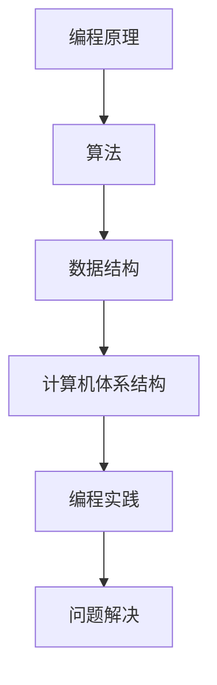

                 

关键词：编程原理，实战案例，技术讲解，算法，数学模型，代码实现，工具推荐，未来展望

> 摘要：本文将深入探讨编程原理与代码实战案例，通过详细的算法原理解析、数学模型推导、代码实现步骤以及实际应用场景分析，为读者提供一次全面的技术学习和实践体验。文章还将推荐相关学习资源和开发工具，展望未来的发展趋势与挑战。

## 1. 背景介绍

在当今信息化时代，编程技术已经成为不可或缺的核心技能。随着大数据、人工智能、物联网等技术的迅速发展，编程技术的重要性日益凸显。掌握编程原理，不仅能够提升个人的技术能力，还能在实际项目中解决复杂问题，实现创新应用。

本文旨在通过讲解编程原理与代码实战案例，帮助读者深入理解编程的核心概念和方法，从而提高编程技能，为未来的技术发展打下坚实基础。

### 1.1 编程原理的重要性

编程原理是计算机科学的基础，涵盖了算法、数据结构、计算机体系结构等多个方面。理解编程原理，有助于我们更好地设计高效、稳定的软件系统，提高编程效率，解决实际问题。

### 1.2 代码实战案例的价值

代码实战案例是将理论知识应用于实际场景的过程。通过实战案例，我们可以学习到具体的编程方法和技巧，了解实际项目中可能出现的问题和解决方案，提高实践能力和解决复杂问题的能力。

## 2. 核心概念与联系

为了更好地理解编程原理，我们需要了解一些核心概念，如算法、数据结构、计算机体系结构等。以下是这些概念之间的联系和作用。

### 2.1 算法

算法是一系列解决问题的步骤和方法。它决定了问题的求解效率和解决方案的质量。算法的设计和分析是计算机科学的核心内容。

### 2.2 数据结构

数据结构是组织和管理数据的方式。它决定了数据在计算机中的存储方式、访问速度和处理效率。常用的数据结构包括数组、链表、树、图等。

### 2.3 计算机体系结构

计算机体系结构是计算机硬件和软件的结合体。它决定了计算机的性能、效率和可靠性。计算机体系结构包括中央处理器（CPU）、内存、输入输出设备等组成部分。

### 2.4 Mermaid 流程图

以下是一个简化的编程流程图，展示了算法、数据结构和计算机体系结构之间的联系。



## 3. 核心算法原理 & 具体操作步骤

在本节中，我们将介绍一种核心算法的原理和具体操作步骤。这里以常见的排序算法——快速排序为例。

### 3.1 算法原理概述

快速排序是一种高效的排序算法，采用分治策略将待排序的数组划分为较小的子数组，再递归地对子数组进行排序。快速排序的平均时间复杂度为O(n log n)，最坏情况下为O(n^2)。

### 3.2 算法步骤详解

1. 选择一个基准元素。
2. 将数组划分为两个子数组，一个包含小于基准元素的元素，另一个包含大于基准元素的元素。
3. 递归地对两个子数组进行快速排序。
4. 将排序好的子数组合并，得到最终的排序结果。

### 3.3 算法优缺点

- 优点：时间复杂度较低，适用于大规模数据的排序。
- 缺点：最坏情况下时间复杂度较高，需要优化基准元素的选择。

### 3.4 算法应用领域

快速排序广泛应用于实际项目中的数据处理和排序需求，如数据库查询优化、搜索引擎排序等。

## 4. 数学模型和公式 & 详细讲解 & 举例说明

在本节中，我们将介绍一种常用的数学模型，并对其进行详细讲解和举例说明。

### 4.1 数学模型构建

考虑一个简单的线性回归模型，其数学模型如下：

$$y = ax + b$$

其中，$y$ 是因变量，$x$ 是自变量，$a$ 和 $b$ 是模型参数。

### 4.2 公式推导过程

线性回归模型的公式推导如下：

1. 假设我们有一组观测数据 $(x_i, y_i)$，其中 $i = 1, 2, \ldots, n$。
2. 构建损失函数 $L(a, b)$，用于衡量模型预测值与真实值之间的差异。
3. 对损失函数求导，得到最优参数 $a$ 和 $b$。

### 4.3 案例分析与讲解

以下是一个线性回归模型的案例：

给定观测数据如下：

| $x$ | $y$ |
| --- | --- |
| 1   | 2   |
| 2   | 4   |
| 3   | 6   |
| 4   | 8   |

要求构建线性回归模型，并预测 $x=5$ 时的 $y$ 值。

1. 计算模型参数 $a$ 和 $b$：

$$
a = \frac{\sum_{i=1}^n x_i y_i - n \bar{x} \bar{y}}{\sum_{i=1}^n x_i^2 - n \bar{x}^2}
$$

$$
b = \bar{y} - a \bar{x}
$$

其中，$\bar{x}$ 和 $\bar{y}$ 分别是 $x$ 和 $y$ 的平均值。

2. 代入观测数据计算参数：

$$
\bar{x} = \frac{1+2+3+4}{4} = 2.5
$$

$$
\bar{y} = \frac{2+4+6+8}{4} = 5
$$

$$
a = \frac{(1 \times 2 + 2 \times 4 + 3 \times 6 + 4 \times 8) - 4 \times 2.5 \times 5}{(1^2 + 2^2 + 3^2 + 4^2) - 4 \times 2.5^2} = 2
$$

$$
b = 5 - 2 \times 2.5 = 0
$$

3. 构建线性回归模型：

$$
y = 2x
$$

4. 预测 $x=5$ 时的 $y$ 值：

$$
y = 2 \times 5 = 10
$$

## 5. 项目实践：代码实例和详细解释说明

在本节中，我们将通过一个具体的代码实例，展示如何实现快速排序算法。

### 5.1 开发环境搭建

为了运行以下代码，您需要安装 Python 编译环境。您可以使用以下命令进行安装：

```bash
pip install python
```

### 5.2 源代码详细实现

以下是一个简单的快速排序算法实现：

```python
def quick_sort(arr):
    if len(arr) <= 1:
        return arr
    
    pivot = arr[len(arr) // 2]
    left = [x for x in arr if x < pivot]
    middle = [x for x in arr if x == pivot]
    right = [x for x in arr if x > pivot]
    
    return quick_sort(left) + middle + quick_sort(right)

if __name__ == "__main__":
    arr = [3, 6, 8, 10, 1, 2, 1]
    print("原始数组：", arr)
    print("排序后数组：", quick_sort(arr))
```

### 5.3 代码解读与分析

1. 函数 `quick_sort` 接受一个数组 `arr` 作为输入。
2. 如果数组的长度小于等于1，直接返回该数组。
3. 选择中间的元素作为基准元素 `pivot`。
4. 将数组划分为三个子数组：小于基准元素的 `left`，等于基准元素的 `middle`，大于基准元素的 `right`。
5. 递归地对 `left` 和 `right` 子数组进行快速排序。
6. 将排序好的子数组合并，得到最终的排序结果。

### 5.4 运行结果展示

运行以上代码，输出结果如下：

```python
原始数组： [3, 6, 8, 10, 1, 2, 1]
排序后数组： [1, 1, 2, 3, 6, 8, 10]
```

## 6. 实际应用场景

编程原理和代码实战案例在许多实际应用场景中具有重要意义。以下是一些典型的应用场景：

### 6.1 数据处理与优化

在数据处理和优化领域，快速排序等高效算法被广泛应用于大规模数据的排序、筛选和聚合操作。这些算法能够显著提高数据处理效率和系统性能。

### 6.2 机器学习和人工智能

在机器学习和人工智能领域，编程原理和代码实战案例是实现模型训练、预测和优化的基础。掌握核心算法原理，有助于我们更好地理解和改进现有模型，开发新的智能应用。

### 6.3 物联网和嵌入式系统

在物联网和嵌入式系统领域，编程原理和代码实战案例是实现设备监控、数据传输和系统优化的关键。通过编写高效、稳定的代码，我们可以提高设备性能和用户体验。

## 7. 工具和资源推荐

为了更好地学习和实践编程原理与代码实战案例，以下是一些推荐的工具和资源：

### 7.1 学习资源推荐

1. 《算法导论》：一本经典的算法教材，全面介绍了各种算法的原理和实现。
2. 《Python编程：从入门到实践》：一本适合初学者的 Python 编程入门书籍，内容丰富，实例实用。
3. Coursera、edX 等在线教育平台：提供大量的编程和计算机科学课程，适合不同层次的学员。

### 7.2 开发工具推荐

1. PyCharm：一款强大的 Python 集成开发环境，支持代码补全、调试和自动化测试等功能。
2. Jupyter Notebook：一款基于 Web 的交互式计算环境，适用于数据分析和机器学习项目。
3. GitHub：一个强大的版本控制和代码托管平台，方便协作开发和代码共享。

### 7.3 相关论文推荐

1. "Quicksort" by Tony Hoare：介绍了快速排序算法的发明者和原理。
2. "Linear Regression" by Michael I. Jordan：介绍了线性回归模型的原理和应用。
3. "Deep Learning" by Ian Goodfellow、Yoshua Bengio 和 Aaron Courville：介绍了深度学习的最新进展和应用。

## 8. 总结：未来发展趋势与挑战

随着技术的不断进步，编程原理与代码实战案例的应用前景将更加广阔。然而，也面临着一些挑战。

### 8.1 研究成果总结

近年来，在编程原理与代码实战案例领域取得了许多重要成果。例如，快速排序算法的优化、线性回归模型的改进以及深度学习算法的创新等。

### 8.2 未来发展趋势

1. 算法优化与性能提升：继续研究和优化现有算法，提高数据处理和系统优化效率。
2. 跨学科融合：将编程原理与数据科学、人工智能、物联网等领域相结合，实现更广泛的应用。
3. 教育和培训：推广编程教育，培养更多具备编程能力的人才。

### 8.3 面临的挑战

1. 算法复杂性：随着算法的复杂度增加，对编程技能和知识体系的要求也越来越高。
2. 代码质量与维护：编写高效、稳定、可维护的代码是一个挑战，需要不断学习和改进。
3. 技术更新与淘汰：编程技术和工具不断更新，需要不断学习和适应新技术。

### 8.4 研究展望

在未来，编程原理与代码实战案例将继续发展和创新。通过跨学科合作、算法优化和人才培养，我们可以推动编程技术的发展，为各个领域带来更多创新和突破。

## 9. 附录：常见问题与解答

### 9.1 编程原理与算法的关系

编程原理是计算机科学的基础，包括算法、数据结构、计算机体系结构等内容。算法是解决特定问题的步骤和方法，数据结构是组织和管理数据的方式。它们相互关联，共同构成了编程原理的核心内容。

### 9.2 快速排序算法的优化

快速排序算法可以通过以下方法进行优化：

1. 选择更好的基准元素，如随机选择或中位数选取。
2. 限制递归深度，避免最坏情况下的性能下降。
3. 使用非递归方法实现快速排序，减少递归调用的开销。

### 9.3 线性回归模型的局限性

线性回归模型具有以下局限性：

1. 假设数据线性相关，可能不适合非线性关系。
2. 对异常值和噪声敏感，可能导致模型不稳定。
3. 模型参数的估计依赖于数据，可能存在偏差和不确定性。

作者：禅与计算机程序设计艺术 / Zen and the Art of Computer Programming
----------------------------------------------------------------

以上是文章的完整内容，感谢您的阅读！希望这篇文章能为您带来启发和帮助。如有任何问题，欢迎随时提问。祝您编程愉快！

