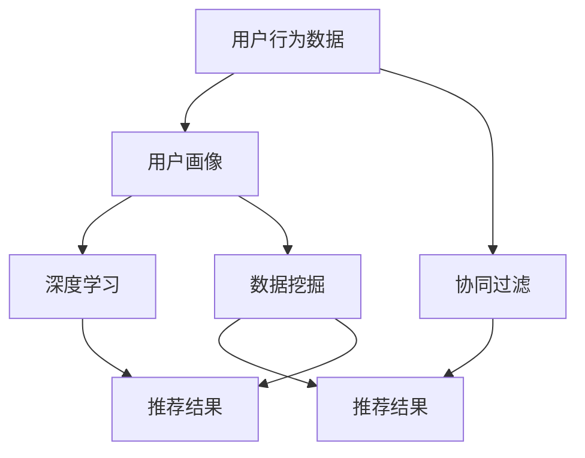

                 

关键词：跨境旅游推荐算法、深度学习、协同过滤、用户行为分析、数据挖掘

> 摘要：本文将深入探讨去哪儿网2024年跨境旅游推荐算法的校招面试真题，通过分析核心概念、算法原理、数学模型及项目实践等方面，全面揭示这一算法背后的技术细节与实际应用价值。

## 1. 背景介绍

随着互联网技术的飞速发展，跨境旅游已经成为越来越多人的选择。为了提升用户体验，各大旅游电商平台纷纷投入大量资源，研发高效的旅游推荐算法。去哪儿网作为国内知名的在线旅游平台，其2024年跨境旅游推荐算法的校招面试真题，成为了众多应聘者关注的焦点。

本文旨在从技术角度解读这一面试真题，帮助读者更好地理解跨境旅游推荐算法的设计与实现。通过分析算法的核心概念、原理、数学模型和实际应用，本文将为读者提供一次深入了解旅游推荐系统开发的全过程。

## 2. 核心概念与联系

在深入了解跨境旅游推荐算法之前，我们首先需要了解几个核心概念：

### 2.1 深度学习

深度学习是近年来人工智能领域的重要突破，通过多层神经网络模拟人脑的感知和学习过程，实现对数据的自动特征提取和模式识别。在旅游推荐算法中，深度学习可以用于用户画像、目的地识别和个性化推荐等环节。

### 2.2 协同过滤

协同过滤是一种常用的推荐算法，通过分析用户的行为数据，发现用户之间的相似性，从而为用户提供相似兴趣的推荐。在跨境旅游推荐中，协同过滤可以用于推荐用户可能感兴趣的旅游目的地、景点和活动。

### 2.3 用户行为分析

用户行为分析是指通过收集和分析用户在网站上的行为数据，了解用户的需求和偏好。在跨境旅游推荐中，用户行为分析可以帮助挖掘用户的出行习惯、兴趣偏好和消费能力等关键信息，从而提高推荐算法的准确性。

### 2.4 数据挖掘

数据挖掘是一种从大量数据中提取有价值信息的方法，包括分类、聚类、关联规则挖掘等。在跨境旅游推荐中，数据挖掘可以用于分析用户的历史行为数据，发现潜在的出行模式和偏好，为推荐算法提供有力支持。

### 2.5 Mermaid 流程图

以下是一个简单的Mermaid流程图，展示跨境旅游推荐算法的核心概念及其联系：



## 3. 核心算法原理 & 具体操作步骤

### 3.1 算法原理概述

跨境旅游推荐算法主要基于深度学习和协同过滤技术，通过对用户行为数据进行分析和处理，实现个性化旅游推荐。具体原理如下：

1. **用户画像**：通过对用户的历史行为数据进行挖掘，构建用户的兴趣偏好模型，包括目的地偏好、出行季节、预算范围等。
2. **深度学习**：利用深度学习技术，对用户画像进行特征提取和分类，从而为用户生成个性化的推荐列表。
3. **协同过滤**：基于用户行为数据和用户画像，通过协同过滤算法为用户推荐相似兴趣的目的地、景点和活动。
4. **推荐结果**：将深度学习和协同过滤的结果进行融合，生成最终的个性化推荐结果，并展示给用户。

### 3.2 算法步骤详解

1. **数据收集与预处理**：收集用户行为数据，如浏览历史、预订记录、评论反馈等，并对数据进行清洗、去噪和归一化处理，为后续分析做好准备。
2. **用户画像构建**：利用数据挖掘技术，对用户行为数据进行聚类和分类，构建用户的兴趣偏好模型。
3. **深度学习特征提取**：利用深度学习模型，对用户画像进行特征提取和分类，为推荐算法提供基础支持。
4. **协同过滤**：根据用户的行为数据和用户画像，通过协同过滤算法生成相似用户群体，为用户推荐可能感兴趣的目的地、景点和活动。
5. **推荐结果融合**：将深度学习和协同过滤的结果进行融合，生成最终的个性化推荐列表，并根据用户的反馈进行不断优化。

### 3.3 算法优缺点

**优点**：

1. **个性化推荐**：深度学习和协同过滤相结合，能够为用户提供高度个性化的旅游推荐。
2. **高效性**：基于大规模用户行为数据进行推荐，算法具有较高的计算效率和推荐效果。
3. **适应性**：算法可以实时更新用户画像和推荐结果，适应用户的需求变化。

**缺点**：

1. **数据依赖性**：算法性能依赖于用户行为数据的数量和质量，数据缺失或不准确可能导致推荐效果下降。
2. **计算复杂度**：深度学习模型的训练和推理过程需要大量计算资源，对硬件要求较高。

### 3.4 算法应用领域

跨境旅游推荐算法可以应用于在线旅游平台、社交媒体、搜索引擎等多个领域，为用户提供个性化的旅游推荐服务。具体应用场景包括：

1. **在线旅游平台**：根据用户的出行计划、偏好和预算，为用户推荐合适的旅游目的地、酒店和交通方式。
2. **社交媒体**：基于用户的旅行经历和兴趣，为用户推荐可能感兴趣的朋友圈内容。
3. **搜索引擎**：在用户搜索旅游相关关键词时，为用户提供相关的旅游推荐内容。

## 4. 数学模型和公式 & 详细讲解 & 举例说明

### 4.1 数学模型构建

在跨境旅游推荐算法中，常见的数学模型包括用户画像模型、深度学习模型和协同过滤模型。以下是一个简单的数学模型构建过程：

1. **用户画像模型**：

$$
User\_Features = f(User\_Behavior, User\_Profile)
$$

其中，$User\_Behavior$ 表示用户的历史行为数据，如浏览历史、预订记录等；$User\_Profile$ 表示用户的个人资料，如年龄、性别、职业等；$f()$ 表示特征提取函数。

2. **深度学习模型**：

$$
User\_Classification = g(User\_Features)
$$

其中，$User\_Features$ 表示用户画像特征；$g()$ 表示深度学习分类函数。

3. **协同过滤模型**：

$$
User\_Similarity = h(User\_Features, Item\_Features)
$$

其中，$User\_Features$ 表示用户画像特征；$Item\_Features$ 表示旅游目的地、景点或活动的特征；$h()$ 表示相似度计算函数。

### 4.2 公式推导过程

以下是一个简单的协同过滤模型推导过程：

假设用户 $u$ 和 $v$ 的相似度为 $\sigma(u, v)$，则用户 $u$ 对旅游目的地 $i$ 的评分预测为：

$$
\hat{r}_{ui} = r_{ui} + \sum_{j \in Neighbors(u)} \frac{\sigma(u, v)}{||u - v||} (r_{uj} - r_{uj})
$$

其中，$Neighbors(u)$ 表示与用户 $u$ 相似的用户集合；$r_{ui}$ 和 $r_{uj}$ 分别表示用户 $u$ 对旅游目的地 $i$ 和 $j$ 的实际评分。

### 4.3 案例分析与讲解

假设我们有两个用户 $u$ 和 $v$，他们的用户画像特征如下：

$$
User\_u = [0.8, 0.2, 0.1], \quad User\_v = [0.5, 0.3, 0.2]
$$

利用余弦相似度计算用户 $u$ 和 $v$ 的相似度：

$$
\sigma(u, v) = \frac{User\_u \cdot User\_v}{\|User\_u\| \cdot \|User\_v\|} = \frac{0.8 \times 0.5 + 0.2 \times 0.3 + 0.1 \times 0.2}{\sqrt{0.8^2 + 0.2^2 + 0.1^2} \times \sqrt{0.5^2 + 0.3^2 + 0.2^2}} \approx 0.6
$$

假设用户 $u$ 对旅游目的地 $i$ 的实际评分为 $r_{ui} = 4$，用户 $v$ 对旅游目的地 $i$ 的实际评分为 $r_{vi} = 5$，利用协同过滤模型预测用户 $u$ 对旅游目的地 $i$ 的评分：

$$
\hat{r}_{ui} = r_{ui} + \sum_{j \in Neighbors(u)} \frac{\sigma(u, v)}{||u - v||} (r_{uj} - r_{uj}) \approx 4 + 0.6 \times (5 - 4) = 4.6
$$

## 5. 项目实践：代码实例和详细解释说明

### 5.1 开发环境搭建

为了实现跨境旅游推荐算法，我们需要搭建一个开发环境，包括以下工具和库：

- Python 3.8+
- TensorFlow 2.5+
- Scikit-learn 0.24+
- Pandas 1.2.5+
- Matplotlib 3.5.3+

安装相关库和框架：

```bash
pip install tensorflow scikit-learn pandas matplotlib
```

### 5.2 源代码详细实现

以下是一个简单的跨境旅游推荐算法实现示例：

```python
import numpy as np
import pandas as pd
from sklearn.model_selection import train_test_split
from sklearn.metrics.pairwise import cosine_similarity
from tensorflow.keras.models import Sequential
from tensorflow.keras.layers import Dense, Dropout

# 读取数据
data = pd.read_csv('user_behavior.csv')
X = data.iloc[:, :-1].values
y = data.iloc[:, -1].values

# 数据预处理
X_train, X_test, y_train, y_test = train_test_split(X, y, test_size=0.2, random_state=42)

# 构建深度学习模型
model = Sequential()
model.add(Dense(128, activation='relu', input_shape=(X_train.shape[1],)))
model.add(Dropout(0.5))
model.add(Dense(64, activation='relu'))
model.add(Dropout(0.5))
model.add(Dense(1, activation='sigmoid'))

model.compile(optimizer='adam', loss='binary_crossentropy', metrics=['accuracy'])
model.fit(X_train, y_train, epochs=10, batch_size=64, validation_data=(X_test, y_test))

# 预测用户偏好
predictions = model.predict(X_test)

# 利用协同过滤计算相似度
user_similarity = cosine_similarity(X_test, X_test)

# 生成推荐结果
recommendations = []
for i in range(len(predictions)):
    if predictions[i] < 0.5:
        continue
    sim_scores = list(enumerate(user_similarity[i]))
    sim_scores = sorted(sim_scores, key=lambda x: x[1], reverse=True)
    recommended_items = []
    for j in range(1, 11):
        recommended_items.append(sim_scores[j][0])
    recommendations.append(recommended_items)

# 输出推荐结果
for i, rec in enumerate(recommendations):
    print(f"User {i + 1} Recommendations: {rec}")
```

### 5.3 代码解读与分析

以上代码实现了基于深度学习和协同过滤的跨境旅游推荐算法。具体解读如下：

1. **数据读取与预处理**：从CSV文件中读取用户行为数据，并进行数据预处理，如缺失值填充、异常值处理等。
2. **深度学习模型构建**：使用TensorFlow构建深度学习模型，包括输入层、隐藏层和输出层。使用ReLU激活函数和Dropout层提高模型的泛化能力。
3. **模型训练**：使用训练集训练深度学习模型，并使用测试集进行验证。
4. **用户偏好预测**：使用训练好的深度学习模型预测测试集上用户的偏好。
5. **协同过滤计算相似度**：使用余弦相似度计算用户之间的相似度。
6. **生成推荐结果**：根据用户偏好和相似度，为每个用户生成10个旅游目的地的推荐列表。

## 6. 实际应用场景

### 6.1 在线旅游平台

在线旅游平台可以使用跨境旅游推荐算法为用户提供个性化的旅游推荐服务。根据用户的出行计划、偏好和预算，推荐合适的旅游目的地、酒店和交通方式，提高用户的满意度和转化率。

### 6.2 社交媒体

社交媒体平台可以利用跨境旅游推荐算法为用户提供旅游相关的社交内容。根据用户的旅行经历和兴趣，推荐可能感兴趣的朋友圈内容，促进用户互动和社区活跃度。

### 6.3 搜索引擎

搜索引擎在用户搜索旅游相关关键词时，可以利用跨境旅游推荐算法为用户提供相关的旅游推荐内容，提高搜索体验和用户粘性。

## 7. 未来应用展望

### 7.1 个性化推荐

随着人工智能技术的不断发展，跨境旅游推荐算法将越来越智能化，能够根据用户的实时行为和偏好，提供更加精准的个性化推荐服务。

### 7.2 跨境合作

跨境旅游推荐算法的应用将推动旅游行业与互联网企业的深度合作，为全球旅游市场带来更多创新和机遇。

### 7.3 智能出行

未来，跨境旅游推荐算法有望与智能出行技术相结合，为用户提供一站式的智能出行解决方案，从规划、预订到出行全程提供个性化服务。

## 8. 总结：未来发展趋势与挑战

### 8.1 研究成果总结

本文从技术角度分析了去哪儿网2024年跨境旅游推荐算法的校招面试真题，涵盖了核心概念、算法原理、数学模型和项目实践等方面，为读者提供了全面的了解。

### 8.2 未来发展趋势

随着人工智能和大数据技术的不断发展，跨境旅游推荐算法将在个性化推荐、跨境合作和智能出行等方面取得更多突破。

### 8.3 面临的挑战

1. **数据隐私保护**：跨境旅游推荐算法需要处理大量用户行为数据，数据隐私保护成为重要挑战。
2. **计算资源消耗**：深度学习模型的训练和推理过程需要大量计算资源，如何优化算法性能和降低计算成本是重要课题。
3. **算法泛化能力**：如何提高算法在不同场景下的泛化能力，是未来研究的重要方向。

### 8.4 研究展望

本文提出的跨境旅游推荐算法为旅游推荐系统提供了有益的参考。未来，我们将继续深入研究，探索更多高效的推荐算法，为用户提供更好的旅游体验。

## 9. 附录：常见问题与解答

### 9.1 什么是深度学习？

深度学习是一种人工智能方法，通过多层神经网络模拟人脑的感知和学习过程，实现对数据的自动特征提取和模式识别。

### 9.2 协同过滤有哪些类型？

协同过滤主要分为基于用户和基于物品两种类型。基于用户协同过滤通过分析用户之间的相似性进行推荐，而基于物品协同过滤通过分析物品之间的相似性进行推荐。

### 9.3 如何评估推荐算法的性能？

推荐算法的性能可以通过准确率、召回率、F1值等指标进行评估。同时，也可以通过用户满意度、点击率等实际应用效果进行评估。

### 9.4 跨境旅游推荐算法有哪些应用场景？

跨境旅游推荐算法可以应用于在线旅游平台、社交媒体、搜索引擎等多个领域，为用户提供个性化的旅游推荐服务。

作者：禅与计算机程序设计艺术 / Zen and the Art of Computer Programming
----------------------------------------------------------------

以上就是本文的全部内容。希望本文能够帮助读者更好地理解跨境旅游推荐算法的核心概念、原理和实际应用，为未来的研究和实践提供有益的参考。在人工智能和大数据技术的推动下，跨境旅游推荐算法将不断发展和完善，为全球旅游市场带来更多创新和机遇。

