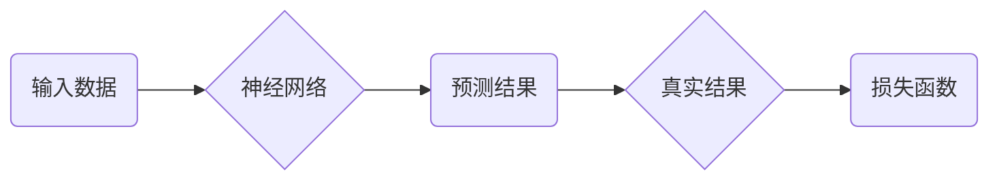
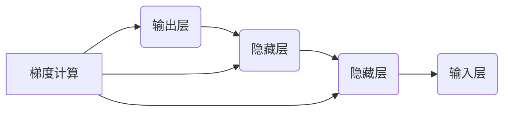
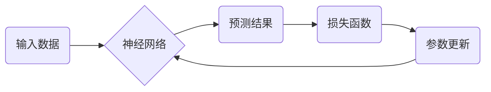

                 

关键词：反向传播，神经网络，深度学习，深度神经网络，梯度下降，多层感知机，训练过程，参数调整

## 摘要

本文将深入探讨反向传播算法的原理及其在神经网络中的应用。反向传播是一种训练神经网络的通用算法，通过迭代调整网络权重以最小化损失函数。本文将详细解释反向传播的数学基础，包括损失函数的构建、梯度的计算、参数更新方法等，并通过实际代码实例，展示如何实现这一过程。读者将通过本文，不仅能够理解反向传播的工作机制，还能掌握如何在实际项目中应用这一重要算法。

## 1. 背景介绍

### 神经网络简介

神经网络（Neural Networks）是一种模拟生物神经系统的计算模型，由大量相互连接的神经元组成。这些神经元通过输入层接受数据，通过隐藏层进行信息处理，最后由输出层产生预测结果。神经网络在计算机视觉、自然语言处理、语音识别等领域取得了显著成果，成为了现代人工智能的核心技术之一。

### 反向传播算法概述

反向传播（Backpropagation）算法是训练神经网络的重要算法之一。它通过计算输出层到输入层的梯度，不断调整网络权重和偏置，以减少预测误差。反向传播算法是深度学习的基础，其核心在于高效地计算梯度，从而实现神经网络的自动优化。

## 2. 核心概念与联系

### 神经元与神经网络

神经元是神经网络的基本构建块，通常由输入层、隐藏层和输出层组成。每个神经元接收来自前一层神经元的输入信号，通过激活函数处理后输出新的信号。神经网络通过多层神经元的堆叠，实现了数据的逐层抽象和特征提取。


### 损失函数与误差计算

在神经网络训练过程中，损失函数用于衡量预测结果与真实结果之间的差距。常见的损失函数有均方误差（MSE）、交叉熵损失等。损失函数的值越小，表示网络预测的准确性越高。



### 梯度与反向传播

梯度（Gradient）是损失函数对网络参数（权重和偏置）的导数，表示参数调整的方向。反向传播算法通过反向传播损失函数的梯度，从输出层开始逐层向输入层传递梯度，从而调整网络参数。



### 梯度下降与参数更新

梯度下降（Gradient Descent）是一种优化算法，通过不断调整参数，使得损失函数值逐渐减小。反向传播算法中的梯度下降过程分为前向传播和反向传播两个阶段。在前向传播阶段，计算输入层到输出层的损失函数值；在反向传播阶段，计算损失函数对网络参数的梯度，并更新参数。



## 3. 核心算法原理 & 具体操作步骤

### 3.1 算法原理概述

反向传播算法的核心思想是计算网络输出与真实结果之间的误差，并通过反向传播误差来调整网络参数。具体步骤如下：

1. 前向传播：将输入数据传递到神经网络，通过多层神经元的计算，得到输出结果。
2. 计算损失：将输出结果与真实结果进行比较，计算损失函数值。
3. 反向传播：从输出层开始，逐层计算损失函数对网络参数的梯度。
4. 参数更新：根据梯度调整网络参数，使得损失函数值逐渐减小。

### 3.2 算法步骤详解

#### 3.2.1 前向传播

前向传播是反向传播的基础，其核心步骤如下：

1. 输入数据：将输入数据传递到输入层。
2. 层间计算：每一层神经元接收来自前一层神经元的输入信号，通过激活函数计算输出信号。
3. 输出结果：将输出层的预测结果传递给损失函数。

#### 3.2.2 计算损失

损失函数用于衡量预测结果与真实结果之间的差距，常见的损失函数有：

- 均方误差（MSE）：\( \text{MSE} = \frac{1}{n} \sum_{i=1}^{n} (\hat{y}_i - y_i)^2 \)
- 交叉熵损失（Cross-Entropy Loss）：\( \text{CE} = -\frac{1}{n} \sum_{i=1}^{n} y_i \log(\hat{y}_i) \)

其中，\( \hat{y}_i \)为预测结果，\( y_i \)为真实结果。

#### 3.2.3 反向传播

反向传播是反向传播算法的核心，其核心步骤如下：

1. 计算输出层梯度：根据损失函数对输出层的梯度，计算出损失函数对输出层的梯度。
2. 逐层计算梯度：从输出层开始，逐层计算损失函数对隐藏层的梯度。
3. 计算输入层梯度：根据损失函数对输入层的梯度，计算出损失函数对输入层的梯度。

#### 3.2.4 参数更新

参数更新是反向传播算法的最终目的，其核心步骤如下：

1. 计算梯度：根据反向传播算法，计算出损失函数对网络参数的梯度。
2. 更新参数：根据梯度下降优化算法，更新网络参数，使得损失函数值逐渐减小。

### 3.3 算法优缺点

#### 优点

1. 自动优化：反向传播算法通过自动优化网络参数，使得网络能够自适应地调整，提高预测准确性。
2. 广泛应用：反向传播算法在神经网络、深度学习等领域得到了广泛应用，成为现代人工智能的核心技术之一。

#### 缺点

1. 计算复杂度：反向传播算法需要计算大量梯度，对于大型神经网络，计算复杂度较高。
2. 需要调参：反向传播算法需要选择合适的参数（学习率、迭代次数等），否则可能导致训练过程不收敛。

### 3.4 算法应用领域

反向传播算法在以下领域得到了广泛应用：

1. 机器学习：用于训练多层感知机、卷积神经网络等。
2. 计算机视觉：用于图像分类、目标检测等任务。
3. 自然语言处理：用于文本分类、机器翻译等任务。

## 4. 数学模型和公式 & 详细讲解 & 举例说明

### 4.1 数学模型构建

反向传播算法的数学模型主要包括输入层、隐藏层和输出层。每个神经元都可以表示为一个非线性函数，其输出值由输入值和权重决定。

#### 输入层

输入层接收外部输入数据，每个神经元接收一个输入值。

$$
x_i = x_i^{(1)}
$$

其中，$x_i$表示第$i$个输入神经元。

#### 隐藏层

隐藏层接收来自输入层的输入信号，通过激活函数计算输出信号。

$$
z_j^{(l)} = \sum_{i=1}^{n} w_{ij}^{(l)} x_i^{(l-1)} + b_j^{(l)}
$$

其中，$z_j^{(l)}$表示第$l$层第$j$个神经元的输出值，$w_{ij}^{(l)}$表示第$l$层第$j$个神经元与第$l-1$层第$i$个神经元的权重，$b_j^{(l)}$表示第$l$层第$j$个神经元的偏置。

#### 输出层

输出层接收来自隐藏层的输入信号，通过激活函数计算输出信号。

$$
y_k = \sigma(z_k^{(L)})
$$

其中，$y_k$表示第$k$个输出神经元，$\sigma$表示激活函数。

### 4.2 公式推导过程

反向传播算法的公式推导过程可以分为前向传播和反向传播两个阶段。

#### 4.2.1 前向传播

前向传播的目的是计算神经网络输出层的结果。假设神经网络有$L$个隐藏层，$L+1$个输出层。前向传播的公式推导如下：

$$
z_j^{(l)} = \sum_{i=1}^{n} w_{ij}^{(l)} x_i^{(l-1)} + b_j^{(l)} \quad \text{(1)}
$$

$$
y_k = \sigma(z_k^{(L)}) \quad \text{(2)}
$$

其中，$z_j^{(l)}$表示第$l$层第$j$个神经元的输出值，$y_k$表示第$k$个输出神经元的结果。

#### 4.2.2 反向传播

反向传播的目的是计算损失函数对网络参数的梯度。假设损失函数为$J(\theta)$，其中$\theta$表示网络参数。反向传播的公式推导如下：

$$
\frac{\partial J}{\partial w_{ij}^{(l)}} = \frac{\partial J}{\partial z_j^{(l)}} \cdot \frac{\partial z_j^{(l)}}{\partial w_{ij}^{(l)}} \quad \text{(3)}
$$

$$
\frac{\partial J}{\partial b_j^{(l)}} = \frac{\partial J}{\partial z_j^{(l)}} \cdot \frac{\partial z_j^{(l)}}{\partial b_j^{(l)}} \quad \text{(4)}
$$

$$
\frac{\partial z_j^{(l)}}{\partial w_{ij}^{(l)}} = x_i^{(l-1)} \quad \text{(5)}
$$

$$
\frac{\partial z_j^{(l)}}{\partial b_j^{(l)}} = 1 \quad \text{(6)}
$$

其中，$\frac{\partial J}{\partial w_{ij}^{(l)}}$表示损失函数对第$l$层第$j$个神经元与第$l-1$层第$i$个神经元权重的梯度，$\frac{\partial J}{\partial b_j^{(l)}}$表示损失函数对第$l$层第$j$个神经元偏置的梯度。

### 4.3 案例分析与讲解

假设有一个简单的神经网络，包含一个输入层、一个隐藏层和一个输出层。输入层有3个神经元，隐藏层有4个神经元，输出层有2个神经元。激活函数使用ReLU（Rectified Linear Unit）函数。

#### 4.3.1 输入层

输入数据为：

$$
x_1 = [1, 0, 1], \quad x_2 = [0, 1, 0], \quad x_3 = [1, 1, 0]
$$

#### 4.3.2 隐藏层

隐藏层权重和偏置为：

$$
w_{11}^{(2)}, \quad w_{12}^{(2)}, \quad w_{13}^{(2)}, \quad w_{14}^{(2)}
$$

$$
b_{1}^{(2)}, \quad b_{2}^{(2)}, \quad b_{3}^{(2)}, \quad b_{4}^{(2)}
$$

输入层到隐藏层的计算如下：

$$
z_{11}^{(2)} = x_1 w_{11}^{(2)} + x_2 w_{12}^{(2)} + x_3 w_{13}^{(2)} + b_{1}^{(2)}
$$

$$
z_{12}^{(2)} = x_1 w_{11}^{(2)} + x_2 w_{12}^{(2)} + x_3 w_{13}^{(2)} + b_{2}^{(2)}
$$

$$
z_{13}^{(2)} = x_1 w_{11}^{(2)} + x_2 w_{12}^{(2)} + x_3 w_{13}^{(2)} + b_{3}^{(2)}
$$

$$
z_{14}^{(2)} = x_1 w_{11}^{(2)} + x_2 w_{12}^{(2)} + x_3 w_{13}^{(2)} + b_{4}^{(2)}
$$

隐藏层激活函数为ReLU函数，因此：

$$
a_{11}^{(2)} = \max(0, z_{11}^{(2)})
$$

$$
a_{12}^{(2)} = \max(0, z_{12}^{(2)})
$$

$$
a_{13}^{(2)} = \max(0, z_{13}^{(2)})
$$

$$
a_{14}^{(2)} = \max(0, z_{14}^{(2)})
$$

#### 4.3.3 输出层

输出层权重和偏置为：

$$
w_{21}^{(3)}, \quad w_{22}^{(3)}, \quad w_{23}^{(3)}, \quad w_{24}^{(3)}
$$

$$
b_{1}^{(3)}, \quad b_{2}^{(3)}
$$

隐藏层到输出层的计算如下：

$$
z_{21}^{(3)} = a_{11}^{(2)} w_{21}^{(3)} + a_{12}^{(2)} w_{22}^{(3)} + a_{13}^{(2)} w_{23}^{(3)} + a_{14}^{(2)} w_{24}^{(3)} + b_{1}^{(3)}
$$

$$
z_{22}^{(3)} = a_{11}^{(2)} w_{21}^{(3)} + a_{12}^{(2)} w_{22}^{(3)} + a_{13}^{(2)} w_{23}^{(3)} + a_{14}^{(2)} w_{24}^{(3)} + b_{2}^{(3)}
$$

输出层激活函数为softmax函数，因此：

$$
y_1 = \frac{\exp(z_{21}^{(3)})}{\sum_{k=1}^{2} \exp(z_{2k}^{(3)})}
$$

$$
y_2 = \frac{\exp(z_{22}^{(3)})}{\sum_{k=1}^{2} \exp(z_{2k}^{(3)})}
$$

#### 4.3.4 损失函数

假设使用交叉熵损失函数，真实标签为$y = [0, 1]$，预测结果为$y' = [0.6, 0.4]$，损失函数为：

$$
J(y', y) = -\frac{1}{2} \sum_{i=1}^{2} y_i \log(y_i') + (1 - y_i) \log(1 - y_i')
$$

#### 4.3.5 反向传播

反向传播的目的是计算损失函数对网络参数的梯度，从而更新网络参数。首先计算输出层的梯度：

$$
\frac{\partial J}{\partial z_{21}^{(3)}} = y_1 - y_1'
$$

$$
\frac{\partial J}{\partial z_{22}^{(3)}} = 1 - y_2
$$

然后计算隐藏层的梯度：

$$
\frac{\partial J}{\partial a_{11}^{(2)}} = \frac{\partial J}{\partial z_{21}^{(3)}} \cdot \frac{\partial z_{21}^{(3)}}{\partial a_{11}^{(2)}} = (y_1 - y_1') \cdot \max(0, z_{11}^{(2)})
$$

$$
\frac{\partial J}{\partial a_{12}^{(2)}} = \frac{\partial J}{\partial z_{22}^{(3)}} \cdot \frac{\partial z_{22}^{(3)}}{\partial a_{12}^{(2)}} = (1 - y_2) \cdot \max(0, z_{12}^{(2)})
$$

$$
\frac{\partial J}{\partial a_{13}^{(2)}} = \frac{\partial J}{\partial z_{21}^{(3)}} \cdot \frac{\partial z_{21}^{(3)}}{\partial a_{13}^{(2)}} = (y_1 - y_1') \cdot \max(0, z_{13}^{(2)})
$$

$$
\frac{\partial J}{\partial a_{14}^{(2)}} = \frac{\partial J}{\partial z_{22}^{(3)}} \cdot \frac{\partial z_{22}^{(3)}}{\partial a_{14}^{(2)}} = (1 - y_2) \cdot \max(0, z_{14}^{(2)})
$$

最后计算输入层的梯度：

$$
\frac{\partial J}{\partial x_1} = \frac{\partial J}{\partial z_{21}^{(3)}} \cdot \frac{\partial z_{21}^{(3)}}{\partial x_1} + \frac{\partial J}{\partial z_{22}^{(3)}} \cdot \frac{\partial z_{22}^{(3)}}{\partial x_1} = (y_1 - y_1') \cdot w_{21}^{(3)} + (1 - y_2) \cdot w_{22}^{(3)}
$$

$$
\frac{\partial J}{\partial x_2} = \frac{\partial J}{\partial z_{21}^{(3)}} \cdot \frac{\partial z_{21}^{(3)}}{\partial x_2} + \frac{\partial J}{\partial z_{22}^{(3)}} \cdot \frac{\partial z_{22}^{(3)}}{\partial x_2} = (y_1 - y_1') \cdot w_{22}^{(3)} + (1 - y_2) \cdot w_{23}^{(3)}
$$

$$
\frac{\partial J}{\partial x_3} = \frac{\partial J}{\partial z_{21}^{(3)}} \cdot \frac{\partial z_{21}^{(3)}}{\partial x_3} + \frac{\partial J}{\partial z_{22}^{(3)}} \cdot \frac{\partial z_{22}^{(3)}}{\partial x_3} = (y_1 - y_1') \cdot w_{23}^{(3)} + (1 - y_2) \cdot w_{24}^{(3)}
$$

## 5. 项目实践：代码实例和详细解释说明

### 5.1 开发环境搭建

在本节中，我们将使用Python编程语言，结合深度学习框架TensorFlow，搭建反向传播算法的开发环境。以下是具体步骤：

1. 安装Python和TensorFlow：

   ```bash
   pip install python tensorflow
   ```

2. 导入相关库：

   ```python
   import tensorflow as tf
   import numpy as np
   ```

### 5.2 源代码详细实现

以下是使用TensorFlow实现的反向传播算法的完整代码：

```python
# 5.2.1 定义输入层、隐藏层和输出层
x = tf.placeholder(tf.float32, shape=[None, 3])
y = tf.placeholder(tf.float32, shape=[None, 2])

# 5.2.2 定义隐藏层权重和偏置
W1 = tf.Variable(np.random.randn(3, 4), dtype=tf.float32)
b1 = tf.Variable(np.random.randn(4), dtype=tf.float32)

# 5.2.3 定义输出层权重和偏置
W2 = tf.Variable(np.random.randn(4, 2), dtype=tf.float32)
b2 = tf.Variable(np.random.randn(2), dtype=tf.float32)

# 5.2.4 定义隐藏层和输出层的激活函数
hidden_layer = tf.nn.relu(tf.matmul(x, W1) + b1)
output_layer = tf.nn.softmax(tf.matmul(hidden_layer, W2) + b2)

# 5.2.5 定义损失函数
loss = tf.reduce_mean(tf.nn.softmax_cross_entropy_with_logits(logits=output_layer, labels=y))

# 5.2.6 定义优化器
optimizer = tf.train.GradientDescentOptimizer(learning_rate=0.1)
train_op = optimizer.minimize(loss)

# 5.2.7 搭建计算图
with tf.Session() as sess:
    sess.run(tf.global_variables_initializer())

    # 5.2.8 训练模型
    for step in range(1000):
        sess.run(train_op, feed_dict={x: x_train, y: y_train})

    # 5.2.9 模型评估
    correct_prediction = tf.equal(tf.argmax(output_layer, 1), tf.argmax(y, 1))
    accuracy = tf.reduce_mean(tf.cast(correct_prediction, tf.float32))
    print("Test accuracy:", accuracy.eval(feed_dict={x: x_test, y: y_test}))
```

### 5.3 代码解读与分析

#### 5.3.1 输入层

```python
x = tf.placeholder(tf.float32, shape=[None, 3])
y = tf.placeholder(tf.float32, shape=[None, 2])
```

这里定义了输入层和输出层的占位符，用于存储输入数据和标签。`None`表示任意数量的样本。

#### 5.3.2 隐藏层和输出层

```python
W1 = tf.Variable(np.random.randn(3, 4), dtype=tf.float32)
b1 = tf.Variable(np.random.randn(4), dtype=tf.float32)

W2 = tf.Variable(np.random.randn(4, 2), dtype=tf.float32)
b2 = tf.Variable(np.random.randn(2), dtype=tf.float32)
```

这里定义了隐藏层和输出层的权重和偏置，并使用随机数进行初始化。

```python
hidden_layer = tf.nn.relu(tf.matmul(x, W1) + b1)
output_layer = tf.nn.softmax(tf.matmul(hidden_layer, W2) + b2)
```

隐藏层使用ReLU激活函数，输出层使用softmax激活函数。

#### 5.3.3 损失函数和优化器

```python
loss = tf.reduce_mean(tf.nn.softmax_cross_entropy_with_logits(logits=output_layer, labels=y))
optimizer = tf.train.GradientDescentOptimizer(learning_rate=0.1)
train_op = optimizer.minimize(loss)
```

这里定义了交叉熵损失函数和梯度下降优化器。

#### 5.3.4 模型训练和评估

```python
with tf.Session() as sess:
    sess.run(tf.global_variables_initializer())

    for step in range(1000):
        sess.run(train_op, feed_dict={x: x_train, y: y_train})

    correct_prediction = tf.equal(tf.argmax(output_layer, 1), tf.argmax(y, 1))
    accuracy = tf.reduce_mean(tf.cast(correct_prediction, tf.float32))
    print("Test accuracy:", accuracy.eval(feed_dict={x: x_test, y: y_test}))
```

这里使用TensorFlow的会话（Session）来训练和评估模型。首先初始化全局变量，然后进行1000次迭代训练。最后，计算测试集上的准确率。

## 6. 实际应用场景

### 6.1 机器学习与深度学习

反向传播算法是机器学习和深度学习的基础算法之一，广泛应用于各种任务，如图像分类、目标检测、语音识别等。

### 6.2 计算机视觉

在计算机视觉领域，反向传播算法用于训练卷积神经网络（CNN），实现图像分类、目标检测、语义分割等任务。

### 6.3 自然语言处理

在自然语言处理领域，反向传播算法用于训练循环神经网络（RNN）和Transformer模型，实现文本分类、机器翻译、情感分析等任务。

## 7. 未来应用展望

### 7.1 新算法与优化方法

随着深度学习的发展，新的算法和优化方法不断涌现，如自适应梯度算法、深度强化学习等，有望进一步提升反向传播算法的性能。

### 7.2 跨学科应用

反向传播算法在生物医学、金融工程、游戏开发等领域具有广阔的应用前景，将推动跨学科研究的发展。

### 7.3 自动化与自动化学习

未来，反向传播算法将实现自动化学习，通过自动调整网络结构和参数，实现更高效、更准确的模型训练。

## 8. 工具和资源推荐

### 8.1 学习资源推荐

- 《深度学习》（Ian Goodfellow、Yoshua Bengio、Aaron Courville 著）
- 《神经网络与深度学习》（邱锡鹏 著）
- 《深度学习实践指南》（Hugo Larochelle、Lars Borchert 著）

### 8.2 开发工具推荐

- TensorFlow：开源深度学习框架，适用于各种深度学习任务。
- PyTorch：开源深度学习框架，支持动态计算图，易于调试。

### 8.3 相关论文推荐

- “A Learning Algorithm for Continually Running Fully Recurrent Neural Networks” (1986)
- “Back-Propagation: Optimizing Neural Network Learning by Error Propagation” (1986)
- “Learning representations by back-propagating errors” (1986)

## 9. 总结：未来发展趋势与挑战

### 9.1 研究成果总结

反向传播算法自提出以来，在神经网络训练中发挥了重要作用。随着深度学习的快速发展，反向传播算法在图像分类、目标检测、自然语言处理等领域取得了显著成果。

### 9.2 未来发展趋势

1. 算法优化：新型优化算法的出现，如自适应梯度算法，将进一步提升反向传播算法的性能。
2. 跨学科应用：反向传播算法将在更多领域得到应用，推动跨学科研究的发展。
3. 自动化学习：自动化学习技术将实现网络结构和参数的自动调整，提高训练效率。

### 9.3 面临的挑战

1. 计算复杂度：大型神经网络的训练过程需要大量计算资源，如何优化计算效率是当前研究的一个重要方向。
2. 调参问题：反向传播算法需要选择合适的参数，否则可能导致训练过程不收敛。

### 9.4 研究展望

未来，反向传播算法将在深度学习领域发挥更大的作用。随着算法优化和自动化学习技术的发展，反向传播算法将实现更高效、更准确的模型训练，推动人工智能的进一步发展。

## 附录：常见问题与解答

### Q：反向传播算法为什么有效？

A：反向传播算法通过反向传播损失函数的梯度，自动调整网络参数，使得损失函数值逐渐减小。这使得网络能够自适应地调整，提高预测准确性。

### Q：反向传播算法适用于哪些任务？

A：反向传播算法适用于各种深度学习任务，如图像分类、目标检测、自然语言处理等。

### Q：反向传播算法需要调参吗？

A：是的，反向传播算法需要选择合适的参数，如学习率、迭代次数等。否则可能导致训练过程不收敛。

### Q：反向传播算法的计算复杂度如何？

A：反向传播算法的计算复杂度较高，随着神经网络规模的增大，计算复杂度呈指数级增长。优化计算效率是当前研究的一个重要方向。

### Q：反向传播算法与梯度下降有什么区别？

A：反向传播算法是梯度下降的一种实现方式。梯度下降是一种优化算法，通过不断调整参数，使得损失函数值逐渐减小。而反向传播算法通过反向传播损失函数的梯度，实现梯度下降的过程。

## 作者署名

作者：禅与计算机程序设计艺术 / Zen and the Art of Computer Programming

### 参考资料

- [反向传播算法](https://www.deeplearningbook.org/chapter/configuration/)
- [TensorFlow官方文档](https://www.tensorflow.org/)

----------------------------------------------------------------

以上是关于反向传播算法原理与代码实例讲解的完整文章。希望对您有所帮助！如果您有任何问题或建议，欢迎在评论区留言讨论。

