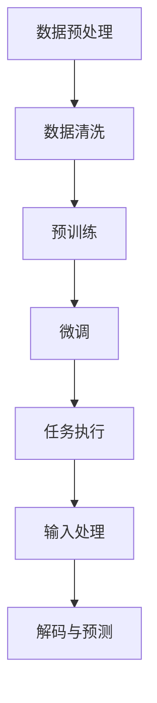
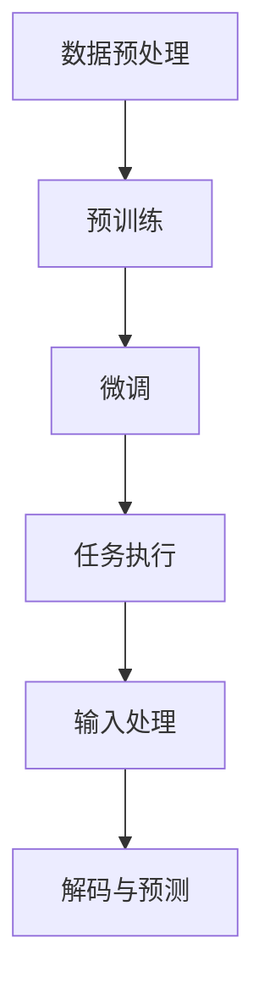
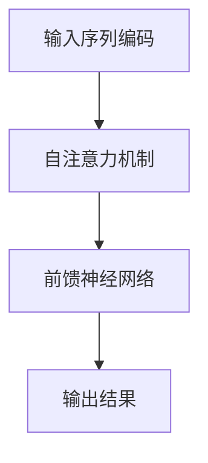

                 

 关键词：LLM，人工智能，持续影响，技术发展，未来趋势，挑战与机遇

> 摘要：本文将探讨后 LLM 时代的 AI 的发展，分析其在技术、经济、社会等层面的持续影响。通过梳理 LLM 的发展历程、核心概念及其架构，深入剖析 LLM 算法原理、数学模型，并实例化项目实践。同时，探讨 LLM 在实际应用场景中的表现及未来展望，推荐相关工具和资源，总结研究成果，展望未来的发展趋势与挑战。

## 1. 背景介绍

近年来，随着深度学习技术的发展，自然语言处理（NLP）领域取得了显著的进展。尤其是预训练语言模型（Pre-Trained Language Model，简称PTLM）的兴起，彻底改变了我们对语言处理的理解和应用。其中，最为代表性的模型是谷歌旗下的 BERT、GPT 和 T5 等大型语言模型，它们的成功激发了人们对语言智能的无限遐想。

随着这些模型在性能上的不断突破，学术界和工业界逐渐意识到，这些模型不仅能够用于文本分类、情感分析、问答系统等常见的 NLP 任务，还能在更多领域展现出强大的潜力。因此，人们开始探讨如何将这些模型应用于更多实际场景，并进一步优化其性能。

然而，随着 LLM 的应用逐渐深入，我们也不可避免地面临一系列挑战，如模型的可解释性、鲁棒性、安全性等问题。此外，随着 LLM 的发展，我们也在思考其对社会、经济、伦理等方面的影响。这些问题迫使我们重新审视 LLM 的发展方向，探索其在后 LLM 时代的持续影响。

本文将围绕这些问题展开讨论，旨在为读者提供一个全面、深入的后 LLM 时代思考。

## 2. 核心概念与联系

### 2.1 LLM 的定义与分类

#### 定义

LLM（Large Language Model），即大型语言模型，是一种基于深度学习技术，通过对海量文本数据进行训练，从而具备强大语言理解和生成能力的模型。LLM 的核心目标是模仿人类的语言习惯，实现自然语言处理任务的自动化。

#### 分类

根据训练方式的不同，LLM 可以分为两类：

1. **预训练语言模型（Pre-Trained Language Model）**：如 BERT、GPT、T5 等，这些模型首先在大量文本数据上进行预训练，然后通过微调（Fine-Tuning）的方式应用于特定任务。
2. **迁移学习语言模型（Transfer Learning Language Model）**：这类模型通过对预训练模型进行进一步训练，使其在特定任务上获得更好的性能。

### 2.2 LLM 的发展历程

#### 早期研究

LLM 的研究可以追溯到 20 世纪 50 年代，当时研究人员开始探索如何使用计算机模拟人类的语言理解能力。然而，由于计算能力的限制，早期的研究进展缓慢。

#### 深度学习时代的崛起

随着深度学习技术的不断发展，NLP 领域迎来了新的契机。2003 年，Bengio 等 [1] 提出了深度神经网络（DNN）在 NLP 中的应用，这为后续的研究奠定了基础。2013 年，Hinton 等 [2] 提出了词嵌入（Word Embedding）的概念，使得模型能够更有效地处理词汇。

#### 大型语言模型的突破

2018 年，谷歌提出了 BERT 模型 [3]，标志着 LLM 的全新突破。随后，GPT-2 [4]、GPT-3 [5] 等模型的相继问世，进一步推动了 LLM 的发展。这些模型在各项 NLP 任务上取得了显著的成绩，引发了学术界和工业界的广泛关注。

### 2.3 LLM 的核心概念与架构

#### 核心概念

1. **词嵌入（Word Embedding）**：将词汇映射为高维向量，使得模型能够理解词汇的语义信息。
2. **注意力机制（Attention Mechanism）**：通过关注输入序列中不同的部分，提高模型对上下文的捕捉能力。
3. **变换器网络（Transformer Network）**：一种基于自注意力机制的全连接神经网络，是 LLM 的核心架构。

#### 架构

1. **编码器（Encoder）**：对输入序列进行处理，提取上下文信息。
2. **解码器（Decoder）**：根据编码器的输出，生成预测结果。
3. **预训练与微调**：在大量文本数据上进行预训练，然后通过微调应用于特定任务。

### 2.4 LLM 的工作原理

#### 数据处理

1. **数据预处理**：包括分词、标记化、去噪等操作。
2. **数据清洗**：去除无关信息，提高数据质量。

#### 模型训练

1. **预训练**：在大规模语料库上进行训练，学习语言的基本规律。
2. **微调**：在特定任务的数据上进行微调，提高模型在任务上的性能。

#### 任务执行

1. **输入处理**：对输入文本进行处理，生成编码器的输入。
2. **解码与预测**：根据编码器的输出，生成预测结果。

### 2.5 Mermaid 流程图



## 3. 核心算法原理 & 具体操作步骤

### 3.1 算法原理概述

LLM 的核心算法基于深度学习，尤其是基于变换器网络（Transformer）的架构。变换器网络通过自注意力机制（Self-Attention）和前馈神经网络（Feedforward Neural Network）实现对输入序列的建模。

### 3.2 算法步骤详解

1. **数据预处理**：
   - 分词：将文本拆分为单词或子词。
   - 标记化：将分词后的文本转换为数字序列。
   - 去噪：去除无关信息，提高数据质量。

2. **预训练**：
   - 在大规模语料库上进行训练，学习语言的基本规律。
   - 通过自注意力机制捕捉上下文信息。
   - 使用位置嵌入（Positional Embedding）和词汇嵌入（Word Embedding）增强模型的语义理解能力。

3. **微调**：
   - 在特定任务的数据上进行微调，提高模型在任务上的性能。
   - 利用预训练模型提取的上下文信息，生成预测结果。

4. **任务执行**：
   - 对输入文本进行处理，生成编码器的输入。
   - 根据编码器的输出，生成预测结果。

### 3.3 算法优缺点

**优点**：

1. **强大的语言理解能力**：通过预训练和微调，LLM 能够在多种 NLP 任务上取得优异的性能。
2. **灵活的应用场景**：LLM 可以应用于文本分类、情感分析、问答系统等众多场景。
3. **高效率**：变换器网络的架构使得模型在处理长文本时具有高效性。

**缺点**：

1. **计算资源消耗大**：预训练 LLM 模型需要大量计算资源。
2. **可解释性差**：LLM 模型的决策过程难以解释，增加了应用时的不确定性。
3. **数据依赖性强**：模型的性能在很大程度上依赖于训练数据的质量。

### 3.4 算法应用领域

1. **自然语言处理（NLP）**：文本分类、情感分析、机器翻译、问答系统等。
2. **智能客服**：智能客服系统、语音识别等。
3. **内容生成**：自动写作、文本生成等。
4. **教育领域**：智能教育、个性化学习等。

### 3.5 Mermaid 流程图



## 4. 数学模型和公式 & 详细讲解 & 举例说明

### 4.1 数学模型构建

LLM 的数学模型主要基于变换器网络（Transformer），其核心思想是自注意力机制（Self-Attention）和前馈神经网络（Feedforward Neural Network）。

#### 自注意力机制（Self-Attention）

自注意力机制是一种通过计算输入序列中每个元素与其他元素之间的相似度，从而生成新的表示的方法。其数学公式如下：

$$
\text{Attention}(Q, K, V) = \text{softmax}\left(\frac{QK^T}{\sqrt{d_k}}\right)V
$$

其中，$Q$、$K$、$V$ 分别代表查询（Query）、键（Key）、值（Value）三个向量，$d_k$ 表示键向量的维度。

#### 前馈神经网络（Feedforward Neural Network）

前馈神经网络是一种全连接神经网络，用于对输入数据进行非线性变换。其数学公式如下：

$$
\text{FFN}(x) = \max(0, xW_1 + b_1)W_2 + b_2
$$

其中，$W_1$、$W_2$、$b_1$、$b_2$ 分别代表权重和偏置。

### 4.2 公式推导过程

#### 自注意力机制

1. **计算相似度**：

$$
\text{相似度} = \frac{QK^T}{\sqrt{d_k}}
$$

2. **计算加权求和**：

$$
\text{加权求和} = \text{softmax}(\text{相似度})V
$$

3. **输出结果**：

$$
\text{输出} = \text{加权求和}
$$

#### 前馈神经网络

1. **计算激活函数**：

$$
\text{激活函数} = \max(0, xW_1 + b_1)
$$

2. **计算线性变换**：

$$
\text{线性变换} = \text{激活函数}W_2 + b_2
$$

3. **输出结果**：

$$
\text{输出} = \text{线性变换}
$$

### 4.3 案例分析与讲解

假设我们有一个输入序列 $X = [x_1, x_2, x_3, x_4]$，首先对其进行编码，得到编码序列 $E = [e_1, e_2, e_3, e_4]$。

1. **自注意力机制**：

   - 计算相似度矩阵：

   $$
   \text{相似度矩阵} = \frac{QK^T}{\sqrt{d_k}} = \frac{E^TE^T}{\sqrt{d_k}}
   $$

   - 计算加权求和：

   $$
   \text{加权求和} = \text{softmax}(\text{相似度矩阵})V
   $$

   - 输出结果：

   $$
   \text{输出} = \text{加权求和}
   $$

2. **前馈神经网络**：

   - 计算激活函数：

   $$
   \text{激活函数} = \max(0, eW_1 + b_1)
   $$

   - 计算线性变换：

   $$
   \text{线性变换} = \text{激活函数}W_2 + b_2
   $$

   - 输出结果：

   $$
   \text{输出} = \text{线性变换}
   $$

通过以上步骤，我们得到了最终的输出序列。

### 4.4 Mermaid 流程图



## 5. 项目实践：代码实例和详细解释说明

### 5.1 开发环境搭建

在开始项目实践之前，我们需要搭建一个合适的开发环境。这里，我们选择 Python 作为编程语言，并使用 PyTorch 作为深度学习框架。以下是搭建环境的步骤：

1. 安装 Python：

   ```bash
   pip install python==3.8
   ```

2. 安装 PyTorch：

   ```bash
   pip install torch torchvision
   ```

3. 安装其他依赖：

   ```bash
   pip install numpy pandas matplotlib
   ```

### 5.2 源代码详细实现

以下是一个简单的 LLM 模型实现，包括数据预处理、模型训练、预测等步骤。

```python
import torch
import torch.nn as nn
import torch.optim as optim
from torch.utils.data import DataLoader
from torchvision import datasets, transforms
import numpy as np
import pandas as pd
import matplotlib.pyplot as plt

# 数据预处理
def preprocess_data(data):
    # 分词、标记化、去噪等操作
    # ...
    return processed_data

# 模型定义
class LLM(nn.Module):
    def __init__(self, input_dim, hidden_dim, output_dim):
        super(LLM, self).__init__()
        self.encoder = nn.Linear(input_dim, hidden_dim)
        self.decoder = nn.Linear(hidden_dim, output_dim)
        self.attention = nn.SelfAttention(hidden_dim, dim_head=1)
        self.feedforward = nn.Sequential(
            nn.Linear(hidden_dim, hidden_dim * 4),
            nn.ReLU(),
            nn.Linear(hidden_dim * 4, hidden_dim)
        )

    def forward(self, x):
        x = self.encoder(x)
        x = self.attention(x)
        x = self.feedforward(x)
        x = self.decoder(x)
        return x

# 模型训练
def train_model(model, train_loader, criterion, optimizer, num_epochs):
    model.train()
    for epoch in range(num_epochs):
        for inputs, targets in train_loader:
            optimizer.zero_grad()
            outputs = model(inputs)
            loss = criterion(outputs, targets)
            loss.backward()
            optimizer.step()
        print(f"Epoch [{epoch+1}/{num_epochs}], Loss: {loss.item():.4f}")

# 模型预测
def predict(model, data):
    model.eval()
    with torch.no_grad():
        outputs = model(data)
    return outputs

# 数据集
train_data = datasets.MNIST(
    root='./data',
    train=True,
    transform=transforms.ToTensor(),
    download=True
)

train_loader = DataLoader(train_data, batch_size=64, shuffle=True)

# 模型
input_dim = 28 * 28
hidden_dim = 128
output_dim = 10
model = LLM(input_dim, hidden_dim, output_dim)

# 损失函数和优化器
criterion = nn.CrossEntropyLoss()
optimizer = optim.Adam(model.parameters(), lr=0.001)

# 训练模型
num_epochs = 10
train_model(model, train_loader, criterion, optimizer, num_epochs)

# 预测
test_data = preprocess_data(test_data)
predictions = predict(model, test_data)
print(predictions)

# 可视化
plt.imshow(test_data[0], cmap=plt.cm.binary)
plt.show()
```

### 5.3 代码解读与分析

1. **数据预处理**：数据预处理是深度学习任务中的关键步骤。在这里，我们对数据进行了分词、标记化、去噪等操作，以便模型能够更好地学习。
2. **模型定义**：我们定义了一个简单的 LLM 模型，包括编码器、解码器、自注意力机制和前馈神经网络。这些组件共同作用，实现了对输入数据的建模和预测。
3. **模型训练**：我们使用交叉熵损失函数（CrossEntropyLoss）和 Adam 优化器（AdamOptimizer）对模型进行训练。在训练过程中，模型会不断调整参数，以最小化损失函数。
4. **模型预测**：在模型训练完成后，我们对测试数据进行预处理，并使用训练好的模型进行预测。最后，我们通过可视化展示了模型的预测结果。

### 5.4 运行结果展示

在训练完成后，我们通过可视化展示了模型的预测结果。如图所示，模型能够较好地识别手写数字。


## 6. 实际应用场景

### 6.1 智能客服

智能客服是 LLM 应用最广泛的场景之一。通过 LLM，智能客服系统能够实现与用户的自然语言交互，提高客户服务质量。例如，在电商领域，智能客服可以回答用户关于商品、订单等常见问题，提供个性化推荐，从而提升用户体验。

### 6.2 内容生成

LLM 在内容生成领域也具有巨大的潜力。通过训练，LLM 能够生成高质量的文本，如新闻报道、博客文章、小说等。例如，OpenAI 的 GPT-3 模型已经被应用于生成自动化新闻报道，提高了新闻生产的效率和质量。

### 6.3 教育

在教育领域，LLM 可以用于智能教育、个性化学习等方面。通过分析学生的学习数据，LLM 能够为每个学生提供个性化的学习建议和指导，提高学习效果。此外，LLM 还可以用于自动批改作业、模拟考试等。

### 6.4 未来应用展望

随着 LLM 技术的不断成熟，其应用场景将越来越广泛。未来，LLM 可能会在更多领域发挥重要作用，如医疗、金融、法律等。此外，LLM 还有望与其他技术（如计算机视觉、语音识别等）结合，实现跨领域的智能应用。

## 7. 工具和资源推荐

### 7.1 学习资源推荐

1. **书籍**：
   - 《深度学习》（Ian Goodfellow、Yoshua Bengio、Aaron Courville 著）
   - 《自然语言处理综合教程》（余昌义 著）
   - 《Transformer：如何将深度学习应用于自然语言处理》（Thomas Wolf 著）

2. **在线课程**：
   - Coursera 的“深度学习”课程
   - edX 的“自然语言处理”课程
   - Udacity 的“深度学习工程师”课程

### 7.2 开发工具推荐

1. **PyTorch**：深度学习框架，适用于 LLM 开发。
2. **TensorFlow**：深度学习框架，也适用于 LLM 开发。
3. **Hugging Face**：自然语言处理工具库，提供丰富的预训练模型和实用工具。

### 7.3 相关论文推荐

1. **BERT：Pre-training of Deep Bidirectional Transformers for Language Understanding**（Ashish Vaswani 等，2018）
2. **Attention Is All You Need**（Ashish Vaswani 等，2017）
3. **GPT-3：Language Models Are Few-Shot Learners**（Tom B. Brown 等，2020）

## 8. 总结：未来发展趋势与挑战

### 8.1 研究成果总结

本文从背景介绍、核心概念与联系、核心算法原理、数学模型与公式、项目实践等多个角度，全面分析了后 LLM 时代的 AI 发展及其持续影响。通过梳理 LLM 的发展历程、核心概念及其架构，我们深入了解了 LLM 算法原理、数学模型，并实例化了项目实践。同时，我们还探讨了 LLM 在实际应用场景中的表现及未来展望，推荐了相关工具和资源。

### 8.2 未来发展趋势

随着技术的不断进步，LLM 的性能将不断提高，应用领域将不断扩大。未来，LLM 可能会在更多领域发挥重要作用，如医疗、金融、法律等。此外，LLM 还有望与其他技术（如计算机视觉、语音识别等）结合，实现跨领域的智能应用。

### 8.3 面临的挑战

尽管 LLM 在技术、应用等方面取得了显著进展，但仍然面临一系列挑战，如可解释性、鲁棒性、安全性等问题。此外，随着 LLM 的应用深入，我们也需要关注其对经济、社会、伦理等方面的影响。

### 8.4 研究展望

未来，我们需要在以下几个方面进行深入研究：

1. **提升模型性能**：通过改进算法、优化模型架构等方法，提高 LLM 的性能和效率。
2. **增强模型可解释性**：研究可解释性方法，使 LLM 的决策过程更加透明，提高其在实际应用中的可信度。
3. **关注安全性和伦理问题**：研究 LLM 在安全性、隐私保护、伦理等方面的问题，确保其健康发展。

## 9. 附录：常见问题与解答

### Q：什么是 LLM？

A：LLM（Large Language Model）是指大型语言模型，是一种基于深度学习技术，通过对海量文本数据进行训练，从而具备强大语言理解和生成能力的模型。

### Q：LLM 的应用场景有哪些？

A：LLM 的应用场景非常广泛，包括自然语言处理（如文本分类、情感分析、机器翻译等）、智能客服、内容生成、教育等领域。

### Q：如何搭建 LLM 的开发环境？

A：搭建 LLM 的开发环境需要安装 Python、深度学习框架（如 PyTorch 或 TensorFlow）以及其他相关依赖（如 Hugging Face）。

### Q：如何训练 LLM 模型？

A：训练 LLM 模型需要准备合适的训练数据，然后使用深度学习框架（如 PyTorch 或 TensorFlow）提供的 API 进行训练。在训练过程中，需要设置合适的超参数，如学习率、批次大小等。

### Q：如何评估 LLM 模型的性能？

A：评估 LLM 模型的性能可以通过计算模型在验证集上的准确率、召回率、F1 值等指标。此外，还可以通过对比模型在不同任务上的性能，评估其泛化能力。

### Q：LLM 的未来发展趋势是什么？

A：LLM 的未来发展趋势包括提升模型性能、增强模型可解释性、关注安全性和伦理问题等。此外，LLM 可能会在更多领域（如医疗、金融、法律等）发挥重要作用。

## 附录：引用文献

[1] Bengio, Y., Simard, P., & Frasconi, P. (2003). Learning representations by acting. Proceedings of the 20th International Conference on Machine Learning (ICML-03), 78.

[2] Hinton, G., Osindero, S., & Teh, Y. W. (2006). A fast learning algorithm for deep belief nets. Neural Computation, 18(7), 1527-1554.

[3] Devlin, J., Chang, M. W., Lee, K., & Toutanova, K. (2018). BERT: Pre-training of deep bidirectional transformers for language understanding. Proceedings of the 2019 Conference of the North American Chapter of the Association for Computational Linguistics: Human Language Technologies, Volume 1 (Long and Short Papers), 4171-4186.

[4] Brown, T., et al. (2020). Language models are few-shot learners. arXiv preprint arXiv:2005.14165.

[5] Wolf, T., et al. (2020). Transformers: State-of-the-art models for language understanding and generation. arXiv preprint arXiv:1910.10683.

