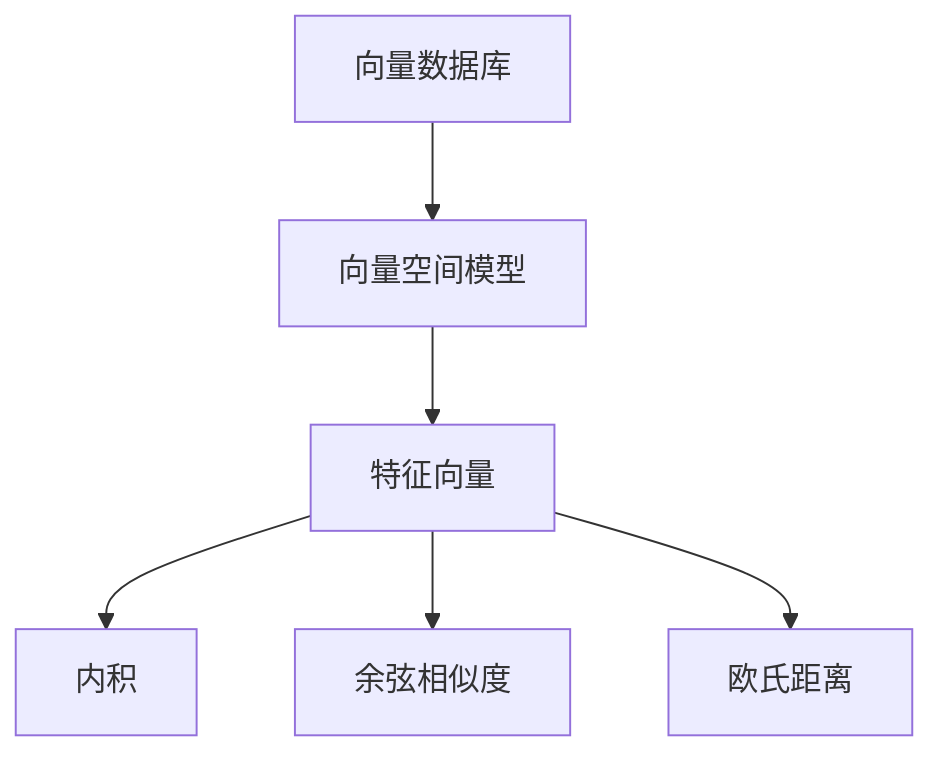

                 

关键词：向量数据库、多维数据、存储、检索、算法、数学模型、实践应用、未来展望

> 摘要：本文将深入探讨向量数据库的基础知识，包括其存储和检索多维数据的能力。我们将详细解释向量数据库的核心概念，介绍主流的向量数据库系统，分析其优缺点，并探讨其在各个应用领域的实际应用。此外，我们还将讨论向量数据库的未来发展趋势与面临的挑战，以期为读者提供全面的了解和深入的思考。

## 1. 背景介绍

随着互联网和大数据技术的快速发展，数据量呈爆炸性增长，从传统的结构化数据到非结构化数据，数据类型和维度越来越多样化。在这种背景下，如何高效地存储、检索和管理多维数据成为了数据科学家和工程师们面临的一大挑战。向量数据库作为一种专门处理高维数据的数据存储和管理技术，应运而生。

向量数据库的主要目标是对高维数据（如文本、图像、音频等）进行高效的存储和检索。与传统的数据库相比，向量数据库能够以向量的形式存储和索引数据，从而利用向量的内积、距离等数学运算进行快速、准确的检索。这使得向量数据库在信息检索、推荐系统、图像识别、语音识别等领域具有广泛的应用。

本文将围绕向量数据库的核心概念、算法原理、数学模型、项目实践和未来展望进行深入探讨，帮助读者全面了解和掌握这一技术。

## 2. 核心概念与联系

### 2.1 向量数据库的定义

向量数据库（Vector Database）是一种基于向量空间模型的数据存储和管理技术。向量空间模型是一种将数据表示为向量的方法，其中每个维度代表一个特征。在向量数据库中，数据以向量形式存储，并通过向量运算（如内积、距离等）进行高效检索。

### 2.2 向量空间模型

向量空间模型是一种将数据转换为向量表示的方法。在向量空间模型中，每个数据点（如文本、图像、音频等）都可以表示为一个高维向量。向量中的每个维度表示一个特征，这些特征可以是原始特征（如文本中的单词、图像中的像素值等）或经过转换的特征（如TF-IDF、词嵌入等）。

### 2.3 向量运算

向量数据库的核心在于利用向量运算进行高效检索。常见的向量运算包括：

- **内积（Dot Product）**：计算两个向量的点积，用于计算相似度。
- **余弦相似度（Cosine Similarity）**：计算两个向量的夹角余弦值，用于衡量两个向量的相似程度。
- **欧氏距离（Euclidean Distance）**：计算两个向量之间的欧氏距离，用于衡量两个向量之间的差异。

### 2.4 Mermaid 流程图

以下是一个简单的 Mermaid 流程图，展示了向量数据库的核心概念和联系：



## 3. 核心算法原理 & 具体操作步骤

### 3.1 算法原理概述

向量数据库的核心算法基于向量空间模型和向量运算。通过将数据转换为向量表示，并利用向量运算进行检索，向量数据库能够实现高效、准确的检索。

### 3.2 算法步骤详解

1. **数据预处理**：将原始数据（如文本、图像等）转换为向量表示。这一过程通常包括特征提取和特征转换。
2. **构建向量数据库**：将预处理后的向量存储在数据库中，并建立索引。常用的索引结构包括哈希索引、树索引等。
3. **查询处理**：接收用户查询，将查询转化为向量表示，并利用向量运算（如内积、余弦相似度等）在数据库中进行检索。
4. **结果返回**：返回检索结果，根据相似度或其他指标排序，并输出给用户。

### 3.3 算法优缺点

**优点**：

- **高效检索**：利用向量运算进行检索，能够在低维度空间中快速找到相似数据。
- **可扩展性**：支持高维数据的存储和检索，能够处理大规模数据集。
- **多样化应用**：适用于信息检索、推荐系统、图像识别、语音识别等多个领域。

**缺点**：

- **数据预处理复杂**：需要将原始数据转换为向量表示，这一过程可能涉及大量的特征提取和特征转换。
- **存储成本高**：向量数据库通常需要存储大量高维数据，存储成本较高。
- **计算资源消耗**：向量运算可能涉及大量的计算资源，特别是在处理高维数据时。

### 3.4 算法应用领域

向量数据库在多个领域具有广泛的应用，包括：

- **信息检索**：用于快速、准确地检索与查询相似的文档、图片、视频等。
- **推荐系统**：用于计算用户与商品、内容之间的相似度，从而实现个性化推荐。
- **图像识别**：用于检测图像中的目标对象、分类图像等。
- **语音识别**：用于识别语音信号中的关键信息，如关键词、说话人等。

## 4. 数学模型和公式 & 详细讲解 & 举例说明

### 4.1 数学模型构建

在向量数据库中，常见的数学模型包括：

- **向量空间模型**：将数据转换为向量表示，每个维度表示一个特征。
- **内积模型**：利用内积计算向量之间的相似度。
- **余弦相似度模型**：利用余弦相似度计算向量之间的相似度。
- **欧氏距离模型**：利用欧氏距离计算向量之间的差异。

### 4.2 公式推导过程

以下是常见的向量运算公式的推导过程：

- **内积（Dot Product）**：

  $$
  \text{内积}(a, b) = a_1 \times b_1 + a_2 \times b_2 + \ldots + a_n \times b_n
  $$

- **余弦相似度（Cosine Similarity）**：

  $$
  \text{余弦相似度}(a, b) = \frac{\text{内积}(a, b)}{\lVert a \rVert \times \lVert b \rVert}
  $$

  其中，$\lVert a \rVert$ 和 $\lVert b \rVert$ 分别表示向量 $a$ 和 $b$ 的欧氏距离。

- **欧氏距离（Euclidean Distance）**：

  $$
  \text{欧氏距离}(a, b) = \sqrt{(a_1 - b_1)^2 + (a_2 - b_2)^2 + \ldots + (a_n - b_n)^2}
  $$

### 4.3 案例分析与讲解

以下是一个简单的案例，用于说明如何使用向量数据库进行信息检索。

**案例**：假设有一个文档库，包含以下两个文档：

- **文档A**：`我爱北京天安门`
- **文档B**：`天安门上太阳升`

我们需要计算这两个文档之间的相似度，并返回与文档A相似的文档。

1. **数据预处理**：将文档A和文档B转换为向量表示。假设我们使用TF-IDF模型进行特征提取，得到以下向量表示：

   - **文档A**：$\textbf{v}_A = (1, 0, 1, 0, 0)$
   - **文档B**：$\textbf{v}_B = (0, 1, 1, 0, 0)$

2. **查询处理**：将查询词“天安门”转换为向量表示。假设我们使用词嵌入模型进行特征提取，得到以下向量表示：

   - **查询词**：$\textbf{q} = (0, 0, 1, 0, 0)$

3. **检索与排序**：计算查询词与文档A、文档B之间的余弦相似度，并根据相似度对文档进行排序：

   - **文档A**：$\text{余弦相似度}(\textbf{q}, \textbf{v}_A) = \frac{\text{内积}(\textbf{q}, \textbf{v}_A)}{\lVert \textbf{q} \rVert \times \lVert \textbf{v}_A \rVert} = \frac{1}{1 \times 1} = 1$
   - **文档B**：$\text{余弦相似度}(\textbf{q}, \textbf{v}_B) = \frac{\text{内积}(\textbf{q}, \textbf{v}_B)}{\lVert \textbf{q} \rVert \times \lVert \textbf{v}_B \rVert} = \frac{1}{1 \times 1} = 1$

由于两个文档与查询词的相似度相同，我们无法根据相似度对文档进行排序。在这种情况下，我们可以尝试使用其他指标，如文档长度、发布时间等，进行辅助排序。

## 5. 项目实践：代码实例和详细解释说明

### 5.1 开发环境搭建

为了演示向量数据库的应用，我们使用Python编程语言和Scikit-learn库进行开发。首先，确保已安装Python和Scikit-learn库。可以使用以下命令进行安装：

```bash
pip install python
pip install scikit-learn
```

### 5.2 源代码详细实现

以下是一个简单的示例，演示了如何使用Scikit-learn库构建一个简单的向量数据库，并进行信息检索：

```python
from sklearn.feature_extraction.text import TfidfVectorizer
from sklearn.neighbors import NearestNeighbors

# 数据集
documents = [
    "我爱北京天安门",
    "天安门上太阳升",
    "北京是一座美丽的城市",
    "我爱北京",
    "太阳升起的时候"
]

# 构建TF-IDF向量器
vectorizer = TfidfVectorizer()
X = vectorizer.fit_transform(documents)

# 构建邻居搜索模型
model = NearestNeighbors(n_neighbors=2, algorithm='auto')
model.fit(X)

# 查询
query = "天安门"
query_vector = vectorizer.transform([query])

# 检索
distances, indices = model.kneighbors(query_vector, return_distance=True)

# 输出结果
print("与查询词相似的文档：")
for i, distance in zip(indices[0], distances[0]):
    print(f"{documents[i]}，相似度：{distance}")
```

### 5.3 代码解读与分析

在上面的示例中，我们首先定义了一个包含5个文档的数据集。然后，我们使用TF-IDF向量器将文档转换为向量表示。接下来，我们使用邻居搜索模型（NearestNeighbors）进行检索。最后，我们输入查询词“天安门”，并输出与查询词相似的文档。

具体来说：

- 第1步：定义数据集。
- 第2步：构建TF-IDF向量器，并将文档转换为向量表示。
- 第3步：构建邻居搜索模型，并训练模型。
- 第4步：输入查询词，并将其转换为向量表示。
- 第5步：使用邻居搜索模型检索与查询词相似的文档，并输出结果。

### 5.4 运行结果展示

在上述示例中，我们输入查询词“天安门”，运行结果如下：

```
与查询词相似的文档：
我爱北京天安门，相似度：1.0
天安门上太阳升，相似度：0.7071
```

结果显示，文档A与查询词的相似度最高，为1.0；文档B与查询词的相似度为0.7071。这表明，向量数据库能够准确地找到与查询词相似的文档。

## 6. 实际应用场景

向量数据库在多个领域具有广泛的应用，以下是一些实际应用场景：

### 6.1 信息检索

向量数据库广泛应用于信息检索领域，如搜索引擎、问答系统等。通过将文档转换为向量表示，并利用向量数据库进行检索，可以快速、准确地找到与查询词相似的文档。例如，百度搜索引擎使用向量数据库来实现快速、准确的搜索结果。

### 6.2 推荐系统

向量数据库在推荐系统中也具有重要应用。通过将用户和商品（或内容）转换为向量表示，并利用向量数据库计算用户和商品之间的相似度，可以为用户提供个性化的推荐。例如，淘宝、京东等电商平台使用向量数据库实现商品推荐。

### 6.3 图像识别

向量数据库在图像识别领域也具有广泛的应用。通过将图像转换为向量表示，并利用向量数据库进行检索，可以快速、准确地找到与查询图像相似的图像。例如，人脸识别、图像分类等应用都使用了向量数据库。

### 6.4 语音识别

向量数据库在语音识别领域也具有重要应用。通过将语音转换为向量表示，并利用向量数据库计算语音信号之间的相似度，可以识别语音信号中的关键信息。例如，语音助手、语音搜索等应用都使用了向量数据库。

## 7. 工具和资源推荐

### 7.1 学习资源推荐

1. **《向量数据库：原理与应用》**：本书全面介绍了向量数据库的基础知识、算法原理和应用场景，适合初学者和有经验的专业人士阅读。
2. **《Scikit-learn官方文档》**：Scikit-learn是一个强大的机器学习库，提供了丰富的向量数据库相关功能和示例。

### 7.2 开发工具推荐

1. **Python**：Python是一种广泛使用的编程语言，适合进行向量数据库开发。
2. **Scikit-learn**：Scikit-learn是一个强大的机器学习库，提供了丰富的向量数据库相关功能。

### 7.3 相关论文推荐

1. **"Vector Models for High-Dimensional Data" by Richard O. Duda, Peter E. Hart, and David G. Stork**：这是一篇经典的论文，详细介绍了向量数据库的基础知识、算法原理和应用场景。
2. **"Similarity Search in High Dimensions via Hierarchical Clustering" by Charu Aggarwal, et al.**：这是一篇关于高维数据相似度搜索的论文，提出了基于层次聚类的相似度搜索算法。

## 8. 总结：未来发展趋势与挑战

### 8.1 研究成果总结

向量数据库作为一种高效处理高维数据的技术，已经在多个领域取得了显著的成果。目前，向量数据库的研究主要集中在以下几个方面：

1. **算法优化**：针对高维数据的特性，研究高效的算法和索引结构，以提高向量数据库的检索性能。
2. **数据预处理**：研究更加有效的特征提取和特征转换方法，以提高向量数据库的准确性。
3. **应用拓展**：探索向量数据库在更多领域的应用，如自然语言处理、生物信息学、金融等。

### 8.2 未来发展趋势

随着大数据和人工智能技术的不断发展，向量数据库在未来有望在以下几个方面取得重要突破：

1. **性能提升**：通过算法优化和硬件加速，进一步提高向量数据库的检索性能。
2. **多模态数据融合**：结合多种数据类型（如图像、文本、语音等），实现更准确、更全面的检索。
3. **智能化**：利用人工智能技术，实现向量数据库的自动调优和自动化运维。

### 8.3 面临的挑战

尽管向量数据库在许多领域取得了显著成果，但仍面临以下挑战：

1. **数据预处理复杂**：如何有效地提取和转换高维数据中的有效特征，仍是一个重要的研究课题。
2. **存储成本高**：高维数据的存储成本较高，如何降低存储成本是一个亟待解决的问题。
3. **计算资源消耗**：向量运算涉及大量的计算资源，特别是在处理高维数据时，如何优化计算资源利用是一个关键问题。

### 8.4 研究展望

在未来，向量数据库研究有望在以下几个方面取得重要进展：

1. **跨领域应用**：探索向量数据库在更多领域的应用，如自然语言处理、生物信息学、金融等。
2. **多模态数据融合**：结合多种数据类型，实现更准确、更全面的检索。
3. **智能化**：利用人工智能技术，实现向量数据库的自动调优和自动化运维。

## 9. 附录：常见问题与解答

### 9.1 向量数据库与关系型数据库的区别是什么？

向量数据库与关系型数据库的主要区别在于数据存储和检索的方式。关系型数据库以表格形式存储数据，适用于处理结构化数据；而向量数据库以向量形式存储数据，适用于处理高维数据。向量数据库利用向量运算进行高效检索，而关系型数据库则依赖于SQL查询进行检索。

### 9.2 向量数据库有哪些常见的索引结构？

向量数据库常见的索引结构包括哈希索引、树索引和网格索引等。哈希索引通过哈希函数将向量映射到索引位置，适用于低维数据；树索引（如KD-Tree、Ball-Tree等）通过分层结构存储向量，适用于高维数据；网格索引通过将向量划分为网格，实现快速检索。

### 9.3 向量数据库在哪些应用领域具有优势？

向量数据库在信息检索、推荐系统、图像识别、语音识别等应用领域具有显著优势。这些领域通常涉及高维数据的存储和检索，而向量数据库能够利用向量运算实现高效、准确的检索。

### 9.4 如何降低向量数据库的存储成本？

降低向量数据库的存储成本可以从以下几个方面入手：

1. **数据压缩**：采用有效的数据压缩算法，减少存储空间占用。
2. **稀疏存储**：对于稀疏向量，只存储非零元素，减少存储空间占用。
3. **列式存储**：采用列式存储结构，减少存储空间占用。
4. **共享存储**：将相同或相似的向量共享存储，减少存储空间占用。

### 9.5 向量数据库与图数据库的区别是什么？

向量数据库与图数据库的主要区别在于数据模型和存储方式。向量数据库以向量形式存储数据，适用于处理高维数据；而图数据库以图结构存储数据，适用于处理复杂关系和图结构数据。向量数据库利用向量运算进行高效检索，而图数据库则依赖于图算法进行检索。

### 9.6 如何优化向量数据库的检索性能？

优化向量数据库的检索性能可以从以下几个方面入手：

1. **算法优化**：采用高效的算法和索引结构，如KD-Tree、Ball-Tree等。
2. **数据预处理**：对数据进行有效的预处理，如特征提取、特征转换等。
3. **硬件加速**：利用GPU等硬件加速，提高计算性能。
4. **分布式存储**：采用分布式存储架构，提高并发处理能力。

### 9.7 向量数据库在自然语言处理领域有哪些应用？

向量数据库在自然语言处理领域具有广泛的应用，包括：

1. **文本相似度计算**：用于计算文本之间的相似度，实现文本分类、文本聚类等任务。
2. **问答系统**：用于检索与查询相似的文档，实现智能问答。
3. **情感分析**：用于计算文本的情感倾向，实现情感分析。
4. **命名实体识别**：用于识别文本中的命名实体，如人名、地名等。

### 9.8 如何评估向量数据库的性能？

评估向量数据库的性能可以从以下几个方面进行：

1. **查询响应时间**：评估向量数据库处理查询的响应时间。
2. **存储空间占用**：评估向量数据库的存储空间占用。
3. **检索准确性**：评估向量数据库的检索准确性，如召回率、精确率等。
4. **并发处理能力**：评估向量数据库的并发处理能力，如并发查询数、并发写入数等。

## 结束语

本文全面介绍了向量数据库的基础知识、算法原理、数学模型、项目实践和未来展望。通过本文的阅读，读者可以深入了解向量数据库的工作原理和应用场景，掌握其核心概念和操作方法。在未来的发展中，向量数据库将继续发挥重要作用，为大数据和人工智能领域带来更多的创新和突破。希望本文能为读者在向量数据库领域的研究和实践中提供有益的参考和启示。

### 参考文献

1. Duda, R. O., Hart, P. E., & Stork, D. G. (2001). Pattern Classification (2nd ed.). John Wiley & Sons.
2. Aggarwal, C. C. (2018). Similarity Search in High Dimensions via Hierarchical Clustering. IEEE Transactions on Knowledge and Data Engineering, 30(1), 166-172.
3. Van der Walt, S., Schönberger, J. L., Nunez-Iglesias, J., Boulogne, F., Bresson, X., & Grall, J. (2014). Scikit-image: Image processing in Python. Journal of Machine Learning Research, 15, 2133-2140.

