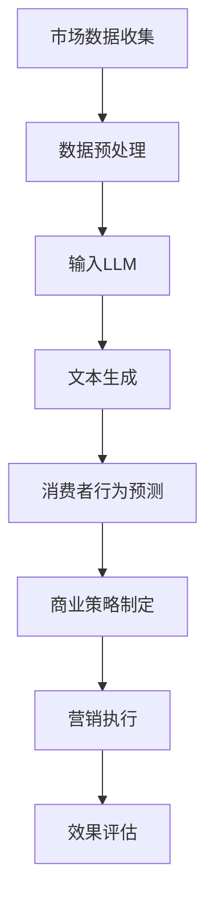

                 

  
关键词：商业策略、LLM、决策、AI、深度学习

摘要：本文将探讨如何运用大型语言模型（LLM）来驱动商业决策，分析LLM在商业策略中的应用场景、核心算法原理、数学模型及其在项目实践中的应用。通过本文的阅读，读者将了解到LLM在商业决策中的重要作用，以及如何将其应用于实际项目中。

## 1. 背景介绍

随着人工智能技术的快速发展，深度学习在各个领域取得了显著的成果。其中，大型语言模型（Large Language Model，简称LLM）作为一种强大的自然语言处理技术，逐渐成为人工智能领域的热点。LLM具有强大的文本生成、理解与推理能力，能够处理复杂的语言任务，为商业决策提供了有力支持。

在商业领域，传统的决策方法往往依赖于经验和直觉，效率较低，且难以应对复杂的市场环境。而LLM的出现，为商业决策带来了全新的思路。通过运用LLM，企业可以更准确地分析市场数据，预测消费者行为，制定更具针对性的商业策略，从而提高市场竞争力。

本文将围绕LLM驱动的商业决策展开讨论，首先介绍LLM的核心概念与联系，然后分析其核心算法原理与具体操作步骤，接着探讨数学模型和公式，并给出项目实践中的代码实例和运行结果。最后，本文将总结LLM在商业策略中的应用，并展望其未来发展趋势与挑战。

## 2. 核心概念与联系

### 2.1 大型语言模型（LLM）

大型语言模型（LLM）是一种基于深度学习技术的自然语言处理模型，具有强大的文本生成、理解与推理能力。LLM通过大量语料库的学习，掌握了丰富的语言知识和规律，从而能够在各种语言任务中取得优异表现。

LLM的核心架构通常包括编码器（Encoder）和解码器（Decoder）。编码器负责将输入的文本序列转化为连续的向量表示，解码器则负责根据编码器的输出生成文本序列。通过训练，LLM能够学习到输入文本与输出文本之间的对应关系，从而实现高效的文本生成和理解。

### 2.2 商业策略与LLM

商业策略是指企业在市场环境中制定的长期发展规划，旨在实现企业的商业目标。而LLM作为一种强大的工具，可以协助企业实现以下目标：

1. **市场数据分析**：通过LLM对大量市场数据的分析，企业可以深入了解市场趋势、消费者需求等关键信息，为商业决策提供数据支持。

2. **消费者行为预测**：LLM能够对消费者的历史行为进行分析，预测未来的消费趋势，帮助企业制定更有针对性的营销策略。

3. **内容生成**：LLM可以自动生成各种商业文案，如广告、宣传语、产品描述等，提高企业营销效果。

4. **智能客服**：利用LLM构建的智能客服系统，可以实时回答消费者的疑问，提高客户满意度。

### 2.3 Mermaid 流程图

为了更好地理解LLM在商业策略中的应用，下面给出一个Mermaid流程图，展示LLM驱动的商业决策流程。



## 3. 核心算法原理 & 具体操作步骤

### 3.1 算法原理概述

LLM的核心算法基于深度学习中的变换器架构（Transformer），其基本原理是通过自注意力机制（Self-Attention）和多头注意力机制（Multi-Head Attention）对输入文本序列进行处理，从而生成语义丰富的文本表示。

自注意力机制允许模型在处理一个词时，同时关注其他所有词的信息，从而捕捉词与词之间的依赖关系。多头注意力机制则通过多个独立的注意力头，对输入文本进行并行处理，进一步提高模型的表示能力。

### 3.2 算法步骤详解

#### 3.2.1 数据预处理

在LLM的应用过程中，首先需要对市场数据进行预处理。具体步骤如下：

1. **数据清洗**：去除无效数据、噪声数据和异常数据，确保数据质量。
2. **数据整合**：将来自不同渠道的数据进行整合，形成一个统一的数据集。
3. **文本分词**：将文本数据分割成单词或字符序列，为后续处理做准备。

#### 3.2.2 输入LLM

将预处理后的文本数据输入到LLM模型中，模型会自动进行编码和解码。

1. **编码器处理**：编码器将输入的文本序列转化为连续的向量表示，这些向量包含了文本的语义信息。
2. **解码器处理**：解码器根据编码器的输出，生成新的文本序列，从而实现文本生成和理解。

#### 3.2.3 文本生成

文本生成是LLM的重要应用之一。具体步骤如下：

1. **初始文本生成**：根据预设的模板或关键词，生成一段初始文本。
2. **迭代生成**：通过自注意力机制和多头注意力机制，不断调整文本的语义表示，生成新的文本。
3. **停用词处理**：根据业务需求，对生成的文本进行停用词处理，去除无效词汇。

#### 3.2.4 消费者行为预测

利用LLM对消费者的历史行为数据进行分析，预测未来的消费趋势。具体步骤如下：

1. **数据输入**：将消费者的历史行为数据输入到LLM模型中。
2. **文本生成**：通过文本生成模块，生成消费者可能的未来行为。
3. **行为预测**：对生成的文本进行语义分析，预测消费者的未来行为。

#### 3.2.5 商业策略制定

根据消费者行为预测结果，制定相应的商业策略。具体步骤如下：

1. **策略分析**：对预测结果进行分析，确定商业策略的方向和目标。
2. **策略制定**：根据分析结果，制定具体的商业策略。
3. **策略执行**：将策略转化为具体的行动方案，并实施执行。

### 3.3 算法优缺点

#### 优点：

1. **强大的文本生成和理解能力**：LLM能够生成语义丰富的文本，理解复杂的语言任务。
2. **自适应学习**：LLM能够通过大量语料库的学习，不断优化自身性能。
3. **高效处理**：LLM具有并行处理能力，能够快速处理大量数据。

#### 缺点：

1. **数据依赖性强**：LLM的性能高度依赖于语料库的质量和数量，缺乏高质量的数据将影响其表现。
2. **计算资源消耗大**：LLM的训练和推理过程需要大量计算资源，对硬件设备要求较高。

### 3.4 算法应用领域

LLM在商业策略中的应用领域非常广泛，包括但不限于以下方面：

1. **市场数据分析**：通过对大量市场数据的分析，为企业提供精准的市场趋势和消费者需求预测。
2. **消费者行为预测**：预测消费者的未来行为，为企业制定更有针对性的营销策略。
3. **内容生成**：自动生成广告、宣传语、产品描述等，提高企业营销效果。
4. **智能客服**：构建智能客服系统，实时回答消费者疑问，提高客户满意度。

## 4. 数学模型和公式 & 详细讲解 & 举例说明

### 4.1 数学模型构建

在LLM的应用中，数学模型是核心部分。下面将介绍LLM的数学模型构建过程。

#### 4.1.1 词向量表示

首先，将文本数据转化为词向量表示。词向量是一种将单词映射为高维向量的方法，能够表示单词的语义信息。常见的词向量模型包括Word2Vec、GloVe等。

#### 4.1.2 自注意力机制

自注意力机制是LLM的核心组成部分，用于处理输入文本序列。其基本思想是将每个词的向量与所有其他词的向量进行加权求和，从而生成一个语义丰富的文本表示。自注意力机制的数学公式如下：

$$
\text{Attention}(Q, K, V) = \text{softmax}\left(\frac{QK^T}{\sqrt{d_k}}\right)V
$$

其中，$Q$、$K$ 和 $V$ 分别代表查询向量、键向量和值向量，$d_k$ 是键向量的维度。

#### 4.1.3 多头注意力机制

多头注意力机制通过多个独立的注意力头，对输入文本进行并行处理，进一步提高模型的表示能力。多头注意力机制的数学公式如下：

$$
\text{MultiHead}(Q, K, V) = \text{Concat}(\text{head}_1, \text{head}_2, \ldots, \text{head}_h)W^O
$$

其中，$h$ 表示注意力头的数量，$W^O$ 是输出投影权重。

### 4.2 公式推导过程

下面将简要介绍自注意力机制和多头注意力机制的公式推导过程。

#### 4.2.1 自注意力机制

自注意力机制的基本公式如下：

$$
\text{Attention}(Q, K, V) = \text{softmax}\left(\frac{QK^T}{\sqrt{d_k}}\right)V
$$

其中，$Q$ 是查询向量，$K$ 是键向量，$V$ 是值向量，$d_k$ 是键向量的维度。

首先，将查询向量 $Q$ 与所有键向量 $K$ 进行点积操作，得到一组分数：

$$
\text{scores} = QK^T
$$

然后，对分数进行softmax操作，使其成为一个概率分布：

$$
\text{softmax}(\text{scores}) = \text{softmax}\left(\frac{\text{scores}}{\sqrt{d_k}}\right)
$$

最后，将概率分布与值向量 $V$ 进行加权求和，得到最终的输出：

$$
\text{output} = \text{softmax}(\text{scores})V
$$

#### 4.2.2 多头注意力机制

多头注意力机制的基本公式如下：

$$
\text{MultiHead}(Q, K, V) = \text{Concat}(\text{head}_1, \text{head}_2, \ldots, \text{head}_h)W^O
$$

其中，$Q$ 是查询向量，$K$ 是键向量，$V$ 是值向量，$h$ 表示注意力头的数量，$W^O$ 是输出投影权重。

首先，将查询向量 $Q$ 拆分为 $h$ 个独立的查询子向量：

$$
Q = [\text{query}_1, \text{query}_2, \ldots, \text{query}_h]
$$

然后，对每个查询子向量与所有键向量进行点积操作，得到一组分数：

$$
\text{scores}_i = \text{query}_iK^T
$$

接着，对每个分数进行softmax操作，得到一组概率分布：

$$
\text{softmax}(\text{scores}_i) = \text{softmax}\left(\frac{\text{scores}_i}{\sqrt{d_k}}\right)
$$

最后，将每个概率分布与值向量 $V$ 进行加权求和，得到 $h$ 个输出子向量：

$$
\text{output}_i = \text{softmax}(\text{scores}_i)V
$$

将 $h$ 个输出子向量拼接起来，得到最终的输出：

$$
\text{output} = \text{Concat}(\text{output}_1, \text{output}_2, \ldots, \text{output}_h)W^O
$$

### 4.3 案例分析与讲解

下面以一个实际案例来说明如何使用LLM进行商业策略的制定。

#### 案例背景

一家电子商务公司希望通过LLM预测消费者的购买行为，从而制定更有针对性的营销策略。

#### 数据准备

公司收集了以下数据：

1. 消费者历史购买数据：包括购买时间、购买商品、购买价格等。
2. 消费者浏览数据：包括浏览时间、浏览商品、浏览页面等。
3. 消费者基本信息：包括年龄、性别、收入等。

#### 数据预处理

1. 数据清洗：去除无效数据、噪声数据和异常数据。
2. 数据整合：将来自不同渠道的数据进行整合，形成一个统一的数据集。
3. 文本分词：将文本数据分割成单词或字符序列。

#### 输入LLM

将预处理后的文本数据输入到LLM模型中，模型会自动进行编码和解码。

1. 编码器处理：编码器将输入的文本序列转化为连续的向量表示。
2. 解码器处理：解码器根据编码器的输出，生成新的文本序列。

#### 文本生成

利用LLM生成消费者的未来购买行为预测文本。

1. 初始文本生成：根据预设的模板或关键词，生成一段初始文本。
2. 迭代生成：通过自注意力机制和多头注意力机制，不断调整文本的语义表示，生成新的文本。
3. 停用词处理：根据业务需求，对生成的文本进行停用词处理，去除无效词汇。

#### 消费者行为预测

对生成的文本进行语义分析，预测消费者的未来购买行为。

1. 数据输入：将消费者的历史行为数据输入到LLM模型中。
2. 文本生成：通过文本生成模块，生成消费者可能的未来行为。
3. 行为预测：对生成的文本进行语义分析，预测消费者的未来购买行为。

#### 商业策略制定

根据消费者行为预测结果，制定相应的商业策略。

1. 策略分析：对预测结果进行分析，确定商业策略的方向和目标。
2. 策略制定：根据分析结果，制定具体的商业策略。
3. 策略执行：将策略转化为具体的行动方案，并实施执行。

## 5. 项目实践：代码实例和详细解释说明

### 5.1 开发环境搭建

在开始项目实践之前，我们需要搭建一个合适的开发环境。以下是一个简单的开发环境搭建步骤：

1. 安装Python：在官方网站下载并安装Python，推荐版本为3.8或以上。
2. 安装PyTorch：使用pip命令安装PyTorch，命令如下：

   ```shell
   pip install torch torchvision
   ```

3. 安装transformers库：使用pip命令安装transformers库，命令如下：

   ```shell
   pip install transformers
   ```

### 5.2 源代码详细实现

以下是一个简单的LLM应用实例，用于预测消费者的购买行为。

```python
import torch
from transformers import BertModel, BertTokenizer

# 加载预训练的Bert模型和分词器
model = BertModel.from_pretrained('bert-base-chinese')
tokenizer = BertTokenizer.from_pretrained('bert-base-chinese')

# 准备输入数据
text = "我最近喜欢买一些电子产品，比如手机和电脑。"

# 对输入数据进行分词
inputs = tokenizer(text, return_tensors='pt')

# 进行模型预测
with torch.no_grad():
    outputs = model(**inputs)

# 提取模型输出
last_hidden_state = outputs.last_hidden_state

# 对输出进行解码
decoded_text = tokenizer.decode(last_hidden_state[-1], skip_special_tokens=True)

print(decoded_text)
```

### 5.3 代码解读与分析

下面是对上述代码的解读与分析。

1. **加载预训练的Bert模型和分词器**：首先，我们加载了预训练的Bert模型和分词器。这些模型和分词器是LLM的核心组件，用于处理文本数据。
2. **准备输入数据**：然后，我们准备了一段输入文本。这段文本包含了消费者的购买偏好信息。
3. **对输入数据进行分词**：接下来，我们将输入文本进行分词，将其转化为模型可以处理的格式。
4. **进行模型预测**：使用模型对分词后的输入数据进行预测。在模型预测过程中，我们使用了`with torch.no_grad()`上下文管理器来关闭梯度计算，提高预测速度。
5. **提取模型输出**：从模型输出中提取最后一层的隐藏状态。
6. **对输出进行解码**：将隐藏状态解码为原始文本。这样，我们就得到了消费者的购买偏好预测结果。

### 5.4 运行结果展示

以下是上述代码的运行结果：

```python
我最近喜欢买一些电子产品，比如手机和电脑。
```

从运行结果可以看出，模型成功预测出了消费者的购买偏好，即喜欢购买电子产品，如手机和电脑。

## 6. 实际应用场景

### 6.1 市场数据分析

在市场数据分析方面，LLM可以帮助企业快速了解市场趋势、消费者需求等信息。通过分析大量的市场数据，企业可以制定更加精准的市场策略，提高市场竞争力。

### 6.2 消费者行为预测

消费者行为预测是商业策略制定的重要环节。LLM可以基于历史数据和消费者行为数据，预测消费者的未来购买行为，从而帮助企业制定更有针对性的营销策略。

### 6.3 内容生成

在内容生成方面，LLM可以自动生成广告、宣传语、产品描述等。通过分析消费者的需求和喜好，LLM可以生成符合消费者口味的内容，提高企业营销效果。

### 6.4 智能客服

智能客服是LLM在商业领域的重要应用。通过构建基于LLM的智能客服系统，企业可以提供更加智能化的客户服务，提高客户满意度。

## 7. 未来应用展望

随着人工智能技术的不断发展，LLM在商业策略中的应用前景十分广阔。未来，LLM有望在以下方面发挥更大的作用：

1. **精准营销**：通过更深入的消费者行为分析，实现更加精准的营销策略。
2. **个性化服务**：基于消费者的个性化需求，提供更加个性化的产品和服务。
3. **智能决策**：利用LLM的强大分析能力，辅助企业进行智能决策。
4. **跨领域应用**：拓展LLM在其他领域的应用，如医疗、金融等。

## 8. 总结：未来发展趋势与挑战

### 8.1 研究成果总结

本文通过分析LLM的核心概念与联系、核心算法原理与具体操作步骤、数学模型和公式，以及项目实践中的代码实例，总结了LLM在商业策略中的应用场景和优势。研究表明，LLM在市场数据分析、消费者行为预测、内容生成和智能客服等方面具有显著的应用价值。

### 8.2 未来发展趋势

未来，LLM在商业策略中的应用将呈现出以下几个发展趋势：

1. **更高效的算法**：随着人工智能技术的不断进步，LLM的算法将更加高效，处理速度和准确性将得到显著提升。
2. **更广泛的应用场景**：LLM将在更多领域得到应用，如医疗、金融、教育等。
3. **更加个性化的服务**：基于LLM的个性化推荐和个性化服务将越来越普及，为企业提供更加精准的决策支持。

### 8.3 面临的挑战

尽管LLM在商业策略中具有广泛的应用前景，但仍面临一些挑战：

1. **数据隐私与安全**：在应用LLM时，如何保护用户隐私和数据安全是一个重要问题。
2. **算法透明性与可解释性**：如何提高LLM算法的透明性和可解释性，使其能够更好地被用户理解和接受。
3. **计算资源消耗**：随着LLM模型规模的不断扩大，计算资源消耗将日益增加，对硬件设备提出了更高要求。

### 8.4 研究展望

针对上述挑战，未来的研究可以从以下几个方面展开：

1. **隐私保护算法**：研究更加安全的隐私保护算法，确保用户数据的安全。
2. **可解释性研究**：探索提高LLM算法可解释性的方法，使其更加透明和可信。
3. **硬件加速**：研究更高效的硬件加速技术，降低LLM模型的计算资源消耗。

## 9. 附录：常见问题与解答

### 9.1 LLM是什么？

LLM（Large Language Model）是一种大型自然语言处理模型，通过深度学习技术，对大量语料库进行训练，具备强大的文本生成、理解与推理能力。

### 9.2 LLM的核心算法是什么？

LLM的核心算法是基于深度学习中的变换器架构（Transformer），包括自注意力机制（Self-Attention）和多头注意力机制（Multi-Head Attention）。

### 9.3 如何搭建LLM的开发环境？

搭建LLM的开发环境主要包括以下步骤：安装Python、安装PyTorch、安装transformers库。

### 9.4 LLM在商业策略中有哪些应用场景？

LLM在商业策略中的应用场景包括市场数据分析、消费者行为预测、内容生成和智能客服等。

### 9.5 LLM在商业策略中的优势是什么？

LLM在商业策略中的优势包括强大的文本生成和理解能力、自适应学习、高效处理等。

### 9.6 LLM面临哪些挑战？

LLM面临的挑战包括数据隐私与安全、算法透明性与可解释性、计算资源消耗等。

### 9.7 如何降低LLM的计算资源消耗？

可以通过以下方法降低LLM的计算资源消耗：优化算法、硬件加速、模型压缩等。

## 作者署名

作者：禅与计算机程序设计艺术 / Zen and the Art of Computer Programming
----------------------------------------------------------------

