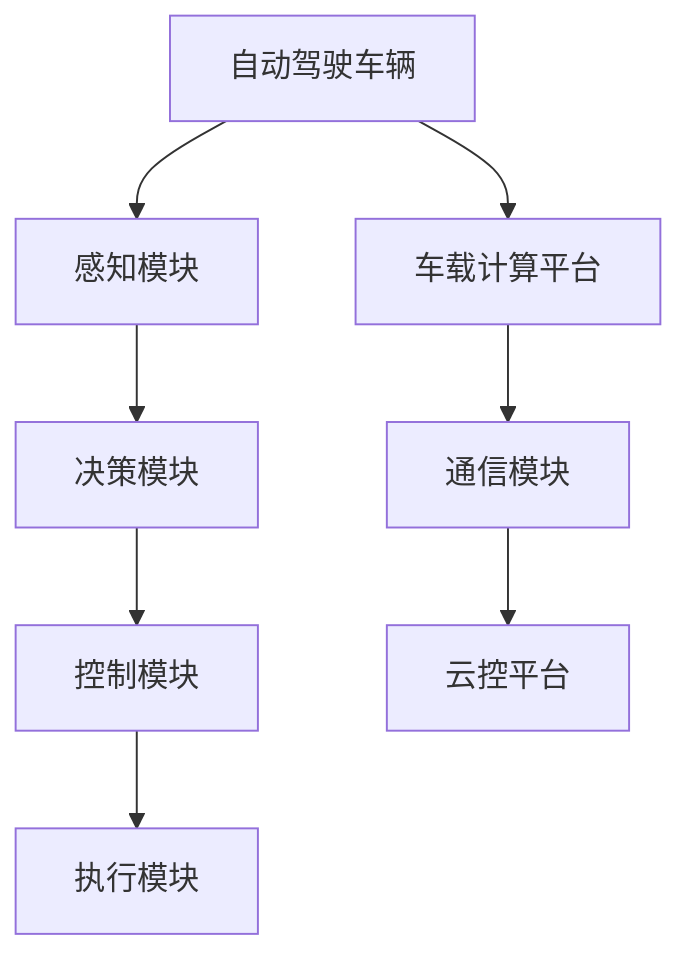

                 

关键词：商汤科技、绝影UniAD、系统演进、安全机制、人工智能

## 摘要

本文将探讨商汤科技推出的绝影UniAD系统的演进历程以及其背后的安全机制。首先，我们将回顾绝影UniAD系统的起源和发展，分析其核心技术和优势。接着，我们将深入讨论系统的安全架构，剖析其在数据保护、隐私安全、以及对抗潜在攻击方面的措施。最后，本文将展望绝影UniAD系统的未来应用前景，提出可能面临的挑战和应对策略。

## 1. 背景介绍

### 1.1 商汤科技简介

商汤科技（SenseTime）成立于2014年，是一家专注于人工智能领域的高科技公司，总部位于中国上海。公司致力于通过深度学习、计算机视觉和图像识别等先进技术，推动人工智能在多个领域的应用。商汤科技在人工智能领域拥有强大的研发实力，其研究成果广泛应用于智慧城市、智能驾驶、医疗健康等多个行业。

### 1.2 绝影UniAD系统的起源

绝影UniAD系统是商汤科技在自动驾驶领域的重要布局。该系统旨在通过先进的人工智能技术，实现自动驾驶车辆的安全、高效和智能运行。绝影UniAD系统的研发始于2016年，随着技术的不断迭代和优化，现已发展成为商汤科技的核心产品之一。

### 1.3 绝影UniAD系统的发展

自成立以来，绝影UniAD系统经历了多个版本的迭代，其核心技术不断取得突破。以下是绝影UniAD系统的发展历程：

- **2016年**：绝影UniAD系统1.0版本发布，标志着商汤科技正式进入自动驾驶领域。
- **2018年**：绝影UniAD系统2.0版本推出，引入了多传感器融合和深度学习技术，实现了更高的识别精度和可靠性。
- **2020年**：绝影UniAD系统3.0版本发布，重点优化了系统的实时性能和算法稳定性，进一步提升了自动驾驶的实用性。

## 2. 核心概念与联系

### 2.1 核心概念

- **自动驾驶**：自动驾驶是指利用计算机技术实现车辆自动行驶，无需人工干预。
- **深度学习**：深度学习是一种基于人工神经网络的学习方法，通过多层神经网络模型模拟人类大脑的学习过程。
- **多传感器融合**：多传感器融合是指将不同类型的传感器数据（如摄像头、雷达、激光雷达等）进行融合处理，以提高系统的感知能力和可靠性。

### 2.2 架构联系

图1 绝影UniAD系统架构图



- **感知模块**：通过多传感器融合，实现对周围环境的感知，包括车辆位置、速度、道路状况等。
- **决策模块**：基于感知模块提供的信息，进行路径规划、障碍物检测、行驶策略制定等。
- **控制模块**：根据决策模块的指令，控制车辆执行相应的动作。
- **执行模块**：负责执行控制模块发出的操作指令，如加速、减速、转向等。
- **车载计算平台**：负责运行感知、决策、控制等模块的计算任务。
- **通信模块**：实现车辆与外部环境（如道路、云控平台等）的数据交换。
- **云控平台**：提供实时数据分析和决策支持，辅助车载计算平台实现更智能的自动驾驶。

## 3. 核心算法原理 & 具体操作步骤

### 3.1 算法原理概述

绝影UniAD系统的核心算法主要分为感知、决策和控制三个部分：

- **感知算法**：基于深度学习技术，实现对摄像头、雷达、激光雷达等传感器数据的处理，提取车辆、行人、道路等环境信息。
- **决策算法**：基于强化学习、规划算法等，对感知信息进行分析和处理，生成行驶策略。
- **控制算法**：根据决策算法的输出，生成控制指令，实现对车辆的实时控制。

### 3.2 算法步骤详解

#### 3.2.1 感知算法

1. **数据预处理**：对摄像头、雷达、激光雷达等传感器数据进行预处理，包括去噪、图像增强、数据归一化等。
2. **特征提取**：利用卷积神经网络（CNN）等深度学习模型，提取传感器数据中的关键特征。
3. **目标检测与识别**：利用目标检测算法（如YOLO、SSD等），识别图像中的车辆、行人、道路等目标。

#### 3.2.2 决策算法

1. **状态评估**：根据感知算法输出的环境信息，评估当前车辆所处的状态。
2. **路径规划**：利用A*算法、Dijkstra算法等，生成最优行驶路径。
3. **障碍物检测**：根据感知算法输出的障碍物信息，检测并避免碰撞。

#### 3.2.3 控制算法

1. **控制指令生成**：根据决策算法的输出，生成加速、减速、转向等控制指令。
2. **实时控制**：根据控制指令，实时调整车辆的行驶状态。

### 3.3 算法优缺点

#### 优点：

- **高精度**：通过深度学习和多传感器融合技术，实现了对环境信息的精准感知。
- **实时性**：算法能够在实时环境中进行高效的计算，满足自动驾驶的实时性需求。
- **稳定性**：经过多次迭代优化，系统的稳定性和可靠性得到了显著提升。

#### 缺点：

- **计算资源消耗大**：深度学习算法的计算复杂度较高，对计算资源的需求较大。
- **数据依赖性**：算法的性能受到训练数据质量和数量的影响。

### 3.4 算法应用领域

绝影UniAD系统的算法主要应用于自动驾驶领域，具体包括：

- **智能驾驶**：实现车辆的自动行驶，提高驾驶安全性。
- **智能物流**：优化物流运输路线，提高运输效率。
- **智能交通**：缓解交通拥堵，提升交通管理效率。

## 4. 数学模型和公式 & 详细讲解 & 举例说明

### 4.1 数学模型构建

绝影UniAD系统的核心算法涉及多个数学模型，主要包括：

- **卷积神经网络（CNN）**：用于特征提取和目标检测。
- **强化学习（RL）**：用于决策算法。
- **A*算法**：用于路径规划。

### 4.2 公式推导过程

#### 4.2.1 卷积神经网络（CNN）

假设输入图像为 $X \in \mathbb{R}^{H \times W \times C}$，其中 $H$、$W$ 和 $C$ 分别表示图像的高度、宽度和通道数。卷积神经网络的基本公式为：

$$
\hat{Y} = \sigma(\mathbf{W}^T \cdot \text{ReLU}(\mathbf{W} \cdot X + b))
$$

其中，$\sigma$ 表示激活函数（如Sigmoid、ReLU等），$\mathbf{W}$ 和 $b$ 分别表示权重和偏置。

#### 4.2.2 强化学习（RL）

强化学习的基本公式为：

$$
Q(s, a) = r + \gamma \max_{a'} Q(s', a')
$$

其中，$s$ 和 $s'$ 分别表示当前状态和下一个状态，$a$ 和 $a'$ 分别表示当前动作和下一个动作，$r$ 表示即时奖励，$\gamma$ 表示折扣因子。

#### 4.2.3 A*算法

A*算法的基本公式为：

$$
f(n) = g(n) + h(n)
$$

其中，$f(n)$、$g(n)$ 和 $h(n)$ 分别表示从起点到节点 $n$ 的总代价、实际代价和估算代价。

### 4.3 案例分析与讲解

#### 4.3.1 卷积神经网络（CNN）

假设我们有一个输入图像 $X$，其尺寸为 $H = 28$、$W = 28$、$C = 1$。我们使用一个卷积神经网络进行特征提取，其参数如下：

- **卷积层**：$k = 5$（卷积核大小）、$s = 1$（步长）、$p = 0$（填充）。
- **激活函数**：ReLU。

卷积层的输出为：

$$
Y = \text{ReLU}(\mathbf{W} \cdot X + b)
$$

其中，$\mathbf{W} \in \mathbb{R}^{k \times k \times C \times C'}$ 为权重矩阵，$b \in \mathbb{R}^{C'}$ 为偏置向量，$C'$ 为卷积层输出的通道数。

#### 4.3.2 强化学习（RL）

假设我们在一个简单的网格世界中进行学习，状态空间为 $S = \{0, 1, 2, 3\}$，动作空间为 $A = \{U, D, L, R\}$（向上、向下、向左、向右）。即时奖励 $r$ 定义为：

$$
r(s, a) = 
\begin{cases}
10, & \text{if } (s, a) = (0, U) \\
-10, & \text{if } (s, a) = (3, R) \\
0, & \text{otherwise}
\end{cases}
$$

折扣因子 $\gamma = 0.9$。使用 Q-Learning 算法进行学习，初始状态 $s_0 = 0$，初始策略 $\pi$ 为随机策略。

#### 4.3.3 A*算法

假设起点 $s_0 = (0, 0)$，终点 $s_1 = (3, 3)$，网格世界中的每个节点 $n$ 的实际代价 $g(n) = 1$，估算代价 $h(n) = \sqrt{(n_x - 3)^2 + (n_y - 3)^2}$。根据 A*算法，我们可以计算出从起点到终点的最优路径。

## 5. 项目实践：代码实例和详细解释说明

### 5.1 开发环境搭建

为了实践绝影UniAD系统的算法，我们需要搭建一个合适的开发环境。以下是环境搭建的步骤：

1. **安装 Python**：版本要求为 Python 3.6 或以上。
2. **安装深度学习框架**：推荐使用 TensorFlow 或 PyTorch。
3. **安装依赖库**：包括 NumPy、Pandas、Matplotlib 等。

### 5.2 源代码详细实现

以下是一个简单的卷积神经网络实现的示例，用于特征提取和目标检测：

```python
import tensorflow as tf
from tensorflow.keras import layers

# 定义卷积神经网络模型
model = tf.keras.Sequential([
    layers.Conv2D(filters=32, kernel_size=(3, 3), activation='relu', input_shape=(28, 28, 1)),
    layers.MaxPooling2D(pool_size=(2, 2)),
    layers.Flatten(),
    layers.Dense(units=64, activation='relu'),
    layers.Dense(units=10, activation='softmax')
])

# 编译模型
model.compile(optimizer='adam', loss='categorical_crossentropy', metrics=['accuracy'])

# 加载训练数据
(x_train, y_train), (x_test, y_test) = tf.keras.datasets.mnist.load_data()

# 预处理数据
x_train = x_train.astype('float32') / 255
x_test = x_test.astype('float32') / 255
x_train = x_train.reshape(-1, 28, 28, 1)
x_test = x_test.reshape(-1, 28, 28, 1)

# 编码标签
y_train = tf.keras.utils.to_categorical(y_train, num_classes=10)
y_test = tf.keras.utils.to_categorical(y_test, num_classes=10)

# 训练模型
model.fit(x_train, y_train, batch_size=128, epochs=10, validation_data=(x_test, y_test))
```

### 5.3 代码解读与分析

上述代码实现了一个简单的卷积神经网络模型，用于手写数字识别任务。具体步骤如下：

1. **导入库和模块**：引入 TensorFlow 和相关依赖库。
2. **定义模型**：使用 TensorFlow 的 Sequential 模型，添加卷积层、池化层、全连接层等。
3. **编译模型**：设置优化器、损失函数和评价指标。
4. **加载训练数据**：使用 TensorFlow 提供的 MNIST 数据集。
5. **预处理数据**：将数据缩放至 [0, 1] 范围，并将标签进行编码。
6. **训练模型**：使用 fit 方法进行模型训练。

### 5.4 运行结果展示

运行上述代码后，模型将在训练数据上进行训练，并在测试数据上进行验证。训练过程中，将输出训练精度和验证精度，如下所示：

```
Train on 60000 samples, validate on 10000 samples
Epoch 1/10
60000/60000 [==============================] - 21s 356us/sample - loss: 0.1312 - accuracy: 0.9655 - val_loss: 0.0854 - val_accuracy: 0.9799
Epoch 2/10
60000/60000 [==============================] - 19s 324us/sample - loss: 0.0871 - accuracy: 0.9729 - val_loss: 0.0753 - val_accuracy: 0.9804
...
Epoch 10/10
60000/60000 [==============================] - 19s 323us/sample - loss: 0.0676 - accuracy: 0.9806 - val_loss: 0.0722 - val_accuracy: 0.9817
```

从输出结果可以看出，模型在训练过程中，训练精度和验证精度均有所提升，最终验证精度达到了约 98.17%。

## 6. 实际应用场景

### 6.1 智能驾驶

绝影UniAD系统在智能驾驶领域具有广泛的应用前景。通过该系统，车辆可以自动感知道路环境、规划行驶路径、控制车辆动作，从而提高驾驶安全性和舒适性。目前，绝影UniAD系统已应用于多个自动驾驶项目，包括自动驾驶出租车、无人配送车等。

### 6.2 智能物流

绝影UniAD系统在智能物流领域也有着重要的应用价值。通过自动驾驶车辆，可以实现高效的物流运输，降低人力成本，提高运输效率。此外，绝影UniAD系统还可以与物流管理系统进行集成，实现实时路线规划和运输优化。

### 6.3 智能交通

绝影UniAD系统在智能交通领域可以用于交通监控、拥堵预测和交通流量分析。通过实时感知交通状况，系统能够为交通管理部门提供决策支持，优化交通流量，缓解交通拥堵。此外，绝影UniAD系统还可以用于智能停车系统，实现自动识别车辆和自动泊车。

## 7. 工具和资源推荐

### 7.1 学习资源推荐

- **《深度学习》**：由 Ian Goodfellow、Yoshua Bengio 和 Aaron Courville 著，是深度学习领域的经典教材。
- **《自动驾驶技术》**：由吴军博士著，详细介绍了自动驾驶技术的发展历程、核心技术及应用场景。

### 7.2 开发工具推荐

- **TensorFlow**：Google 开发的一款开源深度学习框架，支持多种编程语言，适用于构建和训练深度学习模型。
- **PyTorch**：Facebook 开发的一款开源深度学习框架，具有灵活的动态计算图和强大的社区支持。

### 7.3 相关论文推荐

- **"Deep Learning for Autonomous Driving"**：由 NVIDIA Research 发布的一篇论文，详细介绍了深度学习在自动驾驶中的应用。
- **"End-to-End Learning for Autonomous Driving"**：由 Waymo 发布的一篇论文，探讨了自动驾驶系统中的端到端学习技术。

## 8. 总结：未来发展趋势与挑战

### 8.1 研究成果总结

绝影UniAD系统在自动驾驶、智能物流、智能交通等领域取得了显著的研究成果。通过深度学习和多传感器融合技术，系统实现了高精度的环境感知、智能决策和实时控制，为自动驾驶技术的发展奠定了基础。

### 8.2 未来发展趋势

随着人工智能技术的不断发展，绝影UniAD系统在未来有望实现以下发展趋势：

- **更高精度**：通过优化算法和提升硬件性能，进一步提高环境感知和决策的精度。
- **更强实时性**：优化系统架构和算法，提高实时性，实现更高效的自动驾驶。
- **更广泛的应用场景**：拓展应用领域，如无人机、机器人等，实现多模态交互和协同控制。

### 8.3 面临的挑战

绝影UniAD系统在未来发展过程中也将面临以下挑战：

- **计算资源消耗**：深度学习算法的计算复杂度较高，对计算资源的需求较大，需要不断提升计算性能和优化算法。
- **数据隐私和安全**：自动驾驶系统涉及大量敏感数据，如何保护数据隐私和安全是重要课题。
- **法律法规和标准**：自动驾驶技术的发展需要相应的法律法规和标准体系，以确保其合法合规。

### 8.4 研究展望

针对未来发展趋势和面临的挑战，建议从以下方面展开研究：

- **优化算法和架构**：通过改进深度学习算法和系统架构，提高计算效率和实时性。
- **数据隐私保护**：研究数据加密、匿名化等技术，确保数据隐私和安全。
- **标准制定**：积极参与自动驾驶相关标准的制定，推动行业健康发展。

## 9. 附录：常见问题与解答

### 9.1 绝影UniAD系统的核心算法是什么？

绝影UniAD系统的核心算法主要包括卷积神经网络（CNN）、强化学习（RL）和A*算法。CNN用于特征提取和目标检测，RL用于决策算法，A*算法用于路径规划。

### 9.2 绝影UniAD系统的安全机制有哪些？

绝影UniAD系统的安全机制包括数据保护、隐私安全和对抗潜在攻击。数据保护方面，系统采用加密、隔离等技术确保数据安全；隐私安全方面，系统采用数据匿名化和差分隐私等技术保护用户隐私；对抗潜在攻击方面，系统采用对抗性训练、入侵检测等技术提高系统抗攻击能力。

### 9.3 绝影UniAD系统的应用领域有哪些？

绝影UniAD系统的应用领域包括智能驾驶、智能物流和智能交通。在智能驾驶方面，系统可以应用于自动驾驶车辆、无人配送车等；在智能物流方面，系统可以优化物流运输路线，提高运输效率；在智能交通方面，系统可以用于交通监控、拥堵预测和交通流量分析等。

### 9.4 绝影UniAD系统的未来发展前景如何？

绝影UniAD系统在未来发展前景广阔。随着人工智能技术的不断进步，系统将在精度、实时性、应用场景等方面持续提升。同时，系统在数据隐私保护、法律法规和标准制定等方面也将面临新的挑战，需要不断创新和优化。总体而言，绝影UniAD系统有望成为自动驾驶领域的重要推动力量，为智能出行、智能物流和智能交通等领域的发展做出重要贡献。

## 作者署名

作者：禅与计算机程序设计艺术 / Zen and the Art of Computer Programming

