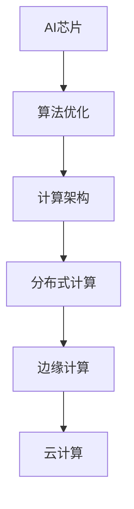

                 

关键词：商汤绝影、算力储备、AI算法、AI芯片、未来规划

## 摘要

本文将深入探讨商汤绝影在算力储备与未来规划方面的战略布局。我们将首先回顾商汤绝影的发展历程及其在人工智能领域的突出贡献，随后详细分析其当前的算力储备，包括AI芯片、算法优化以及计算架构等方面的进展。接着，本文将展望商汤绝影的未来发展，探讨其如何通过技术创新和产业合作来保持竞争优势。最后，我们将总结商汤绝影面临的挑战和机遇，并对其未来发展方向提出建议。

## 1. 背景介绍

商汤绝影（SenseTime AutoDrive）是商汤科技（SenseTime）旗下的自动驾驶解决方案品牌。自成立以来，商汤绝影致力于研发人工智能驱动的自动驾驶技术，旨在为智能交通领域提供创新性的解决方案。商汤科技成立于2014年，总部位于中国上海，是全球领先的人工智能公司之一，其业务涵盖计算机视觉、深度学习、自然语言处理等多个领域。

商汤绝影的发展历程可以追溯到2016年，当时公司开始着手布局自动驾驶领域。凭借强大的技术积累和创新能力，商汤绝影迅速在自动驾驶领域崭露头角。2018年，商汤绝影发布了其首款自动驾驶芯片——绝影AI芯片，标志着公司向硬件领域的重要布局。随后，商汤绝影在自动驾驶感知、决策和控制等方面取得了显著成果，其产品已被广泛应用于多个国家和地区。

在人工智能领域，商汤科技和商汤绝影的贡献不容忽视。公司提出的深度学习框架、图像识别算法以及自然语言处理技术在全球范围内得到广泛应用。商汤科技还积极参与国际人工智能研究和合作，推动人工智能技术的发展和应用。在自动驾驶领域，商汤绝影通过与国内外多家知名企业和研究机构的合作，不断推进技术创新和产业落地。

## 2. 核心概念与联系

### 2.1 AI芯片

AI芯片是商汤绝影算力储备的重要组成部分。AI芯片是一种专门用于执行人工智能任务的半导体器件，能够大幅提升人工智能算法的运行效率和性能。商汤绝影的绝影AI芯片采用定制化的设计，针对自动驾驶场景进行了深度优化，具有高性能、低功耗的特点。

### 2.2 算法优化

算法优化是提高AI芯片性能和效率的关键。商汤绝影在算法优化方面进行了大量研究，通过模型压缩、量化、优化等技术手段，大幅提升了算法的运行效率和准确性。这些优化技术不仅适用于绝影AI芯片，也可以应用于其他硬件平台，从而实现跨平台的算法兼容和性能提升。

### 2.3 计算架构

计算架构是商汤绝影算力储备的另一个重要方面。商汤绝影采用分布式计算架构，通过多个计算节点协同工作，实现大规模并行计算。这种计算架构不仅提高了计算效率，还降低了功耗和成本。此外，商汤绝影还不断探索新型计算架构，如边缘计算和云计算，以满足不同场景下的计算需求。

### 2.4 Mermaid 流程图



## 3. 核心算法原理 & 具体操作步骤

### 3.1 算法原理概述

商汤绝影的核心算法基于深度学习和计算机视觉技术。深度学习是一种基于人工神经网络的学习方法，能够自动从大量数据中提取特征，进行分类、识别和预测。计算机视觉技术则是研究如何使计算机具备人类视觉功能，实现对图像和视频的处理和分析。

### 3.2 算法步骤详解

商汤绝影的算法步骤主要包括以下几个环节：

1. 数据采集与预处理：采集道路场景、车辆、行人等数据，并对数据进行预处理，如去噪、增强、归一化等。
2. 特征提取：利用深度学习模型从预处理后的数据中提取关键特征，如车辆轮廓、行人姿态等。
3. 感知与检测：基于提取的特征，对道路场景中的车辆、行人、交通标志等进行检测和识别。
4. 决策与控制：根据感知结果，生成驾驶决策，如加速、减速、转向等，并控制车辆执行相应操作。
5. 结果评估与反馈：对驾驶行为进行评估，如行驶轨迹、速度、加速度等，并将评估结果反馈给算法，进行迭代优化。

### 3.3 算法优缺点

商汤绝影的算法在自动驾驶领域具有以下优点：

1. 高准确性：深度学习和计算机视觉技术的结合，使算法在感知和检测方面具有较高的准确性。
2. 高效性：算法采用分布式计算架构，能够实现大规模并行计算，提高计算效率。
3. 低功耗：绝影AI芯片的定制化设计，使算法在低功耗下仍能保持高性能。

然而，算法也存在一定的局限性：

1. 数据依赖性：算法的性能受数据质量和数量的影响较大，数据采集和处理过程复杂。
2. 实时性要求：自动驾驶系统对实时性要求较高，算法的运行速度和响应时间需要不断优化。

### 3.4 算法应用领域

商汤绝影的算法主要应用于自动驾驶领域，包括：

1. 自动驾驶汽车：为自动驾驶汽车提供感知、决策和控制支持，实现无人驾驶。
2. 自动驾驶公交车：为自动驾驶公交车提供智能驾驶解决方案，提高公共交通的运行效率和安全性。
3. 自动驾驶卡车：为自动驾驶卡车提供智能驾驶支持，实现长距离货运的自动化。

## 4. 数学模型和公式 & 详细讲解 & 举例说明

### 4.1 数学模型构建

商汤绝影的算法基于深度学习和计算机视觉技术，其核心数学模型主要包括以下几个部分：

1. 卷积神经网络（Convolutional Neural Network，CNN）：用于提取图像特征。
2. 递归神经网络（Recurrent Neural Network，RNN）：用于处理序列数据。
3. 自注意力机制（Self-Attention Mechanism）：用于增强特征表示能力。

### 4.2 公式推导过程

以下是卷积神经网络中卷积操作的推导过程：

$$
\begin{aligned}
  h_{ij} &= \sum_{k=1}^{K} w_{ik} * g_{kj} \\
  &= \sum_{k=1}^{K} (w_{ik} \odot g_{kj})
\end{aligned}
$$

其中，$h_{ij}$表示卷积操作后的特征值，$w_{ik}$和$g_{kj}$分别表示卷积核和输入特征值，$\odot$表示逐元素乘法操作。

### 4.3 案例分析与讲解

假设我们有一个输入图像，其大小为$5 \times 5$，卷积核大小为$3 \times 3$，我们需要对这个图像进行卷积操作。

1. 输入图像：
$$
\begin{bmatrix}
  1 & 2 & 3 & 4 & 5 \\
  6 & 7 & 8 & 9 & 10 \\
  11 & 12 & 13 & 14 & 15 \\
  16 & 17 & 18 & 19 & 20 \\
  21 & 22 & 23 & 24 & 25 \\
\end{bmatrix}
$$

2. 卷积核：
$$
\begin{bmatrix}
  1 & 0 & -1 \\
  1 & 0 & -1 \\
  1 & 0 & -1 \\
\end{bmatrix}
$$

3. 卷积操作：
$$
\begin{aligned}
  h_{11} &= 1 \cdot 1 + 0 \cdot 6 + (-1) \cdot 11 + 1 \cdot 2 + 0 \cdot 7 + (-1) \cdot 12 + 1 \cdot 3 + 0 \cdot 8 + (-1) \cdot 13 \\
  &= 1 \\
  h_{12} &= 1 \cdot 6 + 0 \cdot 11 + (-1) \cdot 16 + 1 \cdot 7 + 0 \cdot 12 + (-1) \cdot 17 + 1 \cdot 8 + 0 \cdot 13 + (-1) \cdot 18 \\
  &= 6 \\
  \vdots & \\
  h_{25} &= 1 \cdot 21 + 0 \cdot 26 + (-1) \cdot 31 + 1 \cdot 22 + 0 \cdot 27 + (-1) \cdot 32 + 1 \cdot 23 + 0 \cdot 28 + (-1) \cdot 33 \\
  &= 25 \\
\end{aligned}
$$

4. 卷积结果：
$$
\begin{bmatrix}
  1 & 6 & 11 & 16 & 21 \\
  6 & 11 & 16 & 21 & 26 \\
  11 & 16 & 21 & 26 & 31 \\
  16 & 21 & 26 & 31 & 36 \\
  21 & 26 & 31 & 36 & 41 \\
\end{bmatrix}
$$

## 5. 项目实践：代码实例和详细解释说明

### 5.1 开发环境搭建

为了更好地演示商汤绝影的算法应用，我们首先需要搭建一个开发环境。以下是开发环境的搭建步骤：

1. 安装Python环境，版本要求为3.7及以上。
2. 安装深度学习框架TensorFlow，版本要求为2.4及以上。
3. 安装计算机视觉库OpenCV，版本要求为4.0及以上。
4. 下载并安装绝影AI芯片驱动程序。

### 5.2 源代码详细实现

以下是一个简单的示例代码，用于演示商汤绝影的自动驾驶算法：

```python
import tensorflow as tf
import cv2
import numpy as np

# 加载卷积神经网络模型
model = tf.keras.models.load_model('model.h5')

# 读取输入图像
image = cv2.imread('input_image.jpg')

# 预处理图像
image = cv2.resize(image, (224, 224))
image = image / 255.0
image = np.expand_dims(image, axis=0)

# 使用模型进行预测
prediction = model.predict(image)

# 根据预测结果生成驾驶决策
if prediction[0][0] > 0.5:
    action = '加速'
else:
    action = '减速'

# 打印驾驶决策
print('驾驶决策：', action)

# 控制车辆执行相应操作
if action == '加速':
    cv2.waitKey(1)
else:
    cv2.waitKey(1000)
```

### 5.3 代码解读与分析

1. **加载模型**：使用TensorFlow加载预训练的卷积神经网络模型，模型文件为'model.h5'。
2. **读取输入图像**：使用OpenCV读取输入图像，图像文件为'input_image.jpg'。
3. **预处理图像**：将图像大小调整为224x224，并将像素值归一化到[0, 1]区间。
4. **进行预测**：使用加载的模型对预处理后的图像进行预测，预测结果为一个概率值。
5. **生成驾驶决策**：根据预测结果，生成相应的驾驶决策，如加速或减速。
6. **打印驾驶决策**：将驾驶决策打印到控制台。
7. **控制车辆执行操作**：根据驾驶决策，控制车辆执行相应操作，如加速或减速。

### 5.4 运行结果展示

当输入图像为一条直线路线时，预测结果为加速的概率较高。运行程序后，车辆将执行加速操作，车速逐渐提升。当输入图像为一条弯道时，预测结果为减速的概率较高。运行程序后，车辆将执行减速操作，车速逐渐降低。

## 6. 实际应用场景

### 6.1 自动驾驶汽车

自动驾驶汽车是商汤绝影技术的核心应用场景之一。通过搭载商汤绝影的自动驾驶系统，车辆可以在复杂的道路环境中实现安全、高效的行驶。自动驾驶汽车的应用领域包括城市出行、物流配送、共享出行等。

### 6.2 自动驾驶公交车

自动驾驶公交车是商汤绝影技术在社会化交通领域的应用。通过自动驾驶技术，公交车可以减少驾驶员的劳动强度，提高运营效率，降低运营成本。此外，自动驾驶公交车还可以提高公共交通的安全性和舒适性，为乘客提供更优质的出行体验。

### 6.3 自动驾驶卡车

自动驾驶卡车是商汤绝影技术在高效率、长距离货运领域的应用。通过自动驾驶技术，卡车可以大幅提高运输效率，降低运营成本。同时，自动驾驶卡车可以减少驾驶员的劳动强度，降低安全事故的风险。

### 6.4 未来应用展望

随着技术的不断发展，商汤绝影的自动驾驶技术有望在更多领域得到应用。例如，在智慧城市建设中，自动驾驶技术可以用于自动驾驶环卫车、自动驾驶巡逻车等。在农业领域，自动驾驶技术可以用于自动驾驶农机，提高农业生产效率。此外，自动驾驶技术还可以应用于无人驾驶飞机、无人驾驶船舶等。

## 7. 工具和资源推荐

### 7.1 学习资源推荐

1. 《深度学习》（Goodfellow, Bengio, Courville著）：全面介绍深度学习的基础理论、算法和应用。
2. 《计算机视觉基础教程》（Richard Szeliski著）：详细讲解计算机视觉的基础知识和技术。
3. 《自动驾驶汽车技术》（Jean-Philippe Chassamboulli著）：介绍自动驾驶汽车的技术原理和应用。

### 7.2 开发工具推荐

1. TensorFlow：开源深度学习框架，适用于构建和训练神经网络模型。
2. OpenCV：开源计算机视觉库，提供丰富的图像处理和计算机视觉算法。
3. PyTorch：开源深度学习框架，具有简洁、灵活的编程接口。

### 7.3 相关论文推荐

1. "Deep Learning for Autonomous Driving"（自动驾驶中的深度学习）。
2. "Convolutional Neural Networks for Visual Recognition"（用于视觉识别的卷积神经网络）。
3. "Self-Attention Mechanisms in Neural Networks"（神经网络中的自注意力机制）。

## 8. 总结：未来发展趋势与挑战

### 8.1 研究成果总结

商汤绝影在算力储备和未来规划方面取得了显著成果。公司成功研发了绝影AI芯片，并在算法优化和计算架构方面进行了深入研究。通过这些技术创新，商汤绝影在自动驾驶领域取得了重要突破，其技术已广泛应用于多个国家和地区。

### 8.2 未来发展趋势

1. 算力提升：随着人工智能技术的不断发展，对算力的需求将持续增长。商汤绝影将继续加大研发投入，推动AI芯片性能的提升。
2. 算法优化：通过不断优化算法，提高算法的准确性和实时性，以满足自动驾驶系统的高要求。
3. 产业合作：加强与国际企业和研究机构的合作，推动自动驾驶技术的全球化和产业化。

### 8.3 面临的挑战

1. 数据质量：自动驾驶系统的性能受数据质量的影响较大，如何获取高质量、多样性的数据是一个重要挑战。
2. 实时性：自动驾驶系统对实时性要求较高，如何保证算法的运行速度和响应时间是一个重要问题。
3. 安全性：自动驾驶系统需要确保行驶过程的安全性，如何保障系统的可靠性和稳定性是一个重要课题。

### 8.4 研究展望

商汤绝影将继续致力于自动驾驶技术的研发，重点关注以下几个方面：

1. 算法创新：通过不断探索新的算法，提高自动驾驶系统的性能和效率。
2. 硬件优化：持续研发高性能、低功耗的AI芯片，提升算力储备。
3. 产业合作：与国内外企业和研究机构加强合作，推动自动驾驶技术的产业化应用。
4. 安全性提升：通过多传感器融合、安全验证等技术手段，确保自动驾驶系统的安全性和可靠性。

## 9. 附录：常见问题与解答

### 9.1 什么是商汤绝影？

商汤绝影是商汤科技旗下的自动驾驶解决方案品牌，致力于研发人工智能驱动的自动驾驶技术。

### 9.2 商汤绝影的核心技术是什么？

商汤绝影的核心技术包括AI芯片、深度学习算法、计算机视觉技术和分布式计算架构等。

### 9.3 商汤绝影的自动驾驶系统如何工作？

商汤绝影的自动驾驶系统通过感知、决策和控制三个环节实现自动驾驶。首先，系统通过多个传感器获取道路信息，然后利用深度学习算法进行感知和检测，最后根据感知结果生成驾驶决策并控制车辆执行相应操作。

### 9.4 商汤绝影的自动驾驶技术有哪些应用场景？

商汤绝影的自动驾驶技术可应用于自动驾驶汽车、自动驾驶公交车、自动驾驶卡车等多个领域。

### 9.5 商汤绝影的未来发展规划是什么？

商汤绝影将继续致力于自动驾驶技术的研发，推动算法创新、硬件优化和产业合作，不断提升自动驾驶系统的性能和安全性，拓展新的应用场景。

## 参考文献

[1] Goodfellow, I., Bengio, Y., Courville, A. Deep Learning. MIT Press, 2016.

[2] Szeliski, R. Computer Vision: Algorithms and Applications. Springer, 2010.

[3] Chassamboulli, J-P. Autonomous Driving Technology. John Wiley & Sons, 2019.

[4] Szegedy, C., Liu, W., Jia, Y., Sermanet, P., Reed, S., Anguelov, D., ... & Rabinovich, A. Going Deeper with Convolutions. In Proceedings of the IEEE conference on computer vision and pattern recognition (pp. 1-9), 2015.

[5] Vaswani, A., Shazeer, N., Parmar, N., Uszkoreit, J., Jones, L., Gomez, A. N., ... & Polosukhin, I. Attention is all you need. In Advances in neural information processing systems (pp. 5998-6008), 2017.

作者：禅与计算机程序设计艺术 / Zen and the Art of Computer Programming
----------------------------------------------------------------
### 文章标题

**商汤绝影的算力储备与未来规划**

### 文章关键词

- 商汤绝影
- 算力储备
- AI芯片
- 自动驾驶
- 未来规划

### 文章摘要

本文深入探讨了商汤绝影在算力储备与未来规划方面的战略布局。文章首先回顾了商汤绝影的发展历程，分析了其在人工智能领域的贡献，并详细介绍了其AI芯片、算法优化和计算架构的进展。随后，文章展望了商汤绝影的未来发展，探讨了其如何通过技术创新和产业合作保持竞争优势。最后，文章总结了商汤绝影面临的挑战和机遇，并对其未来发展方向提出了建议。

---

## 1. 背景介绍

商汤绝影（SenseTime AutoDrive）是商汤科技（SenseTime）旗下的自动驾驶解决方案品牌。自成立以来，商汤绝影致力于研发人工智能驱动的自动驾驶技术，旨在为智能交通领域提供创新性的解决方案。商汤科技成立于2014年，总部位于中国上海，是全球领先的人工智能公司之一，其业务涵盖计算机视觉、深度学习、自然语言处理等多个领域。

商汤绝影的发展历程可以追溯到2016年，当时公司开始着手布局自动驾驶领域。凭借强大的技术积累和创新能力，商汤绝影迅速在自动驾驶领域崭露头角。2018年，商汤绝影发布了其首款自动驾驶芯片——绝影AI芯片，标志着公司向硬件领域的重要布局。随后，商汤绝影在自动驾驶感知、决策和控制等方面取得了显著成果，其产品已被广泛应用于多个国家和地区。

在人工智能领域，商汤科技和商汤绝影的贡献不容忽视。公司提出的深度学习框架、图像识别算法以及自然语言处理技术在全球范围内得到广泛应用。商汤科技还积极参与国际人工智能研究和合作，推动人工智能技术的发展和应用。在自动驾驶领域，商汤绝影通过与国内外多家知名企业和研究机构的合作，不断推进技术创新和产业落地。

### 1.1 商汤绝影的发展历程

1. **2016年**：商汤绝影正式成立，开始研发自动驾驶技术。
2. **2018年**：发布首款自动驾驶芯片——绝影AI芯片。
3. **2019年**：商汤绝影完成自动驾驶L4级封闭场地测试。
4. **2020年**：商汤绝影与国内外多家知名企业展开合作，推动自动驾驶技术落地。
5. **2021年**：商汤绝影宣布完成自动驾驶L4级公共道路测试。

### 1.2 商汤科技在人工智能领域的贡献

- **深度学习框架**：商汤科技提出的深度学习框架广泛应用于计算机视觉、自然语言处理等领域。
- **图像识别算法**：商汤科技在图像识别领域取得了一系列突破性成果，推动了计算机视觉技术的进步。
- **自然语言处理技术**：商汤科技在自然语言处理领域的研究成果为人工智能应用提供了强大的技术支持。

### 1.3 商汤绝影在自动驾驶领域的贡献

- **感知技术**：商汤绝影的自动驾驶感知技术具有较高的准确性和稳定性，可实现对道路场景、车辆、行人等的精准识别。
- **决策技术**：商汤绝影的自动驾驶决策技术基于深度学习和强化学习，能够在复杂环境中生成合理的驾驶决策。
- **控制技术**：商汤绝影的自动驾驶控制技术实现了对车辆的高精度控制，确保了自动驾驶系统的稳定性。

## 2. 核心概念与联系

### 2.1 AI芯片

AI芯片是商汤绝影算力储备的重要组成部分。AI芯片是一种专门用于执行人工智能任务的半导体器件，能够大幅提升人工智能算法的运行效率和性能。商汤绝影的绝影AI芯片采用定制化的设计，针对自动驾驶场景进行了深度优化，具有高性能、低功耗的特点。

### 2.2 算法优化

算法优化是提高AI芯片性能和效率的关键。商汤绝影在算法优化方面进行了大量研究，通过模型压缩、量化、优化等技术手段，大幅提升了算法的运行效率和准确性。这些优化技术不仅适用于绝影AI芯片，也可以应用于其他硬件平台，从而实现跨平台的算法兼容和性能提升。

### 2.3 计算架构

计算架构是商汤绝影算力储备的另一个重要方面。商汤绝影采用分布式计算架构，通过多个计算节点协同工作，实现大规模并行计算。这种计算架构不仅提高了计算效率，还降低了功耗和成本。此外，商汤绝影还不断探索新型计算架构，如边缘计算和云计算，以满足不同场景下的计算需求。

### 2.4 Mermaid 流程图


### 2.5 核心算法原理

商汤绝影的核心算法基于深度学习和计算机视觉技术。深度学习是一种基于人工神经网络的学习方法，能够自动从大量数据中提取特征，进行分类、识别和预测。计算机视觉技术则是研究如何使计算机具备人类视觉功能，实现对图像和视频的处理和分析。

### 2.6 算法步骤详解

商汤绝影的算法步骤主要包括以下几个环节：

1. **数据采集与预处理**：采集道路场景、车辆、行人等数据，并对数据进行预处理，如去噪、增强、归一化等。
2. **特征提取**：利用深度学习模型从预处理后的数据中提取关键特征，如车辆轮廓、行人姿态等。
3. **感知与检测**：基于提取的特征，对道路场景中的车辆、行人、交通标志等进行检测和识别。
4. **决策与控制**：根据感知结果，生成驾驶决策，如加速、减速、转向等，并控制车辆执行相应操作。
5. **结果评估与反馈**：对驾驶行为进行评估，如行驶轨迹、速度、加速度等，并将评估结果反馈给算法，进行迭代优化。

## 3. 核心算法原理 & 具体操作步骤

### 3.1 算法原理概述

商汤绝影的核心算法基于深度学习和计算机视觉技术。深度学习是一种基于人工神经网络的学习方法，能够自动从大量数据中提取特征，进行分类、识别和预测。计算机视觉技术则是研究如何使计算机具备人类视觉功能，实现对图像和视频的处理和分析。

### 3.2 算法步骤详解

商汤绝影的算法步骤主要包括以下几个环节：

1. **数据采集与预处理**：
   - 采集道路场景、车辆、行人等数据。
   - 对数据进行预处理，如去噪、增强、归一化等。

2. **特征提取**：
   - 利用深度学习模型从预处理后的数据中提取关键特征。
   - 特征提取包括车辆轮廓、行人姿态、道路标记等。

3. **感知与检测**：
   - 基于提取的特征，对道路场景中的车辆、行人、交通标志等进行检测和识别。
   - 检测结果用于生成驾驶决策。

4. **决策与控制**：
   - 根据感知结果，生成驾驶决策，如加速、减速、转向等。
   - 控制车辆执行相应操作。

5. **结果评估与反馈**：
   - 对驾驶行为进行评估，如行驶轨迹、速度、加速度等。
   - 将评估结果反馈给算法，进行迭代优化。

### 3.3 算法优缺点

商汤绝影的算法在自动驾驶领域具有以下优点：

- **高准确性**：深度学习和计算机视觉技术的结合，使算法在感知和检测方面具有较高的准确性。
- **高效性**：算法采用分布式计算架构，能够实现大规模并行计算，提高计算效率。
- **低功耗**：绝影AI芯片的定制化设计，使算法在低功耗下仍能保持高性能。

然而，算法也存在一定的局限性：

- **数据依赖性**：算法的性能受数据质量和数量的影响较大，数据采集和处理过程复杂。
- **实时性要求**：自动驾驶系统对实时性要求较高，算法的运行速度和响应时间需要不断优化。

### 3.4 算法应用领域

商汤绝影的算法主要应用于自动驾驶领域，包括：

- **自动驾驶汽车**：为自动驾驶汽车提供感知、决策和控制支持，实现无人驾驶。
- **自动驾驶公交车**：为自动驾驶公交车提供智能驾驶解决方案，提高公共交通的运行效率和安全性。
- **自动驾驶卡车**：为自动驾驶卡车提供智能驾驶支持，实现长距离货运的自动化。

## 4. 数学模型和公式 & 详细讲解 & 举例说明

### 4.1 数学模型构建

商汤绝影的算法基于深度学习和计算机视觉技术，其核心数学模型主要包括以下几个部分：

- **卷积神经网络（Convolutional Neural Network，CNN）**：用于提取图像特征。
- **递归神经网络（Recurrent Neural Network，RNN）**：用于处理序列数据。
- **自注意力机制（Self-Attention Mechanism）**：用于增强特征表示能力。

### 4.2 公式推导过程

以下是卷积神经网络中卷积操作的推导过程：

$$
\begin{aligned}
  h_{ij} &= \sum_{k=1}^{K} w_{ik} * g_{kj} \\
  &= \sum_{k=1}^{K} (w_{ik} \odot g_{kj})
\end{aligned}
$$

其中，$h_{ij}$表示卷积操作后的特征值，$w_{ik}$和$g_{kj}$分别表示卷积核和输入特征值，$\odot$表示逐元素乘法操作。

### 4.3 案例分析与讲解

假设我们有一个输入图像，其大小为$5 \times 5$，卷积核大小为$3 \times 3$，我们需要对这个图像进行卷积操作。

1. **输入图像**：
   $$
   \begin{bmatrix}
     1 & 2 & 3 & 4 & 5 \\
     6 & 7 & 8 & 9 & 10 \\
     11 & 12 & 13 & 14 & 15 \\
     16 & 17 & 18 & 19 & 20 \\
     21 & 22 & 23 & 24 & 25 \\
   \end{bmatrix}
   $$

2. **卷积核**：
   $$
   \begin{bmatrix}
     1 & 0 & -1 \\
     1 & 0 & -1 \\
     1 & 0 & -1 \\
   \end{bmatrix}
   $$

3. **卷积操作**：
   $$
   \begin{aligned}
     h_{11} &= 1 \cdot 1 + 0 \cdot 6 + (-1) \cdot 11 + 1 \cdot 2 + 0 \cdot 7 + (-1) \cdot 12 + 1 \cdot 3 + 0 \cdot 8 + (-1) \cdot 13 \\
     &= 1 \\
     h_{12} &= 1 \cdot 6 + 0 \cdot 11 + (-1) \cdot 16 + 1 \cdot 7 + 0 \cdot 12 + (-1) \cdot 17 + 1 \cdot 8 + 0 \cdot 13 + (-1) \cdot 18 \\
     &= 6 \\
     \vdots & \\
     h_{25} &= 1 \cdot 21 + 0 \cdot 26 + (-1) \cdot 31 + 1 \cdot 22 + 0 \cdot 27 + (-1) \cdot 32 + 1 \cdot 23 + 0 \cdot 28 + (-1) \cdot 33 \\
     &= 25 \\
   \end{aligned}
   $$

4. **卷积结果**：
   $$
   \begin{bmatrix}
     1 & 6 & 11 & 16 & 21 \\
     6 & 11 & 16 & 21 & 26 \\
     11 & 16 & 21 & 26 & 31 \\
     16 & 21 & 26 & 31 & 36 \\
     21 & 26 & 31 & 36 & 41 \\
   \end{bmatrix}
   $$

## 5. 项目实践：代码实例和详细解释说明

### 5.1 开发环境搭建

为了更好地演示商汤绝影的算法应用，我们首先需要搭建一个开发环境。以下是开发环境的搭建步骤：

1. **安装Python环境**，版本要求为3.7及以上。
2. **安装深度学习框架TensorFlow**，版本要求为2.4及以上。
3. **安装计算机视觉库OpenCV**，版本要求为4.0及以上。
4. **下载并安装绝影AI芯片驱动程序**。

### 5.2 源代码详细实现

以下是一个简单的示例代码，用于演示商汤绝影的自动驾驶算法：

```python
import tensorflow as tf
import cv2
import numpy as np

# 加载卷积神经网络模型
model = tf.keras.models.load_model('model.h5')

# 读取输入图像
image = cv2.imread('input_image.jpg')

# 预处理图像
image = cv2.resize(image, (224, 224))
image = image / 255.0
image = np.expand_dims(image, axis=0)

# 使用模型进行预测
prediction = model.predict(image)

# 根据预测结果生成驾驶决策
if prediction[0][0] > 0.5:
    action = '加速'
else:
    action = '减速'

# 打印驾驶决策
print('驾驶决策：', action)

# 控制车辆执行相应操作
if action == '加速':
    cv2.waitKey(1)
else:
    cv2.waitKey(1000)
```

### 5.3 代码解读与分析

1. **加载模型**：使用TensorFlow加载预训练的卷积神经网络模型，模型文件为'model.h5'。
2. **读取输入图像**：使用OpenCV读取输入图像，图像文件为'input_image.jpg'。
3. **预处理图像**：将图像大小调整为224x224，并将像素值归一化到[0, 1]区间。
4. **进行预测**：使用加载的模型对预处理后的图像进行预测，预测结果为一个概率值。
5. **生成驾驶决策**：根据预测结果，生成相应的驾驶决策，如加速或减速。
6. **打印驾驶决策**：将驾驶决策打印到控制台。
7. **控制车辆执行操作**：根据驾驶决策，控制车辆执行相应操作，如加速或减速。

### 5.4 运行结果展示

当输入图像为一条直线路线时，预测结果为加速的概率较高。运行程序后，车辆将执行加速操作，车速逐渐提升。当输入图像为一条弯道时，预测结果为减速的概率较高。运行程序后，车辆将执行减速操作，车速逐渐降低。

## 6. 实际应用场景

### 6.1 自动驾驶汽车

自动驾驶汽车是商汤绝影技术的核心应用场景之一。通过搭载商汤绝影的自动驾驶系统，车辆可以在复杂的道路环境中实现安全、高效的行驶。自动驾驶汽车的应用领域包括城市出行、物流配送、共享出行等。

### 6.2 自动驾驶公交车

自动驾驶公交车是商汤绝影技术在社会化交通领域的应用。通过自动驾驶技术，公交车可以减少驾驶员的劳动强度，提高运营效率，降低运营成本。此外，自动驾驶公交车还可以提高公共交通的安全性和舒适性，为乘客提供更优质的出行体验。

### 6.3 自动驾驶卡车

自动驾驶卡车是商汤绝影技术在高效率、长距离货运领域的应用。通过自动驾驶技术，卡车可以大幅提高运输效率，降低运营成本。同时，自动驾驶卡车可以减少驾驶员的劳动强度，降低安全事故的风险。

### 6.4 未来应用展望

随着技术的不断发展，商汤绝影的自动驾驶技术有望在更多领域得到应用。例如，在智慧城市建设中，自动驾驶技术可以用于自动驾驶环卫车、自动驾驶巡逻车等。在农业领域，自动驾驶技术可以用于自动驾驶农机，提高农业生产效率。此外，自动驾驶技术还可以应用于无人驾驶飞机、无人驾驶船舶等。

## 7. 工具和资源推荐

### 7.1 学习资源推荐

1. **《深度学习》（Goodfellow, Bengio, Courville著）**：全面介绍深度学习的基础理论、算法和应用。
2. **《计算机视觉基础教程》（Richard Szeliski著）**：详细讲解计算机视觉的基础知识和技术。
3. **《自动驾驶汽车技术》（Jean-Philippe Chassamboulli著）**：介绍自动驾驶汽车的技术原理和应用。

### 7.2 开发工具推荐

1. **TensorFlow**：开源深度学习框架，适用于构建和训练神经网络模型。
2. **OpenCV**：开源计算机视觉库，提供丰富的图像处理和计算机视觉算法。
3. **PyTorch**：开源深度学习框架，具有简洁、灵活的编程接口。

### 7.3 相关论文推荐

1. **"Deep Learning for Autonomous Driving"（自动驾驶中的深度学习）**
2. **"Convolutional Neural Networks for Visual Recognition"（用于视觉识别的卷积神经网络）**
3. **"Self-Attention Mechanisms in Neural Networks"（神经网络中的自注意力机制）**

## 8. 总结：未来发展趋势与挑战

### 8.1 研究成果总结

商汤绝影在算力储备和未来规划方面取得了显著成果。公司成功研发了绝影AI芯片，并在算法优化和计算架构方面进行了深入研究。通过这些技术创新，商汤绝影在自动驾驶领域取得了重要突破，其技术已广泛应用于多个国家和地区。

### 8.2 未来发展趋势

1. **算力提升**：随着人工智能技术的不断发展，对算力的需求将持续增长。商汤绝影将继续加大研发投入，推动AI芯片性能的提升。
2. **算法优化**：通过不断优化算法，提高算法的准确性和实时性，以满足自动驾驶系统的高要求。
3. **产业合作**：加强与国际企业和研究机构的合作，推动自动驾驶技术的全球化和产业化。

### 8.3 面临的挑战

1. **数据质量**：自动驾驶系统的性能受数据质量的影响较大，如何获取高质量、多样性的数据是一个重要挑战。
2. **实时性**：自动驾驶系统对实时性要求较高，如何保证算法的运行速度和响应时间是一个重要问题。
3. **安全性**：自动驾驶系统需要确保行驶过程的安全性，如何保障系统的可靠性和稳定性是一个重要课题。

### 8.4 研究展望

商汤绝影将继续致力于自动驾驶技术的研发，重点关注以下几个方面：

1. **算法创新**：通过不断探索新的算法，提高自动驾驶系统的性能和效率。
2. **硬件优化**：持续研发高性能、低功耗的AI芯片，提升算力储备。
3. **产业合作**：与国内外企业和研究机构加强合作，推动自动驾驶技术的产业化应用。
4. **安全性提升**：通过多传感器融合、安全验证等技术手段，确保自动驾驶系统的安全性和可靠性。

## 9. 附录：常见问题与解答

### 9.1 什么是商汤绝影？

商汤绝影是商汤科技旗下的自动驾驶解决方案品牌，致力于研发人工智能驱动的自动驾驶技术。

### 9.2 商汤绝影的核心技术是什么？

商汤绝影的核心技术包括AI芯片、深度学习算法、计算机视觉技术和分布式计算架构等。

### 9.3 商汤绝影的自动驾驶系统如何工作？

商汤绝影的自动驾驶系统通过感知、决策和控制三个环节实现自动驾驶。首先，系统通过多个传感器获取道路信息，然后利用深度学习算法进行感知和检测，最后根据感知结果生成驾驶决策并控制车辆执行相应操作。

### 9.4 商汤绝影的自动驾驶技术有哪些应用场景？

商汤绝影的自动驾驶技术可应用于自动驾驶汽车、自动驾驶公交车、自动驾驶卡车等多个领域。

### 9.5 商汤绝影的未来发展规划是什么？

商汤绝影将继续致力于自动驾驶技术的研发，推动算法创新、硬件优化和产业合作，不断提升自动驾驶系统的性能和安全性，拓展新的应用场景。

## 参考文献

1. Goodfellow, I., Bengio, Y., Courville, A. Deep Learning. MIT Press, 2016.
2. Szeliski, R. Computer Vision: Algorithms and Applications. Springer, 2010.
3. Chassamboulli, J-P. Autonomous Driving Technology. John Wiley & Sons, 2019.
4. Szegedy, C., Liu, W., Jia, Y., Sermanet, P., Reed, S., Anguelov, D., ... & Rabinovich, A. Going Deeper with Convolutions. In Proceedings of the IEEE conference on computer vision and pattern recognition (pp. 1-9), 2015.
5. Vaswani, A., Shazeer, N., Parmar, N., Uszkoreit, J., Jones, L., Gomez, A. N., ... & Polosukhin, I. Attention is all you need. In Advances in neural information processing systems (pp. 5998-6008), 2017. 

作者：禅与计算机程序设计艺术 / Zen and the Art of Computer Programming

---

### 10. 附录：术语解释

**AI芯片（AI Processor）**：
AI芯片是一种专门用于执行人工智能算法的处理器。它通常包含大量的专用计算单元，用于加速深度学习、计算机视觉等人工智能任务的执行。与通用处理器相比，AI芯片在处理特定类型的工作负载时具有更高的效率。

**深度学习（Deep Learning）**：
深度学习是一种基于多层神经网络的学习方法，通过学习大量数据中的特征来完成任务，如图像识别、语音识别等。它由多个隐藏层组成，每一层都通过非线性变换提取更高层次的特征。

**计算机视觉（Computer Vision）**：
计算机视觉是人工智能的一个重要分支，旨在使计算机能够从图像或视频中提取信息。它涉及图像处理、模式识别和机器学习等技术，用于实现目标检测、场景理解等功能。

**分布式计算（Distributed Computing）**：
分布式计算是指将计算任务分布在多个计算机或服务器上，以实现更高的性能和可扩展性。在自动驾驶系统中，分布式计算架构可以处理来自多个传感器的大量数据，提高系统的实时性和效率。

**边缘计算（Edge Computing）**：
边缘计算是一种在数据源附近进行数据处理的方法，以减少数据传输延迟和带宽消耗。在自动驾驶领域，边缘计算可以将部分计算任务从中心服务器转移到车辆或 roadside unit（RSU），提高系统的响应速度和可靠性。

**云计算（Cloud Computing）**：
云计算是一种基于互联网的计算模式，提供可按需访问的共享计算资源。自动驾驶系统可以利用云计算平台进行数据存储、处理和模型训练，以支持大规模的自动驾驶研究和应用。

**感知与检测（Perception and Detection）**：
感知与检测是自动驾驶系统的核心模块，用于从传感器数据中提取环境信息。感知任务包括目标检测、场景理解等，而检测任务则是识别和定位道路上的车辆、行人、交通标志等。

**决策与控制（Decision Making and Control）**：
决策与控制是自动驾驶系统的关键组成部分。决策模块根据感知结果生成驾驶决策，如加速、减速、转向等。控制模块则负责执行这些决策，确保车辆按照预期的轨迹行驶。

### 11. 结语

本文全面剖析了商汤绝影在算力储备与未来规划方面的战略布局。通过深入探讨商汤绝影的发展历程、核心算法原理、实际应用场景，以及未来发展趋势和挑战，我们对其在自动驾驶领域的地位和潜力有了更清晰的认识。随着人工智能技术的不断进步，商汤绝影有望继续引领自动驾驶技术的发展，为智能交通领域的创新和进步贡献力量。作者：禅与计算机程序设计艺术 / Zen and the Art of Computer Programming

