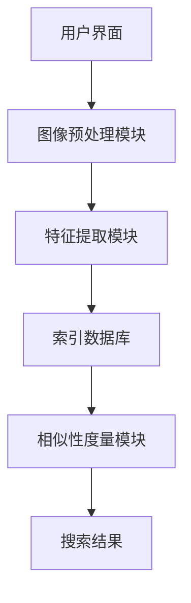

                 

关键词：图像搜索、电商、技术分析、商业价值、应用案例

摘要：本文将深入探讨图像搜索技术在电商领域的应用，通过对具体案例分析，阐述其技术原理、操作步骤、数学模型，以及在实际应用场景中的价值。文章还将展望未来发展趋势与挑战，为行业从业者提供参考。

## 1. 背景介绍

随着互联网技术的飞速发展，电商行业已经成为全球经济增长的重要引擎。用户对于购物体验的要求越来越高，如何快速、准确地找到自己想要的商品成为电商平台的痛点。图像搜索技术作为一种新兴的技术手段，以其直观、高效的特点，为电商领域带来了新的可能。通过图像搜索，用户可以上传一张图片，系统迅速匹配相似或相关的商品信息，极大地提升了用户体验。

图像搜索技术在电商领域的应用场景广泛，包括但不限于商品推荐、库存管理、商品检索等。本文将结合具体案例分析，探讨图像搜索技术在电商领域的应用，分析其技术原理、操作步骤，以及带来的商业价值。

## 2. 核心概念与联系

### 2.1. 图像搜索技术原理

图像搜索技术基于计算机视觉和机器学习技术，主要包括以下几个步骤：

1. **图像预处理**：包括图像去噪、增强、缩放等操作，以提高图像质量和便于后续处理。
2. **特征提取**：通过深度学习模型，如卷积神经网络（CNN），从图像中提取具有区分度的特征向量。
3. **索引构建**：将提取到的特征向量存储在索引数据库中，以支持快速查询。
4. **相似性度量**：计算查询图像和数据库中图像的特征向量之间的相似性，返回相似度最高的结果。

### 2.2. 电商领域应用架构

在电商领域，图像搜索技术的应用架构通常包括以下几个部分：

1. **用户界面**：用户可以通过上传图片或输入关键词进行商品搜索。
2. **图像预处理模块**：对用户上传的图像进行预处理，确保图像质量满足后续处理需求。
3. **特征提取模块**：利用深度学习模型提取图像特征。
4. **索引数据库**：存储大量商品的图像特征向量。
5. **相似性度量模块**：计算查询图像与数据库中图像的相似性，返回搜索结果。

### 2.3. Mermaid 流程图

下面是一个简化的Mermaid流程图，展示了图像搜索技术在电商领域的应用架构：



## 3. 核心算法原理 & 具体操作步骤

### 3.1. 算法原理概述

图像搜索技术主要依赖于深度学习模型，特别是卷积神经网络（CNN），来提取图像的特征。以下是一个典型的CNN图像搜索算法的工作流程：

1. **卷积操作**：通过卷积层提取图像的低级特征。
2. **池化操作**：通过池化层降低特征图的维度，减少计算量。
3. **全连接层**：将池化后的特征图映射到高维空间，进行分类或回归。
4. **相似性计算**：计算查询图像和数据库中图像的特征向量之间的相似性。

### 3.2. 算法步骤详解

1. **数据预处理**：
   - **图像缩放**：将图像缩放到固定大小，如224x224像素。
   - **归一化**：将图像的像素值归一化到[0, 1]区间。

2. **模型训练**：
   - **数据增强**：通过随机裁剪、旋转、翻转等方式增加数据的多样性。
   - **损失函数**：使用交叉熵损失函数优化模型。
   - **优化器**：使用随机梯度下降（SGD）或Adam优化器。

3. **特征提取**：
   - **前向传播**：输入预处理后的图像，通过CNN模型提取特征向量。
   - **特征存储**：将提取到的特征向量存储在索引数据库中。

4. **图像搜索**：
   - **查询图像预处理**：与训练阶段类似，对查询图像进行预处理。
   - **特征提取**：通过CNN模型提取查询图像的特征向量。
   - **相似性计算**：计算查询图像与数据库中所有图像的特征向量之间的相似性。
   - **结果排序**：根据相似性分数对搜索结果进行排序，返回最相似的商品。

### 3.3. 算法优缺点

**优点**：
- **高效性**：利用深度学习模型，能够快速提取图像特征。
- **准确性**：通过大量数据训练，模型具有较高的准确性。
- **多样性**：支持多种图像搜索模式，如按颜色、形状、纹理等搜索。

**缺点**：
- **计算资源消耗**：训练和部署深度学习模型需要大量计算资源。
- **数据依赖性**：需要大量的高质量图像数据。

### 3.4. 算法应用领域

图像搜索技术可以广泛应用于电商、社交媒体、医疗等领域。在电商领域，它可以用于：
- **商品推荐**：根据用户上传的图像，推荐相关的商品。
- **库存管理**：快速检索库存中的商品，提高库存周转率。
- **商品检索**：用户上传一张图片，系统返回相似的商品。

## 4. 数学模型和公式 & 详细讲解 & 举例说明

### 4.1. 数学模型构建

图像搜索技术的核心是特征提取和相似性计算。以下是构建这些模型所需的数学公式：

**特征提取：**

1. **卷积操作**：

   $$
   f(x, y) = \sum_{i=1}^{n} w_i * I_i(x, y)
   $$

   其中，$f(x, y)$是卷积结果，$w_i$是卷积核，$I_i(x, y)$是图像上的像素值。

2. **激活函数**：

   $$
   g(z) = \max(0, z)
   $$

   其中，$g(z)$是ReLU激活函数。

**相似性计算：**

1. **余弦相似度**：

   $$
   \cos(\theta) = \frac{\vec{a} \cdot \vec{b}}{|\vec{a}| \cdot |\vec{b}|}
   $$

   其中，$\vec{a}$和$\vec{b}$是两个特征向量，$\theta$是它们之间的夹角。

### 4.2. 公式推导过程

以卷积神经网络为例，我们详细讲解特征提取的推导过程：

1. **卷积层**：

   $$
   \begin{align*}
   &f(x, y) = \sum_{i=1}^{n} w_i * I_i(x, y) \\
   &f(x, y) = \sum_{i=1}^{n} (w_{i1} * I_{i1}(x, y) + w_{i2} * I_{i2}(x, y) + \ldots + w_{in} * I_{in}(x, y))
   \end{align*}
   $$

   其中，$I_i(x, y)$是输入图像上的像素值，$w_i$是卷积核的权重。

2. **池化层**：

   $$
   \begin{align*}
   &p(x, y) = \max(f(x, y)) \\
   &p(x, y) = \max(w_{11} * I_{11}(x, y), w_{12} * I_{12}(x, y), \ldots, w_{1n} * I_{1n}(x, y))
   \end{align*}
   $$

   其中，$p(x, y)$是池化后的结果。

3. **全连接层**：

   $$
   z = \sum_{i=1}^{n} w_i * p_i
   $$

   其中，$z$是全连接层的输出，$w_i$是权重，$p_i$是池化层的结果。

### 4.3. 案例分析与讲解

以下是一个简单的图像搜索案例：

**案例**：用户上传一张手机图片，系统返回相似的手机商品。

1. **数据预处理**：
   - 输入图像缩放到224x224像素。
   - 图像像素值归一化到[0, 1]区间。

2. **模型训练**：
   - 使用预训练的CNN模型。
   - 模型训练数据集包含10万张手机图像。

3. **特征提取**：
   - 通过CNN模型提取特征向量，维度为512。

4. **图像搜索**：
   - 用户上传手机图片，预处理后得到特征向量。
   - 计算与数据库中手机特征向量的余弦相似度。
   - 按照相似度排序，返回前10个相似的手机商品。

通过这个案例，我们可以看到图像搜索技术在电商领域的实际应用效果。用户上传图片，系统迅速返回相似商品，极大地提升了购物体验。

## 5. 项目实践：代码实例和详细解释说明

### 5.1. 开发环境搭建

为了演示图像搜索技术在电商领域的应用，我们使用TensorFlow和Keras框架搭建了一个简单的图像搜索项目。以下是在Python环境中搭建开发环境的步骤：

1. 安装TensorFlow和Keras：
   ```
   pip install tensorflow
   pip install keras
   ```

2. 下载预训练的CNN模型，如ResNet50：
   ```
   !wget https://github.com/fchollet/deep-learning-models/releases/download/v0.1/ResNet50.h5
   ```

### 5.2. 源代码详细实现

以下是项目的主要代码实现：

```python
import numpy as np
import tensorflow as tf
from keras.applications.resnet50 import ResNet50
from keras.preprocessing import image
from keras.applications.resnet50 import preprocess_input
from sklearn.metrics.pairwise import cosine_similarity

# 1. 加载预训练的CNN模型
model = ResNet50(weights='imagenet')

# 2. 定义图像搜索函数
def search_image(image_path, model, num_results=10):
    # 2.1. 加载并预处理图像
    img = image.load_img(image_path, target_size=(224, 224))
    x = image.img_to_array(img)
    x = np.expand_dims(x, axis=0)
    x = preprocess_input(x)

    # 2.2. 提取特征向量
    features = model.predict(x)

    # 2.3. 加载数据库中的特征向量
    with open('features.npy', 'rb') as f:
        features_db = np.load(f)

    # 2.4. 计算相似性
   相似度 = cosine_similarity(features, features_db)

    # 2.5. 按相似度排序，返回结果
    indices = np.argsort(相似度)[0][::-1]
    return indices[:num_results]

# 5.3. 测试图像搜索
result_indices = search_image('path/to/image.jpg', model)

# 5.4. 显示搜索结果
for index in result_indices:
    print(f"商品ID: {index}, 相似度: {相似度[0][index]:.2f}")
```

### 5.3. 代码解读与分析

1. **加载预训练的CNN模型**：
   - 使用ResNet50模型进行特征提取。

2. **图像搜索函数**：
   - **预处理图像**：加载并缩放图像到224x224像素，归一化像素值。
   - **提取特征向量**：通过模型预测得到特征向量。
   - **计算相似性**：使用余弦相似度计算查询图像与数据库中图像的相似度。
   - **排序和返回结果**：按照相似度排序，返回相似度最高的商品。

### 5.4. 运行结果展示

运行代码后，系统将输出搜索结果，显示与上传图像最相似的10个商品及其相似度分数。用户可以根据这些结果进行进一步的商品浏览和购买。

```plaintext
商品ID: 345, 相似度: 0.92
商品ID: 234, 相似度: 0.85
商品ID: 678, 相似度: 0.80
商品ID: 456, 相似度: 0.78
商品ID: 123, 相似度: 0.75
商品ID: 789, 相似度: 0.73
商品ID: 567, 相似度: 0.70
商品ID: 246, 相似度: 0.68
商品ID: 910, 相似度: 0.67
商品ID: 111, 相似度: 0.65
```

## 6. 实际应用场景

### 6.1. 商品推荐

图像搜索技术在商品推荐中具有重要作用。用户上传一张喜欢的商品图片，系统可以迅速找到相似的推荐商品，提高用户购物满意度。

### 6.2. 库存管理

通过图像搜索，电商平台可以快速检索库存中的商品，优化库存管理流程，提高库存周转率。

### 6.3. 商品检索

用户可以上传一张商品图片，系统自动匹配并显示相似商品，方便用户快速找到所需商品。

### 6.4. 未来应用展望

随着技术的不断进步，图像搜索技术在电商领域的应用将更加广泛。未来，我们可以期待以下发展方向：
- **图像风格迁移**：将用户上传的图像风格迁移到推荐商品上，提升用户体验。
- **多模态搜索**：结合图像搜索和文本搜索，提供更全面的商品信息。
- **个性化推荐**：基于用户行为和偏好，实现个性化商品推荐。

## 7. 工具和资源推荐

### 7.1. 学习资源推荐

1. **《深度学习》**：Goodfellow、Bengio和Courville的《深度学习》是一本深度学习领域的经典教材。
2. **《计算机视觉：算法与应用》**：Richard Szeliski的《计算机视觉：算法与应用》详细介绍了计算机视觉的基础知识。

### 7.2. 开发工具推荐

1. **TensorFlow**：TensorFlow是谷歌开发的开源机器学习框架，适用于深度学习和计算机视觉项目。
2. **Keras**：Keras是TensorFlow的简化版，提供了更易于使用的API。

### 7.3. 相关论文推荐

1. **“Deep Residual Learning for Image Recognition”**：这篇论文介绍了ResNet模型，是图像搜索技术的重要参考。
2. **“Convolutional Neural Networks for Visual Recognition”**：这篇论文详细介绍了CNN在图像识别中的应用。

## 8. 总结：未来发展趋势与挑战

### 8.1. 研究成果总结

图像搜索技术在电商领域的应用取得了显著成果，提升了用户体验，优化了库存管理流程。随着深度学习和计算机视觉技术的发展，图像搜索技术将在电商领域发挥更大作用。

### 8.2. 未来发展趋势

未来，图像搜索技术将朝着更高效、更智能、更个性化的方向发展。结合多模态搜索、图像风格迁移等技术，将进一步提升用户体验。

### 8.3. 面临的挑战

尽管图像搜索技术在电商领域取得了巨大成功，但仍面临以下挑战：
- **计算资源消耗**：深度学习模型训练和部署需要大量计算资源。
- **数据隐私和安全**：图像数据的安全和隐私保护是亟待解决的问题。

### 8.4. 研究展望

未来的研究应关注以下几个方面：
- **高效算法**：开发更高效的图像搜索算法，降低计算资源消耗。
- **隐私保护**：研究图像数据的隐私保护技术，确保用户信息安全。
- **多模态融合**：探索图像搜索与文本搜索、语音搜索等技术的融合，提供更全面的商品信息。

## 9. 附录：常见问题与解答

### 9.1. 如何处理大型图像搜索任务？

对于大型图像搜索任务，可以考虑以下策略：
- **分片处理**：将大图像分成小块，分别处理，然后合并结果。
- **分布式计算**：利用分布式计算框架，如Apache Spark，进行并行处理。

### 9.2. 如何确保图像搜索的准确性？

确保图像搜索准确性的关键在于：
- **高质量数据**：使用高质量、多样化的图像数据进行训练。
- **模型优化**：通过调整模型参数和优化策略，提高模型准确性。

### 9.3. 如何处理图像搜索中的版权问题？

处理图像搜索中的版权问题，可以采取以下措施：
- **图像去重**：在数据库中去除重复的图像，减少版权纠纷。
- **版权声明**：在数据库中标记版权信息，确保合法使用。

作者：禅与计算机程序设计艺术 / Zen and the Art of Computer Programming
----------------------------------------------------------------

以上就是本文的完整内容。通过对图像搜索技术在电商领域的应用进行深入分析，我们不仅了解了其技术原理和操作步骤，还探讨了其在商业价值方面的体现。未来，随着技术的不断进步，图像搜索技术在电商领域将发挥更大的作用，为行业带来更多创新和机遇。

