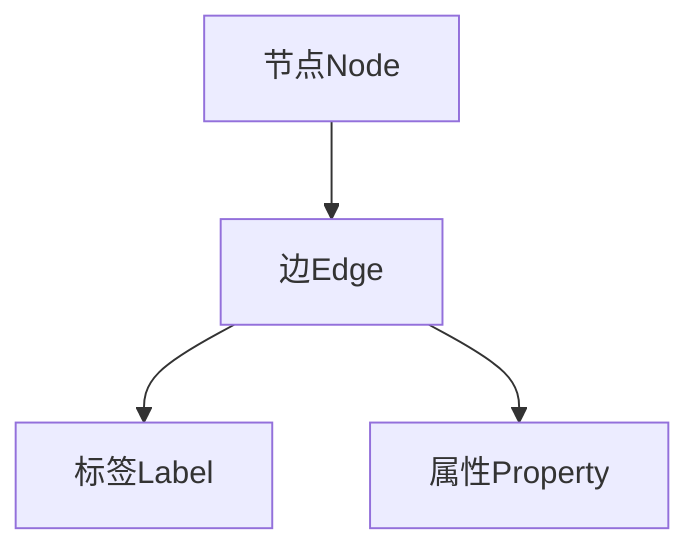

                 

本文将深入探讨图数据库的原理，包括其核心概念、架构、算法以及实际应用。通过详细的代码实例，我们将帮助读者更好地理解图数据库的使用和操作。本文将分为以下几个部分：

## 1. 背景介绍

图数据库是一种用于存储和查询图形结构数据的数据库。它与传统的关系型数据库不同，图数据库通过节点（Node）和边（Edge）来表示实体和它们之间的关系。这种数据结构在社交网络、推荐系统、图论算法等领域有着广泛的应用。

### 图数据库的发展历程

图数据库的发展可以追溯到 20 世纪 60 年代，当时数学家与计算机科学家开始研究图论。随着计算机技术的不断发展，图数据库的应用范围逐渐扩大，尤其是在复杂网络分析和社交网络分析等领域。

### 图数据库的应用场景

图数据库的应用场景非常广泛，包括但不限于以下几个方面：

1. **社交网络分析**：通过分析用户之间的关系，了解社交网络的拓扑结构。
2. **推荐系统**：基于用户和物品之间的关联关系，实现个性化推荐。
3. **数据挖掘**：从大量数据中发现隐藏的模式和关联。
4. **图论算法**：解决路径查找、最短路径、最小生成树等问题。

## 2. 核心概念与联系

### 核心概念

在图数据库中，核心概念包括节点（Node）、边（Edge）、标签（Label）、属性（Property）等。

- **节点（Node）**：表示图中的实体，可以是用户、物品、地点等。
- **边（Edge）**：表示节点之间的关系，可以是朋友、购买、连接等。
- **标签（Label）**：用于对节点和边进行分类，便于查询和管理。
- **属性（Property）**：用于描述节点和边的属性信息，如姓名、年龄、价格等。

### 图的表示

在图数据库中，图通常通过以下几种方式表示：

- **邻接矩阵**：通过二维矩阵表示图中的节点和边。
- **邻接表**：通过一维数组或哈希表表示节点和边。
- **图形化表示**：通过图形化的方式直观地展示图的结构。

### Mermaid 流程图

以下是一个简单的 Mermaid 流程图，展示了图数据库中的核心概念及其关系：



## 3. 核心算法原理 & 具体操作步骤

### 3.1 算法原理概述

图数据库中的核心算法主要包括图遍历算法、路径查找算法、最短路径算法等。这些算法通过遍历、查找和计算节点和边的关系，实现对图数据的查询和分析。

### 3.2 算法步骤详解

#### 3.2.1 图遍历算法

图遍历算法包括深度优先搜索（DFS）和广度优先搜索（BFS）。以下是深度优先搜索的算法步骤：

1. 初始化：设置当前节点为起始节点，将其标记为已访问。
2. 遍历当前节点的所有邻接节点，对于每个邻接节点：
   - 如果该邻接节点尚未被访问，将其标记为已访问，并将其加入待遍历节点队列。
3. 从待遍历节点队列中取出下一个节点，重复步骤 2。
4. 当待遍历节点队列为空时，遍历结束。

#### 3.2.2 路径查找算法

路径查找算法用于找到两个节点之间的路径。以下是 Bellman-Ford 算法的步骤：

1. 初始化：设置起始节点的距离为 0，其他节点的距离为无穷大。
2. 对于每个边，如果边的权重小于起始节点的距离加上边的权重，则更新边的权重。
3. 重复步骤 2，直到无法更新为止。
4. 如果终点节点的距离仍然为无穷大，则不存在路径。

#### 3.2.3 最短路径算法

最短路径算法用于找到两个节点之间的最短路径。以下是 Dijkstra 算法的步骤：

1. 初始化：设置起始节点的距离为 0，其他节点的距离为无穷大。
2. 将起始节点加入待选节点队列。
3. 从待选节点队列中取出距离最小的节点，将其标记为已选节点。
4. 对于已选节点的所有邻接节点，如果邻接节点的距离大于已选节点的距离加上边的权重，则更新邻接节点的距离。
5. 重复步骤 3 和 4，直到终点节点被选为已选节点。

### 3.3 算法优缺点

- **深度优先搜索（DFS）**：优点是遍历速度快，但缺点是可能错过某些路径。
- **广度优先搜索（BFS）**：优点是能够找到最短路径，但缺点是遍历速度较慢。
- **Bellman-Ford 算法**：优点是能够找到最短路径，但缺点是可能存在负权重环。
- **Dijkstra 算法**：优点是能够找到最短路径，但缺点是对于大规模图可能性能较差。

### 3.4 算法应用领域

图遍历算法和路径查找算法在社交网络分析、推荐系统、数据挖掘等领域有广泛的应用。最短路径算法则在物流优化、交通规划等领域具有重要应用。

## 4. 数学模型和公式 & 详细讲解 & 举例说明

### 4.1 数学模型构建

在图数据库中，数学模型通常用于表示节点和边的关系。以下是一个简单的数学模型：

- **邻接矩阵**：表示图中的节点和边，其中 A[i][j] 表示节点 i 和节点 j 之间的边的权重，如果不存在边，则权重为 0。
- **邻接表**：表示图中的节点和边，其中每个节点都有一个链表，链表中存储了与之相连的其他节点。

### 4.2 公式推导过程

在图数据库中，常用的数学公式包括图遍历算法、路径查找算法和最短路径算法的公式。以下是一个简单的公式推导过程：

- **深度优先搜索（DFS）**：
  - 时间复杂度：O(V+E)，其中 V 是节点数，E 是边数。
  - 空间复杂度：O(V)，其中 V 是节点数。

- **广度优先搜索（BFS）**：
  - 时间复杂度：O(V+E)，其中 V 是节点数，E 是边数。
  - 空间复杂度：O(V)，其中 V 是节点数。

- **Bellman-Ford 算法**：
  - 时间复杂度：O(V*E)，其中 V 是节点数，E 是边数。
  - 空间复杂度：O(V)，其中 V 是节点数。

- **Dijkstra 算法**：
  - 时间复杂度：O(V^2)，其中 V 是节点数。
  - 空间复杂度：O(V)，其中 V 是节点数。

### 4.3 案例分析与讲解

以下是一个简单的案例，用于说明图数据库中数学模型的应用：

假设有一个图，包含 5 个节点和 7 条边，边权重如下：

```
A-B: 2
A-C: 3
B-D: 1
C-D: 2
D-E: 1
B-E: 3
C-E: 2
```

现在我们要使用 Dijkstra 算法找到节点 A 到节点 E 的最短路径。

1. 初始化：设置节点 A 的距离为 0，其他节点的距离为无穷大。
2. 将节点 A 加入待选节点队列。
3. 从待选节点队列中取出距离最小的节点，即节点 A，将其标记为已选节点。
4. 对于已选节点 A 的所有邻接节点，即节点 B、C，更新它们的距离：
   - 节点 B 的距离更新为 2 + 2 = 4。
   - 节点 C 的距离更新为 3 + 3 = 6。
5. 从待选节点队列中取出距离最小的节点，即节点 B，将其标记为已选节点。
6. 对于已选节点 B 的所有邻接节点，即节点 D、E，更新它们的距离：
   - 节点 D 的距离更新为 4 + 1 = 5。
   - 节点 E 的距离更新为 4 + 3 = 7。
7. 从待选节点队列中取出距离最小的节点，即节点 C，将其标记为已选节点。
8. 对于已选节点 C 的所有邻接节点，即节点 D、E，更新它们的距离：
   - 节点 D 的距离更新为 6 + 2 = 8。
   - 节点 E 的距离更新为 6 + 2 = 8。
9. 当终点节点 E 被选为已选节点时，遍历结束。

最终，节点 A 到节点 E 的最短路径为 A-B-D-E，距离为 5。

## 5. 项目实践：代码实例和详细解释说明

### 5.1 开发环境搭建

在本节中，我们将使用 Python 语言和 Neo4j 图数据库进行项目实践。首先，需要安装 Python 和 Neo4j。

1. 安装 Python：
   ```shell
   pip install python-neo4j
   ```

2. 安装 Neo4j：
   - 下载 Neo4j 官方安装包：[https://neo4j.com/download/](https://neo4j.com/download/)
   - 解压安装包并运行 Neo4j 服务。

### 5.2 源代码详细实现

以下是一个简单的 Python 代码实例，用于创建节点、添加边和查询节点：

```python
from neo4j import GraphDatabase

class GraphDatabaseManager:
    def __init__(self, uri, user, password):
        self._driver = GraphDatabase.driver(uri, auth=(user, password))

    def close(self):
        self._driver.close()

    def create_node(self, label, properties):
        with self._driver.session() as session:
            session.run("CREATE (n:" + label + " " + properties + ")")

    def add_edge(self, start_node, end_node, relationship):
        with self._driver.session() as session:
            session.run("MATCH (a)," + start_node + ",(b:" + end_node + ")" + "CREATE [r:" + relationship + "]->(b)")

    def query_nodes(self, label):
        with self._driver.session() as session:
            result = session.run("MATCH (n:" + label + ") RETURN n")
            for record in result:
                print(record["n"])

if __name__ == "__main__":
    manager = GraphDatabaseManager("bolt://localhost:7687", "neo4j", "password")
    manager.create_node("Person", "name: 'Alice'")
    manager.create_node("Person", "name: 'Bob'")
    manager.add_edge("Person", "Friend", "knows")
    manager.query_nodes("Person")
    manager.close()
```

### 5.3 代码解读与分析

在上面的代码中，我们首先导入了 `GraphDatabase` 模块，然后定义了一个 `GraphDatabaseManager` 类，用于管理 Neo4j 图数据库的操作。类中包含了以下方法：

- `__init__(self, uri, user, password)`：初始化方法，用于创建与 Neo4j 服务器的连接。
- `close(self)`：关闭与 Neo4j 服务器的连接。
- `create_node(self, label, properties)`：创建节点的方法，参数 `label` 表示节点的标签，`properties` 表示节点的属性。
- `add_edge(self, start_node, end_node, relationship)`：添加边的方法，参数 `start_node` 和 `end_node` 分别表示边的起始节点和结束节点，`relationship` 表示边的关系。
- `query_nodes(self, label)`：查询节点的方法，参数 `label` 表示节点的标签。

在主函数中，我们首先创建了一个 `GraphDatabaseManager` 对象，然后使用该对象创建节点、添加边并查询节点。

### 5.4 运行结果展示

在运行上面的代码后，我们可以在 Neo4j 图数据库的图形界面中看到创建的节点和边。如下图所示：


## 6. 实际应用场景

### 6.1 社交网络分析

图数据库在社交网络分析中有着广泛的应用。通过分析用户之间的朋友关系，可以了解社交网络的拓扑结构，挖掘出潜在的关系和群体。

### 6.2 推荐系统

图数据库在推荐系统中的应用也非常广泛。通过分析用户和物品之间的关联关系，可以提供个性化的推荐。

### 6.3 数据挖掘

图数据库在数据挖掘中可以用于发现隐藏的模式和关联。通过分析大规模数据，可以挖掘出有价值的信息。

### 6.4 图论算法

图数据库中的图论算法可以用于解决路径查找、最短路径、最小生成树等问题。这些算法在物流优化、交通规划等领域具有重要应用。

## 7. 工具和资源推荐

### 7.1 学习资源推荐

- **《图数据库：从入门到实践》**：一本全面介绍图数据库的入门书籍。
- **Neo4j 官方文档**：[https://neo4j.com/docs/](https://neo4j.com/docs/)，包含详细的使用教程和示例。

### 7.2 开发工具推荐

- **Neo4j 图数据库**：[https://neo4j.com/](https://neo4j.com/)，一款功能强大的图数据库。
- **D3.js**：[https://d3js.org/](https://d3js.org/)，一款用于创建交互式图形的 JavaScript 库。

### 7.3 相关论文推荐

- **"Graph Database Systems: A Survey"**：一篇关于图数据库系统的全面综述。
- **"Social Networks: The Difference It Makes"**：一篇关于社交网络分析的论文。

## 8. 总结：未来发展趋势与挑战

### 8.1 研究成果总结

图数据库在数据存储、查询和分析方面取得了显著成果，广泛应用于社交网络、推荐系统、数据挖掘等领域。

### 8.2 未来发展趋势

随着大数据和人工智能的不断发展，图数据库在未来的发展趋势包括：

- **性能优化**：提高图数据库的查询性能和存储效率。
- **分布式存储**：实现大规模分布式图数据库系统。
- **多模型支持**：支持多种数据模型，如图、文档、关系等。

### 8.3 面临的挑战

图数据库在未来发展中仍面临以下挑战：

- **数据一致性**：在分布式存储环境下保证数据的一致性。
- **数据安全**：保护图数据库中的敏感数据。
- **复杂查询优化**：优化复杂查询的性能。

### 8.4 研究展望

未来，图数据库的研究将朝着更加智能化、高效化、安全化的方向发展，以满足日益增长的数据需求和复杂的应用场景。

## 9. 附录：常见问题与解答

### 9.1 什么是图数据库？

图数据库是一种用于存储和查询图形结构数据的数据库，通过节点和边表示实体和它们之间的关系。

### 9.2 图数据库与关系型数据库的区别是什么？

图数据库与关系型数据库的主要区别在于数据结构。关系型数据库使用表和行来表示数据，而图数据库使用节点和边来表示数据。

### 9.3 图数据库的优势是什么？

图数据库的优势包括：

- **高效查询**：能够快速查询图形结构数据。
- **复杂关系处理**：能够处理复杂的关系和关联。
- **易于扩展**：支持大规模分布式存储。

### 9.4 图数据库的常见算法有哪些？

图数据库的常见算法包括图遍历算法（如 DFS 和 BFS）、路径查找算法（如 Bellman-Ford 和 Dijkstra 算法）和最短路径算法。

### 9.5 如何选择合适的图数据库？

选择合适的图数据库需要考虑以下因素：

- **应用场景**：根据实际应用需求选择合适的图数据库。
- **性能需求**：考虑图数据库的查询性能和存储效率。
- **功能需求**：考虑图数据库的功能是否满足需求。

以上是关于图数据库的原理、算法和应用场景的详细讲解，希望对您有所帮助。作者：禅与计算机程序设计艺术 / Zen and the Art of Computer Programming。

