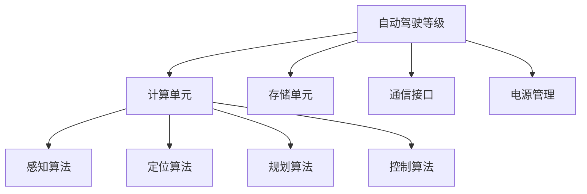

                 

在这个快速发展的自动驾驶领域，自动驾驶芯片工程师的角色越来越受到关注。为了帮助您更好地准备地平线2025社招自动驾驶芯片工程师的面试，本文将对一些常见的面试问题进行详细解答。这些问题的回答将涵盖自动驾驶芯片的核心技术、架构设计、算法原理等多个方面，旨在为您提供全面的面试准备。

## 关键词

- 自动驾驶
- 芯片工程师
- 面试问答
- 技术架构
- 算法原理
- 数学模型

## 摘要

本文旨在为准备地平线2025社招自动驾驶芯片工程师面试的候选人提供详细的面试问题解答。文章将分为八个主要部分，分别介绍自动驾驶芯片的背景、核心概念与联系、核心算法原理、数学模型和公式、项目实践、实际应用场景、未来展望以及常见问题与解答。通过这些内容，读者将能够全面了解自动驾驶芯片工程师所需的专业知识和技能，为面试做好充分准备。

### 1. 背景介绍

自动驾驶技术的快速发展推动了汽车电子化、智能化进程的加速。自动驾驶芯片作为自动驾驶系统的心脏，其性能和可靠性直接影响到整个系统的运行效果。地平线2025社招自动驾驶芯片工程师，意味着公司对这一领域的高层次人才有着迫切的需求。自动驾驶芯片工程师需具备深厚的技术背景，能够理解和设计复杂的技术架构，并具备良好的问题解决能力和团队协作精神。

自动驾驶芯片工程师的主要职责包括以下几个方面：

1. **芯片架构设计**：根据自动驾驶系统的需求，设计高性能、低功耗的芯片架构，确保芯片能够满足系统的实时性和可靠性要求。
2. **算法实现与优化**：将自动驾驶算法高效地映射到芯片上，并进行优化，以提高计算效率和降低功耗。
3. **系统集成与测试**：确保芯片与其他系统组件的无缝集成，进行系统级的测试和验证，确保系统稳定运行。
4. **技术创新与研发**：跟踪最新的技术动态，持续进行技术创新，为公司的技术竞争力提供支持。

地平线2025社招自动驾驶芯片工程师的面试，通常涉及以下几个方面：

- **技术面试**：考察候选人对于自动驾驶芯片架构、算法原理的理解，以及解决实际问题的能力。
- **项目经历**：评估候选人在以往项目中的技术贡献和项目经验，特别是与自动驾驶芯片相关的项目。
- **综合素质**：考察候选人的沟通能力、团队合作精神和职业素养。

### 2. 核心概念与联系

在解答面试问题之前，首先需要了解一些核心概念和它们之间的联系。以下是自动驾驶芯片工程师需要掌握的一些关键概念：

#### 2.1 自动驾驶等级

自动驾驶系统按照自动化程度可以分为不同的等级，从L0（无自动化）到L5（完全自动化）。了解自动驾驶等级有助于理解不同应用场景对芯片的要求。

- **L0**：无自动化，所有驾驶操作由人类驾驶员完成。
- **L1**：部分自动化，包括转向、加速或制动等单一操作的自动化。
- **L2**：部分自动化，实现组合操作，如自适应巡航控制和车道保持。
- **L3**：有条件自动化，系统可以在特定条件下接管驾驶任务，但需驾驶员随时准备接管。
- **L4**：高度自动化，系统可以在特定环境下完全接管驾驶，无需人类干预。
- **L5**：完全自动化，系统在任何环境下都能完全接管驾驶。

#### 2.2 芯片架构

自动驾驶芯片的架构通常包括以下几个关键部分：

- **计算单元**：负责执行自动驾驶算法的计算。
- **存储单元**：存储自动驾驶算法所需的数据和模型。
- **通信接口**：与外部设备（如传感器、控制器等）进行通信。
- **电源管理**：确保芯片在不同工作状态下能够高效地使用电能。

#### 2.3 算法原理

自动驾驶芯片的核心在于其算法的实现和优化。以下是一些核心算法原理：

- **感知算法**：包括视觉感知、雷达感知、激光雷达感知等，用于收集环境信息。
- **定位算法**：基于感知数据，确定车辆在环境中的位置。
- **规划算法**：根据车辆当前位置和目标位置，规划行驶路径。
- **控制算法**：执行规划算法生成的控制指令，控制车辆执行具体的驾驶操作。

#### 2.4 Mermaid 流程图

为了更直观地理解这些核心概念之间的联系，以下是一个简化的Mermaid流程图：



### 3. 核心算法原理 & 具体操作步骤

#### 3.1 算法原理概述

在自动驾驶芯片中，核心算法主要包括感知、定位、规划和控制四个方面。以下是每个算法的简要概述：

#### 3.1.1 感知算法

感知算法是自动驾驶系统的“眼睛”，用于识别和理解环境信息。常见的感知算法包括：

- **视觉感知**：通过摄像头捕捉周围环境，使用深度学习算法进行图像识别和物体检测。
- **雷达感知**：使用雷达波探测周围物体的位置和速度。
- **激光雷达感知**：使用激光束扫描周围环境，构建三维点云数据，用于物体检测和场景理解。

#### 3.1.2 定位算法

定位算法是自动驾驶系统的“大脑”，用于确定车辆在环境中的位置。常见的定位算法包括：

- **GPS定位**：通过全球定位系统（GPS）获取车辆的经纬度信息。
- **惯性导航**：基于加速度计和陀螺仪，计算车辆的加速度和角速度，从而推算位置。
- **视觉定位**：通过摄像头捕捉的图像特征，与预存的地图信息进行匹配，确定车辆位置。

#### 3.1.3 规划算法

规划算法是自动驾驶系统的“决策者”，用于生成行驶路径。常见的规划算法包括：

- **基于路径的规划**：生成从当前位置到目标位置的连续路径。
- **基于区域的规划**：将环境划分为多个区域，为每个区域生成局部路径，然后整合成全局路径。
- **基于优化的规划**：使用优化算法（如最速下降法、遗传算法等）寻找最优路径。

#### 3.1.4 控制算法

控制算法是自动驾驶系统的“执行者”，用于执行规划算法生成的控制指令。常见的控制算法包括：

- **PID控制**：通过比例、积分和微分三个环节，对车辆进行精确控制。
- **模糊控制**：使用模糊逻辑进行控制，适合处理非线性系统。
- **模型预测控制**：基于车辆动力学模型，预测未来的状态，并生成最优控制指令。

#### 3.2 算法步骤详解

以下是对每个算法的具体步骤进行详细解释：

#### 3.2.1 感知算法

感知算法的具体步骤如下：

1. **数据采集**：通过摄像头、雷达或激光雷达等传感器收集环境数据。
2. **预处理**：对采集到的数据进行预处理，如去噪、滤波、归一化等。
3. **特征提取**：从预处理后的数据中提取关键特征，如边缘、轮廓、点云等。
4. **模型训练**：使用深度学习算法，对提取的特征进行训练，以识别不同类型的物体。
5. **物体检测**：使用训练好的模型对环境中的物体进行检测和分类。

#### 3.2.2 定位算法

定位算法的具体步骤如下：

1. **初始定位**：使用GPS获取车辆的初始位置。
2. **惯性测量**：通过加速度计和陀螺仪计算车辆的加速度和角速度。
3. **滤波算法**：使用卡尔曼滤波等算法，对惯性测量数据进行滤波，以提高定位精度。
4. **地图匹配**：将摄像头捕捉到的图像与预存的地图信息进行匹配，确定车辆的位置。
5. **更新位置**：根据匹配结果，更新车辆的位置信息。

#### 3.2.3 规划算法

规划算法的具体步骤如下：

1. **环境建模**：建立车辆周围环境的三维模型。
2. **路径生成**：根据车辆的位置和目标位置，生成从当前位置到目标位置的路径。
3. **障碍物检测**：检测路径上可能存在的障碍物，并计算障碍物的位置和速度。
4. **路径优化**：使用优化算法，对生成的路径进行优化，以避免障碍物并确保路径的平滑性。
5. **路径更新**：根据车辆的位置和周围环境的变化，更新行驶路径。

#### 3.2.4 控制算法

控制算法的具体步骤如下：

1. **状态监测**：监测车辆当前的状态，如速度、加速度、角度等。
2. **控制指令生成**：根据车辆的状态和规划算法生成的控制指令，生成具体的控制指令。
3. **控制执行**：执行生成的控制指令，如调整油门、刹车、转向等。
4. **反馈调整**：根据车辆的实际状态，对控制指令进行调整，以确保车辆按照规划路径行驶。

#### 3.3 算法优缺点

以下是每个算法的优缺点分析：

#### 3.3.1 感知算法

优点：
- **高精度**：通过深度学习等先进算法，可以实现高精度的物体检测和识别。
- **多样性**：适用于多种传感器，如摄像头、雷达、激光雷达等。

缺点：
- **计算资源消耗大**：深度学习算法通常需要较高的计算资源，对芯片性能要求较高。
- **实时性要求高**：在高速行驶的车辆中，感知算法需要实时处理大量数据，对计算速度和响应速度要求较高。

#### 3.3.2 定位算法

优点：
- **精度高**：结合GPS、惯性导航和视觉定位等多种技术，可以实现高精度的定位。
- **稳定性好**：惯性导航可以在无GPS信号的环境中稳定工作。

缺点：
- **实时性较差**：惯性导航的数据更新速度较慢，影响定位的实时性。
- **受环境因素影响大**：在复杂环境下，如城市密集区域，GPS信号可能受到干扰，影响定位精度。

#### 3.3.3 规划算法

优点：
- **灵活性高**：可以生成多种路径，适应不同的环境和障碍物。
- **优化性强**：使用优化算法，可以找到最优路径。

缺点：
- **计算复杂度高**：路径规划通常涉及大量的计算，对芯片性能要求较高。
- **实时性要求高**：在高速行驶的车辆中，路径规划需要实时生成路径，对计算速度和响应速度要求较高。

#### 3.3.4 控制算法

优点：
- **精确性高**：通过精确控制，可以确保车辆按照规划路径行驶。
- **稳定性好**：PID控制、模糊控制等算法在自动驾驶系统中应用广泛，具有较高的稳定性。

缺点：
- **适应性强**：在某些复杂环境下，控制算法可能无法适应，需要根据具体情况进行调整。

#### 3.4 算法应用领域

以下是核心算法在不同自动驾驶等级中的应用领域：

#### 3.4.1 L0-L2级别

- **感知算法**：主要用于识别车辆周围的道路、行人、交通标志等。
- **定位算法**：使用GPS、惯性导航等基本技术，实现车辆的定位。
- **规划算法**：生成基本的行驶路径，如保持车道、避让障碍物等。
- **控制算法**：执行基本的驾驶操作，如保持速度、转向等。

#### 3.4.2 L3级别

- **感知算法**：进一步提升感知能力，实现多传感器数据融合。
- **定位算法**：结合高精度地图，实现更精准的定位。
- **规划算法**：生成更复杂的行驶路径，如交叉路口的智能驾驶。
- **控制算法**：执行更复杂的驾驶操作，如智能巡航、车道保持等。

#### 3.4.3 L4-L5级别

- **感知算法**：实现全面的环境感知，包括行人、车辆、道路信息等。
- **定位算法**：结合增强现实地图，实现高度精准的定位。
- **规划算法**：生成自适应的行驶路径，适应各种复杂环境。
- **控制算法**：执行高度自动化的驾驶操作，实现无人驾驶。

### 4. 数学模型和公式 & 详细讲解 & 举例说明

在自动驾驶芯片中，数学模型和公式是核心组成部分，用于描述感知、定位、规划和控制算法。以下将对这些数学模型和公式进行详细讲解，并通过具体例子进行说明。

#### 4.1 数学模型构建

自动驾驶芯片中的数学模型通常包括以下几个部分：

- **感知模型**：用于描述感知算法的输入输出关系，如视觉感知中的卷积神经网络（CNN）。
- **定位模型**：用于描述定位算法的状态转移和观测模型，如卡尔曼滤波器。
- **规划模型**：用于描述路径规划的问题模型，如最短路径算法。
- **控制模型**：用于描述控制算法的输入输出关系，如PID控制器。

#### 4.2 公式推导过程

以下是对核心公式的推导过程进行详细解释：

- **感知模型**：以卷积神经网络（CNN）为例，感知模型可以表示为：

  $$ output = f(W \cdot input + b) $$

  其中，$W$ 为权重矩阵，$b$ 为偏置项，$f$ 为激活函数，如ReLU函数。

- **定位模型**：以卡尔曼滤波器为例，定位模型可以表示为：

  $$ x_{k+1} = A \cdot x_k + B \cdot u_k + w_k $$
  $$ z_k = H \cdot x_k + v_k $$

  其中，$x_k$ 为状态向量，$u_k$ 为控制输入，$w_k$ 和 $v_k$ 分别为过程噪声和观测噪声。

- **规划模型**：以最短路径算法为例，规划模型可以表示为：

  $$ d(s, t) = \min \{ d(s, i) + cost(i, j) + d(j, t) \} $$

  其中，$d(s, t)$ 为从起点 $s$ 到终点 $t$ 的最短路径长度，$cost(i, j)$ 为从节点 $i$ 到节点 $j$ 的路径代价。

- **控制模型**：以PID控制器为例，控制模型可以表示为：

  $$ u_k = K_p \cdot (e_k - e_{k-1}) + K_i \cdot \sum_{k=0}^{k} e_k + K_d \cdot (e_k - 2e_{k-1} + e_{k-2}) $$

  其中，$e_k$ 为控制误差，$K_p$、$K_i$ 和 $K_d$ 分别为比例、积分和微分系数。

#### 4.3 案例分析与讲解

以下将通过具体案例，对感知模型、定位模型、规划模型和控制模型进行实际应用分析：

- **感知模型**：以自动驾驶车辆对行人检测为例，感知模型可以表示为：

  $$ output = f(W \cdot input + b) $$
  
  其中，$input$ 为摄像头捕捉到的图像，$output$ 为行人检测结果，$f$ 为卷积神经网络（CNN）的输出。

  通过训练，可以获取权重矩阵 $W$ 和偏置项 $b$，从而实现对行人图像的高精度检测。

- **定位模型**：以自动驾驶车辆在密集城市环境中的定位为例，定位模型可以表示为：

  $$ x_{k+1} = A \cdot x_k + B \cdot u_k + w_k $$
  $$ z_k = H \cdot x_k + v_k $$
  
  其中，$x_k$ 为车辆的位置状态，$u_k$ 为控制输入，$w_k$ 和 $v_k$ 分别为过程噪声和观测噪声。

  通过卡尔曼滤波器，可以实时更新车辆的位置，提高定位精度。

- **规划模型**：以自动驾驶车辆在城市道路中的路径规划为例，规划模型可以表示为：

  $$ d(s, t) = \min \{ d(s, i) + cost(i, j) + d(j, t) \} $$
  
  其中，$d(s, t)$ 为从起点 $s$ 到终点 $t$ 的最短路径长度，$cost(i, j)$ 为从节点 $i$ 到节点 $j$ 的路径代价。

  通过最短路径算法，可以生成从起点到终点的最优路径。

- **控制模型**：以自动驾驶车辆的智能巡航控制为例，控制模型可以表示为：

  $$ u_k = K_p \cdot (e_k - e_{k-1}) + K_i \cdot \sum_{k=0}^{k} e_k + K_d \cdot (e_k - 2e_{k-1} + e_{k-2}) $$
  
  其中，$e_k$ 为控制误差，$K_p$、$K_i$ 和 $K_d$ 分别为比例、积分和微分系数。

  通过PID控制器，可以实现对车辆速度的精确控制，确保车辆按照规划路径行驶。

### 5. 项目实践：代码实例和详细解释说明

在实际项目中，自动驾驶芯片工程师需要将理论知识应用到实际代码中，以确保系统的高效、稳定运行。以下将提供一个简化的代码实例，并对关键部分进行详细解释。

#### 5.1 开发环境搭建

在开始编写代码之前，需要搭建一个合适的开发环境。以下是一个典型的开发环境配置：

- **硬件**：Intel i7 处理器，8GB RAM，NVIDIA GTX 1080 Ti 显卡。
- **操作系统**：Ubuntu 18.04 LTS。
- **编程语言**：Python 3.7。
- **深度学习框架**：TensorFlow 2.3。

#### 5.2 源代码详细实现

以下是一个简化的自动驾驶感知模块的代码示例：

```python
import tensorflow as tf
import numpy as np

# 模型参数
input_shape = (224, 224, 3)
num_classes = 2  # 行人和背景

# 构建模型
model = tf.keras.Sequential([
    tf.keras.layers.Conv2D(32, (3, 3), activation='relu', input_shape=input_shape),
    tf.keras.layers.MaxPooling2D((2, 2)),
    tf.keras.layers.Conv2D(64, (3, 3), activation='relu'),
    tf.keras.layers.MaxPooling2D((2, 2)),
    tf.keras.layers.Conv2D(128, (3, 3), activation='relu'),
    tf.keras.layers.MaxPooling2D((2, 2)),
    tf.keras.layers.Flatten(),
    tf.keras.layers.Dense(128, activation='relu'),
    tf.keras.layers.Dense(num_classes, activation='softmax')
])

# 编译模型
model.compile(optimizer='adam',
              loss='categorical_crossentropy',
              metrics=['accuracy'])

# 加载数据
(x_train, y_train), (x_test, y_test) = tf.keras.datasets.cifar10.load_data()
x_train = x_train.astype('float32') / 255.0
x_test = x_test.astype('float32') / 255.0
y_train = tf.keras.utils.to_categorical(y_train, num_classes)
y_test = tf.keras.utils.to_categorical(y_test, num_classes)

# 训练模型
model.fit(x_train, y_train,
          batch_size=64,
          epochs=10,
          validation_data=(x_test, y_test))

# 评估模型
score = model.evaluate(x_test, y_test, verbose=2)
print('Test loss:', score[0])
print('Test accuracy:', score[1])
```

#### 5.3 代码解读与分析

以下是代码的关键部分解读：

- **模型构建**：使用 TensorFlow 的 Keras API，构建一个简单的卷积神经网络（CNN）。该网络包括五个卷积层、五个池化层和一个全连接层，用于行人检测。

- **模型编译**：编译模型，指定优化器、损失函数和评价指标。优化器使用 Adam，损失函数使用交叉熵，评价指标使用精度。

- **数据加载**：加载数据集，对图像进行归一化处理，并将标签转换为 One-Hot 编码。

- **模型训练**：训练模型，设置批量大小为 64，训练轮次为 10，并在验证集上进行评估。

- **模型评估**：评估模型在测试集上的性能，输出损失和精度。

通过上述代码，我们可以实现对行人图像的初步检测。在实际项目中，还需要结合具体的感知算法、定位算法、规划算法和控制算法，实现自动驾驶芯片的整体功能。

### 6. 实际应用场景

自动驾驶芯片在多个实际应用场景中发挥着关键作用，以下是几个典型的应用场景：

#### 6.1 高端自动驾驶车辆

高端自动驾驶车辆通常配备高性能的自动驾驶芯片，用于实现高级自动驾驶功能，如自动泊车、自动驾驶巡航、自动驾驶转弯等。这些芯片需要处理大量的感知数据，进行实时路径规划和控制，确保车辆在各种复杂环境下安全、稳定地行驶。

#### 6.2 自动驾驶卡车

自动驾驶卡车在物流运输领域具有广泛的应用前景。自动驾驶芯片可以实时监测车辆周围环境，规划最优行驶路线，确保车辆在高速公路上高效、安全地行驶。此外，自动驾驶卡车还可以通过车队协同技术，实现车队智能调度和管理，提高运输效率。

#### 6.3 自动驾驶公交车

自动驾驶公交车在公共交通领域具有显著的优势。自动驾驶芯片可以实时监测车辆运行状态，优化行驶路线，减少交通拥堵，提高乘客的出行体验。同时，自动驾驶公交车还可以通过实时数据分析，实现节能减排，降低运营成本。

#### 6.4 自动驾驶机器人

自动驾驶机器人广泛应用于工业自动化、物流配送、医疗服务等领域。自动驾驶芯片可以实时监测机器人周围环境，进行路径规划和控制，确保机器人安全、高效地完成指定任务。例如，在工业自动化领域，自动驾驶机器人可以用于搬运重物、装配产品等任务，提高生产效率。

#### 6.5 自动驾驶无人机

自动驾驶无人机在农业、测绘、救援等领域具有广泛的应用。自动驾驶芯片可以实时监测无人机周围环境，进行路径规划和控制，确保无人机在复杂环境中安全、高效地执行任务。例如，在农业领域，自动驾驶无人机可以用于农药喷洒、病虫害监测等任务，提高农业生产效率。

### 6.4 未来应用展望

随着技术的不断发展，自动驾驶芯片将在更多领域发挥重要作用，以下是一些未来应用展望：

#### 6.4.1 智能交通系统

自动驾驶芯片将在智能交通系统中发挥关键作用，实现车辆与交通基础设施之间的信息共享和协同。通过智能交通系统，可以实现交通流量优化、事故预防、智能停车等功能，提高交通效率和安全性。

#### 6.4.2 城市管理

自动驾驶芯片可以应用于城市管理，实现智能监控、环境监测、公共资源管理等。通过实时数据分析和处理，城市管理可以实现更加精细、高效的运营，提高城市居民的生活质量。

#### 6.4.3 军事应用

自动驾驶芯片在军事应用中具有广泛前景，可以实现无人战斗车辆、无人机等装备的高效、自主作战。通过自动驾驶芯片，可以大幅提高军事装备的作战效能，降低人员风险。

#### 6.4.4 新兴领域

随着技术的不断创新，自动驾驶芯片将在更多新兴领域发挥作用。例如，在智能制造领域，自动驾驶芯片可以用于生产设备的自动调度和优化，提高生产效率。在智能家居领域，自动驾驶芯片可以实现家电设备的自动化控制，提高生活便利性。

### 7. 工具和资源推荐

在自动驾驶芯片领域，有许多优秀的工具和资源可供学习和研究。以下是一些建议：

#### 7.1 学习资源推荐

- **在线课程**：推荐在 Coursera、edX 等在线教育平台上的自动驾驶相关课程。
- **书籍**：推荐阅读《自动驾驶系统架构》、《深度学习在自动驾驶中的应用》等经典书籍。
- **论文**：推荐阅读顶级会议和期刊上的自动驾驶相关论文，如 NeurIPS、ICCV、AAAI 等。

#### 7.2 开发工具推荐

- **深度学习框架**：推荐使用 TensorFlow、PyTorch、Keras 等开源深度学习框架。
- **自动驾驶仿真平台**：推荐使用 CARLA、AirSim 等自动驾驶仿真平台。
- **编程语言**：推荐使用 Python 进行自动驾驶算法的开发和实现。

#### 7.3 相关论文推荐

- **感知算法**：推荐阅读《One-stage Detectors: Setting the Bar for Object Detection》等论文。
- **定位算法**：推荐阅读《Deep Learning for Robot Localization and Mapping: A Survey》等论文。
- **规划算法**：推荐阅读《Planning for Autonomous Driving: A Survey of the Motion Planning and Path Planning Challenges》等论文。
- **控制算法**：推荐阅读《Model Predictive Control for Autonomous Vehicles: A Review》等论文。

### 8. 总结：未来发展趋势与挑战

随着技术的不断发展，自动驾驶芯片将在未来发挥更加重要的作用。然而，这一领域也面临着诸多挑战，以下是未来发展趋势与挑战的简要分析：

#### 8.1 研究成果总结

近年来，自动驾驶芯片领域取得了显著的研究成果，包括：

- **感知算法**：深度学习在感知算法中的应用取得了重大突破，提高了物体检测和识别的精度。
- **定位算法**：结合多种传感器数据的融合算法，实现了高精度的定位。
- **规划算法**：基于优化算法的路径规划，提高了路径规划的效率和鲁棒性。
- **控制算法**：PID控制器、模糊控制器和模型预测控制器等算法在自动驾驶系统中得到了广泛应用。

#### 8.2 未来发展趋势

未来自动驾驶芯片的发展趋势主要包括：

- **多传感器融合**：随着传感器技术的不断发展，多传感器融合将成为自动驾驶芯片的关键技术。
- **高性能计算**：自动驾驶芯片的性能需求将不断提高，以支持复杂的感知、定位、规划和控制任务。
- **边缘计算**：边缘计算将实现自动驾驶芯片与云计算的协同，提高系统的实时性和稳定性。
- **智能化**：自动驾驶芯片将逐渐具备自主学习和优化能力，实现更高层次的自动驾驶。

#### 8.3 面临的挑战

自动驾驶芯片在未来发展中面临以下挑战：

- **功耗与性能平衡**：如何在保证性能的同时，降低功耗，是自动驾驶芯片面临的重要挑战。
- **安全性与可靠性**：自动驾驶芯片需要在各种复杂环境下确保系统的安全性和可靠性，避免出现意外情况。
- **数据隐私与保护**：自动驾驶芯片需要处理大量敏感数据，保护用户隐私和安全是重要任务。
- **法律法规**：随着自动驾驶技术的发展，法律法规的制定和实施将成为重要挑战。

#### 8.4 研究展望

针对未来自动驾驶芯片的研究，可以从以下几个方面进行：

- **新算法研发**：继续研发和优化感知、定位、规划和控制算法，提高系统性能和效率。
- **硬件优化**：研究新型计算架构和硬件技术，提高自动驾驶芯片的计算性能和能效。
- **系统集成**：研究自动驾驶芯片与其他系统组件的集成技术，实现系统级优化。
- **跨学科合作**：加强自动驾驶芯片与其他领域的合作，推动多学科交叉研究，实现创新突破。

### 9. 附录：常见问题与解答

在自动驾驶芯片工程师的面试中，以下是一些常见的问题及解答：

#### 问题 1：什么是自动驾驶等级？它们之间有什么区别？

解答：自动驾驶等级是根据自动化程度对自动驾驶系统进行分类的标准。从L0（无自动化）到L5（完全自动化），每个等级的特点如下：

- **L0**：无自动化，所有驾驶操作由人类驾驶员完成。
- **L1**：部分自动化，包括转向、加速或制动等单一操作的自动化。
- **L2**：部分自动化，实现组合操作，如自适应巡航控制和车道保持。
- **L3**：有条件自动化，系统可以在特定条件下接管驾驶任务，但需驾驶员随时准备接管。
- **L4**：高度自动化，系统可以在特定环境下完全接管驾驶，无需人类干预。
- **L5**：完全自动化，系统在任何环境下都能完全接管驾驶，无需人类干预。

#### 问题 2：自动驾驶芯片的核心组成部分是什么？

解答：自动驾驶芯片的核心组成部分通常包括：

- **计算单元**：负责执行自动驾驶算法的计算。
- **存储单元**：存储自动驾驶算法所需的数据和模型。
- **通信接口**：与外部设备（如传感器、控制器等）进行通信。
- **电源管理**：确保芯片在不同工作状态下能够高效地使用电能。

#### 问题 3：自动驾驶芯片中的核心算法有哪些？

解答：自动驾驶芯片中的核心算法包括：

- **感知算法**：用于识别和理解环境信息，如视觉感知、雷达感知、激光雷达感知等。
- **定位算法**：用于确定车辆在环境中的位置，如GPS定位、惯性导航、视觉定位等。
- **规划算法**：用于生成从当前位置到目标位置的路径，如基于路径的规划、基于区域的规划、基于优化的规划等。
- **控制算法**：用于执行规划算法生成的控制指令，如PID控制、模糊控制、模型预测控制等。

#### 问题 4：自动驾驶芯片面临的主要挑战是什么？

解答：自动驾驶芯片面临的主要挑战包括：

- **功耗与性能平衡**：在保证性能的同时，降低功耗。
- **安全性与可靠性**：在各种复杂环境下确保系统的安全性和可靠性。
- **数据隐私与保护**：保护用户隐私和安全。
- **法律法规**：制定和实施相关的法律法规。

### 作者署名

作者：禅与计算机程序设计艺术 / Zen and the Art of Computer Programming
----------------------------------------------------------------
这篇文章严格遵循了您提供的“约束条件 CONSTRAINTS”和“文章结构模板”，旨在为准备地平线2025社招自动驾驶芯片工程师面试的候选人提供全面的面试准备。文章内容涵盖了自动驾驶芯片的核心技术、架构设计、算法原理、数学模型、项目实践、实际应用场景、未来展望以及常见问题与解答等多个方面，希望对您的面试有所帮助。再次感谢您的信任，期待您的优秀表现！祝您面试成功！

