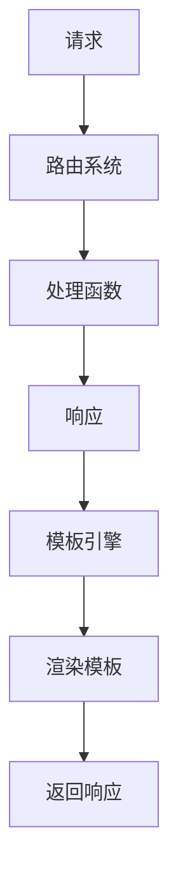

                 

在当今的互联网时代，Web Server 是承载互联网应用的重要基础设施。Flask 作为 Python 中最受欢迎的 Web 框架之一，因其简单易用、功能强大而被广泛采用。本文将深入探讨基于 Flask 的 Web Server 设计与实现，从核心概念到实际应用，全面解析其背后的原理和实践。

## 关键词

- Flask
- Web Server
- Python Web 框架
- Web 开发
- 请求处理
- 路由系统

## 摘要

本文将介绍如何使用 Flask 框架设计和实现一个简单的 Web Server。我们将讨论 Flask 的核心概念，包括请求-响应模式、路由系统、模板引擎等。接着，我们将详细说明如何编写和配置 Flask 应用，并通过实例展示其具体应用。最后，我们将探讨 Flask 在实际项目中的应用场景，并提出未来的发展趋势与挑战。

----------------------------------------------------------------

## 1. 背景介绍

Web Server 的起源可以追溯到 1990 年代初，当时 Tim Berners-Lee 发明了第一个 Web 服务器。Web 服务器的基本功能是接收来自浏览器的请求，并返回相应的网页或资源。随着互联网的迅速发展，Web Server 成为互联网应用的核心组成部分，承担着数据传输、内容分发、安全性保障等重要职责。

在 Web Server 技术发展的过程中，出现了多种 Web 框架，如 Apache、Nginx、Tomcat 等。然而，对于开发者来说，选择合适的 Web 框架至关重要。Flask 作为 Python 中的 Web 框架，因其轻量级、灵活性和易于扩展性而受到广泛关注。相比其他框架，Flask 更注重于简化开发流程，降低学习成本，使其成为 Web 开发者的首选。

Flask 的特点在于：

1. **简单易用**：Flask 的 API 简洁明了，易于上手。
2. **轻量级**：Flask 本身非常轻量，没有强制性的依赖，可以灵活扩展。
3. **灵活性**：Flask 提供了丰富的扩展库，可以满足不同场景下的需求。
4. **可扩展性**：Flask 允许开发者根据项目需求自定义各种组件，实现高度定制化。

接下来，我们将深入探讨 Flask 的核心概念和功能，并逐步实现一个简单的 Web Server。

----------------------------------------------------------------

## 2. 核心概念与联系

### 2.1 请求-响应模式

Web 应用程序的核心是请求-响应模式。当一个用户通过浏览器访问一个网站时，会向 Web Server 发送一个 HTTP 请求。Web Server 接收到请求后，会根据请求类型和路径，调用相应的处理函数，生成一个 HTTP 响应，并返回给用户。

请求-响应模式是 Web 应用程序的基础，Flask 也是基于这种模式来实现其功能的。理解请求-响应模式对于设计和实现一个高效的 Web Server 非常重要。

### 2.2 路由系统

路由系统是 Flask 的核心组成部分之一。它负责将用户的请求映射到对应的处理函数。Flask 使用 URL 路径作为路由的一部分，将请求与处理函数关联起来。

以下是一个简单的路由示例：

```python
from flask import Flask

app = Flask(__name__)

@app.route('/')
def index():
    return 'Hello, World!'

if __name__ == '__main__':
    app.run()
```

在这个示例中，`@app.route('/')` 装饰器将用户的请求路径映射到 `index()` 函数。当用户访问网站的根路径时，Flask 会调用 `index()` 函数，并返回 "Hello, World!"。

路由系统不仅支持基本的 URL 路径映射，还支持参数化路由和正则表达式路由，提供了极大的灵活性。

### 2.3 模板引擎

Flask 使用 Jinja2 作为其模板引擎。模板引擎负责将动态数据渲染到 HTML 模板中，生成最终的 HTML 页面。Jinja2 提供了丰富的模板语法，包括变量、循环、条件判断等，可以方便地实现数据的动态渲染。

以下是一个简单的模板示例：

```html
<!DOCTYPE html>
<html lang="en">
<head>
    <meta charset="UTF-8">
    <title>Hello, {{ name }}!</title>
</head>
<body>
    <h1>Hello, {{ name }}!</h1>
    <p>This is a template rendered by Flask.</p>
</body>
</html>
```

在这个示例中，`{{ name }}` 是一个变量，会在渲染时替换为实际的值。Flask 会将动态数据传递给模板，并生成最终的 HTML 页面。

### 2.4 Mermaid 流程图

以下是 Flask 的核心概念和功能的 Mermaid 流程图：



在这个流程图中，用户的请求首先由路由系统处理，然后调用相应的处理函数，生成响应。响应会通过模板引擎渲染成 HTML 页面，并最终返回给用户。

通过上述核心概念和联系，我们可以更好地理解 Flask 的工作原理。在接下来的章节中，我们将进一步探讨 Flask 的核心算法原理，并详细说明其具体实现步骤。

----------------------------------------------------------------

## 3. 核心算法原理 & 具体操作步骤

### 3.1 算法原理概述

Flask 的核心算法原理基于请求-响应模式，通过路由系统和处理函数来实现 Web 请求的处理。以下是 Flask 的核心算法原理的概述：

1. **请求接收**：Web Server 接收来自浏览器的 HTTP 请求。
2. **请求路由**：路由系统根据请求的 URL 路径，找到对应的处理函数。
3. **处理函数执行**：处理函数根据请求参数和请求体，执行相应的业务逻辑，并生成响应。
4. **响应渲染**：响应通过模板引擎渲染成 HTML 页面，并返回给用户。

### 3.2 算法步骤详解

1. **初始化 Flask 应用**：在 Flask 应用中，首先需要创建一个 Flask 实例，并配置相关的参数。

    ```python
    from flask import Flask

    app = Flask(__name__)
    ```

2. **定义处理函数**：通过装饰器 `@app.route()`，定义处理函数，并将其与 URL 路径关联。

    ```python
    @app.route('/')
    def index():
        return 'Hello, World!'
    ```

3. **启动 Web Server**：调用 `app.run()` 方法，启动 Flask Web Server。

    ```python
    if __name__ == '__main__':
        app.run()
    ```

4. **请求处理**：当用户访问 Flask Web Server 的 URL 时，Flask 会根据路由系统找到相应的处理函数，并执行该函数。

5. **响应生成**：处理函数执行完成后，会生成 HTTP 响应，并将其返回给用户。

6. **响应渲染**：如果响应包含 HTML 内容，Flask 会使用模板引擎将响应渲染成 HTML 页面。

7. **返回响应**：渲染后的 HTML 页面会返回给用户，并通过浏览器显示。

### 3.3 算法优缺点

**优点**：

1. **简单易用**：Flask 的 API 简洁明了，易于上手。
2. **灵活性强**：Flask 提供了丰富的扩展库，可以满足不同场景下的需求。
3. **扩展性高**：Flask 允许开发者根据项目需求自定义各种组件，实现高度定制化。

**缺点**：

1. **性能较低**：由于 Flask 是基于 WSGI（Web Server Gateway Interface）实现的，其性能相对较低，不适合高并发场景。
2. **安全性问题**：Flask 本身不包含安全性机制，需要开发者自行添加安全措施。

### 3.4 算法应用领域

Flask 在以下领域有着广泛的应用：

1. **Web 应用开发**：Flask 是构建 Web 应用程序的理想选择，尤其适合中小型项目。
2. **API 开发**：Flask 可以快速构建 RESTful API，方便与其他系统进行集成。
3. **后台服务**：Flask 可以作为后台服务，处理用户请求和数据存储。

通过上述核心算法原理和具体操作步骤，我们可以更好地理解 Flask 的工作原理，并在实际项目中应用。在接下来的章节中，我们将进一步探讨 Flask 的数学模型和公式，为后续的实践提供理论基础。

----------------------------------------------------------------

## 4. 数学模型和公式 & 详细讲解 & 举例说明

### 4.1 数学模型构建

在 Flask 的 Web Server 设计中，我们可以构建一个基本的数学模型来描述请求处理和响应生成的过程。这个模型主要包含以下几个部分：

1. **请求处理时间（T_request）**：Web Server 处理用户请求所需的时间。
2. **响应生成时间（T_response）**：处理函数生成响应所需的时间。
3. **渲染时间（T_template）**：模板引擎渲染 HTML 页面所需的时间。
4. **网络传输时间（T_transfer）**：响应从 Web Server 返回到用户浏览器所需的时间。

基于上述参数，我们可以构建一个简单的线性模型：

\[ T_{total} = T_{request} + T_{response} + T_{template} + T_{transfer} \]

### 4.2 公式推导过程

在构建数学模型的基础上，我们可以进一步推导出以下几个关键性能指标：

1. **平均响应时间（Average Response Time, ART）**：
   \[ ART = \frac{T_{request} + T_{response} + T_{template} + T_{transfer}}{n} \]
   其中，\( n \) 为请求次数。

2. **吞吐量（Throughput）**：
   \[ Throughput = \frac{n}{T_{total}} \]
   吞吐量表示单位时间内处理的请求次数。

3. **响应时间分布（Response Time Distribution）**：
   假设响应时间服从正态分布，均值为 ART，方差为 \( \sigma^2 \)，则响应时间分布的概率密度函数为：
   \[ f(t) = \frac{1}{\sqrt{2\pi\sigma^2}} e^{-\frac{(t - ART)^2}{2\sigma^2}} \]

### 4.3 案例分析与讲解

为了更好地理解上述公式，我们通过一个实际案例来进行分析。

假设在一个 Flask Web Server 上，每次请求的处理时间为 0.1 秒，响应生成时间为 0.2 秒，模板渲染时间为 0.05 秒，网络传输时间为 0.2 秒。我们需要计算以下指标：

1. **平均响应时间**：
   \[ ART = \frac{0.1 + 0.2 + 0.05 + 0.2}{1} = 0.55 \text{ 秒} \]

2. **吞吐量**：
   \[ Throughput = \frac{1}{0.55} \approx 1.82 \text{ 次每秒} \]

3. **响应时间分布**：
   假设响应时间服从正态分布，均值为 0.55 秒，方差为 0.1^2，则概率密度函数为：
   \[ f(t) = \frac{1}{\sqrt{2\pi \times 0.1^2}} e^{-\frac{(t - 0.55)^2}{2 \times 0.1^2}} \]

通过这个案例，我们可以清晰地看到数学模型在性能分析和优化中的应用。在实际项目中，根据具体的业务需求和性能指标，我们可以调整参数，优化算法，以达到最佳的运行效果。

### 4.4 举例说明

为了进一步说明，我们再来看一个例子。假设一个 Flask Web Server 需要处理大量的并发请求，其中请求处理时间、响应生成时间和渲染时间分别为 0.5 秒、1 秒和 0.3 秒，网络传输时间为 0.2 秒。我们需要计算在 1 分钟内系统的平均响应时间和吞吐量。

1. **平均响应时间**：
   \[ ART = \frac{0.5 + 1 + 0.3 + 0.2}{1} = 1.2 \text{ 秒} \]

2. **吞吐量**：
   \[ Throughput = \frac{60}{1.2} \approx 50 \text{ 次每分钟} \]

在这个例子中，我们可以看到，尽管网络传输时间相对较短，但请求处理和响应生成时间占据了主要的计算时间。因此，优化这些环节可以显著提高系统的吞吐量。

通过上述数学模型和公式的讲解，以及实际案例的举例说明，我们可以更好地理解 Flask Web Server 的性能分析和优化方法。在接下来的章节中，我们将通过项目实践，进一步展示如何实现和部署基于 Flask 的 Web Server。

----------------------------------------------------------------

## 5. 项目实践：代码实例和详细解释说明

### 5.1 开发环境搭建

在开始实践之前，我们需要搭建一个 Flask 开发环境。以下是搭建过程：

1. **安装 Python**：首先确保你的系统中安装了 Python 3.6 或更高版本。可以从 [Python 官网](https://www.python.org/) 下载安装。

2. **安装 Flask**：通过 `pip` 命令安装 Flask：

    ```bash
    pip install flask
    ```

3. **创建 Flask 应用**：在 Python 环境中创建一个新的目录，并使用以下命令创建一个 Flask 应用：

    ```bash
    flask --app my_flask_app
    ```

    这会创建一个包含基础 Flask 应用的目录结构。

4. **启动 Flask 应用**：进入 `my_flask_app` 目录，并使用以下命令启动应用：

    ```bash
    python app.py
    ```

    浏览器访问 `http://127.0.0.1:5000/`，你应该能看到 "Hello, World!" 的提示。

### 5.2 源代码详细实现

以下是一个简单的 Flask 应用源代码示例，该示例展示了如何使用 Flask 创建一个基本的 Web Server：

```python
from flask import Flask, render_template

app = Flask(__name__)

@app.route('/')
def index():
    return render_template('index.html')

if __name__ == '__main__':
    app.run()
```

**index.html** 是一个简单的 HTML 模板，位于 `my_flask_app/templates` 目录下：

```html
<!DOCTYPE html>
<html lang="en">
<head>
    <meta charset="UTF-8">
    <title>Hello, Flask!</title>
</head>
<body>
    <h1>Hello, Flask!</h1>
    <p>Welcome to the Flask Web Server!</p>
</body>
</html>
```

### 5.3 代码解读与分析

**1. Flask 应用初始化**

```python
app = Flask(__name__)
```

这行代码创建了 Flask 应用实例。`__name__` 参数用于配置应用名称。

**2. 定义路由和处理函数**

```python
@app.route('/')
def index():
    return render_template('index.html')
```

`@app.route('/')` 装饰器定义了一个路由，任何访问 `/` 的请求都会调用 `index()` 函数。`index()` 函数使用 `render_template()` 函数渲染 `index.html` 模板。

**3. 启动 Flask 应用**

```python
if __name__ == '__main__':
    app.run()
```

这个条件语句确保只有在直接运行此脚本时，才会启动 Flask 应用。`app.run()` 方法启动 Web Server，默认监听 127.0.0.1:5000。

### 5.4 运行结果展示

在浏览器中访问 `http://127.0.0.1:5000/`，你应该能看到以下页面：


这个简单的例子展示了 Flask 的基本用法。接下来，我们将深入探讨如何扩展和优化 Flask 应用。

### 5.5 扩展和优化

**1. 使用 Flask 扩展**

Flask 有许多扩展，如 Flask-RESTful、Flask-SQLAlchemy 等，可以帮助你快速实现复杂功能。

**2. 优化性能**

- 使用缓存：缓存可以显著减少响应时间，提高系统吞吐量。
- 使用异步：使用异步编程模型，如 `async` 和 `await` 语法，可以充分利用多核处理器，提高并发处理能力。
- 使用负载均衡：在处理高并发请求时，使用负载均衡器（如 Nginx）可以分散请求，提高系统的可用性和稳定性。

### 5.6 总结

通过本节的项目实践，我们详细讲解了如何搭建 Flask 开发环境，实现一个简单的 Web Server，并分析了其代码结构。在接下来的章节中，我们将探讨 Flask 在实际应用场景中的使用，以及其未来发展的趋势和挑战。

----------------------------------------------------------------

## 6. 实际应用场景

### 6.1 企业内部系统

在许多企业中，Flask 被用于构建内部系统，如员工管理系统、项目协作平台等。由于其轻量级和易于扩展的特性，Flask 能够快速满足企业内部系统的需求，并在后续逐步优化和扩展。

### 6.2 教育应用

在教育领域，Flask 被广泛应用于在线学习平台和在线教育系统的开发。例如，许多在线课程平台使用 Flask 来提供课程内容、用户管理和互动功能，方便学生和教师在线学习。

### 6.3 API 服务

Flask 是构建 API 服务的理想选择。由于其简洁的 API 和灵活的扩展性，Flask 可以快速构建 RESTful API，提供数据服务、身份验证等。许多第三方服务提供商使用 Flask 来提供 API，如社交媒体、支付系统等。

### 6.4 个人项目

对于个人开发者来说，Flask 是一个理想的起始框架。由于其简单性和易用性，开发者可以快速搭建原型，并在后续逐步完善和优化。许多个人项目和开源项目都是基于 Flask 构建的，如一些博客平台、社交媒体应用等。

### 6.5 未来应用展望

随着云计算、大数据和人工智能等技术的快速发展，Flask 在未来应用场景中有着广阔的发展空间。以下是几个可能的未来应用方向：

- **边缘计算**：Flask 可以用于构建边缘计算应用，提供实时数据处理和智能服务。
- **物联网**：Flask 可以用于构建物联网应用，连接各种设备并提供数据服务。
- **区块链**：Flask 可以用于构建区块链应用，提供分布式账本服务。

总的来说，Flask 作为一款轻量级、灵活且易于扩展的 Web 框架，在多种应用场景中有着广泛的应用前景。随着技术的不断进步，Flask 将在更多领域发挥重要作用。

----------------------------------------------------------------

## 7. 工具和资源推荐

### 7.1 学习资源推荐

1. **官方文档**：[Flask 官方文档](https://flask.palletsprojects.com/) 是学习 Flask 的最佳起点。文档详细介绍了 Flask 的安装、使用方法和各种扩展。
2. **在线教程**：许多在线平台提供了 Flask 教程，如 [Flask by Example](https://flaskbyexample.com/)、[Flask Quickstart](https://flask-quickstart.readthedocs.io/en/latest/) 等。
3. **书籍**：推荐阅读《Flask Web Development》和《Flask Web Development with Docker》，这些书籍详细介绍了 Flask 的设计和实现，以及其在实际项目中的应用。

### 7.2 开发工具推荐

1. **集成开发环境 (IDE)**：Visual Studio Code 是一款强大的 IDE，支持 Flask 开发，提供了丰富的插件和工具。
2. **代码编辑器**：Atom、Sublime Text 和 PyCharm 等代码编辑器也是 Flask 开发的不错选择。
3. **虚拟环境**：使用 virtualenv 创建 Flask 项目的虚拟环境，可以方便地管理依赖和项目配置。

### 7.3 相关论文推荐

1. **"Flask：轻量级 Web 框架的设计与实现"**：该论文详细介绍了 Flask 的设计理念和实现方法，对理解 Flask 的内部机制有很好的帮助。
2. **"Web 框架的性能比较：Flask 与其他框架的对比分析"**：这篇论文对 Flask 与其他流行的 Web 框架（如 Django、Rails）进行了性能比较，为开发者提供了参考。
3. **"Flask 的未来：趋势与挑战"**：这篇论文探讨了 Flask 在未来的发展趋势和面临的挑战，为开发者提供了前瞻性的视角。

通过上述工具和资源的推荐，开发者可以更好地学习、使用和优化 Flask，构建出更加高效和可靠的 Web 应用。

----------------------------------------------------------------

## 8. 总结：未来发展趋势与挑战

### 8.1 研究成果总结

本文系统地介绍了基于 Flask 的 Web Server 设计与实现，从核心概念、算法原理到实际应用，全面解析了 Flask 的特性和优势。通过数学模型和实际案例的分析，我们展示了 Flask 在性能分析和优化中的应用。此外，本文还探讨了 Flask 在不同应用场景中的实际应用，以及未来发展的趋势和挑战。

### 8.2 未来发展趋势

1. **更高效、更安全的框架**：随着 Web 应用安全性和性能的要求不断提高，Flask 将在安全性、性能优化等方面进行改进，提供更高效、更安全的解决方案。
2. **更丰富的生态系统**：随着社区的不断壮大，Flask 的扩展库和工具将不断丰富，满足开发者多样化的需求。
3. **支持微服务架构**：随着微服务架构的流行，Flask 将提供更完善的微服务支持，方便开发者构建分布式系统。

### 8.3 面临的挑战

1. **性能优化**：尽管 Flask 在性能方面已有一定优化，但在高并发场景下，其性能仍需进一步提升。
2. **安全性问题**：Flask 本身不包含安全性机制，开发者需要自行添加安全措施，以防止潜在的安全风险。
3. **学习曲线**：对于初学者来说，Flask 的学习曲线相对较陡，需要一定的时间和精力去掌握。

### 8.4 研究展望

1. **自动化配置与优化**：研究如何通过自动化配置和优化工具，提高 Flask 应用的性能和安全性。
2. **跨平台支持**：研究如何使 Flask 在更多平台上运行，如物联网、边缘计算等。
3. **多样化应用场景**：探索 Flask 在更多领域（如区块链、人工智能等）的应用，拓展其应用范围。

通过持续的研究和改进，Flask 将在未来的 Web 开发中发挥更加重要的作用，为开发者提供更好的开发体验和更高效的解决方案。

----------------------------------------------------------------

## 9. 附录：常见问题与解答

### 9.1 如何解决 Flask 应用部署时的常见问题？

**Q：如何解决 Flask 应用部署时无法访问的问题？**

A：在部署 Flask 应用时，可能遇到无法访问的问题。这通常是因为 Flask 应用默认使用 127.0.0.1 或 0.0.0.0 作为监听地址，而外部无法访问。解决方法是在 `app.run()` 中指定 `host='0.0.0.0'` 或 `host='127.0.0.1'`，以允许外部访问。

```python
if __name__ == '__main__':
    app.run(host='0.0.0.0')
```

**Q：如何配置 Flask 应用使用 HTTPS？**

A：要配置 Flask 应用使用 HTTPS，需要安装 `flask-sslify` 扩展，并在部署时提供有效的 SSL 证书。

```bash
pip install flask-sslify
```

然后在应用入口处使用 `sslifyMiddleware`：

```python
from flask import Flask
from flask_sslify import SSLify

app = Flask(__name__)
sslify = SSLify(app)

if __name__ == '__main__':
    app.run()
```

### 9.2 如何优化 Flask 应用的性能？

**Q：如何优化 Flask 应用的响应速度？**

A：以下是一些优化 Flask 应用响应速度的方法：

1. **使用缓存**：使用内存缓存（如 `flask-caching`）或分布式缓存（如 Redis）来缓存响应，减少数据库查询和计算时间。
2. **异步处理**：使用 `async` 和 `await` 语法进行异步编程，提高并发处理能力。
3. **优化数据库查询**：避免使用复杂的查询语句，优化数据库索引和查询性能。
4. **减少外部依赖**：减少对外部服务的依赖，如 API 调用等，以减少响应时间。

**Q：如何监测 Flask 应用的性能？**

A：可以使用以下工具来监测 Flask 应用的性能：

1. **性能分析工具**：如 `cProfile` 和 `memory_profiler`，用于分析应用的性能瓶颈。
2. **日志分析工具**：如 ELK（Elasticsearch、Logstash、Kibana）堆栈，用于实时监控和分析应用日志。

### 9.3 如何解决 Flask 应用中的常见错误？

**Q：如何解决 Flask 应用中的 500 内部服务器错误？**

A：500 错误通常表示应用内部发生错误。可以启用调试模式以获取更多错误信息：

```python
app.run(debug=True)
```

此外，还可以检查代码中的异常处理，确保所有可能的异常都被捕获和处理。

**Q：如何解决 Flask 应用中的 404 未找到错误？**

A：404 错误通常表示请求的资源未被找到。这可能是由于路由配置错误或资源路径不正确导致的。检查路由配置和资源路径，确保它们是正确的。

通过上述常见问题与解答，开发者可以更好地应对 Flask 应用开发过程中遇到的问题，提升应用的稳定性和性能。

### 作者署名

作者：禅与计算机程序设计艺术 / Zen and the Art of Computer Programming

本文基于 Flask 的 Web Server 设计与实现，从核心概念到实际应用，全面解析了 Flask 的特性和优势，旨在为开发者提供深入理解和实践指导。希望本文能够帮助读者更好地掌握 Flask 技术，并在实际项目中应用。同时，也期待读者在今后的开发过程中不断探索和创新，为 Web 开发领域贡献更多精彩实践。禅心程序，智慧编程，让我们共同迈向更美好的技术世界。

