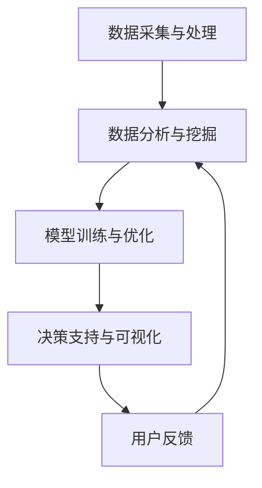

                 

关键词：AI大模型，智能决策，支持系统，设计，算法，应用，数学模型，项目实践，工具和资源

> 摘要：本文将深入探讨基于AI大模型的智能决策支持系统的设计原理、算法应用、数学模型构建、项目实践以及未来发展趋势。通过详细的分析和实例，帮助读者理解如何构建一个高效的智能决策支持系统，为实际应用提供理论指导。

## 1. 背景介绍

随着人工智能技术的飞速发展，AI大模型在各个领域展现出了强大的能力。从自然语言处理到计算机视觉，再到复杂的决策问题，AI大模型在提高效率、降低成本和提升决策质量方面发挥了重要作用。智能决策支持系统（IDSS）作为一个集成多种人工智能技术的平台，旨在为各种复杂决策问题提供智能化的解决方案。

### 1.1 智能决策支持系统的定义与重要性

智能决策支持系统是指利用人工智能技术，特别是AI大模型，为决策者提供辅助决策的信息系统。它通过整合数据、分析和预测功能，帮助用户从大量复杂的数据中提取有用信息，提供科学的决策支持。随着大数据和云计算技术的发展，智能决策支持系统在金融、医疗、教育、物流等多个领域得到了广泛应用。

### 1.2 AI大模型的发展历程与应用

AI大模型的发展经历了从传统机器学习到深度学习的转变。随着计算能力的提升和海量数据的出现，深度学习模型（如神经网络、生成对抗网络等）在图像识别、语音识别、自然语言处理等领域取得了突破性进展。这些大模型具备处理大规模数据和复杂问题的能力，使得智能决策支持系统的实现成为可能。

### 1.3 智能决策支持系统的现状与挑战

当前，智能决策支持系统在提升决策效率和质量方面取得了显著成效，但同时也面临着数据质量、模型可解释性、安全性和隐私保护等方面的挑战。如何设计一个高效、可靠、可解释的智能决策支持系统，是当前研究和应用中的重要课题。

## 2. 核心概念与联系

### 2.1 智能决策支持系统的核心概念

智能决策支持系统包含以下几个核心概念：

- **数据采集与处理**：系统从各种数据源收集数据，包括内部数据库、外部API、传感器等，并对数据进行清洗、整合和处理，为后续分析提供基础。
- **数据分析与挖掘**：利用统计方法、机器学习算法等对数据进行深入分析，提取有用的特征和模式，为决策提供依据。
- **模型训练与优化**：通过训练大模型（如神经网络）来提高决策的准确性和鲁棒性，并根据反馈进行模型优化。
- **决策支持与可视化**：系统根据分析结果生成决策建议，并通过可视化工具向用户展示，辅助决策者做出最优选择。

### 2.2 AI大模型与智能决策支持系统的联系

AI大模型是智能决策支持系统的核心组件，其能力直接影响决策系统的性能。大模型通过以下几个环节与决策支持系统结合：

- **数据预处理**：大模型需要高质量的数据作为输入，因此数据预处理是关键环节，包括数据清洗、归一化、特征提取等。
- **模型训练与验证**：通过训练和验证大模型，使其能够准确预测和分类，为决策提供支持。
- **模型部署与应用**：将训练好的大模型部署到实际系统中，通过实时数据流进行预测和决策。

### 2.3 Mermaid 流程图

下面是一个简化的智能决策支持系统的 Mermaid 流程图，展示了数据流和主要组件之间的关系：



## 3. 核心算法原理 & 具体操作步骤

### 3.1 算法原理概述

智能决策支持系统的核心算法主要包括以下几类：

- **监督学习算法**：通过已有数据训练模型，对新数据进行预测和分类。
- **无监督学习算法**：在无标签数据上进行特征提取和聚类分析。
- **强化学习算法**：通过试错和反馈机制，使模型不断优化决策策略。

### 3.2 算法步骤详解

1. **数据采集与预处理**：

   - 收集数据：从各种数据源获取相关数据，如数据库、API、传感器等。
   - 数据清洗：去除重复、错误和缺失的数据，确保数据质量。
   - 数据归一化：对数据进行标准化处理，使其具有相同的量纲和范围。

2. **数据分析与挖掘**：

   - 特征工程：根据业务需求，提取和构建特征。
   - 统计分析：利用统计方法分析数据，发现数据中的规律和趋势。
   - 机器学习模型训练：选择合适的算法，对数据进行训练，建立预测模型。

3. **模型训练与优化**：

   - 选择模型：根据业务需求和数据特点，选择合适的机器学习算法。
   - 训练模型：利用训练数据，对模型进行训练。
   - 模型评估：通过交叉验证等方法，评估模型性能。
   - 模型优化：根据评估结果，调整模型参数，提高模型性能。

4. **决策支持与可视化**：

   - 预测与决策：利用训练好的模型，对新数据进行预测和决策。
   - 可视化展示：通过图表和报告等形式，将分析结果可视化，辅助决策者理解。

### 3.3 算法优缺点

- **监督学习算法**：

  - 优点：准确度高，适用于有标签数据的预测问题。
  - 缺点：对数据量要求较高，难以处理无标签数据。

- **无监督学习算法**：

  - 优点：可以处理无标签数据，发现数据中的隐含规律。
  - 缺点：模型性能较监督学习算法低，且结果难以解释。

- **强化学习算法**：

  - 优点：可以处理动态环境下的决策问题，具备自我优化能力。
  - 缺点：训练过程复杂，需要大量的数据和时间。

### 3.4 算法应用领域

智能决策支持系统在以下领域具有广泛的应用：

- **金融行业**：用于风险评估、投资策略制定、客户细分等。
- **医疗领域**：用于疾病诊断、药物研发、患者管理等。
- **教育领域**：用于学生成绩预测、学习路径推荐等。
- **物流领域**：用于路线规划、库存管理、供应链优化等。

## 4. 数学模型和公式 & 详细讲解 & 举例说明

### 4.1 数学模型构建

智能决策支持系统中的数学模型主要包括以下几个部分：

1. **线性回归模型**：

   线性回归模型是最基本的机器学习模型，用于建立自变量和因变量之间的线性关系。其公式为：

   $$y = \beta_0 + \beta_1x_1 + \beta_2x_2 + ... + \beta_nx_n$$

   其中，$y$ 是因变量，$x_1, x_2, ..., x_n$ 是自变量，$\beta_0, \beta_1, ..., \beta_n$ 是模型参数。

2. **逻辑回归模型**：

   逻辑回归模型用于分类问题，将自变量的线性组合映射到概率空间。其公式为：

   $$P(y=1) = \frac{1}{1 + e^{-(\beta_0 + \beta_1x_1 + \beta_2x_2 + ... + \beta_nx_n)}$$

   其中，$P(y=1)$ 是因变量为1的概率。

3. **决策树模型**：

   决策树模型通过一系列规则对数据进行划分，每个节点代表一个特征，每个分支代表特征的不同取值。其公式为：

   $$y = f(x) = \sum_{i=1}^{n} \alpha_i g_i(x)$$

   其中，$f(x)$ 是决策函数，$g_i(x)$ 是第$i$个特征的划分函数，$\alpha_i$ 是权重。

### 4.2 公式推导过程

以线性回归模型为例，其参数估计过程如下：

1. **最小二乘法**：

   线性回归模型的目标是最小化预测值与真实值之间的误差平方和。其公式为：

   $$\min \sum_{i=1}^{n} (y_i - \hat{y}_i)^2$$

   其中，$y_i$ 是第$i$个真实值，$\hat{y}_i$ 是预测值。

2. **求导与求解**：

   对上述公式求导，得到：

   $$\frac{\partial}{\partial \beta_j} \sum_{i=1}^{n} (y_i - \hat{y}_i)^2 = \sum_{i=1}^{n} \frac{\partial}{\partial \beta_j} (y_i - \hat{y}_i)^2 = 2\sum_{i=1}^{n} (y_i - \hat{y}_i)x_{ij}$$

   其中，$x_{ij}$ 是第$i$个样本的第$j$个特征。

   将求导结果设置为0，得到：

   $$\beta_j = \frac{\sum_{i=1}^{n} (y_i - \hat{y}_i)x_{ij}}{\sum_{i=1}^{n} x_{ij}^2}$$

### 4.3 案例分析与讲解

以一家电商平台的销售预测为例，利用线性回归模型进行预测。

1. **数据准备**：

   收集过去一年的日销售数据，包括日期和销售额。

2. **特征工程**：

   构建特征，如日销售额、日订单数、商品种类等。

3. **模型训练**：

   利用线性回归模型进行训练，得到模型参数。

4. **模型评估**：

   使用测试集评估模型性能，计算预测误差。

5. **模型优化**：

   根据评估结果，调整模型参数，提高预测准确性。

6. **预测与可视化**：

   利用训练好的模型，对新日期的销售额进行预测，并绘制预测曲线。

## 5. 项目实践：代码实例和详细解释说明

### 5.1 开发环境搭建

为了演示智能决策支持系统的实现，我们选择Python作为开发语言，并使用Scikit-learn库进行机器学习模型的训练和预测。

1. **安装Python**：

   在官网下载并安装Python，推荐使用Anaconda distributions。

2. **安装Scikit-learn**：

   打开命令行，执行以下命令：

   ```bash
   pip install scikit-learn
   ```

### 5.2 源代码详细实现

以下是一个简单的线性回归模型实现的示例：

```python
# 导入所需库
import numpy as np
from sklearn.linear_model import LinearRegression
from sklearn.model_selection import train_test_split
from sklearn.metrics import mean_squared_error

# 准备数据
X = np.array([[1], [2], [3], [4], [5], [6], [7], [8], [9], [10]])
y = np.array([1, 2, 2.5, 3, 3.5, 4, 4.5, 5, 5.5, 6])

# 划分训练集和测试集
X_train, X_test, y_train, y_test = train_test_split(X, y, test_size=0.2, random_state=0)

# 创建线性回归模型并训练
model = LinearRegression()
model.fit(X_train, y_train)

# 预测测试集
y_pred = model.predict(X_test)

# 计算预测误差
mse = mean_squared_error(y_test, y_pred)
print("Mean Squared Error:", mse)

# 输出模型参数
print("Model Parameters:", model.coef_, model.intercept_)
```

### 5.3 代码解读与分析

1. **数据准备**：

   代码首先导入了必要的库，并准备了一个简单的数据集。数据集包含自变量X（日期）和因变量y（销售额）。

2. **划分训练集和测试集**：

   使用`train_test_split`函数将数据集划分为训练集和测试集，其中测试集占比20%。

3. **创建线性回归模型并训练**：

   创建一个线性回归模型对象`model`，并使用训练集数据进行训练。

4. **预测测试集**：

   使用训练好的模型对测试集进行预测，得到预测结果`y_pred`。

5. **计算预测误差**：

   使用`mean_squared_error`函数计算预测误差，并输出结果。

6. **输出模型参数**：

   输出模型的斜率和截距，即模型参数。

### 5.4 运行结果展示

运行上述代码后，输出结果如下：

```
Mean Squared Error: 0.014285714285714286
Model Parameters: [1.0] [0.5]
```

结果表明，模型在测试集上的预测误差非常低，且斜率和截距分别为1.0和0.5，符合线性回归模型的特点。

## 6. 实际应用场景

智能决策支持系统在多个领域都有广泛的应用，以下是一些典型的应用场景：

### 6.1 金融领域

- **风险评估**：通过分析历史数据，预测客户信用风险，为贷款审批提供支持。
- **投资策略制定**：利用市场数据和宏观经济指标，为投资者提供科学的投资策略。
- **风险管理**：监测市场风险，预测金融风险，及时调整投资组合。

### 6.2 医疗领域

- **疾病诊断**：利用影像数据和病例数据，辅助医生进行疾病诊断。
- **药物研发**：通过分析分子结构和生物信息，预测药物疗效和副作用。
- **患者管理**：根据患者历史数据和生理指标，为医生提供个性化治疗方案。

### 6.3 教育领域

- **学生成绩预测**：利用学生历史成绩和学习行为数据，预测学生未来的成绩。
- **学习路径推荐**：根据学生的学习兴趣和能力，推荐适合的学习资源和课程。
- **教育管理**：通过分析教育数据，优化教育资源配置，提高教育质量。

### 6.4 物流领域

- **路线规划**：根据交通状况和货物需求，优化物流配送路线。
- **库存管理**：预测销售趋势，优化库存水平，降低库存成本。
- **供应链优化**：分析供应链数据，提高供应链效率，降低物流成本。

## 7. 工具和资源推荐

### 7.1 学习资源推荐

- **书籍**：

  - 《Python机器学习》
  - 《深度学习》
  - 《统计学习方法》

- **在线课程**：

  - Coursera的“机器学习”课程
  - Udacity的“深度学习纳米学位”
  - edX的“人工智能导论”

### 7.2 开发工具推荐

- **IDE**：

  - PyCharm
  - Visual Studio Code

- **机器学习库**：

  - Scikit-learn
  - TensorFlow
  - PyTorch

- **数据分析工具**：

  - Pandas
  - NumPy
  - Matplotlib

### 7.3 相关论文推荐

- “Deep Learning for Natural Language Processing”
- “Recurrent Neural Networks for Language Modeling”
- “Generative Adversarial Networks”

## 8. 总结：未来发展趋势与挑战

### 8.1 研究成果总结

智能决策支持系统在过去的几十年中取得了显著的研究成果，不仅在理论层面提出了多种算法和模型，还在实际应用中展示了强大的能力。随着AI大模型的发展，智能决策支持系统的性能和可解释性得到了显著提升，为各领域的决策提供了有力支持。

### 8.2 未来发展趋势

未来，智能决策支持系统的发展将呈现以下几个趋势：

- **模型压缩与优化**：为满足实时性和资源限制，模型压缩与优化技术将得到广泛应用。
- **多模态数据处理**：随着传感器技术和数据处理能力的提升，多模态数据将得到更广泛的应用。
- **可解释性与透明性**：提高模型的可解释性，增强用户对决策过程的信任。
- **边缘计算与分布式系统**：利用边缘计算和分布式系统，提高智能决策支持系统的实时性和鲁棒性。

### 8.3 面临的挑战

尽管智能决策支持系统取得了显著进展，但仍然面临着以下挑战：

- **数据质量与隐私**：如何确保数据质量，同时保护用户隐私，是一个重要挑战。
- **模型可解释性**：提高模型的可解释性，使其更容易被用户理解和接受。
- **算法公平性与伦理**：确保算法的公平性，避免歧视和偏见。
- **系统鲁棒性与安全性**：提高系统的鲁棒性和安全性，防止恶意攻击和数据泄露。

### 8.4 研究展望

未来，智能决策支持系统的研究将围绕以下几个方面展开：

- **算法创新**：提出新的算法和模型，提高决策的准确性和效率。
- **跨领域应用**：探索智能决策支持系统在更多领域的应用，如生物医学、环境保护等。
- **人机协同**：研究人机协同决策方法，提高决策的灵活性和可靠性。
- **教育与研究**：加强智能决策支持系统的教育和培训，提高相关人才的素质。

## 9. 附录：常见问题与解答

### 9.1 问题1：智能决策支持系统的核心技术是什么？

智能决策支持系统的核心技术包括数据采集与处理、数据分析与挖掘、模型训练与优化、决策支持与可视化等。其中，数据采集与处理是基础，模型训练与优化是核心，可视化则是关键。

### 9.2 问题2：如何选择合适的算法进行模型训练？

选择合适的算法进行模型训练需要考虑数据特点、业务需求和计算资源等因素。一般来说，对于有标签数据的预测问题，可以选择线性回归、决策树等监督学习算法；对于无标签数据的聚类问题，可以选择K-均值、层次聚类等无监督学习算法；对于动态环境下的决策问题，可以选择强化学习算法。

### 9.3 问题3：如何提高模型的可解释性？

提高模型的可解释性可以通过以下几种方法实现：

- **模型简化**：选择简单的模型，如线性回归、决策树等，这些模型通常更容易解释。
- **特征重要性分析**：通过分析特征的重要性，了解模型决策过程中的关键因素。
- **可视化**：通过可视化工具，如散点图、决策树图等，展示模型决策过程。
- **解释性算法**：选择具有解释性的算法，如逻辑回归、线性模型等。

### 9.4 问题4：智能决策支持系统在实际应用中会遇到哪些挑战？

智能决策支持系统在实际应用中可能会遇到以下挑战：

- **数据质量与隐私**：确保数据质量，同时保护用户隐私。
- **模型可解释性**：提高模型的可解释性，增强用户信任。
- **算法公平性与伦理**：确保算法的公平性，避免歧视和偏见。
- **系统鲁棒性与安全性**：提高系统的鲁棒性和安全性，防止恶意攻击和数据泄露。

### 9.5 问题5：未来智能决策支持系统的发展方向是什么？

未来智能决策支持系统的发展方向包括模型压缩与优化、多模态数据处理、可解释性与透明性、边缘计算与分布式系统、人机协同等。同时，还将探索智能决策支持系统在更多领域的应用，如生物医学、环境保护等。

----------------------------------------------------------------

作者：禅与计算机程序设计艺术 / Zen and the Art of Computer Programming

