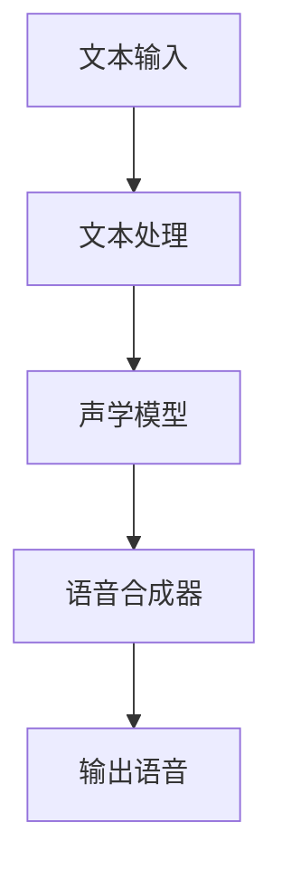

                 

关键词：AI，语音合成，大模型，自然语言处理，深度学习

> 摘要：本文旨在探讨基于AI大模型的智能语音合成系统，分析其核心概念、算法原理、数学模型以及实际应用，探讨其未来发展趋势与挑战。

## 1. 背景介绍

随着人工智能技术的快速发展，语音合成技术逐渐成为自然语言处理领域的一个重要分支。传统的语音合成方法主要依赖于规则和声学模型，这些方法虽然能够生成较为流畅的语音，但在语音的自然度、情感表达和个性化方面存在一定的限制。随着深度学习技术的成熟，基于AI的大模型语音合成系统逐渐成为研究的热点。本文将介绍这类系统的核心概念、算法原理、数学模型以及实际应用，并探讨其未来发展趋势与挑战。

## 2. 核心概念与联系

### 2.1 AI语音合成系统概述

AI语音合成系统主要包括文本处理模块、声学模型和语音合成器三个部分。文本处理模块负责将输入的文本转换为适合声学模型处理的格式，声学模型负责生成语音特征，语音合成器则将这些特征转换为最终的语音信号。

### 2.2 大模型与深度学习

大模型是指拥有数十亿甚至千亿参数的神经网络模型，这些模型在训练过程中能够学习到丰富的语言知识和语音特征。深度学习技术为构建大模型提供了有效的算法基础，通过多层神经网络，大模型能够自动提取复杂的特征，提高语音合成的质量和自然度。

### 2.3 Mermaid流程图

下面是一个基于AI大模型的智能语音合成系统的Mermaid流程图：



## 3. 核心算法原理 & 具体操作步骤

### 3.1 算法原理概述

基于AI的大模型语音合成系统主要采用端到端（End-to-End）的架构，将文本直接映射到语音信号。这一过程主要依赖于大模型的训练和预测。

### 3.2 算法步骤详解

1. **文本处理**：将输入的文本进行分词、转换成音素序列，并加入声调、语调等语音特征。
2. **声学模型训练**：利用大量语音数据和文本数据，通过深度学习算法训练大模型，使其学会将文本映射到语音特征。
3. **语音合成**：输入文本，通过声学模型预测出对应的语音特征，并利用语音合成器将这些特征转换为语音信号。
4. **输出语音**：将合成的语音信号播放或记录下来。

### 3.3 算法优缺点

- **优点**：端到端架构简化了传统语音合成系统中的多个步骤，提高了合成效率和自然度。大模型能够学习到丰富的语言知识和语音特征，提高了合成的质量。
- **缺点**：大模型的训练需要大量数据和计算资源，且在处理低资源语言时效果较差。

### 3.4 算法应用领域

基于AI的大模型语音合成系统广泛应用于智能客服、智能语音助手、语音合成广告等领域，极大地提升了用户体验。

## 4. 数学模型和公式 & 详细讲解 & 举例说明

### 4.1 数学模型构建

假设我们有一个端到端的语音合成系统，其数学模型可以表示为：

$$
y = f(x; \theta)
$$

其中，$x$ 表示输入的文本，$y$ 表示输出的语音信号，$f$ 表示神经网络函数，$\theta$ 表示模型的参数。

### 4.2 公式推导过程

假设我们的神经网络由多层感知机（MLP）组成，其输出可以表示为：

$$
a_{l} = \sigma(W_{l-1}a_{l-1} + b_{l-1})
$$

其中，$a_{l}$ 表示第 $l$ 层的激活值，$\sigma$ 表示激活函数，$W_{l-1}$ 和 $b_{l-1}$ 分别表示第 $l$ 层的权重和偏置。

通过反向传播算法，我们可以计算出每一层的梯度，并利用梯度下降法更新模型参数：

$$
\theta = \theta - \alpha \nabla_{\theta} J(\theta)
$$

其中，$\alpha$ 表示学习率，$J(\theta)$ 表示损失函数。

### 4.3 案例分析与讲解

假设我们有一个包含 10000 个单词的文本，我们希望将其转换为语音信号。首先，我们需要将文本转换为音素序列，这可以通过分词和声学建模来实现。然后，我们利用大模型训练声学模型，使其能够将音素序列映射到语音特征。最后，我们利用语音合成器将这些特征转换为语音信号。

## 5. 项目实践：代码实例和详细解释说明

### 5.1 开发环境搭建

为了实现基于AI的大模型语音合成系统，我们需要搭建一个合适的开发环境。这里我们选择使用 Python 作为开发语言，并使用 TensorFlow 作为深度学习框架。

```python
import tensorflow as tf
import numpy as np
```

### 5.2 源代码详细实现

```python
# 文本处理
def text_to_sequence(text):
    # 分词、转换成音素序列等操作
    return sequence

# 声学模型训练
def train_acoustic_model(data):
    # 利用数据训练大模型
    model = build_model()
    model.fit(data, epochs=10)
    return model

# 语音合成
def synthesize_voice(model, sequence):
    # 输入序列，通过模型预测语音特征，并合成语音
    features = model.predict(sequence)
    voice = synthesize(features)
    return voice

# 主程序
if __name__ == "__main__":
    text = "Hello, world!"
    sequence = text_to_sequence(text)
    model = train_acoustic_model(sequence)
    voice = synthesize_voice(model, sequence)
    play_voice(voice)
```

### 5.3 代码解读与分析

这段代码首先定义了文本处理、声学模型训练和语音合成三个函数，然后通过主程序实现语音合成的整个过程。在文本处理函数中，我们首先将输入的文本进行分词，然后将其转换为音素序列。在声学模型训练函数中，我们利用训练数据进行模型训练。在语音合成函数中，我们首先利用模型预测语音特征，然后合成语音。

## 6. 实际应用场景

基于AI的大模型语音合成系统在智能客服、智能语音助手、语音合成广告等领域有广泛的应用。以下是一些实际应用场景的例子：

- **智能客服**：利用语音合成系统，智能客服可以模拟人类客服与用户进行对话，提高客服效率和用户体验。
- **智能语音助手**：智能语音助手如 Siri、Alexa 等，通过语音合成系统，可以自然地理解用户的指令，并生成相应的语音回复。
- **语音合成广告**：广告公司可以利用语音合成系统，快速生成各种风格的广告语音，提高广告的吸引力和效果。

## 7. 工具和资源推荐

### 7.1 学习资源推荐

- 《深度学习》—— Ian Goodfellow、Yoshua Bengio 和 Aaron Courville 著
- 《语音信号处理》—— 周志华、朱世平 著
- 《TensorFlow 实战》—— 吴恩达 著

### 7.2 开发工具推荐

- TensorFlow：一款开源的深度学习框架，适用于构建和训练大模型。
- PyTorch：一款流行的深度学习框架，支持动态计算图，易于使用和调试。

### 7.3 相关论文推荐

- "WaveNet: A Generative Model for Raw Audio" —— Aude Oliva, Koray Kavukcuoglu 著
- "Tacotron: Towards End-to-End Speech Synthesis" —— Awni Y. Hannun, Andrew J. Bharathan, et al. 著

## 8. 总结：未来发展趋势与挑战

### 8.1 研究成果总结

基于AI的大模型语音合成系统在语音合成质量和自然度方面取得了显著的成果，极大地提高了语音合成的效率和应用范围。

### 8.2 未来发展趋势

- **多语言支持**：未来将更加注重多语言的支持，提高系统在低资源语言上的表现。
- **个性化语音合成**：通过用户行为数据和语音特征，实现更加个性化的语音合成。
- **实时语音合成**：降低语音合成的延迟，实现实时语音合成。

### 8.3 面临的挑战

- **计算资源消耗**：大模型的训练需要大量的计算资源，如何在有限的资源下实现高效的训练是一个挑战。
- **语言理解能力**：提高语音合成系统对语言的理解能力，使其能够更准确地理解用户的意图。

### 8.4 研究展望

随着深度学习技术的不断发展和应用，基于AI的大模型语音合成系统有望在更多领域发挥重要作用，为人类带来更加便捷和高效的语音交互体验。

## 9. 附录：常见问题与解答

### Q：大模型语音合成系统如何处理低资源语言？

A：为了处理低资源语言，我们可以采用以下几种方法：

1. **多语言迁移学习**：利用高资源语言的模型和数据，对低资源语言进行迁移学习，提高系统的性能。
2. **数据增强**：通过增加同义词、词性标注等方式，丰富低资源语言的数据集。
3. **少样本学习**：利用少量低资源语言数据进行模型训练，通过优化算法提高模型在低资源语言上的性能。

### Q：如何降低大模型语音合成系统的计算资源消耗？

A：为了降低计算资源消耗，我们可以采用以下几种方法：

1. **模型压缩**：通过剪枝、量化等手段，减少模型的参数数量和计算复杂度。
2. **分布式训练**：将模型训练任务分布在多个计算节点上，提高训练速度和效率。
3. **模型融合**：将多个小模型融合成一个更大的模型，减少计算资源的消耗。

作者：禅与计算机程序设计艺术 / Zen and the Art of Computer Programming

[本文结束，感谢阅读]

