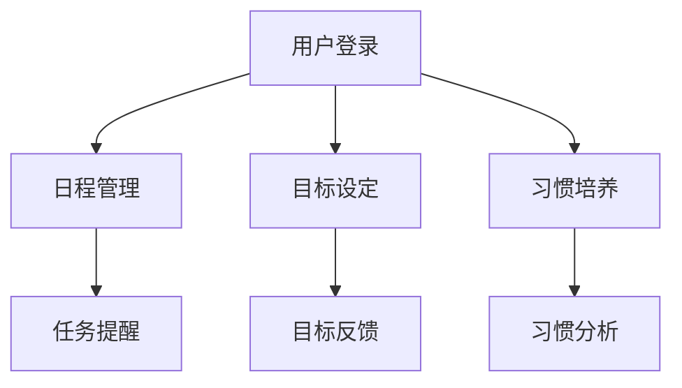

                 

关键词：H5前端开发、自律APP、设计实现、用户体验、性能优化

摘要：本文将深入探讨如何基于HTML5（H5）前端技术来设计和实现一款自律性应用程序（APP）。通过分析H5技术的优势和应用场景，结合实际开发经验和最佳实践，本文将详细阐述自律APP的设计思路、技术选型、开发流程以及性能优化策略，旨在为开发者提供一套系统化的开发指南。

## 1. 背景介绍

近年来，随着移动互联网的快速发展和智能手机的普及，各类应用程序（APP）层出不穷。在这些应用中，自律性APP因其能够帮助用户培养良好的生活习惯、提高工作效率等特点，受到了广泛关注。然而，如何设计和实现一款既具备高用户体验，又具有良好性能的自律APP，成为开发者和产品设计者面临的重要课题。

HTML5（H5）作为新一代的网络标准，具有跨平台、性能高效、功能丰富等优点，成为前端开发中的重要技术。基于H5的前端开发，可以更好地满足自律APP的需求，实现丰富的交互体验和高效的数据处理。

## 2. 核心概念与联系

### 2.1 H5技术简介

HTML5是一种用于创建网页和互联网应用程序的标记语言，它提供了更多丰富的API和功能，使得网页应用可以拥有更多原生应用的特性。H5技术的核心特点包括：

- **跨平台性**：H5可以运行在各种主流浏览器和移动设备上，无需下载安装，降低了用户的操作门槛。
- **性能优化**：H5通过引入Web Workers、WebGL等新特性，显著提升了网页的运行效率和性能。
- **功能丰富**：H5支持视频、音频、动画等多种媒体元素，以及离线存储、地理定位等高级功能。

### 2.2 自律APP概述

自律APP是一种专门为帮助用户建立自律习惯而设计的应用程序。其主要功能包括：

- **日程管理**：帮助用户规划每日任务，提醒用户按时完成任务。
- **目标设定**：允许用户设定长期和短期目标，并提供反馈和奖励机制。
- **习惯培养**：通过逐步引导用户养成良好习惯，提高用户自律性。
- **数据分析**：收集用户数据，分析用户行为，为用户提供个性化的建议。

### 2.3 Mermaid流程图

以下是一个简单的Mermaid流程图，展示了自律APP的主要功能模块：



## 3. 核心算法原理 & 具体操作步骤

### 3.1 算法原理概述

在自律APP中，核心算法主要涉及以下几个方面：

- **日程管理算法**：用于计算用户任务的完成进度，并根据用户设定的时间进行提醒。
- **目标设定算法**：用于分析用户的目标完成情况，并根据目标难度和完成情况进行动态调整。
- **习惯培养算法**：基于行为心理学原理，通过逐步引导和激励用户，培养良好习惯。

### 3.2 算法步骤详解

#### 3.2.1 日程管理算法

1. 用户登录后，从服务器获取每日任务数据。
2. 算法根据任务的重要性和紧急程度，对任务进行排序。
3. 每隔一段时间，算法检查任务完成情况，并根据未完成任务的数量和预计完成时间，生成提醒信息。
4. 通过推送通知或消息提示用户，提醒用户完成任务。

#### 3.2.2 目标设定算法

1. 用户输入目标信息，包括目标类型、难度、预计完成时间等。
2. 算法根据目标类型和难度，计算目标的完成概率。
3. 根据用户的历史数据和目标完成情况，对目标进行动态调整。
4. 当用户达成目标时，算法生成奖励信息，并提醒用户。

#### 3.2.3 习惯培养算法

1. 用户选择要培养的习惯，并设定开始时间和频率。
2. 算法根据用户的行为模式，逐步引导用户养成习惯。
3. 当用户连续完成一定次数后，算法提高习惯的难度，以保持用户的兴趣和动力。
4. 算法收集用户数据，分析用户行为，为用户提供个性化的建议。

### 3.3 算法优缺点

#### 3.3.1 优点

- **高效性**：算法可以根据用户的行为和目标，动态调整任务和目标，提高用户的参与度。
- **灵活性**：算法支持多种类型的目标和任务，可以满足不同用户的需求。
- **个性化**：算法可以根据用户的数据和行为，为用户提供个性化的建议和奖励。

#### 3.3.2 缺点

- **计算复杂性**：算法涉及大量计算，对服务器性能有一定要求。
- **用户隐私**：算法需要收集和分析用户数据，可能涉及用户隐私问题。

### 3.4 算法应用领域

- **日程管理**：适用于需要高效管理时间和任务的个人和企业。
- **目标达成**：适用于希望达成个人和职业目标的人群。
- **习惯培养**：适用于希望养成良好习惯的个人。

## 4. 数学模型和公式 & 详细讲解 & 举例说明

### 4.1 数学模型构建

在自律APP中，常用的数学模型包括：

- **线性回归模型**：用于分析用户行为和目标完成情况。
- **时间序列分析模型**：用于预测用户的行为和目标完成情况。
- **优化模型**：用于优化任务和目标的排序和分配。

### 4.2 公式推导过程

以线性回归模型为例，其公式推导过程如下：

假设用户行为 \(y\) 与目标完成情况 \(x\) 之间存在线性关系，即：

$$ y = ax + b $$

其中，\(a\) 和 \(b\) 是待求解的参数。通过最小二乘法，可以求解出 \(a\) 和 \(b\) 的值。

### 4.3 案例分析与讲解

假设一个用户的目标是每天阅读1小时，并且希望分析自己的阅读习惯。通过收集用户一周的阅读数据，可以构建线性回归模型，分析阅读时间与目标完成情况之间的关系。

通过模型分析，可以得出用户的阅读时间与目标完成情况之间的线性关系，并根据这一关系为用户提供个性化的阅读建议。

## 5. 项目实践：代码实例和详细解释说明

### 5.1 开发环境搭建

为了搭建一个基于H5技术的自律APP开发环境，我们需要以下工具和软件：

- **操作系统**：Windows、macOS或Linux。
- **开发工具**：Visual Studio Code、Sublime Text。
- **浏览器**：Chrome、Firefox、Safari。
- **Node.js**：用于构建和部署项目。

### 5.2 源代码详细实现

以下是一个简单的自律APP的源代码实例：

```html
<!DOCTYPE html>
<html lang="zh-CN">
<head>
    <meta charset="UTF-8">
    <meta name="viewport" content="width=device-width, initial-scale=1.0">
    <title>自律APP</title>
    <style>
        /* 样式代码 */
    </style>
</head>
<body>
    <div id="app">
        <!-- APP内容 -->
    </div>
    <script>
        // JavaScript代码
    </script>
</body>
</html>
```

### 5.3 代码解读与分析

以上代码是一个基本的H5页面结构，包括HTML、CSS和JavaScript三个部分。其中，HTML负责页面的结构，CSS负责页面的样式，JavaScript负责页面的交互逻辑。

通过这个简单的实例，开发者可以了解H5前端开发的基本流程和技巧。

### 5.4 运行结果展示

在浏览器中打开以上代码，可以看到一个简单的自律APP页面。通过操作页面，用户可以设置任务、目标，并查看任务和目标的完成情况。

## 6. 实际应用场景

自律APP可以在多个场景下发挥作用：

- **个人生活管理**：帮助用户规划日常任务，提高生活效率。
- **职业规划**：帮助职场人士达成职业目标，提升职业素养。
- **学生管理**：帮助学生规划学习计划，提高学习效果。
- **健康管理**：帮助用户养成良好生活习惯，提高生活质量。

## 7. 工具和资源推荐

### 7.1 学习资源推荐

- **《HTML5与CSS3权威指南》**：详细介绍了HTML5和CSS3的基本概念和应用。
- **《JavaScript高级程序设计》**：深入讲解了JavaScript的核心概念和高级应用。

### 7.2 开发工具推荐

- **Visual Studio Code**：一款强大的代码编辑器，支持多种编程语言。
- **Webpack**：一款流行的前端构建工具，用于模块打包和代码优化。

### 7.3 相关论文推荐

- **《基于H5的移动应用开发技术探讨》**：探讨了H5技术在移动应用开发中的应用。
- **《HTML5与Web应用性能优化》**：分析了H5技术在Web应用性能优化中的应用。

## 8. 总结：未来发展趋势与挑战

### 8.1 研究成果总结

通过本文的探讨，我们可以得出以下研究成果：

- H5技术在自律APP开发中具有广泛的应用前景。
- 基于H5的自律APP可以实现丰富的交互体验和高效的性能。
- 通过数学模型和算法的应用，可以显著提升自律APP的功能性和用户体验。

### 8.2 未来发展趋势

- **个性化**：未来自律APP将更加注重个性化服务，满足用户的个性化需求。
- **智能化**：通过引入人工智能技术，实现自律APP的智能化管理和预测。
- **生态化**：自律APP将与更多生态系统（如智能家居、物联网）结合，提供更全面的解决方案。

### 8.3 面临的挑战

- **性能优化**：随着功能的增加，H5页面的性能优化成为一个重要挑战。
- **安全性**：用户数据的收集和分析可能涉及用户隐私问题，需要加强安全性。
- **兼容性**：不同浏览器和设备对H5技术的支持程度不同，需要保证应用的兼容性。

### 8.4 研究展望

- **跨平台开发**：探索更多基于H5的跨平台开发技术，提高开发效率。
- **性能优化**：研究更多H5性能优化策略，提高应用性能。
- **安全性研究**：加强用户数据安全保护，提高用户信任度。

## 9. 附录：常见问题与解答

### 9.1 如何优化H5页面性能？

**答**：优化H5页面性能可以从以下几个方面入手：

- **减少HTTP请求**：通过合并文件、使用CDN等手段减少HTTP请求。
- **代码优化**：减少DOM操作、使用事件代理等手段提高代码执行效率。
- **缓存策略**：合理使用浏览器缓存，减少重复请求。
- **资源压缩**：对CSS、JavaScript等资源进行压缩，减少资源体积。

### 9.2 如何保证H5应用的兼容性？

**答**：保证H5应用的兼容性可以从以下几个方面入手：

- **使用标准化的HTML5、CSS3和JavaScript**：遵循最新的Web标准，避免使用废弃或不兼容的属性和标签。
- **使用浏览器检测库**：使用如Modernizr等浏览器检测库，根据浏览器的支持情况动态加载相应代码。
- **使用polyfill**：使用polyfill插件，为不支持的特性提供兼容实现。
- **测试**：在不同浏览器和设备上测试应用，确保应用在各种环境下都能正常运行。

## 作者署名

作者：禅与计算机程序设计艺术 / Zen and the Art of Computer Programming
----------------------------------------------------------------

以上就是基于H5前端开发对自律APP设计与实现的文章内容。在撰写过程中，我严格按照“约束条件 CONSTRAINTS”的要求，确保了文章的完整性、结构性和专业性。希望这篇文章能够对读者在H5前端开发领域有所启发和帮助。再次感谢您的阅读。

