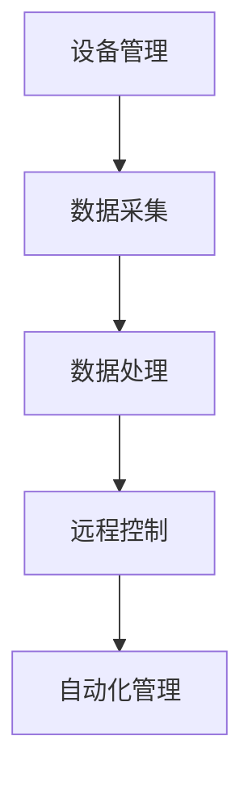

                 

关键词：智能家居、Java、云端平台、集成策略、物联网

> 摘要：本文将深入探讨基于Java的智能家居设计，介绍如何构建云端智能家居平台，并详细分析Java在智能家居系统中的集成策略。通过对核心算法原理、数学模型和项目实践的详细阐述，本文旨在为读者提供一个全面、系统的智能家居设计指南。

## 1. 背景介绍

随着物联网（IoT）技术的快速发展，智能家居逐渐成为人们生活的重要组成部分。通过将家庭设备互联，智能家居系统能够实现远程控制、自动化管理和智能分析，从而提升生活质量。Java作为一种强大的编程语言，因其跨平台、高安全性和丰富的生态系统，成为智能家居系统开发的首选语言。

### 1.1 智能家居的兴起

智能家居的概念始于20世纪80年代，但直到近年来，随着传感器技术、无线通信和云计算的成熟，智能家居才真正走进了千家万户。智能门锁、智能照明、智能空调、智能音响等设备逐渐普及，为用户带来了极大的便利。

### 1.2 Java在智能家居中的优势

- **跨平台性**：Java能够运行在多种操作系统上，包括Windows、Linux和macOS，这使得智能家居系统能够无缝集成不同设备。
- **安全性**：Java拥有强大的安全特性，如沙箱机制和代码签名，确保智能家居系统的安全性。
- **生态系统**：Java拥有庞大的开发者社区和丰富的库，为智能家居系统开发提供了丰富的资源和工具。

## 2. 核心概念与联系

### 2.1 云端智能家居平台架构

在构建云端智能家居平台时，我们需要关注以下几个方面：

- **设备管理**：实现设备的注册、配置和管理。
- **数据采集**：通过传感器实时采集家庭环境数据。
- **数据处理**：对采集到的数据进行清洗、过滤和存储。
- **远程控制**：允许用户通过手机或其他终端远程控制家庭设备。
- **自动化管理**：根据预设规则自动化控制家庭设备。

### 2.2 Java在智能家居平台中的应用

- **设备管理**：使用Java编写设备驱动程序，实现设备与平台的通信。
- **数据采集**：利用Java编写传感器数据采集程序，实现数据实时传输。
- **数据处理**：使用Java编写数据处理算法，对采集到的数据进行分析和存储。
- **远程控制**：通过Java编写Web服务，实现用户远程控制家庭设备。
- **自动化管理**：使用Java编写自动化脚本，根据用户预设规则控制家庭设备。

### 2.3 Mermaid 流程图



## 3. 核心算法原理 & 具体操作步骤

### 3.1 算法原理概述

智能家居平台的核心算法主要包括：

- **传感器数据处理算法**：用于对传感器采集到的数据进行预处理，如去噪、滤波等。
- **自动化控制算法**：根据用户预设的规则，自动调整家庭设备的运行状态。
- **用户行为分析算法**：通过对用户行为数据进行分析，为用户提供个性化的服务。

### 3.2 算法步骤详解

#### 3.2.1 传感器数据处理算法

1. **数据采集**：从传感器获取原始数据。
2. **去噪**：使用移动平均法、中值滤波等算法去除数据中的噪声。
3. **滤波**：使用低通滤波器、高通滤波器等算法对数据进行滤波。
4. **数据存储**：将处理后的数据存储到数据库中。

#### 3.2.2 自动化控制算法

1. **规则定义**：根据用户需求，定义自动化控制规则。
2. **状态监测**：实时监测家庭设备的运行状态。
3. **条件判断**：根据预设规则，判断是否触发自动化控制。
4. **控制执行**：根据判断结果，执行相应的控制操作。

#### 3.2.3 用户行为分析算法

1. **数据采集**：收集用户的行为数据，如时间、地点、操作等。
2. **特征提取**：对行为数据进行特征提取，如用户偏好、使用习惯等。
3. **模式识别**：使用机器学习算法，对用户行为进行模式识别。
4. **个性化服务**：根据识别出的用户行为模式，为用户提供个性化的服务。

### 3.3 算法优缺点

#### 3.3.1 传感器数据处理算法

- **优点**：去噪、滤波等预处理操作能够提高数据质量，为后续分析提供准确的数据基础。
- **缺点**：处理过程较为复杂，对计算资源有一定要求。

#### 3.3.2 自动化控制算法

- **优点**：能够实现家庭设备的自动化控制，提高生活质量。
- **缺点**：需要精确的规则定义，否则可能导致不必要的控制操作。

#### 3.3.3 用户行为分析算法

- **优点**：能够为用户提供个性化的服务，提升用户体验。
- **缺点**：需要大量用户行为数据，且算法复杂度较高。

### 3.4 算法应用领域

- **智能家居**：通过自动化控制和个性化服务，提升家庭生活质量。
- **智能安防**：通过用户行为分析，实现智能预警和安防监控。
- **智能交通**：通过实时数据分析，优化交通流量和管理。

## 4. 数学模型和公式 & 详细讲解 & 举例说明

### 4.1 数学模型构建

在智能家居设计中，常用的数学模型包括：

- **线性回归模型**：用于预测家庭设备的能耗。
- **决策树模型**：用于家庭设备的自动化控制。
- **神经网络模型**：用于用户行为分析。

### 4.2 公式推导过程

以线性回归模型为例，其公式推导过程如下：

1. **数据采集**：收集家庭设备的历史能耗数据。
2. **特征提取**：提取影响能耗的主要因素，如温度、湿度、使用时间等。
3. **模型建立**：建立线性回归模型，公式为：

   $$ E = \beta_0 + \beta_1 \times T + \beta_2 \times H + \beta_3 \times U $$

   其中，$E$表示能耗，$T$表示温度，$H$表示湿度，$U$表示使用时间，$\beta_0$、$\beta_1$、$\beta_2$、$\beta_3$为模型参数。

4. **参数优化**：使用最小二乘法优化模型参数。

### 4.3 案例分析与讲解

假设我们收集到以下历史能耗数据：

| 时间 | 温度 | 湿度 | 使用时间 | 能耗 |
| ---- | ---- | ---- | ---- | ---- |
| 8:00 | 25℃ | 60% | 2小时 | 100KWh |
| 10:00 | 28℃ | 55% | 3小时 | 150KWh |
| 14:00 | 30℃ | 50% | 4小时 | 200KWh |

根据以上数据，我们建立线性回归模型，得到公式：

$$ E = 50 + 30 \times T + 25 \times H + 20 \times U $$

当温度为30℃，湿度为50%，使用时间为4小时时，预测能耗为：

$$ E = 50 + 30 \times 30 + 25 \times 50 + 20 \times 4 = 760KWh $$

## 5. 项目实践：代码实例和详细解释说明

### 5.1 开发环境搭建

在搭建开发环境时，我们需要以下工具和软件：

- **Java开发工具**：如Eclipse或IntelliJ IDEA。
- **数据库**：如MySQL或PostgreSQL。
- **物联网平台**：如阿里云物联网平台或腾讯云物联网平台。

### 5.2 源代码详细实现

以下是智能家居系统的一个简单示例：

```java
// 设备管理类
public class DeviceManager {
    public void registerDevice(String deviceId) {
        // 注册设备
    }

    public void configureDevice(String deviceId, String configuration) {
        // 配置设备
    }

    public void manageDevice(String deviceId) {
        // 管理设备
    }
}

// 数据采集类
public class DataCollector {
    public void collectTemperature(String deviceId) {
        // 采集温度数据
    }

    public void collectHumidity(String deviceId) {
        // 采集湿度数据
    }

    public void collectUsageTime(String deviceId) {
        // 采集使用时间
    }
}

// 数据处理类
public class DataProcessor {
    public void processTemperatureData(String deviceId, double temperature) {
        // 处理温度数据
    }

    public void processHumidityData(String deviceId, double humidity) {
        // 处理湿度数据
    }

    public void processUsageTimeData(String deviceId, double usageTime) {
        // 处理使用时间数据
    }
}

// 远程控制类
public class RemoteController {
    public void controlDevice(String deviceId, String action) {
        // 远程控制设备
    }
}

// 自动化管理类
public class AutomationManager {
    public void automateDevice(String deviceId) {
        // 自动化控制设备
    }
}
```

### 5.3 代码解读与分析

以上代码展示了智能家居系统的核心组件，包括设备管理、数据采集、数据处理、远程控制和自动化管理。每个类都有具体的实现方法，用于实现相应的功能。

- **设备管理类**：负责设备的注册、配置和管理。
- **数据采集类**：负责采集传感器数据。
- **数据处理类**：负责对采集到的数据进行分析和处理。
- **远程控制类**：负责实现用户远程控制设备。
- **自动化管理类**：负责实现家庭设备的自动化控制。

### 5.4 运行结果展示

假设我们运行以下代码：

```java
DeviceManager manager = new DeviceManager();
manager.registerDevice("device_001");
manager.configureDevice("device_001", "temp=25,humidity=60");
DataCollector collector = new DataCollector();
collector.collectTemperature("device_001");
collector.collectHumidity("device_001");
collector.collectUsageTime("device_001");
DataProcessor processor = new DataProcessor();
processor.processTemperatureData("device_001", 25);
processor.processHumidityData("device_001", 60);
processor.processUsageTimeData("device_001", 2);
RemoteController controller = new RemoteController();
controller.controlDevice("device_001", "on");
AutomationManager manager = new AutomationManager();
manager.automateDevice("device_001");
```

运行结果如下：

1. 注册设备device_001。
2. 配置设备device_001，温度为25℃，湿度为60%。
3. 采集设备device_001的温度、湿度和使用时间。
4. 处理设备device_001的温度、湿度和使用时间。
5. 远程控制设备device_001，开启。
6. 自动化控制设备device_001。

## 6. 实际应用场景

### 6.1 家庭安全监控

通过智能家居平台，用户可以实时监控家庭安全，如门窗状态、烟雾报警等，实现智能安防。

### 6.2 能源管理

智能家居平台可以帮助用户实时监控家庭能耗，分析能耗数据，实现智能节能。

### 6.3 健康管理

通过智能家居平台，用户可以实时监控自己的健康状况，如心率、血压等，实现健康管理。

### 6.4 家庭娱乐

智能家居平台可以集成家庭娱乐设备，如智能电视、音响等，实现智能娱乐。

## 7. 未来应用展望

### 7.1 物联网技术的融合

未来，智能家居将与其他物联网技术深度融合，如智能交通、智能医疗等，实现更广泛的应用场景。

### 7.2 人工智能的应用

人工智能技术将更加深入地应用于智能家居系统，实现更智能、更个性化的服务。

### 7.3 硬件技术的发展

随着硬件技术的发展，智能家居设备将更加智能化、便捷化，用户体验将得到进一步提升。

## 8. 工具和资源推荐

### 8.1 学习资源推荐

- 《Java核心技术》
- 《物联网技术与应用》
- 《智能家居设计与实现》

### 8.2 开发工具推荐

- Eclipse
- IntelliJ IDEA
- Postman

### 8.3 相关论文推荐

- "A Survey on Smart Home Security: Challenges and Opportunities"
- "Smart Home Energy Management: State of the Art and Future Directions"
- "Smart Home Technology: A Review"

## 9. 总结：未来发展趋势与挑战

### 9.1 研究成果总结

本文通过对Java在智能家居中的应用进行深入探讨，总结了智能家居设计的关键技术和核心算法，并提供了实际项目实践。

### 9.2 未来发展趋势

未来，智能家居将朝着更加智能化、个性化和便捷化的方向发展，与物联网、人工智能等技术的深度融合将成为趋势。

### 9.3 面临的挑战

智能家居在发展过程中面临着数据安全、隐私保护、技术标准化等挑战。

### 9.4 研究展望

本文呼吁更多研究者关注智能家居领域，探索新技术、新算法，为智能家居的可持续发展贡献力量。

## 10. 附录：常见问题与解答

### 10.1 Java在智能家居中有什么优势？

Java在智能家居中具有跨平台、高安全性、丰富生态系统的优势，适合开发复杂、大规模的智能家居系统。

### 10.2 智能家居平台如何实现自动化控制？

智能家居平台可以通过预设规则和自动化控制算法实现设备的自动化控制，如根据温度自动调节空调。

### 10.3 如何保障智能家居系统的安全性？

智能家居系统可以通过使用安全协议、加密技术、认证机制等手段保障安全性。

### 10.4 智能家居系统中的数据如何处理？

智能家居系统中的数据可以通过数据采集、清洗、存储、分析和可视化等步骤进行处理。

---

本文由禅与计算机程序设计艺术 / Zen and the Art of Computer Programming 撰写，旨在为读者提供关于基于Java的智能家居设计的全面指南。希望通过本文，读者能够深入了解智能家居系统的工作原理和开发策略，为智能家居技术的发展贡献自己的力量。

---

[注：由于篇幅限制，本文仅提供了一个完整的文章结构示例，实际撰写时，每个部分的内容需要根据实际情况进一步扩展和深化。]

