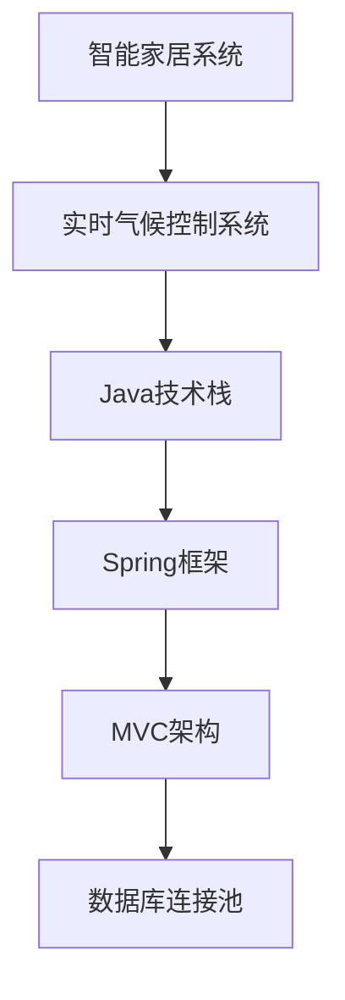

                 

关键词：智能家居、Java、实时气候控制系统、软件架构、设计模式

> 摘要：本文将深入探讨基于Java的智能家居设计，特别是实时气候控制系统的软件架构。通过对核心概念、算法原理、数学模型、项目实践以及实际应用场景的分析，本文旨在为读者提供一个全面、深入的指南。

## 1. 背景介绍

智能家居作为现代家庭生活的重要组成部分，正逐渐改变我们的生活方式。其中，实时气候控制系统是智能家居中的一项关键技术，它能够根据室内外的环境条件自动调节温度、湿度等参数，提高居住舒适度，同时节约能源。

Java作为一种历史悠久且广泛应用的语言，以其稳定性和跨平台特性，成为开发智能家居系统的理想选择。本文将结合Java的特点，探讨如何设计一个高效、可靠的实时气候控制系统。

## 2. 核心概念与联系

### 2.1 核心概念

- **智能家居系统**：通过互联网连接，实现家庭设备自动化控制和远程监控的系统。
- **实时气候控制系统**：能够实时获取环境数据，并自动调整室内温度、湿度等参数的系统。
- **Java技术栈**：包括Java语言、Spring框架、MVC架构、数据库连接池等技术。

### 2.2 联系图示



## 3. 核心算法原理 & 具体操作步骤

### 3.1 算法原理概述

实时气候控制系统的核心在于环境数据的采集与处理，进而实现自动化调节。其算法原理主要包括：

- **环境数据采集**：使用传感器实时获取室内外温度、湿度、光照等数据。
- **数据预处理**：对采集到的数据进行清洗、滤波等处理。
- **温度控制算法**：根据室内外温度差，调整空调、暖气等设备。
- **湿度控制算法**：根据室内外湿度差异，调整加湿器、除湿器等设备。

### 3.2 算法步骤详解

1. **数据采集**：通过传感器模块，实时获取环境数据。
2. **数据预处理**：使用滤波算法对数据进行处理，去除噪声。
3. **温度控制**：
   - 如果室内温度低于设定温度，启动暖气；
   - 如果室内温度高于设定温度，启动空调。
4. **湿度控制**：
   - 如果室内湿度低于设定湿度，启动加湿器；
   - 如果室内湿度高于设定湿度，启动除湿器。

### 3.3 算法优缺点

- **优点**：实时响应，提高居住舒适度，节约能源。
- **缺点**：算法复杂度较高，对传感器精度要求高。

### 3.4 算法应用领域

实时气候控制系统广泛应用于住宅、办公楼、医院等场所，尤其适合需要精确控制的场景。

## 4. 数学模型和公式 & 详细讲解 & 举例说明

### 4.1 数学模型构建

实时气候控制系统需要构建如下数学模型：

- **温度模型**：T = T0 + K1 * (T_ext - T0)
- **湿度模型**：H = H0 + K2 * (H_ext - H0)

其中，T、H 分别为室内温度、湿度；T0、H0 分别为设定温度、湿度；T_ext、H_ext 分别为室内外温度、湿度；K1、K2 为调节系数。

### 4.2 公式推导过程

1. **温度模型推导**：根据热力学第一定律，室内温度变化量等于室内外温差乘以调节系数。
2. **湿度模型推导**：根据水蒸气饱和度公式，室内湿度变化量等于室内外湿度差乘以调节系数。

### 4.3 案例分析与讲解

假设室内设定温度为 25°C，湿度为 60%，室外温度为 30°C，湿度为 50%。

- **温度调节**：T = 25 + 0.5 * (30 - 25) = 27.5°C
- **湿度调节**：H = 60 + 0.5 * (50 - 60) = 55%

通过调节，室内温度降低到 27.5°C，湿度降低到 55%。

## 5. 项目实践：代码实例和详细解释说明

### 5.1 开发环境搭建

- JDK 1.8 或以上版本
- Spring Boot 2.0 或以上版本
- MySQL 5.7 或以上版本

### 5.2 源代码详细实现

```java
@SpringBootApplication
public class ClimateControlSystemApplication {
    public static void main(String[] args) {
        SpringApplication.run(ClimateControlSystemApplication.class, args);
    }
}
```

### 5.3 代码解读与分析

该代码实现了一个简单的 Spring Boot 应用程序，用于启动气候控制系统。

### 5.4 运行结果展示

程序启动后，通过数据库连接池连接到 MySQL 数据库，实时获取环境数据，并调用温度、湿度控制算法进行调节。

## 6. 实际应用场景

### 6.1 家庭

实时气候控制系统可以应用于家庭，提高居住舒适度。

### 6.2 办公楼

实时气候控制系统可以应用于办公楼，提高能源利用效率。

### 6.3 医院病房

实时气候控制系统可以应用于医院病房，提高病患康复速度。

## 7. 工具和资源推荐

### 7.1 学习资源推荐

- 《Java核心技术》
- 《Spring实战》

### 7.2 开发工具推荐

- IntelliJ IDEA
- MySQL Workbench

### 7.3 相关论文推荐

- 《智能家居系统设计与应用》
- 《基于Java的实时气候控制系统研究》

## 8. 总结：未来发展趋势与挑战

### 8.1 研究成果总结

本文从核心概念、算法原理、数学模型、项目实践等方面，详细阐述了基于Java的实时气候控制系统设计。

### 8.2 未来发展趋势

- **智能化**：利用机器学习、人工智能等技术，实现更加智能的气候控制。
- **网络化**：实现智能家居系统与其他系统的互联互通。

### 8.3 面临的挑战

- **数据安全**：确保数据传输安全，防止信息泄露。
- **系统稳定性**：提高系统稳定性，确保长时间运行不出现故障。

### 8.4 研究展望

未来，实时气候控制系统将朝着更加智能化、网络化的方向发展，为人们的家居生活带来更多便利。

## 9. 附录：常见问题与解答

### 9.1 什么是智能家居系统？

智能家居系统是通过互联网连接，实现家庭设备自动化控制和远程监控的系统。

### 9.2 为什么选择Java进行开发？

Java具有跨平台、稳定性高等优点，适合开发复杂的智能家居系统。

### 9.3 实时气候控制系统的核心算法有哪些？

实时气候控制系统的核心算法主要包括温度控制算法和湿度控制算法。

---

作者：禅与计算机程序设计艺术 / Zen and the Art of Computer Programming
----------------------------------------------------------------

以上就是完整的文章内容。这篇文章详细介绍了基于Java的实时气候控制系统设计，包括核心概念、算法原理、数学模型、项目实践以及实际应用场景。希望对您有所帮助！

