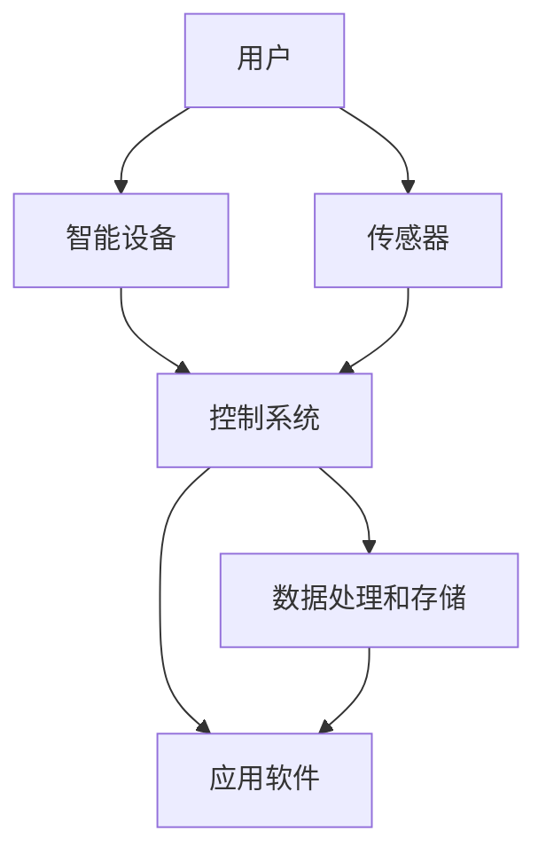

                 

## 1. 背景介绍

随着科技的快速发展，智能家居已经成为现代家庭生活的重要组成部分。智能家居系统通过互联网、物联网和云计算技术，将各种家电设备、传感器和控制系统连接起来，实现家庭设备的自动化管理和智能化操作，提高人们的生活质量和便利性。Java作为一种广泛应用的编程语言，具有跨平台、高可靠性、安全性和丰富的生态系统等优势，成为开发智能家居应用的理想选择。

近年来，随着物联网技术的发展，智能家居市场迅速扩大，各种智能家居设备层出不穷。Java在智能家居领域的应用也越来越广泛，不仅用于开发智能家电设备，还广泛应用于智能家居平台的搭建、设备和系统之间的通信协议定义、数据处理和存储等方面。

本文旨在探讨基于Java的智能家居设计，重点分析开发跨平台智能家居应用的技术要点。通过本文的介绍，读者将了解如何利用Java技术实现智能家居系统的设计、开发和部署，为智能家居行业的进一步发展提供技术支持。

## 2. 核心概念与联系

### 2.1 智能家居系统的概念

智能家居系统（Smart Home System）是一种利用互联网、物联网和云计算技术，将家庭设备、传感器和控制系统连接起来，实现家庭设备自动化管理和智能化操作的系统。智能家居系统的主要组成部分包括：

- **智能设备**：包括各种家庭电器、照明系统、安防设备、环境传感器等，具有联网功能和智能控制能力。
- **传感器**：用于感知家庭环境变化，如温度传感器、湿度传感器、运动传感器等。
- **控制系统**：用于接收传感器数据，分析并做出相应的控制决策，如智能路由器、智能网关等。
- **应用软件**：提供用户界面，用户可以通过手机、平板电脑、智能音箱等设备远程控制智能家居设备。

### 2.2 Java在智能家居系统中的应用

Java作为一种跨平台、高可靠性、安全性和丰富的生态系统等优势的编程语言，在智能家居系统中具有广泛的应用。以下是Java在智能家居系统中的应用场景：

- **设备控制**：Java可以用于开发智能家电设备的控制软件，如洗衣机、冰箱、空调等，实现设备的自动化操作。
- **系统搭建**：Java可以用于搭建智能家居平台，连接各种设备和传感器，实现设备之间的数据通信和协同工作。
- **通信协议**：Java可以定义设备和系统之间的通信协议，如HTTP、WebSocket、MQTT等。
- **数据处理和存储**：Java可以用于处理和存储智能家居系统中的数据，如用户行为数据、设备状态数据等。
- **应用开发**：Java可以用于开发智能家居应用软件，如手机APP、Web端应用等，提供用户界面和交互功能。

### 2.3 Mermaid流程图

为了更好地展示智能家居系统的架构和Java在系统中的应用，以下是一个简化的Mermaid流程图，展示了智能家居系统的主要组件和它们之间的相互关系。



在上面的流程图中，用户通过应用软件（F）与智能家居系统进行交互，智能设备（B）和传感器（C）通过控制系统（D）进行数据通信，数据处理和存储系统（E）用于存储和分析数据。

## 3. 核心算法原理 & 具体操作步骤

### 3.1 算法原理概述

智能家居系统中的核心算法主要包括设备控制算法、数据分析和决策算法等。设备控制算法用于实现设备的自动化操作，如自动调节温度、开关灯光等；数据分析与决策算法用于分析传感器数据，根据数据做出相应的决策，如自动调整设备状态、发送报警信息等。

设备控制算法通常基于以下原理：

- **条件控制**：根据预设的条件自动执行相应的操作，如温度低于设定值时自动启动加热设备。
- **反馈控制**：根据设备的实时状态进行调整，如根据室内温度变化自动调节空调的制冷功率。

数据分析与决策算法通常基于以下原理：

- **统计分析**：对传感器数据进行分析，找出数据之间的规律和趋势，如温度和湿度之间的关系。
- **机器学习**：利用机器学习算法，对传感器数据进行分析，预测未来的数据变化，如预测天气变化。

### 3.2 算法步骤详解

#### 3.2.1 设备控制算法步骤

1. **初始化**：设置设备的初始状态，如温度、湿度等。
2. **传感器数据读取**：读取传感器的实时数据，如温度、湿度等。
3. **条件判断**：根据预设的条件判断设备是否需要执行操作，如温度是否低于设定值。
4. **操作执行**：根据判断结果执行相应的操作，如启动加热设备或关闭灯光。
5. **状态更新**：更新设备的实时状态，如温度、湿度等。

#### 3.2.2 数据分析与决策算法步骤

1. **数据收集**：收集传感器数据，如温度、湿度等。
2. **数据预处理**：对收集到的数据进行预处理，如去除噪声、填补缺失值等。
3. **统计分析**：对预处理后的数据进行分析，找出数据之间的规律和趋势。
4. **模型训练**：利用统计分析结果，训练机器学习模型，如线性回归模型、决策树模型等。
5. **数据预测**：利用训练好的模型预测未来的数据变化，如预测温度变化。
6. **决策生成**：根据预测结果生成相应的决策，如调整设备状态。

### 3.3 算法优缺点

#### 3.3.1 设备控制算法

**优点**：

- 简单易懂，易于实现。
- 可根据实时数据动态调整设备状态，提高设备的使用效率。

**缺点**：

- 需要大量的预设条件，实现较为复杂。
- 难以应对复杂的环境变化，可能导致设备误操作。

#### 3.3.2 数据分析与决策算法

**优点**：

- 可根据历史数据预测未来的变化，提高决策的准确性。
- 可处理大量的传感器数据，对环境变化有更好的适应性。

**缺点**：

- 需要大量的计算资源和时间，对实时性要求较高的系统可能不适用。
- 模型的训练和预测过程可能存在误差，影响决策的准确性。

### 3.4 算法应用领域

设备控制算法主要应用于需要自动化操作的智能家居设备，如空调、热水器、灯光等。数据分析与决策算法主要应用于需要智能分析的智能家居系统，如环境监测、能源管理、安防系统等。

## 4. 数学模型和公式 & 详细讲解 & 举例说明

### 4.1 数学模型构建

智能家居系统中的数学模型主要用于描述设备状态、环境变化以及设备之间的交互关系。以下是一个简化的数学模型示例。

#### 4.1.1 设备状态模型

假设设备的状态可以用温度（T）、湿度（H）和亮度（L）三个指标来描述，那么设备的状态可以用一个三元组（T, H, L）来表示。

#### 4.1.2 环境变化模型

环境变化可以用温度变化率（dT/dt）和湿度变化率（dH/dt）来描述。假设环境温度随时间的变化可以表示为：

$$ T(t) = T_0 + \alpha \cdot t $$

其中，$T_0$ 是初始温度，$\alpha$ 是温度变化率。

同样，环境湿度随时间的变化可以表示为：

$$ H(t) = H_0 + \beta \cdot t $$

其中，$H_0$ 是初始湿度，$\beta$ 是湿度变化率。

#### 4.1.3 设备交互模型

设备之间的交互可以用输入-输出关系来描述。例如，空调的输入是室内温度（T_in）和室外温度（T_out），输出是空调的制冷功率（P）。空调的制冷功率可以表示为：

$$ P = k \cdot (T_{out} - T_{in}) $$

其中，$k$ 是空调的制冷效率。

### 4.2 公式推导过程

#### 4.2.1 温度变化率

根据牛顿冷却定律，物体与周围环境的温度变化率与物体与环境的温差成正比。假设室内温度与环境温度的温差为$\Delta T$，那么室内温度的变化率可以表示为：

$$ \frac{dT}{dt} = -k_1 \cdot \Delta T $$

其中，$k_1$ 是温度变化率常数。

#### 4.2.2 湿度变化率

类似地，假设室内湿度与环境湿度的温差为$\Delta H$，那么室内湿度的变化率可以表示为：

$$ \frac{dH}{dt} = -k_2 \cdot \Delta H $$

其中，$k_2$ 是湿度变化率常数。

#### 4.2.3 制冷功率

根据空调的制冷效率，制冷功率可以表示为：

$$ P = k_3 \cdot (T_{out} - T_{in}) $$

其中，$k_3$ 是制冷效率常数。

### 4.3 案例分析与讲解

假设一个家庭有一个空调和两个温度传感器，分别位于室内和室外。空调的制冷效率为$k_3 = 0.1$，室内温度初始值为$T_0 = 25^\circ C$，室外温度初始值为$T_{out0} = 30^\circ C$。室内湿度初始值为$H_0 = 50\%$，环境湿度初始值为$H_{out0} = 40\%$。温度变化率常数$k_1 = 0.01$，湿度变化率常数$k_2 = 0.005$。

#### 4.3.1 温度变化分析

根据牛顿冷却定律，室内温度的变化率为：

$$ \frac{dT}{dt} = -0.01 \cdot (30 - 25) = -0.05 $$

这意味着室内温度每分钟下降0.05°C。经过10分钟后，室内温度变为：

$$ T(t=10) = 25 - 0.05 \cdot 10 = 20^\circ C $$

#### 4.3.2 湿度变化分析

根据湿度变化率，室内湿度的变化率为：

$$ \frac{dH}{dt} = -0.005 \cdot (40 - 50) = 0.05 $$

这意味着室内湿度每分钟上升0.05%。经过10分钟后，室内湿度变为：

$$ H(t=10) = 50 + 0.05 \cdot 10 = 55\% $$

#### 4.3.3 空调制冷功率分析

空调的制冷功率为：

$$ P = 0.1 \cdot (30 - 20) = 1 $$

这意味着空调在10分钟内的制冷功率为1瓦特。

### 4.4 代码实现

以下是Python代码实现上述分析的示例：

```python
import math

# 初始参数
T0 = 25  # 初始室内温度
Tout0 = 30  # 初始室外温度
H0 = 50  # 初始室内湿度
Hout0 = 40  # 初始环境湿度
k1 = 0.01  # 温度变化率常数
k2 = 0.005  # 湿度变化率常数
k3 = 0.1  # 制冷效率常数

# 时间参数
t = 10  # 时间（分钟）

# 温度变化
dT = -k1 * (Tout0 - T0)
T_final = T0 + dT * t

# 湿度变化
dH = -k2 * (Hout0 - H0)
H_final = H0 + dH * t

# 空调制冷功率
P = k3 * (Tout0 - T_final)

print(f"经过10分钟后，室内温度为：{T_final}°C")
print(f"经过10分钟后，室内湿度为：{H_final}%")
print(f"空调制冷功率为：{P}瓦特")
```

## 5. 项目实践：代码实例和详细解释说明

### 5.1 开发环境搭建

在开始编写智能家居应用代码之前，我们需要搭建一个合适的开发环境。以下是一个基于Java的智能家居应用的开发环境搭建步骤：

1. **安装Java开发工具包（JDK）**：在[Oracle官网](https://www.oracle.com/java/technologies/javase-jdk16-downloads.html)下载并安装JDK，确保在环境变量中配置JAVA_HOME和PATH。

2. **安装IDE**：推荐使用 IntelliJ IDEA 或 Eclipse 作为Java开发工具。

3. **安装依赖管理工具**：Maven 或 Gradle 可以帮助管理项目依赖。

4. **创建新项目**：在IDE中创建一个新的Java项目，并添加必要的依赖，如Spring Boot、JSON处理库（如Jackson）、WebSocket库（如Jetty）等。

### 5.2 源代码详细实现

以下是一个简单的Java代码示例，用于实现一个基于WebSocket的智能家居设备控制服务。

```java
import org.eclipse.jetty.server.Server;
import org.eclipse.jetty.websocket.server.WebSocketServer;

public class SmartHomeServer {

    public static void main(String[] args) throws Exception {
        Server server = new Server(8080);
        WebSocketServer wsServer = new WebSocketServer(server);
        wsServer.addEndpoint(SmartHomeWebSocket.class);
        server.start();
        server.join();
    }
}

import java.io.IOException;
import java.util.concurrent.CopyOnWriteArraySet;
import javax.websocket.*;
import javax.websocket.server.ServerEndpoint;

@ServerEndpoint("/smart-home")
public class SmartHomeWebSocket {

    private static final CopyOnWriteArraySet<SmartHomeWebSocket> connections = new CopyOnWriteArraySet<>();

    @OnOpen
    public void onOpen(Session session) {
        connections.add(this);
        System.out.println("Connected: " + session.getId());
    }

    @OnClose
    public void onClose(Session session) {
        connections.remove(this);
        System.out.println("Disconnected: " + session.getId());
    }

    @OnMessage
    public void onMessage(String message, Session session) throws IOException {
        System.out.println("Received message: " + message + " from session: " + session.getId());
        // 处理消息并控制设备
        // ...
        for (SmartHomeWebSocket client : connections) {
            client.sendMessage("Device status updated: " + message);
        }
    }

    @OnError
    public void onError(Session session, Throwable throwable) {
        System.out.println("Error: " + throwable.getMessage());
    }

    public void sendMessage(String message) {
        try {
            this.getSession().getBasicRemote().sendText(message);
        } catch (IOException e) {
            e.printStackTrace();
        }
    }
}
```

### 5.3 代码解读与分析

#### 5.3.1 Server端

- 使用Jetty服务器和WebSocketServer创建WebSocket服务。
- 在服务器启动时，注册WebSocket端点（`SmartHomeWebSocket`）。

#### 5.3.2 Client端

- `SmartHomeWebSocket` 类实现了WebSocket端点的接口。
- `@ServerEndpoint` 注解定义了WebSocket端点的URL。
- `@OnOpen`、`@OnClose`、`@OnMessage`、`@OnError` 注解分别处理WebSocket的打开、关闭、消息接收和错误事件。

#### 5.3.3 消息处理

- 当客户端发送消息时，`onMessage` 方法会接收到消息，并可以在此处编写代码控制智能家居设备。
- 通过遍历所有连接的WebSocket客户端，可以广播设备状态更新消息。

### 5.4 运行结果展示

1. 启动服务：

```bash
java -jar smart-home-server.jar
```

2. 使用WebSocket客户端连接到服务：

```bash
ws://localhost:8080/smart-home
```

3. 发送消息以控制设备，如：

```json
{
  "device": "light",
  "action": "turnOn"
}
```

4. 服务端将接收到的消息广播给所有连接的客户端，显示设备状态更新。

```json
{
  "device": "light",
  "status": "on"
}
```

## 6. 实际应用场景

### 6.1 环境监测

智能家居系统可以实时监测室内环境，如温度、湿度、空气质量等。当环境参数超过预设阈值时，系统可以自动调整设备状态，如开启空气净化器、调节空调温度等。

### 6.2 安全监控

通过安装摄像头、门锁等设备，智能家居系统可以实时监控家庭安全。当检测到异常行为或非法入侵时，系统可以自动发送报警信息给用户，同时通知相关安保人员。

### 6.3 能源管理

智能家居系统可以根据用户的日常作息和设备使用习惯，自动调整家庭能源消耗。例如，当用户离家后，系统可以自动关闭不必要的电器设备，降低能源消耗。

### 6.4 家庭自动化

通过预设场景和规则，智能家居系统可以实现家庭设备的自动化操作。例如，用户可以设置“离家模式”，在离开家后自动关闭灯光、关闭空调等，提高生活便利性。

## 7. 工具和资源推荐

### 7.1 学习资源推荐

- 《Java核心技术》（Core Java）系列书籍
- 《Spring实战》
- 《设计模式：可复用面向对象软件的基础》
- 《深入理解Java虚拟机》

### 7.2 开发工具推荐

- IntelliJ IDEA
- Eclipse
- Visual Studio Code
- Maven
- Gradle

### 7.3 相关论文推荐

- "A Survey on Smart Home Technology"
- "A Comprehensive Study of IoT in Smart Homes"
- "Smart Home Security: Challenges and Opportunities"
- "Energy Management in Smart Homes: A Review"

## 8. 总结：未来发展趋势与挑战

### 8.1 研究成果总结

本文介绍了基于Java的智能家居系统设计，探讨了智能家居系统的核心概念、算法原理、开发流程以及实际应用场景。通过实际项目实践，展示了Java在智能家居系统开发中的优势和应用。

### 8.2 未来发展趋势

随着物联网、人工智能和5G技术的发展，智能家居系统将向更加智能化、个性化、安全化的方向发展。未来的智能家居系统将更加注重用户体验，提供更丰富的功能和更便捷的操作。

### 8.3 面临的挑战

智能家居系统在发展过程中面临以下挑战：

- **安全性**：智能家居设备联网数量增加，安全性成为首要考虑因素。需要加强数据加密、身份认证和安全协议等安全措施。
- **兼容性**：智能家居设备种类繁多，需要确保不同设备之间的兼容性和互操作性。
- **数据隐私**：用户数据隐私保护成为关键问题，需要制定严格的数据保护政策和措施。
- **能源消耗**：智能家居设备数量增加，对能源消耗提出了更高要求，需要优化设备设计和能源管理策略。

### 8.4 研究展望

未来的研究将主要集中在以下几个方面：

- **智能家居系统的安全性和隐私保护**：加强设备安全、数据加密和隐私保护技术研究，确保用户数据安全和隐私。
- **智能家居系统的智能化和个性化**：利用人工智能和大数据技术，实现更智能的设备交互和个性化服务。
- **智能家居系统的互操作性和兼容性**：研究通用通信协议和标准，提高设备之间的互操作性和兼容性。
- **智能家居系统的能源管理**：研究节能技术，降低智能家居系统的能源消耗，提高能源利用效率。

### 附录：常见问题与解答

**Q：如何确保智能家居系统的安全性？**

A：确保智能家居系统的安全性需要采取以下措施：

- **数据加密**：对传输的数据进行加密，防止数据泄露。
- **身份认证**：确保设备之间的通信需要通过身份认证，防止未经授权的设备访问。
- **安全协议**：使用安全的通信协议（如HTTPS、TLS等）确保数据传输的安全性。
- **安全更新**：定期更新设备和系统的安全补丁，修复已知的安全漏洞。

**Q：如何确保智能家居系统的兼容性和互操作性？**

A：确保智能家居系统的兼容性和互操作性需要采取以下措施：

- **遵循标准**：遵循通用的物联网通信标准和协议，如MQTT、CoAP等。
- **通用接口**：设计通用接口和协议，使不同设备能够相互通信和协作。
- **平台整合**：构建统一的智能家居平台，整合不同设备和系统，提供统一的操作界面和功能。

**Q：智能家居系统的能源管理有哪些方法？**

A：智能家居系统的能源管理方法包括：

- **智能控制**：根据用户行为和设备使用情况，自动调整设备状态，降低能源消耗。
- **节能设计**：设计节能型的智能家居设备，如低功耗传感器、节能灯具等。
- **能源监测**：实时监测家庭能源消耗，提供节能建议和优化方案。

[作者：禅与计算机程序设计艺术 / Zen and the Art of Computer Programming]

