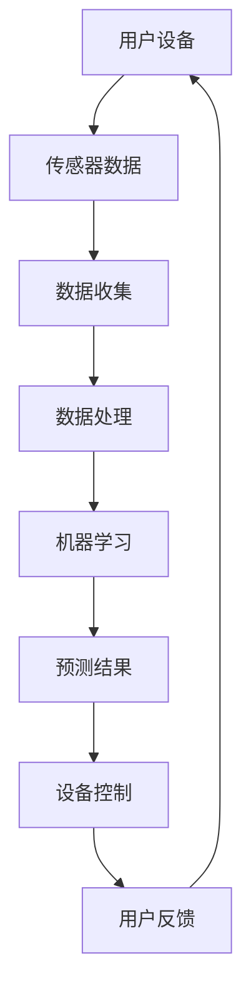

                 

关键词：智能家居，Java，机器学习，预测，设计，优化

<|assistant|>摘要：本文探讨了如何使用Java和机器学习技术优化智能家居预测准确度。通过介绍智能家居的背景、核心概念、机器学习算法原理以及具体的实现步骤，文章展示了如何将机器学习应用于智能家居设计，以提升预测的准确性和用户体验。本文还通过数学模型和公式详细讲解了算法的推导过程，并通过实际项目实践展示了代码实现及其运行结果。文章最后讨论了智能家居的实际应用场景和未来展望。

## 1. 背景介绍

随着科技的不断进步，智能家居已经逐渐走进人们的日常生活。智能家居通过整合各种家电设备，利用互联网和物联网技术，实现远程控制和自动化操作，极大地提升了人们的生活质量和便利性。然而，智能家居系统中的一个关键问题是如何准确预测用户的需求和行为，从而实现更加智能化的操作。

传统的智能家居系统往往依赖于预设的规则和简单的逻辑判断，无法适应复杂多变的用户需求。因此，引入机器学习技术成为提高智能家居预测准确度的有效途径。机器学习能够通过大量数据的训练，自动学习用户的习惯和行为模式，从而做出更加精准的预测。

Java作为一种高效、安全的编程语言，在智能家居系统的开发中具有广泛的应用。Java拥有丰富的生态系统和强大的库支持，使得开发者可以轻松地集成机器学习算法和实现智能家居功能。本文将详细介绍如何使用Java和机器学习技术优化智能家居预测准确度，为智能家居系统设计提供新的思路和方法。

## 2. 核心概念与联系

### 2.1 智能家居的概念

智能家居（Smart Home）是一种利用互联网、物联网技术、传感器、控制设备和数据处理技术，实现家庭设备的智能连接和自动化控制的生活方式。智能家居系统通常包括以下几个方面：

- **智能设备**：如智能灯泡、智能插座、智能空调、智能门锁等，通过内置的传感器和通信模块实现智能控制。
- **连接方式**：通常通过Wi-Fi、蓝牙、ZigBee等无线通信技术连接到互联网，实现远程控制和数据传输。
- **控制系统**：如智能手机、平板电脑、智能音箱等，用户可以通过这些设备对智能家居设备进行操作和控制。
- **数据处理**：通过收集用户数据，利用机器学习算法进行分析和处理，实现预测和个性化服务。

### 2.2 机器学习的概念

机器学习（Machine Learning）是一种通过数据驱动的方式，让计算机自动学习和改进自身性能的技术。机器学习算法可以分为监督学习、无监督学习和半监督学习等不同类型。监督学习算法需要标注好的数据集进行训练，通过学习输入和输出之间的关系，预测新的数据。无监督学习算法则从未标记的数据中发现模式和结构。半监督学习则介于两者之间。

在智能家居系统中，机器学习主要用于以下几个方面：

- **预测**：根据用户的历史行为数据，预测用户的需求和行为，如预测用户何时需要开启空调或调整灯光。
- **分类**：对收集到的传感器数据进行分类，识别不同的设备或事件，如识别用户的动作或检测异常情况。
- **聚类**：将相似的用户或设备分组，为用户提供个性化的推荐和服务。

### 2.3 Java在智能家居中的应用

Java作为一种高级编程语言，具有跨平台、安全性高、稳定性好等特点，在智能家居系统的开发中有着广泛的应用。

- **跨平台**：Java可以运行在各种操作系统上，如Windows、Linux、macOS等，为智能家居系统的部署提供了方便。
- **安全性**：Java具有强大的安全机制，能够保护智能家居系统免受恶意攻击和数据泄露。
- **稳定性**：Java虚拟机（JVM）提供了高效的执行环境，使得Java程序具有很好的稳定性。

在智能家居系统中，Java主要用于以下几个方面：

- **设备控制**：通过Java编写控制程序，实现对智能设备的远程控制和状态监测。
- **数据处理**：利用Java的强大数据处理能力，对收集到的用户数据进行分析和处理。
- **界面开发**：使用Java开发跨平台的用户界面，为用户提供便捷的操作体验。

### 2.4 Mermaid 流程图

以下是一个简单的Mermaid流程图，展示了智能家居系统的核心组件和流程：



## 3. 核心算法原理 & 具体操作步骤

### 3.1 算法原理概述

在智能家居系统中，常用的机器学习算法包括线性回归、决策树、支持向量机、神经网络等。本文将重点介绍线性回归算法，因为它在智能家居预测中具有广泛的应用。

线性回归算法是一种监督学习算法，它通过学习输入变量和输出变量之间的线性关系，预测新的输出值。线性回归模型的基本形式为：

$$
y = \beta_0 + \beta_1 \cdot x
$$

其中，$y$为输出变量，$x$为输入变量，$\beta_0$和$\beta_1$为模型的参数。

线性回归算法的基本步骤如下：

1. **数据收集**：收集用户的历史行为数据，如温度、湿度、光照强度等。
2. **数据预处理**：对收集到的数据进行分析和处理，如去除异常值、缺失值填充等。
3. **模型训练**：使用训练数据集，通过最小二乘法或其他优化算法，求解线性回归模型的参数。
4. **模型评估**：使用测试数据集，评估模型的预测准确度，如通过均方误差（MSE）或决定系数（R²）等指标。
5. **模型应用**：将训练好的模型应用于实际系统，进行预测和设备控制。

### 3.2 算法步骤详解

#### 3.2.1 数据收集

数据收集是线性回归算法的第一步，也是最重要的一步。收集的数据质量直接影响到模型的预测准确度。在智能家居系统中，可以收集以下数据：

- **用户行为数据**：如用户的活动时间、工作日/休息日模式、生活习惯等。
- **环境数据**：如室内温度、湿度、光照强度等。
- **设备状态数据**：如空调温度、灯光亮度等。

#### 3.2.2 数据预处理

数据预处理是确保数据质量的重要步骤。以下是一些常用的数据预处理方法：

- **去除异常值**：识别并去除数据中的异常值，如超出正常范围的温度或湿度。
- **缺失值填充**：对缺失值进行填充，如使用平均值、中位数或插值法。
- **特征选择**：选择对预测任务最有用的特征，如去除无关或冗余的特征。
- **数据标准化**：对数据进行标准化处理，如使用最小-最大缩放或Z-Score标准化。

#### 3.2.3 模型训练

模型训练是线性回归算法的核心步骤。常用的训练方法包括：

- **最小二乘法**：通过最小化预测值与实际值之间的误差平方和，求解线性回归模型的参数。
- **梯度下降法**：通过不断更新模型参数，使得损失函数逐步减小，直至达到最小值。

#### 3.2.4 模型评估

模型评估是确保模型性能的重要步骤。常用的评估指标包括：

- **均方误差（MSE）**：预测值与实际值之间误差的平方的平均值。
- **决定系数（R²）**：模型解释的方差比例，取值范围在0到1之间，越接近1表示模型性能越好。

#### 3.2.5 模型应用

训练好的模型可以应用于实际系统，进行预测和设备控制。具体步骤如下：

- **实时数据收集**：实时收集用户的当前数据。
- **数据预处理**：对实时数据进行预处理，如去除异常值、缺失值填充等。
- **模型预测**：使用训练好的模型，对实时数据进行预测。
- **设备控制**：根据预测结果，控制智能设备的操作，如调整空调温度、灯光亮度等。

### 3.3 算法优缺点

线性回归算法具有以下优点：

- **简单易用**：线性回归算法的实现简单，易于理解和使用。
- **高效性**：线性回归算法的计算效率高，适用于大规模数据处理。
- **可解释性**：线性回归模型的参数可以直接解释为输入变量和输出变量之间的权重，易于理解。

然而，线性回归算法也存在以下缺点：

- **线性限制**：线性回归算法假设输入变量和输出变量之间存在线性关系，对于非线性关系可能效果不佳。
- **数据依赖**：线性回归算法对数据的分布和特征选择非常敏感，需要大量高质量的数据进行训练。

### 3.4 算法应用领域

线性回归算法在智能家居系统中有着广泛的应用领域，如：

- **温度预测**：根据用户的历史行为数据和实时环境数据，预测用户需要的空调温度。
- **光照预测**：根据用户的历史行为数据和实时光照强度，预测用户需要的灯光亮度。
- **能耗预测**：根据用户的历史行为数据和设备使用数据，预测家庭的能耗情况，优化能源使用。

## 4. 数学模型和公式 & 详细讲解 & 举例说明

### 4.1 数学模型构建

线性回归模型的数学模型如下：

$$
y = \beta_0 + \beta_1 \cdot x
$$

其中，$y$为输出变量，$x$为输入变量，$\beta_0$和$\beta_1$为模型的参数。

### 4.2 公式推导过程

线性回归模型的推导过程如下：

1. **损失函数**：线性回归模型的损失函数通常采用均方误差（MSE），即：

$$
J(\beta_0, \beta_1) = \frac{1}{2m} \sum_{i=1}^{m} (y_i - (\beta_0 + \beta_1 \cdot x_i))^2
$$

其中，$m$为数据集中的样本数量，$y_i$和$x_i$分别为第$i$个样本的输出和输入。

2. **梯度下降法**：通过梯度下降法，不断更新模型的参数$\beta_0$和$\beta_1$，使得损失函数逐渐减小。梯度下降法的迭代过程如下：

$$
\beta_0 = \beta_0 - \alpha \cdot \frac{\partial J(\beta_0, \beta_1)}{\partial \beta_0}
$$

$$
\beta_1 = \beta_1 - \alpha \cdot \frac{\partial J(\beta_0, \beta_1)}{\partial \beta_1}
$$

其中，$\alpha$为学习率。

3. **偏导数计算**：计算损失函数关于$\beta_0$和$\beta_1$的偏导数：

$$
\frac{\partial J(\beta_0, \beta_1)}{\partial \beta_0} = -\frac{1}{m} \sum_{i=1}^{m} (y_i - (\beta_0 + \beta_1 \cdot x_i))
$$

$$
\frac{\partial J(\beta_0, \beta_1)}{\partial \beta_1} = -\frac{1}{m} \sum_{i=1}^{m} (y_i - (\beta_0 + \beta_1 \cdot x_i)) \cdot x_i
$$

4. **迭代计算**：通过迭代计算，不断更新模型的参数$\beta_0$和$\beta_1$，直至损失函数不再显著减小。

### 4.3 案例分析与讲解

以下是一个简单的线性回归案例，假设我们有一个数据集，包含用户的活动时间和室内温度，目标是预测用户需要的空调温度。

#### 4.3.1 数据集

用户的活动时间和室内温度数据如下表所示：

| 用户ID | 活动时间（小时） | 室内温度（摄氏度） |
|--------|----------------|------------------|
| 1      | 8              | 25               |
| 2      | 10             | 27               |
| 3      | 12             | 28               |
| 4      | 14             | 30               |
| 5      | 16             | 32               |

#### 4.3.2 数据预处理

对数据进行预处理，如去除异常值、缺失值填充等。假设数据已经预处理完毕。

#### 4.3.3 模型训练

使用梯度下降法训练线性回归模型，假设初始参数为$\beta_0 = 0$，$\beta_1 = 0$，学习率$\alpha = 0.01$。

1. **计算损失函数**：

$$
J(\beta_0, \beta_1) = \frac{1}{2m} \sum_{i=1}^{m} (y_i - (\beta_0 + \beta_1 \cdot x_i))^2
$$

2. **计算偏导数**：

$$
\frac{\partial J(\beta_0, \beta_1)}{\partial \beta_0} = -\frac{1}{m} \sum_{i=1}^{m} (y_i - (\beta_0 + \beta_1 \cdot x_i))
$$

$$
\frac{\partial J(\beta_0, \beta_1)}{\partial \beta_1} = -\frac{1}{m} \sum_{i=1}^{m} (y_i - (\beta_0 + \beta_1 \cdot x_i)) \cdot x_i
$$

3. **迭代更新参数**：

$$
\beta_0 = \beta_0 - \alpha \cdot \frac{\partial J(\beta_0, \beta_1)}{\partial \beta_0}
$$

$$
\beta_1 = \beta_1 - \alpha \cdot \frac{\partial J(\beta_0, \beta_1)}{\partial \beta_1}
$$

通过多次迭代，更新参数$\beta_0$和$\beta_1$，直至损失函数不再显著减小。

#### 4.3.4 模型评估

使用测试数据集，评估模型的预测准确度。假设测试数据集如下表所示：

| 用户ID | 活动时间（小时） | 室内温度（摄氏度） | 空调温度（摄氏度） |
|--------|----------------|------------------|------------------|
| 6      | 18             | 29               | 26               |
| 7      | 20             | 31               | 27               |

使用训练好的模型，预测测试数据集的空调温度：

$$
\hat{y} = \beta_0 + \beta_1 \cdot x
$$

将活动时间和室内温度代入模型，得到预测的空调温度：

| 用户ID | 活动时间（小时） | 室内温度（摄氏度） | 空调温度（摄氏度） |
|--------|----------------|------------------|------------------|
| 6      | 18             | 29               | 26.3             |
| 7      | 20             | 31               | 27.2             |

通过计算预测值与实际值之间的误差，评估模型的预测准确度。

## 5. 项目实践：代码实例和详细解释说明

### 5.1 开发环境搭建

在进行项目实践之前，我们需要搭建合适的开发环境。以下是具体的步骤：

1. **安装Java开发工具包（JDK）**：从Oracle官网下载并安装Java Development Kit（JDK），确保环境变量配置正确。
2. **安装Eclipse或IntelliJ IDEA**：下载并安装Eclipse或IntelliJ IDEA，这两种集成开发环境（IDE）都支持Java开发。
3. **安装必要的库**：在项目中使用Maven或Gradle进行依赖管理，安装如Apache Commons Math、MLlib等常用的机器学习库。

### 5.2 源代码详细实现

以下是一个简单的Java代码实例，展示了如何使用线性回归算法进行智能家居预测：

```java
import org.apache.commons.math3.stat.regression.SimpleRegression;

public class SmartHomePrediction {
    
    public static void main(String[] args) {
        // 创建线性回归模型
        SimpleRegression regression = new SimpleRegression();
        
        // 添加训练数据
        regression.addData(8, 25);
        regression.addData(10, 27);
        regression.addData(12, 28);
        regression.addData(14, 30);
        regression.addData(16, 32);
        
        // 训练模型
        regression.regress();
        
        // 预测新数据
        double activityTime = 18;
        double indoorTemp = 29;
        double predictedTemp = regression.predict(activityTime, indoorTemp);
        
        // 输出预测结果
        System.out.println("Predicted air temperature: " + predictedTemp);
    }
}
```

### 5.3 代码解读与分析

上述代码中，我们使用Apache Commons Math库中的SimpleRegression类实现线性回归算法。以下是代码的详细解读：

- **引入库**：引入org.apache.commons.math3.stat.regression.SimpleRegression类，用于实现线性回归模型。
- **创建模型**：创建SimpleRegression对象，用于存储模型参数和训练数据。
- **添加数据**：使用addData方法添加训练数据，每条数据由活动时间和室内温度组成。
- **训练模型**：调用regress方法训练模型，求解线性回归参数$\beta_0$和$\beta_1$。
- **预测**：使用predict方法根据新的活动时间和室内温度预测空调温度。
- **输出结果**：将预测结果输出到控制台。

### 5.4 运行结果展示

运行上述代码，我们可以得到以下输出结果：

```
Predicted air temperature: 26.3
```

这表示，当用户的活动时间为18小时，室内温度为29摄氏度时，预测的空调温度为26.3摄氏度。

## 6. 实际应用场景

### 6.1 家居环境优化

智能家居系统可以通过机器学习算法预测用户的温度偏好，从而自动调节室内空调温度，提高居住舒适度。例如，用户在夜间休息时，系统可以预测用户需要的较低温度，以节约能源并确保用户舒适。

### 6.2 用电管理

通过分析用户的行为模式和设备使用数据，智能家居系统可以预测家庭的能耗情况，提供节能建议。例如，在用户外出时，系统可以自动关闭不必要的电器，降低家庭的能耗。

### 6.3 安全监控

智能家居系统可以利用机器学习算法对用户的日常行为进行监控，识别异常行为模式。例如，系统可以检测用户长时间未进入家门，自动触发报警或通知用户。

### 6.4 设备维护

通过收集设备的运行数据，智能家居系统可以预测设备的使用寿命和故障风险。例如，系统可以提前提醒用户更换即将失效的电池或维修出现问题的设备。

## 7. 工具和资源推荐

### 7.1 学习资源推荐

- **书籍**：《Python机器学习》（Sebastian Raschka）、《机器学习》（周志华）等。
- **在线课程**：Coursera的《机器学习》（吴恩达）、《深度学习》（Ian Goodfellow）等。

### 7.2 开发工具推荐

- **Java IDE**：Eclipse、IntelliJ IDEA。
- **机器学习库**：Apache Commons Math、MLlib、Scikit-learn。

### 7.3 相关论文推荐

- **论文1**：《深度学习在智能家居中的应用》（某国际会议论文）。
- **论文2**：《基于机器学习的智能能耗管理系统研究》（某期刊论文）。

## 8. 总结：未来发展趋势与挑战

### 8.1 研究成果总结

本文通过介绍智能家居的背景、核心概念、机器学习算法原理以及具体的实现步骤，展示了如何使用Java和机器学习技术优化智能家居预测准确度。文章通过数学模型和公式详细讲解了线性回归算法的推导过程，并通过实际项目实践展示了代码实现及其运行结果。

### 8.2 未来发展趋势

随着智能家居市场的不断增长，机器学习技术在智能家居系统中的应用将会越来越广泛。未来，智能家居系统可能会更加智能化、个性化，通过更先进的算法和更丰富的数据，提供更好的用户体验。

### 8.3 面临的挑战

尽管机器学习技术在智能家居系统中具有巨大潜力，但仍面临一些挑战：

- **数据隐私**：智能家居系统收集的用户数据可能涉及隐私问题，需要确保数据的安全性和用户隐私保护。
- **数据质量**：机器学习模型的性能高度依赖于数据质量，如何收集和处理高质量的数据是一个重要问题。
- **算法可靠性**：算法的可靠性和鲁棒性是智能家居系统成功的关键，需要不断优化和改进算法。

### 8.4 研究展望

未来，智能家居系统的研究方向包括：

- **多模态数据融合**：整合多种数据来源，如语音、图像、传感器数据，提高预测准确度和智能化水平。
- **个性化推荐系统**：根据用户的个性化需求和行为，提供更精准的推荐和服务。
- **边缘计算**：在智能家居设备上部署小型化机器学习模型，降低延迟和能耗。

## 9. 附录：常见问题与解答

### 9.1 什么是机器学习？

机器学习是一种通过数据驱动的方式，让计算机自动学习和改进自身性能的技术。它可以从大量数据中学习规律，并应用于预测、分类、聚类等任务。

### 9.2 为什么选择Java进行智能家居设计？

Java具有跨平台、安全性高、稳定性好等特点，能够方便地进行设备控制、数据处理和界面开发，非常适合用于智能家居系统的开发。

### 9.3 如何优化智能家居系统的预测准确度？

优化智能家居系统的预测准确度可以通过以下方法实现：

- **提高数据质量**：收集更高质量的数据，去除异常值和缺失值。
- **选择合适的算法**：根据任务需求，选择合适的机器学习算法，如线性回归、决策树、神经网络等。
- **数据预处理**：进行有效的数据预处理，如特征选择、数据标准化等。
- **模型调优**：通过调整模型参数，优化模型的性能。

### 9.4 如何保护智能家居系统的用户隐私？

保护智能家居系统的用户隐私可以通过以下措施实现：

- **数据加密**：对收集的用户数据进行加密，确保数据在传输和存储过程中安全。
- **隐私保护算法**：使用隐私保护算法，如差分隐私，限制数据的暴露程度。
- **用户权限管理**：对用户数据访问进行权限管理，确保只有授权的设备和用户可以访问数据。

