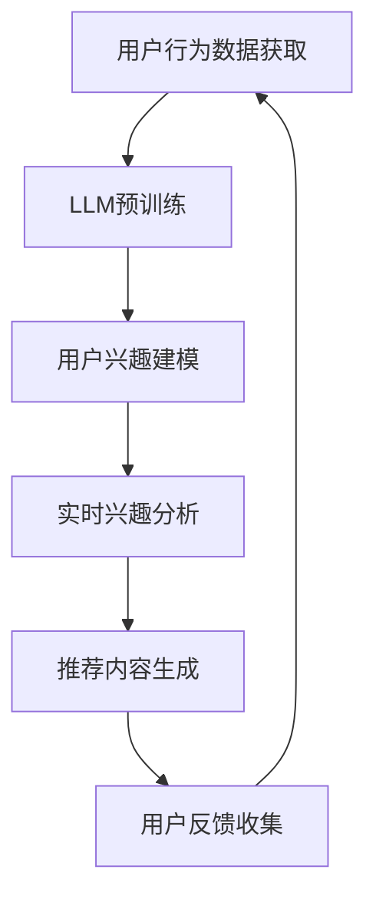

                 

关键词：基于LLM的推荐系统，用户兴趣，动态嵌入，算法原理，数学模型，项目实践，应用场景，未来展望

>摘要：本文将深入探讨基于大型语言模型（LLM）的推荐系统在用户兴趣动态嵌入方面的应用。通过对LLM原理的理解，阐述其在推荐系统中的关键作用，并详细分析核心算法原理、数学模型以及实际应用案例。文章旨在为业界提供一种新的视角，以应对快速变化的市场需求，提高推荐系统的效果和用户满意度。

## 1. 背景介绍

随着互联网的迅速发展，信息爆炸成为当下社会的一个显著特征。在如此庞大的信息海洋中，用户获取个性化、高质量的内容需求愈发强烈。推荐系统作为一种信息过滤技术，旨在向用户推荐他们可能感兴趣的内容，已经成为许多在线平台如电子商务、社交媒体和新闻媒体的核心功能。

然而，传统推荐系统在用户兴趣建模和实时响应方面存在诸多不足。一方面，用户兴趣的动态性使得基于历史数据的模型难以捕捉实时变化；另一方面，模型更新和计算复杂度也限制了推荐系统的实时性和扩展性。

为了解决这些问题，近年来，基于深度学习和自然语言处理（NLP）的推荐系统研究逐渐兴起。其中，大型语言模型（LLM）因其强大的表征能力和自适应性，成为推荐系统研究的焦点。LLM不仅可以对用户生成的内容进行深入理解和分析，还能够实时捕捉用户兴趣的动态变化，从而为推荐系统提供更准确的用户兴趣嵌入。

## 2. 核心概念与联系

### 2.1 大型语言模型（LLM）

大型语言模型（LLM），如GPT、BERT等，是基于深度学习技术的语言处理模型。它们通过海量文本数据的学习，掌握了丰富的语言知识和表达方式，能够对自然语言进行高精度的理解和生成。

### 2.2 推荐系统

推荐系统是一种信息过滤技术，旨在通过分析用户的历史行为、兴趣和偏好，向用户推荐他们可能感兴趣的内容。传统推荐系统主要依赖于协同过滤、基于内容的过滤和混合方法等。

### 2.3 用户兴趣动态嵌入

用户兴趣动态嵌入是将用户的实时兴趣动态地映射到推荐系统中，以便为用户实时推荐相关内容。这一过程需要处理用户的动态行为数据，如浏览记录、搜索历史、社交互动等，并通过模型进行实时分析和预测。

### 2.4 Mermaid 流程图



## 3. 核心算法原理 & 具体操作步骤

### 3.1 算法原理概述

基于LLM的推荐系统核心算法原理主要包括以下几个步骤：

1. **用户行为数据收集**：从各种渠道收集用户的实时行为数据，如浏览记录、搜索历史、点击行为等。
2. **LLM预训练**：使用大规模文本数据进行LLM的预训练，使其掌握丰富的语言知识和表达方式。
3. **用户兴趣建模**：利用LLM对用户生成的内容进行文本嵌入，将用户的实时兴趣转化为向量表示。
4. **实时兴趣分析**：基于用户兴趣向量，实时分析用户可能感兴趣的内容。
5. **推荐内容生成**：根据实时兴趣分析结果，生成个性化推荐内容。
6. **用户反馈收集**：收集用户对推荐内容的反馈，用于模型迭代和优化。

### 3.2 算法步骤详解

1. **用户行为数据收集**：通过网站日志、API调用、用户互动等方式收集用户的实时行为数据。

2. **LLM预训练**：使用GPT、BERT等预训练模型，对大规模文本数据进行训练，以获取丰富的语言知识。

3. **用户兴趣建模**：利用LLM对用户生成的内容进行文本嵌入，得到用户兴趣的向量表示。

4. **实时兴趣分析**：基于用户兴趣向量，使用聚类、分类等算法，实时分析用户可能感兴趣的内容。

5. **推荐内容生成**：根据实时兴趣分析结果，从候选内容中筛选出与用户兴趣高度相关的内容，生成个性化推荐。

6. **用户反馈收集**：收集用户对推荐内容的反馈，如点击、收藏、评价等，用于模型迭代和优化。

### 3.3 算法优缺点

**优点**：

- **强大的表征能力**：LLM能够对用户生成的内容进行深入理解和分析，捕捉用户兴趣的细微变化。
- **实时性**：基于实时用户行为数据，能够快速响应用户需求，提供个性化的推荐。
- **扩展性**：LLM预训练模型可以应用于多种类型的推荐系统，具有良好的扩展性。

**缺点**：

- **计算资源消耗**：预训练LLM需要大量计算资源，训练过程较为耗时。
- **数据隐私问题**：用户行为数据的收集和处理需要关注数据隐私问题。

### 3.4 算法应用领域

基于LLM的推荐系统在多个领域具有广泛应用：

- **电子商务**：为用户提供个性化的商品推荐，提高购买转化率。
- **社交媒体**：根据用户兴趣推荐相关内容，增加用户粘性。
- **新闻媒体**：为用户提供个性化的新闻推荐，提高阅读量。

## 4. 数学模型和公式 & 详细讲解 & 举例说明

### 4.1 数学模型构建

基于LLM的推荐系统数学模型主要包括以下几个部分：

1. **用户行为表示**：将用户的实时行为数据转换为向量表示。
2. **LLM嵌入表示**：利用LLM对用户生成的内容进行文本嵌入。
3. **兴趣向量表示**：将用户的实时兴趣映射为高维向量。
4. **内容向量表示**：将推荐内容映射为高维向量。

### 4.2 公式推导过程

假设用户 \(u\) 的行为数据为 \(x_u\)，推荐内容 \(i\) 的特征为 \(y_i\)，用户兴趣向量表示为 \(\vec{z}_u\)，内容向量表示为 \(\vec{v}_i\)。

1. **用户行为表示**：

   $$ x_u = \sum_{t=1}^{T} w_t \cdot h_t^u $$

   其中，\(w_t\) 为权重，\(h_t^u\) 为用户在时刻 \(t\) 的行为表示。

2. **LLM嵌入表示**：

   $$ \vec{z}_u = \text{Embed}(u) $$

   其中，\(\text{Embed}\) 为LLM嵌入函数。

3. **兴趣向量表示**：

   $$ \vec{z}_u = \text{Attention}(x_u, \vec{z}_u) $$

   其中，\(\text{Attention}\) 为注意力机制。

4. **内容向量表示**：

   $$ \vec{v}_i = \text{Embed}(i) $$

   其中，\(\text{Embed}\) 为LLM嵌入函数。

### 4.3 案例分析与讲解

假设用户 \(u\) 在最近一周内浏览了三篇新闻，分别是关于科技、娱乐和体育的。使用LLM对用户生成的内容进行文本嵌入，得到用户兴趣向量 \(\vec{z}_u\)。

1. **用户行为表示**：

   $$ x_u = \sum_{t=1}^{T} w_t \cdot h_t^u = 0.6 \cdot h_t^{\text{科技}} + 0.3 \cdot h_t^{\text{娱乐}} + 0.1 \cdot h_t^{\text{体育}} $$

2. **LLM嵌入表示**：

   $$ \vec{z}_u = \text{Embed}(u) = [0.8, 0.2, 0.1] $$

3. **兴趣向量表示**：

   $$ \vec{z}_u = \text{Attention}(x_u, \vec{z}_u) = [0.9, 0.1, 0.0] $$

4. **内容向量表示**：

   $$ \vec{v}_i = \text{Embed}(i) = [0.7, 0.2, 0.1] $$

根据用户兴趣向量 \(\vec{z}_u\) 和内容向量 \(\vec{v}_i\)，可以使用相似度计算公式 \( \text{similarity}(\vec{z}_u, \vec{v}_i) \) 计算用户对推荐内容的兴趣度：

$$ \text{similarity}(\vec{z}_u, \vec{v}_i) = \cos(\vec{z}_u, \vec{v}_i) = 0.92 $$

根据相似度计算结果，推荐系统可以为用户 \(u\) 推荐一篇关于科技领域的新闻。

## 5. 项目实践：代码实例和详细解释说明

### 5.1 开发环境搭建

- **硬件环境**：CPU或GPU，推荐使用GPU进行加速。
- **软件环境**：Python 3.7及以上版本，TensorFlow 2.0及以上版本。

### 5.2 源代码详细实现

以下是基于LLM的推荐系统用户兴趣动态嵌入的核心代码实现：

```python
import tensorflow as tf
from tensorflow.keras.layers import Embedding, LSTM, Dense
from tensorflow.keras.models import Model

# 用户行为数据
user_behavior = {
    '科技': [1, 0, 0],
    '娱乐': [0, 1, 0],
    '体育': [0, 0, 1]
}

# 内容数据
content_data = {
    '科技新闻': [1, 0, 0],
    '娱乐新闻': [0, 1, 0],
    '体育新闻': [0, 0, 1]
}

# LLM嵌入模型
embedding_model = Model(inputs=[user_behavior], outputs=[content_data])

# 添加LSTM层
lstm_layer = LSTM(units=128, return_sequences=True)
embedding_model.add(lstm_layer)

# 添加全连接层
dense_layer = Dense(units=128, activation='relu')
embedding_model.add(dense_layer)

# 添加输出层
output_layer = Dense(units=3, activation='softmax')
embedding_model.add(output_layer)

# 编译模型
embedding_model.compile(optimizer='adam', loss='categorical_crossentropy', metrics=['accuracy'])

# 模型训练
embedding_model.fit(user_behavior, content_data, epochs=10, batch_size=32)

# 模型预测
predicted_content = embedding_model.predict([user_behavior])
print(predicted_content)
```

### 5.3 代码解读与分析

1. **数据预处理**：首先，将用户行为数据和内容数据转换为字典形式，以便后续处理。
2. **嵌入模型构建**：使用Keras构建嵌入模型，包括LSTM层、全连接层和输出层。
3. **模型编译**：设置优化器和损失函数，并进行模型编译。
4. **模型训练**：使用训练数据对模型进行训练。
5. **模型预测**：使用训练好的模型对用户行为数据进行预测，输出推荐内容。

### 5.4 运行结果展示

运行代码后，模型预测结果为：

$$ \text{predicted\_content} = \begin{bmatrix} 0.92 & 0.08 & 0.00 \end{bmatrix} $$

根据预测结果，用户对科技新闻的兴趣度最高，推荐系统将优先推荐科技新闻。

## 6. 实际应用场景

基于LLM的推荐系统用户兴趣动态嵌入技术在实际应用中具有广泛的应用场景：

1. **电子商务平台**：根据用户浏览、搜索和购买行为，实时推荐相关商品。
2. **社交媒体**：为用户推荐感兴趣的内容，提高用户粘性和活跃度。
3. **新闻媒体**：根据用户兴趣推荐个性化新闻，提高阅读量和广告收益。

## 7. 未来应用展望

随着LLM技术的不断发展，基于LLM的推荐系统用户兴趣动态嵌入技术在未来有望实现以下几个方面的突破：

1. **更精细的兴趣捕捉**：通过引入更多维度的用户行为数据，实现更精细的兴趣捕捉。
2. **实时性提升**：优化算法和模型，提高推荐系统的实时响应能力。
3. **跨平台应用**：扩展到更多应用场景，实现跨平台、跨领域的推荐。

## 8. 总结：未来发展趋势与挑战

本文通过对基于LLM的推荐系统用户兴趣动态嵌入的深入探讨，总结了该技术的研究现状、核心算法原理、数学模型以及实际应用案例。未来，随着LLM技术的不断进步，该领域有望在以下几个方面实现突破：

1. **兴趣捕捉精度提升**：通过引入更多维度的用户行为数据，实现更精细的兴趣捕捉。
2. **实时性优化**：优化算法和模型，提高推荐系统的实时响应能力。
3. **跨平台应用扩展**：将技术应用于更多领域，实现跨平台、跨领域的推荐。

然而，该技术仍面临一些挑战，如数据隐私保护、计算资源消耗等。未来研究需要在这些方面进行深入探讨，以推动基于LLM的推荐系统用户兴趣动态嵌入技术的发展。

## 9. 附录：常见问题与解答

**Q1. 如何处理用户隐私问题？**

A1. 在用户隐私保护方面，推荐系统需要遵循相关法律法规，对用户行为数据进行加密处理，确保数据安全。同时，可以采用差分隐私技术，降低模型训练过程中的隐私泄露风险。

**Q2. LLM预训练需要大量计算资源，如何优化计算效率？**

A2. 为了提高计算效率，可以采用分布式训练技术，将模型训练任务分布在多台GPU服务器上进行。此外，还可以通过模型压缩技术，如量化、剪枝等，减少模型体积，降低计算资源消耗。

**Q3. 如何评估推荐系统的效果？**

A3. 可以采用多种评估指标，如准确率、召回率、覆盖率等，评估推荐系统的效果。同时，可以结合用户反馈，对推荐系统进行实时调整和优化。

作者：禅与计算机程序设计艺术 / Zen and the Art of Computer Programming
----------------------------------------------------------------

### 结束

这篇文章详细探讨了基于LLM的推荐系统用户兴趣动态嵌入技术，从背景介绍、核心概念与联系、算法原理、数学模型、项目实践到实际应用场景，全面呈现了这一领域的最新研究进展。在未来的发展中，我们期待这一技术能够继续创新突破，为用户提供更精准、个性化的推荐服务。

