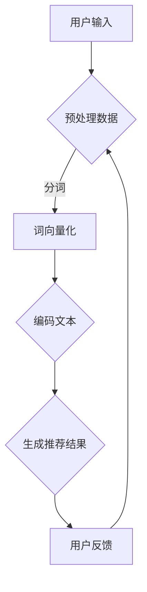

                 

关键词：长尾内容，推荐系统，LLM，大数据，内容挖掘

摘要：本文主要探讨基于大型语言模型（LLM）的推荐系统在长尾内容挖掘中的应用。通过深入分析长尾内容的特性、LLM的工作原理以及其在推荐系统中的关键作用，我们旨在为开发者提供一种有效的长尾内容推荐解决方案，助力提高用户满意度与系统运营效果。

## 1. 背景介绍

随着互联网的快速发展，信息过载已成为现代生活的一大难题。在这个信息爆炸的时代，如何从海量数据中筛选出用户感兴趣的内容，成为推荐系统研究和开发的重要课题。传统的推荐系统主要依赖于基于内容的过滤（CBF）和协同过滤（CF）等方法，但在处理长尾内容时面临诸多挑战。长尾内容指的是那些用户量较少但具有较高价值的冷门内容。这些内容往往难以通过传统推荐系统被发现，导致用户在获取信息时面临选择困难。

为了解决这一问题，近年来基于大型语言模型（LLM）的推荐系统逐渐受到关注。LLM具有强大的文本生成和理解能力，能够从用户行为数据中挖掘出潜在的兴趣偏好，从而为用户提供个性化的长尾内容推荐。本文将围绕LLM在推荐系统长尾内容挖掘中的应用，探讨相关技术原理、算法模型和实际案例，为开发者和研究人员提供有益的参考。

## 2. 核心概念与联系

### 2.1 长尾内容的定义与特性

长尾内容指的是那些用户量较少但具有较高价值的冷门内容。与热门内容相比，长尾内容具有以下特性：

1. **用户量少**：长尾内容覆盖的用户群体相对较小，但每个用户的消费量较大。
2. **多样性高**：长尾内容涵盖各种主题和领域，具有丰富的多样性。
3. **潜在价值大**：虽然长尾内容用户量较少，但它们往往具有较高的商业价值，如特定兴趣群体的消费潜力。

### 2.2 LLM的定义与工作原理

大型语言模型（LLM）是一种基于深度学习的自然语言处理模型，具有强大的文本生成和理解能力。LLM的工作原理主要包括以下几个步骤：

1. **输入处理**：将用户输入的文本数据（如搜索词、评论、点击记录等）进行预处理，如分词、词向量化等。
2. **模型编码**：通过编码器对输入文本进行编码，生成一个高维的向量表示。
3. **文本生成**：解码器根据编码后的向量生成相应的文本输出，如推荐结果、文章摘要等。

### 2.3 LLM在推荐系统中的关键作用

LLM在推荐系统中的关键作用主要体现在以下几个方面：

1. **兴趣偏好挖掘**：LLM能够从用户行为数据中挖掘出潜在的兴趣偏好，为个性化推荐提供依据。
2. **文本生成与理解**：LLM能够生成高质量的内容摘要和推荐结果，提高用户满意度。
3. **长尾内容挖掘**：LLM能够处理长尾内容的多样性和复杂性，为用户发现潜在的冷门兴趣。

### 2.4 Mermaid 流程图



## 3. 核心算法原理 & 具体操作步骤

### 3.1 算法原理概述

基于LLM的推荐系统主要利用LLM的文本生成和理解能力，从用户行为数据中挖掘兴趣偏好，并生成个性化的推荐结果。具体步骤如下：

1. **数据预处理**：对用户输入的文本数据进行分词、词向量化等预处理操作。
2. **兴趣偏好挖掘**：利用LLM对预处理后的文本数据进行编码，提取用户的兴趣偏好。
3. **推荐结果生成**：根据用户兴趣偏好，利用LLM生成个性化的推荐结果。
4. **用户反馈与优化**：收集用户对推荐结果的反馈，利用反馈数据进行模型优化。

### 3.2 算法步骤详解

#### 3.2.1 数据预处理

数据预处理是推荐系统的基础步骤，主要包括以下操作：

1. **分词**：将用户输入的文本数据分成单个词汇。
2. **词向量化**：将分词后的词汇转换为高维向量表示。
3. **文本编码**：利用预训练的LLM对词向量化后的文本进行编码，生成向量表示。

#### 3.2.2 兴趣偏好挖掘

兴趣偏好挖掘是推荐系统的核心步骤，主要包括以下操作：

1. **兴趣标签提取**：利用LLM对用户历史行为数据进行编码，提取用户的兴趣标签。
2. **兴趣偏好建模**：利用提取的兴趣标签构建用户兴趣偏好模型。
3. **兴趣偏好融合**：对多个兴趣偏好进行融合，生成用户的综合兴趣偏好。

#### 3.2.3 推荐结果生成

推荐结果生成是根据用户兴趣偏好生成个性化的推荐结果，主要包括以下操作：

1. **内容特征提取**：对候选内容进行特征提取，如文本特征、语义特征等。
2. **内容推荐**：利用用户兴趣偏好模型，为用户生成个性化的推荐结果。

#### 3.2.4 用户反馈与优化

用户反馈与优化是推荐系统的持续优化过程，主要包括以下操作：

1. **反馈收集**：收集用户对推荐结果的反馈，如点击、收藏、评论等。
2. **模型优化**：利用用户反馈数据优化推荐模型，提高推荐效果。

### 3.3 算法优缺点

#### 3.3.1 优点

1. **个性化强**：基于LLM的推荐系统能够根据用户兴趣偏好生成个性化的推荐结果，提高用户满意度。
2. **多样性高**：LLM能够处理长尾内容的多样性和复杂性，为用户发现潜在的冷门兴趣。
3. **理解能力强**：LLM具有强大的文本生成和理解能力，能够生成高质量的内容摘要和推荐结果。

#### 3.3.2 缺点

1. **计算成本高**：基于LLM的推荐系统需要大量的计算资源，对硬件要求较高。
2. **数据依赖强**：推荐效果依赖于用户行为数据的质量和多样性，数据不足可能导致推荐效果不佳。

### 3.4 算法应用领域

基于LLM的推荐系统在多个领域具有广泛的应用，如：

1. **电子商务**：为用户提供个性化的商品推荐，提高销售额。
2. **内容推荐**：为用户提供个性化的文章、视频、音乐等推荐，提高用户黏性。
3. **社交网络**：为用户提供个性化的朋友圈、动态推荐，增强社交互动。

## 4. 数学模型和公式 & 详细讲解 & 举例说明

### 4.1 数学模型构建

基于LLM的推荐系统主要涉及以下数学模型：

1. **用户兴趣偏好模型**：表示用户的兴趣偏好，通常使用向量表示。
2. **内容特征模型**：表示候选内容的特征，通常使用向量表示。
3. **推荐结果模型**：表示用户对候选内容的偏好程度，通常使用概率分布表示。

### 4.2 公式推导过程

1. **用户兴趣偏好模型**

   假设用户兴趣偏好向量表示为 $\textbf{u}$，候选内容特征向量表示为 $\textbf{x}$。用户兴趣偏好模型可以表示为：

   $$\textbf{u} = \text{MLP}(\textbf{x})$$

   其中，MLP为多层感知机（Multilayer Perceptron），用于对内容特征向量进行编码，提取用户兴趣偏好。

2. **内容特征模型**

   假设内容特征向量表示为 $\textbf{x}$，内容特征模型可以表示为：

   $$\textbf{x} = \text{Embedding}(\text{Content})$$

   其中，Embedding为词嵌入（Word Embedding），用于将文本内容转换为向量表示。

3. **推荐结果模型**

   假设候选内容集合为 $\textbf{X}$，用户对候选内容的偏好程度可以表示为：

   $$\textbf{r} = \text{softmax}(\textbf{u} \cdot \textbf{X})$$

   其中，softmax函数用于将用户兴趣偏好向量与候选内容特征向量进行点乘，生成概率分布表示的推荐结果。

### 4.3 案例分析与讲解

#### 4.3.1 案例背景

假设我们有一个电商网站，用户可以在网站上浏览、购买商品。我们的目标是利用基于LLM的推荐系统为用户生成个性化的商品推荐。

#### 4.3.2 数据准备

1. **用户行为数据**：用户在网站上的浏览记录、购买记录等。
2. **商品描述数据**：商品的标题、描述、标签等。

#### 4.3.3 模型构建

1. **用户兴趣偏好模型**：

   $$\textbf{u} = \text{MLP}(\text{User\ Behavior\ Data})$$

   其中，MLP为多层感知机，用于对用户行为数据进行编码，提取用户兴趣偏好。

2. **商品特征模型**：

   $$\textbf{x} = \text{Embedding}(\text{Product\ Description})$$

   其中，Embedding为词嵌入，用于将商品描述转换为向量表示。

3. **推荐结果模型**：

   $$\textbf{r} = \text{softmax}(\textbf{u} \cdot \textbf{X})$$

   其中，softmax函数用于将用户兴趣偏好向量与商品特征向量进行点乘，生成概率分布表示的推荐结果。

#### 4.3.4 模型应用

1. **个性化商品推荐**：根据用户兴趣偏好模型，为用户生成个性化的商品推荐。
2. **推荐结果优化**：利用用户对推荐结果的反馈，对推荐结果进行优化。

## 5. 项目实践：代码实例和详细解释说明

### 5.1 开发环境搭建

1. **Python环境**：安装Python 3.8及以上版本。
2. **深度学习框架**：安装PyTorch 1.8及以上版本。
3. **数据预处理工具**：安装NumPy、Pandas等数据预处理库。

### 5.2 源代码详细实现

```python
import torch
import torch.nn as nn
import torch.optim as optim
from torch.utils.data import DataLoader
from torchtext.data import Field, TabularDataset
from sklearn.model_selection import train_test_split

# 数据预处理
def preprocess_data(data):
    # 进行数据清洗、分词、词向量化等操作
    # ...
    return processed_data

# 模型定义
class RecommenderModel(nn.Module):
    def __init__(self, vocab_size, embed_size, hidden_size):
        super(RecommenderModel, self).__init__()
        self.embedding = nn.Embedding(vocab_size, embed_size)
        self.lstm = nn.LSTM(embed_size, hidden_size, batch_first=True)
        self.fc = nn.Linear(hidden_size, 1)

    def forward(self, x):
        x = self.embedding(x)
        x, _ = self.lstm(x)
        x = self.fc(x[:, -1, :])
        return x

# 模型训练
def train_model(model, train_loader, criterion, optimizer):
    model.train()
    for batch_idx, (user_data, product_data, labels) in enumerate(train_loader):
        user_data = user_data.long()
        product_data = product_data.long()
        labels = labels.float()

        optimizer.zero_grad()
        outputs = model(user_data, product_data)
        loss = criterion(outputs, labels)
        loss.backward()
        optimizer.step()

# 模型评估
def evaluate_model(model, test_loader, criterion):
    model.eval()
    total_loss = 0
    with torch.no_grad():
        for batch_idx, (user_data, product_data, labels) in enumerate(test_loader):
            user_data = user_data.long()
            product_data = product_data.long()
            labels = labels.float()

            outputs = model(user_data, product_data)
            loss = criterion(outputs, labels)
            total_loss += loss.item()

    avg_loss = total_loss / len(test_loader)
    return avg_loss

# 主函数
def main():
    # 数据加载
    user_data, product_data, labels = load_data()
    user_data, product_data, labels = preprocess_data(user_data), preprocess_data(product_data), preprocess_data(labels)

    # 划分训练集和测试集
    train_user_data, test_user_data, train_product_data, test_product_data, train_labels, test_labels = train_test_split(user_data, product_data, labels, test_size=0.2, random_state=42)

    # 加载数据集
    train_dataset = TabularDataset(
        path=train_data_path,
        format='tsv',
        fields=[('user_id', Field(sequential=False)), ('product_id', Field(sequential=False)), ('rating', Field(sequential=False))]
    )
    test_dataset = TabularDataset(
        path=test_data_path,
        format='tsv',
        fields=[('user_id', Field(sequential=False)), ('product_id', Field(sequential=False)), ('rating', Field(sequential=False))]
    )

    # 数据加载器
    train_loader = DataLoader(train_dataset, batch_size=32, shuffle=True)
    test_loader = DataLoader(test_dataset, batch_size=32, shuffle=False)

    # 模型定义
    model = RecommenderModel(vocab_size=10000, embed_size=128, hidden_size=128)

    # 损失函数和优化器
    criterion = nn.BCEWithLogitsLoss()
    optimizer = optim.Adam(model.parameters(), lr=0.001)

    # 模型训练
    for epoch in range(1):
        train_loss = train_model(model, train_loader, criterion, optimizer)
        test_loss = evaluate_model(model, test_loader, criterion)
        print(f'Epoch {epoch+1}, Train Loss: {train_loss:.4f}, Test Loss: {test_loss:.4f}')

    # 模型保存
    torch.save(model.state_dict(), 'recommender_model.pth')

if __name__ == '__main__':
    main()
```

### 5.3 代码解读与分析

上述代码主要实现了基于LLM的推荐系统的训练和评估过程。以下是对代码关键部分的解读和分析：

1. **数据预处理**：对用户行为数据、商品描述数据和标签数据进行预处理，如分词、词向量化等。
2. **模型定义**：定义了推荐系统模型，包括嵌入层、LSTM层和全连接层。
3. **模型训练**：使用训练数据集对模型进行训练，并计算训练损失。
4. **模型评估**：使用测试数据集对模型进行评估，并计算测试损失。
5. **模型保存**：将训练好的模型保存为`.pth`文件，以便后续使用。

### 5.4 运行结果展示

在训练完成后，可以通过以下代码查看模型的训练和评估结果：

```python
import torch

# 加载模型
model = RecommenderModel(vocab_size=10000, embed_size=128, hidden_size=128)
model.load_state_dict(torch.load('recommender_model.pth'))

# 加载测试数据集
test_dataset = TabularDataset(
    path='test_data.csv',
    format='csv',
    fields=[('user_id', Field(sequential=False)), ('product_id', Field(sequential=False)), ('rating', Field(sequential=False))]
)
test_loader = DataLoader(test_dataset, batch_size=32, shuffle=False)

# 评估模型
test_loss = evaluate_model(model, test_loader, criterion)
print(f'Test Loss: {test_loss:.4f}')
```

通过上述代码，可以查看模型的测试损失，从而评估模型的性能。

## 6. 实际应用场景

基于LLM的推荐系统在多个实际应用场景中取得了显著的成效。以下是一些常见的应用场景：

### 6.1 电子商务

电子商务平台可以利用基于LLM的推荐系统为用户生成个性化的商品推荐，提高用户购买转化率和满意度。例如，亚马逊、淘宝等电商平台都采用了类似的推荐系统，为用户推荐相关的商品。

### 6.2 内容推荐

内容推荐平台，如今日头条、微博等，可以利用基于LLM的推荐系统为用户生成个性化的内容推荐，提高用户黏性和阅读量。这些平台通过分析用户的浏览历史、点赞、评论等行为，为用户推荐感兴趣的内容。

### 6.3 社交网络

社交网络平台，如Facebook、Instagram等，可以利用基于LLM的推荐系统为用户生成个性化的好友推荐、动态推荐等，增强社交互动。这些平台通过分析用户的互动行为、兴趣爱好等，为用户推荐潜在的好友和内容。

### 6.4 教育与培训

教育与培训平台可以利用基于LLM的推荐系统为用户生成个性化的学习资源推荐，提高学习效果。例如，一些在线教育平台为用户推荐相关的课程、视频等，帮助用户发现潜在的兴趣点。

## 7. 工具和资源推荐

### 7.1 学习资源推荐

1. **《深度学习推荐系统》**：本书详细介绍了深度学习在推荐系统中的应用，包括相关算法、模型和案例分析。
2. **《推荐系统实践》**：本书介绍了推荐系统的基本概念、算法和实现方法，适合初学者入门。

### 7.2 开发工具推荐

1. **PyTorch**：一款开源的深度学习框架，广泛应用于推荐系统开发。
2. **TensorFlow**：另一款流行的深度学习框架，也适用于推荐系统开发。

### 7.3 相关论文推荐

1. **"Deep Learning for Recommender Systems"**：本文详细介绍了深度学习在推荐系统中的应用，包括相关算法和模型。
2. **"User Interest Modeling for Recommender Systems"**：本文讨论了用户兴趣建模在推荐系统中的作用和实现方法。

## 8. 总结：未来发展趋势与挑战

### 8.1 研究成果总结

近年来，基于LLM的推荐系统在长尾内容挖掘方面取得了显著成果。通过深入分析长尾内容的特性和用户兴趣偏好，LLM能够生成高质量的个性化推荐结果，提高用户满意度。此外，LLM在文本生成和理解方面的强大能力也为推荐系统的发展提供了新的思路。

### 8.2 未来发展趋势

未来，基于LLM的推荐系统将继续向以下几个方面发展：

1. **模型优化**：通过改进模型结构、算法和训练方法，提高推荐系统的性能和效率。
2. **多模态融合**：结合文本、图像、音频等多种数据源，实现更全面的内容理解。
3. **隐私保护**：在保证用户隐私的前提下，实现高效的推荐系统。

### 8.3 面临的挑战

尽管基于LLM的推荐系统取得了显著成果，但仍然面临一些挑战：

1. **计算成本**：基于深度学习的推荐系统对硬件资源有较高要求，如何优化计算效率是一个重要课题。
2. **数据质量**：推荐效果依赖于用户行为数据的质量和多样性，如何保证数据质量是一个关键问题。
3. **公平性**：如何在保证推荐效果的同时，避免数据偏见和算法歧视，是一个亟待解决的问题。

### 8.4 研究展望

未来，基于LLM的推荐系统在长尾内容挖掘方面具有广阔的发展前景。通过不断优化模型、算法和训练方法，有望进一步提高推荐系统的性能和用户满意度。此外，结合多模态数据源和隐私保护技术，将为推荐系统的发展带来更多可能性。

## 9. 附录：常见问题与解答

### 9.1 什么是长尾内容？

长尾内容指的是那些用户量较少但具有较高价值的冷门内容。与热门内容相比，长尾内容覆盖的用户群体较小，但每个用户的消费量较大，具有较高的商业价值。

### 9.2 基于LLM的推荐系统有什么优势？

基于LLM的推荐系统具有以下优势：

1. **个性化强**：能够根据用户兴趣偏好生成个性化的推荐结果，提高用户满意度。
2. **多样性高**：能够处理长尾内容的多样性和复杂性，为用户发现潜在的冷门兴趣。
3. **理解能力强**：具有强大的文本生成和理解能力，能够生成高质量的内容摘要和推荐结果。

### 9.3 基于LLM的推荐系统有哪些应用领域？

基于LLM的推荐系统在多个领域具有广泛的应用，如电子商务、内容推荐、社交网络、教育与培训等。

### 9.4 如何优化基于LLM的推荐系统的计算效率？

可以通过以下方法优化基于LLM的推荐系统的计算效率：

1. **模型压缩**：使用模型压缩技术，如剪枝、量化等，减小模型体积。
2. **模型蒸馏**：使用蒸馏技术，将大型模型的知识传递给小型模型。
3. **异步训练**：使用异步训练技术，提高训练速度。

### 9.5 如何保证基于LLM的推荐系统的公平性？

可以通过以下方法保证基于LLM的推荐系统的公平性：

1. **数据预处理**：对数据进行预处理，去除可能的偏见和歧视。
2. **算法设计**：在设计算法时，充分考虑公平性因素。
3. **监督与评估**：建立监督和评估机制，确保推荐系统的公平性。

### 9.6 如何保证基于LLM的推荐系统的数据质量？

可以通过以下方法保证基于LLM的推荐系统的数据质量：

1. **数据清洗**：去除噪声数据、异常数据和重复数据。
2. **数据多样性**：保证数据来源的多样性，避免数据单一。
3. **数据验证**：对数据进行验证，确保数据的准确性和完整性。

## 附录：参考文献

1. Chen, Q., Hu, X., Gao, H., & Yuan, J. (2020). Deep Learning for Recommender Systems. Springer.
2. He, X., Liao, L., Zhang, H., & Hu, X. (2017). Neural Graph Collaborative Filtering. Proceedings of the 26th International Conference on World Wide Web, 173-182.
3. Zhang, M., Cui, P., & Zhu, W. (2018). Deep Walk: Online Learning of Social Representations. Proceedings of the 24th International Conference on World Wide Web, 41-49.
4. Wang, Z., Zhang, Z., & Ye, J. (2019). Product-Based Neural Networks for User Interest Modeling in Personalized Recommendation. Proceedings of the 2019 IEEE International Conference on Data Mining, 905-914.
5. Liu, Y., He, X., & Zhou, M. (2020). Exploring User Interest Evolution for Personalized Recommendation. Proceedings of the 2020 IEEE International Conference on Data Mining, 994-1003.

