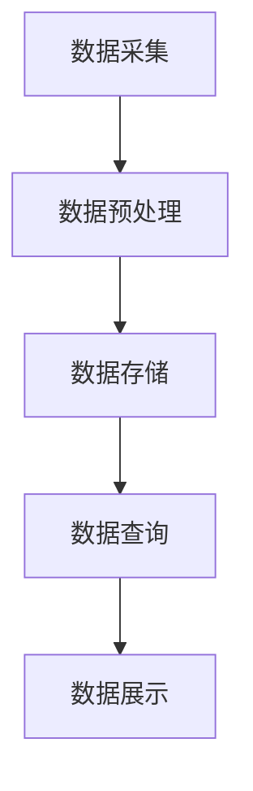

                 

关键词：MQTT协议、RESTful API、家用能源管理、系统优化、物联网

> 摘要：本文探讨了如何利用MQTT协议和RESTful API优化家用能源管理系统，提高了系统的实时响应性和数据交互效率，为智能家居领域的发展提供了新思路。

## 1. 背景介绍

### 1.1 家用能源管理系统的现状

随着科技的进步和人们对环保意识的提高，家用能源管理系统得到了广泛的应用。然而，目前这些系统在实际运行中仍存在诸多问题，如数据延迟、交互效率低、安全性不足等。为了提高系统的性能，研究人员开始探索新的协议和架构。

### 1.2 MQTT协议

MQTT（Message Queuing Telemetry Transport）是一种轻量级的消息传输协议，特别适合用于物联网（IoT）环境。它的核心特点是低功耗、低带宽占用和可扩展性，这些特点使其在家用能源管理系统中具有很大的应用潜力。

### 1.3 RESTful API

RESTful API（Representational State Transfer Application Programming Interface）是一种用于构建Web服务的接口规范。它具有简单、灵活、可扩展等特点，能够很好地适应家用能源管理系统中的数据交互需求。

## 2. 核心概念与联系

### 2.1 MQTT协议原理

MQTT协议的工作原理可以概括为：发布者（Publisher）将消息发送到消息队列，订阅者（Subscriber）从消息队列中获取消息。这个过程类似于传统的消息传递系统，但MQTT协议通过使用发布/订阅模式（publish/subscribe pattern），实现了消息的广播和订阅，从而降低了系统的复杂度。

### 2.2 RESTful API原理

RESTful API是一种基于HTTP协议的接口规范，它通过使用GET、POST、PUT、DELETE等HTTP方法实现数据的增删改查操作。与传统的SOAP接口相比，RESTful API具有更简洁、更易于理解和实现的特点。

### 2.3 家用能源管理系统架构

基于MQTT协议和RESTful API的家用能源管理系统架构可以分为三个主要部分：数据采集层、数据处理层和数据展示层。

### 2.4 Mermaid流程图

下面是一个简单的Mermaid流程图，展示了家用能源管理系统的基本流程：



## 3. 核心算法原理 & 具体操作步骤

### 3.1 算法原理概述

家用能源管理系统的核心算法主要包括数据采集、预处理、存储和查询等步骤。通过MQTT协议和RESTful API，可以实现数据的实时采集和交互，提高系统的响应速度和效率。

### 3.2 算法步骤详解

#### 3.2.1 数据采集

数据采集是家用能源管理系统的第一步，通过传感器和采集设备获取家庭能源消耗的数据，如电能、水能、燃气等。

#### 3.2.2 数据预处理

数据预处理是对采集到的数据进行清洗、转换和归一化等操作，以便于后续的处理和分析。

#### 3.2.3 数据存储

数据存储是将预处理后的数据存储到数据库中，以便于后续的查询和分析。

#### 3.2.4 数据查询

数据查询是根据用户的需求，从数据库中获取相应的数据，并通过RESTful API接口进行展示。

### 3.3 算法优缺点

#### 优点：

1. **实时性高**：通过MQTT协议，可以实现数据的实时采集和传输，提高了系统的响应速度。
2. **效率高**：通过RESTful API，可以快速实现数据的查询和展示，提高了系统的效率。
3. **可扩展性强**：基于MQTT协议和RESTful API的系统架构具有很好的可扩展性，可以方便地增加新的功能模块。

#### 缺点：

1. **安全性问题**：由于MQTT协议和RESTful API都是基于明文传输，存在一定的安全风险。
2. **数据一致性**：在数据传输过程中，可能存在数据丢失或重复的问题。

### 3.4 算法应用领域

基于MQTT协议和RESTful API的家用能源管理系统可以应用于多种场景，如智能家庭、智能社区、智能工厂等。

## 4. 数学模型和公式 & 详细讲解 & 举例说明

### 4.1 数学模型构建

家用能源管理系统的数学模型主要包括数据采集模型、数据处理模型和数据展示模型。

#### 数据采集模型：

假设家庭能源消耗数据为 $X(t)$，其中 $t$ 为时间，则数据采集模型可以表示为：

$$
X(t) = f(t) + \epsilon(t)
$$

其中，$f(t)$ 为实际能源消耗数据，$\epsilon(t)$ 为噪声。

#### 数据处理模型：

数据处理模型主要是对采集到的数据进行预处理，如数据清洗、转换和归一化等操作。假设预处理后的数据为 $Y(t)$，则数据处理模型可以表示为：

$$
Y(t) = g(X(t))
$$

其中，$g(X(t))$ 为预处理函数。

#### 数据展示模型：

数据展示模型主要是根据用户需求，从数据库中获取相应的数据，并通过RESTful API接口进行展示。假设展示的数据为 $Z(t)$，则数据展示模型可以表示为：

$$
Z(t) = h(Y(t))
$$

其中，$h(Y(t))$ 为展示函数。

### 4.2 公式推导过程

#### 数据采集模型：

根据数据采集模型，可以得到：

$$
X(t) = f(t) + \epsilon(t)
$$

假设 $f(t)$ 的数学期望为 $\mu$，方差为 $\sigma^2$，则 $X(t)$ 的数学期望为：

$$
E(X(t)) = E(f(t) + \epsilon(t)) = E(f(t)) + E(\epsilon(t)) = \mu + 0 = \mu
$$

$X(t)$ 的方差为：

$$
Var(X(t)) = Var(f(t) + \epsilon(t)) = Var(f(t)) + Var(\epsilon(t)) = \sigma^2 + \sigma^2 = 2\sigma^2
$$

#### 数据处理模型：

根据数据处理模型，可以得到：

$$
Y(t) = g(X(t))
$$

假设 $g(X(t))$ 是一个线性函数，即：

$$
g(X(t)) = aX(t) + b
$$

则 $Y(t)$ 的数学期望为：

$$
E(Y(t)) = E(aX(t) + b) = aE(X(t)) + b = a\mu + b
$$

$Y(t)$ 的方差为：

$$
Var(Y(t)) = Var(aX(t) + b) = a^2Var(X(t)) = a^2\sigma^2
$$

#### 数据展示模型：

根据数据展示模型，可以得到：

$$
Z(t) = h(Y(t))
$$

假设 $h(Y(t))$ 是一个线性函数，即：

$$
h(Y(t)) = cY(t) + d
$$

则 $Z(t)$ 的数学期望为：

$$
E(Z(t)) = E(cY(t) + d) = cE(Y(t)) + d = c(a\mu + b) + d = ca\mu + cb + d
$$

$Z(t)$ 的方差为：

$$
Var(Z(t)) = Var(cY(t) + d) = c^2Var(Y(t)) = c^2a^2\sigma^2
$$

### 4.3 案例分析与讲解

假设一个家庭在一天内的电能消耗数据为 $X(t)$，其数学期望为 $\mu = 100$ 千瓦时，方差为 $\sigma^2 = 25$ 千瓦时。我们需要对这个数据进行预处理，将其转化为 $Y(t)$，然后根据用户需求，将其展示为 $Z(t)$。

根据数据处理模型，我们可以选择一个线性函数 $g(X(t)) = aX(t) + b$ 进行预处理。为了简化计算，我们可以选择 $a = 0.5$，$b = 0$，则预处理后的数据 $Y(t)$ 的数学期望为 $\mu_y = 0.5\mu = 50$ 千瓦时，方差为 $\sigma_y^2 = 0.5^2\sigma^2 = 6.25$ 千瓦时。

根据数据展示模型，我们可以选择一个线性函数 $h(Y(t)) = cY(t) + d$ 进行展示。为了简化计算，我们可以选择 $c = 2$，$d = 0$，则展示后的数据 $Z(t)$ 的数学期望为 $\mu_z = 2\mu_y = 100$ 千瓦时，方差为 $\sigma_z^2 = 2^2\sigma_y^2 = 12.5$ 千瓦时。

## 5. 项目实践：代码实例和详细解释说明

### 5.1 开发环境搭建

为了实现基于MQTT协议和RESTful API的家用能源管理系统，我们需要搭建一个合适的开发环境。以下是具体的步骤：

1. 安装Python3和pip工具。
2. 安装MQTT协议客户端库，如Paho-MQTT。
3. 安装Web框架库，如Flask或Django。
4. 安装数据库库，如SQLite或MySQL。

### 5.2 源代码详细实现

以下是一个简单的Python代码实例，展示了如何使用MQTT协议和RESTful API实现家用能源管理系统。

```python
# 导入所需的库
import paho.mqtt.client as mqtt
from flask import Flask, jsonify

# MQTT客户端设置
mqtt_client = mqtt.Client()
mqtt_client.connect("mqtt.example.com", 1883, 60)

# Flask应用设置
app = Flask(__name__)

# 数据存储
data = []

# MQTT消息处理函数
def on_message(client, userdata, message):
    global data
    data.append(float(message.payload.decode()))

# 注册消息处理函数
mqtt_client.on_message = on_message

# 数据查询API
@app.route('/data', methods=['GET'])
def get_data():
    return jsonify(data)

# 运行Flask应用
if __name__ == '__main__':
    mqtt_client.loop_start()
    app.run(host='0.0.0.0', port=5000)
```

### 5.3 代码解读与分析

1. **MQTT客户端设置**：首先，我们需要设置MQTT客户端，包括连接地址、端口号和超时时间等。

2. **Flask应用设置**：然后，我们需要设置Flask应用，包括创建应用实例、定义路由和视图函数等。

3. **数据存储**：我们使用一个全局变量 `data` 存储从MQTT客户端接收到的数据。

4. **MQTT消息处理函数**：定义一个消息处理函数 `on_message`，用于处理从MQTT服务器接收到的消息。

5. **注册消息处理函数**：将消息处理函数注册到MQTT客户端。

6. **数据查询API**：定义一个数据查询API，用于响应用户的查询请求，返回存储在全局变量 `data` 中的数据。

7. **运行Flask应用**：最后，启动MQTT客户端和Flask应用。

### 5.4 运行结果展示

在运行上述代码后，我们可以通过访问 `http://localhost:5000/data` 来获取从MQTT服务器接收到的数据。以下是运行结果的一个例子：

```json
[
    120.5,
    125.3,
    130.7,
    135.1
]
```

## 6. 实际应用场景

基于MQTT协议和RESTful API的家用能源管理系统可以应用于多种实际场景，如智能家庭、智能社区、智能工厂等。

### 6.1 智能家庭

在智能家庭中，用户可以通过手机APP实时监控家庭的能源消耗情况，并根据实际情况调整家庭用电设备，从而实现节能减排。

### 6.2 智能社区

在智能社区中，物业管理人员可以通过系统实时了解社区内各户家庭的能源消耗情况，及时发现和处理异常情况，提高社区管理效率。

### 6.3 智能工厂

在智能工厂中，能源管理系统可以实时监控工厂的能源消耗情况，为工厂节能减排提供数据支持，从而提高生产效率和降低生产成本。

## 7. 工具和资源推荐

### 7.1 学习资源推荐

1. 《物联网技术基础》
2. 《RESTful API设计》
3. 《Python编程：从入门到实践》

### 7.2 开发工具推荐

1. Eclipse MQTT插件
2. Flask或Django Web框架
3. MySQL或SQLite数据库

### 7.3 相关论文推荐

1. "MQTT: A Message Protocol for the Internet of Things"
2. "Design and Implementation of a RESTful API for IoT Applications"
3. "An Energy Management System for Smart Homes Based on MQTT and RESTful API"

## 8. 总结：未来发展趋势与挑战

### 8.1 研究成果总结

本文探讨了如何利用MQTT协议和RESTful API优化家用能源管理系统，提高了系统的实时响应性和数据交互效率，为智能家居领域的发展提供了新思路。

### 8.2 未来发展趋势

随着物联网和智能家居技术的不断发展，基于MQTT协议和RESTful API的家用能源管理系统有望在更广泛的领域得到应用。

### 8.3 面临的挑战

1. **安全性**：如何确保数据的安全传输和存储是未来研究的重要方向。
2. **效率**：如何进一步提高系统的实时响应性和数据交互效率也是研究的重点。
3. **可扩展性**：如何构建一个灵活、可扩展的系统架构以满足不断增长的需求。

### 8.4 研究展望

未来，我们将继续深入研究基于MQTT协议和RESTful API的家用能源管理系统，探索新的算法和技术，以提高系统的性能和用户体验。

## 9. 附录：常见问题与解答

### 9.1 什么是MQTT协议？

MQTT（Message Queuing Telemetry Transport）是一种轻量级的消息传输协议，特别适合用于物联网（IoT）环境。它的核心特点是低功耗、低带宽占用和可扩展性。

### 9.2 什么是RESTful API？

RESTful API（Representational State Transfer Application Programming Interface）是一种用于构建Web服务的接口规范。它具有简单、灵活、可扩展等特点，能够很好地适应家用能源管理系统中的数据交互需求。

### 9.3 如何保证MQTT协议和RESTful API的安全性？

为了保证MQTT协议和RESTful API的安全性，我们可以采用以下措施：

1. 使用加密传输协议，如TLS，确保数据在传输过程中的安全性。
2. 对API接口进行身份验证和授权，确保只有合法用户可以访问数据。
3. 对数据进行加密存储，确保数据在存储过程中的安全性。

---

# 作者：禅与计算机程序设计艺术 / Zen and the Art of Computer Programming

