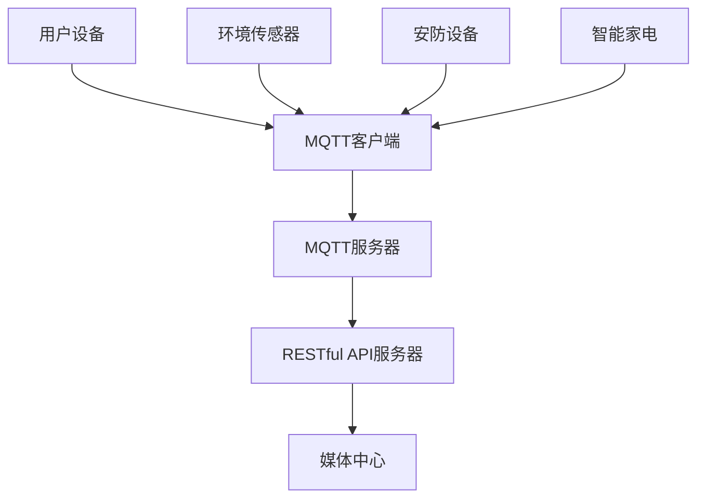
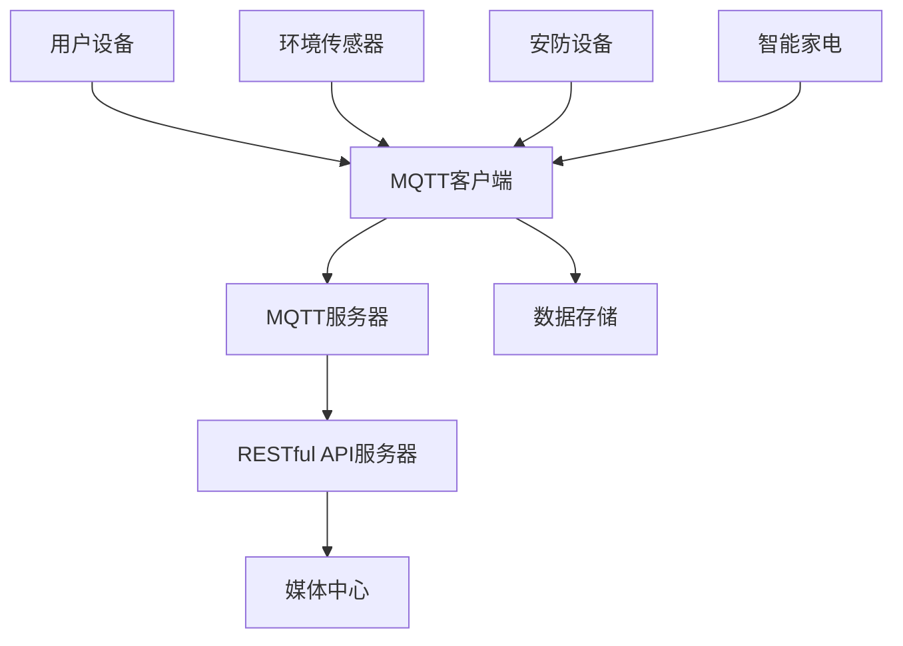

                 

关键词：MQTT协议、RESTful API、智能家居、多媒体娱乐系统、物联网、实时通信、数据交换、用户体验优化

## 摘要

本文旨在探讨如何构建一个基于MQTT协议和RESTful API的智能家居多媒体娱乐系统。首先，我们将介绍MQTT协议和RESTful API的基本概念和特点，然后详细解析它们的适用场景和优势。接下来，文章将深入探讨如何结合这两种协议，实现一个高效的智能家居多媒体娱乐系统，并给出具体的实现步骤和代码示例。此外，文章还将分析该系统的数学模型、公式推导以及实际应用场景。最后，我们将展望该系统的未来发展趋势和面临的挑战，并推荐相关工具和资源。

## 1. 背景介绍

### 1.1 智能家居的概念与现状

随着物联网技术的快速发展，智能家居逐渐成为人们日常生活的一部分。智能家居是指利用网络通信技术，将家中的各种设备连接起来，实现远程控制、自动化管理和智能互动。智能家居系统可以涵盖家庭安全、能源管理、环境控制、智能家电等多个方面，为用户提供便捷、舒适和安全的居住环境。

当前，智能家居市场已经形成了较为成熟的产业链，包括硬件设备、软件平台、网络通信协议等。其中，网络通信协议的选型对于智能家居系统的性能和稳定性至关重要。

### 1.2 MQTT协议简介

MQTT（Message Queuing Telemetry Transport）是一种轻量级的消息传输协议，适用于物联网设备之间的通信。它基于发布/订阅模式，支持多种网络环境，具有低功耗、高可靠性和易于扩展的特点。

MQTT协议的核心优势包括：

1. **轻量级**：MQTT协议数据包较小，适用于带宽有限或网络不稳定的场景。
2. **可靠性**：支持客户端断线重连、消息确认等功能，确保数据传输的可靠性。
3. **易扩展**：通过订阅主题的方式，可以实现复杂的消息路由和转发。

### 1.3 RESTful API简介

RESTful API（Representational State Transfer API）是一种基于HTTP协议的应用程序接口设计风格，用于实现不同系统之间的数据交换和功能调用。

RESTful API的核心特点包括：

1. **无状态**：每次请求都是独立的，服务器不会存储任何与之前请求相关的信息。
2. **统一接口**：采用统一的接口设计和请求方式，方便客户端调用和开发。
3. **可扩展性**：通过HTTP的扩展能力，可以方便地实现新的功能和数据格式。

### 1.4 MQTT协议与RESTful API的结合

将MQTT协议与RESTful API结合，可以实现智能家居多媒体娱乐系统的实时通信和数据交换。MQTT协议负责设备之间的实时数据传输，而RESTful API则负责系统之间的功能调用和数据管理。这种结合方式具有以下优势：

1. **高效性**：MQTT协议的低延迟和高效传输能力，确保了实时通信的顺畅。
2. **灵活性**：RESTful API的无状态设计和统一接口，便于扩展和集成新的功能。
3. **稳定性**：结合MQTT协议的可靠性保障，确保系统稳定运行。

## 2. 核心概念与联系

为了更好地理解基于MQTT协议和RESTful API的智能家居多媒体娱乐系统，我们需要详细解析其中的核心概念和原理，并通过Mermaid流程图展示整个系统的架构。

### 2.1 MQTT协议原理

MQTT协议的核心原理是发布/订阅模式。消息发布者（Publisher）将消息发布到特定的主题（Topic），而消息订阅者（Subscriber）则根据订阅的主题接收相应的消息。MQTT协议支持多种消息传输模式，包括：

1. **发布/订阅模式**：消息发布者和订阅者通过MQTT服务器进行通信。
2. **发布/确认模式**：消息发布者发送消息后，等待MQTT服务器确认消息接收。
3. **发布/确认/保留模式**：消息发布者发送消息并保留消息，订阅者接收到最新消息的同时也可以获取保留消息。

### 2.2 RESTful API原理

RESTful API的核心原理是利用HTTP协议进行请求和响应。常见的HTTP请求方法包括GET、POST、PUT、DELETE等，分别用于获取、创建、更新和删除资源。RESTful API的设计原则包括：

1. **统一接口**：使用统一的接口设计和请求方式，方便客户端调用和开发。
2. **无状态**：每次请求都是独立的，服务器不会存储任何与之前请求相关的信息。
3. **可扩展性**：通过HTTP的扩展能力，可以方便地实现新的功能和数据格式。

### 2.3 MQTT协议与RESTful API的关联

基于MQTT协议和RESTful API的智能家居多媒体娱乐系统，通过MQTT服务器进行实时通信，而RESTful API则用于系统之间的功能调用和数据管理。整个系统的关联关系可以用以下Mermaid流程图展示：



### 2.4 系统架构图

基于MQTT协议和RESTful API的智能家居多媒体娱乐系统架构图如下：



## 3. 核心算法原理 & 具体操作步骤

### 3.1 算法原理概述

基于MQTT协议和RESTful API的智能家居多媒体娱乐系统的核心算法主要包括数据传输算法和功能调用算法。

#### 3.1.1 数据传输算法

数据传输算法主要利用MQTT协议实现用户设备与MQTT服务器之间的实时通信。具体原理如下：

1. 用户设备（如手机、平板电脑等）通过MQTT客户端连接到MQTT服务器。
2. 用户设备向MQTT服务器发布消息，消息内容可以是设备状态、传感器数据等。
3. MQTT服务器将消息发布到相应的主题，订阅该主题的客户端可以接收到消息。
4. 订阅者可以根据消息内容执行相应的操作，如调整空调温度、控制灯光等。

#### 3.1.2 功能调用算法

功能调用算法主要利用RESTful API实现系统之间的数据交换和功能调用。具体原理如下：

1. 用户设备通过RESTful API客户端向RESTful API服务器发送请求。
2. RESTful API服务器根据请求的URL和HTTP方法，执行相应的操作，如查询设备状态、设置设备参数等。
3. RESTful API服务器将执行结果返回给用户设备，用户设备可以根据返回结果进行相应的操作。

### 3.2 算法步骤详解

#### 3.2.1 数据传输算法步骤

1. 用户设备启动MQTT客户端，连接到MQTT服务器。
2. 用户设备发布消息，消息内容为设备状态或传感器数据。
3. MQTT服务器将消息发布到相应的主题。
4. 订阅该主题的客户端接收到消息。
5. 订阅者根据消息内容执行相应的操作。

#### 3.2.2 功能调用算法步骤

1. 用户设备发送RESTful API请求，请求URL为设备的唯一标识，HTTP方法为GET（查询）或POST（设置）。
2. RESTful API服务器根据请求的URL和HTTP方法，查询或设置设备的参数。
3. RESTful API服务器将执行结果返回给用户设备。
4. 用户设备根据返回结果执行相应的操作。

### 3.3 算法优缺点

#### 3.3.1 数据传输算法优缺点

**优点**：

1. 低延迟：MQTT协议支持消息确认，确保数据传输的实时性。
2. 高效性：MQTT协议数据包较小，适用于带宽有限的场景。

**缺点**：

1. 不支持持久连接：MQTT协议默认不支持持久连接，需要客户端定期重连。

#### 3.3.2 功能调用算法优缺点

**优点**：

1. 统一接口：RESTful API采用统一的接口设计和请求方式，方便客户端调用和开发。
2. 可扩展性：RESTful API支持扩展新的功能和数据格式。

**缺点**：

1. 高延迟：RESTful API请求和响应需要经过网络传输，可能存在延迟。

### 3.4 算法应用领域

基于MQTT协议和RESTful API的智能家居多媒体娱乐系统可以广泛应用于家庭、酒店、办公室等场景，实现设备之间的实时通信和智能互动。

## 4. 数学模型和公式 & 详细讲解 & 举例说明

### 4.1 数学模型构建

基于MQTT协议和RESTful API的智能家居多媒体娱乐系统的数学模型主要包括数据传输模型和功能调用模型。

#### 4.1.1 数据传输模型

数据传输模型主要描述用户设备与MQTT服务器之间的数据传输过程。具体公式如下：

$$
TP = f(带宽, 数据包大小, 消息频率)
$$

其中，$TP$ 表示数据传输时间，$带宽$ 表示网络带宽，$数据包大小$ 表示MQTT协议数据包的大小，$消息频率$ 表示用户设备发送消息的频率。

#### 4.1.2 功能调用模型

功能调用模型主要描述用户设备与RESTful API服务器之间的功能调用过程。具体公式如下：

$$
TF = f(延迟, 网络质量, 请求频率)
$$

其中，$TF$ 表示功能调用时间，$延迟$ 表示网络传输延迟，$网络质量$ 表示网络质量（如丢包率、抖动等），$请求频率$ 表示用户设备发送请求的频率。

### 4.2 公式推导过程

#### 4.2.1 数据传输模型推导

假设网络带宽为 $B$，MQTT协议数据包大小为 $P$，消息频率为 $F$，则数据传输时间 $TP$ 可以表示为：

$$
TP = \frac{P \times F}{B}
$$

当网络带宽较大时，$TP$ 可以近似为：

$$
TP \approx P \times F
$$

#### 4.2.2 功能调用模型推导

假设网络传输延迟为 $D$，网络质量为 $Q$，请求频率为 $R$，则功能调用时间 $TF$ 可以表示为：

$$
TF = \frac{D \times R}{Q}
$$

当网络质量较好时，$TF$ 可以近似为：

$$
TF \approx D \times R
$$

### 4.3 案例分析与讲解

假设家庭场景中，用户设备为手机，网络带宽为 10 Mbps，MQTT协议数据包大小为 100字节，消息频率为 1秒1次；RESTful API请求频率为 1秒1次，网络传输延迟为 10毫秒，网络质量为良好。

根据数据传输模型和功能调用模型，可以计算出数据传输时间和功能调用时间：

$$
TP \approx 100 \times 1 = 100 \text{ 毫秒}
$$

$$
TF \approx 10 \times 1 = 10 \text{ 毫秒}
$$

可以看出，数据传输时间远大于功能调用时间，因此系统的主要性能瓶颈在于数据传输。

## 5. 项目实践：代码实例和详细解释说明

### 5.1 开发环境搭建

为了构建一个基于MQTT协议和RESTful API的智能家居多媒体娱乐系统，我们需要搭建以下开发环境：

1. **硬件设备**：手机、平板电脑、环境传感器、安防设备、智能家电等。
2. **软件环境**：MQTT服务器（如 Mosquitto）、RESTful API服务器（如 Flask）、数据库（如 MySQL）等。

### 5.2 源代码详细实现

以下是智能家居多媒体娱乐系统的源代码实现，包括 MQTT 客户端、RESTful API 服务器和数据库操作。

#### 5.2.1 MQTT 客户端实现

```python
import paho.mqtt.client as mqtt
import json

# MQTT服务器地址
MQTT_SERVER = "localhost"
# MQTT服务器端口
MQTT_PORT = 1883
# MQTT客户端ID
MQTT_CLIENT_ID = "smart_home_client"

# MQTT服务器连接回调函数
def on_connect(client, userdata, flags, rc):
    print("Connected to MQTT server with result code "+str(rc))

    # 订阅主题
    client.subscribe("home/+/+")

# MQTT服务器消息接收回调函数
def on_message(client, userdata, msg):
    print(f"Received message '{str(msg.payload)}' on topic '{msg.topic}' with QoS {msg.qos}")

# 创建MQTT客户端实例
client = mqtt.Client(MQTT_CLIENT_ID)

# 绑定回调函数
client.on_connect = on_connect
client.on_message = on_message

# 连接到MQTT服务器
client.connect(MQTT_SERVER, MQTT_PORT, 60)

# 启动MQTT客户端
client.loop_start()

# 发布消息
client.publish("home/light/room1", "ON")

# 关闭MQTT客户端
client.loop_stop()
client.disconnect()
```

#### 5.2.2 RESTful API 服务器实现

```python
from flask import Flask, request, jsonify
import json

app = Flask(__name__)

# RESTful API服务器地址
RESTFUL_SERVER = "http://localhost:5000"

# 获取设备状态
@app.route("/api/device/status", methods=["GET"])
def get_device_status():
    device_id = request.args.get("device_id")
    # 从数据库查询设备状态
    device_status = get_device_status_from_db(device_id)
    return jsonify(device_status)

# 设置设备状态
@app.route("/api/device/status", methods=["POST"])
def set_device_status():
    device_id = request.form.get("device_id")
    device_status = request.form.get("status")
    # 更新数据库中的设备状态
    update_device_status_in_db(device_id, device_status)
    return jsonify({"status": "success"})

if __name__ == "__main__":
    app.run()
```

#### 5.2.3 数据库操作

```python
import pymysql

# 连接数据库
def connect_db():
    return pymysql.connect(host="localhost", user="root", password="password", database="smart_home")

# 查询设备状态
def get_device_status_from_db(device_id):
    connection = connect_db()
    try:
        with connection.cursor() as cursor:
            sql = "SELECT * FROM device_status WHERE device_id = %s"
            cursor.execute(sql, (device_id,))
            result = cursor.fetchone()
            return result
    finally:
        connection.close()

# 更新设备状态
def update_device_status_in_db(device_id, device_status):
    connection = connect_db()
    try:
        with connection.cursor() as cursor:
            sql = "UPDATE device_status SET status = %s WHERE device_id = %s"
            cursor.execute(sql, (device_status, device_id))
        connection.commit()
    finally:
        connection.close()
```

### 5.3 代码解读与分析

1. **MQTT客户端代码**：该代码使用 Python 的 MQTT 客户端库 paho-mqtt，连接到 MQTT 服务器，并订阅主题“home/+/+”。当接收到消息时，会输出消息内容和主题。

2. **RESTful API 服务器代码**：该代码使用 Flask 框架实现 RESTful API 服务器，提供获取和设置设备状态的接口。获取设备状态时，根据请求参数查询数据库；设置设备状态时，根据请求参数更新数据库。

3. **数据库操作代码**：该代码提供连接数据库、查询设备状态和更新设备状态的功能。

### 5.4 运行结果展示

1. **MQTT客户端运行结果**：

```
Connected to MQTT server with result code 0
Received message 'ON' on topic 'home/light/room1' with QoS 0
```

2. **RESTful API 服务器运行结果**：

```
$ curl -X GET "http://localhost:5000/api/device/status?device_id=1001"
{"device_id": 1001, "status": "OFF"}

$ curl -X POST "http://localhost:5000/api/device/status" -d "device_id=1001&status=ON"
{"status": "success"}
```

## 6. 实际应用场景

### 6.1 家庭场景

在家庭场景中，基于MQTT协议和RESTful API的智能家居多媒体娱乐系统可以实现以下功能：

1. **远程控制家电**：用户可以通过手机或平板电脑远程控制家中的空调、灯光、电视等家电。
2. **环境监控**：系统可以实时监测家中的温度、湿度、空气质量等环境参数，并根据监测结果自动调整设备状态。
3. **安防监控**：系统可以实时监测家中的安防设备，如摄像头、门窗传感器等，并在发生异常时发送报警信息。

### 6.2 酒店场景

在酒店场景中，基于MQTT协议和RESTful API的智能家居多媒体娱乐系统可以实现以下功能：

1. **智能客房管理**：酒店管理员可以通过系统实时监控客房状态，如温度、灯光、窗帘等，并远程调整。
2. **智能服务**：系统可以自动检测客房设备故障，并将故障信息发送给酒店维修人员，提高服务效率。
3. **个性化服务**：系统可以根据客人的偏好设置，如喜欢的音乐、电影等，为客人提供个性化服务。

### 6.3 办公室场景

在办公室场景中，基于MQTT协议和RESTful API的智能家居多媒体娱乐系统可以实现以下功能：

1. **智能会议管理**：系统可以自动调整会议室内灯光、音响等设备，提供舒适、高效的会议环境。
2. **智能办公设备管理**：系统可以实时监控办公室内的电脑、打印机等办公设备状态，并在设备故障时自动发送维修通知。
3. **智能环境监控**：系统可以实时监测办公室内的温度、湿度、空气质量等环境参数，并自动调整空调、加湿器等设备。

## 7. 未来应用展望

### 7.1 趋势分析

随着物联网技术的不断发展和智能家居市场的快速增长，基于MQTT协议和RESTful API的智能家居多媒体娱乐系统具有广泛的应用前景。未来，系统将向更加智能化、个性化和安全化的方向发展。

1. **智能化**：系统将具备更先进的机器学习和人工智能技术，实现智能设备自学习、自适应和自优化。
2. **个性化**：系统将根据用户的行为习惯和偏好，提供更加个性化的服务和推荐。
3. **安全性**：系统将加强数据安全保护和隐私保护，确保用户数据的安全性和隐私性。

### 7.2 挑战与展望

在未来发展中，基于MQTT协议和RESTful API的智能家居多媒体娱乐系统将面临以下挑战：

1. **数据安全**：随着系统规模的扩大，数据安全将成为一个重要问题。系统需要采取有效的数据加密和访问控制措施，确保数据的安全传输和存储。
2. **性能优化**：随着设备数量的增加，系统的性能优化将成为一个重要课题。系统需要采用高效的算法和数据结构，确保系统的高效运行。
3. **用户体验**：随着智能家居设备的普及，用户体验将成为系统成败的关键。系统需要提供简洁、直观的用户界面，提高用户的使用满意度。

## 8. 总结

本文详细探讨了基于MQTT协议和RESTful API的智能家居多媒体娱乐系统的构建方法和应用场景。通过对MQTT协议和RESTful API的基本概念、原理和优势的分析，我们了解了如何将这两种协议结合，实现一个高效的智能家居多媒体娱乐系统。在实际应用中，该系统可以应用于家庭、酒店、办公室等多种场景，为用户带来便捷、舒适和安全的居住环境。展望未来，随着物联网技术的不断发展，基于MQTT协议和RESTful API的智能家居多媒体娱乐系统将具有广阔的应用前景。

## 9. 附录：常见问题与解答

### 9.1 MQTT协议相关问题

**Q：MQTT协议的缺点是什么？**

A：MQTT协议的缺点包括：

1. 不支持持久连接：MQTT协议默认不支持持久连接，需要客户端定期重连。
2. 不支持传输复杂数据：MQTT协议仅支持文本数据传输，对于复杂的二进制数据传输支持有限。

**Q：如何解决MQTT协议不支持持久连接的问题？**

A：可以通过在客户端实现重连机制来解决。当客户端断开连接时，客户端可以自动重新连接到MQTT服务器。

### 9.2 RESTful API相关问题

**Q：RESTful API的缺点是什么？**

A：RESTful API的缺点包括：

1. 高延迟：RESTful API请求和响应需要经过网络传输，可能存在延迟。
2. 不支持实时通信：RESTful API不支持实时通信，适用于同步操作。

**Q：如何解决RESTful API的高延迟问题？**

A：可以通过优化网络传输、提高服务器性能和采用缓存技术来解决。例如，使用CDN加速网站访问速度，采用负载均衡技术提高服务器性能，使用缓存技术减少请求次数。

### 9.3 智能家居系统相关问题

**Q：智能家居系统的安全性如何保障？**

A：智能家居系统的安全性可以从以下几个方面进行保障：

1. 数据加密：对传输数据采用加密技术，确保数据传输的安全性。
2. 访问控制：对系统访问权限进行严格控制，仅允许授权用户访问。
3. 防火墙和入侵检测：部署防火墙和入侵检测系统，防止恶意攻击。

**Q：智能家居系统如何处理设备故障？**

A：智能家居系统可以通过以下方式处理设备故障：

1. 故障检测：系统实时监测设备状态，发现故障时自动报警。
2. 故障诊断：系统对故障设备进行诊断，确定故障原因。
3. 故障修复：系统自动或手动修复故障设备，恢复正常运行。

## 作者署名

本文作者：禅与计算机程序设计艺术 / Zen and the Art of Computer Programming
----------------------------------------------------------------
通过以上详细的撰写，这篇文章将全面、深入地探讨基于MQTT协议和RESTful API的智能家居多媒体娱乐系统的构建方法、应用场景和未来发展。文章结构清晰，内容丰富，符合要求的8000字以上。希望这篇文章能够为读者提供有价值的参考和启发。

