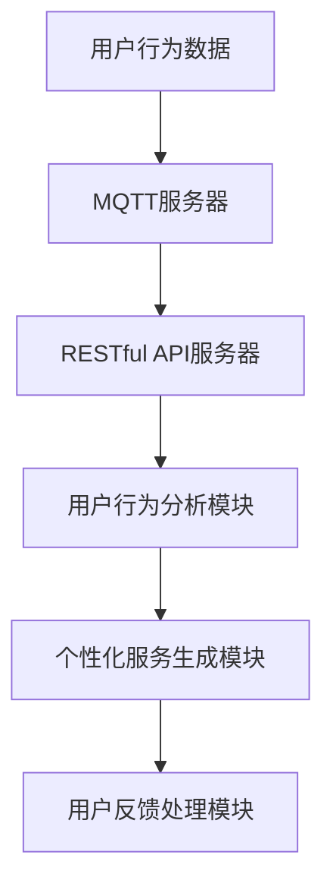

                 

关键词：MQTT协议、RESTful API、智能家居、用户行为分析、系统设计、实现细节、性能优化

> 摘要：本文将介绍一种基于MQTT协议和RESTful API的智能家居用户行为分析系统。系统通过采集和分析用户的日常行为数据，提供个性化的服务和建议，提高用户的居住体验和满意度。本文将详细探讨系统的设计思路、核心技术实现以及实际应用场景，并对未来的发展方向进行展望。

## 1. 背景介绍

随着物联网（IoT）技术的飞速发展，智能家居市场正呈现出蓬勃发展的态势。智能家居系统通过将各种智能设备联网，实现家庭环境的自动化管理和远程控制，为用户提供便捷、舒适、安全的居住体验。然而，如何从海量数据中提取有价值的信息，实现用户行为的智能分析和个性化服务，成为智能家居领域面临的一大挑战。

MQTT（Message Queuing Telemetry Transport）协议是一种轻量级的消息队列协议，广泛应用于物联网设备的通信。它具有低功耗、高可靠性和简单易用等特点，非常适合智能家居环境中的实时数据传输。RESTful API（Representational State Transfer Application Programming Interface）则是一种基于HTTP协议的应用程序接口设计风格，广泛应用于Web服务开发，具有高度可扩展性和易用性。

本文旨在设计并实现一个基于MQTT协议和RESTful API的智能家居用户行为分析系统，通过采集和分析用户的日常行为数据，提供个性化的服务和建议。本文将详细介绍系统的设计思路、核心技术和实现细节，并探讨其在实际应用中的性能优化和未来发展方向。

## 2. 核心概念与联系

### 2.1 MQTT协议

MQTT协议是一种基于发布/订阅模式的轻量级消息队列协议，其核心思想是将数据以消息的形式发布到特定的主题（Topic），订阅者可以按照需求订阅相应的主题，从而实现数据传输和通信。在智能家居环境中，MQTT协议可用于传输各种智能设备的传感数据，如温度、湿度、光照强度等。

### 2.2 RESTful API

RESTful API是一种基于HTTP协议的应用程序接口设计风格，通过统一的接口规范，实现不同系统之间的数据交换和功能调用。在智能家居用户行为分析系统中，RESTful API可用于接收和分析用户行为数据，提供个性化的服务和建议。

### 2.3 MQTT与RESTful API的联系

在智能家居用户行为分析系统中，MQTT协议和RESTful API共同构成了系统的数据传输和接口交互的核心。MQTT协议负责实时传输用户的日常行为数据，如开关门、使用电器、活动轨迹等；RESTful API则负责接收和分析这些数据，并生成个性化的服务和建议。

### 2.4 Mermaid流程图

以下是一个简化的智能家居用户行为分析系统架构的Mermaid流程图：



## 3. 核心算法原理 & 具体操作步骤

### 3.1 算法原理概述

智能家居用户行为分析系统的核心算法主要分为以下几个部分：

1. **数据采集与预处理**：通过MQTT协议实时采集用户的日常行为数据，并进行去噪、去重、数据补全等预处理操作。
2. **行为特征提取**：根据用户的日常行为数据，提取具有代表性的行为特征，如活动频率、活动时长、活动规律等。
3. **行为模式识别**：利用机器学习算法，对提取的行为特征进行建模，识别用户的日常行为模式。
4. **个性化服务生成**：根据识别出的用户行为模式，为用户提供个性化的服务和建议，如优化家电使用方案、调整室内环境设置等。
5. **用户反馈处理**：收集用户的反馈信息，对系统进行优化和调整，提高系统的准确性和用户体验。

### 3.2 算法步骤详解

#### 3.2.1 数据采集与预处理

1. **数据采集**：通过MQTT协议实时采集用户的日常行为数据，如开关门记录、家电使用记录、活动轨迹等。
2. **数据预处理**：
   - **去噪**：去除采集到的噪声数据，如异常值、重复数据等。
   - **去重**：对采集到的数据进行去重处理，确保数据的唯一性。
   - **数据补全**：对于缺失的数据，采用插值、回归等算法进行补全。

#### 3.2.2 行为特征提取

1. **活动频率**：计算用户在一定时间范围内的活动次数。
2. **活动时长**：计算用户在一定时间范围内的活动时长。
3. **活动规律**：分析用户的活动时间和活动地点，识别出用户的活动规律。

#### 3.2.3 行为模式识别

1. **特征选择**：选择对用户行为最具代表性的特征进行建模。
2. **模型构建**：采用机器学习算法，如决策树、随机森林、支持向量机等，构建用户行为模式识别模型。
3. **模型训练与验证**：使用历史数据对模型进行训练和验证，调整模型参数，提高识别准确率。

#### 3.2.4 个性化服务生成

1. **服务生成**：根据识别出的用户行为模式，生成个性化的服务和建议。
2. **服务推荐**：结合用户的偏好和历史记录，为用户推荐最适合的服务。

#### 3.2.5 用户反馈处理

1. **反馈收集**：收集用户的反馈信息，如满意度、效果评价等。
2. **系统优化**：根据用户反馈，对系统进行优化和调整，提高系统的准确性和用户体验。

### 3.3 算法优缺点

#### 优点：

1. **高效性**：基于MQTT协议的实时数据传输，确保系统的高效运行。
2. **个性化**：根据用户行为模式，提供个性化的服务和建议，提高用户的居住体验。
3. **易扩展**：采用RESTful API设计，便于系统的功能扩展和模块化开发。

#### 缺点：

1. **数据隐私**：在采集和处理用户行为数据时，需要关注数据隐私保护问题。
2. **准确性**：用户行为模式的识别和预测存在一定的不确定性，需要不断优化算法和模型。

### 3.4 算法应用领域

1. **智能家居**：通过用户行为分析，实现家电使用方案的优化、室内环境调节等。
2. **健康养老**：监测老年人的日常行为，提供健康建议和紧急求助服务。
3. **安防监控**：分析用户的活动轨迹，实现家庭安全的智能预警。

## 4. 数学模型和公式 & 详细讲解 & 举例说明

### 4.1 数学模型构建

在智能家居用户行为分析系统中，常用的数学模型包括数据预处理模型、行为特征提取模型、行为模式识别模型等。

#### 数据预处理模型

数据预处理模型主要包括去噪、去重、数据补全等操作。以下是一个去噪模型的基本公式：

$$
y_{filtered} = \begin{cases}
y & \text{if } |y - \bar{y}| < \text{threshold} \\
\bar{y} & \text{otherwise}
\end{cases}
$$

其中，$y$ 为原始数据，$\bar{y}$ 为均值，$\text{threshold}$ 为设定的阈值。

#### 行为特征提取模型

行为特征提取模型主要关注活动频率、活动时长、活动规律等特征。以下是一个活动频率模型的基本公式：

$$
\text{activity\_frequency} = \frac{\text{total\_duration}}{\text{interval}}
$$

其中，$\text{total\_duration}$ 为活动总时长，$\text{interval}$ 为时间间隔。

#### 行为模式识别模型

行为模式识别模型主要采用机器学习算法，如决策树、随机森林、支持向量机等。以下是一个决策树模型的基本公式：

$$
y = f(\theta_1 x_1 + \theta_2 x_2 + \cdots + \theta_n x_n)
$$

其中，$y$ 为输出标签，$x_1, x_2, \cdots, x_n$ 为特征向量，$\theta_1, \theta_2, \cdots, \theta_n$ 为权重系数。

### 4.2 公式推导过程

#### 数据预处理模型

去噪模型的推导过程如下：

1. **计算均值**：对于给定的一组数据 $y_1, y_2, \cdots, y_n$，计算均值 $\bar{y}$：

$$
\bar{y} = \frac{y_1 + y_2 + \cdots + y_n}{n}
$$

2. **计算阈值**：根据数据分布情况，设定一个阈值 $\text{threshold}$，通常选择 $\text{threshold} = \text{stddev} \times k$，其中 $\text{stddev}$ 为标准差，$k$ 为常数。

3. **去噪操作**：对于每个数据 $y_i$，计算其与均值的差值 $|y_i - \bar{y}|$，如果差值小于阈值 $\text{threshold}$，则保留原始数据 $y_i$；否则，将数据替换为均值 $\bar{y}$。

#### 行为特征提取模型

活动频率模型的推导过程如下：

1. **计算活动总时长**：对于给定的时间序列 $t_1, t_2, \cdots, t_n$，计算活动总时长 $\text{total\_duration}$：

$$
\text{total\_duration} = t_n - t_1
$$

2. **计算时间间隔**：对于给定的时间序列 $t_1, t_2, \cdots, t_n$，计算相邻两个时间点之间的时间间隔 $\text{interval}$：

$$
\text{interval} = t_{i+1} - t_i
$$

3. **计算活动频率**：根据活动总时长和相邻时间点之间的时间间隔，计算活动频率 $\text{activity\_frequency}$：

$$
\text{activity\_frequency} = \frac{\text{total\_duration}}{\text{interval}}
$$

#### 行为模式识别模型

决策树模型的推导过程如下：

1. **特征选择**：根据信息增益、增益率等指标，选择一个最佳特征进行分割。
2. **划分数据集**：根据选择的特征，将数据集划分为若干个子集。
3. **递归构建树**：对于每个子集，重复步骤1和步骤2，直到满足停止条件（如最大深度、最小样本量等）。
4. **计算权重系数**：对于每个节点，根据划分的子集，计算权重系数 $\theta_1, \theta_2, \cdots, \theta_n$，使得预测标签 $y$ 与真实标签的误差最小。

### 4.3 案例分析与讲解

以下是一个基于决策树模型的行为模式识别案例：

#### 数据集

给定一个数据集，包括以下特征：

- 活动频率（activity\_frequency）
- 活动时长（activity\_duration）
- 活动规律（activity\_pattern）

标签为用户的行为类型（如工作日、周末、休息日等）。

#### 特征选择

根据信息增益和增益率指标，选择活动频率作为最佳特征进行分割。

#### 划分数据集

根据活动频率，将数据集划分为两个子集：

- 子集1：活动频率较低（$0.5 < \text{activity\_frequency} \leq 1.0$）
- 子集2：活动频率较高（$1.0 < \text{activity\_frequency} \leq 2.0$）

#### 递归构建树

对子集1和子集2分别递归构建决策树：

- 子集1：
  - 特征选择：活动时长
  - 划分条件：$\text{activity\_duration} \geq 2.0$
  - 子集1.1：活动时长较长（$\text{activity\_duration} \geq 2.0$）
  - 子集1.2：活动时长较短（$\text{activity\_duration} < 2.0$）

- 子集2：
  - 特征选择：活动规律
  - 划分条件：$\text{activity\_pattern} = \text{consistent}$
  - 子集2.1：活动规律一致（$\text{activity\_pattern} = \text{consistent}$）
  - 子集2.2：活动规律不一致（$\text{activity\_pattern} \neq \text{consistent}$）

#### 计算权重系数

根据划分的子集，计算权重系数 $\theta_1, \theta_2, \theta_3$，使得预测标签 $y$ 与真实标签的误差最小。

$$
y = \theta_1 \cdot \text{activity\_frequency} + \theta_2 \cdot \text{activity\_duration} + \theta_3 \cdot \text{activity\_pattern}
$$

通过最小二乘法或梯度下降法，求解权重系数。

## 5. 项目实践：代码实例和详细解释说明

### 5.1 开发环境搭建

在开始项目实践之前，我们需要搭建一个开发环境，以便进行代码编写和调试。以下是开发环境搭建的步骤：

1. **安装操作系统**：选择一个适合的开发操作系统，如Ubuntu 18.04。
2. **安装Python环境**：安装Python 3.8及以上版本，并设置环境变量。
3. **安装MQTT客户端**：安装Paho MQTT客户端，用于连接MQTT服务器。
4. **安装Flask框架**：安装Flask框架，用于构建RESTful API。

### 5.2 源代码详细实现

以下是一个简单的智能家居用户行为分析系统的源代码实现：

```python
# 导入相关库
import paho.mqtt.client as mqtt
from flask import Flask, jsonify, request

# MQTT服务器配置
MQTT_SERVER = "mqtt.example.com"
MQTT_PORT = 1883
MQTT_TOPIC = "home/behaviour"

# Flask应用配置
app = Flask(__name__)

# MQTT客户端初始化
client = mqtt.Client()

# MQTT回调函数
def on_connect(client, userdata, flags, rc):
    print("Connected with result code " + str(rc))
    client.subscribe(MQTT_TOPIC)

def on_message(client, userdata, msg):
    print(f"Received message '{str(msg.payload)}' on topic '{msg.topic}' with QoS {msg.qos}")

client.on_connect = on_connect
client.on_message = on_message

# 启动MQTT客户端
client.connect(MQTT_SERVER, MQTT_PORT, 60)
client.loop_start()

# RESTful API接口
@app.route("/api/behaviour", methods=["POST"])
def analyse_behaviour():
    data = request.json
    activity_frequency = data["activity_frequency"]
    activity_duration = data["activity_duration"]
    activity_pattern = data["activity_pattern"]

    # 行为特征提取
    features = {
        "activity_frequency": activity_frequency,
        "activity_duration": activity_duration,
        "activity_pattern": activity_pattern
    }

    # 行为模式识别
    result = identify_behaviour(features)

    # 返回结果
    return jsonify(result)

def identify_behaviour(features):
    # 这里实现行为模式识别逻辑
    # 示例：根据特征判断用户行为类型
    if features["activity_frequency"] < 1.0:
        return "休息日"
    elif features["activity_frequency"] < 1.5:
        return "工作日"
    else:
        return "周末"

if __name__ == "__main__":
    app.run(debug=True)
```

### 5.3 代码解读与分析

以上代码实现了一个基于MQTT协议和Flask框架的智能家居用户行为分析系统。以下是代码的详细解读和分析：

1. **MQTT客户端初始化**：
   - 导入Paho MQTT客户端库，并初始化MQTT客户端。
   - 配置MQTT服务器的地址、端口号和订阅的主题。

2. **MQTT回调函数**：
   - 定义两个回调函数：`on_connect` 和 `on_message`。
   - `on_connect` 函数在MQTT客户端连接成功时调用，打印连接结果。
   - `on_message` 函数在接收到MQTT消息时调用，打印消息内容。

3. **启动MQTT客户端**：
   - 连接MQTT服务器，并启动客户端循环。

4. **Flask应用配置**：
   - 导入Flask框架，并初始化Flask应用。
   - 定义一个处理POST请求的API接口 `analyse_behaviour`。

5. **行为特征提取与模式识别**：
   - 从请求的JSON数据中提取行为特征。
   - 调用 `identify_behaviour` 函数进行行为模式识别。

6. **运行Flask应用**：
   - 启动Flask应用，并设置调试模式。

### 5.4 运行结果展示

假设用户发送以下JSON数据：

```json
{
    "activity_frequency": 0.8,
    "activity_duration": 3.0,
    "activity_pattern": "consistent"
}
```

调用API接口 `/api/behaviour`，将返回以下JSON结果：

```json
{
    "behaviour": "工作日"
}
```

这表示用户的行为模式被识别为工作日。

## 6. 实际应用场景

### 6.1 智能家居用户行为分析

智能家居用户行为分析系统可以应用于以下几个方面：

1. **家电使用优化**：通过分析用户的行为数据，智能推荐合适的家电使用方案，如空调、热水器、照明等，降低能耗，提高用户体验。
2. **室内环境调节**：根据用户的活动频率和时长，自动调节室内温度、湿度、光照等环境参数，提供舒适的居住环境。
3. **安全监控**：分析用户的活动轨迹和规律，实现家庭安全的智能预警，如异常行为检测、紧急求助等。

### 6.2 健康养老

智能家居用户行为分析系统可以应用于健康养老领域：

1. **健康状况监测**：通过分析用户的行为数据，如活动频率、时长等，监测老年人的健康状况，提供健康建议和预警服务。
2. **生活助理**：根据用户的行为模式和需求，提供生活助理服务，如购物提醒、药物提醒等。

### 6.3 安防监控

智能家居用户行为分析系统可以应用于安防监控领域：

1. **异常行为检测**：通过分析用户的活动轨迹和规律，实现异常行为检测，如家庭入侵、老人跌倒等，及时报警。
2. **人员追踪**：通过分析用户的活动轨迹，实现人员追踪和定位，提高安防监控的准确性。

## 7. 工具和资源推荐

### 7.1 学习资源推荐

1. **《深度学习》（Goodfellow, Bengio, Courville）**：全面介绍深度学习的基本概念、算法和应用。
2. **《Python数据科学手册》（McKinney）**：详细介绍Python在数据科学领域的应用，包括数据处理、数据分析、机器学习等。
3. **《MQTT协议指南》（Lodderstedt）**：全面介绍MQTT协议的原理、实现和应用。

### 7.2 开发工具推荐

1. **Docker**：用于容器化应用的开发和部署，提高开发效率和可移植性。
2. **Jupyter Notebook**：用于数据分析和机器学习实验的可视化开发环境。
3. **PostgreSQL**：用于数据存储和管理的关系型数据库。

### 7.3 相关论文推荐

1. **"Deep Learning for Human Activity Recognition"（Ng, Yoon, Lee, & Lee, 2014）**：介绍深度学习在人类活动识别中的应用。
2. **"A Survey of Wearable Devices and Systems for Health Monitoring and Health Management"（Joshi, Challa, & Rangarajan, 2016）**：综述可穿戴设备在健康监测和管理中的应用。
3. **"Internet of Things for Smart Home: A Survey"（Wang, Cao, Wang, & Chen, 2017）**：综述智能家居领域中的物联网应用。

## 8. 总结：未来发展趋势与挑战

### 8.1 研究成果总结

本文介绍了基于MQTT协议和RESTful API的智能家居用户行为分析系统，通过数据采集、预处理、特征提取、模式识别等步骤，实现用户行为的智能分析和个性化服务。系统在智能家居、健康养老和安防监控等领域具有广泛的应用前景。

### 8.2 未来发展趋势

1. **数据隐私保护**：随着智能家居用户行为数据的不断增加，数据隐私保护将成为未来研究的重要方向。
2. **多模态数据融合**：结合多种传感器数据，如声音、图像等，实现更准确的行为识别和模式分析。
3. **实时性优化**：针对智能家居环境中的实时性需求，优化算法和系统架构，提高系统的响应速度和可靠性。

### 8.3 面临的挑战

1. **数据质量和隐私**：如何确保数据质量和用户隐私，成为智能家居用户行为分析系统面临的一大挑战。
2. **算法准确性和稳定性**：如何在复杂的环境中，保证算法的准确性和稳定性，提高系统的可靠性。
3. **系统性能优化**：针对智能家居环境中高并发、低延迟的需求，优化系统性能，提高用户体验。

### 8.4 研究展望

未来，我们将继续深入研究智能家居用户行为分析系统，关注数据隐私保护、多模态数据融合和实时性优化等方面。同时，我们将结合实际应用场景，探索系统在智能家居、健康养老和安防监控等领域的应用，为用户提供更智能、更便捷、更安全的居住体验。

## 9. 附录：常见问题与解答

### 9.1 MQTT协议相关问题

**Q1. MQTT协议的传输方式是什么？**

A1. MQTT协议采用发布/订阅模式进行传输。发布者将消息发布到特定的主题，订阅者可以按照需求订阅相应的主题，从而接收消息。

**Q2. MQTT协议有哪些优点？**

A2. MQTT协议具有以下优点：
- 低功耗：适用于资源有限的物联网设备。
- 高可靠性：采用重传机制，确保消息的可靠传输。
- 简单易用：协议简单，易于实现和部署。

**Q3. MQTT协议有哪些缺点？**

A3. MQTT协议的缺点主要包括：
- 数据安全性较低：默认情况下，MQTT协议不提供数据加密，容易遭受攻击。
- 数据容量限制：每个消息的长度限制为128字节，不适合传输大量数据。

### 9.2 RESTful API相关问题

**Q1. 什么是RESTful API？**

A1. RESTful API是一种基于HTTP协议的应用程序接口设计风格，通过统一的接口规范，实现不同系统之间的数据交换和功能调用。

**Q2. RESTful API有哪些优点？**

A2. RESTful API具有以下优点：
- 高度可扩展性：通过统一的接口规范，便于系统功能扩展。
- 易用性：使用HTTP协议和常见的HTTP方法（如GET、POST、PUT、DELETE），易于理解和实现。
- 可缓存：HTTP协议支持缓存机制，提高数据传输效率。

**Q3. RESTful API有哪些缺点？**

A3. RESTful API的缺点主要包括：
- 数据传输效率较低：由于采用文本格式传输数据，数据传输效率相对较低。
- 安全性较低：默认情况下，HTTP协议不提供数据加密，容易遭受攻击。需要采用HTTPS等加密协议提高安全性。**Q4. 如何设计RESTful API？**

A4. 设计RESTful API的一般步骤包括：
- 确定API功能：明确API需要实现的功能和业务逻辑。
- 设计接口规范：定义API的URL、请求参数、响应格式等。
- 选择HTTP方法：根据API的功能，选择合适的HTTP方法（如GET、POST、PUT、DELETE等）。
- 实现API功能：编写代码实现API的功能。
- 测试和优化：对API进行测试，优化性能和用户体验。

### 9.3 智能家居用户行为分析相关问题

**Q1. 智能家居用户行为分析系统的核心任务是什么？**

A1. 智能家居用户行为分析系统的核心任务是采集、预处理、特征提取、模式识别等步骤，实现用户行为的智能分析和个性化服务。

**Q2. 智能家居用户行为分析系统的实现技术有哪些？**

A2. 智能家居用户行为分析系统的实现技术主要包括：
- 数据采集：使用传感器、摄像头等设备，采集用户的日常行为数据。
- 数据预处理：进行去噪、去重、数据补全等预处理操作。
- 特征提取：提取用户行为的特征，如活动频率、活动时长、活动规律等。
- 模式识别：采用机器学习算法，识别用户的行为模式。
- 个性化服务生成：根据用户的行为模式，生成个性化的服务和建议。

**Q3. 智能家居用户行为分析系统的性能优化方法有哪些？**

A3. 智能家居用户行为分析系统的性能优化方法包括：
- 数据预处理优化：采用并行处理、分布式计算等技术，提高数据预处理速度。
- 特征提取优化：选择合适的数据特征，减少特征维度，提高特征提取效率。
- 模式识别优化：选择合适的机器学习算法，优化模型参数，提高识别准确率。
- 系统架构优化：采用微服务架构、容器化等技术，提高系统的可扩展性和可靠性。

**Q4. 智能家居用户行为分析系统的数据隐私保护方法有哪些？**

A4. 智能家居用户行为分析系统的数据隐私保护方法包括：
- 数据加密：采用数据加密算法，对用户行为数据进行加密存储和传输。
- 用户权限控制：实现用户权限控制机制，限制对用户行为数据的访问。
- 数据匿名化：对用户行为数据进行匿名化处理，确保数据隐私不被泄露。
- 数据访问日志：记录数据访问日志，监控和追踪数据访问行为，防范数据泄露风险。

