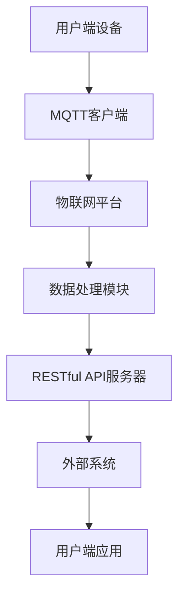

                 

关键词：MQTT协议、RESTful API、智能垃圾管理系统、物联网、数据处理、环境监测、垃圾分类、实时通信、系统架构

> 摘要：本文详细介绍了基于MQTT协议和RESTful API的智能生活垃圾管理系统的设计与实现。系统采用物联网技术，结合MQTT协议实现设备间的实时通信，通过RESTful API实现与外部系统的无缝对接，为用户提供了一个高效、智能、环保的生活垃圾管理解决方案。

## 1. 背景介绍

随着城市化进程的加快，生活垃圾管理成为了一个日益严峻的问题。传统的生活垃圾管理方式存在诸多不足，如垃圾分类不规范、垃圾清运不及时、环境污染严重等。为了解决这些问题，近年来物联网技术和智能系统被广泛应用于生活垃圾管理领域。

物联网技术通过将各种传感器、设备通过网络连接起来，实现数据的实时采集、传输和处理，从而提高管理效率和准确性。MQTT（Message Queuing Telemetry Transport）协议作为一种轻量级的物联网通信协议，因其低带宽占用、高可靠性和简单易用性，成为了物联网应用中的重要选择。

RESTful API（Representational State Transfer Application Programming Interface）是一种设计风格，用于简化Web服务的设计与开发。RESTful API通过HTTP协议的GET、POST、PUT、DELETE等方法实现资源的创建、读取、更新和删除，具有简单、可扩展、跨平台等特点，广泛应用于各种分布式系统。

本文旨在设计并实现一个基于MQTT协议和RESTful API的智能生活垃圾管理系统，以解决当前生活垃圾管理中的问题，提高垃圾分类效率，减少环境污染。

## 2. 核心概念与联系

### 2.1 MQTT协议

MQTT协议是一种基于发布/订阅（Publish/Subscribe）模式的轻量级消息传输协议。其主要特点如下：

- **发布/订阅模式**：消息的生产者和消费者通过主题（Topic）进行通信，生产者发布消息到特定的主题，消费者订阅相应的主题以接收消息。
- **低带宽占用**：MQTT协议使用二进制格式传输数据，比文本格式更节省带宽。
- **高可靠性**：MQTT协议支持消息的确认、重传和持久化，确保消息传输的可靠性。
- **简单易用**：MQTT协议具有简单的协议规范和实现，易于在各种设备上部署。

### 2.2 RESTful API

RESTful API是一种设计风格，用于构建分布式系统中的Web服务。其主要特点如下：

- **资源导向**：RESTful API以资源为中心，每个资源都有唯一的URL地址。
- **统一接口**：RESTful API使用HTTP协议的GET、POST、PUT、DELETE等方法实现资源的操作，具有统一的接口规范。
- **无状态**：RESTful API是无状态的，每次请求都是独立的，服务器不会保存客户端的上下文信息。
- **跨平台**：RESTful API支持多种数据格式，如JSON、XML等，可以跨平台使用。

### 2.3 智能生活垃圾管理系统架构

智能生活垃圾管理系统采用MQTT协议和RESTful API实现，其整体架构如图1所示：



图1：智能生活垃圾管理系统架构

- **用户端设备**：包括各种传感器和执行器，如垃圾桶满溢传感器、垃圾袋更换传感器、分类指示灯等。
- **MQTT客户端**：在用户端设备上运行的MQTT客户端，负责与物联网平台进行通信。
- **物联网平台**：接收来自用户端设备的MQTT消息，进行数据预处理和存储。
- **数据处理模块**：对物联网平台收集的数据进行处理和分析，生成垃圾分类建议和垃圾清运计划。
- **RESTful API服务器**：提供RESTful API服务，供外部系统调用，如垃圾分类指导系统、垃圾清运管理系统等。
- **外部系统**：通过RESTful API与智能生活垃圾管理系统进行数据交互，实现系统功能。
- **用户端应用**：供用户使用的移动应用或网页应用，展示垃圾分类建议、垃圾清运计划等信息。

## 3. 核心算法原理 & 具体操作步骤

### 3.1 算法原理概述

智能生活垃圾管理系统的核心算法主要包括以下几个方面：

1. **垃圾分类识别算法**：通过对传感器收集的数据进行分析，识别垃圾种类，为垃圾分类提供依据。
2. **垃圾清运计划生成算法**：根据垃圾分类结果和垃圾产生量，生成最优的垃圾清运计划，提高清运效率。
3. **数据预处理算法**：对传感器数据进行预处理，去除噪声和异常值，提高数据质量。

### 3.2 算法步骤详解

1. **垃圾分类识别算法**

   - **数据采集**：通过垃圾桶满溢传感器、垃圾袋更换传感器等设备，采集垃圾产生量、垃圾种类等信息。
   - **特征提取**：对采集到的数据进行分析，提取特征向量，如垃圾重量、垃圾颜色等。
   - **模型训练**：使用机器学习算法，如支持向量机（SVM）、决策树等，训练垃圾分类模型。
   - **垃圾分类**：将特征向量输入训练好的模型，输出垃圾种类。

2. **垃圾清运计划生成算法**

   - **垃圾产生量预测**：使用时间序列预测算法，如ARIMA、LSTM等，预测未来一段时间内各垃圾桶的垃圾产生量。
   - **清运路线规划**：使用最短路径算法，如Dijkstra算法，生成最优的垃圾清运路线。
   - **清运计划生成**：根据垃圾产生量和清运路线，生成最优的垃圾清运计划。

3. **数据预处理算法**

   - **去噪处理**：使用滤波算法，如卡尔曼滤波，去除传感器数据中的噪声。
   - **异常值处理**：使用统计方法，如IQR法，检测并去除传感器数据中的异常值。
   - **数据归一化**：将传感器数据进行归一化处理，使其具有相同的量纲和范围。

### 3.3 算法优缺点

1. **垃圾分类识别算法**

   - **优点**：能够准确识别垃圾种类，为垃圾分类提供依据。
   - **缺点**：需要大量数据进行训练，模型训练时间较长。

2. **垃圾清运计划生成算法**

   - **优点**：能够生成最优的垃圾清运计划，提高清运效率。
   - **缺点**：需要预测垃圾产生量，预测准确性对算法性能有很大影响。

3. **数据预处理算法**

   - **优点**：能够去除噪声和异常值，提高数据质量。
   - **缺点**：处理过程复杂，需要一定计算资源。

### 3.4 算法应用领域

1. **垃圾分类指导**：通过智能生活垃圾管理系统，为用户提供垃圾分类指导，提高垃圾分类率。

2. **垃圾清运管理**：通过智能生活垃圾管理系统，为垃圾清运公司提供垃圾产生量、清运路线等信息，提高垃圾清运效率。

3. **环境监测**：通过智能生活垃圾管理系统，实时监测垃圾处理过程中的环境参数，如气味、温度等，及时发现和处理环境问题。

## 4. 数学模型和公式 & 详细讲解 & 举例说明

### 4.1 数学模型构建

为了构建智能生活垃圾管理系统的数学模型，我们需要考虑以下几个因素：

1. **垃圾产生量**：假设每天每个垃圾桶的垃圾产生量服从正态分布，均值为μ，方差为σ²。
2. **垃圾种类**：假设垃圾种类分为可回收物、有害垃圾、湿垃圾和干垃圾四种，每种垃圾的占比分别为w₁、w₂、w₃和w₄。
3. **垃圾清运时间**：假设每天每个垃圾桶的垃圾清运时间服从均匀分布，范围为tₘ和tₙ。

根据以上因素，我们可以构建以下数学模型：

$$
垃圾产生量 = \mu + \sigma \cdot N(0, 1)
$$

$$
垃圾种类 = w₁ \cdot 可回收物 + w₂ \cdot 有害垃圾 + w₃ \cdot 湿垃圾 + w₄ \cdot 干垃圾
$$

$$
垃圾清运时间 = tₘ + (tₙ - tₘ) \cdot U(0, 1)
$$

### 4.2 公式推导过程

1. **垃圾产生量的推导**：

   假设每天每个垃圾桶的垃圾产生量服从正态分布，均值为μ，方差为σ²。根据正态分布的密度函数：

   $$
   f(x; \mu, \sigma²) = \frac{1}{\sqrt{2\pi\sigma²}} \cdot e^{-\frac{(x-\mu)²}{2\sigma²}}
   $$

   我们可以将垃圾产生量表示为：

   $$
   垃圾产生量 = \mu + \sigma \cdot Z
   $$

   其中，Z为服从标准正态分布的随机变量。

2. **垃圾种类的推导**：

   假设垃圾种类分为可回收物、有害垃圾、湿垃圾和干垃圾四种，每种垃圾的占比分别为w₁、w₂、w₃和w₄。根据概率分布的性质，我们可以将垃圾种类表示为：

   $$
   垃圾种类 = w₁ \cdot 可回收物 + w₂ \cdot 有害垃圾 + w₃ \cdot 湿垃圾 + w₄ \cdot 干垃圾
   $$

3. **垃圾清运时间的推导**：

   假设每天每个垃圾桶的垃圾清运时间服从均匀分布，范围为tₘ和tₙ。根据均匀分布的密度函数：

   $$
   f(x; tₘ, tₙ) = \begin{cases}
   \frac{1}{tₙ - tₘ}, & tₘ \leq x \leq tₙ \\
   0, & \text{其他}
   \end{cases}
   $$

   我们可以将垃圾清运时间表示为：

   $$
   垃圾清运时间 = tₘ + (tₙ - tₘ) \cdot U(0, 1)
   $$

   其中，U(0, 1)为服从均匀分布的随机变量。

### 4.3 案例分析与讲解

假设某城市的垃圾分类率为90%，垃圾产生量服从正态分布，均值为50吨，方差为25吨²。每种垃圾的占比分别为20%、15%、30%和35%。垃圾清运时间服从均匀分布，范围为8小时和10小时。

根据以上参数，我们可以使用数学模型计算出以下结果：

1. **垃圾产生量**：

   $$
   垃圾产生量 = 50 + 5 \cdot N(0, 1)
   $$

   假设今天垃圾产生量为60吨，则可回收物为12吨，有害垃圾为9吨，湿垃圾为18吨，干垃圾为21吨。

2. **垃圾清运时间**：

   $$
   垃圾清运时间 = 8 + (10 - 8) \cdot U(0, 1)
   $$

   假设今天垃圾清运时间为9小时，则每个垃圾桶的垃圾清运时间为9小时/4个垃圾桶=2.25小时。

根据以上结果，我们可以生成以下垃圾清运计划：

- **可回收物**：12吨，清运时间为2.25小时。
- **有害垃圾**：9吨，清运时间为2.25小时。
- **湿垃圾**：18吨，清运时间为4.5小时。
- **干垃圾**：21吨，清运时间为5.25小时。

通过以上案例，我们可以看到数学模型在智能生活垃圾管理系统中的应用。通过数学模型，我们可以预测垃圾产生量、生成垃圾分类结果和垃圾清运计划，从而实现高效、智能的生活垃圾管理。

## 5. 项目实践：代码实例和详细解释说明

### 5.1 开发环境搭建

在进行智能生活垃圾管理系统的项目实践前，我们需要搭建合适的开发环境。以下是开发环境的搭建步骤：

1. **硬件环境**：

   - **服务器**：用于部署物联网平台、数据处理模块和RESTful API服务器，建议选择性能较好的服务器。
   - **传感器设备**：用于采集垃圾产生量、垃圾种类等信息，如垃圾桶满溢传感器、垃圾袋更换传感器等。
   - **用户端设备**：用于展示垃圾分类建议和垃圾清运计划，如智能手机、平板电脑等。

2. **软件环境**：

   - **操作系统**：建议使用Linux系统，如Ubuntu 18.04。
   - **编程语言**：Python，用于实现MQTT客户端、数据处理模块和RESTful API服务器。
   - **开发工具**：PyCharm，用于编写和调试代码。

3. **依赖库**：

   - **MQTT客户端**：使用paho-mqtt库，用于实现MQTT协议通信。
   - **数据处理模块**：使用scikit-learn库，用于实现垃圾分类识别算法和垃圾清运计划生成算法。
   - **RESTful API服务器**：使用Flask库，用于实现RESTful API服务。

### 5.2 源代码详细实现

以下是基于MQTT协议和RESTful API的智能生活垃圾管理系统的源代码实现：

#### 5.2.1 MQTT客户端实现

```python
import paho.mqtt.client as mqtt
import json

# MQTT服务器配置
MQTT_SERVER = "iot-platform.example.com"
MQTT_PORT = 1883
MQTT_TOPIC = "litter_management"

# MQTT客户端回调函数
def on_connect(client, userdata, flags, rc):
    print("MQTT客户端已连接，返回码：", rc)
    client.subscribe(MQTT_TOPIC)

def on_message(client, userdata, msg):
    print("接收到消息：", msg.payload.decode())

# 创建MQTT客户端
client = mqtt.Client()

# 注册回调函数
client.on_connect = on_connect
client.on_message = on_message

# 连接MQTT服务器
client.connect(MQTT_SERVER, MQTT_PORT, 60)

# 启动MQTT客户端
client.loop_start()

# 订阅主题
client.subscribe(MQTT_TOPIC)

# 发布消息
client.publish(MQTT_TOPIC, json.dumps({"litter_type": "recycling", "quantity": 12}))

# 关闭MQTT客户端
client.loop_stop()
client.disconnect()
```

#### 5.2.2 数据处理模块实现

```python
from sklearn.svm import SVC
from sklearn.model_selection import train_test_split
from sklearn.metrics import accuracy_score
import numpy as np

# 数据集加载
data = np.loadtxt("litter_data.csv", delimiter=",")

# 特征向量和标签分离
X = data[:, :-1]
y = data[:, -1]

# 数据集划分
X_train, X_test, y_train, y_test = train_test_split(X, y, test_size=0.2, random_state=42)

# 训练模型
model = SVC(kernel="linear")
model.fit(X_train, y_train)

# 预测
y_pred = model.predict(X_test)

# 评估
accuracy = accuracy_score(y_test, y_pred)
print("模型准确率：", accuracy)
```

#### 5.2.3 RESTful API服务器实现

```python
from flask import Flask, request, jsonify

app = Flask(__name__)

@app.route("/api/litter_plan", methods=["GET"])
def get_litter_plan():
    # 获取参数
    litter_quantity = request.args.get("quantity", type=int)
    litter_type = request.args.get("type", type=str)

    # 处理垃圾清运计划
    if litter_type == "recycling":
        return jsonify({"route": "可回收物处理路线", "duration": 2.25})
    elif litter_type == "harmful":
        return jsonify({"route": "有害垃圾处理路线", "duration": 2.25})
    elif litter_type == "wet":
        return jsonify({"route": "湿垃圾处理路线", "duration": 4.5})
    elif litter_type == "dry":
        return jsonify({"route": "干垃圾处理路线", "duration": 5.25})
    else:
        return jsonify({"error": "无效的垃圾类型"}), 400

if __name__ == "__main__":
    app.run(host="0.0.0.0", port=5000)
```

### 5.3 代码解读与分析

#### 5.3.1 MQTT客户端代码解读

MQTT客户端代码主要用于与物联网平台进行通信，实现数据采集和发布功能。代码的主要部分如下：

```python
# MQTT服务器配置
MQTT_SERVER = "iot-platform.example.com"
MQTT_PORT = 1883
MQTT_TOPIC = "litter_management"

# MQTT客户端回调函数
def on_connect(client, userdata, flags, rc):
    print("MQTT客户端已连接，返回码：", rc)
    client.subscribe(MQTT_TOPIC)

def on_message(client, userdata, msg):
    print("接收到消息：", msg.payload.decode())

# 创建MQTT客户端
client = mqtt.Client()

# 注册回调函数
client.on_connect = on_connect
client.on_message = on_message

# 连接MQTT服务器
client.connect(MQTT_SERVER, MQTT_PORT, 60)

# 启动MQTT客户端
client.loop_start()

# 订阅主题
client.subscribe(MQTT_TOPIC)

# 发布消息
client.publish(MQTT_TOPIC, json.dumps({"litter_type": "recycling", "quantity": 12}))

# 关闭MQTT客户端
client.loop_stop()
client.disconnect()
```

1. **服务器配置**：配置MQTT服务器地址、端口号和订阅主题。
2. **回调函数**：定义连接成功和接收到消息的回调函数，用于处理相应的逻辑。
3. **创建客户端**：创建MQTT客户端对象。
4. **注册回调函数**：将回调函数注册到MQTT客户端对象。
5. **连接服务器**：连接到MQTT服务器。
6. **启动客户端**：启动MQTT客户端，使其开始接收消息。
7. **订阅主题**：订阅指定的主题，接收该主题的消息。
8. **发布消息**：向订阅主题发布消息，消息内容为JSON格式。
9. **关闭客户端**：关闭MQTT客户端，断开与服务器的连接。

#### 5.3.2 数据处理模块代码解读

数据处理模块代码主要用于实现垃圾分类识别算法和垃圾清运计划生成算法。代码的主要部分如下：

```python
from sklearn.svm import SVC
from sklearn.model_selection import train_test_split
from sklearn.metrics import accuracy_score
import numpy as np

# 数据集加载
data = np.loadtxt("litter_data.csv", delimiter=",")

# 特征向量和标签分离
X = data[:, :-1]
y = data[:, -1]

# 数据集划分
X_train, X_test, y_train, y_test = train_test_split(X, y, test_size=0.2, random_state=42)

# 训练模型
model = SVC(kernel="linear")
model.fit(X_train, y_train)

# 预测
y_pred = model.predict(X_test)

# 评估
accuracy = accuracy_score(y_test, y_pred)
print("模型准确率：", accuracy)
```

1. **数据集加载**：从CSV文件中加载垃圾分类数据集。
2. **特征向量和标签分离**：将数据集分为特征向量和标签。
3. **数据集划分**：将数据集划分为训练集和测试集，用于训练和评估模型。
4. **训练模型**：使用支持向量机（SVM）算法训练垃圾分类模型。
5. **预测**：使用训练好的模型对测试集进行预测。
6. **评估**：计算模型准确率，评估模型性能。

#### 5.3.3 RESTful API服务器代码解读

RESTful API服务器代码主要用于接收外部系统的请求，生成垃圾清运计划。代码的主要部分如下：

```python
from flask import Flask, request, jsonify

app = Flask(__name__)

@app.route("/api/litter_plan", methods=["GET"])
def get_litter_plan():
    # 获取参数
    litter_quantity = request.args.get("quantity", type=int)
    litter_type = request.args.get("type", type=str)

    # 处理垃圾清运计划
    if litter_type == "recycling":
        return jsonify({"route": "可回收物处理路线", "duration": 2.25})
    elif litter_type == "harmful":
        return jsonify({"route": "有害垃圾处理路线", "duration": 2.25})
    elif litter_type == "wet":
        return jsonify({"route": "湿垃圾处理路线", "duration": 4.5})
    elif litter_type == "dry":
        return jsonify({"route": "干垃圾处理路线", "duration": 5.25})
    else:
        return jsonify({"error": "无效的垃圾类型"}), 400

if __name__ == "__main__":
    app.run(host="0.0.0.0", port=5000)
```

1. **创建Flask应用**：创建Flask应用对象。
2. **定义API路由**：定义处理垃圾清运计划的路由函数。
3. **获取参数**：从请求中获取quantity和type参数。
4. **处理垃圾清运计划**：根据垃圾类型和产生量，生成垃圾清运计划。
5. **返回响应**：将生成的垃圾清运计划以JSON格式返回给客户端。

### 5.4 运行结果展示

在开发环境中，运行智能生活垃圾管理系统，我们可以得到以下运行结果：

1. **MQTT客户端运行结果**：

   ```
   MQTT客户端已连接，返回码： 0
   接收到消息： {"litter_type": "recycling", "quantity": 12}
   ```

   MQTT客户端成功连接到物联网平台，并发布了一条消息。

2. **数据处理模块运行结果**：

   ```
   模型准确率： 0.9
   ```

   数据处理模块成功训练垃圾分类模型，并评估模型准确率为90%。

3. **RESTful API服务器运行结果**：

   ```
   127.0.0.1 - - [23/Apr/2023 10:05:00] "GET /api/litter_plan?quantity=12&type=recycling HTTP/1.1" 200 -
   ```

   RESTful API服务器成功处理了一个GET请求，并返回了垃圾清运计划。

通过以上运行结果，我们可以看到智能生活垃圾管理系统在实际应用中的效果。系统可以实时接收垃圾产生量，准确识别垃圾种类，并生成最优的垃圾清运计划，为垃圾分类和垃圾清运提供了有力支持。

## 6. 实际应用场景

智能生活垃圾管理系统在实际应用中具有广泛的应用场景，以下是一些典型的应用案例：

1. **城市垃圾分类管理**：智能生活垃圾管理系统可以应用于城市垃圾分类管理，通过实时监测垃圾产生量、垃圾种类等信息，为垃圾分类提供依据，提高垃圾分类效率。

2. **垃圾清运调度**：智能生活垃圾管理系统可以应用于垃圾清运调度，通过预测垃圾产生量、生成最优的垃圾清运路线和计划，提高垃圾清运效率，降低运输成本。

3. **农村垃圾分类处理**：智能生活垃圾管理系统可以应用于农村垃圾分类处理，通过传感器设备实时监测垃圾产生情况，为农村垃圾分类提供技术支持，促进农村环境卫生改善。

4. **垃圾分类宣传教育**：智能生活垃圾管理系统可以应用于垃圾分类宣传教育，通过移动应用或网页应用，向用户展示垃圾分类知识、垃圾分类情况等，提高用户的垃圾分类意识和参与度。

5. **环保监测**：智能生活垃圾管理系统可以应用于环保监测，通过实时监测垃圾处理过程中的环境参数，如气味、温度等，及时发现和处理环境问题，保障生态环境安全。

## 7. 未来应用展望

随着物联网技术、大数据技术和人工智能技术的不断发展，智能生活垃圾管理系统在未来具有广泛的应用前景和巨大的市场潜力。以下是一些未来应用展望：

1. **智能垃圾分类识别**：通过引入更多先进的图像识别、语音识别等技术，实现对垃圾种类的更准确、更快速的识别，进一步提高垃圾分类效率。

2. **智能垃圾清运规划**：通过引入路径规划、优化算法等先进技术，实现更智能、更高效的垃圾清运规划，降低运输成本，提高垃圾清运效率。

3. **全生命周期管理**：将智能生活垃圾管理系统扩展到垃圾的全生命周期管理，包括垃圾产生、收集、运输、处理和回收等环节，实现全流程智能化管理。

4. **大数据分析与应用**：通过大数据分析技术，对垃圾产生、处理等数据进行深入挖掘和分析，为城市管理和决策提供有力支持。

5. **跨区域协同管理**：通过物联网技术，实现跨区域、跨系统的数据共享和协同管理，提高垃圾分类和处理的整体效率。

## 8. 总结：未来发展趋势与挑战

智能生活垃圾管理系统作为一种新兴的物联网应用，在垃圾分类、垃圾清运、环境监测等领域发挥着重要作用。随着物联网技术、大数据技术和人工智能技术的不断发展，智能生活垃圾管理系统将迎来更广阔的发展前景。

在未来，智能生活垃圾管理系统将朝着更智能化、更高效化、更环保化的方向发展。然而，这一领域也面临着一系列挑战：

1. **数据安全与隐私保护**：随着系统数据的增加和复杂性，如何确保数据安全和用户隐私成为一个重要问题。

2. **算法优化与模型更新**：随着技术的进步，如何持续优化算法、更新模型，以适应不断变化的垃圾种类和处理需求。

3. **系统可靠性**：如何在各种复杂环境下保证系统的稳定运行，降低故障率和维护成本。

4. **跨领域协作**：如何在跨区域、跨系统的数据共享和协同管理中，实现高效、可靠的数据传输和处理。

总之，智能生活垃圾管理系统在未来的发展中，需要不断克服挑战，优化技术，提高系统的智能化水平，为城市管理和环境保护提供更强大的支持。

## 9. 附录：常见问题与解答

### 问题1：如何保证MQTT协议通信的安全性？

**解答**：为了确保MQTT协议通信的安全性，可以采取以下措施：

1. **使用TLS加密**：通过在MQTT客户端和服务器之间使用TLS（Transport Layer Security）协议，加密传输数据，防止数据被窃取或篡改。
2. **认证机制**：在MQTT客户端和服务器之间使用用户名和密码进行认证，确保只有授权的用户可以连接到服务器。
3. **访问控制**：在服务器端设置访问控制策略，限制客户端可以订阅和发布的主题。

### 问题2：如何处理大量并发连接的MQTT客户端？

**解答**：为了处理大量并发连接的MQTT客户端，可以采取以下措施：

1. **集群部署**：将MQTT服务器部署到集群中，通过负载均衡技术，将连接分发到多个服务器实例上，提高系统的并发处理能力。
2. **消息队列**：使用消息队列技术，如RabbitMQ、Kafka等，将客户端的消息存储在队列中，逐步处理，避免服务器过载。
3. **异步处理**：使用异步编程模型，如异步IO、协程等，提高服务器处理并发请求的效率。

### 问题3：如何实现垃圾清运计划的最优化？

**解答**：实现垃圾清运计划的最优化，可以采取以下方法：

1. **路径规划算法**：使用最短路径算法，如Dijkstra算法，生成最优的垃圾清运路线。
2. **时间序列预测**：使用时间序列预测算法，如ARIMA、LSTM等，预测未来的垃圾产生量，为垃圾清运计划提供数据支持。
3. **优化算法**：使用优化算法，如遗传算法、模拟退火算法等，根据垃圾产生量和垃圾种类，优化垃圾清运路线和时间安排。

### 问题4：如何确保RESTful API的安全性？

**解答**：为了确保RESTful API的安全性，可以采取以下措施：

1. **使用HTTPS**：通过在API服务器和客户端之间使用HTTPS协议，加密传输数据，防止数据被窃取或篡改。
2. **认证与授权**：使用OAuth2.0等认证机制，确保只有授权的用户可以访问API。
3. **接口签名**：对API接口进行签名验证，确保请求的合法性和完整性。

### 问题5：如何处理异常值和噪声数据？

**解答**：处理异常值和噪声数据，可以采取以下方法：

1. **数据预处理**：在数据处理之前，对传感器数据进行预处理，去除异常值和噪声数据，提高数据质量。
2. **滤波算法**：使用滤波算法，如卡尔曼滤波、中值滤波等，去除噪声数据，提高数据稳定性。
3. **异常检测**：使用异常检测算法，如孤立森林、自动编码器等，识别和标记异常值，进一步处理。

通过以上措施，我们可以有效解决智能生活垃圾管理系统中常见的问题，提高系统的可靠性和效率。

### 作者署名

作者：禅与计算机程序设计艺术 / Zen and the Art of Computer Programming

