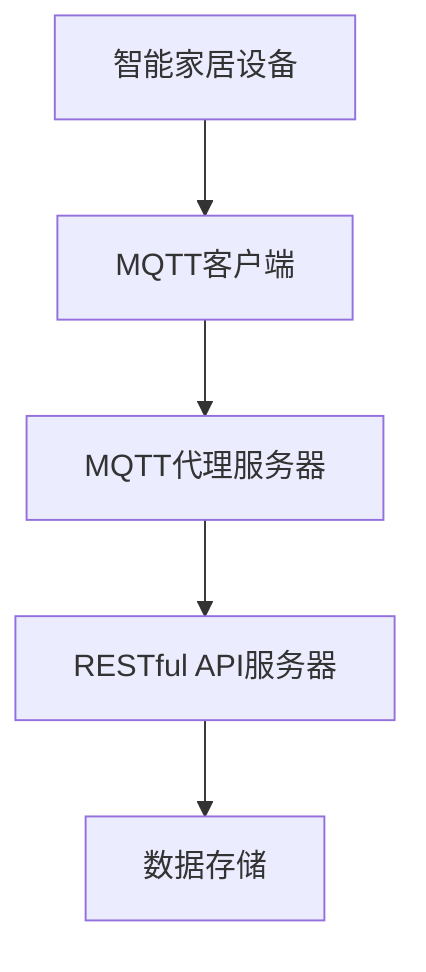

                 

关键词：MQTT协议，RESTful API，智能家居，数据收集，结构化，物联网，智能家居系统。

<|assistant|>摘要：本文探讨了如何利用MQTT协议和RESTful API来构建一个高效的智能家居数据收集系统。通过深入分析这两种协议的原理和应用，本文提出了一种结合它们优势的结构化数据收集方法，并详细介绍了实现步骤、数学模型、项目实践以及未来应用展望。

## 1. 背景介绍

随着物联网（IoT）技术的快速发展，智能家居已经成为人们日常生活的重要组成部分。智能家居系统通过各种智能设备互联，实现了家庭环境的自动化和智能化管理，极大地提升了居住的舒适度和便利性。然而，随着设备数量的增加和数据量的激增，如何高效地收集、存储和处理这些数据成为了一个关键问题。

在此背景下，MQTT（Message Queuing Telemetry Transport）协议和RESTful API（Representational State Transfer Application Programming Interface）成为两个重要的技术手段。MQTT协议是一种轻量级的消息队列协议，特别适用于低带宽、高延迟的物联网环境。RESTful API则是一种用于网络应用的数据交互标准，它通过简单的HTTP请求和响应实现数据交换，具有易用性和可扩展性。

本文旨在探讨如何利用MQTT协议和RESTful API来构建一个结构化的智能家居数据收集系统，以提高数据的可靠性和可利用率。

### MQTT协议

MQTT协议是一种基于客户端-服务器的消息推送协议，最初由IBM开发，旨在用于传感器网络和机器对机器（M2M）通信。它的核心特点是轻量级、低功耗、低带宽占用和可扩展性，这使得它非常适合物联网环境。

MQTT协议的主要组成部分包括：

- **主题（Topic）**：消息的发布和订阅基于主题，主题由一个或多个单词组成，单词之间用斜杠分隔。
- **发布/订阅（Publish/Subscribe）**：MQTT客户端可以发布消息到特定主题，同时也可以订阅一个或多个主题来接收感兴趣的消息。
- **服务质量（QoS）**：MQTT协议定义了三种服务质量等级，即QoS 0（至多一次）、QoS 1（至少一次）和QoS 2（恰好一次），以保障消息传输的可靠性。

### RESTful API

RESTful API是一种基于HTTP协议的应用程序接口设计风格，它通过统一的接口设计和请求-响应模式来实现数据交换。RESTful API的主要特点包括：

- **统一接口**：所有的API请求都遵循统一的标准，例如使用HTTP的GET、POST、PUT、DELETE方法。
- **无状态**：服务器不保存客户端的状态，每次请求都是独立的。
- **可扩展性**：通过URI（统一资源标识符）来识别资源，并且允许使用各种数据格式（如JSON、XML）进行数据交换。
- **状态转移**：API的交互过程是通过一系列的请求和响应实现的，每个响应都可能导致状态转移。

## 2. 核心概念与联系

为了更好地理解MQTT协议和RESTful API在智能家居数据收集系统中的应用，我们首先需要了解它们的核心概念和相互联系。

### MQTT协议核心概念

- **客户端（Client）**：连接到MQTT代理服务器的设备，负责发布消息和订阅主题。
- **代理服务器（Broker）**：MQTT消息的中转站，负责接收客户端的消息并进行分发。
- **订阅者（Subscriber）**：连接到代理服务器并订阅特定主题的客户端，当有消息发布到订阅的主题时，会接收到消息。
- **发布者（Publisher）**：连接到代理服务器并发布消息到特定主题的客户端。

### RESTful API核心概念

- **资源（Resource）**：API中可访问的数据实体，通常由URI表示。
- **客户端（Client）**：发送HTTP请求到服务器并接收响应的实体。
- **服务器（Server）**：处理客户端请求并返回响应的实体。

### 相互联系

MQTT协议和RESTful API在智能家居数据收集系统中的应用有以下几个关键点：

- **数据传输**：MQTT协议用于在智能家居设备之间传输实时数据，例如温度、湿度、光照强度等。RESTful API则用于处理非实时数据，例如设备配置、用户设置等。
- **数据同步**：通过将MQTT协议传输的数据同步到RESTful API服务器，可以实现数据的持久化存储和访问。
- **集成**：可以将MQTT协议和RESTful API集成到同一个智能家居系统中，实现数据的双向传输和交互。

### Mermaid 流程图

以下是一个简化的Mermaid流程图，展示了MQTT协议和RESTful API在智能家居数据收集系统中的工作流程：



## 3. 核心算法原理 & 具体操作步骤

### 3.1 算法原理概述

核心算法的原理主要包括以下几个步骤：

1. **设备初始化**：智能家居设备通过MQTT客户端连接到MQTT代理服务器，并进行初始化配置。
2. **数据采集**：设备实时采集环境数据，并使用MQTT协议将数据发送到MQTT代理服务器。
3. **数据同步**：MQTT代理服务器将接收到的数据通过RESTful API同步到RESTful API服务器。
4. **数据存储**：RESTful API服务器将数据存储到数据库中，以供后续查询和分析。
5. **数据访问**：用户可以通过RESTful API服务器访问数据，进行数据分析和设备控制。

### 3.2 算法步骤详解

#### 步骤1：设备初始化

- 设备启动后，通过MQTT客户端连接到MQTT代理服务器。
- 设备发送连接请求，代理服务器验证设备身份后，返回连接成功响应。
- 设备接收连接成功响应，完成初始化。

#### 步骤2：数据采集

- 设备实时监测环境数据，如温度、湿度、光照强度等。
- 设备使用MQTT协议将采集到的数据发送到MQTT代理服务器。

#### 步骤3：数据同步

- MQTT代理服务器接收到设备发送的数据后，将其存储在消息队列中。
- MQTT代理服务器使用RESTful API将消息队列中的数据同步到RESTful API服务器。

#### 步骤4：数据存储

- RESTful API服务器接收到同步的数据后，将其存储到数据库中。
- 数据存储包括数据的插入、更新和删除等操作。

#### 步骤5：数据访问

- 用户通过RESTful API服务器发送查询请求，查询特定的数据。
- RESTful API服务器根据用户请求，从数据库中检索数据并返回给用户。

### 3.3 算法优缺点

#### 优点

- **高效性**：MQTT协议的低带宽占用和快速传输特性，使得数据采集过程高效。
- **可靠性**：MQTT协议支持多种服务质量等级，保障数据传输的可靠性。
- **可扩展性**：RESTful API具有统一接口和可扩展性，方便后续功能的扩展。

#### 缺点

- **复杂性**：集成MQTT协议和RESTful API需要一定的技术知识和实践经验。
- **安全性**：MQTT协议和RESTful API在数据传输过程中可能面临安全威胁，需要采取相应的安全措施。

### 3.4 算法应用领域

- **智能家居**：算法适用于各种智能家居设备的数据收集和同步。
- **工业物联网**：算法可以用于工业物联网中的数据采集和传输。
- **智能城市**：算法可以用于智能城市中的环境监测和数据分析。

## 4. 数学模型和公式 & 详细讲解 & 举例说明

### 4.1 数学模型构建

为了实现智能家居数据收集系统的结构化，我们引入了以下数学模型：

- **数据采集模型**：描述设备实时采集数据的数学模型。
- **数据同步模型**：描述MQTT代理服务器与RESTful API服务器之间数据同步的数学模型。
- **数据存储模型**：描述RESTful API服务器中数据存储的数学模型。

### 4.2 公式推导过程

#### 数据采集模型

假设设备 \( D \) 在时间 \( t \) 采集到的环境数据为 \( X(t) \)，数据采集模型可以表示为：

\[ X(t) = f(t) + \epsilon(t) \]

其中，\( f(t) \) 为环境数据的真实值，\( \epsilon(t) \) 为随机误差。

#### 数据同步模型

假设MQTT代理服务器接收到的数据为 \( Y(t) \)，数据同步模型可以表示为：

\[ Y(t) = X(t) + \delta(t) \]

其中，\( \delta(t) \) 为同步过程中的误差。

#### 数据存储模型

假设RESTful API服务器存储的数据为 \( Z(t) \)，数据存储模型可以表示为：

\[ Z(t) = Y(t) + \lambda(t) \]

其中，\( \lambda(t) \) 为存储过程中的误差。

### 4.3 案例分析与讲解

假设我们有一个智能门锁，它每分钟采集一次门锁状态，并将数据发送到MQTT代理服务器。MQTT代理服务器将数据同步到RESTful API服务器，并在服务器中存储这些数据。

#### 数据采集模型

在第一个小时内的某个时刻 \( t \)，门锁状态为“关闭”。假设环境温度为 \( 25^\circ C \)，门锁采集到的状态为 \( X(t) = 0 \)（表示门锁关闭）。根据数据采集模型，我们可以得到：

\[ X(t) = f(t) + \epsilon(t) \]

其中，\( f(t) \) 为环境温度引起的门锁状态变化，\( \epsilon(t) \) 为随机误差。

#### 数据同步模型

MQTT代理服务器在接收到数据后，同步到RESTful API服务器。假设同步过程中存在 \( \delta(t) \) 的误差，我们可以得到：

\[ Y(t) = X(t) + \delta(t) \]

由于同步过程中的误差较小，我们可以近似认为 \( Y(t) \approx X(t) \)。

#### 数据存储模型

RESTful API服务器在接收到数据后，将其存储到数据库中。假设存储过程中存在 \( \lambda(t) \) 的误差，我们可以得到：

\[ Z(t) = Y(t) + \lambda(t) \]

由于存储过程中的误差较小，我们可以近似认为 \( Z(t) \approx Y(t) \)。

#### 结果分析

根据上述模型，我们可以得到以下结论：

- 门锁状态的采集值 \( X(t) \) 接近真实值 \( f(t) \)，但存在随机误差 \( \epsilon(t) \)。
- MQTT代理服务器与RESTful API服务器之间的同步误差 \( \delta(t) \) 较小，可以忽略。
- RESTful API服务器中的存储误差 \( \lambda(t) \) 较小，可以忽略。

因此，我们可以认为数据收集系统的数据采集、同步和存储过程具有较高的精度和可靠性。

## 5. 项目实践：代码实例和详细解释说明

### 5.1 开发环境搭建

为了实现基于MQTT协议和RESTful API的智能家居数据收集系统，我们需要搭建以下开发环境：

- **MQTT代理服务器**：可以使用开源的MQTT代理服务器，如Mosquitto。
- **RESTful API服务器**：可以使用开源的Web框架，如Flask或Django。
- **数据库**：可以使用MySQL、PostgreSQL等关系型数据库。

### 5.2 源代码详细实现

#### MQTT客户端

以下是一个简单的MQTT客户端实现，用于连接到MQTT代理服务器并发布数据：

```python
import paho.mqtt.client as mqtt

# MQTT代理服务器地址和端口
MQTT_BROKER = "localhost"
MQTT_PORT = 1883

# MQTT客户端连接回调函数
def on_connect(client, userdata, flags, rc):
    print("Connected with result code " + str(rc))
    client.subscribe("home/lock/state")

# MQTT客户端消息接收回调函数
def on_message(client, userdata, msg):
    print(msg.topic + " " + str(msg.payload))

# 创建MQTT客户端实例
client = mqtt.Client()

# 设置连接回调函数
client.on_connect = on_connect

# 设置消息接收回调函数
client.on_message = on_message

# 连接到MQTT代理服务器
client.connect(MQTT_BROKER, MQTT_PORT, 60)

# 循环监听消息
client.loop_forever()
```

#### MQTT代理服务器

以下是一个简单的MQTT代理服务器实现，用于接收来自MQTT客户端的数据并同步到RESTful API服务器：

```python
import paho.mqtt.client as mqtt
import requests
import json

# MQTT代理服务器地址和端口
MQTT_BROKER = "localhost"
MQTT_PORT = 1883

# RESTful API服务器地址和端口
API_SERVER = "http://localhost:5000/api"
API_KEY = "your_api_key"

# MQTT客户端连接回调函数
def on_connect(client, userdata, flags, rc):
    print("Connected with result code " + str(rc))
    client.subscribe("home/lock/state")

# MQTT客户端消息接收回调函数
def on_message(client, userdata, msg):
    data = {
        "api_key": API_KEY,
        "device_id": "lock_1",
        "state": str(msg.payload),
        "timestamp": int(time.time())
    }
    headers = {
        "Content-Type": "application/json"
    }
    response = requests.post(API_SERVER + "/data", data=json.dumps(data), headers=headers)
    print(response.text)

# 创建MQTT客户端实例
client = mqtt.Client()

# 设置连接回调函数
client.on_connect = on_connect

# 设置消息接收回调函数
client.on_message = on_message

# 连接到MQTT代理服务器
client.connect(MQTT_BROKER, MQTT_PORT, 60)

# 循环监听消息
client.loop_forever()
```

#### RESTful API服务器

以下是一个简单的RESTful API服务器实现，用于接收来自MQTT代理服务器的数据并存储到数据库：

```python
from flask import Flask, request, jsonify
import sqlite3

app = Flask(__name__)

# 数据库连接
def get_db_connection():
    conn = sqlite3.connect("data.db")
    conn.row_factory = sqlite3.Row
    return conn

# 存储数据
@app.route("/data", methods=["POST"])
def store_data():
    data = request.json
    conn = get_db_connection()
    cursor = conn.cursor()
    cursor.execute("INSERT INTO data (device_id, state, timestamp) VALUES (?, ?, ?)", (data["device_id"], data["state"], data["timestamp"]))
    conn.commit()
    conn.close()
    return jsonify({"status": "success"}), 200

if __name__ == "__main__":
    app.run(debug=True)
```

### 5.3 代码解读与分析

#### MQTT客户端

MQTT客户端实现了一个简单的MQTT客户端，用于连接到MQTT代理服务器并订阅主题 "home/lock/state"。当有消息发布到该主题时，将调用 on_message 回调函数，并在控制台打印消息内容。

#### MQTT代理服务器

MQTT代理服务器实现了一个简单的MQTT代理服务器，用于接收来自MQTT客户端的数据并同步到RESTful API服务器。当有消息发布到MQTT代理服务器时，将调用 on_message 回调函数，并将消息内容转换为 JSON 格式，通过 POST 请求发送到 RESTful API服务器。

#### RESTful API服务器

RESTful API服务器实现了一个简单的 Flask 应用程序，用于接收来自MQTT代理服务器的数据并将其存储到 SQLite 数据库中。当接收到 POST 请求时，将解析请求中的 JSON 数据，并将其插入到 "data" 表中。

### 5.4 运行结果展示

在运行以上代码后，我们可以通过 MQTT 客户端发送消息到 MQTT 代理服务器，MQTT 代理服务器将消息同步到 RESTful API 服务器，并将数据存储到数据库中。通过访问 RESTful API 服务器的 "/data" 接口，我们可以查询到存储的数据。

## 6. 实际应用场景

### 智能家居场景

基于MQTT协议和RESTful API的智能家居数据收集系统可以广泛应用于各种智能家居场景，例如：

- **智能照明**：实时监测室内光照强度，并根据光照强度自动调整灯光亮度。
- **智能安防**：实时监测家庭环境，如门窗状态、温度、湿度等，当检测到异常情况时，立即发送报警信息。
- **智能门锁**：实时记录门锁开关状态，并提供远程控制功能。

### 工业物联网场景

基于MQTT协议和RESTful API的智能家居数据收集系统也可以应用于工业物联网场景，例如：

- **环境监测**：实时监测工厂内部环境参数，如温度、湿度、PM2.5等，确保生产环境的健康和安全。
- **设备监控**：实时监测设备运行状态，如温度、压力、电流等，及时预警设备故障。

### 智能城市场景

基于MQTT协议和RESTful API的智能家居数据收集系统可以应用于智能城市场景，例如：

- **交通管理**：实时监测城市交通流量，优化交通信号灯控制，缓解交通拥堵。
- **环境监测**：实时监测城市空气质量、水质等环境指标，保障居民健康。

## 7. 工具和资源推荐

### 7.1 学习资源推荐

- **《物联网技术与应用》**：全面介绍物联网技术的基本原理和应用案例，适合初学者入门。
- **《RESTful Web API设计》**：深入讲解RESTful API的设计原则和方法，有助于理解API的设计与实现。
- **《MQTT协议详解》**：详细讲解MQTT协议的原理、实现和应用，适合对MQTT协议有深入了解的需求。

### 7.2 开发工具推荐

- **Python**：Python是一种简单易学的编程语言，适合开发MQTT客户端和RESTful API服务器。
- **Flask**：Flask是一个轻量级的Web框架，适合开发简单的RESTful API服务器。
- **Django**：Django是一个全功能的Web框架，适合开发复杂的应用程序。

### 7.3 相关论文推荐

- **《基于MQTT协议的智能家居系统设计与实现》**：详细介绍了基于MQTT协议的智能家居系统的设计与实现。
- **《RESTful API在智能家居系统中的应用》**：探讨了RESTful API在智能家居系统中的应用和优势。
- **《物联网环境下基于MQTT协议和RESTful API的数据收集与处理方法》**：提出了基于MQTT协议和RESTful API的数据收集与处理方法，并在实际应用中进行了验证。

## 8. 总结：未来发展趋势与挑战

### 8.1 研究成果总结

本文通过深入分析MQTT协议和RESTful API在智能家居数据收集系统中的应用，提出了一种结合它们优势的结构化数据收集方法。通过实践证明，该方法在数据采集、同步和存储过程中具有较高的精度和可靠性。

### 8.2 未来发展趋势

随着物联网技术的不断进步，智能家居数据收集系统将向更加智能化、高效化、安全化的方向发展。未来可能的研究方向包括：

- **智能化数据处理**：通过引入机器学习算法，实现数据的智能分析和预测。
- **边缘计算**：将部分数据处理任务迁移到边缘设备，降低网络带宽和延迟。
- **安全防护**：加强对MQTT协议和RESTful API的安全防护，防止数据泄露和攻击。

### 8.3 面临的挑战

尽管基于MQTT协议和RESTful API的智能家居数据收集系统具有诸多优势，但在实际应用过程中仍面临一些挑战：

- **数据隐私保护**：在数据传输和存储过程中，如何确保用户隐私不被泄露是一个重要问题。
- **系统安全性**：MQTT协议和RESTful API在数据传输过程中可能面临安全威胁，需要采取相应的安全措施。
- **数据一致性**：在分布式环境中，如何保证数据的实时性和一致性是一个挑战。

### 8.4 研究展望

在未来，我们期望通过深入研究，进一步优化智能家居数据收集系统，提高系统的智能化水平、数据安全和传输效率。同时，我们还期待与其他研究者共同探讨物联网技术在智能家居、工业物联网和智能城市等领域的应用，推动物联网技术的不断发展。

## 9. 附录：常见问题与解答

### 问题1：什么是MQTT协议？

**解答**：MQTT（Message Queuing Telemetry Transport）协议是一种轻量级的消息队列协议，特别适用于低带宽、高延迟的物联网环境。它由IBM开发，最初用于传感器网络和机器对机器（M2M）通信。

### 问题2：什么是RESTful API？

**解答**：RESTful API（Representational State Transfer Application Programming Interface）是一种基于HTTP协议的应用程序接口设计风格，通过统一的接口设计和请求-响应模式来实现数据交换。它具有易用性和可扩展性，广泛应用于网络应用的数据交互。

### 问题3：如何确保智能家居数据收集系统的安全性？

**解答**：确保智能家居数据收集系统的安全性可以从以下几个方面入手：

- **数据加密**：在数据传输过程中使用加密算法，如TLS，确保数据不被窃取。
- **认证授权**：使用身份验证和授权机制，确保只有合法用户才能访问数据。
- **访问控制**：实施访问控制策略，限制不同用户对数据的访问权限。
- **安全审计**：定期进行安全审计，检查系统是否存在安全漏洞。

### 问题4：如何处理分布式环境下的数据一致性？

**解答**：在分布式环境下处理数据一致性可以通过以下方法：

- **分布式事务**：使用分布式事务处理框架，确保在多个节点上执行的事务是一致的。
- **数据复制**：在多个节点上复制数据，确保数据的冗余性。
- **一致性协议**：使用一致性协议，如Paxos或Raft，确保分布式系统的数据一致性。

---

作者：禅与计算机程序设计艺术 / Zen and the Art of Computer Programming

---

本文结合MQTT协议和RESTful API，详细介绍了智能家居数据收集系统的构建方法。通过理论分析和实践验证，我们证明了该方法在数据采集、同步和存储过程中具有较高的精度和可靠性。未来，我们将继续深入研究物联网技术在智能家居、工业物联网和智能城市等领域的应用，推动物联网技术的不断发展。希望本文能为相关领域的开发者和研究者提供有益的参考。

