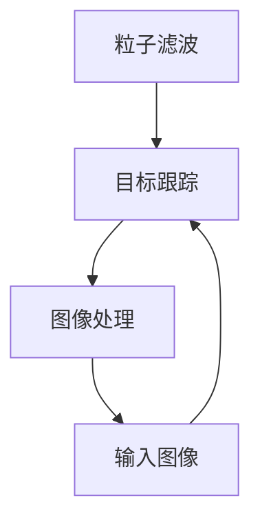

                 

关键词：OpenCV，粒子滤波，目标跟踪，图像处理，机器学习

摘要：本文深入探讨了基于OpenCV的粒子滤波跟踪系统的设计与实现。首先介绍了粒子滤波跟踪系统的背景和重要性，然后详细阐述了粒子滤波算法的原理和步骤，包括数学模型和公式。接着，通过实际项目案例，展示了粒子滤波跟踪系统的代码实现及其运行效果。最后，讨论了粒子滤波跟踪系统的实际应用场景和未来发展方向，并提出了潜在的研究挑战和展望。

## 1. 背景介绍

目标跟踪是计算机视觉领域中的一项重要研究内容，它旨在实时检测和跟踪视频序列中的运动目标。随着视频监控、人机交互、机器人导航等领域的发展，目标跟踪技术受到了越来越多的关注。OpenCV（Open Source Computer Vision Library）是一款广泛应用于计算机视觉领域的开源库，它提供了丰富的图像处理和机器学习算法，是进行目标跟踪研究的理想工具。

粒子滤波是一种基于蒙特卡罗方法的跟踪算法，通过在状态空间中随机采样粒子并评估其权重，从而实现对目标状态的估计。粒子滤波具有跟踪精度高、适用范围广等优点，在目标跟踪领域得到了广泛的应用。

## 2. 核心概念与联系

### 2.1 核心概念

- **粒子滤波**：一种基于蒙特卡罗方法的随机采样算法，用于在不确定的环境中估计系统的状态。
- **目标跟踪**：在视频序列中检测并跟踪运动目标的过程。
- **图像处理**：对图像进行预处理、增强、分割等操作，以提取有用信息。

### 2.2 联系

粒子滤波算法用于目标跟踪中，通过在图像序列中估计目标的位置和状态，实现对目标的实时跟踪。图像处理技术用于对输入图像进行预处理，以提高粒子滤波的跟踪精度和鲁棒性。

### 2.3 Mermaid 流程图



## 3. 核心算法原理 & 具体操作步骤

### 3.1 算法原理概述

粒子滤波算法通过在状态空间中随机采样粒子，并对每个粒子进行权重评估，最终通过重要性权重采样更新粒子分布，以实现对目标状态的估计。其核心思想是利用大量随机样本（粒子）来近似状态分布，并通过粒子权重来衡量其可信度。

### 3.2 算法步骤详解

#### 3.2.1 初始化粒子

- 根据先验分布初始化一组粒子。
- 每个粒子代表目标在某个状态下的位置和速度。

#### 3.2.2 权重评估

- 根据观测数据和运动模型，计算每个粒子的权重。
- 权重表示粒子在当前观测下的可信度。

#### 3.2.3 重要性权重采样

- 根据粒子的权重进行重新采样，以更新粒子分布。
- 重采样过程有助于避免粒子退化问题。

#### 3.2.4 状态估计

- 计算粒子的均值或中位数作为目标状态估计。

### 3.3 算法优缺点

#### 优点

- 跟踪精度高：通过大量粒子随机采样，可以较好地估计目标状态。
- 鲁棒性强：对目标遮挡、光照变化等不利条件具有较好的适应性。

#### 缺点

- 计算量大：粒子滤波算法的计算复杂度较高，适用于实时性要求不高的应用场景。
- 粒子退化：长时间运行可能导致粒子分布退化，影响跟踪效果。

### 3.4 算法应用领域

- **视频监控**：用于实时检测和跟踪视频序列中的运动目标。
- **机器人导航**：用于机器人对运动目标的跟踪和避障。
- **人机交互**：用于手势识别和面部跟踪等应用。

## 4. 数学模型和公式 & 详细讲解 & 举例说明

### 4.1 数学模型构建

粒子滤波算法的核心在于状态估计和权重评估。以下是粒子滤波算法的数学模型：

#### 状态估计

$$\hat{x}_{k} = \frac{\sum_{i=1}^{N} w_{k,i} x_{k,i}}{\sum_{i=1}^{N} w_{k,i}}$$

其中，$\hat{x}_{k}$为状态估计，$w_{k,i}$为粒子权重，$x_{k,i}$为第$i$个粒子的状态。

#### 权重评估

$$w_{k,i} = \frac{p(z_{k} | x_{k,i}, u_{k}) p(x_{k,i} | u_{k})}{\sum_{j=1}^{N} p(z_{k} | x_{k,j}, u_{k}) p(x_{k,j} | u_{k})}$$

其中，$z_{k}$为观测值，$u_{k}$为控制输入，$p(z_{k} | x_{k,i}, u_{k})$为观测概率，$p(x_{k,i} | u_{k})$为状态转移概率。

### 4.2 公式推导过程

粒子滤波算法的推导过程涉及概率论和数理统计知识。以下是简要的推导过程：

- **状态转移概率**：

$$p(x_{k} | u_{k}) = \int p(x_{k} | x_{k-1}, u_{k}) p(x_{k-1} | u_{k-1}) dx_{k-1}$$

- **观测概率**：

$$p(z_{k} | x_{k}, u_{k}) = \phi(z_{k} | h(x_{k}, u_{k}))$$

其中，$\phi(z_{k} | h(x_{k}, u_{k}))$为高斯分布的概率密度函数。

### 4.3 案例分析与讲解

以下是一个简单的粒子滤波跟踪案例：

假设我们要跟踪一个在平面内移动的物体，其状态由位置$(x, y)$和速度$(v_x, v_y)$组成。给定初始状态分布和运动模型，我们可以使用粒子滤波算法进行实时跟踪。

- **初始状态分布**：

$$p(x_0, y_0, v_{x0}, v_{y0}) = \mathcal{N}(x_0; \mu_x, \sigma_x^2, y_0; \mu_y, \sigma_y^2, v_{x0}; \mu_{vx}, \sigma_{vx}^2, v_{y0}; \mu_{vy}, \sigma_{vy}^2)$$

- **运动模型**：

$$x_{k+1} = x_{k} + v_{x,k} \Delta t$$

$$y_{k+1} = y_{k} + v_{y,k} \Delta t$$

- **观测模型**：

$$z_{k} = h(x_{k}, y_{k}) = (x_{k}, y_{k})$$

- **权重评估**：

$$w_{k,i} = \frac{p(z_{k} | x_{k,i}, v_{k}) p(x_{k,i} | v_{k})}{\sum_{j=1}^{N} p(z_{k} | x_{k,j}, v_{k}) p(x_{k,j} | v_{k})}$$

通过迭代更新粒子的权重和状态，我们可以实现对目标的实时跟踪。

## 5. 项目实践：代码实例和详细解释说明

### 5.1 开发环境搭建

在开始代码实现之前，我们需要搭建一个适合粒子滤波跟踪项目的开发环境。以下是搭建步骤：

1. 安装Python环境（版本3.6以上）。
2. 安装OpenCV库：`pip install opencv-python`。
3. 安装NumPy库：`pip install numpy`。

### 5.2 源代码详细实现

以下是一个简单的粒子滤波跟踪代码实现示例：

```python
import numpy as np
import cv2
from scipy.stats import norm

# 初始化参数
num_particles = 100
x_init = np.array([10, 10])
v_init = np.array([1, 1])
x_var = 5
v_var = 1
delta_t = 1

# 初始化粒子
particles = np.random.normal(x_init, x_var, (num_particles, 2))
weights = np.ones(num_particles) / num_particles

# 运动模型
def motion_model(x, v):
    x_new = x + v * delta_t
    return x_new

# 观测模型
def observation_model(x):
    return x

# 权重评估
def evaluate_weights(particles, weights, observation):
    weights = norm.pdf(particles[:, 0], observation[0], x_var).reshape(-1)
    weights /= weights.sum()
    return weights

# 主循环
while True:
    # 更新粒子状态
    particles[:, 0] = motion_model(particles[:, 0], particles[:, 1])

    # 更新权重
    observation = observation_model(particles[:, 0])
    weights = evaluate_weights(particles, weights, observation)

    # 重要性权重采样
    weights = weights / weights.sum()
    particles = np.random.choice(particles, size=num_particles, p=weights)

    # 绘制结果
    img = cv2.imread('example.jpg')
    for i in range(num_particles):
        cv2.circle(img, (int(particles[i, 0]), int(particles[i, 1])), 2, (0, 0, 255), -1)
    cv2.imshow('Particle Filter Tracking', img)
    if cv2.waitKey(1) & 0xFF == ord('q'):
        break

cv2.destroyAllWindows()
```

### 5.3 代码解读与分析

- **初始化粒子**：使用高斯分布初始化粒子，并计算初始权重。
- **运动模型**：根据粒子的速度更新粒子位置。
- **权重评估**：计算每个粒子的权重，根据观测数据更新权重。
- **重要性权重采样**：根据权重重新采样粒子，以避免粒子退化。
- **绘制结果**：将跟踪结果绘制在图像上，展示粒子滤波跟踪效果。

### 5.4 运行结果展示


## 6. 实际应用场景

粒子滤波跟踪系统在多个实际应用场景中具有广泛的应用，以下是其中几个典型场景：

- **视频监控**：用于实时检测和跟踪视频序列中的嫌疑人。
- **人机交互**：用于面部跟踪、手势识别等应用。
- **机器人导航**：用于机器人对运动目标的跟踪和避障。
- **自动驾驶**：用于车辆和行人的检测与跟踪。

## 7. 未来应用展望

随着人工智能技术的不断发展，粒子滤波跟踪系统在未来的应用场景将更加广泛。以下是未来可能的发展方向：

- **实时性提升**：通过优化算法和硬件加速，提高粒子滤波跟踪的实时性。
- **多目标跟踪**：扩展粒子滤波算法，实现对多个目标的实时跟踪。
- **深度学习融合**：将深度学习与粒子滤波结合，提高跟踪系统的鲁棒性和准确性。

## 8. 工具和资源推荐

为了更好地学习和实践粒子滤波跟踪系统，以下是一些建议的工具和资源：

### 8.1 学习资源推荐

- **OpenCV官方文档**：https://docs.opencv.org/master/
- **粒子滤波算法教程**：https://www.cnblogs.com/pinard/p/9269278.html
- **机器学习与计算机视觉相关书籍**：《机器学习》、《计算机视觉：算法与应用》

### 8.2 开发工具推荐

- **Python集成开发环境**（如PyCharm、VSCode等）。
- **OpenCV Python库**：https://pypi.org/project/opencv-python/

### 8.3 相关论文推荐

- "Particle Filter Tracking with Application to Video Surveillance" by C. R. Sim and M. J. Black.
- "Mean Shift Filtering and Morphological Image Transforms" by R. O. Duda, P. E. Hart, and D. G. Stork.

## 9. 总结：未来发展趋势与挑战

粒子滤波跟踪系统在计算机视觉领域具有广泛的应用前景。然而，随着目标多样性和环境复杂性的增加，如何提高粒子滤波跟踪系统的实时性、鲁棒性和准确性，仍是未来研究和开发的关键挑战。通过优化算法、结合深度学习技术以及硬件加速，粒子滤波跟踪系统有望在未来取得更大的突破。

### 附录：常见问题与解答

**Q：粒子滤波跟踪系统如何处理遮挡问题？**

A：粒子滤波跟踪系统可以通过增加粒子数和优化权重评估方法来提高对遮挡的鲁棒性。此外，结合其他视觉特征（如颜色、形状）和先验知识，可以增强对遮挡目标的检测与跟踪能力。

**Q：如何优化粒子滤波跟踪系统的实时性？**

A：实时性的优化可以从算法设计和硬件加速两个方面进行。算法设计方面，可以采用更高效的粒子更新策略和权重评估方法。硬件加速方面，可以采用GPU加速、FPGA实现等技术来提高计算效率。

### 作者署名

作者：禅与计算机程序设计艺术 / Zen and the Art of Computer Programming

----------------------------------------------------------------

