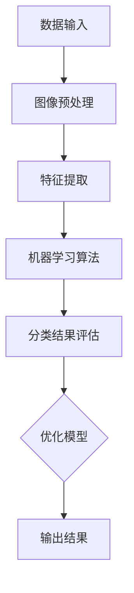

                 

关键词：OpenCV、图像分类、机器学习、深度学习、鲜花识别、计算机视觉

摘要：随着计算机视觉和机器学习技术的不断进步，图像分类系统在众多领域得到了广泛应用。本文将介绍一种基于OpenCV的鲜花图像分类系统，详细阐述其设计与实现过程，包括数据预处理、特征提取、模型训练、评估与优化等环节。通过本文的讲解，读者可以了解到如何利用OpenCV这一强大的图像处理库，结合机器学习算法，实现高效的图像分类系统。

## 1. 背景介绍

在过去的几十年里，计算机视觉技术取得了飞速的发展，图像分类作为计算机视觉的一个核心任务，已经成为了人工智能领域的重要研究方向。鲜花图像分类作为图像分类中的一个具体应用，不仅具有学术价值，也在实际应用中具有重要意义。例如，在农业领域，通过对鲜花图像进行分类，可以帮助农民更好地管理作物，提高生产效率；在花卉市场，鲜花分类可以帮助商家快速识别和处理不同品种的鲜花，提高交易效率。

OpenCV（Open Source Computer Vision Library）是一个强大的开源计算机视觉库，它提供了丰富的图像处理和计算机视觉功能。OpenCV支持多种编程语言，包括C++、Python等，适用于多种操作系统，如Windows、Linux、Mac OS等。这使得OpenCV成为开发计算机视觉应用的首选工具之一。

本文将结合OpenCV和机器学习技术，介绍如何设计并实现一个鲜花图像分类系统。该系统旨在通过图像特征提取和分类算法，自动识别并分类输入的鲜花图像，从而为实际应用提供技术支持。

## 2. 核心概念与联系

### 2.1 核心概念

#### 图像分类

图像分类是计算机视觉中的一个基本任务，其目标是将给定的图像分配到预定义的类别中。在鲜花图像分类中，类别可以是不同种类的鲜花，例如玫瑰、郁金香、向日葵等。

#### OpenCV

OpenCV是一个开源的计算机视觉库，提供了一系列的图像处理和计算机视觉功能，如图像滤波、形态学操作、特征提取、目标识别等。

#### 机器学习

机器学习是一种通过训练算法从数据中学习规律，并用于预测或决策的技术。在图像分类中，机器学习算法可以帮助计算机从标记好的训练数据中学习特征，从而对新图像进行分类。

### 2.2 核心概念的联系

鲜花图像分类系统涉及多个核心概念的交互。具体来说，首先需要使用OpenCV对输入的鲜花图像进行预处理，提取出有效的图像特征。然后，利用机器学习算法，根据训练数据对这些特征进行分类。最后，通过对测试数据的分类结果进行评估，优化模型性能。

### 2.3 Mermaid 流程图



## 3. 核心算法原理 & 具体操作步骤

### 3.1 算法原理概述

鲜花图像分类系统主要分为三个步骤：图像预处理、特征提取和机器学习分类。

#### 图像预处理

图像预处理是图像分类系统的第一步，其目的是提高图像质量，去除噪声，增强特征，从而为后续的特征提取和分类提供更好的数据。

常用的预处理方法包括：
- **图像滤波**：如高斯滤波、中值滤波等，用于去除噪声。
- **形态学操作**：如膨胀、腐蚀、开运算、闭运算等，用于去除图像中的杂质。
- **直方图均衡化**：用于增强图像的对比度。

#### 特征提取

特征提取是将图像数据转换为适合机器学习算法的形式。在鲜花图像分类中，常用的特征提取方法包括：
- **颜色特征**：如颜色直方图、颜色矩等。
- **纹理特征**：如边缘强度、角点、区域纹理等。
- **形状特征**：如形状描述子、轮廓等。

#### 机器学习分类

机器学习分类是基于训练数据，学习图像特征和类别之间的关联，并在测试数据上进行预测。常用的机器学习算法包括：
- **K最近邻（K-Nearest Neighbor, KNN）**
- **支持向量机（Support Vector Machine, SVM）**
- **决策树（Decision Tree）**
- **随机森林（Random Forest）**
- **深度神经网络（Deep Neural Network, DNN）**

### 3.2 算法步骤详解

#### 步骤1：图像预处理

```python
import cv2

# 读取图像
image = cv2.imread('flower.jpg')

# 高斯滤波去噪
blurred = cv2.GaussianBlur(image, (5, 5), 0)

# 形态学操作
kernel = cv2.getStructuringElement(cv2.MORPH_ELLIPSE, (5, 5))
dilated = cv2.dilate(blurred, kernel, iterations=1)

# 直方图均衡化
equalized = cv2.equalizeHist(dilated)
```

#### 步骤2：特征提取

```python
import cv2
import numpy as np

# 提取颜色特征
color_hist = cv2.calcHist([equalized], [0, 1, 2], None, [8, 8, 8], [0, 256, 0, 256, 0, 256])

# 提取纹理特征
sobelx = cv2.Sobel(equalized, cv2.CV_64F, 1, 0, ksize=5)
sobelx = cv2.absaval

