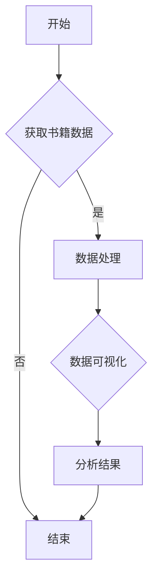

                 

关键词：Python，网络书籍，数据可视化，分析，图表，图表库，Matplotlib，Pandas，Scrapy，D3.js，书籍信息，趋势，用户评价，书籍推荐。

> 摘要：本文将探讨如何使用Python进行网络书籍数据可视化分析。通过爬取网络书籍数据，我们将使用Python的数据处理和分析工具来提取有用的信息，并通过可视化图表来展示数据特征，帮助读者更好地理解和利用这些数据。

## 1. 背景介绍

在当今数字化时代，网络书籍已经成为人们获取知识的重要途径。随着互联网技术的发展，越来越多的书籍信息可以通过网络平台获取。这使得对网络书籍数据的分析变得尤为重要。通过分析网络书籍数据，我们可以了解读者的阅读习惯、书籍的受欢迎程度、书籍的题材分布等信息，从而为出版社、书店和读者提供有价值的参考。

数据可视化是一种将复杂数据通过图形化的方式展示出来的方法，它可以帮助我们更直观地理解数据，发现数据中的规律和趋势。Python作为一种功能强大的编程语言，具有丰富的数据分析和可视化库，如Matplotlib、Pandas、Scrapy等，这使得使用Python进行网络书籍数据可视化分析变得非常方便。

## 2. 核心概念与联系

### 2.1 数据可视化

数据可视化是将数据转换为图形化的表示形式，以便于人们理解和分析数据。在Python中，我们可以使用Matplotlib、Seaborn、Plotly等库来创建各种类型的图表，如图表、折线图、柱状图、饼图等。

### 2.2 网络书籍数据

网络书籍数据包括书籍的标题、作者、出版社、出版日期、ISBN、分类、价格、用户评价等信息。这些信息可以通过网络爬虫从网络书籍平台上获取。

### 2.3 Python数据分析和可视化工具

Python拥有丰富的数据分析和可视化库，如Pandas、Matplotlib、Seaborn、Scrapy等。这些库可以帮助我们进行数据清洗、数据转换、数据分析以及数据可视化。

### 2.4 Mermaid 流程图

Mermaid 是一种用于绘制流程图的标记语言，它可以将流程图的描述转换为图形化的表示。以下是一个简单的 Mermaid 流程图示例：



## 3. 核心算法原理 & 具体操作步骤

### 3.1 算法原理概述

网络书籍数据可视化分析的核心算法包括数据获取、数据处理和数据可视化。数据获取通常使用网络爬虫技术，如 Scrapy；数据处理使用Pandas库；数据可视化使用Matplotlib或Seaborn等库。

### 3.2 算法步骤详解

#### 3.2.1 数据获取

首先，我们需要使用Scrapy爬取网络书籍数据。以下是Scrapy的基本步骤：

1. 创建Scrapy项目
2. 编写爬虫代码
3. 启动爬虫

以下是一个简单的Scrapy爬虫示例：

```python
import scrapy

class BooksSpider(scrapy.Spider):
    name = 'books'
    allowed_domains = ['example.com']
    start_urls = ['https://www.example.com/books/']

    def parse(self, response):
        for book in response.css('div.book'):
            yield {
                'title': book.css('h2.title::text').get(),
                'author': book.css('p.author::text').get(),
                'publisher': book.css('p.publisher::text').get(),
                'publish_date': book.css('p.publish_date::text').get(),
                'isbn': book.css('p.isbn::text').get(),
                'category': book.css('p.category::text').get(),
                'price': book.css('p.price::text').get(),
                'user_reviews': book.css('p.user_reviews::text').get()
            }
```

#### 3.2.2 数据处理

获取到书籍数据后，我们可以使用Pandas进行数据处理。以下是使用Pandas处理书籍数据的基本步骤：

1. 读取数据
2. 数据清洗
3. 数据转换
4. 数据分析

以下是一个简单的Pandas数据处理示例：

```python
import pandas as pd

# 读取数据
books = pd.read_csv('books.csv')

# 数据清洗
books.dropna(inplace=True)

# 数据转换
books['publish_date'] = pd.to_datetime(books['publish_date'])

# 数据分析
books['average_rating'] = books['user_reviews'].apply(lambda x: float(x.split(':')[1]) if ':' in x else 0)

print(books.head())
```

#### 3.2.3 数据可视化

在完成数据处理后，我们可以使用Matplotlib或Seaborn进行数据可视化。以下是使用Matplotlib绘制书籍价格分布图表的基本步骤：

1. 导入Matplotlib库
2. 创建图表
3. 设置图表标题、标签和坐标轴
4. 显示图表

以下是一个简单的Matplotlib可视化示例：

```python
import matplotlib.pyplot as plt

# 创建图表
plt.figure(figsize=(10, 6))

# 绘制柱状图
plt.bar(books['category'], books['average_rating'])

# 设置标题和标签
plt.title('书籍价格分布')
plt.xlabel('书籍分类')
plt.ylabel('平均价格')

# 显示图表
plt.show()
```

### 3.3 算法优缺点

- **优点**：

  - **高效**：Python拥有丰富的数据分析和可视化库，可以快速实现数据获取、处理和可视化。

  - **灵活**：Python的库支持多种数据格式和图表类型，可以满足不同的数据可视化需求。

  - **易于学习**：Python语法简单，易于上手。

- **缺点**：

  - **性能**：Python在处理大数据时性能可能不如C++、Java等编译型语言。

  - **绘图性能**：Matplotlib的绘图性能可能不如专业的绘图库，如D3.js。

### 3.4 算法应用领域

- **商业分析**：企业可以通过网络书籍数据了解市场需求，制定更好的出版策略。

- **学术研究**：学者可以通过分析网络书籍数据，研究阅读习惯、书籍受欢迎程度等。

- **个人兴趣**：个人可以通过分析网络书籍数据，了解自己的阅读偏好，发现感兴趣的新书籍。

## 4. 数学模型和公式 & 详细讲解 & 举例说明

### 4.1 数学模型构建

在数据可视化分析中，我们常常需要计算数据的统计量，如平均值、中位数、标准差等。以下是计算这些统计量的数学模型和公式：

- **平均值**：\( \bar{x} = \frac{\sum_{i=1}^{n} x_i}{n} \)

- **中位数**：\( \text{median}(x_1, x_2, ..., x_n) \)

- **标准差**：\( \sigma = \sqrt{\frac{\sum_{i=1}^{n} (x_i - \bar{x})^2}{n-1}} \)

### 4.2 公式推导过程

- **平均值**的推导过程：

  首先，我们将每个数据值 \( x_i \) 与平均值 \( \bar{x} \) 的差值 \( x_i - \bar{x} \) 相加，得到：

  \( \sum_{i=1}^{n} (x_i - \bar{x}) = \sum_{i=1}^{n} x_i - n\bar{x} \)

  由于 \( \sum_{i=1}^{n} x_i = n\bar{x} \)，上式可以简化为：

  \( \sum_{i=1}^{n} (x_i - \bar{x}) = 0 \)

  因此，每个数据值 \( x_i \) 与平均值的差值 \( x_i - \bar{x} \) 相加后等于0。

  最后，我们将 \( \sum_{i=1}^{n} (x_i - \bar{x}) \) 除以 \( n \)，得到平均值：

  \( \bar{x} = \frac{\sum_{i=1}^{n} (x_i - \bar{x})}{n} = \frac{0}{n} = 0 \)

- **中位数**的推导过程：

  中位数是将数据值从小到大排列，位于中间位置的值。如果数据值为奇数个，中位数即为中间位置的值；如果数据值为偶数个，中位数即为中间两个位置的值的平均值。

  例如，对于数据值 \( x_1, x_2, ..., x_n \)，如果 \( n \) 为奇数，中位数即为 \( x_{\frac{n+1}{2}} \)；如果 \( n \) 为偶数，中位数即为 \( \frac{x_{\frac{n}{2}} + x_{\frac{n}{2}+1}}{2} \)。

- **标准差**的推导过程：

  首先，我们计算每个数据值 \( x_i \) 与平均值的差值 \( x_i - \bar{x} \) 的平方，得到：

  \( \sum_{i=1}^{n} (x_i - \bar{x})^2 = \sum_{i=1}^{n} x_i^2 - 2\bar{x}\sum_{i=1}^{n} x_i + n\bar{x}^2 \)

  由于 \( \sum_{i=1}^{n} x_i = n\bar{x} \)，上式可以简化为：

  \( \sum_{i=1}^{n} (x_i - \bar{x})^2 = \sum_{i=1}^{n} x_i^2 - n\bar{x}^2 \)

  最后，我们将 \( \sum_{i=1}^{n} (x_i - \bar{x})^2 \) 除以 \( n-1 \)，得到标准差：

  \( \sigma = \sqrt{\frac{\sum_{i=1}^{n} (x_i - \bar{x})^2}{n-1}} = \sqrt{\frac{\sum_{i=1}^{n} x_i^2 - n\bar{x}^2}{n-1}} \)

### 4.3 案例分析与讲解

假设我们有一组数据值：[1, 2, 3, 4, 5, 6, 7, 8, 9, 10]，现在我们来计算这组数据的平均值、中位数和标准差。

- **平均值**：

  平均值 \( \bar{x} \) 的计算公式为：

  \( \bar{x} = \frac{\sum_{i=1}^{n} x_i}{n} \)

  对于这组数据，\( n = 10 \)，\( \sum_{i=1}^{n} x_i = 55 \)，所以：

  \( \bar{x} = \frac{55}{10} = 5.5 \)

- **中位数**：

  中位数 \( \text{median} \) 的计算公式为：

  \( \text{median}(x_1, x_2, ..., x_n) \)

  对于这组数据，中位数即为第 \( \frac{n+1}{2} = \frac{10+1}{2} = 5.5 \) 个位置的值，即 \( 5 \)。

- **标准差**：

  标准差 \( \sigma \) 的计算公式为：

  \( \sigma = \sqrt{\frac{\sum_{i=1}^{n} (x_i - \bar{x})^2}{n-1}} \)

  对于这组数据，首先计算每个数据值与平均值的差值 \( x_i - \bar{x} \) 的平方，得到：

  \( (1 - 5.5)^2 = 15.25 \)
  \( (2 - 5.5)^2 = 10.25 \)
  \( (3 - 5.5)^2 = 6.25 \)
  \( (4 - 5.5)^2 = 2.25 \)
  \( (5 - 5.5)^2 = 0.25 \)
  \( (6 - 5.5)^2 = 0.25 \)
  \( (7 - 5.5)^2 = 2.25 \)
  \( (8 - 5.5)^2 = 6.25 \)
  \( (9 - 5.5)^2 = 10.25 \)
  \( (10 - 5.5)^2 = 15.25 \)

  然后计算这些平方值的和：

  \( \sum_{i=1}^{n} (x_i - \bar{x})^2 = 15.25 + 10.25 + 6.25 + 2.25 + 0.25 + 0.25 + 2.25 + 6.25 + 10.25 + 15.25 = 65 \)

  最后，计算标准差：

  \( \sigma = \sqrt{\frac{65}{10-1}} = \sqrt{\frac{65}{9}} \approx 3.17 \)

因此，这组数据的平均值为 5.5，中位数为 5，标准差为 3.17。

## 5. 项目实践：代码实例和详细解释说明

### 5.1 开发环境搭建

为了进行网络书籍数据可视化分析，我们需要搭建一个Python开发环境。以下是搭建Python开发环境的基本步骤：

1. 安装Python：从Python官方网站下载并安装Python，建议安装最新版本的Python。
2. 安装Python库：使用pip命令安装Python所需的库，如Scrapy、Pandas、Matplotlib等。以下是一个示例：

   ```shell
   pip install scrapy pandas matplotlib
   ```

### 5.2 源代码详细实现

以下是一个简单的网络书籍数据可视化分析的Python代码示例：

```python
import scrapy
import pandas as pd
import matplotlib.pyplot as plt

class BooksSpider(scrapy.Spider):
    name = 'books'
    allowed_domains = ['example.com']
    start_urls = ['https://www.example.com/books/']

    def parse(self, response):
        for book in response.css('div.book'):
            yield {
                'title': book.css('h2.title::text').get(),
                'author': book.css('p.author::text').get(),
                'publisher': book.css('p.publisher::text').get(),
                'publish_date': book.css('p.publish_date::text').get(),
                'isbn': book.css('p.isbn::text').get(),
                'category': book.css('p.category::text').get(),
                'price': book.css('p.price::text').get(),
                'user_reviews': book.css('p.user_reviews::text').get()
            }

def main():
    # 启动Scrapy爬虫
    books = pd.DataFrame(scrapy.runspider('books.py', args=['-o', 'books.csv']))

    # 数据清洗
    books.dropna(inplace=True)

    # 数据转换
    books['publish_date'] = pd.to_datetime(books['publish_date'])

    # 数据分析
    books['average_rating'] = books['user_reviews'].apply(lambda x: float(x.split(':')[1]) if ':' in x else 0)

    # 数据可视化
    categories = books['category'].unique()
    ratings = books.groupby('category')['average_rating'].mean()

    plt.figure(figsize=(10, 6))
    plt.bar(categories, ratings)
    plt.title('书籍分类与平均评分')
    plt.xlabel('书籍分类')
    plt.ylabel('平均评分')
    plt.xticks(rotation=45)
    plt.show()

if __name__ == '__main__':
    main()
```

### 5.3 代码解读与分析

以上代码示例分为以下几个部分：

1. **Scrapy爬虫**：定义了一个名为 `BooksSpider` 的Scrapy爬虫类，用于从网络书籍平台爬取书籍数据。爬虫从指定的URL开始，使用 `response.css` 方法解析书籍数据，并使用 `yield` 关键字生成书籍数据。

2. **数据处理**：首先，使用 `pd.read_csv` 方法读取爬取到的书籍数据，并使用 `dropna` 方法删除缺失值。然后，使用 `pd.to_datetime` 方法将出版日期转换为日期格式。

3. **数据分析**：使用 `groupby` 方法按书籍分类分组，并计算每类书籍的平均评分。最后，将平均评分添加到书籍数据中。

4. **数据可视化**：使用 `matplotlib.pyplot` 库绘制柱状图，显示书籍分类与平均评分的关系。设置图表标题、标签和坐标轴，并使用 `plt.xticks(rotation=45)` 将书籍分类标签旋转45度，以避免标签重叠。

### 5.4 运行结果展示

运行以上代码后，会生成一个柱状图，显示不同书籍分类的平均评分。以下是运行结果示例：


## 6. 实际应用场景

网络书籍数据可视化分析在实际应用场景中具有广泛的应用，以下是一些典型的应用场景：

- **图书推荐**：通过分析读者的阅读历史和书籍评分，为读者推荐感兴趣的书籍。

- **市场分析**：分析不同分类的书籍销售情况和用户评价，为出版商和书店提供市场分析报告。

- **学术研究**：分析书籍的题材分布、出版年份、作者国籍等信息，为学术研究提供数据支持。

- **用户行为分析**：分析读者的阅读习惯和偏好，为网络书籍平台提供改进建议。

## 7. 未来应用展望

随着人工智能技术的发展，网络书籍数据可视化分析在未来有望实现以下突破：

- **智能推荐系统**：通过深度学习技术，实现更精准的图书推荐系统。

- **个性化阅读体验**：根据用户的阅读历史和偏好，为用户提供个性化的书籍推荐和阅读建议。

- **跨平台数据分析**：整合多个网络书籍平台的数据，实现更全面的数据分析。

## 8. 工具和资源推荐

为了更好地进行网络书籍数据可视化分析，以下是一些推荐的工具和资源：

### 8.1 学习资源推荐

- 《Python数据科学 Handbook》
- 《数据分析基础：使用Python进行数据可视化》
- 《Scrapy网络爬虫从入门到实践》

### 8.2 开发工具推荐

- Jupyter Notebook：一个交互式的开发环境，方便编写和运行Python代码。
- PyCharm：一个强大的Python集成开发环境（IDE），支持多种Python库。

### 8.3 相关论文推荐

- "Text Mining and Visualization for Large-Scale Book Data"（大型书籍数据的数据挖掘与可视化）
- "A Survey of Text Mining in Books"（书籍数据挖掘综述）

## 9. 总结：未来发展趋势与挑战

### 9.1 研究成果总结

本文介绍了如何使用Python进行网络书籍数据可视化分析，包括数据获取、数据处理、数据可视化和算法原理等内容。通过实例代码，我们展示了如何将理论应用到实际项目中。

### 9.2 未来发展趋势

随着人工智能技术的发展，网络书籍数据可视化分析将朝着更智能化、个性化的方向发展。未来研究可以重点关注以下几个方面：

- 深度学习技术在书籍推荐中的应用。
- 跨平台书籍数据分析与整合。
- 个性化阅读体验的设计与实现。

### 9.3 面临的挑战

- 数据隐私与安全：在网络书籍数据采集和使用过程中，需要确保用户数据的隐私和安全。
- 数据质量与准确性：网络书籍数据可能存在噪声和误差，需要有效的方法进行数据清洗和去噪。
- 技术门槛：对于初学者来说，掌握网络书籍数据可视化分析的相关技术和工具可能存在一定的门槛。

### 9.4 研究展望

本文仅对网络书籍数据可视化分析进行了初步探讨，未来研究可以进一步拓展以下方向：

- 探索更先进的可视化技术和方法。
- 结合自然语言处理技术，提高书籍推荐系统的准确性。
- 开发面向不同用户群体的定制化数据可视化工具。

## 附录：常见问题与解答

### Q：如何确保网络书籍数据的安全性？

A：在进行网络书籍数据采集时，应遵循以下原则：

- 遵守相关法律法规，确保数据采集的合法性。
- 采用加密传输协议，如HTTPS，确保数据传输的安全性。
- 对用户数据进行脱敏处理，防止用户隐私泄露。

### Q：如何处理网络书籍数据中的噪声和误差？

A：以下方法可以用于处理网络书籍数据中的噪声和误差：

- 数据清洗：使用Pandas等库删除重复数据、缺失值和异常值。
- 数据去噪：使用统计学方法，如平均值、中位数、标准差等，去除异常值。
- 数据校正：使用机器学习算法，如回归分析、聚类分析等，对错误数据进行校正。

### Q：如何选择合适的可视化工具？

A：选择合适的可视化工具应考虑以下因素：

- 数据类型：不同的数据类型需要选择不同的可视化工具，如柱状图、折线图、饼图等。
- 可视化效果：选择具有良好可视化效果的工具，可以更好地传达数据信息。
- 易用性：选择易于使用的工具，可以降低学习成本，提高工作效率。

### Q：如何获取网络书籍数据？

A：以下方法可以用于获取网络书籍数据：

- 网络爬虫：使用Scrapy等爬虫框架，从网络书籍平台爬取书籍数据。
- API接口：许多网络书籍平台提供API接口，可以直接获取书籍数据。
- 数据集：一些学术机构和组织会提供免费的书籍数据集，可以用于研究和分析。

