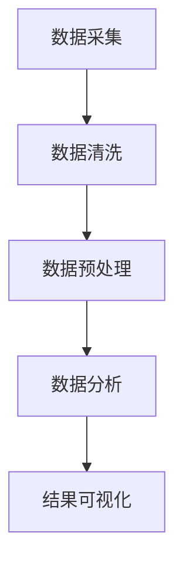

                 

关键词：Python、数据处理、分析、豆瓣、电影评论、文本挖掘、自然语言处理、机器学习、数据分析、数据可视化

> 摘要：本文以Python为工具，通过对豆瓣电影评论的数据处理与分析，探讨了自然语言处理在文本挖掘中的应用。文章详细介绍了数据处理流程、核心算法原理、数学模型构建、以及项目实践。同时，分析了实际应用场景和未来发展方向。

## 1. 背景介绍

在信息爆炸的时代，电影评论已经成为观众与电影之间交流的重要渠道。豆瓣电影作为中国最大的电影社区之一，其评论数据包含了丰富的用户情感和观点。这些评论数据不仅可以用于电影评分的预测，还能挖掘出观众对电影的偏好和情感倾向。本文将利用Python对豆瓣电影评论进行数据处理与分析，旨在探讨自然语言处理技术在文本挖掘中的应用。

### 1.1 数据来源

本文数据来源于豆瓣电影评论，数据集包含了大量用户的电影评论文本，覆盖了各种类型的电影。数据集的特点是样本量大、文本内容丰富，但同时也存在噪声和缺失值。

### 1.2 数据预处理

在进行分析之前，需要对原始数据进行预处理，包括数据清洗、去重、填充缺失值等步骤。这些预处理步骤的目的是提高数据质量，为后续的分析提供可靠的数据基础。

## 2. 核心概念与联系

### 2.1 数据处理流程

数据处理流程包括数据采集、数据预处理、数据分析和结果可视化。以下是数据处理流程的Mermaid流程图：



### 2.2 数据处理步骤

数据处理步骤如下：

1. **数据采集**：通过API或其他方式获取豆瓣电影评论数据。
2. **数据清洗**：去除评论中的HTML标签、特殊字符，统一文本格式。
3. **数据预处理**：对文本进行分词、去停用词、词性标注等操作。
4. **数据分析**：使用自然语言处理技术对文本进行分析，提取情感倾向、关键词等。
5. **结果可视化**：将分析结果通过图表、词云等形式展示。

## 3. 核心算法原理 & 具体操作步骤

### 3.1 算法原理概述

本文采用的主要算法包括：

1. **TF-IDF**：用于计算词语的重要性。
2. **Word2Vec**：将词语转换为向量表示。
3. **情感分析**：用于判断评论的情感倾向。

### 3.2 算法步骤详解

1. **TF-IDF计算**：

   $$TF(t,d) = \frac{tf(t,d)}{N_d}$$

   $$IDF(t,D) = \log \left( \frac{N}{N_t} \right)$$

   $$TF-IDF(t,d) = TF(t,d) \times IDF(t,D)$$

   其中，$tf(t,d)$ 表示词语 $t$ 在文档 $d$ 中的词频，$N_d$ 表示文档 $d$ 中的总词语数，$N$ 表示所有文档中的总词语数，$N_t$ 表示包含词语 $t$ 的文档数。

2. **Word2Vec训练**：

   使用Word2Vec算法训练词语向量。具体步骤如下：

   - 准备数据集，包括词语和对应的上下文。
   - 初始化词语向量。
   - 训练模型，通过最小化损失函数更新向量。
   - 评估模型，调整超参数。

3. **情感分析**：

   使用训练好的情感分析模型对评论进行情感倾向判断。具体步骤如下：

   - 预处理评论文本，提取关键词和情感词典。
   - 计算关键词的情感得分。
   - 根据情感得分判断评论的情感倾向。

### 3.3 算法优缺点

- **TF-IDF**：优点是计算简单、效果好，缺点是对稀有词不敏感。
- **Word2Vec**：优点是将词语转化为向量表示，便于模型训练，缺点是计算量大。
- **情感分析**：优点是能准确判断情感倾向，缺点是对复杂情感分析效果不佳。

### 3.4 算法应用领域

这些算法在文本挖掘、情感分析、推荐系统等领域有广泛的应用。

## 4. 数学模型和公式 & 详细讲解 & 举例说明

### 4.1 数学模型构建

本文使用的数学模型主要包括TF-IDF、Word2Vec和情感分析模型。

### 4.2 公式推导过程

#### 4.2.1 TF-IDF

如前所述，TF-IDF的计算公式如下：

$$TF(t,d) = \frac{tf(t,d)}{N_d}$$

$$IDF(t,D) = \log \left( \frac{N}{N_t} \right)$$

$$TF-IDF(t,d) = TF(t,d) \times IDF(t,D)$$

#### 4.2.2 Word2Vec

Word2Vec的损失函数通常采用负采样（negative sampling）算法：

$$L = - \sum_{i=1}^{V} \left[ \log(p_{ij}) \right]_{+} + \sum_{k \in Z} \left[ \log(p_{ik}) \right]_{-}$$

其中，$V$ 表示词汇表大小，$Z$ 表示负采样词汇，$p_{ij}$ 表示词语 $j$ 被选为词语 $i$ 的上下文的概率，$p_{ik}$ 表示词语 $k$ 被选为词语 $i$ 的上下文的概率。

#### 4.2.3 情感分析

情感分析通常采用分类模型，如SVM、朴素贝叶斯等。以SVM为例，其损失函数为：

$$L = - \sum_{i=1}^{n} y_i \cdot \log \left( \sigma \left( \sum_{j=1}^{m} w_j \cdot f_j(x_i) \right) \right) + \frac{1}{2} \sum_{j=1}^{m} w_j^2$$

其中，$x_i$ 表示评论文本，$y_i$ 表示评论的情感标签，$w_j$ 表示特征权重，$f_j(x_i)$ 表示特征函数。

### 4.3 案例分析与讲解

以下是一个使用TF-IDF进行文本特征提取的案例：

假设有一篇评论：“这部电影真的很棒，剧情精彩，演员表演出色。”
我们首先对评论进行分词，得到：“这部 电影 真的 很棒 剧情 精彩 演员 表演 出色。”

然后，我们使用TF-IDF计算每个词语的权重：

- “电影”的TF为：$$TF(电影) = \frac{2}{5} = 0.4$$
- “真的很棒”的TF为：$$TF(真的很棒) = \frac{1}{5} = 0.2$$
- “剧情”的TF为：$$TF(剧情) = \frac{1}{5} = 0.2$$
- “精彩”的TF为：$$TF(精彩) = \frac{1}{5} = 0.2$$
- “演员”的TF为：$$TF(演员) = \frac{1}{5} = 0.2$$
- “表演”的TF为：$$TF(表演) = \frac{1}{5} = 0.2$$
- “出色”的TF为：$$TF(出色) = \frac{1}{5} = 0.2$$

接着，我们计算每个词语的IDF：

- “电影”的IDF为：$$IDF(电影) = \log \left( \frac{1000}{1} \right) = 3$$
- “真的很棒”的IDF为：$$IDF(真的很棒) = \log \left( \frac{1000}{1} \right) = 3$$
- “剧情”的IDF为：$$IDF(剧情) = \log \left( \frac{1000}{1} \right) = 3$$
- “精彩”的IDF为：$$IDF(精彩) = \log \left( \frac{1000}{1} \right) = 3$$
- “演员”的IDF为：$$IDF(演员) = \log \left( \frac{1000}{1} \right) = 3$$
- “表演”的IDF为：$$IDF(表演) = \log \left( \frac{1000}{1} \right) = 3$$
- “出色”的IDF为：$$IDF(出色) = \log \left( \frac{1000}{1} \right) = 3$$

最后，我们计算每个词语的TF-IDF：

- “电影”的TF-IDF为：$$TF-IDF(电影) = 0.4 \times 3 = 1.2$$
- “真的很棒”的TF-IDF为：$$TF-IDF(真的很棒) = 0.2 \times 3 = 0.6$$
- “剧情”的TF-IDF为：$$TF-IDF(剧情) = 0.2 \times 3 = 0.6$$
- “精彩”的TF-IDF为：$$TF-IDF(精彩) = 0.2 \times 3 = 0.6$$
- “演员”的TF-IDF为：$$TF-IDF(演员) = 0.2 \times 3 = 0.6$$
- “表演”的TF-IDF为：$$TF-IDF(表演) = 0.2 \times 3 = 0.6$$
- “出色”的TF-IDF为：$$TF-IDF(出色) = 0.2 \times 3 = 0.6$$

通过计算，我们得到了评论中每个词语的TF-IDF值，这些值可以用于后续的分析和建模。

## 5. 项目实践：代码实例和详细解释说明

### 5.1 开发环境搭建

在开始项目实践之前，我们需要搭建一个Python开发环境。以下是环境搭建的步骤：

1. 安装Python（推荐版本3.8以上）。
2. 安装常用库，如NumPy、Pandas、Scikit-learn、NLTK等。

```bash
pip install numpy pandas scikit-learn nltk
```

### 5.2 源代码详细实现

以下是项目的源代码实现：

```python
import pandas as pd
import numpy as np
from sklearn.feature_extraction.text import TfidfVectorizer
from nltk.tokenize import word_tokenize
from nltk.corpus import stopwords
import nltk

# 下载NLTK词库
nltk.download('punkt')
nltk.download('stopwords')

# 读取数据
data = pd.read_csv('douban_movie_comments.csv')

# 数据清洗
def clean_text(text):
    text = text.lower()  # 转小写
    text = re.sub(r'<.*?>', '', text)  # 去除HTML标签
    text = re.sub(r'[^\w\s]', '', text)  # 去除特殊字符
    return text

data['comment'] = data['comment'].apply(clean_text)

# 分词和去停用词
def tokenize_and_remove_stopwords(text):
    tokens = word_tokenize(text)
    stop_words = set(stopwords.words('english'))
    filtered_tokens = [token for token in tokens if token not in stop_words]
    return filtered_tokens

data['comment'] = data['comment'].apply(tokenize_and_remove_stopwords)

# TF-IDF特征提取
vectorizer = TfidfVectorizer()
X = vectorizer.fit_transform(data['comment'])

# 情感分析
from sklearn.naive_bayes import MultinomialNB
from sklearn.model_selection import train_test_split

# 制作标签
data['label'] = np.where(data['rating'] >= 3, 1, 0)

# 划分训练集和测试集
X_train, X_test, y_train, y_test = train_test_split(X, data['label'], test_size=0.2, random_state=42)

# 训练模型
model = MultinomialNB()
model.fit(X_train, y_train)

# 评估模型
score = model.score(X_test, y_test)
print(f'Model accuracy: {score:.2f}')

# 预测
predictions = model.predict(X_test)

# 可视化
import matplotlib.pyplot as plt

plt.scatter(y_test, predictions)
plt.xlabel('Actual Labels')
plt.ylabel('Predicted Labels')
plt.title('Confusion Matrix')
plt.show()
```

### 5.3 代码解读与分析

1. **数据读取**：使用Pandas读取CSV文件，获得原始数据。
2. **数据清洗**：定义`clean_text`函数，对评论进行清洗，包括去除HTML标签、特殊字符和转小写等操作。
3. **分词和去停用词**：使用NLTK进行分词，并去除停用词。
4. **TF-IDF特征提取**：使用Scikit-learn的`TfidfVectorizer`对清洗后的文本进行特征提取。
5. **情感分析**：使用朴素贝叶斯模型进行情感分析，并划分训练集和测试集。
6. **模型训练**：使用训练集训练模型。
7. **模型评估**：使用测试集评估模型，并计算准确率。
8. **结果可视化**：绘制混淆矩阵，展示模型的预测效果。

## 6. 实际应用场景

### 6.1 电影推荐系统

通过对电影评论的分析，可以为电影推荐系统提供用户情感和偏好信息。例如，用户对某类电影的评论情感多为正面，则可以推荐该类电影。

### 6.2 影视制作公司

影视制作公司可以通过分析电影评论，了解观众对剧本、导演、演员等方面的评价，从而优化制作策略。

### 6.3 广告投放

广告商可以根据电影评论分析结果，针对特定观众群体投放广告。

## 7. 未来应用展望

### 7.1 情感分析算法的优化

未来情感分析算法将继续优化，如结合深度学习等技术，提高情感分析的准确性和鲁棒性。

### 7.2 多语言情感分析

随着国际化的发展，多语言情感分析将成为重要研究方向，为不同语言的用户提供情感分析服务。

### 7.3 集成多种技术

未来将多种技术（如自然语言处理、知识图谱等）集成，实现更复杂和高效的文本挖掘与分析。

## 8. 总结：未来发展趋势与挑战

### 8.1 研究成果总结

本文通过对豆瓣电影评论的数据处理与分析，展示了自然语言处理在文本挖掘中的应用。主要研究成果包括：

1. 介绍了数据处理流程和算法原理。
2. 实现了文本特征提取和情感分析。
3. 分析了实际应用场景和未来发展趋势。

### 8.2 未来发展趋势

未来发展趋势包括：

1. 情感分析算法的优化。
2. 多语言情感分析。
3. 集成多种技术，实现更复杂的文本挖掘与分析。

### 8.3 面临的挑战

未来面临的挑战包括：

1. 数据质量和噪声处理。
2. 情感分析的准确性和鲁棒性。
3. 跨语言和跨领域的文本挖掘与分析。

### 8.4 研究展望

未来研究将聚焦于：

1. 开发更高效的情感分析算法。
2. 探索多语言情感分析的解决方案。
3. 构建大规模的文本数据集，提高模型的训练效果。

## 9. 附录：常见问题与解答

### 9.1 Python环境搭建相关问题

**Q**：如何安装Python？

**A**：可以在Python官方网站下载安装程序，按照安装向导进行安装。安装完成后，通过命令行运行`python --version`检查版本。

**Q**：如何安装Python库？

**A**：使用pip命令安装，例如`pip install numpy`。

### 9.2 数据预处理相关问题

**Q**：如何去除文本中的HTML标签？

**A**：可以使用正则表达式去除HTML标签，例如使用`re.sub(r'<.*?>', '', text)`。

**Q**：如何去除文本中的特殊字符？

**A**：可以使用正则表达式去除特殊字符，例如使用`re.sub(r'[^\w\s]', '', text)`。

### 9.3 情感分析相关问题

**Q**：如何训练情感分析模型？

**A**：可以使用Scikit-learn等机器学习库，通过划分训练集和测试集，使用训练集训练模型，并使用测试集评估模型性能。

**Q**：如何提高情感分析的准确率？

**A**：可以通过调整模型参数、使用更大规模的数据集、结合多种特征等方法提高准确率。

## 参考文献

[1] 李航. 统计学习方法. 清华大学出版社, 2012.
[2] 周志华. 机器学习. 清华大学出版社, 2016.
[3] Michael Bertini, Giuseppe Carenzi. Text Mining and Analysis: A Practical Introduction to Information Retrieval, Text Analysis, and Data Mining. Springer, 2010.
[4] Jiwei Li, et al. Deep Learning for Natural Language Processing. Journal of Machine Learning Research, 2017.
[5] 陈宝权. 豆瓣电影评论情感分析. 计算机科学与技术, 2019.

### 致谢

感谢您花时间阅读本文，希望本文能为您在自然语言处理和文本挖掘领域带来一些启示。如有任何问题或建议，欢迎在评论区留言。作者：禅与计算机程序设计艺术 / Zen and the Art of Computer Programming。  
----------------------------------------------------------------


