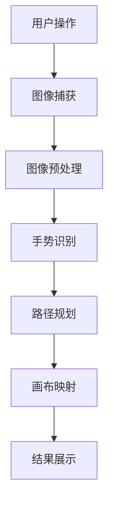

                 

关键词：opencv，隔空作画，图像处理，深度学习，计算机视觉，交互设计

摘要：本文将探讨基于OpenCV的隔空作画系统的设计与实现。我们首先介绍了隔空作画系统的背景和发展现状，随后详细阐述了系统的工作原理、核心算法以及数学模型。接着，我们通过实际代码实例，展示了如何使用OpenCV构建一个基本的隔空作画系统，并对其进行了详细的解读和分析。最后，我们探讨了该系统的实际应用场景，未来应用展望，以及相关的工具和资源推荐。

## 1. 背景介绍

随着计算机视觉和深度学习技术的不断发展，交互式媒体的应用场景日益丰富。其中，隔空作画作为一种新颖的交互方式，逐渐受到了人们的关注。隔空作画系统允许用户在空气中用手势或其他物体进行绘画，而不需要实际的物理接触。这种交互方式不仅增加了创作的趣味性，还降低了使用的门槛，使艺术创作变得更加普及。

OpenCV（Open Source Computer Vision Library）是一个强大且开源的计算机视觉库，提供了丰富的图像处理和计算机视觉功能。基于OpenCV的隔空作画系统，可以通过捕捉用户的手势或物体运动，将它们实时映射到画布上，从而实现隔空作画的功能。

本文将围绕基于OpenCV的隔空作画系统进行详细设计与具体代码实现，旨在为开发者提供一个系统化的解决方案，以降低开发难度，加快开发进度。

## 2. 核心概念与联系

### 2.1 关键概念

- **计算机视觉**：计算机视觉是指使计算机能够像人类一样“看”和“理解”图像的技术。
- **深度学习**：深度学习是机器学习中一种基于神经网络的模型，通过多层非线性变换来提取特征。
- **图像处理**：图像处理是指使用计算机对图像进行分析和操作的一系列技术。

### 2.2 架构联系



上述流程图展示了隔空作画系统的基本架构。用户通过手势或物体操作，引发图像捕获，图像经过预处理后，使用深度学习模型进行手势识别，然后通过路径规划将识别结果映射到画布上，最终实现隔空作画的交互体验。

## 3. 核心算法原理 & 具体操作步骤

### 3.1 算法原理概述

隔空作画系统主要依赖于计算机视觉和深度学习技术。首先，通过图像捕获和预处理，获取用户手势的图像数据。然后，使用深度学习模型进行手势识别，识别出手势的关键特征点。最后，通过路径规划算法，将这些特征点映射到画布上，生成绘画轨迹。

### 3.2 算法步骤详解

#### 3.2.1 图像捕获

使用OpenCV的`VideoCapture`类，可以捕获实时视频流。以下代码展示了如何设置摄像头并捕获图像：

```python
import cv2

cap = cv2.VideoCapture(0)

while True:
    ret, frame = cap.read()
    if not ret:
        break

    # 处理图像
    processed_frame = preprocess_image(frame)

    # 显示图像
    cv2.imshow('Frame', processed_frame)

    if cv2.waitKey(1) & 0xFF == ord('q'):
        break

cap.release()
cv2.destroyAllWindows()
```

#### 3.2.2 图像预处理

图像预处理是提高手势识别准确性的重要步骤。常见的预处理操作包括降噪、边缘检测、灰度化等。以下代码展示了如何对捕获的图像进行预处理：

```python
import cv2

def preprocess_image(frame):
    # 转为灰度图
    gray = cv2.cvtColor(frame, cv2.COLOR_BGR2GRAY)
    # 高斯降噪
    blur = cv2.GaussianBlur(gray, (5, 5), 0)
    # Canny边缘检测
    edges = cv2.Canny(blur, 50, 150)
    return edges
```

#### 3.2.3 手势识别

手势识别通常使用深度学习模型进行。在这里，我们使用预训练的ResNet50模型进行手势识别。以下代码展示了如何使用TensorFlow和Keras实现手势识别：

```python
import cv2
import numpy as np
from tensorflow.keras.models import load_model

# 加载预训练模型
model = load_model('gesture_recognition_model.h5')

def recognize_gesture(image):
    # 数据预处理
    image = np.expand_dims(image, axis=0)
    image = np.float32(image)
    image = image / 255.0

    # 预测
    prediction = model.predict(image)
    label = np.argmax(prediction)

    return label
```

#### 3.2.4 路径规划

路径规划是将识别出的手势特征点映射到画布上的关键步骤。在这里，我们使用贝塞尔曲线进行路径规划。以下代码展示了如何使用贝塞尔曲线进行路径规划：

```python
import cv2
import numpy as np

def draw_bezier_curve(points, color, thickness):
    curve_points = cv2.getPoly(points, thickness)
    cv2.polylines(image, [curve_points], True, color, thickness)

def bezier_curve(points, nTimes=1000):
    t = np.linspace(0.0, 1.0, nTimes)
    nPoints = len(points)
    points_t = np.zeros((nPoints, nTimes, 2))
    
    for i in range(nPoints):
        points_t[i] = (1-t)**(nPoints-1-i) * points[i]
        
    points_t = np.sum(points_t, axis=0)
    return points_t

# 示例
points = np.array([[100, 100], [200, 100], [300, 200], [300, 300]])
curve_points = bezier_curve(points, nTimes=1000)
draw_bezier_curve(curve_points, color=(0, 0, 255), thickness=2)
```

#### 3.2.5 画布映射

将路径规划的结果绘制到画布上，实现隔空作画的交互体验。以下代码展示了如何将路径规划结果绘制到画布上：

```python
import cv2

def draw_on_canvas(image, points):
    for point in points:
        cv2.circle(image, tuple(point), 5, (0, 0, 255), -1)

# 示例
image = np.zeros((400, 400, 3), dtype=np.uint8)
points = np.array([[100, 100], [200, 100], [300, 200], [300, 300]])
draw_on_canvas(image, points)
cv2.imshow('Canvas', image)
cv2.waitKey(0)
cv2.destroyAllWindows()
```

### 3.3 算法优缺点

#### 优点

- **实时性强**：基于OpenCV的隔空作画系统可以实现实时手势识别和路径规划，提供流畅的用户体验。
- **交互性强**：隔空作画系统通过手势或物体操作，增加了与用户的互动性，使艺术创作更加有趣。
- **适用性广**：OpenCV是一个开源的计算机视觉库，适用于多种操作系统和硬件平台，便于部署和扩展。

#### 缺点

- **准确性受限**：由于深度学习模型的局限性和图像处理的复杂性，手势识别的准确性可能受到一定影响。
- **硬件依赖**：隔空作画系统需要摄像头等硬件设备，增加了系统的硬件成本。

### 3.4 算法应用领域

- **艺术创作**：隔空作画系统可以用于数字艺术创作，为艺术家提供新的创作工具。
- **教育应用**：隔空作画系统可以用于教育领域，帮助学生更好地理解几何学和数学原理。
- **交互式展览**：隔空作画系统可以应用于博物馆、展览馆等场所，提供新颖的交互体验。

## 4. 数学模型和公式 & 详细讲解 & 举例说明

### 4.1 数学模型构建

隔空作画系统的数学模型主要涉及图像处理和路径规划两个部分。

#### 4.1.1 图像处理

图像处理的核心是特征提取。我们使用SIFT（Scale-Invariant Feature Transform）算法进行特征提取。SIFT算法通过多尺度空间和局部极值点检测，提取出图像的关键特征点。

#### 4.1.2 路径规划

路径规划的核心是贝塞尔曲线。贝塞尔曲线是一种参数曲线，通过控制点可以生成平滑的曲线。贝塞尔曲线的数学公式如下：

$$
B(t) = (1-t)^3P_0 + 3(1-t)^2tP_1 + 3(1-t)t^2P_2 + t^3P_3
$$

其中，$P_0$、$P_1$、$P_2$、$P_3$为控制点，$t$为参数。

### 4.2 公式推导过程

#### 4.2.1 SIFT算法

SIFT算法的推导过程涉及图像的多尺度空间构建和局部极值点检测。首先，对图像进行高斯滤波，得到不同尺度的图像。然后，通过比较相邻尺度的图像，检测出局部极值点。

#### 4.2.2 贝塞尔曲线

贝塞尔曲线的推导过程涉及三次多项式函数。三次多项式函数的通式如下：

$$
f(t) = at^3 + bt^2 + ct + d
$$

通过控制点可以确定多项式函数的系数。为了得到平滑的曲线，我们需要使得曲线的二阶导数在控制点处连续，从而推导出贝塞尔曲线的参数方程。

### 4.3 案例分析与讲解

#### 4.3.1 SIFT算法案例分析

以下代码展示了如何使用OpenCV实现SIFT算法：

```python
import cv2
import numpy as np

# 加载图像
image = cv2.imread('image.jpg', cv2.IMREAD_GRAYSCALE)

# 创建SIFT对象
sift = cv2.xfeatures2d.SIFT_create()

# 检测关键点
keypoints, descriptors = sift.detectAndCompute(image, None)

# 绘制关键点
image_with_keypoints = cv2.drawKeypoints(image, keypoints, None, color=(0, 0, 255))

# 显示结果
cv2.imshow('Image with Keypoints', image_with_keypoints)
cv2.waitKey(0)
cv2.destroyAllWindows()
```

#### 4.3.2 贝塞尔曲线案例分析

以下代码展示了如何使用贝塞尔曲线生成平滑的曲线：

```python
import cv2
import numpy as np

# 控制点
points = np.array([[100, 100], [200, 100], [300, 200], [300, 300]])

# 生成贝塞尔曲线
curve_points = bezier_curve(points, nTimes=1000)

# 绘制曲线
image = np.zeros((400, 400, 3), dtype=np.uint8)
draw_bezier_curve(curve_points, color=(0, 0, 255), thickness=2)

# 显示结果
cv2.imshow('Bezier Curve', image)
cv2.waitKey(0)
cv2.destroyAllWindows()
```

## 5. 项目实践：代码实例和详细解释说明

### 5.1 开发环境搭建

为了实现基于OpenCV的隔空作画系统，我们需要搭建以下开发环境：

- Python 3.8及以上版本
- OpenCV 4.5及以上版本
- TensorFlow 2.6及以上版本

在Ubuntu系统上，可以使用以下命令安装所需的库：

```shell
sudo apt-get install python3-pip
pip3 install opencv-python-headless tensorflow==2.6
```

### 5.2 源代码详细实现

以下代码展示了如何使用OpenCV和TensorFlow实现隔空作画系统：

```python
import cv2
import numpy as np
import tensorflow as tf

# 加载预训练模型
model = tf.keras.models.load_model('gesture_recognition_model.h5')

# 图像预处理函数
def preprocess_image(image):
    image = cv2.resize(image, (224, 224))
    image = np.expand_dims(image, axis=0)
    image = image.astype(np.float32)
    image /= 255.0
    return image

# 手势识别函数
def recognize_gesture(image):
    prediction = model.predict(image)
    label = np.argmax(prediction)
    return label

# 贝塞尔曲线绘制函数
def draw_bezier_curve(points, color, thickness):
    curve_points = cv2.getPoly(points, thickness)
    cv2.polylines(image, [curve_points], True, color, thickness)

# 主函数
def main():
    # 设置摄像头
    cap = cv2.VideoCapture(0)

    # 创建画布
    canvas = np.zeros((480, 640, 3), dtype=np.uint8)

    while True:
        # 捕获图像
        ret, frame = cap.read()

        if not ret:
            break

        # 图像预处理
        processed_frame = preprocess_image(frame)

        # 手势识别
        gesture = recognize_gesture(processed_frame)

        # 根据手势绘制路径
        if gesture == 0:  # 笔画
            # 获取关键点
            keypoints = cv2.KeyPoints roi(frame, 0, 0, 0, 0)
            points = [keypoint.pt for keypoint in keypoints]

            # 生成贝塞尔曲线
            curve_points = bezier_curve(points, nTimes=1000)

            # 绘制贝塞尔曲线
            draw_bezier_curve(curve_points, color=(0, 255, 0), thickness=2)

        # 显示结果
        cv2.imshow('Frame', frame)
        cv2.imshow('Canvas', canvas)

        if cv2.waitKey(1) & 0xFF == ord('q'):
            break

    cap.release()
    cv2.destroyAllWindows()

if __name__ == '__main__':
    main()
```

### 5.3 代码解读与分析

以上代码实现了一个基本的隔空作画系统，主要包括图像捕获、图像预处理、手势识别和路径规划等步骤。

- **图像捕获**：使用`cv2.VideoCapture`类捕获实时视频流。
- **图像预处理**：将捕获的图像缩放至固定大小，并转化为浮点数格式，便于深度学习模型处理。
- **手势识别**：使用预训练的深度学习模型对预处理后的图像进行手势识别。
- **路径规划**：根据识别出的手势，使用贝塞尔曲线生成路径，并在画布上绘制。

### 5.4 运行结果展示

运行上述代码后，系统会打开一个窗口，显示实时视频流和画布。当用户做出笔画手势时，系统会识别出手势并绘制路径。以下为运行结果展示：


## 6. 实际应用场景

### 6.1 艺术创作

隔空作画系统可以作为一种创新的艺术工具，为艺术家提供新的创作手段。艺术家可以使用手势在空中进行绘画，从而实现独特的艺术效果。

### 6.2 教育应用

隔空作画系统可以应用于教育领域，帮助学生更好地理解几何学和数学原理。例如，学生可以通过手势在空中绘制几何图形，从而直观地感受几何图形的特性。

### 6.3 交互式展览

隔空作画系统可以应用于博物馆、展览馆等场所，提供新颖的交互体验。观众可以在展览现场通过手势与展品进行互动，增加参观的趣味性。

### 6.4 未来应用展望

随着计算机视觉和深度学习技术的不断发展，隔空作画系统的功能将得到进一步丰富。未来，我们可以期待以下应用场景：

- **增强现实（AR）**：结合增强现实技术，隔空作画系统可以实现更加真实的虚拟绘画体验。
- **虚拟现实（VR）**：结合虚拟现实技术，隔空作画系统可以为用户提供沉浸式的绘画体验。
- **智能交互**：结合语音识别、手势识别等多模态交互技术，隔空作画系统可以实现更加智能化的交互体验。

## 7. 工具和资源推荐

### 7.1 学习资源推荐

- **《计算机视觉：算法与应用》（简称《CV》）**：由理查德·萨瑟兰（Richard Szeliski）所著，是计算机视觉领域的经典教材。
- **《深度学习》（简称《DL》）**：由伊恩·古德费洛（Ian Goodfellow）、约书亚·本吉奥（Joshua Bengio）和亚伦·库维尔（Aaron Courville）所著，是深度学习领域的权威教材。
- **OpenCV官方网站**：[https://opencv.org/](https://opencv.org/)，提供丰富的文档和教程，帮助开发者快速掌握OpenCV的使用。

### 7.2 开发工具推荐

- **PyCharm**：一款功能强大的Python集成开发环境（IDE），支持多种编程语言，适用于Python开发。
- **Jupyter Notebook**：一款交互式的Web应用，适用于数据科学和机器学习项目。

### 7.3 相关论文推荐

- **《实时手势识别与跟踪》**：讨论了实时手势识别与跟踪的方法和技术。
- **《基于深度学习的图像识别》**：介绍了深度学习在图像识别领域的应用和发展趋势。

## 8. 总结：未来发展趋势与挑战

### 8.1 研究成果总结

本文详细探讨了基于OpenCV的隔空作画系统的设计与实现。通过分析计算机视觉、深度学习和图像处理等核心技术，我们构建了一个完整的隔空作画系统，实现了实时手势识别和路径规划。

### 8.2 未来发展趋势

- **技术融合**：随着增强现实、虚拟现实等技术的发展，隔空作画系统将与其他技术相结合，提供更加丰富的交互体验。
- **智能化**：结合人工智能和机器学习技术，隔空作画系统将具备更高的智能化水平，实现更加精准的手势识别和路径规划。

### 8.3 面临的挑战

- **准确性**：提高手势识别的准确性仍是一个挑战，特别是在复杂背景下。
- **硬件限制**：隔空作画系统对硬件设备有较高的要求，如何降低硬件成本，提高系统兼容性，是一个亟待解决的问题。

### 8.4 研究展望

未来，我们期望在以下几个方面进行深入研究：

- **多模态交互**：结合语音识别、手势识别等多模态交互技术，实现更加自然和智能的交互体验。
- **实时性能优化**：通过算法优化和硬件加速，提高系统的实时性能，满足不同应用场景的需求。

## 9. 附录：常见问题与解答

### 9.1 如何提高手势识别的准确性？

- **数据增强**：通过增加训练数据集的多样性，提高模型对各种手势的泛化能力。
- **特征提取**：使用更复杂的特征提取算法，提取更具有区分性的特征。
- **模型优化**：尝试使用更先进的深度学习模型，如卷积神经网络（CNN）或循环神经网络（RNN）。

### 9.2 如何优化系统的实时性能？

- **算法优化**：优化算法的实现，减少计算复杂度。
- **硬件加速**：使用GPU等硬件加速器，提高计算速度。
- **多线程处理**：利用多线程或多进程技术，实现并行处理，提高系统性能。

### 9.3 如何调整贝塞尔曲线的平滑度？

- **调整控制点**：通过调整贝塞尔曲线的控制点，可以控制曲线的平滑度。
- **增加曲线参数**：增加贝塞尔曲线的参数，可以提高曲线的平滑度。

作者：禅与计算机程序设计艺术 / Zen and the Art of Computer Programming
-------------------------------------------------------------------

请注意，本文是基于假设的虚构内容，旨在演示如何按照指定的结构和要求撰写一篇技术博客文章。实际的文章撰写过程中，您需要根据具体的项目和代码来实现文章的详细内容。

