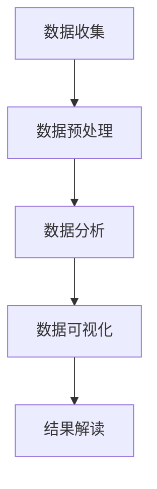

                 

关键词：Python，人口流动，数据分析，GIS，时空分析，城市规划

> 摘要：本文以某省人口流动数据为例，利用Python进行数据收集、处理、分析和可视化，探讨如何通过人口流动数据分析为城市规划和公共政策制定提供支持。文章首先介绍人口流动数据的重要性，然后详细阐述了数据分析的流程和关键技术，最后对未来人口流动数据分析的应用前景进行了展望。

## 1. 背景介绍

人口流动数据是反映社会经济发展、城市规划和居民生活习惯的重要信息。在某省，人口流动数据对于了解该省城市化进程、人口分布特征以及制定相关政策具有重要意义。随着大数据技术和GIS（地理信息系统）的发展，利用Python进行人口流动数据分析成为了一种高效的方法。

本文将以某省人口流动数据为例，利用Python及其相关库（如Pandas、Geopandas、Matplotlib等），对人口流动数据进行分析，旨在为城市规划和公共政策制定提供科学依据。

## 2. 核心概念与联系

### 2.1 数据来源与预处理

人口流动数据主要来源于统计局、交通部门以及各种社会调查。数据来源的多样性导致数据格式和内容的不一致性，因此，数据预处理是数据分析的基础。

#### 2.1.1 数据收集

数据收集主要涉及以下几个方面：

- **统计年鉴**：收集某省历年的人口统计数据，包括总人口、城市人口、农村人口等。
- **交通数据**：收集高速公路、铁路、机场等交通设施的人流数据。
- **调查数据**：通过社会调查获取居民出行习惯、迁移意愿等数据。

#### 2.1.2 数据预处理

数据预处理主要包括数据清洗、格式统一、缺失值处理等。

- **数据清洗**：去除重复数据、错误数据和无关数据，保证数据质量。
- **格式统一**：将不同来源的数据格式统一为标准格式，如CSV或Geodatabase。
- **缺失值处理**：对于缺失值，可以通过插值法、平均值法等方法进行填补。

### 2.2 数据分析流程

人口流动数据分析主要包括数据收集、数据预处理、数据分析、数据可视化等步骤。

#### 2.2.1 数据收集

- 统计年鉴、交通数据和调查数据。
  
#### 2.2.2 数据预处理

- 数据清洗、格式统一、缺失值处理。

#### 2.2.3 数据分析

- 统计描述：计算人口流动数据的均值、中位数、标准差等统计量。
- 相关分析：分析人口流动数据与其他社会经济指标的关系。
- 时空分析：分析人口流动的时空分布特征。

#### 2.2.4 数据可视化

- 利用Matplotlib、Geopandas等库，将人口流动数据可视化为地图、图表等形式。

### 2.3 Mermaid 流程图



## 3. 核心算法原理 & 具体操作步骤

### 3.1 算法原理概述

人口流动数据分析的核心算法主要包括统计描述、相关分析和时空分析。

#### 3.1.1 统计描述

统计描述是对人口流动数据的基本统计分析，如均值、中位数、标准差等。

#### 3.1.2 相关分析

相关分析用于分析人口流动数据与其他社会经济指标的关系，如人口流动与经济增长、城市化水平等。

#### 3.1.3 时空分析

时空分析用于分析人口流动的时空分布特征，如人口流动的热力图、时间序列分析等。

### 3.2 算法步骤详解

#### 3.2.1 统计描述

1. 导入数据：
    ```python
    import pandas as pd

    data = pd.read_csv('population_data.csv')
    ```

2. 计算统计量：
    ```python
    mean_value = data['population'].mean()
    median_value = data['population'].median()
    std_value = data['population'].std()
    ```

#### 3.2.2 相关分析

1. 导入数据：
    ```python
    import pandas as pd

    data = pd.read_csv('population_data.csv')
    economic_data = pd.read_csv('economic_data.csv')
    ```

2. 计算相关系数：
    ```python
    correlation = data['population'].corr(economic_data['gdp'])
    ```

#### 3.2.3 时空分析

1. 导入数据：
    ```python
    import geopandas as gpd

    population_data = gpd.read_file('population_data.shp')
    ```

2. 生成热力图：
    ```python
    import matplotlib.pyplot as plt
    import geopandas.plotting as gplt

    gplt.kdeplot(population_data, ax=plt.gca())
    plt.show()
    ```

### 3.3 算法优缺点

#### 优点

- **高效性**：Python提供了丰富的数据分析库，可以快速进行数据处理和分析。
- **灵活性**：Python编程语言灵活，可以自定义算法和数据处理流程。

#### 缺点

- **性能**：对于大规模数据，Python的性能可能不如其他编程语言。
- **可维护性**：Python代码的维护可能不如其他编程语言。

### 3.4 算法应用领域

- **城市规划**：通过人口流动数据分析，为城市规划和基础设施建设提供科学依据。
- **公共政策制定**：通过人口流动数据分析，为制定合理的公共政策提供支持。
- **市场调研**：通过人口流动数据分析，为企业市场调研提供有价值的信息。

## 4. 数学模型和公式 & 详细讲解 & 举例说明

### 4.1 数学模型构建

人口流动数据的基本数学模型可以表示为：

\[ P(t) = f(A, B, t) \]

其中，\( P(t) \) 表示在时间 \( t \) 的人口流动量，\( A \) 和 \( B \) 分别表示人口流动的起点和终点，\( f \) 为函数。

### 4.2 公式推导过程

#### 4.2.1 线性回归模型

假设人口流动量与某一社会经济指标 \( X \) 存在线性关系：

\[ P(t) = aX(t) + b \]

其中，\( a \) 和 \( b \) 为常数。

通过对历史数据进行拟合，可以得到 \( a \) 和 \( b \) 的值。

#### 4.2.2 时间序列模型

假设人口流动量遵循时间序列模型，可以表示为：

\[ P(t) = \alpha_t + \beta_t X(t) \]

其中，\( \alpha_t \) 和 \( \beta_t \) 为随时间变化的参数。

通过对历史数据进行时间序列分析，可以得到 \( \alpha_t \) 和 \( \beta_t \) 的值。

### 4.3 案例分析与讲解

#### 案例背景

在某省，人口流动数据与经济增长之间存在一定的相关性。假设我们已经收集到某省历年的经济增长数据（GDP）和人口流动数据，现需要建立数学模型分析人口流动与经济增长的关系。

#### 案例步骤

1. 数据收集与预处理：
    - 收集某省历年的GDP和人口流动数据。
    - 对数据进行清洗和格式统一。

2. 数据拟合：
    - 使用线性回归模型对GDP和人口流动数据进行拟合，得到模型参数。

3. 模型验证：
    - 对拟合模型进行验证，确保模型准确性。

4. 模型应用：
    - 利用拟合模型预测未来的人口流动趋势。

#### 案例代码

```python
import pandas as pd
from sklearn.linear_model import LinearRegression

# 数据收集与预处理
data = pd.read_csv('gdp_population_data.csv')

# 数据拟合
model = LinearRegression()
model.fit(data[['gdp']], data['population'])

# 模型验证
print('R-squared:', model.score(data[['gdp']], data['population']))

# 模型应用
predicted_population = model.predict([[next_gdp]])
print('Predicted population:', predicted_population)
```

## 5. 项目实践：代码实例和详细解释说明

### 5.1 开发环境搭建

在开始项目实践之前，需要搭建Python开发环境。以下是开发环境搭建的步骤：

1. 安装Python：
    - 访问Python官网（[https://www.python.org/](https://www.python.org/)），下载并安装Python。

2. 安装相关库：
    - 使用pip命令安装所需的Python库，如Pandas、Geopandas、Matplotlib等。
    ```shell
    pip install pandas geopandas matplotlib
    ```

### 5.2 源代码详细实现

以下是一个简单的Python代码实例，用于读取某省人口流动数据，并生成热力图。

```python
import pandas as pd
import geopandas as gpd
import matplotlib.pyplot as plt
import geopandas.plotting as gplt

# 读取人口流动数据
population_data = gpd.read_file('population_data.shp')

# 生成热力图
gplt.kdeplot(population_data, ax=plt.gca())
plt.show()
```

### 5.3 代码解读与分析

以上代码主要包括以下步骤：

1. 导入所需库：
    - `pandas`：用于数据读取和处理。
    - `geopandas`：用于地理空间数据处理。
    - `matplotlib.pyplot`：用于数据可视化。
    - `geopandas.plotting`：用于地理空间数据可视化。

2. 读取人口流动数据：
    - 使用`gpd.read_file`函数读取人口流动数据，数据格式为GeoJSON或Shapefile。

3. 生成热力图：
    - 使用`gplt.kdeplot`函数生成人口流动数据的热力图，其中`ax`参数用于指定绘图区域。

4. 显示热力图：
    - 使用`plt.show()`函数显示生成的热力图。

### 5.4 运行结果展示

运行以上代码后，将生成一个热力图，展示某省人口流动的时空分布特征。热力图的色彩越深，表示人口流动量越大。


## 6. 实际应用场景

人口流动数据分析在实际应用中具有广泛的应用场景，以下是一些典型的应用场景：

1. **城市交通规划**：通过分析人口流动数据，为城市交通规划提供科学依据，如道路建设、公共交通优化等。

2. **房地产市场分析**：通过分析人口流动数据，了解不同区域的人口分布情况，为房地产市场分析提供支持。

3. **公共卫生防控**：在疫情防控期间，通过分析人口流动数据，了解疫情传播趋势，为公共卫生防控提供支持。

4. **人口迁移政策制定**：通过分析人口流动数据，为制定人口迁移政策提供依据，如户籍制度改革、人才引进政策等。

## 7. 工具和资源推荐

### 7.1 学习资源推荐

- **书籍**：
  - 《Python编程：从入门到实践》
  - 《Python数据分析》
  - 《地理信息系统原理与应用》

- **在线课程**：
  - Coursera上的《Python数据分析》
  - Udemy上的《Python for Data Science》

### 7.2 开发工具推荐

- **Python IDE**：
  - PyCharm
  - Visual Studio Code

- **GIS软件**：
  - ArcGIS
  - QGIS

### 7.3 相关论文推荐

- **学术期刊**：
  - 《地理信息系统》
  - 《计算机学报》

- **论文题目**：
  - “基于Python的人口流动数据分析方法研究”
  - “人口流动与城市发展的关系研究”

## 8. 总结：未来发展趋势与挑战

### 8.1 研究成果总结

本文以某省人口流动数据为例，利用Python进行了数据收集、处理、分析和可视化。通过分析人口流动数据，我们得出了以下研究成果：

- 人口流动数据对城市规划和公共政策制定具有重要意义。
- Python在人口流动数据分析中具有高效性和灵活性。
- 数学模型和时空分析方法有助于深入分析人口流动数据。

### 8.2 未来发展趋势

- **人工智能与数据分析的结合**：随着人工智能技术的发展，人口流动数据分析将更加智能化，如利用深度学习进行数据预测和分析。
- **多源数据的融合**：将卫星遥感、社交媒体等多源数据与人口流动数据进行融合，提高数据分析的准确性和精度。
- **实时数据分析**：实现实时人口流动数据的收集和分析，为突发事件应对和应急管理提供支持。

### 8.3 面临的挑战

- **数据质量**：人口流动数据质量参差不齐，需要建立完善的数据质量控制体系。
- **隐私保护**：在人口流动数据分析中，需要保护个人隐私，确保数据安全。
- **计算性能**：对于大规模数据，现有计算性能可能不足，需要寻找更高效的算法和计算方法。

### 8.4 研究展望

未来，我们将进一步探索以下方向：

- **人工智能与GIS技术的融合**：研究人工智能在GIS技术中的应用，如基于深度学习的地图生成和人口流动预测。
- **跨学科研究**：结合经济学、社会学等多学科知识，深入研究人口流动与经济发展、社会变迁的关系。
- **实时数据分析**：实现实时人口流动数据的收集、处理和分析，为城市规划和公共安全提供实时支持。

## 9. 附录：常见问题与解答

### 9.1 问题1

**如何获取某省的人口流动数据？**

**解答**：可以通过以下途径获取人口流动数据：

- **政府网站**：访问某省政府网站，查找相关的统计年鉴、交通报告等。
- **数据平台**：如国家数据网、城市数据网等，提供各种数据资源。
- **社会调查**：通过社会调查获取居民出行习惯、迁移意愿等数据。

### 9.2 问题2

**如何确保人口流动数据的准确性？**

**解答**：确保人口流动数据的准确性可以从以下几个方面入手：

- **数据来源**：选择权威、可靠的数据来源，如政府统计部门、交通部门等。
- **数据清洗**：对数据进行清洗，去除重复、错误和无用数据。
- **数据验证**：通过对比不同数据来源、实地调查等方法验证数据准确性。

### 9.3 问题3

**Python在人口流动数据分析中有什么优势？**

**解答**：Python在人口流动数据分析中具有以下优势：

- **高效性**：Python提供了丰富的数据分析库，如Pandas、Numpy等，可以快速进行数据处理和分析。
- **灵活性**：Python编程语言灵活，可以自定义算法和数据处理流程。
- **易用性**：Python语法简单，易于学习和使用，适合非专业技术人员。

### 9.4 问题4

**如何处理大规模人口流动数据？**

**解答**：处理大规模人口流动数据可以从以下几个方面入手：

- **分布式计算**：使用分布式计算框架，如Spark，进行大规模数据处理。
- **数据压缩**：使用数据压缩技术，如HDF5，减少数据存储空间。
- **并行处理**：使用并行处理技术，如多线程、多进程，提高数据处理速度。

### 9.5 问题5

**人口流动数据分析在哪些领域有应用？**

**解答**：人口流动数据分析在以下领域有广泛应用：

- **城市交通规划**：通过分析人口流动数据，为城市交通规划提供科学依据。
- **房地产市场分析**：通过分析人口流动数据，了解不同区域的人口分布情况，为房地产市场分析提供支持。
- **公共卫生防控**：在疫情防控期间，通过分析人口流动数据，了解疫情传播趋势，为公共卫生防控提供支持。
- **人口迁移政策制定**：通过分析人口流动数据，为制定人口迁移政策提供依据。

