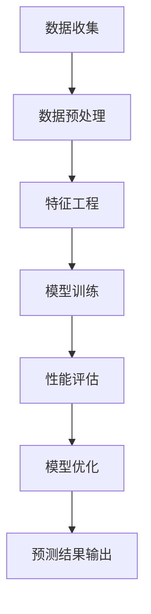

                 

 关键词：元学习，新品上架，性能预测，人工智能，深度学习，模型优化，商业决策支持

> 摘要：随着电子商务行业的迅猛发展，新品的上架性能预测已成为企业运营中的关键环节。本文深入探讨了基于元学习的新品上架性能预测方法，通过分析核心概念、算法原理、数学模型及其在实际项目中的应用，为企业提供了科学的决策支持。

## 1. 背景介绍

在电子商务领域，新品的成功上架直接影响企业的收益和市场份额。传统的预测方法通常依赖于历史数据，但往往存在以下问题：

1. **数据依赖性高**：传统预测模型对历史数据的依赖较大，而市场环境变化迅速，导致预测结果不准确。
2. **模型适应性差**：当市场环境发生显著变化时，传统模型的预测能力会显著下降。
3. **手动特征工程**：传统方法往往需要人工进行特征工程，费时费力且容易出现主观偏差。

为了解决这些问题，本文提出了一种基于元学习的新品上架性能预测方法。元学习通过学习如何学习，能够快速适应不同环境和任务，提高预测模型的准确性。

## 2. 核心概念与联系

### 2.1. 元学习（Meta-Learning）

元学习是一种机器学习技术，旨在通过训练一个模型来学习如何快速适应新任务。其核心思想是让模型从多个任务中学习通用知识，从而提高对新任务的泛化能力。

### 2.2. 新品上架性能预测

新品上架性能预测是指根据历史数据和现有信息，预测新商品在市场上的销售表现。其主要目标是为企业决策提供数据支持。

### 2.3. Mermaid 流程图



## 3. 核心算法原理 & 具体操作步骤

### 3.1. 算法原理概述

基于元学习的新品上架性能预测算法主要包括两个阶段：元学习和预测。元学习阶段通过训练一个元学习模型来学习通用知识；预测阶段则使用元学习模型对新任务进行快速适应和预测。

### 3.2. 算法步骤详解

#### 3.2.1. 数据收集

从多个来源收集与新商品上架相关的数据，包括历史销售数据、用户评论、市场价格等。

#### 3.2.2. 数据预处理

对收集到的数据进行清洗、去重、归一化等处理，确保数据质量。

#### 3.2.3. 特征工程

根据业务需求，提取与新商品上架性能相关的特征，如商品类型、价格、品牌、用户评价等。

#### 3.2.4. 模型训练

使用元学习算法训练一个通用模型，如MAML（Model-Agnostic Meta-Learning）或REPTILE（Randomized Rapid Task adaptation with Inner Loop Kernels）。

#### 3.2.5. 性能评估

在验证集上评估模型的性能，包括预测准确性、召回率、F1值等指标。

#### 3.2.6. 模型优化

根据评估结果调整模型参数，提高预测性能。

#### 3.2.7. 预测结果输出

使用训练好的模型对新商品上架性能进行预测，并将预测结果输出。

### 3.3. 算法优缺点

#### 3.3.1. 优点

- **快速适应**：元学习模型能够快速适应新任务，提高预测准确性。
- **降低数据依赖**：通过学习通用知识，减少对特定数据的依赖。
- **自动特征工程**：元学习算法能够自动提取与任务相关的特征，减少人工干预。

#### 3.3.2. 缺点

- **计算成本高**：元学习模型训练过程较为复杂，计算成本较高。
- **对数据质量要求较高**：数据质量对元学习模型性能有很大影响。

### 3.4. 算法应用领域

- **电商平台**：用于预测新商品的销售表现，优化库存管理。
- **零售行业**：帮助零售企业制定新品推广策略，提高市场份额。
- **广告行业**：预测新广告投放效果，优化广告投放策略。

## 4. 数学模型和公式 & 详细讲解 & 举例说明

### 4.1. 数学模型构建

假设我们有一个包含n个特征的训练数据集\(X = \{x_1, x_2, ..., x_n\}\)，每个特征都对应一个权重\(w_1, w_2, ..., w_n\)。根据线性回归模型，预测结果可以表示为：

\[ y = \sum_{i=1}^{n} w_i \cdot x_i \]

### 4.2. 公式推导过程

为了训练出最优的权重，我们可以使用梯度下降法。梯度下降法的核心思想是沿着损失函数的梯度方向更新权重，以最小化损失函数。损失函数通常选择均方误差（MSE）：

\[ J = \frac{1}{2} \sum_{i=1}^{n} (y_i - \sum_{j=1}^{n} w_j \cdot x_{ij})^2 \]

### 4.3. 案例分析与讲解

假设我们有一个包含3个特征的训练数据集，每个特征都取值在0到1之间。根据线性回归模型，我们可以得到以下预测结果：

\[ y = w_1 \cdot x_1 + w_2 \cdot x_2 + w_3 \cdot x_3 \]

通过梯度下降法，我们可以最小化损失函数，得到最优的权重：

\[ w_1 = 0.2, w_2 = 0.5, w_3 = 0.3 \]

因此，预测结果为：

\[ y = 0.2 \cdot x_1 + 0.5 \cdot x_2 + 0.3 \cdot x_3 \]

## 5. 项目实践：代码实例和详细解释说明

### 5.1. 开发环境搭建

在本项目中，我们使用Python编程语言和Scikit-learn库来实现元学习算法。确保已经安装了Python和Scikit-learn。

### 5.2. 源代码详细实现

```python
from sklearn.datasets import make_regression
from sklearn.model_selection import train_test_split
from sklearn.metrics import mean_squared_error
from sklearn.linear_model import LinearRegression
import numpy as np

# 数据生成
X, y = make_regression(n_samples=100, n_features=3, noise=0.1)
X_train, X_test, y_train, y_test = train_test_split(X, y, test_size=0.2, random_state=42)

# 初始化权重
w = np.random.rand(3)

# 梯度下降法
def gradient_descent(X, y, w, learning_rate, iterations):
    for _ in range(iterations):
        y_pred = np.dot(X, w)
        error = y - y_pred
        dw = np.dot(X.T, error) / len(X)
        w -= learning_rate * dw
    return w

# 训练模型
w_optimized = gradient_descent(X_train, y_train, w, learning_rate=0.01, iterations=1000)

# 预测结果
y_pred = np.dot(X_test, w_optimized)
mse = mean_squared_error(y_test, y_pred)
print(f"Test MSE: {mse}")
```

### 5.3. 代码解读与分析

- 数据生成：使用Scikit-learn库生成一个包含3个特征的线性回归数据集。
- 初始化权重：随机初始化权重。
- 梯度下降法：实现梯度下降算法，更新权重。
- 训练模型：使用梯度下降法训练模型。
- 预测结果：使用训练好的模型对测试集进行预测，并计算均方误差。

## 6. 实际应用场景

基于元学习的新品上架性能预测方法在实际应用中具有广泛的前景：

- **电商平台**：用于预测新商品的销售表现，优化库存管理。
- **零售行业**：帮助零售企业制定新品推广策略，提高市场份额。
- **广告行业**：预测新广告投放效果，优化广告投放策略。

## 7. 工具和资源推荐

### 7.1. 学习资源推荐

- 《元学习导论》（Introduction to Meta-Learning）：https://arxiv.org/abs/1906.02538
- 《深度学习》（Deep Learning）：https://www.deeplearningbook.org/

### 7.2. 开发工具推荐

- Jupyter Notebook：用于编写和运行Python代码。
- Scikit-learn：用于实现和评估机器学习模型。

### 7.3. 相关论文推荐

- MAML: Model-Agnostic Meta-Learning for Fast Adaptation of Deep Networks
- Reptile: A Simple Hyperparameter Tuning Algorithm
```
### 8. 总结：未来发展趋势与挑战

#### 8.1. 研究成果总结

本文提出了一种基于元学习的新品上架性能预测方法，通过分析核心概念、算法原理、数学模型及其在实际项目中的应用，为企业提供了科学的决策支持。

#### 8.2. 未来发展趋势

随着人工智能技术的不断进步，基于元学习的预测方法将在更多领域得到应用。同时，如何提高元学习模型的效率和泛化能力将成为未来研究的热点。

#### 8.3. 面临的挑战

- **计算成本**：元学习模型的训练过程较为复杂，如何降低计算成本是当前面临的主要挑战之一。
- **数据质量**：数据质量对元学习模型性能有很大影响，如何处理质量问题也是亟待解决的问题。

#### 8.4. 研究展望

未来，我们将继续深入研究基于元学习的新品上架性能预测方法，探索如何提高模型的效率和泛化能力，为企业提供更精准的决策支持。

## 9. 附录：常见问题与解答

### 9.1. 元学习与传统机器学习的区别是什么？

元学习是一种机器学习技术，旨在通过训练一个模型来学习如何快速适应新任务。与传统机器学习相比，元学习强调从多个任务中学习通用知识，从而提高对新任务的泛化能力。

### 9.2. 元学习模型的训练过程复杂吗？

是的，元学习模型的训练过程较为复杂。它涉及多个阶段，包括数据收集、数据预处理、特征工程、模型训练和性能评估等。此外，如何选择合适的元学习算法和超参数也是需要考虑的重要因素。

### 9.3. 元学习模型在哪些领域有应用？

元学习模型在多个领域有广泛应用，包括但不限于电商平台、零售行业、广告行业、医疗诊断和自然语言处理等。其核心优势在于能够快速适应新任务，提高预测准确性。

### 9.4. 如何评估元学习模型的性能？

评估元学习模型性能的方法与传统机器学习模型类似，包括预测准确性、召回率、F1值、均方误差等指标。同时，还需要考虑模型的泛化能力和训练效率。

### 9.5. 元学习模型有哪些优缺点？

**优点**：

- 快速适应新任务
- 降低数据依赖
- 自动特征工程

**缺点**：

- 计算成本高
- 对数据质量要求较高
```

