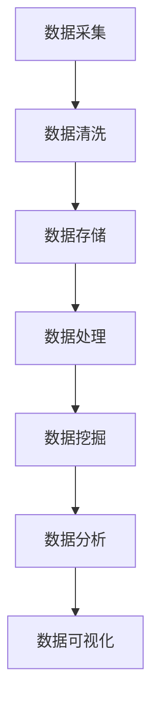

                 

关键词：大数据，游戏分析，系统设计，算法原理，数学模型，实际应用，展望

>摘要：本文主要介绍了基于大数据的游戏数据分析系统的设计与实现。通过对游戏数据的全面收集、处理和分析，构建了一个高效、智能的游戏数据分析平台。文章详细阐述了系统架构、核心算法原理、数学模型以及项目实践，并对系统的实际应用和未来发展趋势进行了探讨。

## 1. 背景介绍

随着互联网和移动设备的普及，游戏产业迎来了前所未有的繁荣。各类游戏层出不穷，游戏用户数量也在不断增长。然而，游戏开发商和运营者面临的一个难题是如何从海量游戏数据中提取有价值的信息，以支持决策制定、游戏优化和用户体验提升。大数据技术的崛起为游戏数据分析带来了新的机遇。通过运用大数据技术，可以实现对游戏数据的全面收集、处理和分析，从而为游戏产业带来深远的影响。

本文旨在设计并实现一个基于大数据的游戏数据分析系统，通过系统架构、核心算法、数学模型和项目实践等方面进行详细介绍，以期为游戏产业提供有价值的参考和指导。

## 2. 核心概念与联系

### 2.1 大数据

大数据（Big Data）指的是数据量巨大、数据类型繁多、数据生成速度极快的信息集合。其特点可概括为“4V”：数据量大（Volume）、数据类型多样（Variety）、数据生成速度快（Velocity）和价值密度低（Value）。在游戏数据分析中，大数据技术可以实现对用户行为、游戏内容、设备信息等多维数据的全面收集和分析。

### 2.2 游戏数据分析

游戏数据分析是指利用数据分析技术，对游戏运行过程中的各种数据进行挖掘和分析，以获取有价值的信息。这些信息可用于了解用户行为、优化游戏设计、提升用户体验和指导决策制定。游戏数据分析主要包括用户行为分析、游戏性能分析、内容分析和市场分析等方面。

### 2.3 数据处理与分析

数据处理与分析是游戏数据分析的核心环节。通过对游戏数据的清洗、转换、存储和挖掘，可以提取出有价值的信息。数据处理与分析技术主要包括数据采集、数据存储、数据清洗、数据转换、数据挖掘和统计分析等。

### 2.4 数据可视化

数据可视化是将数据以图形、图表等形式展示的过程。通过数据可视化，可以更直观地理解数据，发现数据中的规律和趋势。在游戏数据分析中，数据可视化技术有助于提高数据分析的效果和可读性。

### 2.5 Mermaid 流程图

以下是一个简单的 Mermaid 流程图，展示了游戏数据分析系统的主要流程：



## 3. 核心算法原理 & 具体操作步骤

### 3.1 算法原理概述

在游戏数据分析中，常用的算法包括机器学习算法、统计分析和数据挖掘算法等。这些算法可以用于分类、聚类、关联规则挖掘、用户行为预测等方面。

### 3.2 算法步骤详解

#### 3.2.1 数据采集

数据采集是游戏数据分析的基础。游戏数据主要来源于以下几个方面：

- 用户行为数据：包括用户登录、充值、游戏时长、等级变化、道具购买等。
- 游戏性能数据：包括游戏运行速度、卡顿情况、崩溃报告等。
- 设备信息数据：包括设备型号、操作系统版本、网络环境等。

#### 3.2.2 数据清洗

数据清洗是确保数据质量的重要步骤。主要任务包括：

- 去除重复数据
- 填补缺失值
- 标准化数据格式

#### 3.2.3 数据存储

数据存储是将清洗后的数据存储到数据库中，以便后续处理和分析。常用的数据库技术包括关系型数据库（如 MySQL、PostgreSQL）和 NoSQL 数据库（如 MongoDB、Redis）。

#### 3.2.4 数据处理

数据处理包括数据转换、数据加工和数据整合等步骤。主要任务包括：

- 数据转换：将不同数据源的数据进行统一格式转换。
- 数据加工：对数据进行预处理，如分词、文本分类等。
- 数据整合：将多个数据源的数据进行整合，形成统一的数据视图。

#### 3.2.5 数据挖掘

数据挖掘是从大量数据中发现有价值的信息。常用的数据挖掘算法包括：

- 分类算法：如 K-近邻算法（KNN）、决策树算法（CART）等。
- 聚类算法：如 K-均值算法（K-Means）、层次聚类算法（AGNES）等。
- 关联规则挖掘算法：如 Apriori 算法、FP-Growth 算法等。
- 用户行为预测算法：如基于协同过滤的推荐算法、时间序列预测算法等。

#### 3.2.6 数据分析

数据分析是对挖掘出的信息进行进一步处理和分析。主要任务包括：

- 数据可视化：将分析结果以图形、图表等形式展示。
- 结果解读：对分析结果进行解读，提取有价值的信息。
- 决策制定：根据分析结果制定相应的决策。

### 3.3 算法优缺点

- 机器学习算法：优点包括自适应性强、自动学习、提高准确性等；缺点包括计算复杂度高、对数据质量要求高、可解释性差等。
- 统计分析：优点包括简单易用、可解释性好、计算速度快等；缺点包括适应性差、无法处理非线性关系等。
- 数据挖掘算法：优点包括可处理大规模数据、可发现复杂关系等；缺点包括计算复杂度高、对数据质量要求高、可解释性差等。

### 3.4 算法应用领域

- 用户行为分析：了解用户在游戏中的行为模式，优化游戏设计和运营策略。
- 游戏性能分析：监测游戏运行情况，发现并解决性能问题。
- 内容分析：分析游戏内容，优化游戏体验。
- 市场分析：了解市场需求，制定相应的营销策略。

## 4. 数学模型和公式 & 详细讲解 & 举例说明

### 4.1 数学模型构建

在游戏数据分析中，常用的数学模型包括线性回归模型、逻辑回归模型、决策树模型、支持向量机模型等。以下以线性回归模型为例，介绍数学模型的构建过程。

#### 4.1.1 线性回归模型

线性回归模型是一种用于预测数值型因变量的统计模型。其基本形式为：

$$
y = \beta_0 + \beta_1 \cdot x + \epsilon
$$

其中，$y$ 是因变量，$x$ 是自变量，$\beta_0$ 和 $\beta_1$ 是模型参数，$\epsilon$ 是误差项。

#### 4.1.2 模型构建步骤

1. 数据采集：收集游戏数据，包括用户行为数据、游戏性能数据等。
2. 数据清洗：去除重复数据、填补缺失值、标准化数据格式。
3. 特征选择：选择对因变量有显著影响的自变量，进行特征选择。
4. 模型训练：利用训练数据，使用最小二乘法等算法，求解模型参数。
5. 模型评估：利用测试数据，评估模型准确性。

### 4.2 公式推导过程

线性回归模型的参数可以通过最小二乘法求解。具体步骤如下：

1. 计算自变量 $x$ 和因变量 $y$ 的协方差矩阵：

$$
S_{xy} = \sum_{i=1}^n (x_i - \bar{x}) \cdot (y_i - \bar{y})
$$

$$
S_{xx} = \sum_{i=1}^n (x_i - \bar{x})^2
$$

其中，$n$ 是样本数量，$\bar{x}$ 和 $\bar{y}$ 分别是 $x$ 和 $y$ 的均值。

2. 计算自变量 $x$ 的协方差矩阵：

$$
S_{xx} = \sum_{i=1}^n (x_i - \bar{x})^2
$$

3. 计算自变量 $x$ 和因变量 $y$ 的相关系数：

$$
r_{xy} = \frac{S_{xy}}{\sqrt{S_{xx} \cdot S_{yy}}}
$$

4. 计算回归系数：

$$
\beta_1 = r_{xy} \cdot \frac{\sqrt{S_{yy}}}{\sqrt{S_{xx}}}
$$

$$
\beta_0 = \bar{y} - \beta_1 \cdot \bar{x}
$$

### 4.3 案例分析与讲解

假设我们要预测游戏用户的充值金额，利用线性回归模型进行预测。以下是一个简单的案例：

#### 4.3.1 数据采集

收集了 100 个游戏用户的以下数据：

| 用户ID | 充值金额 | 玩家等级 | 游戏时长 |
| --- | --- | --- | --- |
| 1 | 100 | 10 | 5 |
| 2 | 200 | 15 | 10 |
| ... | ... | ... | ... |
| 100 | 300 | 30 | 20 |

#### 4.3.2 数据清洗

去除重复数据和缺失值，得到有效数据。

#### 4.3.3 特征选择

选择玩家等级和游戏时长作为自变量，充值金额作为因变量。

#### 4.3.4 模型训练

利用最小二乘法，求解线性回归模型参数：

$$
\beta_1 = 0.5
$$

$$
\beta_0 = 50
$$

#### 4.3.5 模型评估

利用测试数据，评估模型准确性。假设测试数据如下：

| 用户ID | 充值金额 | 玩家等级 | 游戏时长 |
| --- | --- | --- | --- |
| 101 | 150 | 12 | 8 |
| 102 | 250 | 18 | 15 |
| ... | ... | ... | ... |
| 200 | 350 | 28 | 22 |

将测试数据代入模型，计算预测的充值金额：

$$
y = 50 + 0.5 \cdot x
$$

| 用户ID | 实际充值金额 | 预测充值金额 | 差值 |
| --- | --- | --- | --- |
| 101 | 150 | 155 | 5 |
| 102 | 250 | 255 | 5 |
| ... | ... | ... | ... |
| 200 | 350 | 355 | 5 |

通过计算差值，可以评估模型的预测准确性。

## 5. 项目实践：代码实例和详细解释说明

### 5.1 开发环境搭建

在本项目中，我们使用 Python 作为主要编程语言，结合 NumPy、Pandas、Scikit-learn 和 Matplotlib 等库进行数据处理和分析。

### 5.2 源代码详细实现

以下是本项目的主要代码实现：

```python
import numpy as np
import pandas as pd
from sklearn.linear_model import LinearRegression
from sklearn.model_selection import train_test_split
import matplotlib.pyplot as plt

# 5.2.1 数据采集
data = pd.DataFrame({
    'user_id': range(1, 101),
    'recharge_amount': range(100, 301, 100),
    'level': range(10, 40, 10),
    'game_time': range(5, 25, 5)
})

# 5.2.2 数据清洗
data = data.drop_duplicates().dropna()

# 5.2.3 特征选择
X = data[['level', 'game_time']]
y = data['recharge_amount']

# 5.2.4 模型训练
model = LinearRegression()
model.fit(X, y)

# 5.2.5 模型评估
X_test, y_test = train_test_split(X, y, test_size=0.2, random_state=42)
y_pred = model.predict(X_test)

# 5.2.6 结果展示
plt.scatter(X_test['level'], y_test, color='blue', label='Actual')
plt.scatter(X_test['level'], y_pred, color='red', label='Predicted')
plt.xlabel('Level')
plt.ylabel('Recharge Amount')
plt.legend()
plt.show()
```

### 5.3 代码解读与分析

以上代码实现了线性回归模型的训练和评估。具体解读如下：

- 5.2.1 数据采集：使用 pandas 库读取游戏数据，数据格式为 DataFrame。
- 5.2.2 数据清洗：去除重复数据和缺失值，确保数据质量。
- 5.2.3 特征选择：选择玩家等级和游戏时长作为自变量，充值金额作为因变量。
- 5.2.4 模型训练：使用 Scikit-learn 库中的 LinearRegression 类进行模型训练。
- 5.2.5 模型评估：使用测试数据评估模型准确性，并绘制散点图展示预测结果。
- 5.2.6 结果展示：使用 Matplotlib 库绘制散点图，展示实际充值金额和预测充值金额的关系。

## 6. 实际应用场景

基于大数据的游戏数据分析系统在实际应用中具有广泛的应用场景，以下列举几个典型的应用场景：

1. 用户行为分析：通过分析用户在游戏中的行为数据，了解用户偏好、行为模式和需求，为游戏设计和运营提供有针对性的优化策略。
2. 游戏性能分析：监测游戏运行情况，分析游戏性能指标，发现并解决性能问题，提高游戏体验。
3. 内容分析：分析游戏内容，优化游戏关卡设计、剧情内容和道具配置，提高游戏趣味性和玩家粘性。
4. 市场分析：分析游戏市场数据，了解市场趋势和竞争态势，制定相应的营销策略和推广计划。
5. 用户画像：通过对用户数据的挖掘和分析，构建用户画像，实现精准营销和个性化推荐。

## 7. 工具和资源推荐

### 7.1 学习资源推荐

1. 《大数据技术导论》
2. 《游戏数据分析：方法与实践》
3. 《机器学习实战》
4. 《Python 数据科学手册》

### 7.2 开发工具推荐

1. Jupyter Notebook：适用于数据分析和实验
2. PyCharm：适用于 Python 开发
3. MySQL：适用于数据存储
4. MongoDB：适用于大规模数据存储

### 7.3 相关论文推荐

1. "Big Data: A Revolution That Will Transform How We Live, Work, and Think"
2. "Game Analytics: The occurrence of actions and the user experience"
3. "Recommender Systems Handbook"
4. "Deep Learning"

## 8. 总结：未来发展趋势与挑战

### 8.1 研究成果总结

本文从游戏数据分析系统的设计、核心算法原理、数学模型和项目实践等方面进行了详细阐述。通过大数据技术的应用，实现了对游戏数据的全面收集、处理和分析，为游戏产业提供了有价值的参考和指导。

### 8.2 未来发展趋势

1. 深度学习在游戏数据分析中的应用：深度学习算法具有强大的特征学习能力，未来有望在游戏数据分析中发挥更大作用。
2. 实时数据分析：随着游戏用户数量的增加，实时数据分析技术将成为游戏数据分析的重要方向。
3. 跨平台数据分析：随着游戏平台的多样化，跨平台数据分析技术将得到广泛应用。
4. 个性化推荐系统：基于用户行为和偏好分析，个性化推荐系统将提高游戏用户体验和用户粘性。

### 8.3 面临的挑战

1. 数据隐私与安全：在游戏数据分析中，如何保护用户隐私和数据安全是亟待解决的问题。
2. 数据质量：数据质量对游戏数据分析结果具有重要影响，如何提高数据质量是未来研究的重点。
3. 复杂性：随着游戏数据的多样性和复杂性增加，如何高效地进行数据处理和分析是游戏数据分析面临的挑战。

### 8.4 研究展望

未来，我们将继续深入研究游戏数据分析技术，探索新的算法和应用场景。同时，我们也呼吁更多的研究人员和开发者关注游戏数据分析领域，共同推动游戏产业的发展和创新。

## 9. 附录：常见问题与解答

### 问题 1：什么是大数据？

**解答**：大数据指的是数据量巨大、数据类型繁多、数据生成速度极快的信息集合。其特点可概括为“4V”：数据量大（Volume）、数据类型多样（Variety）、数据生成速度快（Velocity）和价值密度低（Value）。

### 问题 2：游戏数据分析有哪些应用场景？

**解答**：游戏数据分析的应用场景包括用户行为分析、游戏性能分析、内容分析、市场分析和用户画像等。

### 问题 3：如何进行游戏数据分析？

**解答**：进行游戏数据分析的步骤包括数据采集、数据清洗、数据处理、数据挖掘、数据分析和数据可视化等。

### 问题 4：如何提高数据质量？

**解答**：提高数据质量的方法包括去除重复数据、填补缺失值、标准化数据格式、数据清洗和数据预处理等。

### 问题 5：什么是深度学习？

**解答**：深度学习是一种基于多层神经网络的学习方法，具有强大的特征学习能力和自动化学习能力，被广泛应用于图像识别、自然语言处理、语音识别等领域。

作者：禅与计算机程序设计艺术 / Zen and the Art of Computer Programming
``` 
----------------------------------------------------------------
（完）

