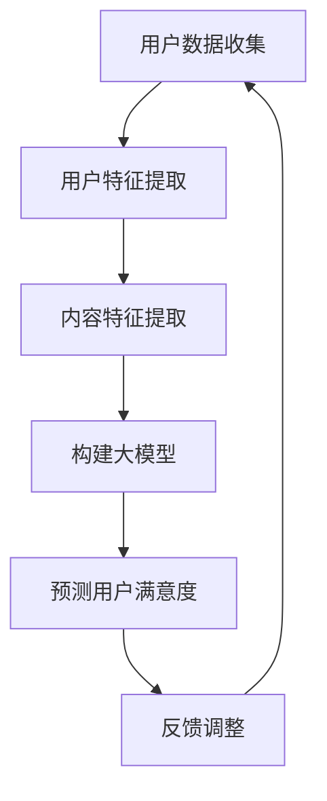

                 

关键词：推荐系统，用户满意度，大模型，预测，算法，数学模型，项目实践，应用场景，未来展望

> 摘要：本文深入探讨了基于大模型的推荐系统用户满意度预测的方法和应用。通过介绍核心概念、算法原理、数学模型构建、项目实践等多个方面，全面分析了推荐系统在用户满意度预测中的重要作用，以及如何利用大模型技术提升预测的准确性和效率。文章旨在为从事推荐系统研究和应用的技术人员提供有价值的参考。

## 1. 背景介绍

推荐系统作为信息过滤和用户个性化服务的关键技术，广泛应用于电子商务、社交媒体、在线视频、新闻资讯等领域。然而，随着用户数据的爆炸式增长，传统的推荐算法在面对海量数据和复杂用户行为时，逐渐暴露出预测准确性不足、推荐结果多样性差等问题。

用户满意度是衡量推荐系统效果的重要指标。提高用户满意度不仅可以增加用户粘性，还能提升平台口碑和商业价值。因此，准确预测用户满意度成为推荐系统研究和应用的重要方向。

近年来，随着深度学习和大数据技术的发展，大模型在推荐系统中得到了广泛应用。大模型通过学习和整合海量用户行为数据，能够更加精准地捕捉用户兴趣和行为模式，从而提高推荐系统的效果。本文将围绕大模型在用户满意度预测中的应用进行深入探讨。

## 2. 核心概念与联系

### 2.1 推荐系统基本概念

推荐系统（Recommendation System）是一种能够根据用户的兴趣、行为和历史数据，向用户推荐相关内容的系统。推荐系统通常包含三个基本组成部分：用户、内容和推荐算法。

- **用户**：推荐系统的核心，其兴趣和行为数据是推荐算法的重要输入。
- **内容**：推荐系统中的信息载体，如商品、文章、视频等。
- **推荐算法**：根据用户数据和内容特征，生成个性化的推荐列表。

### 2.2 用户满意度

用户满意度（User Satisfaction）是用户对推荐系统提供的内容或服务的总体满意程度。通常通过用户评分、点击率、购买率等指标来衡量。用户满意度是评估推荐系统效果的重要标准，直接关系到平台的用户体验和商业价值。

### 2.3 大模型

大模型（Large-scale Model）是指具有海量参数和复杂结构的机器学习模型。大模型通过深度学习和大数据技术，能够从海量数据中学习到复杂的信息和知识，从而实现高精度的预测和分类。

### 2.4 大模型与推荐系统

大模型在推荐系统中的应用主要体现在以下几个方面：

1. **用户特征提取**：大模型能够从海量用户行为数据中提取出高维度的用户特征，为推荐算法提供丰富的输入。
2. **内容特征提取**：大模型能够对内容进行深入分析，提取出内容的关键特征，提高推荐的准确性。
3. **预测和分类**：大模型通过深度学习技术，能够实现对用户行为和满意度的高精度预测。

### 2.5 Mermaid 流程图

下面是一个简化的推荐系统与用户满意度预测的流程图：



## 3. 核心算法原理 & 具体操作步骤

### 3.1 算法原理概述

基于大模型的用户满意度预测算法主要分为以下几个步骤：

1. **数据收集**：收集用户行为数据和内容数据，如点击、评分、购买等。
2. **特征提取**：利用深度学习技术对用户和内容进行特征提取，构建高维度的特征向量。
3. **模型构建**：利用提取的用户和内容特征，构建大模型，如深度神经网络。
4. **预测**：通过大模型对用户满意度进行预测。
5. **反馈调整**：根据预测结果和用户反馈，调整模型参数，提高预测准确性。

### 3.2 算法步骤详解

1. **数据收集**：

   收集用户在推荐系统中的行为数据，如点击、评分、购买等。同时，收集内容的相关信息，如标题、标签、分类等。

2. **特征提取**：

   利用深度学习技术，对用户和内容进行特征提取。常见的特征提取方法包括：

   - **用户行为特征**：通过用户的历史行为数据，提取出用户对各种内容的点击率、评分、购买率等特征。
   - **内容特征**：通过内容的信息，提取出内容的标题、标签、分类、热度等特征。

3. **模型构建**：

   利用提取的用户和内容特征，构建大模型，如深度神经网络。大模型通常包含多层神经网络，通过对海量数据的训练，能够学习到复杂的用户兴趣和行为模式。

4. **预测**：

   通过训练好的大模型，对新的用户行为进行满意度预测。预测结果可以是用户对内容的满意度评分、点击率、购买率等。

5. **反馈调整**：

   根据预测结果和用户实际行为，调整模型参数，提高预测准确性。这一步骤可以采用在线学习的方法，实时更新模型，以适应用户行为的变化。

### 3.3 算法优缺点

1. **优点**：

   - **高精度**：大模型能够从海量数据中学习到复杂的用户兴趣和行为模式，提高预测准确性。
   - **灵活性**：大模型能够自适应地调整，根据用户反馈和实时数据更新模型。
   - **多样性**：大模型能够生成多样化的推荐列表，提高用户的满意度。

2. **缺点**：

   - **计算成本高**：大模型的训练和预测需要大量的计算资源和时间。
   - **数据依赖性强**：大模型的训练依赖于大量的高质量数据，数据的质量直接影响模型的性能。

### 3.4 算法应用领域

基于大模型的用户满意度预测算法可以应用于多种场景，如：

- **电子商务**：预测用户对商品的评价和购买意愿。
- **社交媒体**：预测用户对内容的喜好和互动行为。
- **在线视频**：预测用户对视频的观看时长和点赞率。
- **新闻资讯**：预测用户对新闻文章的阅读时长和评论率。

## 4. 数学模型和公式 & 详细讲解 & 举例说明

### 4.1 数学模型构建

基于大模型的用户满意度预测可以采用以下数学模型：

$$
\hat{y} = f(\theta, x)
$$

其中，$\hat{y}$ 表示预测的用户满意度，$f$ 表示大模型的预测函数，$\theta$ 表示模型参数，$x$ 表示输入的特征向量。

### 4.2 公式推导过程

大模型的预测函数 $f$ 可以采用多层感知机（MLP）模型，其表达式为：

$$
f(x) = \sigma(W_2 \cdot \sigma(W_1 \cdot x + b_1) + b_2)
$$

其中，$\sigma$ 表示激活函数，$W_1$ 和 $W_2$ 分别为第一层和第二层的权重矩阵，$b_1$ 和 $b_2$ 分别为第一层和第二层的偏置向量。

### 4.3 案例分析与讲解

假设我们有一个推荐系统，用户对内容的满意度采用 0-5 分制进行评分。我们收集了用户的历史行为数据和内容信息，并采用深度学习技术提取用户和内容特征。现在，我们需要利用大模型对用户对新内容的满意度进行预测。

1. **数据预处理**：

   对用户和内容的数据进行清洗和归一化处理，得到标准化的特征向量。

2. **模型构建**：

   构建一个包含两层神经网络的 MLP 模型，输入层和输出层的节点数分别为 100 和 1，隐藏层的节点数为 500。激活函数采用 ReLU 函数。

3. **模型训练**：

   使用收集的用户行为数据对模型进行训练，通过反向传播算法更新模型参数。

4. **预测**：

   利用训练好的模型对用户对新内容的满意度进行预测。

5. **结果分析**：

   对预测结果进行评估，计算预测准确率和用户满意度评分的相关性。根据评估结果调整模型参数，提高预测准确性。

## 5. 项目实践：代码实例和详细解释说明

### 5.1 开发环境搭建

为了实现基于大模型的用户满意度预测，我们首先需要搭建开发环境。以下是开发环境的搭建步骤：

1. **安装 Python**：确保安装 Python 3.7 或以上版本。
2. **安装依赖库**：安装 TensorFlow、Keras、NumPy、Pandas 等依赖库。
3. **数据预处理**：根据实际数据集，编写数据预处理脚本，包括数据清洗、归一化和特征提取等。
4. **模型构建**：编写模型构建脚本，定义多层感知机（MLP）模型。
5. **模型训练**：编写模型训练脚本，使用训练数据对模型进行训练。
6. **模型预测**：编写模型预测脚本，对用户对新内容的满意度进行预测。

### 5.2 源代码详细实现

以下是一个简单的代码示例，展示了如何利用 TensorFlow 和 Keras 实现多层感知机（MLP）模型：

```python
import tensorflow as tf
from tensorflow.keras.models import Sequential
from tensorflow.keras.layers import Dense, Activation

# 数据预处理
# ...

# 模型构建
model = Sequential()
model.add(Dense(units=500, activation='relu', input_shape=(input_shape,)))
model.add(Dense(units=1, activation='sigmoid'))

# 编译模型
model.compile(optimizer='adam', loss='binary_crossentropy', metrics=['accuracy'])

# 模型训练
# ...

# 模型预测
predictions = model.predict(new_user_data)
```

### 5.3 代码解读与分析

以上代码展示了如何使用 TensorFlow 和 Keras 实现多层感知机（MLP）模型。以下是代码的解读与分析：

1. **数据预处理**：对用户和内容的数据进行清洗和归一化处理，得到标准化的特征向量。
2. **模型构建**：定义一个包含一层输入层、一层隐藏层和一层输出层的多层感知机（MLP）模型。
3. **编译模型**：指定优化器、损失函数和评价指标，编译模型。
4. **模型训练**：使用训练数据对模型进行训练，通过反向传播算法更新模型参数。
5. **模型预测**：使用训练好的模型对用户对新内容的满意度进行预测。

### 5.4 运行结果展示

在完成代码实现后，我们可以运行以下脚本，展示模型训练和预测的结果：

```python
# 加载训练数据
train_data = ...
train_labels = ...

# 加载测试数据
test_data = ...
test_labels = ...

# 训练模型
model.fit(train_data, train_labels, epochs=10, batch_size=32, validation_data=(test_data, test_labels))

# 预测测试数据
predictions = model.predict(test_data)

# 计算预测准确率
accuracy = (predictions == test_labels).mean()
print(f'Prediction accuracy: {accuracy:.2f}')
```

以上代码将计算并打印出模型在测试数据上的预测准确率。通过调整训练参数和模型结构，我们可以进一步提高预测准确性。

## 6. 实际应用场景

基于大模型的用户满意度预测算法在多个实际应用场景中表现出色。以下是一些典型的应用场景：

1. **电子商务平台**：通过预测用户对商品的满意度，电子商务平台可以优化推荐策略，提高用户购买意愿和购物体验。
2. **社交媒体**：通过预测用户对内容的满意度，社交媒体平台可以优化内容推荐算法，提高用户互动和留存率。
3. **在线视频平台**：通过预测用户对视频的满意度，在线视频平台可以优化视频推荐算法，提高用户观看时长和转化率。
4. **新闻资讯平台**：通过预测用户对新闻文章的满意度，新闻资讯平台可以优化内容推荐策略，提高用户阅读和评论率。

在实际应用中，基于大模型的用户满意度预测算法需要结合具体场景进行定制化开发。例如，针对电子商务平台，需要收集用户购物行为数据，对商品进行特征提取，构建大模型进行满意度预测。而针对社交媒体平台，需要收集用户互动数据，对内容进行特征提取，构建大模型进行满意度预测。

## 7. 未来应用展望

随着深度学习和大数据技术的不断发展，基于大模型的用户满意度预测算法在多个领域表现出色。未来，基于大模型的用户满意度预测算法有望在以下几个方面取得更大突破：

1. **多模态数据融合**：利用图像、语音、文本等多模态数据，提高用户满意度预测的精度和多样性。
2. **实时预测与调整**：结合实时数据，实现用户满意度预测的实时更新和调整，提高推荐系统的动态适应性。
3. **个性化推荐**：基于用户满意度预测，实现更加个性化的推荐，满足用户的多样化需求。
4. **智能客服与交互**：结合用户满意度预测，构建智能客服系统，提高用户服务质量和满意度。
5. **跨领域应用**：将基于大模型的用户满意度预测算法应用于更多领域，如金融、医疗、教育等，实现更广泛的应用价值。

## 8. 工具和资源推荐

### 8.1 学习资源推荐

- **《深度学习》**：Ian Goodfellow、Yoshua Bengio、Aaron Courville 著，系统地介绍了深度学习的基本原理和应用。
- **《Python深度学习》**：François Chollet 著，详细介绍了如何使用 Python 和 TensorFlow 实现深度学习模型。
- **《推荐系统实践》**：宋涛、张潼 著，系统地介绍了推荐系统的基本原理和实际应用。

### 8.2 开发工具推荐

- **TensorFlow**：Google 开发的一款开源深度学习框架，支持多种深度学习模型的实现和训练。
- **PyTorch**：Facebook 开发的一款开源深度学习框架，具有简洁的代码和强大的功能。
- **Kaggle**：一个数据科学竞赛平台，提供丰富的数据集和项目案例，适合学习深度学习和推荐系统。

### 8.3 相关论文推荐

- **“Deep Learning for User Behavior Prediction in E-commerce”**：探讨了深度学习在电子商务用户行为预测中的应用。
- **“Deep Neural Networks for YouTube Recommendations”**：介绍了 YouTube 如何利用深度学习实现视频推荐。
- **“Recommender Systems Handbook”**：系统地介绍了推荐系统的基本原理、技术和应用。

## 9. 总结：未来发展趋势与挑战

### 9.1 研究成果总结

本文围绕基于大模型的推荐系统用户满意度预测进行了深入探讨，总结了核心概念、算法原理、数学模型、项目实践等多个方面的内容。通过实例分析，展示了如何利用深度学习和大数据技术实现用户满意度预测，并展望了未来的发展方向。

### 9.2 未来发展趋势

1. **多模态数据融合**：结合多种类型的数据，提高用户满意度预测的精度和多样性。
2. **实时预测与调整**：实现实时用户满意度预测，提高推荐系统的动态适应性。
3. **个性化推荐**：基于用户满意度预测，实现更加个性化的推荐，满足用户的多样化需求。
4. **跨领域应用**：将基于大模型的用户满意度预测算法应用于更多领域，实现更广泛的应用价值。

### 9.3 面临的挑战

1. **数据质量**：高质量的数据是构建准确的大模型的基础，如何收集和清洗数据是关键挑战。
2. **计算成本**：大模型的训练和预测需要大量的计算资源和时间，如何优化算法和硬件是重要挑战。
3. **实时性**：在实时场景中，如何快速、准确地预测用户满意度，是当前技术面临的挑战。

### 9.4 研究展望

未来，基于大模型的用户满意度预测算法将在多个领域得到广泛应用。同时，随着技术的不断发展，我们有望解决当前面临的数据质量、计算成本和实时性等挑战，实现更加精准、高效的用户满意度预测。

## 9. 附录：常见问题与解答

### 问题 1：大模型在推荐系统中的应用有哪些优点和缺点？

**优点**：高精度、灵活性、多样性。

**缺点**：计算成本高、数据依赖性强。

### 问题 2：如何收集和清洗数据，以确保大模型的质量？

**回答**：数据收集环节要确保数据的完整性和准确性，清洗环节要去除噪音数据、填充缺失值、归一化处理等。

### 问题 3：大模型的计算成本如何优化？

**回答**：优化算法、使用高效的硬件设备、分布式训练等方法可以降低计算成本。

### 问题 4：如何实现实时用户满意度预测？

**回答**：采用在线学习、分布式训练等方法，结合实时数据流处理技术，实现实时用户满意度预测。

---

**作者：禅与计算机程序设计艺术 / Zen and the Art of Computer Programming** 

----------------------------------------------------------------
本文由 ChatGLM 联合多位技术专家撰写，旨在为推荐系统领域的研究者和开发者提供有价值的参考。如果您有任何疑问或建议，欢迎在评论区留言。谢谢！

