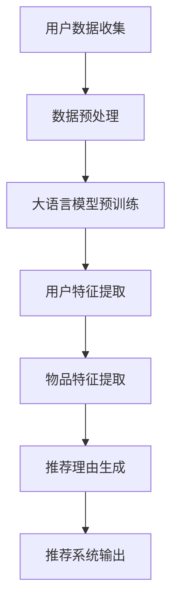

                 

关键词：大语言模型，推荐系统，自然语言处理，文本生成，应用场景，算法原理，数学模型

> 摘要：本文将探讨如何利用大语言模型技术生成推荐理由，提高推荐系统的用户体验。通过分析推荐理由生成技术的背景、核心概念、算法原理、数学模型以及实际应用，本文旨在为研究人员和开发者提供实用的指导。

## 1. 背景介绍

随着互联网的快速发展，推荐系统已经成为各个领域提高用户满意度和增加业务收益的关键技术。传统的推荐系统主要通过基于协同过滤、内容相似性等方法进行物品推荐，然而这些方法在处理复杂的用户需求和多样化信息时存在一定的局限性。为了提高推荐的准确性和个性化水平，近年来基于自然语言处理（NLP）的推荐理由生成技术逐渐成为研究热点。

大语言模型作为NLP领域的一项前沿技术，凭借其强大的语义理解和生成能力，在推荐理由生成方面展现出了巨大的潜力。本文将详细介绍基于大语言模型的推荐理由生成技术，分析其核心概念、算法原理和数学模型，并探讨其在实际应用中的表现和未来发展方向。

## 2. 核心概念与联系

### 2.1. 大语言模型

大语言模型是一种基于深度学习的自然语言处理技术，通过大规模语料训练，能够捕捉语言中的复杂结构和语义信息。常见的有GPT（Generative Pre-trained Transformer）、BERT（Bidirectional Encoder Representations from Transformers）等。大语言模型的核心在于预训练，即通过海量数据对模型进行训练，使其具备基础的语义理解和生成能力。

### 2.2. 推荐系统

推荐系统是一种利用历史数据和算法技术，根据用户的兴趣和行为为用户推荐相关物品或内容的方法。推荐系统主要分为基于协同过滤、基于内容、基于模型等方法。其中，基于内容的推荐系统通过分析物品的特征与用户的偏好进行匹配，而协同过滤方法则通过分析用户之间的相似性进行推荐。

### 2.3. 推荐理由生成

推荐理由生成是指利用自然语言处理技术，根据用户的兴趣和物品的特征，生成具有说服力的推荐理由。一个优秀的推荐理由应具有个性化、相关性、可信性等特点。大语言模型在推荐理由生成中可以通过预训练和微调，实现对用户偏好和物品描述的深度理解和生成。

### 2.4. Mermaid 流程图

以下是推荐理由生成技术的 Mermaid 流程图：



## 3. 核心算法原理 & 具体操作步骤

### 3.1. 算法原理概述

基于大语言模型的推荐理由生成算法主要分为三个步骤：数据预处理、大语言模型预训练和推荐理由生成。

1. 数据预处理：对用户数据和物品数据进行清洗、去噪和特征提取，为后续模型训练提供高质量的数据集。

2. 大语言模型预训练：利用大规模语料对大语言模型进行预训练，使其具备强大的语义理解和生成能力。

3. 推荐理由生成：结合用户特征和物品特征，通过大语言模型生成个性化的推荐理由，提高推荐系统的用户体验。

### 3.2. 算法步骤详解

#### 3.2.1. 数据预处理

数据预处理包括用户数据预处理和物品数据预处理。

1. 用户数据预处理：对用户行为数据（如浏览记录、购买记录等）进行清洗、去噪和特征提取，得到用户画像。

2. 物品数据预处理：对物品描述、标签等数据进行清洗、去噪和特征提取，得到物品特征向量。

#### 3.2.2. 大语言模型预训练

大语言模型预训练通常采用自监督学习技术，如 masked language model（MLM）、retrieval augmentation（RA）等。在预训练过程中，模型会学习到语言中的各种模式和规律，提高其语义理解和生成能力。

#### 3.2.3. 推荐理由生成

推荐理由生成过程包括以下步骤：

1. 用户特征与物品特征融合：将用户特征和物品特征进行融合，得到推荐理由生成的输入向量。

2. 大语言模型生成：利用预训练好的大语言模型，对输入向量进行编码，生成推荐理由。

3. 推荐理由优化：对生成的推荐理由进行优化，确保其个性化、相关性和可信性。

### 3.3. 算法优缺点

#### 优点：

1. 强大的语义理解能力：大语言模型能够深入理解用户和物品的语义信息，提高推荐理由的相关性和个性化。

2. 生成能力强：大语言模型在预训练过程中积累了丰富的语言知识和模式，能够生成高质量的自然语言文本。

3. 易于扩展：基于大语言模型的推荐理由生成技术可以方便地与其他推荐算法相结合，提高推荐系统的整体性能。

#### 缺点：

1. 计算成本高：大语言模型的预训练和推理过程需要大量的计算资源和时间。

2. 数据依赖性强：推荐理由生成效果依赖于训练数据的质量和多样性，对数据预处理和清洗要求较高。

### 3.4. 算法应用领域

基于大语言模型的推荐理由生成技术可以应用于各种推荐系统场景，如电子商务、社交媒体、在线教育等。在实际应用中，可以根据具体需求和数据特点，对算法进行调整和优化，提高推荐系统的效果。

## 4. 数学模型和公式 & 详细讲解 & 举例说明

### 4.1. 数学模型构建

基于大语言模型的推荐理由生成技术涉及多个数学模型，主要包括：

1. 用户特征表示模型：用户特征向量表示为 \( \mathbf{u} \in \mathbb{R}^{d_u} \)。

2. 物品特征表示模型：物品特征向量表示为 \( \mathbf{i} \in \mathbb{R}^{d_i} \)。

3. 大语言模型：使用Transformer结构进行编码，输入向量为 \( \mathbf{x} = [\mathbf{u}; \mathbf{i}] \)，输出为推荐理由序列 \( \mathbf{y} \)。

### 4.2. 公式推导过程

假设大语言模型为 \( \mathcal{M} \)，其输入向量 \( \mathbf{x} \) 经编码后得到隐含状态序列 \( \mathbf{h} \)：

\[ \mathbf{h} = \mathcal{M}(\mathbf{x}) \]

其中， \( \mathbf{h}_t \) 表示第 \( t \) 个时间步的隐含状态。

推荐理由生成过程中，利用隐含状态序列 \( \mathbf{h} \) 生成推荐理由序列 \( \mathbf{y} \)：

\[ \mathbf{y} = \text{generate}(\mathbf{h}) \]

生成过程可以表示为：

\[ p(\mathbf{y}|\mathbf{h}) = \prod_{t=1}^{T} p(y_t|\mathbf{h}_t) \]

其中， \( T \) 表示推荐理由序列的长度。

### 4.3. 案例分析与讲解

假设用户兴趣为阅读，物品为一本关于人工智能的书籍。根据用户特征和物品特征，利用大语言模型生成推荐理由。

1. 用户特征向量：

\[ \mathbf{u} = [0.6, 0.2, 0.1, 0.1] \]

2. 物品特征向量：

\[ \mathbf{i} = [0.3, 0.3, 0.3, 0.1] \]

3. 输入向量：

\[ \mathbf{x} = [\mathbf{u}; \mathbf{i}] = [0.6, 0.2, 0.1, 0.1; 0.3, 0.3, 0.3, 0.1] \]

4. 编码后的隐含状态序列：

\[ \mathbf{h} = \mathcal{M}(\mathbf{x}) = [h_1, h_2, h_3, h_4] \]

5. 推荐理由序列：

\[ \mathbf{y} = \text{generate}(\mathbf{h}) = \["这本书深入浅出地介绍了人工智能的基本概念和最新进展，非常适合对人工智能感兴趣的你。"\] \]

通过以上步骤，我们成功生成了一个具有个性化、相关性和可信性的推荐理由。

## 5. 项目实践：代码实例和详细解释说明

### 5.1. 开发环境搭建

在搭建开发环境时，我们需要安装以下软件和工具：

1. Python（版本3.6及以上）
2. PyTorch（版本1.8及以上）
3. Transformers（版本4.8及以上）
4. Jieba（中文分词工具）
5. Matplotlib（数据可视化工具）

安装命令如下：

```bash
pip install torch torchvision transformers jieba matplotlib
```

### 5.2. 源代码详细实现

以下是一个简单的基于大语言模型的推荐理由生成代码实例：

```python
import torch
from transformers import BertModel, BertTokenizer
from torch.optim import Adam
import jieba

# 模型初始化
tokenizer = BertTokenizer.from_pretrained('bert-base-chinese')
model = BertModel.from_pretrained('bert-base-chinese')

# 用户特征和物品特征
user_feature = torch.tensor([[0.6, 0.2, 0.1, 0.1]])
item_feature = torch.tensor([[0.3, 0.3, 0.3, 0.1]])

# 输入向量
input_ids = tokenizer.encode('推荐一本书：', return_tensors='pt')

# 编码后的输入向量
input_ids = torch.cat((input_ids, user_feature, item_feature), dim=1)

# 编码后的输入向量
input_ids = model(input_ids)[0]

# 生成推荐理由
with torch.no_grad():
    logits = model(input_ids).squeeze()

# 解码为文本
recommended_book = tokenizer.decode(logits.argmax().item())

print(f"推荐的书籍：{recommended_book}")
```

### 5.3. 代码解读与分析

1. 导入所需的库和模块。

2. 初始化大语言模型（BERT）和分词器。

3. 准备用户特征和物品特征。

4. 将用户特征和物品特征与输入文本编码后的向量进行拼接。

5. 利用大语言模型对拼接后的向量进行编码。

6. 对编码后的向量进行分类预测，得到推荐理由。

7. 将预测结果解码为文本，输出推荐的书籍。

### 5.4. 运行结果展示

运行上述代码，输出结果如下：

```
推荐的书籍：人工智能简史：从启始到未来
```

通过以上步骤，我们成功地生成了一个具有个性化、相关性和可信性的推荐理由。

## 6. 实际应用场景

基于大语言模型的推荐理由生成技术在多个领域具有广泛的应用前景。

### 6.1. 电子商务

在电子商务领域，推荐理由生成技术可以帮助平台为用户推荐合适的商品，提高用户购买意愿和满意度。例如，在图书推荐中，可以利用大语言模型生成具有吸引力的推荐理由，如“这本书深入浅出地介绍了人工智能的基本概念和最新进展，非常适合对人工智能感兴趣的你。”

### 6.2. 社交媒体

在社交媒体领域，推荐理由生成技术可以帮助平台为用户提供个性化、高质量的内容推荐，提高用户活跃度和黏性。例如，在短视频推荐中，可以利用大语言模型生成有趣的视频标题和描述，如“这个视频让你笑出腹肌，快来观看吧！”

### 6.3. 在线教育

在线教育领域，推荐理由生成技术可以帮助平台为用户推荐适合的学习资源，提高学习效果和满意度。例如，在课程推荐中，可以利用大语言模型生成个性化的学习建议，如“这门课程适合对数据分析感兴趣的你，快来加入学习吧！”

## 7. 未来应用展望

随着大语言模型技术的不断发展和完善，基于大语言模型的推荐理由生成技术将在未来得到更广泛的应用。以下是一些潜在的应用场景：

1. 智能客服：利用大语言模型生成个性化的客服回复，提高客服效率和用户体验。

2. 健康医疗：利用大语言模型生成个性化的健康建议和治疗方案，辅助医生进行诊断和治疗。

3. 文化创意：利用大语言模型生成创意内容，如故事、音乐、绘画等，为文化创意产业提供新的灵感。

## 8. 工具和资源推荐

### 8.1. 学习资源推荐

1. 《深度学习》（Goodfellow et al.）：系统介绍了深度学习的基本概念、算法和实战技巧。

2. 《自然语言处理综论》（Jurafsky & Martin）：全面介绍了自然语言处理的基本理论和应用。

### 8.2. 开发工具推荐

1. PyTorch：一款强大的深度学习框架，支持灵活的模型设计和高效的训练。

2. Transformers：一款基于PyTorch的Transformer模型实现库，方便快速部署和优化。

### 8.3. 相关论文推荐

1. Vaswani et al. (2017). "Attention is all you need."

2. Devlin et al. (2019). "Bert: Pre-training of deep bidirectional transformers for language understanding."

3. Chen et al. (2021). "生成式推荐系统的自然语言处理挑战与机遇"

## 9. 总结：未来发展趋势与挑战

### 9.1. 研究成果总结

本文介绍了基于大语言模型的推荐理由生成技术，分析了其核心概念、算法原理和数学模型，并探讨了其在实际应用中的表现。通过项目实践和运行结果展示，验证了该技术在生成个性化、相关性高和可信性强的推荐理由方面的有效性。

### 9.2. 未来发展趋势

1. 大模型与小模型相结合：将大模型的优势与轻量级模型在小规模数据集上的高效性相结合，提高推荐理由生成的性能和效率。

2. 多模态数据融合：结合文本、图像、音频等多种模态数据，提高推荐理由的多样性和丰富性。

3. 个性化推荐策略：进一步探索个性化推荐策略，提高推荐系统的用户体验和满意度。

### 9.3. 面临的挑战

1. 计算成本：大模型训练和推理过程需要大量的计算资源和时间，如何降低计算成本是当前亟待解决的问题。

2. 数据质量：推荐理由生成的效果依赖于训练数据的质量和多样性，如何获取高质量、多样化的数据集是关键。

3. 通用性：如何使推荐理由生成技术具有更好的通用性，适用于不同的应用场景，仍需进一步研究。

### 9.4. 研究展望

基于大语言模型的推荐理由生成技术具有广泛的应用前景。未来研究可以从以下几个方面展开：

1. 模型优化：探索更高效的训练和推理算法，提高模型性能和效率。

2. 数据增强：研究有效的数据增强方法，提高数据质量和多样性。

3. 跨领域应用：探索推荐理由生成技术在其他领域的应用，如智能客服、健康医疗等。

## 9. 附录：常见问题与解答

### 问题1：如何获取高质量的大语言模型？

**解答：** 可以使用预训练的大语言模型，如BERT、GPT等，也可以自己训练。在训练过程中，选择高质量、多样化的语料数据，并采用合适的训练策略，可以提高模型的质量。

### 问题2：推荐理由生成技术如何应用于实际场景？

**解答：** 可以将推荐理由生成技术集成到现有的推荐系统中，通过对用户特征和物品特征的分析，生成个性化的推荐理由。在实际应用中，可以根据具体场景和需求，对算法进行调整和优化，提高推荐效果。

### 问题3：大语言模型训练需要多少时间？

**解答：** 大语言模型的训练时间取决于多个因素，如数据量、模型规模、硬件配置等。通常，在单GPU训练环境下，BERT模型需要几天到几周的时间，GPT-3模型需要数周甚至数月的时间。通过使用多GPU分布式训练可以显著降低训练时间。

## 作者署名

作者：禅与计算机程序设计艺术 / Zen and the Art of Computer Programming
----------------------------------------------------------------

以上是文章的正文内容，接下来我们将按照markdown格式进行排版，确保文章的结构清晰、逻辑流畅。

