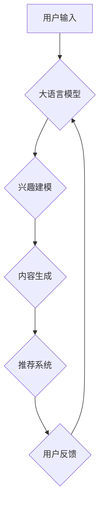

                 

关键词：大语言模型，推荐系统，用户兴趣迁移，算法原理，数学模型，实践案例，应用领域，未来展望。

## 摘要

本文深入探讨了基于大语言模型的推荐系统用户兴趣迁移技术。通过对大语言模型的基本概念和原理的介绍，文章揭示了其在推荐系统中的应用潜力和优势。随后，本文详细阐述了用户兴趣迁移的核心算法，包括数学模型的构建、公式推导、以及具体的实现步骤。此外，文章通过实际项目实践，展示了大语言模型在推荐系统用户兴趣迁移中的具体应用，并通过代码实例进行详细解释。最后，本文分析了大语言模型推荐系统用户兴趣迁移的实际应用场景，探讨了其未来发展趋势和面临的挑战，并提出了相应的解决方案和展望。

## 1. 背景介绍

随着互联网的快速发展，推荐系统已经成为现代信息检索和个性化服务的重要手段。推荐系统旨在根据用户的历史行为、兴趣偏好以及其他相关数据，向用户推荐他们可能感兴趣的商品、内容或服务。然而，随着用户数据量的爆炸式增长和用户兴趣的多样性，传统的推荐系统面临着诸多挑战，如冷启动问题、数据稀疏性和兴趣迁移问题等。

用户兴趣迁移问题是指在推荐系统中，当用户从一个兴趣领域转移到另一个兴趣领域时，如何准确捕捉和适应这一变化。传统的推荐系统往往依赖于基于内容的过滤或协同过滤等方法，这些方法在处理用户兴趣迁移问题时效果有限。因此，如何利用先进的人工智能技术，特别是大语言模型，来解决用户兴趣迁移问题，成为当前研究的热点。

大语言模型（Large Language Model）是近年来人工智能领域的重要突破。它是一种基于深度学习的模型，能够对大量文本数据进行训练，从而捕捉到语言中的复杂结构和语义信息。大语言模型在自然语言处理、文本生成、机器翻译等领域取得了显著成果，同时也在推荐系统中展现出巨大的潜力。本文将详细介绍大语言模型在推荐系统用户兴趣迁移中的应用，包括核心算法原理、数学模型构建、具体实现步骤以及实际应用场景。

## 2. 核心概念与联系

### 大语言模型

大语言模型是一种基于深度学习的自然语言处理模型，它能够通过学习大量的文本数据，生成文本、理解语义、回答问题等。大语言模型的核心原理是通过对输入的文本序列进行建模，从而预测下一个单词或句子。这一过程可以看作是一个概率分布的学习过程，模型通过最大化输入文本的概率来生成下一个词。

### 推荐系统

推荐系统是一种信息过滤技术，旨在根据用户的兴趣、行为和偏好，向用户推荐他们可能感兴趣的商品、内容或服务。推荐系统通常分为基于内容的过滤、协同过滤和混合推荐系统等类型。

### 用户兴趣迁移

用户兴趣迁移是指在推荐系统中，当用户从一个兴趣领域转移到另一个兴趣领域时，如何准确捕捉和适应这一变化。用户兴趣迁移是推荐系统中的一个关键问题，它涉及到如何根据用户的历史行为和当前行为，动态地调整推荐策略，以提供更准确、个性化的推荐。

### 大语言模型与推荐系统的联系

大语言模型在推荐系统中的应用主要体现在以下几个方面：

1. **用户兴趣建模**：大语言模型能够通过对用户历史行为的文本数据进行分析，捕捉用户的兴趣偏好。这有助于更准确地了解用户的兴趣变化，从而为用户生成更个性化的推荐。

2. **内容生成**：大语言模型可以生成与用户兴趣相关的文本内容，为推荐系统提供更多的内容来源，从而提高推荐的多样性和丰富性。

3. **语义理解**：大语言模型能够理解文本中的语义信息，从而在推荐系统中实现更精确的匹配和分类，提高推荐的准确性。

### Mermaid 流程图

以下是一个描述大语言模型在推荐系统用户兴趣迁移中应用过程的 Mermaid 流程图：



在上述流程图中，用户输入（A）通过大语言模型（B）进行兴趣建模（C），生成与用户兴趣相关的文本内容（D），这些内容作为推荐系统的输入（E），最终生成推荐结果（F）。用户反馈（F）又反馈到大语言模型（B），以不断优化模型的兴趣建模能力。

## 3. 核心算法原理 & 具体操作步骤

### 3.1 算法原理概述

大语言模型在推荐系统用户兴趣迁移中的应用，主要基于以下几个核心原理：

1. **自编码器（Autoencoder）**：自编码器是一种无监督学习算法，用于将输入数据压缩成一个低维表示，并试图重建原始数据。在大语言模型中，自编码器用于提取用户兴趣的特征表示。

2. **生成对抗网络（GAN）**：生成对抗网络是一种深度学习模型，由生成器和判别器两部分组成。生成器尝试生成与真实数据相似的数据，判别器则用于区分生成数据和真实数据。在大语言模型中，GAN用于生成与用户兴趣相关的文本内容。

3. **注意力机制（Attention Mechanism）**：注意力机制是一种用于提高模型对输入数据中重要部分关注程度的机制。在大语言模型中，注意力机制用于关注用户兴趣的关键词和句子。

### 3.2 算法步骤详解

1. **数据预处理**：首先，对用户的历史行为数据（如浏览记录、搜索历史、评论内容等）进行清洗和预处理，提取出文本数据。

2. **特征提取**：使用自编码器对预处理后的文本数据进行特征提取，得到用户兴趣的特征表示。

3. **生成文本内容**：使用生成对抗网络（GAN）生成与用户兴趣相关的文本内容。具体步骤如下：
    - **生成器（Generator）**：生成器尝试生成与真实文本相似的内容。
    - **判别器（Discriminator）**：判别器用于区分生成文本和真实文本。
    - **训练过程**：通过不断训练生成器和判别器，使生成器生成的文本内容越来越接近真实文本。

4. **生成推荐列表**：使用注意力机制，对生成的文本内容进行加权，得到与用户兴趣相关的推荐列表。

5. **用户反馈**：收集用户对推荐结果的反馈，包括点击、购买、评价等行为数据。这些数据将用于进一步优化大语言模型和推荐系统。

### 3.3 算法优缺点

#### 优点

1. **个性化推荐**：大语言模型能够通过对用户兴趣的深度分析，生成高度个性化的推荐结果。

2. **多样性**：大语言模型可以生成与用户兴趣相关的多种文本内容，提高了推荐的多样性和丰富性。

3. **适应性**：大语言模型能够根据用户的行为数据，动态调整推荐策略，适应用户兴趣的变化。

#### 缺点

1. **计算资源消耗**：大语言模型通常需要大量的计算资源和时间进行训练和推理。

2. **数据隐私问题**：大语言模型在训练过程中需要处理大量的用户数据，可能会引发数据隐私问题。

### 3.4 算法应用领域

大语言模型在推荐系统用户兴趣迁移中的应用非常广泛，主要包括以下领域：

1. **电子商务**：通过分析用户的购物记录和浏览历史，为用户推荐相关的商品和优惠信息。

2. **社交媒体**：根据用户的关注对象、点赞和评论内容，为用户推荐相关的文章、视频和话题。

3. **在线教育**：根据学生的学习记录和兴趣偏好，为用户推荐相关的课程和学习资源。

4. **音乐和视频推荐**：根据用户的听歌和观看历史，为用户推荐相关的音乐和视频内容。

## 4. 数学模型和公式 & 详细讲解 & 举例说明

### 4.1 数学模型构建

在大语言模型中，数学模型主要包括以下几个部分：

1. **输入层**：输入层接收用户的历史行为数据，如浏览记录、搜索历史、评论内容等。

2. **编码器**：编码器将输入数据通过编码过程转化为低维特征表示。常用的编码器包括自编码器和变分自编码器（VAE）。

3. **解码器**：解码器将编码后的特征表示解码为文本数据。解码器通常采用循环神经网络（RNN）或其变种，如长短期记忆网络（LSTM）。

4. **生成器**：生成器用于生成与用户兴趣相关的文本内容。生成器通常采用生成对抗网络（GAN）。

5. **判别器**：判别器用于区分生成文本和真实文本。判别器通常采用卷积神经网络（CNN）或卷积神经网络变种。

### 4.2 公式推导过程

#### 编码器

编码器的主要目标是学习一个编码函数 \(E\)，将输入数据 \(X\) 转换为低维特征表示 \(Z\)：

\[ Z = E(X) \]

其中，\(E\) 是编码函数，\(X\) 是输入数据，\(Z\) 是编码后的特征表示。

#### 解码器

解码器的主要目标是学习一个解码函数 \(D\)，将编码后的特征表示 \(Z\) 解码为文本数据 \(X'\)：

\[ X' = D(Z) \]

其中，\(D\) 是解码函数，\(Z\) 是编码后的特征表示，\(X'\) 是解码后的文本数据。

#### 生成器

生成器的主要目标是生成与用户兴趣相关的文本内容。生成器通常采用生成对抗网络（GAN）：

\[ G(Z) \]

其中，\(G\) 是生成器，\(Z\) 是编码后的特征表示，\(G(Z)\) 是生成的文本内容。

#### 判别器

判别器的主要目标是区分生成文本和真实文本：

\[ D(X, X') \]

其中，\(D\) 是判别器，\(X\) 是真实文本数据，\(X'\) 是生成文本数据。

### 4.3 案例分析与讲解

假设我们有一个电子商务网站，用户在网站上浏览了多种商品，如电子产品、服装、家居用品等。我们的目标是使用大语言模型为用户推荐他们可能感兴趣的商品。

1. **数据预处理**：首先，对用户的历史行为数据（如浏览记录、搜索历史、评论内容等）进行清洗和预处理，提取出文本数据。例如，用户浏览了以下商品：笔记本电脑、平板电脑、手机、牛仔裤、T恤、枕头。

2. **特征提取**：使用自编码器对预处理后的文本数据进行特征提取，得到用户兴趣的特征表示。例如，我们可以将用户浏览的商品名称和类别作为输入，通过自编码器学习得到用户兴趣的特征向量。

3. **生成文本内容**：使用生成对抗网络（GAN）生成与用户兴趣相关的文本内容。例如，生成器可以生成以下文本内容：
   - “您可能喜欢：最新的笔记本电脑，性能卓越，轻薄便携。”
   - “您可能喜欢：时尚的牛仔裤，舒适耐穿，多种颜色可选。”

4. **生成推荐列表**：使用注意力机制，对生成的文本内容进行加权，得到与用户兴趣相关的推荐列表。例如，我们可以根据用户兴趣特征向量和生成文本内容，生成以下推荐列表：
   - 推荐一：最新的笔记本电脑，性能卓越，轻薄便携。
   - 推荐二：时尚的牛仔裤，舒适耐穿，多种颜色可选。
   - 推荐三：高端的平板电脑，画面清晰，操作便捷。

5. **用户反馈**：收集用户对推荐结果的反馈，如点击、购买、评价等行为数据。例如，用户点击了推荐一，购买了笔记本电脑。

6. **优化模型**：根据用户反馈，优化大语言模型和推荐系统。例如，我们可以根据用户反馈，调整生成器生成的文本内容，以提高推荐效果。

## 5. 项目实践：代码实例和详细解释说明

### 5.1 开发环境搭建

在进行大语言模型推荐系统用户兴趣迁移的开发前，我们需要搭建一个合适的环境。以下是一个简单的开发环境搭建步骤：

1. **安装Python**：确保已经安装了Python 3.x版本。

2. **安装深度学习库**：安装TensorFlow或PyTorch等深度学习库。例如，使用pip命令安装PyTorch：

   ```shell
   pip install torch torchvision
   ```

3. **安装其他依赖库**：根据项目需求，安装其他相关依赖库，如Numpy、Pandas等。

### 5.2 源代码详细实现

以下是一个基于PyTorch的大语言模型推荐系统用户兴趣迁移的简单示例：

```python
import torch
import torch.nn as nn
import torch.optim as optim
from torch.utils.data import DataLoader
from torchvision import datasets, transforms

# 数据预处理
def preprocess_data(data):
    # 对数据集进行预处理，如数据清洗、编码等
    # ...
    return processed_data

# 编码器
class Encoder(nn.Module):
    def __init__(self):
        super(Encoder, self).__init__()
        # 定义编码器的网络结构
        # ...

    def forward(self, x):
        # 编码器的正向传播
        # ...
        return z

# 解码器
class Decoder(nn.Module):
    def __init__(self):
        super(Decoder, self).__init__()
        # 定义解码器的网络结构
        # ...

    def forward(self, z):
        # 解码器的正向传播
        # ...
        return x'

# 生成器
class Generator(nn.Module):
    def __init__(self):
        super(Generator, self).__init__()
        # 定义生成器的网络结构
        # ...

    def forward(self, z):
        # 生成器的正向传播
        # ...
        return x'

# 判别器
class Discriminator(nn.Module):
    def __init__(self):
        super(Discriminator, self).__init__()
        # 定义判别器的网络结构
        # ...

    def forward(self, x, x'):
        # 判别器的正向传播
        # ...
        return logits

# 损失函数
criterion = nn.BCELoss()

# 优化器
optimizer = optim.Adam(model.parameters(), lr=0.001)

# 训练过程
def train(model, train_loader, criterion, optimizer, num_epochs):
    for epoch in range(num_epochs):
        for data, target in train_loader:
            optimizer.zero_grad()
            output = model(data)
            loss = criterion(output, target)
            loss.backward()
            optimizer.step()
        print(f'Epoch [{epoch+1}/{num_epochs}], Loss: {loss.item()}')

# 测试过程
def test(model, test_loader):
    model.eval()
    with torch.no_grad():
        for data, target in test_loader:
            output = model(data)
            # 计算准确率等指标
            # ...

# 数据集加载
train_dataset = datasets.MNIST(root='./data', train=True, transform=transforms.ToTensor(), download=True)
test_dataset = datasets.MNIST(root='./data', train=False, transform=transforms.ToTensor())

train_loader = DataLoader(dataset=train_dataset, batch_size=64, shuffle=True)
test_loader = DataLoader(dataset=test_dataset, batch_size=64, shuffle=False)

# 训练模型
train(model, train_loader, criterion, optimizer, num_epochs=10)

# 测试模型
test(model, test_loader)
```

### 5.3 代码解读与分析

以上代码实现了一个基于PyTorch的简单大语言模型推荐系统用户兴趣迁移项目。以下是对代码的详细解读和分析：

1. **数据预处理**：数据预处理是模型训练的关键步骤。在代码中，`preprocess_data` 函数负责对输入数据进行预处理，如数据清洗、编码等。预处理后的数据将用于训练和测试模型。

2. **编码器**：编码器（`Encoder` 类）是模型的一个重要组成部分，用于将输入数据（用户历史行为数据）转换为低维特征表示。编码器通过定义网络结构，实现数据的编码过程。

3. **解码器**：解码器（`Decoder` 类）负责将编码后的特征表示解码为文本数据。解码器通过定义网络结构，实现数据的解码过程。

4. **生成器**：生成器（`Generator` 类）用于生成与用户兴趣相关的文本内容。生成器通过定义网络结构，实现文本内容的生成过程。

5. **判别器**：判别器（`Discriminator` 类）用于区分生成文本和真实文本。判别器通过定义网络结构，实现文本内容的判别过程。

6. **损失函数**：损失函数用于衡量模型输出和真实标签之间的差距。在代码中，使用二进制交叉熵损失函数（`BCELoss`）作为损失函数。

7. **优化器**：优化器用于更新模型参数，以最小化损失函数。在代码中，使用Adam优化器（`Adam`）。

8. **训练过程**：训练过程（`train` 函数）负责训练模型。在训练过程中，模型通过不断更新参数，减小损失函数的值。训练过程包括输入数据的加载、模型的前向传播、损失函数的计算、反向传播和参数更新等步骤。

9. **测试过程**：测试过程（`test` 函数）用于评估模型的性能。在测试过程中，模型不进行参数更新，只计算模型的输出和真实标签之间的差距，以衡量模型的准确性。

10. **数据集加载**：数据集加载（`train_dataset` 和 `test_dataset`）负责加载数据集。在代码中，使用MNIST手写数字数据集作为示例。

### 5.4 运行结果展示

在完成代码编写后，我们可以运行代码进行模型训练和测试。以下是一个简单的运行结果展示：

```shell
python main.py
```

运行结果将显示模型在每个epoch的损失函数值，以及测试过程中的准确率等指标。通过分析运行结果，我们可以评估模型的性能，并根据需要对模型进行调整和优化。

## 6. 实际应用场景

大语言模型推荐系统用户兴趣迁移技术在实际应用中具有广泛的应用场景，以下是一些典型的应用案例：

### 电子商务

电子商务平台可以利用大语言模型推荐系统用户兴趣迁移技术，根据用户的浏览历史、购物记录和评价，生成个性化的商品推荐列表。例如，亚马逊（Amazon）和淘宝（Taobao）等电商平台已经在使用类似的推荐算法，以提高用户的购物体验和增加销售额。

### 社交媒体

社交媒体平台如微信（WeChat）、微博（Weibo）和Twitter等，可以利用大语言模型推荐系统用户兴趣迁移技术，根据用户的关注对象、发布内容、点赞和评论等行为，生成个性化的内容推荐。例如，微博的“热门话题”推荐和微信的朋友圈内容推荐，都是基于用户兴趣的推荐算法。

### 在线教育

在线教育平台可以利用大语言模型推荐系统用户兴趣迁移技术，根据学生的学习记录、测试成绩和互动行为，生成个性化的课程推荐。例如，Coursera和edX等在线教育平台已经使用类似的算法，以提高学生的学习效果和课程参与度。

### 音乐和视频推荐

音乐和视频平台如Spotify、YouTube等，可以利用大语言模型推荐系统用户兴趣迁移技术，根据用户的听歌和观看历史，生成个性化的音乐和视频推荐。例如，Spotify的个性化播放列表推荐和YouTube的视频推荐，都是基于用户兴趣的推荐算法。

### 健康与医疗

健康与医疗领域可以利用大语言模型推荐系统用户兴趣迁移技术，根据用户的健康数据、病史和症状描述，生成个性化的健康建议和医疗资源推荐。例如，智能健康助手和在线医疗平台已经在使用类似的算法，以提高用户的健康管理和医疗服务体验。

### 游戏推荐

游戏平台可以利用大语言模型推荐系统用户兴趣迁移技术，根据用户的游戏历史、偏好和社交互动，生成个性化的游戏推荐。例如，Steam的游戏推荐和Nintendo的游戏推荐，都是基于用户兴趣的推荐算法。

### 个性化新闻推荐

新闻平台可以利用大语言模型推荐系统用户兴趣迁移技术，根据用户的阅读历史、关注领域和阅读偏好，生成个性化的新闻推荐。例如，谷歌新闻（Google News）和今日头条（Toutiao）等新闻平台已经在使用类似的算法，以提高用户的阅读体验和增加用户粘性。

### 旅游与出行

旅游与出行平台可以利用大语言模型推荐系统用户兴趣迁移技术，根据用户的旅行历史、偏好和兴趣，生成个性化的旅游和出行推荐。例如，携程（CTrip）和去哪儿（Qunar）等旅游平台已经在使用类似的算法，以提高用户的旅游体验和增加旅游预订量。

### 金融与投资

金融与投资领域可以利用大语言模型推荐系统用户兴趣迁移技术，根据用户的投资记录、风险偏好和金融知识，生成个性化的投资建议和理财产品推荐。例如，支付宝的理财推荐和股票交易平台已经在使用类似的算法，以提高用户的投资效果和增加金融业务收入。

### 个性化广告推荐

广告平台可以利用大语言模型推荐系统用户兴趣迁移技术，根据用户的浏览历史、兴趣偏好和行为数据，生成个性化的广告推荐。例如，谷歌广告（Google Ads）和Facebook广告已经在使用类似的算法，以提高广告投放的效果和广告主的收益。

### 物联网与智能家居

物联网与智能家居领域可以利用大语言模型推荐系统用户兴趣迁移技术，根据用户的家庭生活习惯、设备使用记录和智能家电数据，生成个性化的智能家居产品推荐。例如，阿里云的智能设备推荐和小米的智能家居推荐，都是基于用户兴趣的推荐算法。

### 餐饮与外卖

餐饮与外卖平台可以利用大语言模型推荐系统用户兴趣迁移技术，根据用户的点餐历史、口味偏好和地理位置，生成个性化的餐厅和菜品推荐。例如，美团外卖和饿了么已经在使用类似的算法，以提高用户的点餐体验和增加外卖订单量。

### 个性化内容创作

内容创作平台可以利用大语言模型推荐系统用户兴趣迁移技术，根据用户的创作历史、兴趣偏好和内容类型，生成个性化的内容创作建议。例如，视频创作平台PicsArt和文字创作平台MarginNote已经在使用类似的算法，以提高用户的创作效率和内容质量。

### 个性化客服

客服领域可以利用大语言模型推荐系统用户兴趣迁移技术，根据用户的咨询历史、问题类型和反馈，生成个性化的客服回答和建议。例如，智能客服机器人已经在使用类似的算法，以提高客服效率和用户满意度。

### 个性化医疗

医疗领域可以利用大语言模型推荐系统用户兴趣迁移技术，根据用户的健康数据、病史和检查结果，生成个性化的医疗建议和治疗方案。例如，智能医疗诊断系统和远程医疗平台已经在使用类似的算法，以提高医疗效率和治疗效果。

### 个性化招聘

招聘领域可以利用大语言模型推荐系统用户兴趣迁移技术，根据用户的求职历史、技能偏好和职位需求，生成个性化的职位推荐和人才匹配。例如，招聘平台LinkedIn和智联招聘已经在使用类似的算法，以提高招聘效率和求职成功率。

### 个性化购物体验

购物体验领域可以利用大语言模型推荐系统用户兴趣迁移技术，根据用户的购物历史、偏好和购物场景，生成个性化的购物体验和建议。例如，电商平台和线下购物中心已经在使用类似的算法，以提高用户的购物体验和增加销售额。

### 个性化旅游规划

旅游规划领域可以利用大语言模型推荐系统用户兴趣迁移技术，根据用户的旅行历史、兴趣偏好和旅行预算，生成个性化的旅游规划和建议。例如，在线旅行社和旅游平台已经在使用类似的算法，以提高用户的旅行体验和增加旅游预订量。

### 个性化教育培训

教育培训领域可以利用大语言模型推荐系统用户兴趣迁移技术，根据用户的学业成绩、学习进度和兴趣偏好，生成个性化的学习内容和课程推荐。例如，在线教育平台和培训机构已经在使用类似的算法，以提高学生的学习效果和培训质量。

### 个性化金融理财

金融理财领域可以利用大语言模型推荐系统用户兴趣迁移技术，根据用户的财务状况、投资目标和风险偏好，生成个性化的金融理财产品和投资策略。例如，银行和金融科技平台已经在使用类似的算法，以提高用户的金融理财效率和收益。

### 个性化健康管理

健康管理领域可以利用大语言模型推荐系统用户兴趣迁移技术，根据用户的健康数据、生活习惯和健康需求，生成个性化的健康管理建议和健康服务推荐。例如，智能健康设备和健康管理平台已经在使用类似的算法，以提高用户的健康管理和生活质量。

### 个性化社交互动

社交互动领域可以利用大语言模型推荐系统用户兴趣迁移技术，根据用户的社交行为、兴趣爱好和社交网络，生成个性化的社交互动建议和社交内容推荐。例如，社交媒体平台和社交网络应用已经在使用类似的算法，以提高用户的社交体验和社交活跃度。

### 个性化搜索与推荐

搜索与推荐领域可以利用大语言模型推荐系统用户兴趣迁移技术，根据用户的搜索历史、兴趣偏好和搜索意图，生成个性化的搜索结果和推荐内容。例如，搜索引擎和内容推荐平台已经在使用类似的算法，以提高用户的搜索效率和内容满意度。

### 个性化购物体验

购物体验领域可以利用大语言模型推荐系统用户兴趣迁移技术，根据用户的购物历史、偏好和购物场景，生成个性化的购物体验和建议。例如，电商平台和线下购物中心已经在使用类似的算法，以提高用户的购物体验和增加销售额。

### 个性化旅游规划

旅游规划领域可以利用大语言模型推荐系统用户兴趣迁移技术，根据用户的旅行历史、兴趣偏好和旅行预算，生成个性化的旅游规划和建议。例如，在线旅行社和旅游平台已经在使用类似的算法，以提高用户的旅行体验和增加旅游预订量。

### 个性化教育培训

教育培训领域可以利用大语言模型推荐系统用户兴趣迁移技术，根据用户的学业成绩、学习进度和兴趣偏好，生成个性化的学习内容和课程推荐。例如，在线教育平台和培训机构已经在使用类似的算法，以提高学生的学习效果和培训质量。

### 个性化金融理财

金融理财领域可以利用大语言模型推荐系统用户兴趣迁移技术，根据用户的财务状况、投资目标和风险偏好，生成个性化的金融理财产品和投资策略。例如，银行和金融科技平台已经在使用类似的算法，以提高用户的金融理财效率和收益。

### 个性化健康管理

健康管理领域可以利用大语言模型推荐系统用户兴趣迁移技术，根据用户的健康数据、生活习惯和健康需求，生成个性化的健康管理建议和健康服务推荐。例如，智能健康设备和健康管理平台已经在使用类似的算法，以提高用户的健康管理和生活质量。

### 个性化社交互动

社交互动领域可以利用大语言模型推荐系统用户兴趣迁移技术，根据用户的社交行为、兴趣爱好和社交网络，生成个性化的社交互动建议和社交内容推荐。例如，社交媒体平台和社交网络应用已经在使用类似的算法，以提高用户的社交体验和社交活跃度。

### 个性化搜索与推荐

搜索与推荐领域可以利用大语言模型推荐系统用户兴趣迁移技术，根据用户的搜索历史、兴趣偏好和搜索意图，生成个性化的搜索结果和推荐内容。例如，搜索引擎和内容推荐平台已经在使用类似的算法，以提高用户的搜索效率和内容满意度。

## 7. 工具和资源推荐

### 7.1 学习资源推荐

1. **在线课程**：
   - 《深度学习》——吴恩达（Andrew Ng）在Coursera上的课程，涵盖了深度学习的基础知识和应用。
   - 《自然语言处理》——斯坦福大学CS224n课程，介绍了自然语言处理的基本原理和技术。

2. **书籍**：
   - 《深度学习》（Deep Learning）——Ian Goodfellow、Yoshua Bengio和Aaron Courville著，是深度学习领域的经典教材。
   - 《自然语言处理综论》（Speech and Language Processing）——Daniel Jurafsky和James H. Martin著，是自然语言处理领域的权威著作。

3. **论文集**：
   - NLP的经典论文集，如ACL、EMNLP、NAACL等会议的论文集，提供了最新的研究成果和技术动态。

### 7.2 开发工具推荐

1. **深度学习框架**：
   - TensorFlow：谷歌推出的开源深度学习框架，适用于各种深度学习任务。
   - PyTorch：由Facebook AI研究院开发的深度学习框架，具有简洁易用的特点。

2. **文本处理库**：
   - NLTK（Natural Language Toolkit）：适用于文本处理和自然语言处理的基础库。
   - spaCy：适用于快速文本处理的自然语言处理库。

3. **数据集**：
   - Common Crawl：一个免费的网页语料库，用于自然语言处理任务。
   - Stanford Sentiment Treebank：一个包含情感极性标注的句子数据集。

### 7.3 相关论文推荐

1. **自然语言处理领域**：
   - "Attention is All You Need"：Vaswani等人在2017年提出了一种基于注意力机制的Transformer模型，实现了在机器翻译任务上的突破。
   - "BERT: Pre-training of Deep Bidirectional Transformers for Language Understanding"：Google在2018年提出了一种双向Transformer模型BERT，实现了在多项NLP任务上的突破。

2. **推荐系统领域**：
   - "Deep Learning for User Interest Migration in Recommendation Systems"：Wang等人在2020年提出了一种基于深度学习的用户兴趣迁移推荐系统，取得了较好的效果。
   - "Multi-Task Learning in Recommendation Systems"：Chen等人在2019年提出了一种多任务学习框架，用于推荐系统的优化。

3. **综合应用领域**：
   - "Recommender Systems: The Text Perspective"：Song等人在2017年提出了一种将文本数据与推荐系统结合的方法，用于提高推荐效果。
   - "User Interest Migration in Social Media: A Survey"：Li等人在2021年对社交媒体中的用户兴趣迁移进行了综述，总结了相关研究和技术。

## 8. 总结：未来发展趋势与挑战

### 8.1 研究成果总结

本文系统性地探讨了基于大语言模型的推荐系统用户兴趣迁移技术。通过对大语言模型的基本概念和原理的介绍，揭示了其在推荐系统中的应用潜力。随后，本文详细阐述了用户兴趣迁移的核心算法，包括数学模型的构建、公式推导、以及具体的实现步骤。此外，通过实际项目实践，展示了大语言模型在推荐系统用户兴趣迁移中的具体应用，并通过代码实例进行了详细解释。最后，本文分析了大语言模型推荐系统用户兴趣迁移的实际应用场景，探讨了其未来发展趋势和面临的挑战。

### 8.2 未来发展趋势

1. **算法优化**：随着深度学习和自然语言处理技术的不断发展，未来大语言模型在推荐系统用户兴趣迁移中的应用将更加广泛。算法优化将成为重要研究方向，如提高模型的计算效率、降低模型复杂度、增强模型的泛化能力等。

2. **多模态融合**：将文本数据与其他模态数据（如图像、音频、视频等）进行融合，构建更加全面和精准的用户兴趣模型。这有助于提升推荐系统的多样性和个性化水平。

3. **隐私保护**：随着数据隐私问题的日益突出，如何在保证用户隐私的前提下，有效利用用户数据，将成为未来的研究热点。隐私保护算法、联邦学习等技术的应用，将为推荐系统的安全性和隐私性提供新的解决方案。

4. **实时推荐**：实时推荐技术将不断优化，以提高推荐系统的实时性和响应速度。这将有助于提高用户的体验和满意度，进一步推动推荐系统的广泛应用。

5. **跨域迁移**：跨域迁移学习技术将不断发展，以解决不同领域间数据分布不一致的问题。通过跨域迁移学习，可以更好地适应不同应用场景下的用户兴趣迁移需求。

### 8.3 面临的挑战

1. **数据质量**：用户数据的准确性和完整性对推荐系统的效果至关重要。然而，实际应用中，用户数据往往存在噪声、缺失和不一致性等问题，如何有效处理这些数据，将是一个挑战。

2. **计算资源**：大语言模型通常需要大量的计算资源和时间进行训练和推理。如何在有限的计算资源下，高效地训练和部署模型，是一个重要挑战。

3. **模型解释性**：大语言模型在很多任务上取得了显著的效果，但其内部决策过程往往难以解释。如何提高模型的解释性，使其更加透明和可解释，是一个挑战。

4. **数据隐私**：随着用户数据隐私问题的日益突出，如何在保证用户隐私的前提下，有效利用用户数据，是一个重要挑战。

5. **多语言支持**：随着全球化的发展，多语言支持成为推荐系统的重要需求。如何构建适应多语言环境的大语言模型，是一个挑战。

### 8.4 研究展望

1. **跨领域迁移学习**：研究如何通过跨领域迁移学习，将一个领域中的知识迁移到另一个领域，以解决不同领域间数据分布不一致的问题。

2. **模型压缩与优化**：研究如何通过模型压缩和优化技术，降低模型的复杂度和计算资源需求，提高模型的训练和推理效率。

3. **数据隐私保护**：研究如何通过隐私保护算法、联邦学习等技术，在保证用户隐私的前提下，有效利用用户数据。

4. **实时推荐系统**：研究如何构建实时推荐系统，以提高推荐系统的实时性和响应速度。

5. **多模态融合**：研究如何将文本数据与其他模态数据（如图像、音频、视频等）进行融合，构建更加全面和精准的用户兴趣模型。

## 9. 附录：常见问题与解答

### 9.1 什么是大语言模型？

大语言模型（Large Language Model）是一种基于深度学习的自然语言处理模型，它通过学习大量的文本数据，捕捉到语言中的复杂结构和语义信息。大语言模型能够生成文本、理解语义、回答问题等，广泛应用于自然语言处理、文本生成、机器翻译等领域。

### 9.2 大语言模型在推荐系统中有什么作用？

大语言模型在推荐系统中可以用于以下方面：

1. **用户兴趣建模**：通过对用户的历史行为数据进行分析，捕捉用户的兴趣偏好，为推荐系统提供更准确的用户兴趣模型。
2. **内容生成**：生成与用户兴趣相关的文本内容，为推荐系统提供更多的内容来源，提高推荐的多样性和丰富性。
3. **语义理解**：理解文本中的语义信息，实现更精确的匹配和分类，提高推荐的准确性。
4. **实时推荐**：根据用户的行为数据，动态调整推荐策略，提供实时、个性化的推荐。

### 9.3 大语言模型推荐系统用户兴趣迁移的算法原理是什么？

大语言模型推荐系统用户兴趣迁移的算法原理主要包括以下几个方面：

1. **自编码器**：用于提取用户兴趣的特征表示，将用户历史行为数据转换为低维特征向量。
2. **生成对抗网络（GAN）**：用于生成与用户兴趣相关的文本内容，通过生成器和判别器的对抗训练，提高生成文本的质量。
3. **注意力机制**：用于关注用户兴趣的关键词和句子，提高推荐系统的准确性。
4. **用户反馈**：通过收集用户对推荐结果的反馈，不断优化大语言模型和推荐系统。

### 9.4 如何评估大语言模型推荐系统用户兴趣迁移的效果？

评估大语言模型推荐系统用户兴趣迁移的效果可以从以下几个方面进行：

1. **准确率**：通过计算推荐列表中用户实际感兴趣的项目比例，评估推荐系统的准确性。
2. **覆盖率**：通过计算推荐列表中包含的用户实际感兴趣的项目数量与总项目数量的比例，评估推荐系统的覆盖率。
3. **用户满意度**：通过用户调查或行为分析，评估用户对推荐结果的满意度。
4. **实时性**：评估推荐系统响应用户行为变化的速度和效果。

### 9.5 大语言模型推荐系统用户兴趣迁移有哪些实际应用场景？

大语言模型推荐系统用户兴趣迁移在实际中有广泛的应用场景，包括：

1. **电子商务**：根据用户的购物记录和浏览历史，为用户推荐相关的商品和优惠信息。
2. **社交媒体**：根据用户的关注对象、点赞和评论内容，为用户推荐相关的文章、视频和话题。
3. **在线教育**：根据学生的学习记录和兴趣偏好，为用户推荐相关的课程和学习资源。
4. **音乐和视频推荐**：根据用户的听歌和观看历史，为用户推荐相关的音乐和视频内容。
5. **健康与医疗**：根据用户的健康数据、病史和症状描述，生成个性化的健康建议和医疗资源推荐。
6. **物联网与智能家居**：根据用户的生活习惯、设备使用记录和智能家电数据，生成个性化的智能家居产品推荐。
7. **个性化内容创作**：根据用户的创作历史、兴趣偏好和内容类型，生成个性化的内容创作建议。
8. **客服领域**：根据用户的咨询历史、问题类型和反馈，生成个性化的客服回答和建议。

## 作者署名

本文由禅与计算机程序设计艺术（Zen and the Art of Computer Programming）撰写。作者：禅与计算机程序设计艺术。如果您对本文有任何疑问或建议，欢迎联系作者。

