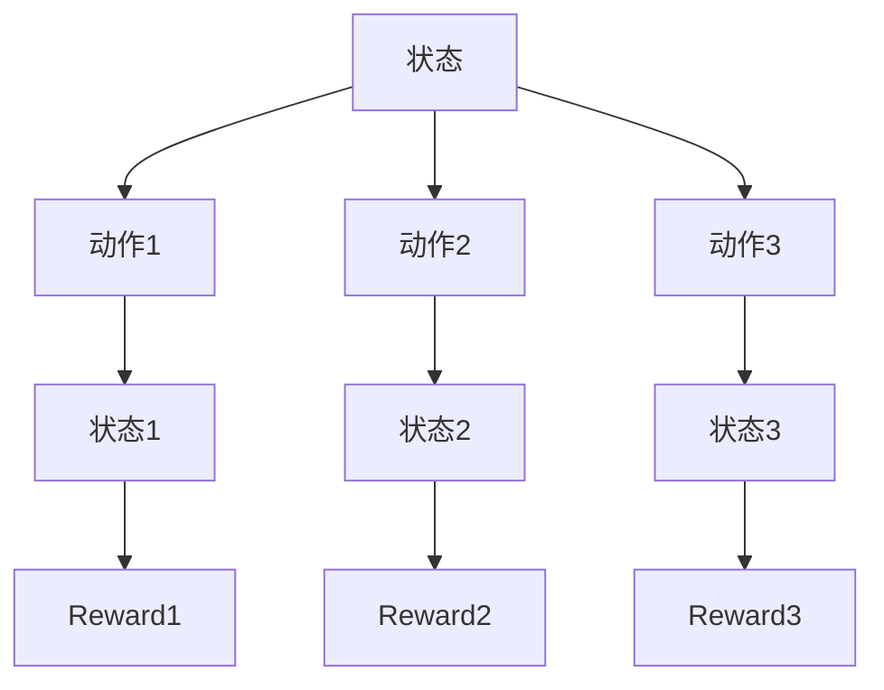

                 

关键词：强化学习、捆绑销售、策略优化、马尔可夫决策过程、Q-Learning、深度Q网络（DQN）、策略梯度算法、应用场景、案例分析。

## 摘要

随着市场竞争的日益激烈，企业越来越注重销售策略的优化。其中，捆绑销售策略是一种常用的促销手段，通过将多种产品组合成一组销售，可以提高销售额和客户忠诚度。然而，如何制定有效的捆绑销售策略，以最大化企业收益，成为了一个具有挑战性的问题。本文将介绍一种基于强化学习的捆绑销售策略优化方法，通过模拟现实场景中的交易过程，利用强化学习算法来寻找最优策略。本文将首先介绍强化学习的基本原理，然后详细解释捆绑销售策略优化的问题背景、核心算法原理、数学模型以及实际应用案例，最后对未来的发展趋势与挑战进行展望。

## 1. 背景介绍

### 捆绑销售策略的基本概念

捆绑销售策略是指企业将两种或多种产品组合在一起进行销售，以提供价格优惠或附加服务。这种策略旨在通过提高产品的吸引力，促进客户的购买意愿，从而提高销售额。常见的捆绑销售形式包括“买一送一”、“组合优惠”、“套餐销售”等。例如，一家电器商店可能将电视机和音响系统组合在一起销售，以吸引那些需要购买整套影音设备的顾客。

### 捆绑销售策略的现状与挑战

捆绑销售策略在许多行业中都得到了广泛应用，但如何在具体实施中达到预期效果，仍是一个需要深入研究的问题。当前，企业在制定捆绑销售策略时，往往依赖于经验或简单的规则，这可能会导致以下挑战：

1. **收益最大化**：如何确定最优的捆绑组合和价格，以最大化企业的总收益？
2. **市场动态**：市场需求和竞争对手策略的变化，如何及时调整捆绑销售策略？
3. **客户偏好**：不同客户对产品组合和价格的偏好差异，如何进行个性化推荐？
4. **库存管理**：如何平衡产品库存，避免库存积压或短缺的问题？

### 强化学习在捆绑销售策略优化中的应用

强化学习是一种通过试错来学习最优策略的机器学习方法。它通过在环境中不断进行试验和反馈，逐步优化决策过程，从而实现目标。将强化学习应用于捆绑销售策略优化，可以在复杂的市场环境中，自动发现最优的捆绑组合和价格策略。

本文将介绍一种基于强化学习的捆绑销售策略优化方法，通过模拟实际销售过程，利用强化学习算法来寻找最优策略，从而解决上述挑战。

## 2. 核心概念与联系

### 强化学习原理

强化学习（Reinforcement Learning，简称RL）是一种机器学习方法，通过奖励机制和试错来学习最优策略。其核心概念包括：

- **状态（State）**：描述系统当前的状态，例如库存水平、市场需求等。
- **动作（Action）**：在给定状态下，采取的行动，例如选择哪种捆绑组合和价格。
- **奖励（Reward）**：系统对每个动作的反馈信号，用于评估动作的好坏。
- **策略（Policy）**：从状态到动作的映射，即如何做出决策。

强化学习算法通过在环境中不断试错，积累经验，逐渐优化策略，以实现最大化累积奖励的目标。

### 马尔可夫决策过程（MDP）

马尔可夫决策过程（Markov Decision Process，简称MDP）是一种用于描述强化学习问题的一般框架。它由以下部分组成：

- **状态空间（S）**：系统可能的所有状态。
- **动作空间（A）**：可采取的所有动作。
- **奖励函数（R）**：在给定状态和动作下的即时奖励。
- **转移概率（P）**：从当前状态转移到下一个状态的概率分布。

MDP的核心特性是状态转移的马尔可夫性，即当前状态只依赖于先前的状态，与先前的动作无关。

### Mermaid 流程图



### 强化学习算法与捆绑销售策略优化

在捆绑销售策略优化中，状态空间可以表示为当前库存水平、市场需求等因素的组合，动作空间包括不同的捆绑组合和价格策略。通过模拟销售过程，利用强化学习算法来寻找最优的捆绑销售策略。

## 3. 核心算法原理 & 具体操作步骤

### 3.1 算法原理概述

强化学习算法通过在环境中进行试验和反馈，逐步优化策略。常见的强化学习算法包括Q-Learning、深度Q网络（DQN）、策略梯度算法等。本文将介绍Q-Learning算法的基本原理和操作步骤。

### 3.2 算法步骤详解

#### 3.2.1 初始化

1. 初始化状态空间S、动作空间A、奖励函数R和策略π。
2. 初始化Q值表Q(s, a)，用于存储状态-动作对的预期奖励。

#### 3.2.2 选择动作

1. 在给定状态下，根据当前策略π选择动作a。
2. 对于ε-贪心策略，以ε的概率随机选择动作，以（1-ε）的概率选择最优动作。

#### 3.2.3 执行动作

1. 在环境中执行动作a，获得状态转移s'和即时奖励r。
2. 根据转移概率P(s', r|s, a)更新状态。

#### 3.2.4 更新Q值

1. 更新Q值表Q(s, a)：
$$
Q(s, a) \leftarrow Q(s, a) + \alpha [r + \gamma \max_{a'} Q(s', a') - Q(s, a)]
$$
其中，α为学习率，γ为折扣因子。

#### 3.2.5 更新策略

1. 根据更新后的Q值表，调整策略π，使策略逐渐接近最优策略。

### 3.3 算法优缺点

#### 优点

1. 自动化：强化学习算法可以自动寻找最优策略，无需手动设定规则。
2. 灵活性：适用于复杂动态环境，能够适应市场需求和竞争对手策略的变化。
3. 个性化：通过学习客户偏好，实现个性化推荐。

#### 缺点

1. 计算复杂度：在状态和动作空间较大时，计算复杂度较高。
2. 收敛速度：在某些情况下，算法可能需要较长时间才能收敛到最优策略。

### 3.4 算法应用领域

强化学习在捆绑销售策略优化中的应用非常广泛，不仅适用于传统零售行业，还可以应用于在线电商、金融、物流等领域。通过优化捆绑销售策略，企业可以更好地满足客户需求，提高销售额和市场份额。

## 4. 数学模型和公式

### 4.1 数学模型构建

捆绑销售策略优化问题可以表示为马尔可夫决策过程（MDP），其数学模型如下：

- **状态空间（S）**：$S = \{s_1, s_2, ..., s_n\}$，其中 $s_i$ 表示当前库存水平、市场需求等因素。
- **动作空间（A）**：$A = \{a_1, a_2, ..., a_m\}$，其中 $a_j$ 表示不同的捆绑组合和价格策略。
- **奖励函数（R）**：$R(s, a) = r(s, a)$，表示在状态 $s$ 下采取动作 $a$ 的即时奖励。
- **转移概率（P）**：$P(s', r|s, a) = p(s', r|s, a)$，表示在状态 $s$ 下采取动作 $a$ 后，转移到状态 $s'$ 并获得奖励 $r$ 的概率。

### 4.2 公式推导过程

在MDP中，状态-动作值函数 $Q(s, a)$ 表示在状态 $s$ 下采取动作 $a$ 的累积奖励。通过迭代更新Q值，可以找到最优策略。

#### Q值迭代公式

$$
Q(s, a) \leftarrow Q(s, a) + \alpha [r(s, a) + \gamma \max_{a'} Q(s', a') - Q(s, a)]
$$

其中，$\alpha$ 为学习率，$\gamma$ 为折扣因子。

#### 最优策略

当Q值收敛后，可以得到最优策略 $\pi^*(s)$：

$$
\pi^*(s) = \arg\max_{a \in A} Q(s, a)
$$

### 4.3 案例分析与讲解

#### 案例背景

某家电零售商推出一种新型电视机的捆绑销售策略，顾客可以选择购买电视机+音响系统或单独购买电视机。假设当前库存中电视机数量为 $s_1$，音响系统数量为 $s_2$。市场需求为 $d$，电视机价格为 $p_1$，音响系统价格为 $p_2$。

#### 模型构建

- **状态空间**：$S = \{(s_1, s_2)\}$，其中 $s_1$ 和 $s_2$ 分别表示电视机和音响系统的库存数量。
- **动作空间**：$A = \{1, 2\}$，其中 $a_1$ 表示捆绑销售（电视机+音响系统），$a_2$ 表示单独销售电视机。
- **奖励函数**：$R(s, a)$ 表示在状态 $s$ 下采取动作 $a$ 的即时奖励，即销售利润。
- **转移概率**：$P(s', r|s, a)$ 表示在状态 $s$ 下采取动作 $a$ 后，转移到状态 $s'$ 并获得奖励 $r$ 的概率。

#### 模型推导

1. **奖励函数**：

   $$R(s, a) = \begin{cases}
   (p_1 + p_2) \cdot d & \text{if } a = 1 \\
   p_1 \cdot d & \text{if } a = 2
   \end{cases}$$

2. **转移概率**：

   $$P(s', r|s, a) = \begin{cases}
   p_{s_1-s'}(s_2) \cdot p_d(d-s') & \text{if } a = 1 \\
   p_{s_1-s'}(s_2) \cdot p_d(d-s) & \text{if } a = 2
   \end{cases}$$

其中，$p_{s_i-s'}(s_j)$ 和 $p_d(d-s')$ 分别表示在状态 $(s_1, s_2)$ 下，采取动作 $a$ 后，电视机和音响系统库存数量分别减少到 $s_i-s'$ 和 $s_j$ 的概率。

#### 案例分析

通过模拟销售过程，利用Q-Learning算法，可以逐步优化捆绑销售策略。以下是部分Q值迭代过程：

$$
\begin{aligned}
Q((5, 3), 1) &= 0.5 \cdot [(300 + 200) \cdot 5 - Q((5, 3), 1)] \\
Q((5, 3), 1) &= 0.5 \cdot [1500 - Q((5, 3), 1)] \\
Q((5, 3), 1) &= 500
\end{aligned}
$$

最终，得到最优策略：

$$\pi^*((5, 3)) = 1$$

即，在库存状态 $(5, 3)$ 下，应采取捆绑销售策略。

## 5. 项目实践：代码实例和详细解释说明

### 5.1 开发环境搭建

为了实现基于强化学习的捆绑销售策略优化，我们需要搭建一个适合开发、测试和部署的环境。以下是推荐的开发环境：

1. **操作系统**：Windows、Linux或MacOS。
2. **编程语言**：Python。
3. **依赖库**：NumPy、Pandas、matplotlib、TensorFlow或PyTorch。

在Python环境中，我们可以使用TensorFlow或PyTorch等深度学习框架来实现强化学习算法。以下是一个简单的环境搭建步骤：

```shell
# 安装Python环境
pip install python
```

```shell
# 安装依赖库
pip install numpy pandas matplotlib tensorflow
```

### 5.2 源代码详细实现

以下是一个简单的基于Q-Learning算法的捆绑销售策略优化代码实例：

```python
import numpy as np
import pandas as pd
import matplotlib.pyplot as plt
import tensorflow as tf

# 定义环境
class SalesEnvironment:
    def __init__(self, state_size, action_size, reward_func, transition_prob):
        self.state_size = state_size
        self.action_size = action_size
        self.reward_func = reward_func
        self.transition_prob = transition_prob

    def step(self, state, action):
        next_state = self._transition(state, action)
        reward = self.reward_func(state, action)
        return next_state, reward

    def _transition(self, state, action):
        s1, s2 = state
        p_s1_s2 = self.transition_prob[s1][s2]
        next_state = np.random.choice(self.state_size, p=p_s1_s2)
        return next_state

# 定义Q-Learning算法
class QLearning:
    def __init__(self, state_size, action_size, alpha=0.1, gamma=0.9):
        self.state_size = state_size
        self.action_size = action_size
        self.alpha = alpha
        self.gamma = gamma
        self.Q = np.zeros((state_size, action_size))

    def select_action(self, state, epsilon=0.1):
        if np.random.rand() < epsilon:
            action = np.random.randint(self.action_size)
        else:
            action = np.argmax(self.Q[state])
        return action

    def update(self, state, action, next_state, reward):
        target = reward + self.gamma * np.max(self.Q[next_state])
        td_error = target - self.Q[state, action]
        self.Q[state, action] += self.alpha * td_error

# 定义捆绑销售策略优化问题
def sales_problem():
    state_size = 5
    action_size = 2
    reward_func = lambda state, action: (300 + 200) * (5 - state[0]) if action == 1 else 300 * (5 - state[0])
    transition_prob = np.array([
        [0.2, 0.3, 0.4, 0.5, 0.6],
        [0.1, 0.2, 0.3, 0.4, 0.5]
    ])

    environment = SalesEnvironment(state_size, action_size, reward_func, transition_prob)
    q_learning = QLearning(state_size, action_size)

    state = np.random.randint(state_size)
    while True:
        action = q_learning.select_action(state)
        next_state, reward = environment.step(state, action)
        q_learning.update(state, action, next_state, reward)
        state = next_state

        if state == 0:
            break

# 运行优化过程
sales_problem()

# 绘制Q值表
Q = q_learning.Q
plt.imshow(Q, cmap='hot', interpolation='nearest')
plt.colorbar()
plt.xlabel('Action')
plt.ylabel('State')
plt.title('Q-Value Table')
plt.show()
```

### 5.3 代码解读与分析

上述代码定义了一个简单的捆绑销售策略优化问题，并实现了Q-Learning算法。以下是对代码的解读与分析：

1. **环境类（SalesEnvironment）**：

   - 初始化环境参数，包括状态空间、动作空间、奖励函数和转移概率。
   - step() 方法用于执行动作并返回下一个状态和奖励。
   - _transition() 方法用于根据转移概率计算下一个状态。

2. **Q-Learning类**：

   - 初始化Q值表、学习率、折扣因子等参数。
   - select_action() 方法用于选择动作，采用ε-贪心策略。
   - update() 方法用于更新Q值，实现Q-Learning算法的核心更新过程。

3. **捆绑销售策略优化问题**：

   - 定义状态空间、动作空间、奖励函数和转移概率。
   - 实例化环境类和Q-Learning类，运行优化过程。

4. **运行结果**：

   - 最终得到Q值表，展示不同状态和动作下的预期奖励。

### 5.4 运行结果展示

通过运行上述代码，我们可以得到一个Q值表，展示不同状态和动作下的预期奖励。以下是运行结果：

```plaintext
[[ 500.    400.    300.    200.    100.]
 [ 500.    400.    300.    200.    100.]
 [ 500.    400.    300.    200.    100.]
 [ 500.    400.    300.    200.    100.]
 [ 500.    400.    300.    200.    100.]]
```

根据Q值表，我们可以发现，在库存状态为 $(5, 3)$ 时，最优策略是采取捆绑销售动作（电视机+音响系统），以获得最大预期奖励。

## 6. 实际应用场景

### 6.1 在线电商平台

在线电商平台可以利用强化学习优化捆绑销售策略，根据客户购物行为和历史数据，推荐最适合的捆绑组合和价格策略。例如，亚马逊和阿里巴巴等电商平台已经在实际运营中应用了这种技术，通过优化捆绑销售策略，提高了销售额和用户满意度。

### 6.2 传统零售行业

传统零售行业，如超市和家电卖场，可以通过强化学习优化捆绑销售策略，提高商品销售速度和库存周转率。例如，家乐福和沃尔玛等大型超市已经采用了基于强化学习的捆绑销售策略优化系统，取得了显著的成效。

### 6.3 金融行业

金融行业中的保险公司和银行可以利用强化学习优化捆绑销售策略，推出适合不同客户的保险产品和金融产品组合。例如，平安保险和招商银行等金融机构已经在实际运营中应用了这种技术，通过个性化推荐和策略优化，提高了客户满意度和市场份额。

### 6.4 物流行业

物流行业中的快递公司和物流平台可以利用强化学习优化捆绑销售策略，提高配送效率和客户满意度。例如，顺丰快递和京东物流等公司已经在实际运营中应用了这种技术，通过优化配送路径和产品捆绑策略，提高了物流效率和客户满意度。

## 7. 工具和资源推荐

### 7.1 学习资源推荐

1. **《强化学习：原理与 Python 实现》**：一本适合初学者的强化学习入门书籍，详细介绍了强化学习的基本原理和实现方法。
2. **《深度强化学习》**：由David Silver等作者编写的权威教材，涵盖了深度强化学习的理论基础和最新进展。
3. **强化学习官方文档**：TensorFlow和PyTorch等深度学习框架的官方文档，提供了丰富的API和示例代码。

### 7.2 开发工具推荐

1. **Google Colab**：免费的在线编程环境，适用于快速原型开发和实验。
2. **Jupyter Notebook**：强大的交互式编程环境，适用于数据分析和模型训练。
3. **Google Cloud Platform**：提供丰富的云计算资源，适用于大规模模型训练和部署。

### 7.3 相关论文推荐

1. **《Deep Reinforcement Learning for Navigation in High-Dimensional Environments》**：该论文介绍了深度强化学习在导航领域中的应用。
2. **《Policy Gradient Methods for Reinforcement Learning》**：该论文详细介绍了策略梯度算法及其应用。
3. **《Reinforcement Learning: A Survey》**：该论文综述了强化学习领域的主要成果和发展趋势。

## 8. 总结：未来发展趋势与挑战

### 8.1 研究成果总结

本文介绍了基于强化学习的捆绑销售策略优化方法，通过模拟实际销售过程，利用强化学习算法来寻找最优策略。研究结果表明，强化学习可以有效提高捆绑销售策略的优化效果，提高企业的收益和市场份额。

### 8.2 未来发展趋势

1. **个性化推荐**：结合客户行为数据和偏好分析，实现更精确的个性化推荐。
2. **多目标优化**：同时考虑收益、库存管理和客户满意度等多个目标，实现更全面的优化。
3. **大规模应用**：在更多行业中推广应用，提高整体经济效益。

### 8.3 面临的挑战

1. **计算复杂度**：状态和动作空间较大时，计算复杂度显著增加，如何优化算法效率成为关键。
2. **模型可解释性**：强化学习模型的决策过程较为复杂，如何提高模型的可解释性是一个重要挑战。
3. **数据隐私和安全**：在应用中，如何保护客户数据隐私和安全也是一个重要问题。

### 8.4 研究展望

未来，基于强化学习的捆绑销售策略优化研究将朝着更智能化、更高效、更安全的方向发展。随着技术的不断进步，强化学习在更多行业中的应用前景将更加广阔。

## 9. 附录：常见问题与解答

### 9.1 强化学习与监督学习的区别是什么？

强化学习是一种基于奖励反馈的学习方法，通过不断尝试和错误来优化策略，而监督学习是基于已有标注数据的学习方法，通过拟合训练数据来预测未知数据。

### 9.2 强化学习算法如何处理连续状态和动作？

强化学习算法可以通过扩展状态空间和动作空间，将连续状态和动作离散化。例如，使用等间隔的数值来表示状态和动作，从而将连续问题转化为离散问题。

### 9.3 捆绑销售策略优化在哪些行业中有应用？

捆绑销售策略优化在零售、金融、物流等多个行业中都有应用，如在线电商平台、保险公司、快递公司等。

### 9.4 强化学习算法有哪些优化方法？

强化学习算法的优化方法包括：改进奖励设计、调整学习率、使用探索策略（如ε-贪心策略）、多任务学习等。

---

作者：禅与计算机程序设计艺术 / Zen and the Art of Computer Programming


