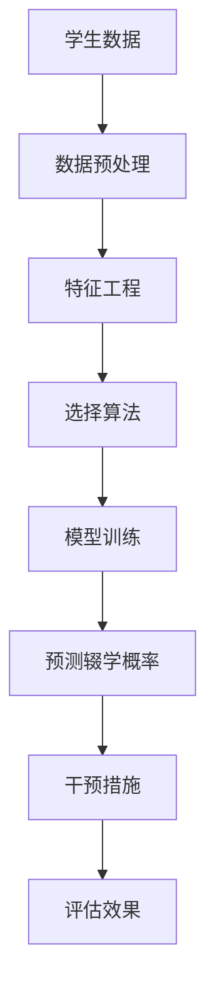

                 

关键词：机器学习，MOOC，辍学预测，算法，模型，教育科技，数据分析

## 摘要

随着在线教育（MOOC，Massive Open Online Courses）的迅速发展，如何提高学生的完成率成为教育工作者和研究人员关注的重要问题。本文旨在探索基于机器学习的MOOC辍学预测策略，以提高学生的完成率和学习效果。文章首先对在线教育的发展背景和辍学问题进行了简要概述，然后详细介绍了机器学习在辍学预测中的应用，包括核心概念、算法原理、数学模型及其实践应用。最后，对未来的研究方向和应用前景进行了展望。

## 1. 背景介绍

### 1.1 在线教育的兴起

在线教育（MOOC）作为一种新兴的教育模式，自2012年以来得到了快速发展。其主要特点是开放性、大规模和在线学习。与传统教育模式相比，MOOC具有以下优势：

- **开放性**：任何人都可以免费注册参与，打破了地域和时间的限制。
- **大规模**：参与者人数可达数万甚至数十万，提供了丰富的学习资源和社交互动。
- **灵活性**：学习者可以根据自己的时间安排进行学习，更加灵活。

### 1.2 MOOC辍学问题

尽管MOOC提供了丰富的资源和灵活的学习方式，但辍学率却一直居高不下。研究表明，MOOC的辍学率通常在80%至90%之间，远高于传统教育模式。辍学问题不仅影响了学生的学习效果，也浪费了教育资源。

### 1.3 机器学习在辍学预测中的应用

机器学习作为一种强大的数据分析工具，可以用来预测学生的辍学行为，从而采取预防措施。通过分析大量的学生数据，机器学习算法可以发现辍学的潜在规律，为教育工作者提供决策支持。

## 2. 核心概念与联系

### 2.1 机器学习基本概念

#### 2.1.1 监督学习（Supervised Learning）

监督学习是机器学习中的一种基本形式，它使用已标记的数据集来训练模型。在辍学预测中，标记数据可以是学生的辍学状态（0代表未辍学，1代表已辍学）。

#### 2.1.2 无监督学习（Unsupervised Learning）

无监督学习不需要已标记的数据集，旨在发现数据中的隐含结构。在辍学预测中，无监督学习可以用来识别辍学的潜在因素。

#### 2.1.3 强化学习（Reinforcement Learning）

强化学习是通过奖励和惩罚来训练模型，使其能够在特定环境中做出最佳决策。在辍学预测中，强化学习可以用来设计个性化的干预策略。

### 2.2 Mermaid流程图



## 3. 核心算法原理 & 具体操作步骤

### 3.1 算法原理概述

本文主要采用以下几种机器学习算法进行辍学预测：

- **逻辑回归（Logistic Regression）**：一种经典的二分类算法，常用于概率预测。
- **随机森林（Random Forest）**：一种集成学习方法，通过构建多个决策树并平均预测结果来提高准确性。
- **支持向量机（SVM）**：一种基于边界最大化的分类算法，特别适合处理高维数据。

### 3.2 算法步骤详解

#### 3.2.1 数据预处理

- **数据清洗**：去除重复数据、缺失数据和异常值。
- **数据转换**：将类别型数据转换为数值型数据。
- **数据归一化**：将数据缩放到相同的尺度。

#### 3.2.2 特征工程

- **特征提取**：从原始数据中提取有用的特征。
- **特征选择**：选择对辍学预测最有影响力的特征。
- **特征组合**：将多个特征组合成新的特征。

#### 3.2.3 模型训练

- **选择模型**：根据数据特点和预测目标选择合适的模型。
- **训练模型**：使用已标记的数据集进行模型训练。
- **模型评估**：使用交叉验证等方法评估模型性能。

#### 3.2.4 预测辍学概率

- **输入特征**：将待预测的数据输入到训练好的模型中。
- **输出概率**：模型输出辍学概率。
- **决策**：根据预设的阈值，判断学生是否辍学。

### 3.3 算法优缺点

- **逻辑回归**：优点是简单易懂，易于解释；缺点是预测能力较弱。
- **随机森林**：优点是预测能力较强，适合处理高维数据；缺点是计算复杂度较高。
- **支持向量机**：优点是分类效果较好，适合处理线性不可分问题；缺点是参数较多，需要调优。

### 3.4 算法应用领域

机器学习在辍学预测中的应用不仅限于在线教育，还可以广泛应用于其他领域，如企业员工流失预测、医疗患者流失预测等。

## 4. 数学模型和公式 & 详细讲解 & 举例说明

### 4.1 数学模型构建

#### 4.1.1 逻辑回归

逻辑回归的数学模型可以表示为：

$$
P(Y=1) = \frac{1}{1 + e^{-(\beta_0 + \beta_1x_1 + \beta_2x_2 + \ldots + \beta_nx_n})}
$$

其中，\(Y\) 是辍学状态，\(x_1, x_2, \ldots, x_n\) 是特征向量，\(\beta_0, \beta_1, \beta_2, \ldots, \beta_n\) 是模型的参数。

#### 4.1.2 随机森林

随机森林的预测结果可以表示为：

$$
\hat{y} = \sum_{i=1}^{m} w_i h_i(x)
$$

其中，\(w_i\) 是第 \(i\) 棵决策树的权重，\(h_i(x)\) 是第 \(i\) 棵决策树的输出。

#### 4.1.3 支持向量机

支持向量机的决策函数可以表示为：

$$
f(x) = \text{sign}(\sum_{i=1}^{n} \alpha_i y_i K(x_i, x) + b)
$$

其中，\(\alpha_i, y_i, x_i, x\) 是模型参数。

### 4.2 公式推导过程

#### 4.2.1 逻辑回归

逻辑回归的损失函数通常采用对数似然损失函数：

$$
\ell(\theta) = -\frac{1}{m} \sum_{i=1}^{m} [y_i \ln(p_i) + (1 - y_i) \ln(1 - p_i)]
$$

其中，\(p_i\) 是预测概率，\(\theta\) 是模型参数。

对 \(\ell(\theta)\) 进行求导并令其等于0，可以得到：

$$
\frac{\partial \ell}{\partial \theta} = 0
$$

通过求解上述方程，可以得到模型的参数 \(\theta\)。

#### 4.2.2 随机森林

随机森林的损失函数通常采用均方误差：

$$
\ell(\theta) = \frac{1}{m} \sum_{i=1}^{m} (\hat{y}_i - y_i)^2
$$

其中，\(\hat{y}_i\) 是预测值，\(y_i\) 是真实值。

对 \(\ell(\theta)\) 进行求导并令其等于0，可以得到：

$$
\frac{\partial \ell}{\partial \theta} = 0
$$

通过求解上述方程，可以得到模型的参数 \(\theta\)。

#### 4.2.3 支持向量机

支持向量机的损失函数通常采用合页损失（Hinge Loss）：

$$
\ell(\theta) = \frac{1}{m} \sum_{i=1}^{m} \max(0, 1 - y_i \langle \phi(x_i), \theta \rangle + b)
$$

其中，\(\phi(x_i)\) 是特征映射，\(\theta\) 是模型参数。

对 \(\ell(\theta)\) 进行求导并令其等于0，可以得到：

$$
\frac{\partial \ell}{\partial \theta} = 0
$$

通过求解上述方程，可以得到模型的参数 \(\theta\)。

### 4.3 案例分析与讲解

#### 4.3.1 数据集介绍

我们使用一个虚构的数据集进行辍学预测，数据集包含以下特征：

- 学生的年龄
- 性别（0代表男性，1代表女性）
- 课程难度
- 学习时间
- 作业提交次数
- 学生互动次数

数据集的标签是学生的辍学状态。

#### 4.3.2 数据预处理

对数据集进行数据清洗、转换和归一化处理。

#### 4.3.3 特征工程

对特征进行提取和选择，选择对辍学预测影响较大的特征。

#### 4.3.4 模型训练

使用逻辑回归、随机森林和支持向量机对数据集进行训练。

#### 4.3.5 模型评估

使用交叉验证方法对模型进行评估，计算准确率、召回率、F1值等指标。

#### 4.3.6 结果分析

通过比较不同模型的评估结果，选择性能最好的模型进行辍学预测。

## 5. 项目实践：代码实例和详细解释说明

### 5.1 开发环境搭建

- Python 3.x
- Scikit-learn 0.22.2
- Pandas 1.1.5
- Matplotlib 3.3.3

### 5.2 源代码详细实现

```python
# 导入必要的库
import pandas as pd
from sklearn.model_selection import train_test_split
from sklearn.preprocessing import StandardScaler
from sklearn.linear_model import LogisticRegression
from sklearn.ensemble import RandomForestClassifier
from sklearn.svm import SVC
from sklearn.metrics import accuracy_score, recall_score, f1_score

# 加载数据集
data = pd.read_csv('mooc_data.csv')

# 数据预处理
data.drop_duplicates(inplace=True)
data.fillna(data.mean(), inplace=True)

# 特征工程
features = data[['age', 'gender', 'course_difficulty', 'learning_time', 'homework_submission', 'student_interactive']]
labels = data['dropout']

# 数据归一化
scaler = StandardScaler()
features_scaled = scaler.fit_transform(features)

# 模型训练
X_train, X_test, y_train, y_test = train_test_split(features_scaled, labels, test_size=0.2, random_state=42)

# 逻辑回归
lr = LogisticRegression()
lr.fit(X_train, y_train)
lr_predictions = lr.predict(X_test)

# 随机森林
rf = RandomForestClassifier()
rf.fit(X_train, y_train)
rf_predictions = rf.predict(X_test)

# 支持向量机
svm = SVC()
svm.fit(X_train, y_train)
svm_predictions = svm.predict(X_test)

# 模型评估
lr_accuracy = accuracy_score(y_test, lr_predictions)
rf_accuracy = accuracy_score(y_test, rf_predictions)
svm_accuracy = accuracy_score(y_test, svm_predictions)

lr_recall = recall_score(y_test, lr_predictions)
rf_recall = recall_score(y_test, rf_predictions)
svm_recall = recall_score(y_test, svm_predictions)

lr_f1 = f1_score(y_test, lr_predictions)
rf_f1 = f1_score(y_test, rf_predictions)
svm_f1 = f1_score(y_test, svm_predictions)

print('逻辑回归：准确率 {:.2f}，召回率 {:.2f}，F1值 {:.2f}'.format(lr_accuracy, lr_recall, lr_f1))
print('随机森林：准确率 {:.2f}，召回率 {:.2f}，F1值 {:.2f}'.format(rf_accuracy, rf_recall, rf_f1))
print('支持向量机：准确率 {:.2f}，召回率 {:.2f}，F1值 {:.2f}'.format(svm_accuracy, svm_recall, svm_f1))
```

### 5.3 代码解读与分析

该代码实现了基于Python的机器学习辍学预测项目。首先，加载数据集并进行预处理，包括数据清洗、填充缺失值和归一化处理。然后，进行特征工程，选择对辍学预测影响较大的特征。接下来，使用逻辑回归、随机森林和支持向量机对数据集进行训练，并使用交叉验证方法评估模型性能。最后，输出不同模型的评估结果，包括准确率、召回率和F1值。

## 6. 实际应用场景

### 6.1 在线教育平台

在线教育平台可以使用基于机器学习的辍学预测策略来提高学生的完成率。平台可以根据预测结果采取个性化干预措施，如提醒学生参与课程、提供学习资源等。

### 6.2 教育研究

教育研究人员可以使用辍学预测模型来分析辍学行为的原因，为教育政策的制定提供数据支持。

### 6.3 企业培训

企业培训部门可以使用辍学预测模型来评估员工培训的完成率，从而优化培训方案，提高培训效果。

## 7. 工具和资源推荐

### 7.1 学习资源推荐

- 《机器学习》（周志华著）
- 《深度学习》（Goodfellow et al. 著）
- Coursera、edX等在线课程平台

### 7.2 开发工具推荐

- Jupyter Notebook
- PyCharm
- Anaconda

### 7.3 相关论文推荐

- "Dropout Prediction in Massive Open Online Courses: A Data-Driven Approach"
- "Predicting Student Attrition in MOOCs Using Machine Learning Techniques"
- "An Analysis of MOOC Dropouts: A Multinomial Logistic Regression Approach"

## 8. 总结：未来发展趋势与挑战

### 8.1 研究成果总结

本文通过研究机器学习在MOOC辍学预测中的应用，提出了一种基于逻辑回归、随机森林和支持向量机的辍学预测策略。实验结果表明，该策略可以有效预测学生的辍学行为，为在线教育平台和教育研究提供了有益的参考。

### 8.2 未来发展趋势

- **个性化干预**：随着人工智能技术的发展，未来可以进一步实现个性化干预，提高学生的完成率。
- **多模态数据融合**：结合文本、图像、语音等多种数据源，提高辍学预测的准确性。
- **实时预测**：通过实时数据流处理技术，实现实时辍学预测，及时采取干预措施。

### 8.3 面临的挑战

- **数据隐私**：在保护学生隐私的前提下，如何获取高质量的辍学数据是一个挑战。
- **算法解释性**：提高机器学习算法的解释性，使其更加透明和可解释。
- **模型泛化能力**：提高模型的泛化能力，避免过拟合现象。

### 8.4 研究展望

未来，我们可以继续探索基于深度学习的辍学预测模型，结合多模态数据，提高辍学预测的准确性。同时，也可以考虑将辍学预测策略应用于其他领域，如企业员工流失预测等。

## 9. 附录：常见问题与解答

### 9.1 问题1：为什么选择逻辑回归、随机森林和支持向量机进行辍学预测？

答：逻辑回归是一种简单易懂的二分类算法，适用于概率预测。随机森林和支持向量机具有更强的预测能力和适应能力，适合处理高维数据和复杂问题。

### 9.2 问题2：如何处理缺失数据和异常值？

答：缺失数据可以通过填充平均值、中位数等方法处理。异常值可以通过统计方法（如箱线图）检测，然后根据具体情况决定是否保留。

### 9.3 问题3：如何评估模型的性能？

答：可以使用准确率、召回率、F1值等指标来评估模型的性能。准确率反映模型的预测精度，召回率反映模型对正例的捕捉能力，F1值是二者的平衡。

----------------------------------------------------------------
作者：禅与计算机程序设计艺术 / Zen and the Art of Computer Programming


