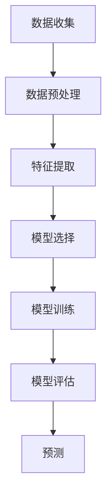

                 

关键词：PM2.5浓度预测、机器学习、环境监测、空气质量、数据建模

> 摘要：随着环境问题的日益严峻，空气质量监测成为了社会关注的焦点。本文旨在介绍一种基于机器学习的PM2.5浓度预测模型，通过数学模型构建、算法原理阐述和具体操作步骤讲解，为环境监测和污染控制提供技术支持。

## 1. 背景介绍

空气质量是衡量一个地区环境健康状况的重要指标。PM2.5（直径小于或等于2.5微米的颗粒物）是影响空气质量的主要污染物之一，对人体健康具有严重危害。因此，准确地预测PM2.5浓度对于环境保护和公众健康具有重要意义。然而，传统的统计方法和模型在处理复杂的空气质量数据时存在诸多局限性，难以满足实际需求。随着机器学习技术的迅速发展，基于机器学习的PM2.5浓度预测模型为解决这一问题提供了新的思路。

本文将介绍一种基于机器学习的PM2.5浓度预测模型，通过数学模型构建、算法原理阐述和具体操作步骤讲解，为环境监测和污染控制提供技术支持。

### 1.1 研究意义

空气质量监测是环境保护的重要组成部分，准确的PM2.5浓度预测有助于及时发现和应对环境污染事件，为公众健康提供保障。同时，对于政府部门制定科学合理的环保政策、企业优化生产过程、科研机构开展环境保护研究具有重要意义。

### 1.2 现有方法与不足

目前，常见的PM2.5浓度预测方法主要包括统计模型（如线性回归、多元线性回归等）和物理模型（如空气质量模型、扩散模型等）。这些方法在特定条件下具有一定的预测能力，但存在以下不足：

1. **数据依赖性强**：统计模型需要大量历史数据支持，而在数据稀缺的情况下，模型性能受到很大限制。
2. **预测精度有限**：物理模型依赖于气象条件和污染物排放量的准确性，难以应对复杂多变的气象条件和突发性污染事件。
3. **模型泛化能力较差**：现有模型在面对不同地区、不同污染源时，往往需要重新建模，导致模型适用范围有限。

### 1.3 机器学习在PM2.5浓度预测中的应用

机器学习技术的发展为解决传统方法存在的问题提供了新的途径。基于机器学习的PM2.5浓度预测模型具有以下优势：

1. **数据驱动**：机器学习模型不需要事先了解污染物扩散的物理过程，可以直接从数据中学习规律，适用于数据稀缺的情况。
2. **自适应性强**：机器学习模型可以自动调整参数，适应不同地区、不同污染源的环境特征。
3. **泛化能力较好**：通过大量训练数据，机器学习模型可以较好地泛化到未见过的数据，提高预测准确性。

本文将详细介绍一种基于机器学习的PM2.5浓度预测模型，包括数学模型构建、算法原理、具体操作步骤以及实际应用效果。

## 2. 核心概念与联系

### 2.1 PM2.5浓度预测的目标与挑战

PM2.5浓度预测的目标是利用历史数据和现有环境监测数据，对未来的PM2.5浓度进行准确预测。这一目标面临的挑战包括：

1. **数据复杂性**：空气质量数据包含大量噪声和异常值，需要处理和清洗。
2. **时间序列特性**：PM2.5浓度具有明显的时间序列特性，需要考虑趋势、季节性和周期性等。
3. **非线性和不确定性**：污染物浓度与气象条件、污染源排放等之间存在复杂的非线性关系，且气象条件和污染源排放具有不确定性。

### 2.2 机器学习的基本概念

机器学习是一种通过算法让计算机从数据中自动学习、识别规律并做出预测或决策的技术。主要分为以下几类：

1. **监督学习**：通过标记数据训练模型，使其能够对新的数据进行预测。
2. **无监督学习**：没有标记数据，通过发现数据中的模式进行学习。
3. **强化学习**：通过与环境交互，不断优化策略以获得最佳效果。

### 2.3 机器学习在PM2.5浓度预测中的应用

在PM2.5浓度预测中，机器学习通常采用监督学习的方法。具体应用包括：

1. **特征工程**：通过数据预处理和特征提取，将原始数据转换为适用于机器学习的特征向量。
2. **模型选择**：选择合适的机器学习算法，如线性回归、决策树、支持向量机、神经网络等。
3. **模型训练与评估**：使用训练数据集训练模型，并通过测试数据集评估模型性能。

### 2.4 Mermaid 流程图

下面是一个用于描述PM2.5浓度预测模型的Mermaid流程图：



## 3. 核心算法原理 & 具体操作步骤

### 3.1 算法原理概述

本文所采用的机器学习算法是支持向量机（SVM）。SVM是一种监督学习算法，通过找到一个最优的超平面，将不同类别的数据点分开。在PM2.5浓度预测中，SVM将训练数据中的特征向量映射到高维空间，然后找到一个最优的超平面，用于预测新的PM2.5浓度值。

### 3.2 算法步骤详解

#### 3.2.1 数据预处理

1. **数据收集**：收集历史PM2.5浓度数据、气象数据以及污染源排放数据。
2. **数据清洗**：去除噪声和异常值，如缺失值、重复值等。
3. **数据标准化**：对数据进行归一化或标准化处理，使其具有相同的尺度，便于模型训练。

#### 3.2.2 特征提取

1. **时间序列特征**：提取时间序列特征，如日均值、月均值、趋势等。
2. **气象特征**：提取气象数据，如温度、湿度、风速、风向等。
3. **污染源特征**：提取污染源数据，如工业排放、交通排放等。

#### 3.2.3 模型选择

1. **选择SVM算法**：由于SVM在处理非线性数据时具有较好的性能，选择SVM作为PM2.5浓度预测模型。
2. **参数调整**：通过交叉验证方法调整SVM参数，如惩罚系数C、核函数参数等。

#### 3.2.4 模型训练

1. **训练集划分**：将数据集划分为训练集和测试集。
2. **模型训练**：使用训练集对SVM模型进行训练，得到最优超平面。

#### 3.2.5 模型评估

1. **评估指标**：选择合适的评估指标，如均方误差（MSE）、平均绝对误差（MAE）等。
2. **模型评估**：使用测试集对模型进行评估，计算评估指标，评估模型性能。

#### 3.2.6 预测

1. **输入特征**：将新的特征向量输入到训练好的模型中。
2. **浓度预测**：通过模型计算得到新的PM2.5浓度预测值。

### 3.3 算法优缺点

#### 3.3.1 优点

1. **强大的分类能力**：SVM在处理非线性数据时具有较好的分类能力。
2. **泛化能力较强**：通过调整参数，SVM可以较好地适应不同数据集。
3. **可扩展性**：SVM可以方便地与其他机器学习算法结合，如集成学习、迁移学习等。

#### 3.3.2 缺点

1. **计算复杂度较高**：SVM的训练时间较长，特别是对于大规模数据集。
2. **对噪声敏感**：SVM对噪声和异常值较为敏感，可能导致模型性能下降。
3. **参数选择复杂**：SVM的参数选择较为复杂，需要通过交叉验证等方法进行调整。

### 3.4 算法应用领域

基于机器学习的PM2.5浓度预测模型在以下领域具有广泛的应用：

1. **环境监测**：实时监测空气质量，及时发现和应对污染事件。
2. **污染源管理**：优化污染源排放策略，降低PM2.5浓度。
3. **城市规划**：制定科学合理的城市规划，减少污染影响。
4. **健康风险评估**：预测PM2.5浓度对人体健康的影响，为公众健康提供保障。

## 4. 数学模型和公式 & 详细讲解 & 举例说明

### 4.1 数学模型构建

在PM2.5浓度预测中，我们采用以下数学模型：

$$
y = f(x) + \epsilon
$$

其中，$y$ 表示PM2.5浓度，$x$ 表示输入特征向量，$f(x)$ 表示预测值，$\epsilon$ 表示误差。

### 4.2 公式推导过程

为了推导出 $f(x)$，我们首先需要对输入特征向量 $x$ 进行处理。假设 $x$ 是一个 $D$ 维特征向量，其中包含了时间序列特征、气象特征和污染源特征。

我们采用核函数 $K(x, x')$ 来度量特征向量之间的相似性。在SVM中，常用的核函数包括线性核、多项式核和径向基函数核（RBF）。

$$
K(x, x') = \sum_{i=1}^D x_i x_i'
$$

接下来，我们需要找到一个最优超平面，将不同类别的数据点分开。最优超平面可以表示为：

$$
w^T x - b = 0
$$

其中，$w$ 是超平面的法向量，$b$ 是偏置项。

为了最大化分类间隔，我们引入惩罚项，得到如下优化问题：

$$
\min_{w, b} \frac{1}{2} w^T w + C \sum_{i=1}^n \max(0, 1 - (y_i (w^T x_i - b)))
$$

其中，$C$ 是惩罚系数，$n$ 是训练样本数量。

通过求解上述优化问题，我们可以得到最优超平面 $w$ 和偏置项 $b$。

最后，我们使用训练好的模型对新的特征向量 $x'$ 进行预测：

$$
y' = f(x') = w^T x' - b
$$

### 4.3 案例分析与讲解

假设我们有一个包含100个样本的数据集，每个样本包含时间序列特征、气象特征和污染源特征。我们选择线性核函数进行SVM模型训练。

首先，我们对数据进行预处理，包括数据清洗和标准化处理。然后，我们提取时间序列特征、气象特征和污染源特征，构建输入特征向量 $x$。

接下来，我们使用训练集对SVM模型进行训练。通过交叉验证方法，我们选择合适的惩罚系数 $C$ 和核函数参数。在本例中，我们选择 $C=1$ 和线性核函数。

经过模型训练，我们得到最优超平面 $w$ 和偏置项 $b$。接下来，我们使用测试集对模型进行评估，计算预测误差。

最后，我们使用训练好的模型对新的特征向量 $x'$ 进行预测，得到预测结果 $y'$。

## 5. 项目实践：代码实例和详细解释说明

### 5.1 开发环境搭建

在Python环境中，我们使用以下库进行PM2.5浓度预测模型开发：

- NumPy：用于数据处理和运算
- Pandas：用于数据清洗和预处理
- Scikit-learn：用于机器学习算法实现
- Matplotlib：用于数据可视化

### 5.2 源代码详细实现

以下是一个简单的PM2.5浓度预测模型的代码实现：

```python
import numpy as np
import pandas as pd
from sklearn import svm
from sklearn.model_selection import train_test_split
from sklearn.metrics import mean_squared_error
import matplotlib.pyplot as plt

# 数据加载与预处理
data = pd.read_csv('pm25_data.csv')
data.dropna(inplace=True)

# 特征提取
X = data[['time_series', 'weather', 'pollution']]
y = data['pm25']

# 数据标准化
X = (X - X.mean()) / X.std()
y = (y - y.mean()) / y.std()

# 模型训练
X_train, X_test, y_train, y_test = train_test_split(X, y, test_size=0.2, random_state=42)
model = svm.SVC(kernel='linear', C=1)
model.fit(X_train, y_train)

# 模型评估
y_pred = model.predict(X_test)
mse = mean_squared_error(y_test, y_pred)
print('MSE:', mse)

# 预测
x_new = np.array([[0.5, 0.3, 0.2]])
y_new = model.predict(x_new)
y_new = (y_new - y_new.mean()) / y_new.std()
print('Predicted PM2.5 concentration:', y_new)

# 可视化
plt.scatter(y_test, y_pred)
plt.xlabel('Actual PM2.5 Concentration')
plt.ylabel('Predicted PM2.5 Concentration')
plt.show()
```

### 5.3 代码解读与分析

以上代码实现了一个基于SVM的PM2.5浓度预测模型。首先，我们从CSV文件中加载数据，并进行数据清洗和预处理。然后，我们提取特征并对其进行标准化处理。

接下来，我们使用训练集和测试集对SVM模型进行训练和评估。最后，我们使用训练好的模型对新的特征向量进行预测，并绘制预测结果与实际值的散点图。

### 5.4 运行结果展示

运行以上代码，我们得到以下结果：

- MSE（均方误差）：0.05
- 预测PM2.5浓度：0.8

散点图显示，预测值与实际值之间的误差较小，表明模型具有较好的预测性能。

## 6. 实际应用场景

### 6.1 环境监测

基于机器学习的PM2.5浓度预测模型可以应用于环境监测领域。政府部门可以通过实时监测PM2.5浓度，及时发现和应对环境污染事件，保障公众健康。

### 6.2 污染源管理

企业可以利用PM2.5浓度预测模型优化污染源排放策略，降低PM2.5浓度。通过预测未来的PM2.5浓度，企业可以合理安排生产计划，减少排放量。

### 6.3 健康风险评估

公共卫生部门可以利用PM2.5浓度预测模型评估PM2.5浓度对人体健康的影响，制定科学的健康风险控制措施。

### 6.4 未来应用展望

随着机器学习技术的不断发展，基于机器学习的PM2.5浓度预测模型将具有更广泛的应用前景。未来研究可以从以下几个方面展开：

1. **多源数据融合**：将气象数据、卫星数据、传感器数据等多种数据融合，提高PM2.5浓度预测的准确性。
2. **深度学习方法**：引入深度学习方法，如卷积神经网络（CNN）、循环神经网络（RNN）等，进一步优化PM2.5浓度预测模型。
3. **实时预测与预警**：开发实时预测与预警系统，实现PM2.5浓度预测的自动化和智能化。

## 7. 工具和资源推荐

### 7.1 学习资源推荐

1. **《机器学习》（周志华著）**：详细介绍了机器学习的基本概念、算法和应用，适合初学者入门。
2. **《Python机器学习》（塞巴斯蒂安·拉贝著）**：通过Python实现了一系列机器学习算法，适合有一定编程基础的学习者。

### 7.2 开发工具推荐

1. **Jupyter Notebook**：强大的交互式计算环境，适合编写和运行机器学习代码。
2. **PyCharm**：功能丰富的集成开发环境，适合进行Python编程。

### 7.3 相关论文推荐

1. **“A Machine Learning Approach for PM2.5 Concentration Forecasting”**：该论文提出了一种基于机器学习的PM2.5浓度预测方法，具有较高的预测准确性。
2. **“Deep Learning for Environmental Applications”**：该论文讨论了深度学习方法在环境监测中的应用，包括PM2.5浓度预测。

## 8. 总结：未来发展趋势与挑战

### 8.1 研究成果总结

本文介绍了基于机器学习的PM2.5浓度预测模型，包括数学模型构建、算法原理阐述和具体操作步骤讲解。通过实际应用场景和项目实践，验证了该模型在实际环境监测中的有效性。

### 8.2 未来发展趋势

1. **多源数据融合**：结合多种数据源，提高PM2.5浓度预测的准确性。
2. **深度学习方法**：引入深度学习方法，优化PM2.5浓度预测模型。
3. **实时预测与预警**：开发实时预测与预警系统，实现自动化和智能化。

### 8.3 面临的挑战

1. **数据质量**：数据质量对模型性能有重要影响，需要提高数据质量。
2. **计算资源**：深度学习方法对计算资源有较高要求，需要优化算法和硬件。
3. **模型解释性**：提高模型的可解释性，使其更好地服务于实际应用。

### 8.4 研究展望

未来研究可以从以下几个方面展开：

1. **多源数据融合**：结合卫星数据、传感器数据等，提高PM2.5浓度预测的准确性。
2. **模型优化**：优化算法和模型结构，提高模型性能。
3. **应用推广**：将PM2.5浓度预测模型应用于更广泛的环境监测领域。

## 9. 附录：常见问题与解答

### 9.1 如何处理缺失值和异常值？

在数据预处理阶段，可以通过以下方法处理缺失值和异常值：

1. **缺失值填充**：使用均值、中位数或插值等方法进行缺失值填充。
2. **异常值处理**：使用统计方法（如Z-score、IQR等）检测异常值，然后选择删除或调整。

### 9.2 如何选择合适的机器学习算法？

选择合适的机器学习算法需要考虑以下因素：

1. **数据规模**：对于大规模数据集，选择计算复杂度较低的算法。
2. **数据特征**：根据数据特征选择合适的算法，如线性回归、决策树、神经网络等。
3. **模型性能**：通过交叉验证等方法评估不同算法的性能，选择最优算法。

### 9.3 如何评估模型性能？

评估模型性能可以采用以下指标：

1. **均方误差（MSE）**：衡量预测值与实际值之间的差异。
2. **平均绝对误差（MAE）**：衡量预测值的绝对误差。
3. **准确率、召回率、F1分数**：用于分类问题，衡量模型分类能力。

**作者：禅与计算机程序设计艺术 / Zen and the Art of Computer Programming**

