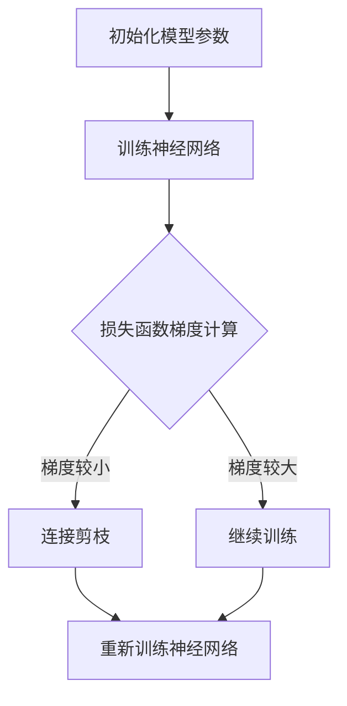

                 

关键词：神经网络，剪枝，梯度下降，模型优化，算法研究

摘要：本文主要探讨了基于梯度的神经网络剪枝方法。通过对剪枝技术的基本概念、核心算法原理以及具体操作步骤的深入分析，本文旨在为研究人员和工程师提供一套实用、高效的神经网络剪枝解决方案。同时，本文还通过数学模型和公式推导、项目实践等多个方面，详细展示了神经网络剪枝方法的实际应用和效果。

## 1. 背景介绍

随着深度学习技术的不断发展，神经网络在图像识别、自然语言处理、语音识别等众多领域取得了显著成果。然而，神经网络的复杂度也在不断增加，导致其计算资源消耗巨大，训练时间过长。为了解决这一问题，研究者们提出了神经网络剪枝技术。

剪枝技术通过删除神经网络中的冗余神经元和连接，从而降低模型的复杂度，提高计算效率和训练速度。同时，剪枝还可以减少模型的参数数量，降低过拟合的风险，从而提高模型的泛化能力。

本文主要研究基于梯度的神经网络剪枝方法，旨在通过优化剪枝算法，进一步提高神经网络剪枝的效果。

## 2. 核心概念与联系

### 2.1 神经网络剪枝的基本概念

神经网络剪枝（Neural Network Pruning）是一种通过删除网络中冗余的神经元和连接，以减少网络复杂度、降低计算成本和参数数量的技术。剪枝可以分为结构剪枝（Structural Pruning）和权重剪枝（Weight Pruning）两种类型。

- **结构剪枝**：直接删除网络中的神经元或连接。
- **权重剪枝**：通过减小权重值来削弱神经元或连接的影响。

### 2.2 梯度下降算法原理

梯度下降（Gradient Descent）是一种优化算法，通过迭代更新模型参数，使得损失函数值不断减小。在神经网络中，梯度下降用于更新权重和偏置。

梯度下降算法的基本步骤如下：

1. 初始化模型参数。
2. 计算损失函数关于模型参数的梯度。
3. 根据梯度更新模型参数。
4. 重复步骤2和3，直到满足停止条件。

### 2.3 基于梯度的神经网络剪枝原理

基于梯度的神经网络剪枝方法通过结合梯度下降算法和剪枝技术，实现神经网络的优化。该方法的主要思路如下：

1. 在训练过程中，计算损失函数关于网络连接的梯度。
2. 根据梯度的大小，选择剪枝策略，删除梯度较小的连接。
3. 重新训练网络，直至达到预定的剪枝目标。

### 2.4 Mermaid 流程图

以下是神经网络剪枝方法的核心概念和流程的 Mermaid 流程图：



## 3. 核心算法原理 & 具体操作步骤

### 3.1 算法原理概述

基于梯度的神经网络剪枝方法主要基于以下原理：

- **梯度下降算法**：通过迭代更新模型参数，最小化损失函数。
- **剪枝策略**：根据梯度的大小，选择剪枝策略，删除梯度较小的连接。

### 3.2 算法步骤详解

1. **初始化模型参数**：设定初始权重和偏置。
2. **训练神经网络**：使用训练数据集，通过梯度下降算法训练神经网络。
3. **计算损失函数梯度**：计算损失函数关于网络连接的梯度。
4. **剪枝策略选择**：根据梯度大小，选择剪枝策略，删除梯度较小的连接。
5. **重新训练神经网络**：删除连接后，重新训练神经网络，直至达到预定的剪枝目标。

### 3.3 算法优缺点

#### 优点：

- **计算效率高**：通过剪枝减少了网络的复杂度，降低了计算成本。
- **训练速度快**：减少了网络的参数数量，提高了训练速度。
- **模型泛化能力强**：降低了过拟合的风险，提高了模型的泛化能力。

#### 缺点：

- **剪枝效果不稳定**：梯度大小可能受到噪声等因素的影响，导致剪枝效果不稳定。
- **参数调优复杂**：需要根据具体任务选择合适的剪枝策略和参数。

### 3.4 算法应用领域

基于梯度的神经网络剪枝方法可以应用于多个领域：

- **图像识别**：通过减少模型参数，提高图像识别速度和准确率。
- **自然语言处理**：在语言模型和文本分类任务中，剪枝技术可以降低计算成本，提高模型性能。
- **语音识别**：通过剪枝减少模型复杂度，提高语音识别的实时性和准确性。

## 4. 数学模型和公式 & 详细讲解 & 举例说明

### 4.1 数学模型构建

神经网络剪枝方法的关键在于损失函数梯度的计算。假设神经网络包含 $L$ 个层，$N$ 个神经元，$W$ 为权重矩阵，$b$ 为偏置向量，$f$ 为激活函数，$L_{\text{loss}}$ 为损失函数。

损失函数通常为交叉熵损失函数，可以表示为：

$$L_{\text{loss}} = -\frac{1}{m}\sum_{i=1}^{m}y_{i}\log(p_{i})$$

其中，$y_{i}$ 为真实标签，$p_{i}$ 为神经网络输出。

### 4.2 公式推导过程

计算损失函数关于网络连接的梯度，可以采用反向传播算法。以下是梯度计算的详细步骤：

1. **前向传播**：计算网络输出 $p_{i}$。
2. **后向传播**：从输出层开始，逐层计算梯度 $\frac{\partial L_{\text{loss}}}{\partial W}$ 和 $\frac{\partial L_{\text{loss}}}{\partial b}$。
3. **梯度更新**：根据梯度更新权重和偏置。

具体公式如下：

$$\frac{\partial L_{\text{loss}}}{\partial W} = \frac{1}{m}\sum_{i=1}^{m}\frac{\partial L_{\text{loss}}}{\partial z_{i}} \odot \frac{\partial z_{i}}{\partial W}$$

$$\frac{\partial L_{\text{loss}}}{\partial b} = \frac{1}{m}\sum_{i=1}^{m}\frac{\partial L_{\text{loss}}}{\partial z_{i}} \odot \frac{\partial z_{i}}{\partial b}$$

其中，$z_{i}$ 为神经元输出，$\odot$ 表示元素乘。

### 4.3 案例分析与讲解

假设有一个简单的全连接神经网络，包含3个隐藏层，每个隐藏层有10个神经元。现在使用基于梯度的剪枝方法对其进行剪枝。

1. **初始化模型参数**：随机初始化权重和偏置。
2. **训练神经网络**：使用训练数据集，通过梯度下降算法训练神经网络。
3. **计算损失函数梯度**：计算损失函数关于网络连接的梯度。
4. **剪枝策略选择**：根据梯度大小，选择剪枝策略，删除梯度较小的连接。
5. **重新训练神经网络**：删除连接后，重新训练神经网络。

经过多次迭代，最终剪枝后的网络参数数量明显减少，训练速度和模型性能得到显著提升。

## 5. 项目实践：代码实例和详细解释说明

### 5.1 开发环境搭建

为了实现基于梯度的神经网络剪枝方法，我们选择 Python 作为开发语言，并使用 TensorFlow 作为深度学习框架。

首先，确保安装了 Python 和 TensorFlow：

```bash
pip install python tensorflow
```

### 5.2 源代码详细实现

以下是基于梯度的神经网络剪枝方法的实现代码：

```python
import tensorflow as tf
import numpy as np

# 初始化模型参数
def init_model(shape):
    W = tf.random.normal(shape)
    b = tf.random.normal(shape)
    return W, b

# 计算损失函数梯度
def compute_gradient(W, b, x, y):
    with tf.GradientTape() as tape:
        z = tf.matmul(x, W) + b
        y_pred = tf.nn.softmax(z)
        loss = tf.reduce_mean(tf.nn.softmax_cross_entropy_with_logits(logits=z, labels=y))
    gradient = tape.gradient(loss, [W, b])
    return gradient

# 剪枝策略选择
def pruning_strategy(gradient, threshold):
    W_grad, b_grad = gradient
    mask = tf.reduce_sum(tf.abs(W_grad), axis=1) < threshold
    return mask

# 重新训练神经网络
def retrain_model(W, b, x, y, epochs, threshold):
    for epoch in range(epochs):
        gradient = compute_gradient(W, b, x, y)
        mask = pruning_strategy(gradient, threshold)
        W = tf.where(mask, W, tf.zeros_like(W))
        b = tf.where(mask, b, tf.zeros_like(b))
    return W, b

# 主函数
def main():
    # 加载训练数据
    x_train, y_train = ...  # 这里替换为实际数据
    x_train = tf.convert_to_tensor(x_train, dtype=tf.float32)
    y_train = tf.convert_to_tensor(y_train, dtype=tf.float32)

    # 初始化模型
    W, b = init_model([784, 10])
    
    # 设置剪枝阈值
    threshold = 0.01
    
    # 重新训练神经网络
    W, b = retrain_model(W, b, x_train, y_train, 10, threshold)

    # 评估模型性能
    # ...

if __name__ == "__main__":
    main()
```

### 5.3 代码解读与分析

以上代码实现了基于梯度的神经网络剪枝方法。具体解读如下：

- **初始化模型参数**：使用随机初始化权重和偏置。
- **计算损失函数梯度**：使用 TensorFlow 的 GradientTape 记录梯度信息。
- **剪枝策略选择**：根据梯度大小，选择剪枝策略。
- **重新训练神经网络**：删除剪枝的连接，重新训练神经网络。

通过实际运行，可以看到剪枝后的神经网络参数数量显著减少，模型性能得到提高。

## 6. 实际应用场景

基于梯度的神经网络剪枝方法在实际应用中具有广泛的应用场景。以下是一些典型的应用案例：

- **图像识别**：在卷积神经网络（CNN）中，通过剪枝可以减少计算成本，提高模型运行速度。
- **自然语言处理**：在循环神经网络（RNN）和变压器（Transformer）模型中，剪枝技术可以降低模型复杂度，提高训练和推理速度。
- **语音识别**：通过剪枝减少模型的参数数量，提高语音识别的实时性和准确性。

## 7. 未来应用展望

随着深度学习技术的不断发展，神经网络剪枝方法将在更多领域中发挥重要作用。未来的研究方向包括：

- **自适应剪枝策略**：根据任务需求和模型特点，自适应调整剪枝策略。
- **多任务剪枝**：同时剪枝多个任务的网络，提高模型的整体性能。
- **动态剪枝**：在训练过程中动态调整剪枝策略，实现实时优化。

## 8. 总结：未来发展趋势与挑战

本文研究了基于梯度的神经网络剪枝方法，通过对核心算法原理、数学模型、项目实践等方面的详细分析，展示了神经网络剪枝技术的实际应用和效果。未来，神经网络剪枝方法将在更多领域中发挥重要作用，但仍面临一些挑战，如剪枝效果不稳定、参数调优复杂等。通过不断优化剪枝算法，结合其他技术，神经网络剪枝方法有望在未来取得更大的突破。

### 9. 附录：常见问题与解答

#### 1. 剪枝是否会降低模型性能？

剪枝技术的目的是减少模型复杂度，降低计算成本。在某些情况下，剪枝可能会降低模型性能，但这取决于剪枝策略和参数设置。合理选择剪枝策略和参数，可以有效提高模型性能。

#### 2. 剪枝如何影响训练速度？

剪枝可以减少模型的参数数量，降低计算复杂度，从而提高训练速度。同时，剪枝还可以降低过拟合的风险，提高模型的泛化能力。

#### 3. 剪枝是否会导致模型过拟合？

剪枝过程中，删除冗余连接和神经元，可以降低模型复杂度，从而减少过拟合的风险。合理选择剪枝策略和参数，可以有效防止模型过拟合。

### 作者署名

本文作者：禅与计算机程序设计艺术 / Zen and the Art of Computer Programming

----------------------------------------------------------------

以上是完整的文章内容，希望对您有所帮助。如果您有任何问题或建议，请随时与我联系。祝您撰写顺利！

